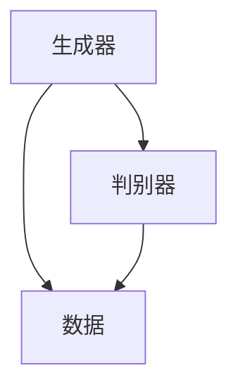
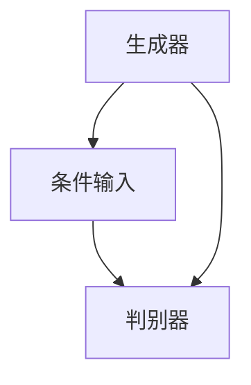
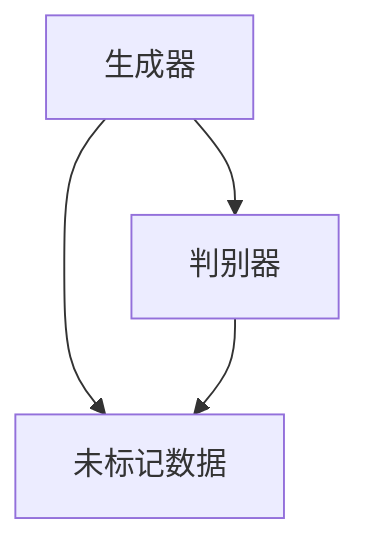
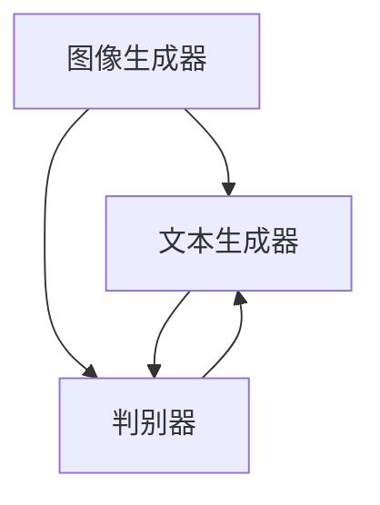

                 

关键词：生成式AI、AIGC、幻觉问题、结果不可控、落地难度

摘要：本文深入探讨了生成式人工智能（AIGC）的现状与挑战。从幻觉问题到结果不可控，分析了AIGC在落地过程中遇到的核心难题，并探讨了可能解决这些问题的方法。文章旨在为读者提供对AIGC技术的全面理解和未来发展的思考。

## 1. 背景介绍

### 1.1 生成式AI的概念与起源

生成式人工智能（Generative AI，简称GAI）是一种能够生成文本、图像、音频等数据的人工智能技术。这种技术的核心在于学习大量的数据，并能够根据这些数据生成新的、类似的数据。生成式AI的起源可以追溯到20世纪80年代的生成对抗网络（GANs），由Ian Goodfellow等人提出。此后，随着深度学习技术的飞速发展，生成式AI的应用领域不断拓展。

### 1.2 AIGC的发展与应用

随着生成式AI技术的不断进步，AIGC（AI Generated Content）概念逐渐兴起。AIGC涵盖了生成式AI在各个领域的应用，包括文本生成、图像生成、音频生成等。从内容创作、数据增强到自动化编程，AIGC正在改变内容生产的方式。例如，在图像生成领域，AIGC技术已经被应用于艺术创作、游戏设计、医疗影像等；在文本生成领域，AIGC技术则被应用于新闻报道、广告文案、小说创作等。

## 2. 核心概念与联系

在深入探讨AIGC的落地难度之前，我们首先需要理解AIGC的核心概念及其工作原理。以下是AIGC的核心概念及其相互联系：

### 2.1 生成模型

生成模型是AIGC的核心组成部分，包括生成对抗网络（GANs）、变分自编码器（VAEs）等。这些模型通过学习大量数据来生成新的数据，其基本原理是生成器和判别器的对抗训练。

### 2.2 条件生成模型

条件生成模型扩展了生成模型的功能，允许在生成过程中引入外部条件。这种模型在生成特定类型的内容时非常有用，如根据文本生成图像、根据语音生成音乐等。

### 2.3 自监督学习

自监督学习是一种数据高效的学习方法，它利用未标记的数据来训练模型。自监督学习在生成模型中起着至关重要的作用，因为它可以减少对大量标记数据的依赖。

### 2.4 联合生成模型

联合生成模型结合了多个生成模型，用于生成复杂的多模态内容。例如，在图像和文本联合生成中，一个模型负责生成图像，另一个模型负责生成对应的文本。

## 3. 核心算法原理 & 具体操作步骤

### 3.1 算法原理概述

生成式AIGC的核心算法主要包括生成对抗网络（GANs）、变分自编码器（VAEs）和自编码器（AEs）。这些算法通过学习大量的数据分布来生成新的数据。

### 3.2 算法步骤详解

#### 3.2.1 GANs

1. **生成器（Generator）**：生成器学习如何生成与训练数据分布相似的数据。

2. **判别器（Discriminator）**：判别器学习如何区分生成器和真实数据的区别。

3. **对抗训练**：生成器和判别器交替训练，生成器尝试生成更真实的数据，而判别器则试图区分这些数据。

#### 3.2.2 VAEs

1. **编码器（Encoder）**：编码器将输入数据映射到一个潜在空间。

2. **解码器（Decoder）**：解码器从潜在空间中生成新的数据。

3. **重建损失**：通过最小化输入数据与解码器生成的数据之间的差异来训练模型。

#### 3.2.3 AEs

1. **编码器（Encoder）**：编码器将输入数据映射到一个隐层。

2. **解码器（Decoder）**：解码器从隐层中生成新的数据。

3. **重建损失**：通过最小化输入数据与解码器生成的数据之间的差异来训练模型。

### 3.3 算法优缺点

#### 3.3.1 优点

1. **数据生成能力强**：GANs和VAEs能够在高维空间中生成高质量的数据。

2. **自适应性好**：自监督学习使模型能够利用未标记的数据进行训练。

3. **应用广泛**：生成式AI在多个领域都有广泛应用，如图像、文本和音频。

#### 3.3.2 缺点

1. **训练难度大**：GANs和VAEs的训练过程复杂，容易出现梯度消失、梯度爆炸等问题。

2. **结果不可控**：生成式AI生成的数据质量受训练数据和模型设计的影响，难以预测。

### 3.4 算法应用领域

生成式AI在图像生成、文本生成、音频生成等多个领域都有广泛应用。例如，在图像生成领域，AIGC技术被应用于艺术创作、游戏设计、医学影像等；在文本生成领域，AIGC技术被应用于新闻报道、广告文案、小说创作等。

## 4. 数学模型和公式 & 详细讲解 & 举例说明

### 4.1 数学模型构建

生成式AI的核心数学模型包括生成对抗网络（GANs）、变分自编码器（VAEs）和自编码器（AEs）。以下是这些模型的基本数学模型和公式：

#### 4.1.1 GANs

1. **生成器（Generator）**：

   $$ G(z) = \phi_G(\epsilon) $$

   其中，$z$ 是从先验分布 $p_z(z)$ 中采样得到的噪声向量，$G(z)$ 是生成器输出的数据。

2. **判别器（Discriminator）**：

   $$ D(x) = \log(D(x)) + \log(1 - D(G(z))) $$

   其中，$x$ 是真实数据，$G(z)$ 是生成器生成的数据。

#### 4.1.2 VAEs

1. **编码器（Encoder）**：

   $$ \mu(x) = \mu(\phi_E(x)) $$
   $$ \sigma(x) = \sigma(\phi_E(x)) $$

   其中，$x$ 是输入数据，$\mu(x)$ 和 $\sigma(x)$ 分别是编码器输出的均值和方差。

2. **解码器（Decoder）**：

   $$ x' = \phi_D(\mu(x), \sigma(x)) $$

   其中，$x'$ 是解码器生成的数据。

3. **重建损失**：

   $$ \mathcal{L}_{\text{recon}} = -\sum_{x \in \mathcal{D}} \log p_{\phi_D}(\phi_E(x)) $$

#### 4.1.3 AEs

1. **编码器（Encoder）**：

   $$ h = \sigma(W_1 \cdot x + b_1) $$

   其中，$x$ 是输入数据，$h$ 是编码器输出的隐层表示。

2. **解码器（Decoder）**：

   $$ x' = \sigma(W_2 \cdot h + b_2) $$

   其中，$x'$ 是解码器生成的数据。

3. **重建损失**：

   $$ \mathcal{L}_{\text{recon}} = \frac{1}{N} \sum_{i=1}^{N} \sum_{j=1}^{C} \frac{1}{2} (\hat{y}_{ij} - y_{ij})^2 $$

   其中，$N$ 是样本数量，$C$ 是通道数量，$\hat{y}_{ij}$ 和 $y_{ij}$ 分别是解码器生成的数据和高斯噪声。

### 4.2 公式推导过程

#### 4.2.1 GANs

GANs的推导过程涉及生成器和判别器的优化。以下是一个简化的推导过程：

1. **生成器的损失函数**：

   $$ \mathcal{L}_G = -\log D(G(z)) $$

   其中，$z$ 是从先验分布中采样得到的噪声向量，$G(z)$ 是生成器输出的数据。

2. **判别器的损失函数**：

   $$ \mathcal{L}_D = -[\log D(x) + \log(1 - D(G(z)))] $$

   其中，$x$ 是真实数据。

3. **整体损失函数**：

   $$ \mathcal{L} = \mathcal{L}_G + \mathcal{L}_D $$

#### 4.2.2 VAEs

VAEs的推导过程涉及编码器和解码器的优化。以下是一个简化的推导过程：

1. **编码器的损失函数**：

   $$ \mathcal{L}_E = -\sum_{x \in \mathcal{D}} \log p_{\phi_D}(\phi_E(x)) $$

   其中，$x$ 是输入数据，$\phi_D$ 和 $\phi_E$ 分别是解码器和编码器的参数。

2. **解码器的损失函数**：

   $$ \mathcal{L}_D = \sum_{x \in \mathcal{D}} -\log p_{\phi_D}(\phi_D(\mu(x), \sigma(x))) $$

   其中，$\mu(x)$ 和 $\sigma(x)$ 分别是编码器输出的均值和方差。

3. **整体损失函数**：

   $$ \mathcal{L} = \mathcal{L}_E + \mathcal{L}_D $$

#### 4.2.3 AEs

AEs的推导过程涉及编码器和解码器的优化。以下是一个简化的推导过程：

1. **编码器的损失函数**：

   $$ \mathcal{L}_E = \frac{1}{N} \sum_{i=1}^{N} \sum_{j=1}^{C} \frac{1}{2} (\hat{y}_{ij} - y_{ij})^2 $$

   其中，$N$ 是样本数量，$C$ 是通道数量，$\hat{y}_{ij}$ 和 $y_{ij}$ 分别是解码器生成的数据和高斯噪声。

2. **解码器的损失函数**：

   $$ \mathcal{L}_D = \frac{1}{N} \sum_{i=1}^{N} \sum_{j=1}^{C} \frac{1}{2} (\hat{y}_{ij} - y_{ij})^2 $$

   其中，$N$ 是样本数量，$C$ 是通道数量，$\hat{y}_{ij}$ 和 $y_{ij}$ 分别是解码器生成的数据和高斯噪声。

3. **整体损失函数**：

   $$ \mathcal{L} = \mathcal{L}_E + \mathcal{L}_D $$

### 4.3 案例分析与讲解

#### 4.3.1 GANs在图像生成中的应用

假设我们有一个图像生成任务，目标是生成与真实图像相似的新图像。以下是GANs在该任务中的应用：

1. **数据集**：我们使用一个包含大量真实图像的数据集作为训练数据。

2. **生成器**：生成器通过学习真实图像的分布来生成新的图像。在训练过程中，生成器和判别器交替更新。

3. **判别器**：判别器通过学习区分真实图像和生成图像的能力来辅助生成器的训练。

4. **训练过程**：生成器和判别器通过对抗训练逐步优化，最终生成器能够生成高质量的新图像。

#### 4.3.2 VAEs在文本生成中的应用

假设我们有一个文本生成任务，目标是生成与输入文本相似的新文本。以下是VAEs在该任务中的应用：

1. **数据集**：我们使用一个包含大量文本的数据集作为训练数据。

2. **编码器**：编码器通过学习文本数据的分布来映射文本到潜在空间。

3. **解码器**：解码器从潜在空间中生成新的文本。

4. **训练过程**：编码器和解码器通过联合训练逐步优化，最终解码器能够生成高质量的新文本。

#### 4.3.3 AEs在音频生成中的应用

假设我们有一个音频生成任务，目标是生成与输入音频相似的新音频。以下是AEs在该任务中的应用：

1. **数据集**：我们使用一个包含大量音频数据的数据集作为训练数据。

2. **编码器**：编码器通过学习音频数据的分布来映射音频到潜在空间。

3. **解码器**：解码器从潜在空间中生成新的音频。

4. **训练过程**：编码器和解码器通过联合训练逐步优化，最终解码器能够生成高质量的

