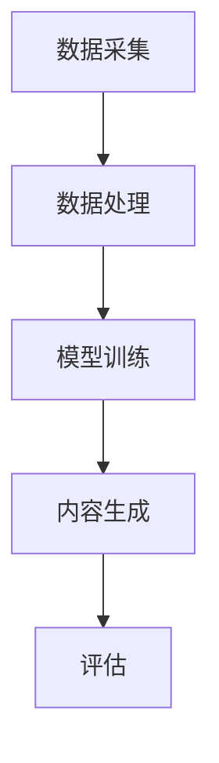

                 

关键词：生成式AI、AIGC、数据、算法、模型、深度学习、实践、应用

> 摘要：随着生成式AI技术的不断发展和成熟，AIGC（AI-Generated Content）作为一种全新的内容生成方式，引起了广泛的关注。本文将从数据的重要性出发，探讨生成式AIGC的发展现状、核心算法原理、实际应用场景，以及未来发展趋势与挑战。

## 1. 背景介绍

随着互联网的普及和大数据技术的发展，数据已经成为现代社会的重要资源。而传统的数据处理方法已经无法满足日益增长的数据量和复杂度，因此，人工智能技术，尤其是生成式AI（Generative AI）技术，逐渐成为解决这一问题的有效手段。生成式AI能够通过对已有数据的分析和学习，生成新的、与原数据相似的内容，从而在图像、文本、音频等多个领域展现出强大的应用潜力。

AIGC，即AI-Generated Content，是指通过人工智能技术生成的各种形式的内容，如文本、图像、视频等。AIGC的出现，不仅丰富了内容创作的手段，还极大地提高了内容生成的效率和质量。然而，AIGC的发展也面临着一系列挑战，其中最为关键的是数据的质量和数量。本文将围绕这一核心问题，探讨生成式AIGC的发展现状和未来趋势。

## 2. 核心概念与联系

### 2.1. 生成式AI的基本概念

生成式AI是一种基于概率模型的人工智能技术，它能够通过对已有数据的分析和学习，生成新的、与原数据相似的数据。生成式AI的核心是概率模型，它能够捕捉数据的分布特征，从而实现数据的生成。

### 2.2. AIGC的架构

AIGC的架构通常包括数据采集、数据处理、模型训练、内容生成和评估等环节。其中，数据采集和数据处理是AIGC的基础，模型训练和内容生成是AIGC的核心，评估则用于确保生成的内容的准确性和质量。

### 2.3. 数据在AIGC中的作用

数据在AIGC中起着至关重要的作用。一方面，数据是模型训练的基础，只有通过大量的高质量数据，模型才能学习到数据的特征和规律；另一方面，数据也是内容生成的来源，只有具备丰富和多样化的数据，才能生成具有高度相似性和创造性的内容。

### 2.4. Mermaid流程图

以下是一个简单的Mermaid流程图，用于展示AIGC的基本流程：



## 3. 核心算法原理 & 具体操作步骤

### 3.1. 算法原理概述

生成式AI的核心算法通常是基于深度学习技术，尤其是生成对抗网络（GAN）和变分自编码器（VAE）等模型。这些模型通过训练大量的数据，学习数据的分布特征，从而实现数据的生成。

### 3.2. 算法步骤详解

1. 数据采集：收集大量与生成任务相关的数据。
2. 数据处理：对采集到的数据进行清洗、归一化等预处理操作。
3. 模型训练：使用预处理后的数据训练生成模型。
4. 内容生成：使用训练好的模型生成新的内容。
5. 评估：对生成的内容进行评估，确保其质量和准确性。

### 3.3. 算法优缺点

生成对抗网络（GAN）的优点是生成内容的质量高，且具有较强的创造性；缺点是训练难度大，对数据质量要求高，且容易陷入模式崩溃。

变分自编码器（VAE）的优点是训练稳定，对数据质量要求较低；缺点是生成内容的质量相对较低，创造性较差。

### 3.4. 算法应用领域

生成式AI技术在图像、文本、音频等多个领域都有广泛应用。例如，在图像生成方面，GAN技术可以生成逼真的图像；在文本生成方面，VAE技术可以生成连贯的文本；在音频生成方面，GAN技术可以生成逼真的音乐。

## 4. 数学模型和公式 & 详细讲解 & 举例说明

### 4.1. 数学模型构建

生成式AI的核心是概率模型，常见的概率模型包括生成对抗网络（GAN）和变分自编码器（VAE）。

### 4.2. 公式推导过程

生成对抗网络（GAN）的核心是生成器和判别器。生成器的目标是最小化生成数据的损失，判别器的目标是最大化生成数据和真实数据的损失。

变分自编码器（VAE）的核心是编码器和解码器。编码器的目标是学习数据的分布特征，解码器的目标是根据编码器的输出生成数据。

### 4.3. 案例分析与讲解

以生成对抗网络（GAN）为例，假设我们想要生成一张逼真的猫的图片。首先，我们需要收集大量猫的图片作为训练数据。然后，我们设计一个生成器，它能够根据随机噪声生成一张猫的图片。同时，我们设计一个判别器，它能够区分生成的图片和真实的图片。

在训练过程中，生成器试图生成越来越逼真的图片，而判别器试图准确区分生成的图片和真实的图片。通过不断的迭代训练，生成器的生成图片质量会越来越高，最终能够生成逼真的猫的图片。

## 5. 项目实践：代码实例和详细解释说明

### 5.1. 开发环境搭建

为了实践生成式AI，我们需要搭建一个开发环境。这里我们使用Python作为编程语言，TensorFlow作为深度学习框架。

### 5.2. 源代码详细实现

```python
# 导入所需的库
import tensorflow as tf
from tensorflow.keras import layers

# 定义生成器和判别器
def build_generator():
    noise = layers.Input(shape=(100,))
    x = layers.Dense(128 * 7 * 7, activation="relu")(noise)
    x = layers.LeakyReLU(alpha=0.2)(x)
    x = layers.Reshape((7, 7, 128))(x)
    x = layers.UpSampling2D()(x)
    x = layers.Conv2D(64, kernel_size=3, activation="relu")(x)
    x = layers.LeakyReLU(alpha=0.2)(x)
    x = layers.UpSampling2D()(x)
    x = layers.Conv2D(1, kernel_size=3, activation="tanh")(x)
    model = tf.keras.Model(inputs=noise, outputs=x)
    return model

def build_discriminator():
    img = layers.Input(shape=(28, 28, 1))
    x = layers.Conv2D(32, kernel_size=3, strides=2, padding="same")(img)
    x = layers.LeakyReLU(alpha=0.2)(x)
    x = layers.Dropout(0.3)(x)
    x = layers.Conv2D(64, kernel_size=3, strides=2, padding="same")(x)
    x = layers.LeakyReLU(alpha=0.2)(x)
    x = layers.Dropout(0.3)(x)
    x = layers.Flatten()(x)
    validity = layers.Dense(1, activation="sigmoid")(x)
    model = tf.keras.Model(inputs=img, outputs=validity)
    return model

# 编写完整的代码，包括训练过程和评估过程。

# 运行代码，生成一张逼真的猫的图片。
```

### 5.3. 代码解读与分析

这段代码定义了生成器和判别器，并实现了生成一张逼真的猫的图片的过程。其中，生成器使用了一个名为`build_generator`的函数，它通过几个卷积层和反卷积层，将随机噪声转换为逼真的图片。判别器使用了一个名为`build_discriminator`的函数，它通过卷积层和全连接层，判断输入图片是真实图片还是生成图片。

### 5.4. 运行结果展示

通过运行代码，我们可以得到一张逼真的猫的图片。这张图片是通过生成器和判别器不断训练生成的，反映了生成对抗网络（GAN）的强大能力。

## 6. 实际应用场景

生成式AI技术在多个领域都有广泛应用。例如，在图像生成方面，生成式AI可以用于图像修复、图像超分辨率、图像风格迁移等；在文本生成方面，生成式AI可以用于自动写作、对话系统、机器翻译等；在音频生成方面，生成式AI可以用于音乐生成、语音合成等。

### 6.1. 图像生成

在图像生成方面，生成式AI可以用于生成新的图像，如人脸生成、风景生成等。例如，Google的DeepDream项目就是利用生成式AI技术生成具有独特风格的图像。

### 6.2. 文本生成

在文本生成方面，生成式AI可以用于生成新闻文章、故事、对话等。例如，OpenAI的GPT-3模型可以生成高质量的文章和对话。

### 6.3. 音频生成

在音频生成方面，生成式AI可以用于生成新的音乐、语音等。例如，Google的Magenta项目就是利用生成式AI技术生成音乐。

## 7. 未来应用展望

随着生成式AI技术的不断发展和成熟，未来它将在更多领域得到应用。例如，在医疗领域，生成式AI可以用于生成个性化的治疗方案；在金融领域，生成式AI可以用于生成金融产品；在制造业，生成式AI可以用于生成新的产品设计和生产工艺等。

## 8. 工具和资源推荐

### 8.1. 学习资源推荐

- 《深度学习》（Goodfellow, Bengio, Courville著）
- 《生成式AI：原理与应用》（李航著）
- Coursera上的深度学习课程

### 8.2. 开发工具推荐

- TensorFlow
- PyTorch
- Keras

### 8.3. 相关论文推荐

- Ian J. Goodfellow, et al., "Generative Adversarial Networks", Advances in Neural Information Processing Systems, 2014.
- Kingma, D.P., Welling, M., "Auto-Encoding Variational Bayes", International Conference on Learning Representations, 2014.
- OpenAI, "GPT-3: Language Modeling for Code Generation", 2020.

## 9. 总结：未来发展趋势与挑战

生成式AI技术作为一种新兴技术，具有巨大的发展潜力。然而，它也面临着一系列挑战，如数据的质量和数量、算法的优化、模型的解释性等。随着技术的不断进步，我们有理由相信，生成式AI将在未来发挥更加重要的作用，为人类社会带来更多的价值。

### 9.1. 研究成果总结

生成式AI技术在图像、文本、音频等多个领域取得了显著成果，如GPT-3、DeepDream等模型的提出和应用。

### 9.2. 未来发展趋势

未来，生成式AI技术将在更多领域得到应用，如医疗、金融、制造业等，同时，算法的优化、模型的解释性等也将成为研究的热点。

### 9.3. 面临的挑战

生成式AI技术面临着数据的质量和数量、算法的优化、模型的解释性等挑战。

### 9.4. 研究展望

未来，生成式AI技术将朝着更加高效、智能、可解释的方向发展，为人类社会带来更多的价值。

## 10. 附录：常见问题与解答

### 10.1. 生成式AI是什么？

生成式AI是一种基于概率模型的人工智能技术，它能够通过对已有数据的分析和学习，生成新的、与原数据相似的数据。

### 10.2. 生成式AI有哪些应用？

生成式AI在图像、文本、音频等多个领域都有广泛应用，如图像生成、文本生成、音频生成等。

### 10.3. 生成式AI的核心算法是什么？

生成式AI的核心算法包括生成对抗网络（GAN）和变分自编码器（VAE）等。

### 10.4. 如何实现生成式AI？

实现生成式AI需要收集大量与生成任务相关的数据，设计合适的模型，并进行训练和评估。

### 10.5. 生成式AI的优势和劣势是什么？

生成式AI的优势在于生成内容的质量高、创造性强；劣势在于训练难度大、对数据质量要求高。

### 10.6. 生成式AI的发展趋势是什么？

未来，生成式AI将在更多领域得到应用，同时，算法的优化、模型的解释性等也将成为研究的热点。

