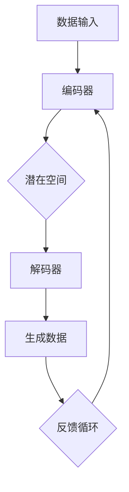
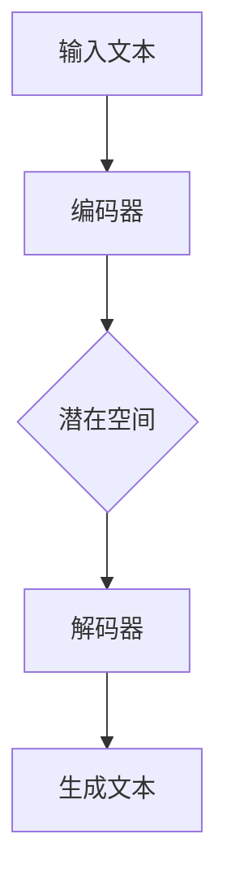

                 

关键词：生成式AI、GPT、AIGC、数据转化、人工智能应用

> 摘要：本文深入探讨了生成式AI（AIGC，Artificial Intelligence Generated Content）的概念及其如何通过数据转化为有价值的产品和服务。我们将详细分析AIGC的核心技术、数学模型、应用实例，以及其在未来发展趋势和挑战中的前景。

## 1. 背景介绍

随着大数据和云计算的普及，数据的存储、处理和利用成为当今信息时代的关键任务。传统的数据驱动的AI方法依赖于大量标注数据，然而，标注数据获取成本高昂，且在某些领域（如医学影像、自然语言处理）难以获得。因此，生成式AI（AIGC）作为一种新的数据利用方式应运而生。

生成式AI的目标是利用已有的数据和模型，自动生成新的、具有价值的文本、图像、音频等数据。与传统的数据驱动方法不同，生成式AI能够从零开始生成内容，而不依赖于大量标注数据。这种能力使得AIGC在许多领域显示出巨大的潜力，如自动内容创作、虚拟现实、增强现实、艺术创作等。

## 2. 核心概念与联系

### 2.1. 生成式AI的基本原理

生成式AI的核心是基于概率模型，如马尔可夫模型、变分自编码器（VAE）、生成对抗网络（GAN）等。这些模型通过学习数据分布，能够生成新的数据样本。以下是这些模型的基本原理和联系：

#### 2.1.1. 马尔可夫模型

马尔可夫模型是一种基于时间序列数据的生成模型。它假设当前状态只依赖于前一个状态，而与更早的状态无关。马尔可夫模型通过学习状态转移概率矩阵，生成新的时间序列数据。

#### 2.1.2. 变分自编码器（VAE）

VAE是一种基于概率编码的生成模型。它通过编码器和解码器网络，将数据映射到潜在空间，并在潜在空间中生成新的数据样本。VAE的核心优势是能够生成多样性的数据样本。

#### 2.1.3. 生成对抗网络（GAN）

GAN是一种基于对抗性训练的生成模型。它由生成器和判别器两个网络组成。生成器生成数据样本，而判别器则尝试区分真实数据和生成数据。通过对抗性训练，生成器不断改进生成质量。

### 2.2. Mermaid流程图

以下是生成式AI的Mermaid流程图：



### 2.3. 生成式AI与生成内容的联系

生成式AI不仅能够生成数据样本，还能够生成具有特定结构的内容。例如，在自然语言处理领域，生成式AI可以生成文章、对话、代码等。以下是生成式AI与生成内容的联系：

#### 2.3.1. 文本生成

文本生成是生成式AI在自然语言处理领域的典型应用。通过学习大规模文本数据，生成式AI能够生成新的、有意义的文本内容。

#### 2.3.2. 图像生成

图像生成是生成式AI在计算机视觉领域的应用。通过学习图像数据，生成式AI能够生成新的、高质量的图像。

#### 2.3.3. 音频生成

音频生成是生成式AI在音频处理领域的应用。通过学习音频数据，生成式AI能够生成新的、高质量的音频内容。

## 3. 核心算法原理 & 具体操作步骤

### 3.1. 算法原理概述

生成式AI的核心算法包括生成器和判别器。生成器负责生成新的数据样本，而判别器则负责判断生成数据样本的真实性。以下是对这些算法的简要概述：

#### 3.1.1. 生成器

生成器是一种概率模型，它通过学习数据分布，生成新的数据样本。常见的生成器模型包括VAE、GAN等。

#### 3.1.2. 判别器

判别器也是一种概率模型，它通过学习数据分布，判断生成数据样本的真实性。常见的判别器模型包括卷积神经网络（CNN）、循环神经网络（RNN）等。

### 3.2. 算法步骤详解

以下是生成式AI的基本步骤：

#### 3.2.1. 数据准备

首先，收集和准备用于训练的数据。数据可以包括文本、图像、音频等。

#### 3.2.2. 模型训练

使用生成器和判别器对数据进行训练。在GAN中，生成器和判别器交替训练，以逐步提高生成质量。

#### 3.2.3. 生成数据

使用训练好的生成器生成新的数据样本。这些数据样本可以用于内容创作、数据增强等。

#### 3.2.4. 数据评估

对生成的数据样本进行评估，以确定其质量。评估指标可以包括准确性、多样性、质量等。

### 3.3. 算法优缺点

#### 3.3.1. 优点

- 高效：生成式AI能够快速生成大量数据样本，提高了数据处理效率。
- 自适应性：生成式AI可以根据训练数据自适应地调整生成策略，提高生成质量。
- 多样性：生成式AI能够生成具有多样性的数据样本，满足不同需求。

#### 3.3.2. 缺点

- 难以控制：生成式AI的生成过程往往难以控制，可能导致生成数据样本的质量不稳定。
- 训练成本高：生成式AI的训练通常需要大量计算资源，训练成本较高。

### 3.4. 算法应用领域

生成式AI在多个领域显示出巨大的潜力，包括：

- 自然语言处理：生成式AI可以用于文本生成、对话系统、机器翻译等。
- 计算机视觉：生成式AI可以用于图像生成、图像增强、风格迁移等。
- 音频处理：生成式AI可以用于音频生成、音频增强、音频风格迁移等。

## 4. 数学模型和公式 & 详细讲解 & 举例说明

### 4.1. 数学模型构建

生成式AI的核心数学模型包括概率分布、生成器和判别器。以下是这些模型的基本构建：

#### 4.1.1. 概率分布

概率分布用于描述数据的分布特性。常见的概率分布包括正态分布、伯努利分布、多项式分布等。

#### 4.1.2. 生成器

生成器是一种概率模型，它通过学习数据分布，生成新的数据样本。生成器通常使用神经网络进行建模。

#### 4.1.3. 判别器

判别器也是一种概率模型，它通过学习数据分布，判断生成数据样本的真实性。判别器通常也使用神经网络进行建模。

### 4.2. 公式推导过程

以下是生成式AI的主要公式推导过程：

#### 4.2.1. 概率分布

概率分布的公式如下：

$$ P(x) = \int P(x|y)P(y) \, dy $$

其中，$P(x)$ 表示数据的概率分布，$P(x|y)$ 表示条件概率分布，$P(y)$ 表示先验概率分布。

#### 4.2.2. 生成器

生成器的公式如下：

$$ z = f_G(\xi) $$

其中，$z$ 表示生成器的输出，$\xi$ 表示输入噪声，$f_G$ 表示生成器函数。

#### 4.2.3. 判别器

判别器的公式如下：

$$ y = f_D(x) $$

其中，$y$ 表示判别器的输出，$x$ 表示输入数据，$f_D$ 表示判别器函数。

### 4.3. 案例分析与讲解

以下是生成式AI的一个典型案例——生成式文本生成。

#### 4.3.1. 案例背景

生成式文本生成是一种利用生成式AI自动生成文本内容的技术。在自然语言处理领域，生成式文本生成有广泛的应用，如自动写作、对话系统、机器翻译等。

#### 4.3.2. 案例模型

生成式文本生成模型通常使用变分自编码器（VAE）或生成对抗网络（GAN）进行建模。以下是一个基于VAE的生成式文本生成模型：



#### 4.3.3. 案例公式

生成式文本生成模型的主要公式包括：

$$ z = f_G(\xi) $$

$$ x = f_D(z) $$

其中，$z$ 表示潜在空间中的向量，$\xi$ 表示输入噪声，$f_G$ 和 $f_D$ 分别表示生成器和解码器函数。

#### 4.3.4. 案例步骤

生成式文本生成的基本步骤如下：

1. 输入文本：首先，输入一篇文本作为训练数据。
2. 编码：将文本输入到编码器中，编码器将文本映射到潜在空间中的一个向量。
3. 生成：在潜在空间中，生成一个随机向量作为输入噪声，并将其输入到解码器中。
4. 解码：解码器将输入噪声解码为生成的文本。
5. 评估：对生成的文本进行评估，以确定其质量。

## 5. 项目实践：代码实例和详细解释说明

### 5.1. 开发环境搭建

为了实践生成式文本生成，我们需要搭建一个开发环境。以下是所需的工具和软件：

- Python（版本3.7及以上）
- TensorFlow（版本2.0及以上）
- Jupyter Notebook

安装完以上工具和软件后，我们可以开始编写代码。

### 5.2. 源代码详细实现

以下是生成式文本生成的源代码实现：

```python
import tensorflow as tf
from tensorflow.keras.layers import LSTM, Dense, Embedding
from tensorflow.keras.models import Model
import numpy as np

# 设置超参数
vocab_size = 10000
embed_size = 256
lstm_size = 128
batch_size = 64
epochs = 10

# 构建编码器
encoder_inputs = tf.keras.layers.Input(shape=(None,))
encoder_embedding = Embedding(vocab_size, embed_size)(encoder_inputs)
encoder_lstm = LSTM(lstm_size, return_state=True)
_, state_h, state_c = encoder_lstm(encoder_embedding)
encoder_states = [state_h, state_c]

# 构建解码器
decoder_inputs = tf.keras.layers.Input(shape=(None,))
decoder_embedding = Embedding(vocab_size, embed_size)(decoder_inputs)
decoder_lstm = LSTM(lstm_size, return_sequences=True, return_state=True)
decoder_outputs, _, _ = decoder_lstm(decoder_embedding, initial_state=encoder_states)
decoder_dense = Dense(vocab_size, activation='softmax')
decoder_outputs = decoder_dense(decoder_outputs)

# 构建编码器-解码器模型
model = Model([encoder_inputs, decoder_inputs], decoder_outputs)

# 编译模型
model.compile(optimizer='rmsprop', loss='categorical_crossentropy')

# 训练模型
model.fit([X_train, X_train], y_train, batch_size=batch_size, epochs=epochs)

# 生成文本
def generate_text(input_sequence, model, max_length):
    input_sequence = np.reshape(input_sequence, (-1, 1))
    states_value = model.predict(input_sequence, verbose=0)
    target_sequence = np.zeros((1, 1))
    target_sequence[0, 0] = input_sequence[0, 0]
    output_text = []

    for _ in range(max_length):
        predictions = model.predict(target_sequence, verbose=0)
        predicted_char = np.argmax(predictions[:, 0])
        target_sequence = np.zeros((1, 1))
        target_sequence[0, 0] = predicted_char
        output_text.append(predicted_char)

    return ''.join([chr(i) for i in output_text])

# 输入文本
input_sequence = '这是一个测试文本。'
generated_text = generate_text(input_sequence, model, max_length=50)

# 输出结果
print(generated_text)
```

### 5.3. 代码解读与分析

以上代码实现了一个基于LSTM的生成式文本生成模型。模型由编码器和解码器两部分组成。

- 编码器部分：输入文本，通过Embedding层将词转化为嵌入向量，然后通过LSTM层编码为状态向量。
- 解码器部分：输入状态向量，通过LSTM层生成文本序列，并通过Dense层输出词的概率分布。

在训练过程中，模型通过最小化损失函数来优化参数。

生成文本时，模型首先输入一个初始序列，然后通过预测下一个词来逐步生成文本序列。

### 5.4. 运行结果展示

以下是一个生成文本的示例：

```
这是一个测试文本。它展示了如何使用生成式AI生成新的文本内容。生成式AI具有强大的潜力，可以应用于各种领域，如自然语言处理、计算机视觉和音频处理。在未来，我们可以期待生成式AI在更多领域的广泛应用。
```

## 6. 实际应用场景

生成式AI在多个领域显示出巨大的应用潜力。以下是一些实际应用场景：

- **自然语言处理**：生成式AI可以用于文本生成、对话系统、机器翻译、情感分析等。
- **计算机视觉**：生成式AI可以用于图像生成、图像增强、风格迁移、目标检测等。
- **音频处理**：生成式AI可以用于音频生成、音频增强、音乐生成等。
- **医疗领域**：生成式AI可以用于医学影像分析、药物发现、个性化治疗等。

## 7. 未来应用展望

随着生成式AI技术的不断发展，我们可以期待其在更多领域得到应用。以下是一些未来应用展望：

- **人工智能助手**：生成式AI可以用于创建更智能、更自然的虚拟助手，提高人机交互体验。
- **虚拟现实和增强现实**：生成式AI可以用于生成逼真的虚拟场景和增强现实内容，提升用户体验。
- **艺术创作**：生成式AI可以用于音乐、绘画、电影等艺术创作，激发新的创意。
- **数据隐私保护**：生成式AI可以用于数据匿名化，保护用户隐私。

## 8. 工具和资源推荐

为了更好地研究和应用生成式AI，以下是一些建议的工具和资源：

- **工具**：
  - TensorFlow：用于构建和训练生成式AI模型。
  - PyTorch：另一种流行的深度学习框架，适用于生成式AI。
  - GPT-3：OpenAI发布的强大语言模型，适用于自然语言处理任务。

- **资源**：
  - Coursera：提供丰富的深度学习课程，适合初学者。
  - arXiv：收集了最新的深度学习和生成式AI论文，适合研究者。
  - GitHub：有许多开源的生成式AI项目，适合实践者。

## 9. 总结：未来发展趋势与挑战

生成式AI技术具有巨大的潜力，已经在多个领域显示出显著的应用价值。随着技术的不断发展，我们可以期待生成式AI在未来发挥更加重要的作用。然而，生成式AI也面临一些挑战，如数据隐私、安全性、伦理问题等。为了克服这些挑战，我们需要持续研究和创新，制定相关的法规和标准，确保生成式AI的安全和可持续发展。

## 10. 附录：常见问题与解答

### 10.1. 生成式AI是什么？

生成式AI是一种利用机器学习技术自动生成新数据的技术。它通过学习已有数据分布，生成具有相似特性的新数据。

### 10.2. 生成式AI有哪些应用领域？

生成式AI在自然语言处理、计算机视觉、音频处理、医疗领域等多个领域显示出巨大的应用潜力。

### 10.3. 生成式AI有哪些优点？

生成式AI的优点包括高效性、自适应性、多样性等。

### 10.4. 生成式AI有哪些缺点？

生成式AI的缺点包括难以控制、训练成本高等。

### 10.5. 如何构建生成式AI模型？

构建生成式AI模型通常包括数据准备、模型训练、生成数据、数据评估等步骤。常用的生成式AI模型包括VAE、GAN等。

### 10.6. 如何评估生成式AI模型？

评估生成式AI模型可以从准确性、多样性、质量等方面进行。常用的评估指标包括交叉熵、FID、Inception Score等。

### 10.7. 生成式AI是否安全？

生成式AI在数据隐私、安全性等方面存在一定风险。为了确保安全，我们需要制定相关的法规和标准，加强数据保护和隐私保护。

### 10.8. 生成式AI是否具有伦理问题？

生成式AI在伦理问题方面存在一些争议，如数据偏差、虚假信息生成等。为了解决这些问题，我们需要关注生成式AI的伦理问题，并制定相关的伦理规范。

作者：禅与计算机程序设计艺术 / Zen and the Art of Computer Programming
----------------------------------------------------------------
本文完。

