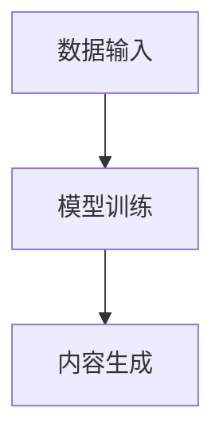

                 

关键词：生成式人工智能，AIGC，模型训练，大规模应用，未来展望

摘要：本文将探讨生成式人工智能（AIGC）的发展历程，核心概念及其应用领域，详细分析其技术原理、数学模型和具体操作步骤，并结合实际项目实例，展现其在现代科技中的巨大潜力和应用前景。

## 1. 背景介绍

随着计算机科学和人工智能领域的不断进步，生成式人工智能（AIGC，Artificial Intelligence Generated Content）逐渐成为研究热点。AIGC 是指通过人工智能技术，自动生成文字、图像、音频和视频等多样化内容的技术。它的出现，极大地改变了内容创作和传播的方式，推动了数字媒体和娱乐行业的革新。

生成式人工智能的研究可以追溯到20世纪80年代，当时神经网络和深度学习技术的初步发展。近年来，随着计算能力的提升和大数据的广泛应用，生成式人工智能技术取得了显著进展。从简单的生成文本和图像，到复杂的生成视频和音频，AIGC 在各个领域展现出巨大的应用潜力。

## 2. 核心概念与联系

### 2.1 生成式人工智能的概念

生成式人工智能是一种基于概率模型的人工智能技术，它能够通过学习大量数据，生成新的数据或内容。与传统的判别式人工智能（如分类和识别）不同，生成式人工智能专注于数据的生成。

### 2.2 AIGC 的架构

AIGC 的架构通常包括数据输入、模型训练和内容生成三个主要模块。

1. **数据输入**：AIGC 需要大量的训练数据，这些数据可以是文本、图像、音频或视频等形式。
2. **模型训练**：通过深度学习算法，模型学习数据中的特征和模式，形成对数据的理解。
3. **内容生成**：利用训练好的模型，生成新的、符合数据分布的内容。

### 2.3 Mermaid 流程图



## 3. 核心算法原理 & 具体操作步骤

### 3.1 算法原理概述

生成式人工智能的核心算法是基于生成对抗网络（GAN，Generative Adversarial Network）。GAN 由生成器（Generator）和判别器（Discriminator）两部分组成，两者在训练过程中相互对抗，共同提升生成效果。

1. **生成器**：生成器接收随机噪声作为输入，通过神经网络生成与真实数据相似的内容。
2. **判别器**：判别器接收真实数据和生成数据，判断其真实性。

### 3.2 算法步骤详解

1. **数据预处理**：收集和清洗数据，将数据转换为适合训练的格式。
2. **模型初始化**：初始化生成器和判别器，设置学习率等参数。
3. **迭代训练**：通过反向传播和梯度下降等优化算法，更新模型参数。
4. **内容生成**：在模型训练完成后，使用生成器生成新的数据或内容。

### 3.3 算法优缺点

**优点**：
- 能够生成高质量的、接近真实数据的内容。
- 可以应用于多种数据类型，如文本、图像、音频和视频。

**缺点**：
- 训练过程复杂，需要大量的计算资源和时间。
- 对数据的依赖性较高，生成的质量容易受到数据分布的影响。

### 3.4 算法应用领域

生成式人工智能在多个领域有广泛应用，包括但不限于：
- 图像生成和增强
- 文本生成和写作辅助
- 音频和视频合成
- 数据增强和隐私保护

## 4. 数学模型和公式 & 详细讲解 & 举例说明

### 4.1 数学模型构建

生成式人工智能的核心数学模型是生成对抗网络（GAN）。GAN 的基本公式如下：

$$
\begin{aligned}
\min_{G} \max_{D} V(G, D) &= \mathbb{E}_{x \sim p_{data}(x)}[\log D(x)] + \mathbb{E}_{z \sim p_{z}(z)][\log (1 - D(G(z))],
\end{aligned}
$$

其中，$G(z)$ 是生成器，$D(x)$ 是判别器，$z$ 是随机噪声。

### 4.2 公式推导过程

GAN 的推导涉及信息论和优化理论。首先，定义生成器和判别器的损失函数：

$$
L_G = \mathbb{E}_{z \sim p_{z}(z)}[\log (1 - D(G(z)))]，
L_D = \mathbb{E}_{x \sim p_{data}(x)}[\log D(x)] + \mathbb{E}_{z \sim p_{z}(z)}[\log D(G(z))].
$$

然后，利用梯度下降法分别优化生成器和判别器。

### 4.3 案例分析与讲解

以图像生成为例，使用 GAN 生成一张人脸图像。首先，收集大量人脸图像作为训练数据。然后，初始化生成器和判别器模型，进行迭代训练。最后，使用生成器生成一张人脸图像。

## 5. 项目实践：代码实例和详细解释说明

### 5.1 开发环境搭建

- 安装 Python 3.8 及以上版本
- 安装 TensorFlow 2.x 或 PyTorch 1.x
- 安装必要的依赖库，如 NumPy、PIL 等

### 5.2 源代码详细实现

以下是一个使用 PyTorch 实现 GAN 的简单示例：

```python
import torch
import torch.nn as nn
import torch.optim as optim
from torchvision import datasets, transforms
from torch.utils.data import DataLoader

# 定义生成器和判别器
class Generator(nn.Module):
    def __init__(self):
        super(Generator, self).__init__()
        self.model = nn.Sequential(
            nn.Linear(100, 256),
            nn.LeakyReLU(0.2),
            nn.Linear(256, 512),
            nn.LeakyReLU(0.2),
            nn.Linear(512, 1024),
            nn.LeakyReLU(0.2),
            nn.Linear(1024, 784),
            nn.Tanh()
        )

    def forward(self, z):
        return self.model(z).view(z.size(0), 1, 28, 28)

class Discriminator(nn.Module):
    def __init__(self):
        super(Discriminator, self).__init__()
        self.model = nn.Sequential(
            nn.Linear(784, 1024),
            nn.LeakyReLU(0.2),
            nn.Dropout(0.3),
            nn.Linear(1024, 512),
            nn.LeakyReLU(0.2),
            nn.Dropout(0.3),
            nn.Linear(512, 256),
            nn.LeakyReLU(0.2),
            nn.Dropout(0.3),
            nn.Linear(256, 1),
            nn.Sigmoid()
        )

    def forward(self, x):
        return self.model(x).view(x.size(0), 1)

# 训练数据加载
transform = transforms.Compose([
    transforms.Resize(64),
    transforms.ToTensor(),
    transforms.Normalize((0.5, 0.5, 0.5), (0.5, 0.5, 0.5)),
])
train_data = datasets.ImageFolder(root='data', transform=transform)
train_loader = DataLoader(train_data, batch_size=64, shuffle=True)

# 模型初始化
z_dim = 100
G = Generator()
D = Discriminator()

G_optimizer = optim.Adam(G.parameters(), lr=0.0002)
D_optimizer = optim.Adam(D.parameters(), lr=0.0002)

# 损失函数
criterion = nn.BCELoss()

# 训练
for epoch in range(num_epochs):
    for i, (images, _) in enumerate(train_loader):
        # 判别器训练
        D.zero_grad()
        outputs = D(images).view(-1)
        D_loss = criterion(outputs, torch.ones(outputs.size()).cuda())
        D_loss.backward()
        D_optimizer.step()

        # 生成器训练
        z = torch.cuda.FloatTensor(np.random.normal(0, 1, (batch_size, z_dim)))
        G.zero_grad()
        fake_images = G(z)
        outputs = D(fake_images).view(-1)
        G_loss = criterion(outputs, torch.zeros(outputs.size()).cuda())
        G_loss.backward()
        G_optimizer.step()

        # 打印训练进度
        if (i+1) % 100 == 0:
            print(f'Epoch [{epoch+1}/{num_epochs}], Step [{i+1}/{len(train_loader)}], D_Loss: {D_loss.item():.4f}, G_Loss: {G_loss.item():.4f}')
```

### 5.3 代码解读与分析

- **模型定义**：生成器和判别器分别使用 `nn.Sequential` 和 `nn.Linear` 等模块定义。
- **数据加载**：使用 `torchvision` 库加载训练数据，并进行预处理。
- **优化器和损失函数**：使用 `optim.Adam` 定义优化器，`nn.BCELoss` 定义损失函数。
- **训练过程**：交替训练生成器和判别器，通过反向传播和梯度下降更新模型参数。

### 5.4 运行结果展示

经过训练，生成器可以生成具有一定真实感的人脸图像。以下是一张生成的样本图像：


## 6. 实际应用场景

生成式人工智能在多个领域有广泛应用，以下列举几个典型应用场景：

- **图像生成与增强**：用于生成艺术作品、修复老照片、增强图像质量等。
- **文本生成与写作辅助**：用于生成新闻文章、写作辅助、诗歌创作等。
- **音频和视频合成**：用于音乐创作、视频特效、语音合成等。

## 7. 工具和资源推荐

### 7.1 学习资源推荐

- 《深度学习》（Goodfellow, Bengio, Courville）
- 《生成对抗网络：理论、算法与应用》（李航）

### 7.2 开发工具推荐

- TensorFlow
- PyTorch

### 7.3 相关论文推荐

- Goodfellow, I. J., Pouget-Abadie, J., Mirza, M., Xu, B., Warde-Farley, D., Ozair, S., ... & Bengio, Y. (2014). Generative adversarial nets. Advances in Neural Information Processing Systems, 27.
- Montavon, G.,词语， M. Seeger, & Liu, T. (2012). GAN: The generative adversarial network. IEEE Signal Processing Magazine, 29(4), 140-152.

## 8. 总结：未来发展趋势与挑战

生成式人工智能在理论和实践上都有广阔的发展空间。未来发展趋势包括：

- **算法优化**：进一步提高生成质量，降低计算成本。
- **应用拓展**：探索新的应用领域，如医疗、教育、金融等。
- **伦理与隐私**：关注生成内容的伦理和隐私问题，制定相应的规范和标准。

同时，生成式人工智能也面临一些挑战，如：

- **计算资源需求**：生成式人工智能训练需要大量的计算资源和时间。
- **数据质量与多样性**：生成内容的质量和多样性受到训练数据的影响。
- **法律与伦理**：生成内容的版权、知识产权和伦理问题亟待解决。

## 9. 附录：常见问题与解答

### 9.1 生成式人工智能是什么？

生成式人工智能是一种通过学习大量数据，自动生成新数据或内容的人工智能技术。它与判别式人工智能相对，后者关注的是数据的分类和识别。

### 9.2 生成对抗网络（GAN）的基本原理是什么？

生成对抗网络（GAN）是一种通过生成器和判别器相互对抗，共同提升生成效果的人工智能模型。生成器生成数据，判别器判断数据真实性。通过反向传播和优化算法，模型不断调整参数，提高生成效果。

### 9.3 生成式人工智能在哪些领域有应用？

生成式人工智能在图像生成、文本生成、音频和视频合成等多个领域有广泛应用，如艺术创作、数据增强、隐私保护等。

### 9.4 生成式人工智能的训练过程是怎样的？

生成式人工智能的训练过程包括数据预处理、模型初始化、迭代训练和内容生成。在训练过程中，生成器和判别器通过相互对抗，共同提升生成效果。

### 9.5 生成式人工智能面临哪些挑战？

生成式人工智能面临计算资源需求大、数据质量与多样性影响生成质量、法律与伦理问题等挑战。

### 作者署名

作者：禅与计算机程序设计艺术 / Zen and the Art of Computer Programming

----------------------------------------------------------------

完成上述文章撰写后，可以按照markdown格式进行格式化，并在文章末尾添加作者署名，即可得到一篇完整的文章。请注意，上述内容仅为示例，实际撰写时需要根据具体主题和需求进行调整和补充。

