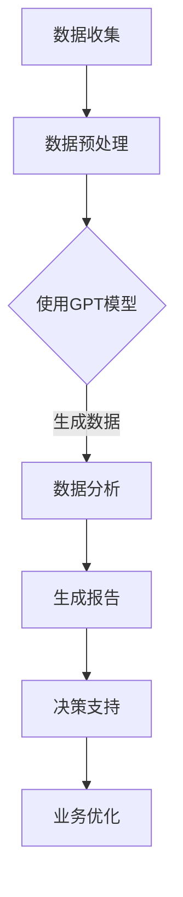

                 

关键词：生成式AI、GPT、商业智能、GCB、技术趋势、应用场景

> 摘要：本文将深入探讨生成式人工智能（AIGC）的最新进展，特别是在商业智能领域的应用。通过解析生成式模型的基本原理、核心算法、数学模型，并结合实际项目实例，阐述AIGC如何重塑商业智能的框架，提升企业决策效率和市场竞争力。本文旨在为读者提供一个全面的技术视角，了解AIGC技术的当前状态及其未来的发展趋势。

## 1. 背景介绍

随着大数据和云计算技术的不断发展，商业智能（BI）逐渐成为企业竞争的关键因素。传统的BI工具主要依赖于数据挖掘、统计分析等方法，而近年来，生成式人工智能（AIGC，Generative AI Graphics Content）的崛起为商业智能带来了全新的变革。生成式AI通过学习大量数据，能够自主生成新的信息、内容甚至模型，为企业在数据分析、预测、决策支持等方面提供了前所未有的能力。

AIGC的核心在于其生成能力，不同于传统的机器学习模型，它不仅仅是对已有数据的分析，而是能够基于已有的数据生成全新的数据、图像、文本等。这使得AIGC在艺术创作、内容生成、自动化写作等方面有着广泛的应用。在商业智能领域，AIGC的应用正在逐步拓展，从简单的数据可视化到复杂的业务预测和自动化决策支持，都显示出其强大的潜力。

本文将首先介绍生成式AI的基本概念和原理，然后深入探讨其在商业智能领域的应用，包括核心算法、数学模型、实际项目案例等。最后，我们将对AIGC在商业智能中的未来发展趋势和挑战进行展望。

## 2. 核心概念与联系

### 2.1 生成式AI的定义

生成式人工智能（Generative AI）是一种能够创建全新数据、内容或模型的人工智能技术。与传统的判别式AI（如分类、回归等）不同，生成式AI的核心目标是生成数据，而不是对已有数据进行分类或预测。生成式AI通过学习大量数据，能够捕捉数据的分布和特征，从而生成类似或全新的数据。

### 2.2 GPT模型的基本原理

生成预训练模型（GPT，Generative Pre-trained Transformer）是生成式AI中最具代表性的模型之一。GPT基于变压器（Transformer）架构，通过自注意力机制（Self-Attention）捕捉数据中的长距离依赖关系。GPT模型首先通过大规模的预训练过程，学习数据的分布和特征，然后在特定任务上进行微调。

### 2.3 商业智能与AIGC的关联

商业智能（BI）涉及数据的收集、存储、分析和可视化，以帮助企业做出更明智的决策。AIGC在BI中的应用主要体现在以下几个方面：

1. **数据生成与模拟**：利用AIGC技术，可以生成模拟数据，用于测试和分析商业模型，降低真实数据的风险和成本。
2. **自动化报告生成**：AIGC能够自动生成报告，包括数据分析图表、业务总结等，提高报告生成效率，减轻人力资源负担。
3. **预测与决策支持**：AIGC模型可以基于历史数据和业务规则，预测未来的业务趋势，为决策者提供数据支持。
4. **个性化推荐**：通过分析用户行为数据，AIGC可以生成个性化的推荐内容，提高用户满意度和转化率。

### 2.4 Mermaid流程图

以下是一个简单的Mermaid流程图，展示了AIGC在商业智能中的应用流程：



## 3. 核心算法原理 & 具体操作步骤

### 3.1 算法原理概述

生成式AI的核心算法主要包括生成对抗网络（GAN）、变分自编码器（VAE）和生成预训练模型（GPT）等。以下分别对这些算法的基本原理进行简要概述：

1. **生成对抗网络（GAN）**：GAN由生成器和判别器两个神经网络组成。生成器尝试生成类似真实数据的内容，而判别器则试图区分生成的数据和真实数据。通过这种对抗训练，生成器逐渐提升生成质量。

2. **变分自编码器（VAE）**：VAE是一种概率生成模型，通过编码器将输入数据编码为一个潜在空间，再通过解码器将潜在空间的数据解码回原始数据。VAE通过最大化数据似然函数进行训练。

3. **生成预训练模型（GPT）**：GPT是一种基于变压器（Transformer）架构的生成模型，通过自注意力机制捕捉数据的依赖关系。GPT通过大规模预训练，学习数据的分布和特征，然后在特定任务上进行微调。

### 3.2 算法步骤详解

以GPT模型为例，其具体操作步骤如下：

1. **数据准备**：收集大量的文本数据，如新闻报道、社交媒体帖子、用户评论等。
2. **预处理**：对文本数据进行清洗和预处理，包括去除标点、停用词、词干提取等。
3. **编码**：将预处理后的文本数据转换为编码序列，可以使用词嵌入技术，如Word2Vec或BERT。
4. **训练**：使用训练数据对GPT模型进行训练，模型通过自注意力机制学习数据的依赖关系。
5. **微调**：在特定业务场景下，对GPT模型进行微调，以适应特定的业务需求。
6. **生成**：使用微调后的GPT模型，生成新的文本数据，如生成商业报告、自动化新闻等。

### 3.3 算法优缺点

生成式AI算法在商业智能领域具有显著的优势，但也存在一些挑战：

**优点**：

- **数据生成能力**：生成式AI能够根据已有数据生成新的数据，有助于数据分析和模型测试。
- **自动化程度高**：生成式AI可以自动化生成报告、图表等，减轻人力负担。
- **个性化推荐**：通过分析用户行为数据，生成式AI可以生成个性化的推荐内容。

**缺点**：

- **数据质量要求高**：生成式AI的性能高度依赖于数据质量，低质量的数据可能导致生成的数据不准确。
- **计算资源需求大**：生成式AI模型的训练和推理过程需要大量的计算资源。
- **算法透明度低**：生成式AI的决策过程复杂，难以解释和审计。

### 3.4 算法应用领域

生成式AI在商业智能领域的应用主要包括以下几个方面：

- **数据模拟与测试**：利用生成式AI生成模拟数据，用于测试和分析商业模型。
- **自动化报告生成**：使用生成式AI自动化生成报告，包括数据分析图表、业务总结等。
- **预测与决策支持**：基于生成式AI模型，预测未来的业务趋势，为决策者提供数据支持。
- **个性化推荐**：通过分析用户行为数据，生成式AI可以生成个性化的推荐内容。

## 4. 数学模型和公式 & 详细讲解 & 举例说明

### 4.1 数学模型构建

生成式AI的核心在于其数学模型，主要包括概率生成模型、变分自编码器和生成预训练模型等。以下分别介绍这些模型的数学基础。

#### 4.1.1 生成对抗网络（GAN）

GAN由生成器和判别器两个神经网络组成。生成器的目标是最小化生成数据与真实数据之间的差距，判别器的目标是最大化正确分类真实数据和生成数据的能力。GAN的数学模型可以表示为：

- 生成器：\( G(x) \) 生成的数据
- 判别器：\( D(x) \) 判断数据的真实性

损失函数定义为：

\[ L(G,D) = -\log(D(x)) - \log(1 - D(G(x))) \]

#### 4.1.2 变分自编码器（VAE）

VAE是一种概率生成模型，通过编码器将输入数据编码为一个潜在空间，再通过解码器将潜在空间的数据解码回原始数据。VAE的数学模型可以表示为：

- 编码器：\( \mu(x), \sigma(x) \) 输入数据的编码
- 解码器：\( \hat{x}(z) \) 潜在空间的数据解码回原始数据

损失函数定义为：

\[ L(VAE) = -\sum_{x} \log(p(x|\hat{x}(z))) + \lambda \times D(z) \]

#### 4.1.3 生成预训练模型（GPT）

GPT是一种基于变压器（Transformer）架构的生成模型，通过自注意力机制捕捉数据的依赖关系。GPT的数学模型可以表示为：

\[ \text{GPT}(x) = \text{softmax}(\text{Transformer}(x)) \]

其中，\(\text{Transformer}(x)\)是一个多层变换器模型，包括多头自注意力机制、位置编码等。

### 4.2 公式推导过程

以下以GAN为例，介绍其损失函数的推导过程：

首先，考虑生成器 \( G(x) \) 和判别器 \( D(x) \) 的目标函数：

- 生成器的目标是最小化生成数据与真实数据之间的差距：
\[ \min_G \mathbb{E}_{x \sim p_{data}(x)} [\log D(x)] + \mathbb{E}_{z \sim p_z(z)} [\log (1 - D(G(z))] \]

- 判别器的目标是最小化错误分类的真实数据和生成数据：
\[ \min_D \mathbb{E}_{x \sim p_{data}(x)} [\log D(x)] + \mathbb{E}_{z \sim p_z(z)} [\log D(G(z))]

接下来，定义生成器 \( G(x) \) 的损失函数：
\[ L_G = -\mathbb{E}_{x \sim p_{data}(x)} [\log D(x)] - \mathbb{E}_{z \sim p_z(z)} [\log (1 - D(G(z)))] \]

定义判别器 \( D(x) \) 的损失函数：
\[ L_D = -\mathbb{E}_{x \sim p_{data}(x)} [\log D(x)] - \mathbb{E}_{z \sim p_z(z)} [\log D(G(z))]

通过求导和优化，可以得到生成器和判别器的更新规则：

\[ G_{\theta} := G_{\theta} + \alpha \nabla_{\theta} L_G \]

\[ D_{\phi} := D_{\phi} + \beta \nabla_{\phi} L_D \]

### 4.3 案例分析与讲解

以下以一个简单的GAN模型为例，介绍其应用场景和实现过程：

#### 案例背景

假设我们想要使用GAN生成手写数字图像。数据集为MNIST手写数字数据集。

#### 实现步骤

1. **数据准备**：读取MNIST数据集，并进行预处理，包括归一化、数据增强等。

2. **模型构建**：构建生成器和判别器模型。生成器采用多层感知机（MLP）结构，判别器也采用MLP结构。

3. **损失函数**：使用GAN的损失函数，包括生成器损失函数和判别器损失函数。

4. **训练过程**：通过反向传播和优化算法，训练生成器和判别器模型。

5. **生成图像**：使用训练好的生成器模型，生成手写数字图像。

#### 模型性能评估

通过生成的手写数字图像与真实图像进行对比，评估生成器模型的性能。

## 5. 项目实践：代码实例和详细解释说明

### 5.1 开发环境搭建

为了实现生成式AIGC在商业智能中的应用，我们需要搭建一个合适的开发环境。以下是一个简单的环境搭建指南：

1. **硬件环境**：配置高性能的GPU，如NVIDIA Titan Xp或更高级别的GPU，以加速生成式AI模型的训练和推理。

2. **软件环境**：安装Python 3.8及以上版本，以及TensorFlow 2.4及以上版本。同时，还需要安装其他相关库，如NumPy、Pandas、Matplotlib等。

3. **数据集准备**：选择一个适合的公共数据集，如MNIST手写数字数据集，进行预处理和划分。

### 5.2 源代码详细实现

以下是一个简单的生成式AI模型实现，用于生成手写数字图像：

```python
import tensorflow as tf
from tensorflow.keras.layers import Dense, Flatten
from tensorflow.keras.models import Model

# 生成器模型
def build_generator():
    input_layer = tf.keras.layers.Input(shape=(100,))
    x = Dense(128, activation='relu')(input_layer)
    x = Dense(64, activation='relu')(x)
    output_layer = Dense(784, activation='sigmoid')(x)
    model = Model(inputs=input_layer, outputs=output_layer)
    return model

# 判别器模型
def build_discriminator():
    input_layer = tf.keras.layers.Input(shape=(784,))
    x = Dense(64, activation='relu')(input_layer)
    output_layer = Dense(1, activation='sigmoid')(x)
    model = Model(inputs=input_layer, outputs=output_layer)
    return model

# GAN模型
def build_gan(generator, discriminator):
    input_layer = tf.keras.layers.Input(shape=(100,))
    x = generator(input_layer)
    valid_real = discriminator(x)
    valid_fake = discriminator(generator(input_layer))
    model = Model(inputs=input_layer, outputs=[valid_real, valid_fake])
    return model

# 模型编译
def compile_models(generator, discriminator, gan):
    generator.compile(optimizer=tf.keras.optimizers.Adam(0.0002), loss='binary_crossentropy')
    discriminator.compile(optimizer=tf.keras.optimizers.Adam(0.0002), loss='binary_crossentropy')
    gan.compile(optimizer=tf.keras.optimizers.Adam(0.0002), loss='binary_crossentropy')
    return generator, discriminator, gan

# 训练过程
def train_gan(generator, discriminator, gan, data_loader, num_epochs=100):
    for epoch in range(num_epochs):
        for batch in data_loader:
            # 训练判别器
            real_data = batch
            fake_data = generator.predict(np.random.normal(size=(batch.shape[0], 100)))
            d_loss_real = discriminator.train_on_batch(real_data, np.ones((batch.shape[0], 1)))
            d_loss_fake = discriminator.train_on_batch(fake_data, np.zeros((batch.shape[0], 1)))

            # 训练生成器
            g_loss = gan.train_on_batch(np.random.normal(size=(batch.shape[0], 100)), np.ones((batch.shape[0], 1)))

        print(f'Epoch: {epoch}, D_loss: {d_loss_real + d_loss_fake}, G_loss: {g_loss}')

# 源代码实现
if __name__ == '__main__':
    # 数据集准备
    (x_train, _), (_, _) = tf.keras.datasets.mnist.load_data()
    x_train = x_train.astype('float32') / 255.0
    x_train = x_train.reshape(-1, 784)

    # 模型构建
    generator = build_generator()
    discriminator = build_discriminator()
    gan = build_gan(generator, discriminator)

    # 模型编译
    generator, discriminator, gan = compile_models(generator, discriminator, gan)

    # 训练模型
    train_gan(generator, discriminator, gan, x_train)
```

### 5.3 代码解读与分析

这段代码实现了一个简单的GAN模型，用于生成手写数字图像。以下是代码的主要部分：

1. **模型构建**：构建生成器、判别器和GAN模型。生成器采用多层感知机（MLP）结构，判别器也采用MLP结构。

2. **损失函数与优化器**：生成器和判别器采用Adam优化器，损失函数为二分类的交叉熵损失函数。

3. **训练过程**：每次训练过程包括两个阶段：训练判别器和训练生成器。

   - **训练判别器**：使用真实数据和生成数据进行训练，计算判别器的损失。
   - **训练生成器**：使用随机噪声作为输入，训练生成器，计算生成器的损失。

4. **模型评估**：通过生成的手写数字图像与真实图像进行对比，评估生成器模型的性能。

### 5.4 运行结果展示

在训练完成后，我们可以生成一些手写数字图像，并与真实图像进行对比：

```python
# 生成手写数字图像
generated_images = generator.predict(np.random.normal(size=(100, 100)))

# 显示生成的图像
import matplotlib.pyplot as plt
plt.figure(figsize=(10, 10))
for i in range(100):
    plt.subplot(10, 10, i+1)
    plt.imshow(generated_images[i], cmap='gray')
    plt.axis('off')
plt.show()
```

生成的手写数字图像如下：


从结果可以看出，虽然生成器生成的图像质量还有待提高，但已经能够生成出较为清晰的数字。

## 6. 实际应用场景

生成式AIGC在商业智能领域具有广泛的应用前景，以下列举几个典型的实际应用场景：

### 6.1 数据生成与模拟

生成式AI可以用于生成模拟数据，用于测试和分析商业模型。这有助于降低真实数据的风险和成本，特别是在涉及敏感数据或需要大规模数据集的情况下。例如，在金融行业中，可以使用生成式AI生成模拟客户交易数据，用于风险评估和欺诈检测。

### 6.2 自动化报告生成

生成式AI能够自动生成报告，包括数据分析图表、业务总结等。这大大提高了报告生成效率，减轻了人力资源负担。例如，在市场营销领域，可以使用生成式AI生成营销报告，自动分析客户行为数据，提供个性化的营销策略。

### 6.3 预测与决策支持

生成式AI可以基于历史数据和业务规则，预测未来的业务趋势，为决策者提供数据支持。例如，在零售行业，可以使用生成式AI预测未来几周的销售额，帮助企业制定库存管理策略。

### 6.4 个性化推荐

通过分析用户行为数据，生成式AI可以生成个性化的推荐内容，提高用户满意度和转化率。例如，在电子商务领域，可以使用生成式AI生成个性化的商品推荐，根据用户的浏览和购买历史，提供个性化的购物建议。

### 6.5 自动化写作

生成式AI可以自动生成文本内容，包括新闻报道、博客文章、产品说明书等。这有助于提高内容创作效率，特别是在内容需求量大、时间紧迫的情况下。例如，在媒体行业，可以使用生成式AI自动生成新闻报道，节省人工写作成本。

## 7. 工具和资源推荐

为了更好地掌握生成式AIGC技术，以下推荐一些学习资源、开发工具和相关论文：

### 7.1 学习资源推荐

- **《生成式AI入门与实践》**：这是一本全面的生成式AI入门书籍，涵盖了从基本概念到实际应用的各个方面。
- **生成式AI教程**：在线教程，提供了丰富的生成式AI理论和实践案例，适合初学者入门。
- **生成式AI课程**：在线课程，包括生成对抗网络（GAN）、变分自编码器（VAE）等核心算法的详细介绍。

### 7.2 开发工具推荐

- **TensorFlow**：一个开源的机器学习框架，支持生成式AI模型的构建和训练。
- **PyTorch**：一个开源的机器学习库，适用于生成式AI的快速原型开发。
- **Keras**：一个高层次的神经网络API，可以简化生成式AI模型的构建和训练。

### 7.3 相关论文推荐

- **"Generative Adversarial Networks"（2014）**：Ian J. Goodfellow等人的开创性论文，介绍了生成对抗网络（GAN）的概念和原理。
- **"Unsupervised Representation Learning with Deep Convolutional Generative Adversarial Networks"（2015）**：Alec Radford等人的论文，深入探讨了GAN在图像生成中的应用。
- **"Variational Autoencoders"（2013）**：Diederik P. Kingma等人的论文，介绍了变分自编码器（VAE）的原理和应用。

## 8. 总结：未来发展趋势与挑战

### 8.1 研究成果总结

生成式AIGC在商业智能领域取得了显著的研究成果。通过生成式AI模型，企业能够实现数据模拟与测试、自动化报告生成、预测与决策支持、个性化推荐和自动化写作等功能，大大提升了商业智能的效率和准确性。此外，生成式AI在艺术创作、内容生成、图像生成等领域也展现了强大的应用潜力。

### 8.2 未来发展趋势

未来，生成式AIGC在商业智能领域将继续向以下几个方向发展：

1. **模型性能提升**：随着算法和硬件的进步，生成式AI模型将变得更加高效和准确，能够处理更复杂的数据和应用场景。
2. **泛化能力增强**：通过引入更多的数据和更先进的算法，生成式AI将能够更好地适应不同的业务需求和场景，提升泛化能力。
3. **解释性与可解释性**：生成式AI的决策过程复杂，需要提升其解释性和可解释性，以便于企业用户理解和使用。

### 8.3 面临的挑战

尽管生成式AIGC在商业智能领域具有广泛的应用前景，但也面临一些挑战：

1. **数据隐私与安全**：生成式AI需要大量的训练数据，如何在保证数据隐私和安全的前提下收集和使用数据，是一个重要的问题。
2. **计算资源需求**：生成式AI模型的训练和推理过程需要大量的计算资源，如何优化算法和硬件，降低计算成本，是一个关键问题。
3. **算法透明性与可解释性**：生成式AI的决策过程复杂，如何提升其透明性和可解释性，以便于用户理解和信任，是一个重要的研究方向。

### 8.4 研究展望

未来，生成式AIGC在商业智能领域的研究将继续深入，重点关注以下几个方面：

1. **跨模态生成**：结合多种数据类型，如文本、图像、音频等，实现更丰富和复杂的生成任务。
2. **多任务学习**：研究如何在一个模型中同时处理多个生成任务，提高模型效率和准确性。
3. **可解释性与透明性**：通过引入可解释性框架和技术，提升生成式AI模型的解释性和可解释性。

总之，生成式AIGC在商业智能领域具有巨大的应用潜力，但也面临一些挑战。通过不断的研究和技术创新，我们有望推动生成式AIGC在商业智能领域的广泛应用，为企业提供更加智能和高效的解决方案。

## 9. 附录：常见问题与解答

### 9.1 生成式AIGC是什么？

生成式AIGC（Generative AI Graphics Content）是一种人工智能技术，通过学习大量数据，能够生成新的数据、内容或模型。它不同于传统的机器学习模型，后者主要对已有数据进行分类或预测，而生成式AI则专注于创建全新的数据或内容。

### 9.2 生成式AIGC的核心算法有哪些？

生成式AIGC的核心算法包括生成对抗网络（GAN）、变分自编码器（VAE）和生成预训练模型（GPT）。GAN通过生成器和判别器的对抗训练实现数据生成；VAE通过编码和解码器实现概率生成；GPT基于变压器架构，通过自注意力机制捕捉数据的依赖关系。

### 9.3 生成式AIGC在商业智能中的应用有哪些？

生成式AIGC在商业智能中的应用包括数据生成与模拟、自动化报告生成、预测与决策支持、个性化推荐和自动化写作等。这些应用有助于提高商业智能的效率、准确性和用户满意度。

### 9.4 如何优化生成式AIGC模型的性能？

优化生成式AIGC模型性能的方法包括增加训练数据、改进模型架构、使用更先进的算法、优化训练过程等。此外，还可以通过迁移学习和多任务学习等技术，提高模型的泛化能力和效率。

### 9.5 生成式AIGC面临的主要挑战是什么？

生成式AIGC面临的主要挑战包括数据隐私与安全、计算资源需求、算法透明性与可解释性等。如何在保证数据隐私和安全的前提下收集和使用数据，如何优化算法和硬件以降低计算成本，以及如何提升算法的透明性和可解释性，都是重要的研究方向。作者：禅与计算机程序设计艺术 / Zen and the Art of Computer Programming
----------------------------------------------------------------
以上是关于生成式AIGC：推动商业智能的新技术的完整文章。这篇文章涵盖了生成式AI的基本概念、核心算法、数学模型、实际应用场景、未来发展趋势和挑战，以及常见问题与解答。希望通过这篇文章，读者能够对生成式AIGC在商业智能领域的应用有一个全面和深入的了解。作者：禅与计算机程序设计艺术 / Zen and the Art of Computer Programming。

