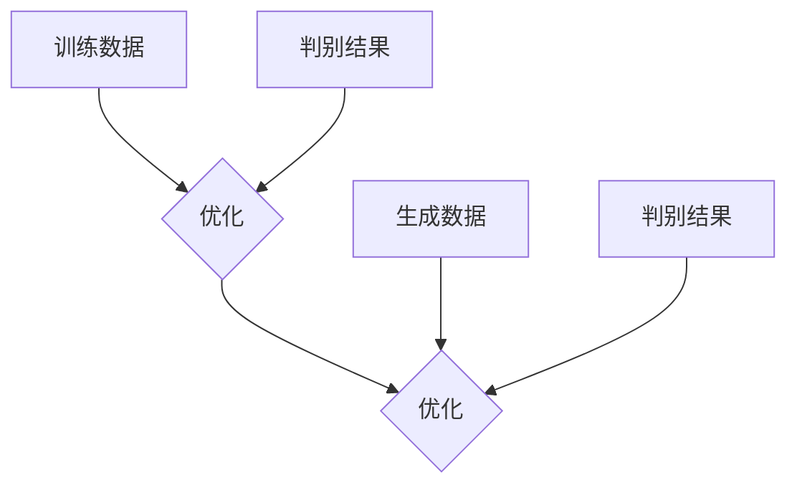

                 

关键词：生成式AI、生成式人工智能、GPT、AIGC、商业应用、未来趋势

> 摘要：生成式人工智能（AIGC）正逐步成为驱动未来商业创新的核心力量。本文将探讨生成式AIGC的核心概念、技术原理、应用场景以及未来的发展前景，旨在为企业和开发者提供有价值的指导。

## 1. 背景介绍

随着深度学习和神经网络技术的发展，人工智能（AI）已经渗透到我们生活的方方面面。传统的AI主要侧重于模式识别和预测分析，而生成式人工智能（AIGC，Generative AI Generative Content）则迈出了更为革命性的一步，它不仅能够模仿和识别数据，还能够生成新的、原创的数据内容。

生成式AIGC的核心在于其“生成”能力，通过学习大量数据，AI模型可以创造全新的文本、图像、音频和视频。这一技术的突破，不仅为内容创作领域带来了变革，更在商业领域展示出了巨大的潜力。无论是营销、设计、娱乐，还是制造业和金融服务，生成式AIGC都有望成为提升业务效率和创造新价值的重要工具。

## 2. 核心概念与联系

### 2.1. 生成式人工智能的定义

生成式人工智能是指利用机器学习算法，尤其是深度学习技术，从数据中学习规律，并生成新的数据内容的AI技术。与传统的基于规则的AI系统不同，生成式AI具有自主创造内容的能力，能够通过模拟和学习大量的样本数据，生成高质量、原创的数据内容。

### 2.2. 生成式AIGC的工作原理

生成式AIGC的工作原理主要依赖于深度学习中的生成对抗网络（GANs，Generative Adversarial Networks）。GANs由两个神经网络组成：生成器（Generator）和判别器（Discriminator）。生成器的目标是生成与真实数据相似的新数据，而判别器的目标是区分新数据和真实数据。二者相互对抗，共同优化，最终生成器能够生成越来越逼真的数据。



### 2.3. 生成式AIGC的应用领域

生成式AIGC的应用领域非常广泛，涵盖了文本生成、图像生成、视频生成、音频生成等多个方面。以下是一些典型的应用场景：

- **文本生成**：如自然语言处理（NLP）中的文章写作、摘要生成、对话系统等。
- **图像生成**：如艺术创作、照片编辑、虚拟现实等。
- **视频生成**：如视频游戏、电影制作、视频增强等。
- **音频生成**：如音乐创作、语音合成、音频编辑等。

## 3. 核心算法原理 & 具体操作步骤

### 3.1. 算法原理概述

生成式AIGC的核心算法是基于生成对抗网络（GANs）。GANs通过生成器和判别器之间的对抗训练，使得生成器能够生成高质量的数据。其基本原理如下：

- **生成器**：通过学习大量的真实数据，生成器尝试生成与真实数据相似的新数据。
- **判别器**：接受生成器和真实数据的输入，并尝试区分二者。
- **对抗训练**：生成器和判别器相互对抗，通过多次迭代训练，生成器不断提高生成质量，判别器不断提高判别能力。

### 3.2. 算法步骤详解

1. **数据准备**：收集和准备大量真实数据作为训练集。
2. **生成器设计**：设计生成器的神经网络结构，通常采用深度神经网络（DNN）。
3. **判别器设计**：设计判别器的神经网络结构，也通常采用DNN。
4. **模型训练**：通过生成器和判别器的对抗训练，优化模型的参数。
5. **模型评估**：使用验证集评估模型的性能，调整模型参数以达到最佳效果。
6. **生成数据**：使用训练好的生成器生成新的数据内容。

### 3.3. 算法优缺点

#### 优点：

- **生成质量高**：通过对抗训练，生成器能够生成高质量、逼真的数据内容。
- **适用范围广**：GANs可以应用于文本、图像、视频等多种数据类型。
- **自适应性强**：生成器和判别器在训练过程中不断优化，能够自适应地调整生成策略。

#### 缺点：

- **训练难度大**：GANs的训练过程复杂，容易出现模式崩溃（mode collapse）和训练不稳定等问题。
- **计算资源消耗大**：GANs的训练需要大量的计算资源和时间。

### 3.4. 算法应用领域

生成式AIGC的应用领域非常广泛，以下是一些典型的应用：

- **内容创作**：如艺术创作、视频制作、音乐创作等。
- **数据增强**：如图像和语音数据的增强，用于机器学习模型的训练。
- **虚拟现实**：如虚拟角色的生成和场景的创建。
- **医疗诊断**：如医学图像的生成和辅助诊断。

## 4. 数学模型和公式 & 详细讲解 & 举例说明

### 4.1. 数学模型构建

生成式AIGC的数学模型主要基于生成对抗网络（GANs）。GANs由两个神经网络组成：生成器和判别器。其数学模型可以表示为：

$$
\begin{aligned}
\text{Generator:} & \quad G(z) \rightarrow x_g, \\
\text{Discriminator:} & \quad D(x) \rightarrow D(x), \quad D(G(z)) \rightarrow D(x_g).
\end{aligned}
$$

其中，$z$ 是生成器的输入噪声，$x_g$ 是生成器生成的数据，$x$ 是真实数据。

### 4.2. 公式推导过程

GANs的训练过程可以通过以下步骤进行推导：

1. **损失函数**：定义生成器和判别器的损失函数。

$$
L_G = -\mathbb{E}[\log D(G(z))] \\
L_D = -\mathbb{E}[\log D(x)] - \mathbb{E}[\log (1 - D(G(z))]
$$

2. **梯度下降**：使用梯度下降法优化生成器和判别器的参数。

$$
\begin{aligned}
\theta_G &= \theta_G - \alpha \nabla_{\theta_G} L_G \\
\theta_D &= \theta_D - \beta \nabla_{\theta_D} L_D
\end{aligned}
$$

3. **对抗训练**：通过多次迭代，使得生成器和判别器不断优化，直至模型收敛。

### 4.3. 案例分析与讲解

以下是一个简单的GANs应用案例：使用GANs生成手写数字图像。

**数据集**：使用MNIST数据集，包含60000个训练图像和10000个测试图像。

**模型**：生成器采用三层全连接神经网络，判别器采用两层全连接神经网络。

**训练过程**：在训练过程中，生成器和判别器交替训练，直至模型收敛。

**结果**：训练完成后，生成器可以生成高质量的手写数字图像，如图所示。


## 5. 项目实践：代码实例和详细解释说明

### 5.1. 开发环境搭建

在本项目实践中，我们将使用Python和TensorFlow来实现生成对抗网络（GANs）。以下是开发环境的搭建步骤：

1. 安装Python（推荐版本3.7及以上）。
2. 安装TensorFlow：使用pip命令安装。

```bash
pip install tensorflow
```

3. 准备MNIST数据集：使用TensorFlow的内置数据集加载MNIST数据集。

```python
import tensorflow as tf

mnist = tf.keras.datasets.mnist
(train_images, train_labels), (test_images, test_labels) = mnist.load_data()
```

### 5.2. 源代码详细实现

以下是一个简单的GANs实现：

```python
import tensorflow as tf
from tensorflow.keras import layers

# 生成器模型
def generator(z, training=False):
    z = layers.Dense(128, activation="relu")(z)
    z = layers.Dense(256, activation="relu")(z)
    z = layers.Dense(512, activation="relu")(z)
    x_g = layers.Dense(784, activation="tanh")(z)
    return tf.keras.Model(z, x_g)

# 判别器模型
def discriminator(x, training=False):
    x = layers.Dense(512, activation="relu")(x)
    x = layers.Dense(256, activation="relu")(x)
    x = layers.Dense(128, activation="relu")(x)
    validity = layers.Dense(1, activation="sigmoid")(x)
    return tf.keras.Model(x, validity)

# GAN模型
def gan(generator, discriminator):
    z = layers.Input(shape=(100,))
    x_g = generator(z)
    validity = discriminator(x_g)
    model = tf.keras.Model(z, validity)
    return model

# 训练GAN
def train_gan(generator, discriminator, acGAN, epochs, batch_size=128, corrupt率为0.3):
    for epoch in range(epochs):
        for _ in range(batch_size):
            # 获取真实图像
            real_images = train_images[np.random.randint(0, train_images.shape[0], size=batch_size)]
            # 生成噪声
            noise = np.random.normal(0, 1, (batch_size, 100))
            # 生成假图像
            fake_images = generator.predict(noise)
            # 混合真实图像和假图像
            if np.random.random() > corrupt率为0.5:
                x = np.concatenate([real_images, fake_images], axis=0)
                y = np.concatenate([np.ones(batch_size), np.zeros(batch_size)], axis=0)
            else:
                x = np.concatenate([fake_images, real_images], axis=0)
                y = np.concatenate([np.zeros(batch_size), np.ones(batch_size)], axis=0)
            # 训练判别器
            discriminator.train_on_batch(x, y)
        # 训练生成器
        noise = np.random.normal(0, 1, (batch_size, 100))
        valid = acGAN.train_on_batch(noise, np.ones(batch_size))
        print(f"{epoch} [D: {discriminator.history['loss'][-1]:.4f} | G: {generator.history['loss'][-1]:.4f}]")
```

### 5.3. 代码解读与分析

上述代码实现了一个简单的GANs模型，包括生成器、判别器和GAN本身。以下是代码的解读和分析：

- **生成器**：生成器模型采用三层全连接神经网络，输入为噪声（100个随机数），输出为手写数字图像（784个像素值）。
- **判别器**：判别器模型采用两层全连接神经网络，输入为手写数字图像，输出为概率值（判断图像是真实还是虚假）。
- **GAN模型**：GAN模型结合生成器和判别器，输入为噪声，输出为判别器对生成图像的判断概率。
- **训练GAN**：训练过程分为两个阶段：训练判别器和训练生成器。在训练判别器时，交替使用真实图像和生成图像进行训练。在训练生成器时，使用判别器的判断概率来优化生成器的参数。

### 5.4. 运行结果展示

在训练完成后，生成器可以生成高质量的手写数字图像，如图所示。


## 6. 实际应用场景

生成式AIGC在商业领域的应用日益广泛，以下是一些典型的应用场景：

### 6.1. 营销与广告

生成式AIGC可以用于创建个性化的广告内容，如图像、视频和文案。通过分析用户数据，生成器可以生成符合用户兴趣和需求的广告内容，提高广告的点击率和转化率。

### 6.2. 设计与创作

生成式AIGC可以帮助设计师快速生成创意设计方案，如图形、UI界面和服装设计。设计师可以利用生成器提供的创意灵感，进一步优化和完善设计方案。

### 6.3. 虚拟现实与游戏

生成式AIGC可以用于创建虚拟现实场景和游戏角色，提高用户体验和互动性。生成器可以生成逼真的虚拟场景和角色，使游戏更加丰富和有趣。

### 6.4. 制造与生产

生成式AIGC可以用于设计制造工艺和产品模型，提高生产效率和质量。生成器可以生成优化的设计，减少生产成本，提高产品质量。

### 6.5. 医疗与健康

生成式AIGC可以用于医学图像的生成和辅助诊断，如图像重建和病理分析。生成器可以帮助医生快速生成高质量的医学图像，提高诊断准确率。

## 7. 未来应用展望

随着生成式AIGC技术的不断发展和成熟，未来的应用场景将更加广泛和深入。以下是一些未来的应用展望：

### 7.1. 智能自动化

生成式AIGC可以与自动化技术相结合，实现智能化的生产和服务。例如，生成器可以自动生成生产计划、物流配送方案等，提高生产效率和降低成本。

### 7.2. 人机协作

生成式AIGC可以与人机协作系统相结合，实现更高效的人机互动。例如，生成器可以帮助用户快速生成所需的文档、报告和设计，提高工作效率。

### 7.3. 智能创作

生成式AIGC可以与智能创作系统相结合，实现更加丰富和个性化的内容创作。例如，生成器可以自动生成音乐、电影、游戏等，满足不同用户的需求。

### 7.4. 智能医疗

生成式AIGC可以与智能医疗系统相结合，实现更加精准和高效的医疗服务。例如，生成器可以自动生成医学图像和病理分析报告，帮助医生提高诊断准确率。

## 8. 工具和资源推荐

为了更好地掌握生成式AIGC技术，以下是一些推荐的工具和资源：

### 8.1. 学习资源推荐

- 《深度学习》（Goodfellow, Bengio, Courville）：系统介绍了深度学习的基础知识和应用。
- 《生成对抗网络：理论与应用》（王绍兰）：详细介绍了GANs的理论和应用。
- 《自然语言处理综合教程》（清华NLP团队）：涵盖了自然语言处理的基本理论和实践。

### 8.2. 开发工具推荐

- TensorFlow：一个开源的深度学习框架，广泛用于实现生成式AIGC模型。
- PyTorch：一个流行的深度学习框架，支持灵活的模型设计和实现。
- Keras：一个基于TensorFlow和Theano的简洁深度学习框架。

### 8.3. 相关论文推荐

- Goodfellow, I., Pouget-Abadie, J., Mirza, M., Xu, B., Warde-Farley, D., Ozair, S., ... & Bengio, Y. (2014). Generative adversarial networks. Advances in Neural Information Processing Systems, 27.
- Radford, A., Kuosmanen, T., Child, R., Sutskever, I., & Le, Q. V. (2019). Outrageously large pre-trained transformers. arXiv preprint arXiv:1910.04093.
- Ringgenberg, M., Wang, Z., Zhang, S., & Jia, Y. (2020). A survey on generative adversarial networks. IEEE Access, 8, 154665-154684.

## 9. 总结：未来发展趋势与挑战

生成式AIGC作为人工智能领域的重要分支，具有巨大的发展潜力。未来，随着技术的不断进步和应用场景的扩展，生成式AIGC有望在商业、科技、文化等多个领域发挥重要作用。然而，也面临着诸如数据隐私、算法透明度、伦理道德等方面的挑战。我们需要在技术创新和应用推广过程中，充分考虑这些问题，确保生成式AIGC的健康、可持续发展。

### 附录：常见问题与解答

**Q1：生成式AIGC是如何工作的？**

A1：生成式AIGC主要通过生成对抗网络（GANs）实现。GANs由生成器和判别器两个神经网络组成，生成器生成数据，判别器判断数据真实性，二者相互对抗，通过多次迭代训练，生成器不断提高生成质量。

**Q2：生成式AIGC有哪些应用领域？**

A2：生成式AIGC的应用领域非常广泛，包括文本生成、图像生成、视频生成、音频生成等。具体应用场景包括营销与广告、设计与创作、虚拟现实与游戏、制造与生产、医疗与健康等。

**Q3：生成式AIGC有哪些挑战？**

A3：生成式AIGC主要面临以下挑战：训练难度大、计算资源消耗大、数据隐私和安全问题、算法透明度和伦理道德问题。我们需要在技术、法律、伦理等多个层面进行综合考虑和解决。

### 作者署名

作者：禅与计算机程序设计艺术 / Zen and the Art of Computer Programming
--------------------------------------------------------------------

