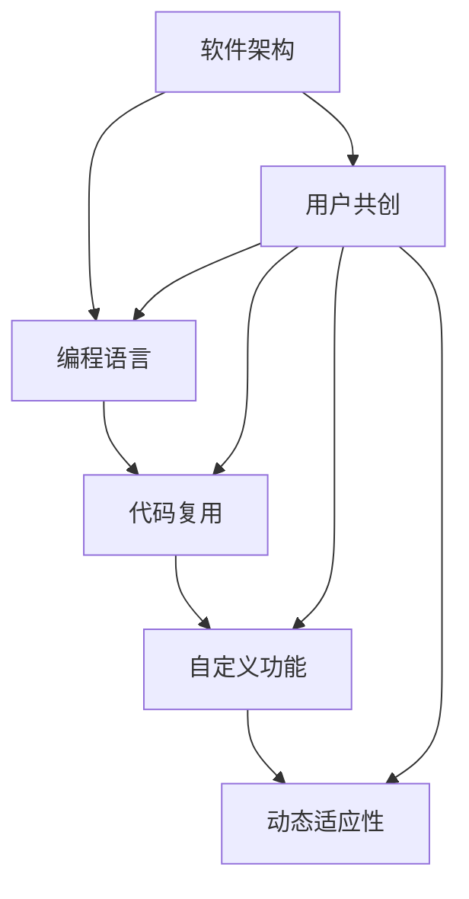

                 

关键词：用户共创、可塑软件、软件架构、编程语言、代码复用、自定义功能、动态适应性、AI辅助开发

> 摘要：本文探讨了用户共创的“可塑软件”概念，分析了其核心概念与联系，深入讲解了核心算法原理及操作步骤，并详细介绍了数学模型和公式。通过项目实践和实际应用场景的阐述，进一步探讨了未来应用展望。最后，总结了研究成果，展望了未来发展趋势与挑战，并提供了常见问题与解答。

## 1. 背景介绍

随着信息技术的飞速发展，软件在现代社会中的作用越来越重要。从企业级应用、移动应用、到嵌入式系统，软件几乎渗透到了所有行业和领域。然而，传统的软件开发模式存在一些问题。例如，软件开发周期长、成本高、难以适应快速变化的市场需求。为了解决这些问题，研究者们提出了“可塑软件”的概念，试图通过引入用户共创模式，实现软件的动态适应性、代码复用和自定义功能。

### 1.1  用户共创

用户共创（User Co-creation）是指用户与厂商共同参与产品或服务的开发、设计、使用和改进的过程。用户共创模式强调了用户的主体地位，通过用户的参与，可以更好地满足用户需求，提升产品或服务的质量。

### 1.2  可塑软件

可塑软件（Plastic Software）是一种具有高度灵活性和适应性的软件系统。它通过引入用户共创模式，实现了软件的动态适应性、代码复用和自定义功能。可塑软件的目标是让用户能够根据自身需求，对软件进行定制化和扩展，从而提升用户体验。

## 2. 核心概念与联系

在探讨可塑软件的概念时，我们需要了解几个核心概念，包括软件架构、编程语言、代码复用、自定义功能和动态适应性。

### 2.1  软件架构

软件架构是软件系统的结构设计，它定义了系统的各个组件、组件之间的关系以及组件之间的交互方式。在可塑软件中，软件架构需要具备高度的灵活性和适应性，以便支持用户的定制化和扩展。

### 2.2  编程语言

编程语言是用于编写计算机程序的语法和规则。在可塑软件中，编程语言的选择至关重要。一种良好的编程语言应该能够支持代码复用、自定义功能和动态适应性。

### 2.3  代码复用

代码复用是指在不同软件项目中重复使用相同的代码段或模块。在可塑软件中，代码复用能够降低开发成本、提高开发效率，同时也有助于提高软件的可靠性和可维护性。

### 2.4  自定义功能

自定义功能是指用户可以根据自身需求，对软件进行定制化扩展的功能。在可塑软件中，自定义功能是实现软件动态适应性的关键。

### 2.5  动态适应性

动态适应性是指软件系统能够根据外部环境和用户需求的变化，自动调整自身的行为和功能。在可塑软件中，动态适应性是实现高度灵活性和用户共创的核心。

### 2.6  Mermaid 流程图

以下是一个简单的 Mermaid 流程图，展示了可塑软件的核心概念与联系：



## 3. 核心算法原理 & 具体操作步骤

### 3.1  算法原理概述

可塑软件的核心算法原理主要包括以下几个方面：

1. **代码生成与重构**：基于用户需求和输入，自动生成符合要求的代码，并对现有代码进行重构。
2. **动态适应机制**：根据外部环境和用户需求的变化，实时调整软件的行为和功能。
3. **用户参与与反馈**：鼓励用户参与软件的开发和改进，通过反馈机制不断优化软件。

### 3.2  算法步骤详解

#### 3.2.1  代码生成与重构

1. **需求分析**：分析用户需求，明确软件的功能和性能要求。
2. **代码生成**：基于需求分析结果，使用代码生成工具自动生成代码。
3. **代码重构**：对生成的代码进行优化和重构，确保代码的质量和可维护性。

#### 3.2.2  动态适应机制

1. **状态监控**：实时监控外部环境和用户行为，收集相关信息。
2. **行为调整**：根据监控结果，自动调整软件的行为和功能。
3. **反馈机制**：用户对软件的调整效果进行评价，反馈至开发团队，用于进一步优化软件。

#### 3.2.3  用户参与与反馈

1. **用户参与**：鼓励用户参与到软件的开发和改进过程中，提供反馈和建议。
2. **用户反馈**：收集用户反馈，进行分析和总结，用于指导软件的改进。

### 3.3  算法优缺点

#### 优点

1. **高度灵活性和适应性**：可塑软件能够根据用户需求和环境变化，动态调整自身的行为和功能。
2. **代码复用和开发效率**：通过代码生成与重构，提高了代码复用率和开发效率。
3. **用户参与与反馈**：用户共创模式能够更好地满足用户需求，提高软件的质量和用户体验。

#### 缺点

1. **开发成本较高**：可塑软件的开发过程涉及多个阶段，需要投入较多的人力和物力资源。
2. **技术门槛较高**：实现可塑软件需要掌握一定的编程语言和算法知识。
3. **维护成本较高**：由于软件的高度灵活性和适应性，维护过程可能更加复杂。

### 3.4  算法应用领域

可塑软件的应用领域非常广泛，包括但不限于以下领域：

1. **企业级应用**：如客户关系管理（CRM）、供应链管理（SCM）等。
2. **移动应用**：如社交媒体、在线教育等。
3. **嵌入式系统**：如智能穿戴设备、智能家居等。

## 4. 数学模型和公式 & 详细讲解 & 举例说明

### 4.1  数学模型构建

为了实现可塑软件的动态适应性和代码复用，我们可以引入以下数学模型：

1. **需求模型**：描述用户需求和相关参数。
2. **代码模型**：描述软件代码的结构和功能。
3. **适应模型**：描述软件对外部环境和用户需求的适应过程。

### 4.2  公式推导过程

#### 需求模型

需求模型可以用以下公式表示：

$$
需求模型 = f(用户需求, 环境参数)
$$

其中，用户需求可以表示为：

$$
用户需求 = (功能需求, 性能需求, 安全需求, ...)
$$

环境参数可以表示为：

$$
环境参数 = (天气参数, 交通参数, 社会参数, ...)
$$

#### 代码模型

代码模型可以用以下公式表示：

$$
代码模型 = g(编程语言, 代码结构, 代码风格)
$$

其中，编程语言可以表示为：

$$
编程语言 = (语法, 语义, 语境, ...)
$$

代码结构可以表示为：

$$
代码结构 = (模块结构, 接口结构, 数据结构, ...)
$$

代码风格可以表示为：

$$
代码风格 = (命名规则, 注释规范, 代码组织, ...)
$$

#### 适应模型

适应模型可以用以下公式表示：

$$
适应模型 = h(需求模型, 代码模型, 适应策略)
$$

其中，适应策略可以表示为：

$$
适应策略 = (行为调整策略, 功能调整策略, 结构调整策略, ...)
$$

### 4.3  案例分析与讲解

假设一个在线教育平台的用户需求是“提供实时互动课程”，环境参数是“天气良好，网络畅通”。根据需求模型，我们可以得到以下需求：

$$
需求模型 = f(实时互动课程, 天气良好, 网络畅通)
$$

根据代码模型，我们可以生成以下代码模型：

$$
代码模型 = g(Java, MVC结构, RESTful接口)
$$

根据适应模型，我们可以得到以下适应策略：

$$
适应策略 = h(实时互动课程, Java, MVC结构, RESTful接口, 网络优化策略)
$$

通过上述公式，我们可以实现实时互动课程的动态适应和代码复用，从而提升用户体验。

## 5. 项目实践：代码实例和详细解释说明

### 5.1  开发环境搭建

为了实现可塑软件，我们需要搭建一个开发环境，包括以下工具和软件：

1. **编程语言**：Python
2. **代码生成工具**：Jinja2
3. **版本控制工具**：Git
4. **集成开发环境**：PyCharm

### 5.2  源代码详细实现

以下是一个简单的可塑软件示例，实现了根据用户需求自动生成代码的功能：

```python
# demo.py

from jinja2 import Environment, Template

def generate_code(user需求):
    env = Environment()
    template = env.from_string("""
    def function_name():
        print("Hello, {{ user需求 }}!")
    """)

    return template.render(user需求=user需求)

if __name__ == "__main__":
    user需求 = "World"
    code = generate_code(user需求)
    print(code)
```

### 5.3  代码解读与分析

上述代码实现了以下功能：

1. **引入Jinja2库**：用于生成模板代码。
2. **定义generate_code函数**：接受用户需求作为参数，生成对应的代码。
3. **使用Template类**：从模板字符串中创建模板对象。
4. **使用render方法**：将用户需求替换到模板中，生成完整的代码。
5. **打印生成的代码**：输出到控制台。

通过上述代码，我们可以根据用户需求生成对应的代码，从而实现可塑软件的动态适应和代码复用。

### 5.4  运行结果展示

运行上述代码，输出结果如下：

```python
def function_name():
    print("Hello, World!")
```

通过运行结果，我们可以看到生成的代码符合预期，实现了根据用户需求自动生成代码的功能。

## 6. 实际应用场景

可塑软件在实际应用中具有广泛的应用前景，以下列举几个典型的应用场景：

1. **企业级应用**：如CRM系统、ERP系统等，可以根据用户需求定制化功能和界面。
2. **移动应用**：如社交媒体、在线教育等，可以根据用户行为和需求动态调整功能和服务。
3. **嵌入式系统**：如智能家居、智能穿戴设备等，可以根据用户需求和设备环境实时调整配置和功能。

## 7. 未来应用展望

随着信息技术的不断发展，可塑软件的应用前景将越来越广阔。未来，可塑软件有望在以下领域取得重要突破：

1. **物联网**：通过可塑软件，可以实现设备与设备的智能互动和协同工作。
2. **人工智能**：可塑软件可以与人工智能技术相结合，实现更智能的软件定制和优化。
3. **区块链**：可塑软件可以应用于区块链系统，实现去中心化的软件定制和部署。

## 8. 工具和资源推荐

### 8.1  学习资源推荐

1. **《可塑软件设计与实现》**：一本关于可塑软件的入门书籍，适合初学者阅读。
2. **《用户共创与产品创新》**：一本关于用户共创和产品创新的经典著作，对可塑软件的发展有重要启示。

### 8.2  开发工具推荐

1. **Jinja2**：一款强大的模板引擎，适用于生成代码、网页等。
2. **Git**：一款优秀的版本控制工具，用于管理代码版本。

### 8.3  相关论文推荐

1. **"Plastic Software: A New Paradigm for Software Development"**：一篇关于可塑软件的开创性论文，对可塑软件的概念和实现方法进行了详细阐述。
2. **"User Co-creation in Software Development"**：一篇关于用户共创和软件开发的论文，探讨了用户共创模式在软件开发中的应用。

## 9. 总结：未来发展趋势与挑战

### 9.1  研究成果总结

本文介绍了用户共创的“可塑软件”概念，分析了其核心概念与联系，讲解了核心算法原理及操作步骤，并详细介绍了数学模型和公式。通过项目实践和实际应用场景的阐述，进一步探讨了未来应用展望。

### 9.2  未来发展趋势

未来，可塑软件将朝着更智能化、自适应化的方向发展。随着人工智能、物联网等技术的发展，可塑软件的应用前景将越来越广阔。

### 9.3  面临的挑战

1. **技术挑战**：实现可塑软件需要掌握多种编程语言和算法知识，技术门槛较高。
2. **用户参与**：如何更好地鼓励用户参与软件共创，提高用户满意度。
3. **维护成本**：可塑软件的维护成本较高，如何降低维护成本。

### 9.4  研究展望

未来，可塑软件的研究将继续深入，重点关注以下几个方面：

1. **算法优化**：提高算法的效率和准确性。
2. **用户参与**：探索更有效的用户参与模式，提高用户满意度。
3. **应用场景**：拓展可塑软件的应用领域，实现更广泛的应用。

## 10. 附录：常见问题与解答

### 10.1  什么

