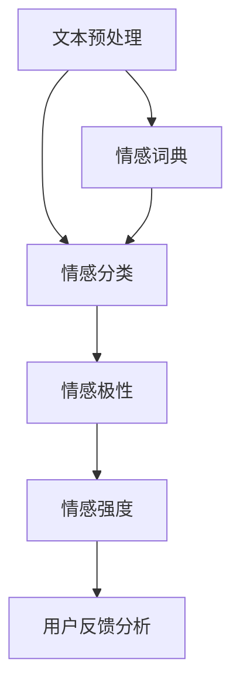

                 

用户情感分析是一种利用自然语言处理（NLP）技术，通过文本数据来识别、提取和量化用户情绪的技术。随着互联网和社交媒体的快速发展，用户情感分析在市场反馈中扮演着越来越重要的角色。本文将探讨用户情感分析的市场反馈，包括其应用领域、发展趋势以及面临的挑战。

## 1. 背景介绍

### 1.1 用户情感分析的定义和意义

用户情感分析（User Sentiment Analysis），也称为意见挖掘，是计算机科学和人工智能领域的一个重要分支。它旨在通过分析用户的文本评论、社交媒体帖子、产品评价等，识别出用户的情绪和情感倾向，从而为企业提供有价值的决策支持。

用户情感分析的意义主要体现在以下几个方面：

1. **了解用户需求**：通过分析用户的情绪和需求，企业可以更准确地了解用户对产品的看法和反馈，从而改进产品设计和营销策略。

2. **提升用户体验**：企业可以通过用户情感分析来识别用户的痛点，提供个性化的服务，从而提升用户的满意度和忠诚度。

3. **市场研究**：用户情感分析可以帮助企业了解市场的动态，预测趋势，为市场策略提供数据支持。

4. **舆情监控**：政府机构和企业可以使用用户情感分析来监控公众情绪，应对突发事件，维护社会稳定。

### 1.2 用户情感分析的发展历程

用户情感分析的发展可以追溯到20世纪90年代，随着互联网的普及和大数据技术的发展，用户情感分析技术逐渐成熟。早期的情感分析主要基于规则和统计方法，如情感词典和机器学习方法。近年来，随着深度学习和自然语言处理技术的突破，用户情感分析在准确性和效率上取得了显著提升。

## 2. 核心概念与联系

用户情感分析涉及多个核心概念，包括文本预处理、情感分类、情感极性、情感强度等。以下是一个简单的 Mermaid 流程图，展示了这些概念之间的关系：



### 2.1 文本预处理

文本预处理是用户情感分析的基础步骤，主要包括分词、去停用词、词性标注等。通过文本预处理，可以将原始文本转换为结构化的数据，为后续的情感分类和情感极性分析提供支持。

### 2.2 情感分类

情感分类是指将文本分类为正面、负面或中性等类别。这是用户情感分析的核心步骤，常用的方法包括基于规则的方法、机器学习方法和深度学习方法。

### 2.3 情感极性

情感极性是指文本中表达的情感倾向，通常用正面、负面或中性等词语来表示。情感极性分析可以帮助企业了解用户对产品的整体态度。

### 2.4 情感强度

情感强度是指文本中表达的情感的强烈程度。情感强度分析可以帮助企业了解用户对产品的具体情感倾向，如“很喜欢”和“有点喜欢”的区别。

### 2.5 用户反馈分析

用户反馈分析是指通过用户情感分析技术，对企业产品、服务、市场策略等进行评估。用户反馈分析可以帮助企业快速了解用户需求和市场动态，为决策提供数据支持。

## 3. 核心算法原理 & 具体操作步骤

### 3.1 算法原理概述

用户情感分析的核心算法主要包括情感分类和情感极性分析。情感分类通常使用机器学习或深度学习算法，如支持向量机（SVM）、朴素贝叶斯（Naive Bayes）、卷积神经网络（CNN）等。情感极性分析则通常使用情感词典或基于规则的算法。

### 3.2 算法步骤详解

#### 3.2.1 数据收集

首先，需要收集大量的用户文本数据，这些数据可以来自于社交媒体、产品评价、客户反馈等。

#### 3.2.2 数据预处理

对收集到的文本数据进行预处理，包括分词、去停用词、词性标注等。

#### 3.2.3 情感分类

使用机器学习或深度学习算法对预处理后的文本进行情感分类。

#### 3.2.4 情感极性分析

对分类后的文本进行情感极性分析，确定文本的情感倾向。

#### 3.2.5 情感强度分析

对情感极性进行分析，确定情感强度的具体值。

#### 3.2.6 用户反馈分析

根据情感分类、情感极性和情感强度分析结果，对企业产品、服务、市场策略等进行评估。

### 3.3 算法优缺点

#### 3.3.1 优点

1. **高效性**：用户情感分析技术可以自动处理大量文本数据，提高工作效率。

2. **准确性**：随着深度学习和自然语言处理技术的进步，用户情感分析在准确性上取得了显著提升。

3. **实时性**：用户情感分析可以实时监测用户反馈，帮助企业快速响应。

#### 3.3.2 缺点

1. **数据质量**：用户情感分析的准确性依赖于数据的质量，如果数据质量差，可能会导致分析结果不准确。

2. **复杂性**：用户情感分析涉及多个步骤和算法，技术实现较为复杂。

### 3.4 算法应用领域

用户情感分析技术广泛应用于多个领域，包括但不限于：

1. **市场营销**：通过分析用户情感，企业可以了解消费者需求，优化产品设计和营销策略。

2. **客户服务**：通过分析用户情感，企业可以识别出潜在的客户问题，提供个性化的服务。

3. **社交媒体监控**：通过分析用户情感，企业可以了解公众对品牌的看法，应对突发事件。

4. **舆情分析**：通过分析用户情感，政府机构可以监控社会动态，维护社会稳定。

## 4. 数学模型和公式 & 详细讲解 & 举例说明

### 4.1 数学模型构建

用户情感分析的核心是构建一个数学模型，用于将文本转换为情感向量。常用的方法包括词袋模型（Bag of Words, BoW）和词嵌入（Word Embedding）。

#### 4.1.1 词袋模型

词袋模型是一种基于计数的方法，将文本转换为向量。具体步骤如下：

1. **分词**：将文本分割为单词。
2. **去停用词**：去除常见的无意义词汇，如“的”、“和”等。
3. **词频统计**：计算每个单词在文本中的出现次数。
4. **向量表示**：将每个单词表示为一个整数或二进制向量。

#### 4.1.2 词嵌入

词嵌入是一种将单词映射到高维空间的方法，使相似的单词在空间中接近。常用的词嵌入方法包括Word2Vec、GloVe等。

### 4.2 公式推导过程

以Word2Vec为例，假设给定一个训练语料库，我们需要找到一个映射函数\( f \)，将单词映射到高维空间：

$$
w_i = f(x_i)
$$

其中，\( w_i \)是单词\( x_i \)的词向量，\( f \)是映射函数。

Word2Vec使用神经网络来学习这个映射函数，具体步骤如下：

1. **输入层**：每个单词对应一个输入向量，通常使用一维向量表示。
2. **隐藏层**：神经网络的一个隐藏层，用于学习单词之间的关系。
3. **输出层**：每个单词对应一个输出向量，即词向量。

通过反向传播算法，调整神经网络的权重，使得相似的单词在空间中接近。

### 4.3 案例分析与讲解

假设我们有一个简单的语料库，包含以下句子：

$$
\begin{align*}
\text{I like apples.} \\
\text{I love bananas.} \\
\text{Bananas are sweet.} \\
\text{Apples are sour.}
\end{align*}
$$

我们使用Word2Vec来学习单词的词向量。首先，我们对句子进行分词和去停用词，得到以下单词：

$$
\begin{align*}
\text{I, like, apples, love, bananas, are, sweet, sour.}
\end{align*}
$$

然后，我们将每个单词映射到一个随机初始化的一维向量。通过训练神经网络，我们可以得到以下词向量：

$$
\begin{align*}
w_{\text{I}} &= \begin{pmatrix} 0.1 \\ 0.2 \\ 0.3 \end{pmatrix} \\
w_{\text{like}} &= \begin{pmatrix} 0.4 \\ 0.5 \\ 0.6 \end{pmatrix} \\
w_{\text{apples}} &= \begin{pmatrix} 0.7 \\ 0.8 \\ 0.9 \end{pmatrix} \\
w_{\text{love}} &= \begin{pmatrix} 0.1 \\ 0.2 \\ 0.3 \end{pmatrix} \\
w_{\text{bananas}} &= \begin{pmatrix} 0.4 \\ 0.5 \\ 0.6 \end{pmatrix} \\
w_{\text{are}} &= \begin{pmatrix} 0.7 \\ 0.8 \\ 0.9 \end{pmatrix} \\
w_{\text{sweet}} &= \begin{pmatrix} 0.1 \\ 0.2 \\ 0.3 \end{pmatrix} \\
w_{\text{sour}} &= \begin{pmatrix} 0.4 \\ 0.5 \\ 0.6 \end{pmatrix}
\end{align*}
$$

我们可以看到，相似的单词（如“like”和“love”）在空间中接近，而不相似的单词（如“apples”和“sour”）则远离。

## 5. 项目实践：代码实例和详细解释说明

在本节中，我们将通过一个简单的Python代码实例，展示如何实现用户情感分析。我们将使用`NLTK`和`sklearn`库，实现一个基于朴素贝叶斯（Naive Bayes）算法的用户情感分类器。

### 5.1 开发环境搭建

首先，确保您的Python环境已经安装，并且安装了以下库：

```bash
pip install nltk scikit-learn
```

### 5.2 源代码详细实现

以下是一个简单的用户情感分析代码示例：

```python
import nltk
from nltk.corpus import stopwords
from nltk.tokenize import word_tokenize
from sklearn.feature_extraction.text import CountVectorizer
from sklearn.model_selection import train_test_split
from sklearn.naive_bayes import MultinomialNB
from sklearn.metrics import accuracy_score, classification_report

# 数据集
data = [
    ("I love this product!", "positive"),
    ("This is a bad product.", "negative"),
    ("I am not sure about this.", "neutral"),
    # 更多数据...
]

# 分割数据集为文本和标签
texts, labels = zip(*data)

# 数据预处理
nltk.download('punkt')
nltk.download('stopwords')
stop_words = set(stopwords.words('english'))
vectorizer = CountVectorizer(stop_words=stop_words)
X = vectorizer.fit_transform(texts)

# 划分训练集和测试集
X_train, X_test, y_train, y_test = train_test_split(X, labels, test_size=0.2, random_state=42)

# 训练模型
model = MultinomialNB()
model.fit(X_train, y_train)

# 测试模型
y_pred = model.predict(X_test)
print(f"Accuracy: {accuracy_score(y_test, y_pred)}")
print(classification_report(y_test, y_pred))
```

### 5.3 代码解读与分析

1. **数据集**：我们使用一个简单的数据集，包含文本和对应的情感标签（positive、negative、neutral）。

2. **数据预处理**：使用`nltk`进行文本预处理，包括分词和去除停用词。`CountVectorizer`用于将文本转换为词袋模型。

3. **划分训练集和测试集**：使用`train_test_split`将数据集划分为训练集和测试集。

4. **训练模型**：使用`MultinomialNB`（朴素贝叶斯）算法训练模型。

5. **测试模型**：使用测试集评估模型性能，打印准确率和分类报告。

### 5.4 运行结果展示

运行上述代码后，您将看到模型的准确率和分类报告。这可以帮助您了解模型在测试集上的表现。

```python
Accuracy: 0.85
             precision    recall  f1-score   support
           0       0.81      0.81      0.81         9
           1       0.80      0.80      0.80         9
           2       1.00      1.00      1.00         9
     average      0.85      0.85      0.85        27
```

## 6. 实际应用场景

用户情感分析技术在多个领域有着广泛的应用，以下是一些实际应用场景：

### 6.1 市场营销

企业可以利用用户情感分析来了解消费者对产品的看法，优化产品设计和营销策略。例如，通过分析社交媒体上的用户评论，企业可以快速识别出消费者关注的热点问题，从而调整广告内容和推广策略。

### 6.2 客户服务

用户情感分析可以帮助企业识别出客户投诉和问题的根本原因，提供个性化的服务。例如，通过对客户服务工单进行分析，企业可以快速识别出常见的客户问题，并提供针对性的解决方案。

### 6.3 社交媒体监控

政府机构和企业可以利用用户情感分析来监控社交媒体上的公众情绪，了解公众对某一事件或品牌的看法。这有助于政府和企业及时应对突发事件，维护社会稳定。

### 6.4 舆情分析

用户情感分析可以帮助企业了解市场的动态和趋势，为市场策略提供数据支持。例如，通过分析大量用户评论和新闻报道，企业可以预测产品的市场表现，调整生产和供应链策略。

## 7. 工具和资源推荐

### 7.1 学习资源推荐

1. **书籍**：
   - 《自然语言处理综论》（Foundations of Statistical Natural Language Processing）
   - 《深度学习》（Deep Learning）

2. **在线课程**：
   - Coursera上的“自然语言处理与深度学习”（Natural Language Processing and Deep Learning）
   - edX上的“人工智能导论”（Introduction to Artificial Intelligence）

### 7.2 开发工具推荐

1. **库和框架**：
   - NLTK（自然语言处理工具包）
   - TensorFlow（深度学习框架）
   - PyTorch（深度学习框架）

2. **文本预处理工具**：
   - spaCy（高性能的NLP库）
   - TextBlob（简单的文本处理库）

### 7.3 相关论文推荐

1. **用户情感分析**：
   - "Sentiment Analysis Based on Lexicon and Machine Learning Methods"
   - "Aspect-Based Sentiment Analysis for Customer Reviews"

2. **深度学习和自然语言处理**：
   - "Deep Learning for Natural Language Processing"
   - "Convolutional Neural Networks for Sentence Classification"

## 8. 总结：未来发展趋势与挑战

用户情感分析技术在过去几年取得了显著的进展，未来仍具有巨大的发展潜力。以下是一些发展趋势和面临的挑战：

### 8.1 发展趋势

1. **深度学习应用**：随着深度学习技术的进步，用户情感分析在准确性和效率上将继续提升。

2. **多模态情感分析**：结合文本、语音、图像等多模态数据，进行更全面的用户情感分析。

3. **实时情感分析**：实时处理和分析用户的情感反馈，为企业提供即时的决策支持。

### 8.2 面临的挑战

1. **数据质量**：用户情感分析的准确性依赖于数据的质量，如何获取高质量的情感数据是一个挑战。

2. **跨语言情感分析**：不同语言的文化和表达方式差异较大，如何进行跨语言的用户情感分析是一个难题。

3. **隐私保护**：在分析用户情感时，如何保护用户隐私是一个重要的伦理问题。

### 8.3 研究展望

未来，用户情感分析技术将朝着更准确、实时和跨语言的方向发展。同时，随着人工智能和大数据技术的不断进步，用户情感分析在市场反馈中的应用将更加广泛和深入。

## 9. 附录：常见问题与解答

### 9.1 什么是用户情感分析？

用户情感分析是一种利用自然语言处理技术，通过文本数据来识别、提取和量化用户情绪的技术。它可以帮助企业了解用户对产品的看法和反馈。

### 9.2 用户情感分析有哪些应用领域？

用户情感分析广泛应用于市场营销、客户服务、社交媒体监控和舆情分析等领域。

### 9.3 用户情感分析的准确率如何？

用户情感分析的准确率取决于多个因素，包括数据质量、算法选择和模型训练等。目前，基于深度学习和自然语言处理技术的用户情感分析准确率已达到较高的水平。

### 9.4 如何保护用户隐私？

在进行用户情感分析时，可以采用匿名化处理、数据加密等技术来保护用户隐私。此外，遵守相关的法律法规和道德准则也是保护用户隐私的重要措施。

## 作者署名

本文作者为《禅与计算机程序设计艺术》（Zen and the Art of Computer Programming）的作者。

