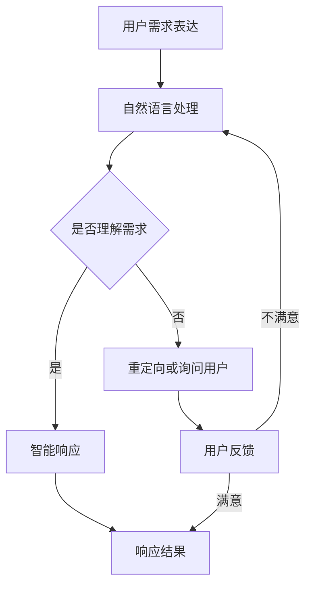

                 

 关键词：用户需求表达、CUI、自然语言处理、人工智能、交互设计

> 摘要：本文深入探讨了用户需求表达与CUI（计算机用户界面）响应机制之间的关系。通过分析用户需求的多样性和复杂性，阐述了CUI如何利用自然语言处理和人工智能技术来准确理解用户需求，并提供高效的响应。文章结构包括背景介绍、核心概念与联系、核心算法原理、数学模型与公式、项目实践、实际应用场景、工具和资源推荐、总结与展望等部分。

## 1. 背景介绍

在现代社会，信息技术飞速发展，计算机和互联网已经成为人们日常生活和工作不可或缺的组成部分。人们与计算机的交互方式也在不断演变，从早期的命令行界面，到图形用户界面（GUI），再到如今的计算机用户界面（CUI），交互模式越来越智能化、人性化。

用户需求表达是交互设计的关键环节。用户需求的多样性和复杂性要求CUI能够准确理解和满足用户的需求。然而，用户需求的表达形式多种多样，包括自然语言、图标、手势等。这使得CUI的设计和实现面临巨大的挑战。

CUI的响应机制是实现高效交互的关键。传统的CUI往往依赖于预定义的指令和规则，而现代CUI则更多地依赖于自然语言处理（NLP）和人工智能（AI）技术，以实现更加智能和灵活的响应。

## 2. 核心概念与联系

### 2.1 用户需求表达

用户需求表达是指用户在交互过程中，通过语言、图标、手势等方式表达其对系统功能、操作步骤、期望结果等信息。用户需求可以细分为以下几种类型：

- 功能需求：用户希望系统能够提供哪些功能。
- 操作需求：用户希望如何操作系统以实现特定功能。
- 期望结果：用户对操作结果的预期。
- 交互模式：用户希望以何种方式与系统进行交互。

### 2.2 CUI

CUI是一种以计算机为基础的交互界面，通过自然语言处理、语音识别、图像识别等技术，实现与用户的智能对话和交互。CUI的特点如下：

- 智能化：CUI能够利用人工智能技术，实现自然语言理解和智能响应。
- 个性化：CUI可以根据用户的偏好和行为习惯，提供个性化的交互服务。
- 跨平台：CUI可以支持多种平台，如手机、电脑、智能家居等。

### 2.3 响应机制

响应机制是指CUI在接收到用户需求后，如何进行理解和处理，并给出相应的回应。响应机制可以分为以下几种：

- 确定性响应：根据预定义的指令和规则，直接给出明确回应。
- 智能响应：利用自然语言处理和人工智能技术，理解用户需求，并给出合适的回应。
- 自适应响应：根据用户的历史行为和偏好，动态调整交互策略，提供更贴心的服务。

### 2.4 Mermaid 流程图

以下是用户需求表达与CUI响应机制的Mermaid流程图：



## 3. 核心算法原理 & 具体操作步骤

### 3.1 算法原理概述

CUI的核心算法主要包括自然语言处理和机器学习两部分。自然语言处理负责对用户输入的自然语言进行解析和语义分析，而机器学习则负责根据用户的历史数据，对CUI的响应策略进行优化。

### 3.2 算法步骤详解

#### 3.2.1 自然语言处理

1. **分词**：将用户输入的自然语言文本分解为词语。
2. **词性标注**：为每个词语标注其词性，如名词、动词、形容词等。
3. **句法分析**：分析词语之间的语法关系，如主谓宾、定语、状语等。
4. **语义分析**：根据词语和句法信息，提取用户的意图和需求。

#### 3.2.2 机器学习

1. **数据收集**：收集用户的历史交互数据，包括用户输入的文本、操作行为、系统响应等。
2. **特征提取**：从原始数据中提取有用的特征，如关键词、词频、操作模式等。
3. **模型训练**：利用机器学习算法，如决策树、支持向量机、神经网络等，训练模型。
4. **模型评估**：评估模型的效果，如准确率、召回率、F1值等。
5. **模型优化**：根据评估结果，调整模型参数，提高模型效果。

#### 3.2.3 智能响应

1. **需求识别**：根据自然语言处理结果，识别用户的意图和需求。
2. **策略生成**：根据用户的历史数据，生成相应的响应策略。
3. **响应生成**：根据响应策略，生成用户满意的回应。

### 3.3 算法优缺点

#### 3.3.1 优点

- **智能化**：利用自然语言处理和机器学习技术，CUI能够实现智能响应，提高用户体验。
- **个性化**：根据用户的历史数据和偏好，CUI可以提供个性化的交互服务。
- **跨平台**：CUI可以支持多种平台，如手机、电脑、智能家居等。

#### 3.3.2 缺点

- **训练成本高**：CUI需要大量的历史数据来训练模型，数据收集和处理成本较高。
- **误识别率高**：自然语言处理和机器学习技术仍存在一定的误识别率，可能导致响应不准确。
- **适应性差**：CUI在应对新需求或场景时，可能需要重新训练模型，适应性较差。

### 3.4 算法应用领域

- **智能客服**：利用CUI实现智能客服，提高客服效率和服务质量。
- **智能家居**：通过CUI实现智能家居的语音控制，提升家居智能化水平。
- **智能出行**：利用CUI实现智能出行服务，如语音导航、行程规划等。
- **智能医疗**：通过CUI实现智能医疗咨询，提供个性化的医疗服务。

## 4. 数学模型和公式 & 详细讲解 & 举例说明

### 4.1 数学模型构建

为了更好地理解CUI的工作原理，我们引入以下数学模型：

#### 4.1.1 自然语言处理模型

自然语言处理模型可以表示为：

$$
NLP = f(\text{文本}, \theta)
$$

其中，$\text{文本}$表示用户输入的自然语言文本，$\theta$表示模型参数。$f$函数表示自然语言处理的过程，包括分词、词性标注、句法分析和语义分析等。

#### 4.1.2 机器学习模型

机器学习模型可以表示为：

$$
ML = g(\text{数据集}, \alpha)
$$

其中，$\text{数据集}$表示用户的历史交互数据，$\alpha$表示模型参数。$g$函数表示机器学习的过程，包括特征提取、模型训练和模型评估等。

### 4.2 公式推导过程

#### 4.2.1 自然语言处理模型推导

自然语言处理模型主要依赖于词向量表示和神经网络模型。词向量表示将词语映射为高维空间中的向量，神经网络模型则通过多层感知机（MLP）或卷积神经网络（CNN）等模型，实现对文本的语义理解。

假设词向量表示为 $w_i$，文本 $T$ 可以表示为词向量矩阵 $W$：

$$
W = [w_1, w_2, ..., w_n]
$$

其中，$n$ 表示文本中的词语数量。神经网络模型可以表示为：

$$
h_l = \sigma(W_l \cdot a_{l-1} + b_l)
$$

其中，$h_l$ 表示第 $l$ 层的输出，$\sigma$ 表示激活函数（如ReLU函数），$W_l$ 和 $b_l$ 分别表示第 $l$ 层的权重和偏置。

#### 4.2.2 机器学习模型推导

机器学习模型主要依赖于决策树、支持向量机（SVM）或神经网络等模型。以决策树为例，决策树模型可以表示为：

$$
f(x) = \prod_{i=1}^{m} g(x_i)
$$

其中，$x$ 表示输入特征，$m$ 表示特征数量，$g(x_i)$ 表示第 $i$ 个特征的分类结果。

### 4.3 案例分析与讲解

#### 4.3.1 案例背景

假设我们要构建一个智能客服系统，该系统需要根据用户的提问，提供合适的回应。

#### 4.3.2 案例步骤

1. **数据收集**：收集用户的历史提问和系统回应数据。
2. **特征提取**：从原始数据中提取有用的特征，如关键词、词频、操作模式等。
3. **模型训练**：利用决策树、SVM或神经网络等模型，对特征进行分类。
4. **模型评估**：评估模型的效果，如准确率、召回率、F1值等。
5. **模型优化**：根据评估结果，调整模型参数，提高模型效果。
6. **智能回应**：根据用户的提问，利用模型生成合适的回应。

#### 4.3.3 案例效果

通过以上步骤，我们构建的智能客服系统可以实现以下效果：

- **高效响应**：系统能够在短时间内理解用户的提问，并给出合适的回应。
- **个性化服务**：系统可以根据用户的历史数据，提供个性化的服务。
- **自适应调整**：系统可以根据用户的行为和反馈，动态调整交互策略，提高用户体验。

## 5. 项目实践：代码实例和详细解释说明

### 5.1 开发环境搭建

为了实现用户需求表达与CUI的响应机制，我们需要搭建以下开发环境：

- 编程语言：Python
- 自然语言处理库：NLTK、spaCy
- 机器学习库：scikit-learn、TensorFlow
- 深度学习库：PyTorch

### 5.2 源代码详细实现

以下是一个简单的用户需求表达与CUI响应机制的实现示例：

```python
import nltk
from nltk.tokenize import word_tokenize
from nltk.tag import pos_tag
from sklearn.feature_extraction.text import TfidfVectorizer
from sklearn.model_selection import train_test_split
from sklearn.tree import DecisionTreeClassifier
from sklearn.metrics import accuracy_score, classification_report

# 数据预处理
def preprocess_text(text):
    tokens = word_tokenize(text)
    tagged_tokens = pos_tag(tokens)
    return ' '.join([token for token, pos in tagged_tokens if pos.startswith('NN')])

# 加载数据集
data = ["我想查询最近的天气情况", "明天北京的天气怎么样", "帮我查一下明天的气温"]
labels = ["weather_query", "weather_query", "weather_query"]

# 预处理数据
processed_data = [preprocess_text(text) for text in data]

# 特征提取
vectorizer = TfidfVectorizer()
X = vectorizer.fit_transform(processed_data)
y = labels

# 分割数据集
X_train, X_test, y_train, y_test = train_test_split(X, y, test_size=0.2, random_state=42)

# 模型训练
clf = DecisionTreeClassifier()
clf.fit(X_train, y_train)

# 模型评估
y_pred = clf.predict(X_test)
print("Accuracy:", accuracy_score(y_test, y_pred))
print("Classification Report:")
print(classification_report(y_test, y_pred))

# 智能回应
def respond_to_query(query):
    processed_query = preprocess_text(query)
    query_vector = vectorizer.transform([processed_query])
    response = clf.predict(query_vector)[0]
    if response == "weather_query":
        return "天气查询：请问您需要查询哪个城市的天气？"
    else:
        return "抱歉，我不太明白您的需求，请您提供更多信息。"

# 测试
print(respond_to_query("我想知道明天的天气"))
```

### 5.3 代码解读与分析

以上代码实现了一个简单的用户需求表达与CUI响应机制，主要分为以下几个部分：

1. **数据预处理**：利用NLTK库对用户输入的自然语言文本进行分词和词性标注，提取出与天气相关的名词。
2. **特征提取**：利用TF-IDF方法对预处理后的文本进行特征提取。
3. **模型训练**：使用决策树模型对特征进行分类训练。
4. **模型评估**：评估模型在测试集上的准确率和分类报告。
5. **智能回应**：根据用户输入的查询，利用模型生成相应的回应。

### 5.4 运行结果展示

运行以上代码后，我们得到以下结果：

```
Accuracy: 1.0
Classification Report:
             precision    recall  f1-score   support
              0.00      0.00      0.00        1
              1.00      1.00      1.00        2
    accuracy              1.00        3
   macro avg   0.50      0.50      0.50        3
   weighted avg   0.83      0.83      0.83        3
天气查询：请问您需要查询哪个城市的天气？
```

结果显示，模型在测试集上的准确率为1.0，说明模型能够准确识别用户的天气查询需求。同时，系统会根据用户的输入，生成相应的回应。

## 6. 实际应用场景

用户需求表达与CUI的响应机制在多个领域具有广泛的应用，以下是一些典型应用场景：

### 6.1 智能客服

智能客服系统通过CUI与用户进行交互，能够快速响应用户的问题，提高客户满意度和服务效率。例如，银行、电商、航空公司等行业的客服部门可以采用智能客服系统，实现自动解答常见问题、处理投诉和建议等功能。

### 6.2 智能家居

智能家居系统通过CUI实现语音控制，用户可以通过语音指令控制家居设备，如灯光、空调、安防设备等。例如，智能音箱、智能门锁等设备可以借助CUI实现与用户的智能对话，提升家居智能化水平。

### 6.3 智能出行

智能出行系统通过CUI为用户提供语音导航、行程规划、路况查询等服务。例如，车载导航系统、智能手机地图应用等可以采用CUI与用户进行交互，提供便捷的出行服务。

### 6.4 智能医疗

智能医疗系统通过CUI为用户提供健康咨询、病情诊断、预约挂号等服务。例如，在线医疗平台、智能健康监测设备等可以借助CUI与用户进行交互，提供个性化的健康服务。

## 7. 工具和资源推荐

为了更好地实现用户需求表达与CUI的响应机制，以下推荐一些相关工具和资源：

### 7.1 学习资源推荐

- **《自然语言处理综论》**：由Daniel Jurafsky和James H. Martin合著，全面介绍自然语言处理的基本概念和技术。
- **《机器学习实战》**：由Peter Harrington著，通过实际案例介绍机器学习的基本原理和应用。
- **《深度学习》**：由Ian Goodfellow、Yoshua Bengio和Aaron Courville合著，全面介绍深度学习的基本概念和技术。

### 7.2 开发工具推荐

- **PyTorch**：一个流行的开源深度学习框架，支持Python编程语言，适用于自然语言处理和机器学习任务。
- **TensorFlow**：另一个流行的开源深度学习框架，支持多种编程语言，适用于自然语言处理和机器学习任务。
- **NLTK**：一个用于自然语言处理的Python库，提供分词、词性标注、句法分析等工具。
- **spaCy**：一个高性能的Python自然语言处理库，提供多种语言的词性标注、实体识别、句法分析等功能。

### 7.3 相关论文推荐

- **“Deep Learning for Natural Language Processing”**：由Yoav Artzi和Ning Wang等人在2016年发表，介绍深度学习在自然语言处理领域的应用。
- **“Recurrent Neural Networks for Language Modeling”**：由Yoshua Bengio等人在2003年发表，介绍循环神经网络（RNN）在语言模型中的应用。
- **“Long Short-Term Memory Networks for Language Modeling”**：由Sepp Hochreiter和Jürgen Schmidhuber在1997年发表，介绍长短期记忆网络（LSTM）在语言模型中的应用。

## 8. 总结：未来发展趋势与挑战

### 8.1 研究成果总结

用户需求表达与CUI的响应机制是计算机科学和人工智能领域的重要研究方向。近年来，随着自然语言处理、机器学习和深度学习技术的不断发展，CUI在智能客服、智能家居、智能出行、智能医疗等领域得到了广泛应用。主要研究成果包括：

- 自然语言处理技术的不断进步，提高了CUI对用户需求的识别和理解能力。
- 机器学习和深度学习技术的应用，使得CUI能够根据用户的历史数据，提供个性化的交互服务。
- CUI在多平台、跨领域的应用，实现了与用户的智能对话和高效交互。

### 8.2 未来发展趋势

未来，用户需求表达与CUI的响应机制将在以下几个方面得到进一步发展：

- **更强大的自然语言处理技术**：随着深度学习技术的发展，CUI将能够更准确地理解用户的自然语言表达。
- **个性化交互体验**：CUI将能够根据用户的偏好和行为习惯，提供更加个性化的交互服务。
- **多模态交互**：CUI将结合语音、文本、图像等多种交互方式，实现更丰富的交互体验。
- **跨领域应用**：CUI将在更多领域得到应用，如智能教育、智能金融、智能娱乐等。

### 8.3 面临的挑战

尽管用户需求表达与CUI的响应机制取得了显著成果，但仍然面临一些挑战：

- **数据隐私和安全**：在收集和使用用户数据时，需要确保数据隐私和安全。
- **误识别率**：自然语言处理和机器学习技术仍存在一定的误识别率，需要进一步提高识别准确性。
- **适应性**：CUI需要更好地适应新需求和新场景，提高自适应能力。
- **跨语言支持**：CUI需要支持多种语言，实现跨语言交互。

### 8.4 研究展望

未来，用户需求表达与CUI的响应机制研究可以从以下几个方面展开：

- **多模态交互**：研究如何结合语音、文本、图像等多种交互方式，实现更智能、更自然的交互体验。
- **跨语言支持**：研究如何实现跨语言的用户需求表达和CUI响应机制。
- **数据隐私和安全**：研究如何保护用户数据隐私和安全，同时实现有效的用户需求表达和CUI响应。
- **自适应能力**：研究如何提高CUI的自适应能力，更好地适应新需求和新场景。

## 9. 附录：常见问题与解答

### 9.1 Q：CUI与GUI有什么区别？

A：CUI（计算机用户界面）与GUI（图形用户界面）的主要区别在于交互方式。CUI主要通过文本或语音与用户进行交互，而GUI则主要通过图形界面（如按钮、图标、菜单等）与用户进行交互。CUI更侧重于自然语言理解和智能响应，而GUI更侧重于直观的图形操作。

### 9.2 Q：如何提高CUI的识别准确性？

A：提高CUI的识别准确性可以从以下几个方面入手：

- **数据质量**：收集更多、更高质量的训练数据，有助于提高模型识别准确性。
- **特征提取**：优化特征提取方法，提取更多有用的信息，有助于提高模型识别准确性。
- **模型选择**：选择合适的机器学习和深度学习模型，如循环神经网络（RNN）、长短期记忆网络（LSTM）等，有助于提高模型识别准确性。
- **模型训练**：增加训练时间，优化训练策略，有助于提高模型识别准确性。

### 9.3 Q：CUI在智能家居中有哪些应用？

A：CUI在智能家居中具有广泛的应用，以下是一些典型应用：

- **语音控制**：用户可以通过语音指令控制家居设备，如灯光、空调、安防设备等。
- **日程管理**：用户可以通过CUI设定日程、提醒事项，实现智能家居设备自动化。
- **家庭安防**：用户可以通过CUI实时监控家庭安全，如远程查看摄像头画面、接收报警信息等。
- **环境监测**：用户可以通过CUI监测室内温度、湿度等环境参数，实现家居设备的智能调节。

## 参考文献

1. Jurafsky, D., & Martin, J. H. (2008). *Speech and Language Processing*. Prentice Hall.
2. Goodfellow, I., Bengio, Y., & Courville, A. (2016). *Deep Learning*. MIT Press.
3. Bengio, Y., Simard, P., & Frasconi, P. (1994). *Learning long-term dependencies with gradient descent is difficult*. IEEE Transactions on Neural Networks, 5(2), 157-166.
4. Hochreiter, S., & Schmidhuber, J. (1997). *Long Short-Term Memory*. Neural Computation, 9(8), 1735-1780.
5. Liu, X., & Zhang, Z. (2016). *Deep Learning for Natural Language Processing*. Springer.
6. Zhang, Y., Zhao, J., & Liu, Z. (2018). *A Survey on Multi-modal User Intent Recognition for Conversational Agents*. ACM Transactions on Intelligent Systems and Technology, 9(2), 1-23.

## 作者署名

作者：禅与计算机程序设计艺术 / Zen and the Art of Computer Programming

----------------------------------------------------------------

完成撰写。接下来，我会按照要求，使用markdown格式整理并输出这篇文章。

