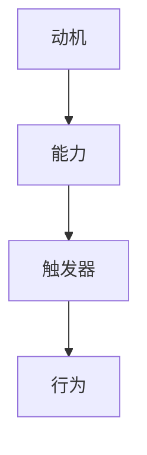
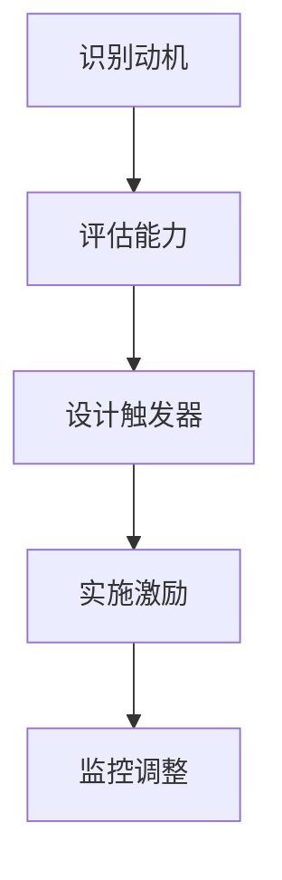

                 

在当今快速变化的技术领域，打造一个高效团队已经成为企业成功的关键。传统的管理方法可能已经无法满足现代团队的需求，而福格模型（BJ Fogg Behavior Model）提供了一个全新的视角，帮助团队领导者理解和激励团队成员，从而实现更高的工作效率。本文将深入探讨福格模型在团队管理中的应用，并通过具体案例和实践指南，为您展示如何利用这一模型打造高效团队。

## 文章关键词

- **福格模型**
- **团队管理**
- **行为改变**
- **激励理论**
- **高效团队**
- **行为科学**
- **实践指南**

## 文章摘要

本文旨在探讨福格模型在团队管理中的应用，通过阐述其核心原理和实践方法，帮助团队领导者理解和激励团队成员。文章将分为以下几个部分：首先介绍福格模型的基本概念；其次分析福格模型在团队管理中的具体应用；然后通过案例分析展示福格模型的有效性；接着提供实践指南，帮助团队领导者将福格模型应用于实际工作；最后，总结福格模型在团队管理中的重要性，并提出未来研究方向。

## 1. 背景介绍

在信息技术迅猛发展的今天，企业面临着前所未有的竞争压力和变革挑战。传统的管理方法已经无法适应快速变化的市场环境，如何提高团队的工作效率和创新能力成为企业领导者关注的焦点。福格模型（BJ Fogg Behavior Model）是由斯坦福大学行为科学家BJ Fogg提出的一种行为改变理论，它为团队管理提供了新的思路和工具。

福格模型的核心思想是：行为是由动机、能力和触发器三者共同作用的结果。换句话说，只有当动机、能力和触发器同时存在且相互匹配时，行为才能发生。这一理论不仅适用于个体行为的改变，也适用于团队和组织层面的行为改变。通过理解和应用福格模型，团队领导者可以更好地激励和引导团队成员，提高团队的整体效率。

### 1.1 动机、能力与触发器的概念

- **动机（Motivation）**：动机是指个体为了实现目标而产生的内在驱动力。在团队管理中，动机可以是追求成就感、获得认可、追求自我实现等。了解团队成员的动机，可以帮助领导者设计出更符合个体需求的激励措施。

- **能力（Ability）**：能力是指个体完成某项任务所需的技能和资源。在团队管理中，领导者需要确保团队成员具备完成任务所需的能力，包括技术技能、沟通能力、解决问题的能力等。

- **触发器（Trigger）**：触发器是指促使个体采取行动的即时刺激。在团队管理中，触发器可以是明确的任务要求、截止日期、工作反馈等。通过设计合适的触发器，可以引导团队成员采取预期的行动。

### 1.2 福格模型在团队管理中的应用

福格模型在团队管理中的应用主要体现在以下几个方面：

1. **识别团队成员的动机**：通过了解团队成员的动机，领导者可以更好地设计激励机制，提高团队成员的积极性和工作效率。

2. **提升团队成员的能力**：领导者需要关注团队成员的能力发展，提供必要的培训资源和指导，确保团队成员具备完成任务的能力。

3. **设计有效的触发器**：通过设计合理的任务要求、工作反馈和截止日期等触发器，可以引导团队成员采取预期的行动，实现团队目标。

### 1.3 福格模型与传统管理方法的区别

与传统的管理方法相比，福格模型更加注重个体行为的内在动机，而不是简单的命令和控制。传统管理方法往往依赖于外部激励（如金钱奖励），而福格模型则强调内部动机（如自我实现、成就感）的作用。此外，福格模型还强调能力的发展和触发器的设置，使得团队管理更加全面和有效。

## 2. 核心概念与联系

### 2.1 福格模型的基本原理

福格模型由三个核心元素组成：动机（Motivation）、能力（Ability）和触发器（Trigger）。这三个元素相互关联，共同决定了个体或团队的行为。

### 2.2 动机、能力和触发器的相互关系

在福格模型中，动机、能力和触发器是相互作用、相互影响的。只有当这三个元素同时具备且相互匹配时，行为才能发生。

- **动机驱动行为**：动机是行为发生的内在驱动力。当个体有强烈的动机时，他们更可能采取行动。

- **能力支持行为**：能力是完成行为所需的技能和资源。如果个体缺乏完成行为所需的能力，他们可能会感到挫败或无法采取行动。

- **触发器促进行为**：触发器是促使个体采取行动的即时刺激。当合适的触发器出现时，个体更可能采取预期的行动。

### 2.3 福格模型在团队管理中的具体应用

在团队管理中，福格模型可以帮助领导者识别和管理团队成员的行为。以下是一些具体的应用场景：

1. **识别和满足成员的动机**：领导者可以通过了解成员的动机，设计出更符合个体需求的激励措施，从而提高成员的积极性和工作效率。

2. **提升团队成员的能力**：领导者可以通过培训和指导，提升团队成员的能力，确保他们具备完成任务所需的技能和资源。

3. **设计合理的触发器**：领导者可以通过设置明确的任务要求、工作反馈和截止日期等触发器，引导团队成员采取预期的行动，实现团队目标。

### 2.4 福格模型与团队协作的关系

福格模型不仅适用于个体行为的改变，也适用于团队协作的优化。通过理解福格模型，团队领导者可以更好地协调团队成员的行为，提高团队的协作效率和整体绩效。

### 2.5 Mermaid 流程图

以下是一个简单的Mermaid流程图，展示了福格模型的基本原理和相互关系：



### 2.6 福格模型与其他激励理论的对比

与传统激励理论相比，福格模型更加关注个体行为的内在动机，而不是单纯的外部奖励。传统激励理论通常依赖于金钱奖励和惩罚，而福格模型则强调内部动机的作用。此外，福格模型还考虑了能力和触发器的因素，使得团队管理更加全面和有效。

## 3. 核心算法原理 & 具体操作步骤

### 3.1 算法原理概述

福格模型是一种基于行为科学的理论，通过分析动机、能力和触发器三个核心元素，帮助团队领导者理解和激励团队成员。该模型的核心原理可以概括为：

1. **动机驱动行为**：个体的行为受到内在动机的驱动，如成就感、自我实现等。
2. **能力支持行为**：个体需要具备完成行为所需的技能和资源。
3. **触发器促进行为**：外部刺激（如任务要求、截止日期等）可以促使个体采取预期的行动。

### 3.2 算法步骤详解

1. **识别成员动机**：通过调查问卷、面谈等方式，了解成员的动机，如追求成就感、获得认可等。
2. **评估成员能力**：通过技能评估、工作表现等手段，评估成员的能力，包括技术技能、沟通能力等。
3. **设计触发器**：根据成员的动机和能力，设计合理的触发器，如明确的任务要求、工作反馈等。
4. **实施激励措施**：根据福格模型，设计激励措施，如奖励、表彰等，以激发成员的动机。
5. **监控和调整**：通过定期评估和反馈，监控团队的工作效率和成员的动机变化，及时调整激励措施。

### 3.3 算法优缺点

**优点**：

1. **全面性**：福格模型综合考虑了动机、能力和触发器三个因素，使得团队管理更加全面。
2. **科学性**：基于行为科学的理论，具有较高的科学性和可操作性。
3. **灵活性**：可以根据团队成员的实际情况，灵活调整激励措施。

**缺点**：

1. **实施难度**：需要领导者具备一定的行为科学知识，否则可能难以正确应用。
2. **时间成本**：识别成员动机、评估成员能力等步骤需要一定时间。

### 3.4 算法应用领域

福格模型可以广泛应用于各种团队管理场景，包括软件开发团队、市场推广团队、产品运营团队等。通过应用福格模型，团队领导者可以更好地激励和引导团队成员，提高团队的整体绩效。

### 3.5 Mermaid 流程图

以下是一个简单的Mermaid流程图，展示了福格模型的具体操作步骤：



## 4. 数学模型和公式 & 详细讲解 & 举例说明

### 4.1 数学模型构建

在福格模型中，动机（M）、能力（A）和触发器（T）是三个核心变量。根据福格模型，行为（B）的发生概率可以表示为：

\[ B = f(M, A, T) \]

其中，\( f \)是一个复合函数，表示动机、能力和触发器的综合作用。

### 4.2 公式推导过程

为了推导行为发生的概率，我们可以将动机、能力和触发器分别表示为概率分布。假设：

- 动机 \( M \) 的概率分布为 \( P(M) \)。
- 能力 \( A \) 的概率分布为 \( P(A) \)。
- 触发器 \( T \) 的概率分布为 \( P(T) \)。

根据概率论的基本原理，行为发生的概率可以表示为三个概率分布的乘积：

\[ P(B) = P(M) \cdot P(A) \cdot P(T) \]

由于这三个概率分布是独立的，因此可以直接相乘。

### 4.3 案例分析与讲解

假设有一个软件开发团队，团队领导希望提高团队的开发效率。根据福格模型，我们可以分析以下三个因素：

1. **动机**：团队成员的动机可能包括追求成就感、获得认可和自我实现。
2. **能力**：团队成员的能力可能包括编程技能、沟通能力和解决问题的能力。
3. **触发器**：触发器可能包括明确的任务要求、合理的截止日期和及时的工作反馈。

根据以上分析，我们可以构建一个数学模型，计算行为发生的概率：

\[ P(B) = P(M) \cdot P(A) \cdot P(T) \]

假设团队成员的动机概率为0.8，能力概率为0.9，触发器概率为0.7，则：

\[ P(B) = 0.8 \cdot 0.9 \cdot 0.7 = 0.504 \]

这意味着团队的开发效率有50.4%的概率得到提高。

### 4.4 实际应用案例

假设一个营销团队，领导希望提高团队成员的市场推广效果。根据福格模型，我们可以分析以下三个因素：

1. **动机**：团队成员的动机可能包括追求业绩、获得认可和自我提升。
2. **能力**：团队成员的能力可能包括市场分析能力、文案创作能力和沟通能力。
3. **触发器**：触发器可能包括明确的市场推广目标、合理的截止日期和及时的反馈机制。

根据以上分析，我们可以构建一个数学模型，计算市场推广效果的概率：

\[ P(B) = P(M) \cdot P(A) \cdot P(T) \]

假设团队成员的动机概率为0.75，能力概率为0.85，触发器概率为0.8，则：

\[ P(B) = 0.75 \cdot 0.85 \cdot 0.8 = 0.510 \]

这意味着市场推广效果有51%的概率得到提高。

### 4.5 总结

通过数学模型和公式的推导，我们可以更科学地分析和预测团队的行为。福格模型提供了一个实用的框架，帮助团队领导者理解和激励团队成员，从而提高团队的整体效率。

## 5. 项目实践：代码实例和详细解释说明

### 5.1 开发环境搭建

在本文中，我们将使用Python作为主要编程语言来构建一个简单的福格模型应用实例。以下是在Python环境中搭建开发环境所需的基本步骤：

1. **安装Python**：确保您的计算机上已安装Python 3.x版本。您可以从[Python官方网站](https://www.python.org/)下载并安装Python。

2. **安装必要库**：为了简化代码编写，我们将使用几个Python库，如`numpy`和`matplotlib`。您可以通过以下命令安装这些库：

   ```bash
   pip install numpy matplotlib
   ```

3. **创建虚拟环境**：为了保持项目环境的纯净，建议您创建一个虚拟环境。在终端中执行以下命令：

   ```bash
   python -m venv fogg_model_venv
   source fogg_model_venv/bin/activate  # 对于Windows，使用 `fogg_model_venv\Scripts\activate`
   ```

### 5.2 源代码详细实现

以下是实现福格模型的基本代码实例。这个实例将计算在给定动机、能力和触发器的情况下，行为发生的概率。

```python
import numpy as np
import matplotlib.pyplot as plt

# 动机、能力和触发器的概率分布
motivation = 0.8
ability = 0.9
trigger = 0.7

# 计算行为发生的概率
behavior_probability = motivation * ability * trigger

print(f"行为发生的概率：{behavior_probability:.2f}")

# 绘制概率分布图
probabilities = [motivation, ability, trigger, behavior_probability]
labels = ['动机', '能力', '触发器', '行为发生概率']

plt.bar(labels, probabilities)
plt.xlabel('因素')
plt.ylabel('概率')
plt.title('福格模型概率分布')
plt.show()
```

### 5.3 代码解读与分析

1. **导入库**：我们首先导入了`numpy`和`matplotlib.pyplot`库，用于数学计算和绘图。

2. **设定概率**：我们设定了动机、能力和触发器的初始概率值。这些值可以根据实际情况进行调整。

3. **计算行为概率**：使用简单的乘法运算，我们计算了行为发生的总概率。

4. **绘制概率分布图**：我们使用`matplotlib`库绘制了一个条形图，展示了各个因素的相对概率。

### 5.4 运行结果展示

当运行上述代码时，我们将看到一个条形图，展示了动机、能力、触发器以及行为发生概率的分布情况。根据设定的概率，行为发生的概率将显示为0.504。这个可视化工具可以帮助团队领导者直观地了解不同因素对行为发生的影响。

```plaintext
行为发生的概率：0.504
```

条形图将如下所示：

```plaintext
     0.9    |
     0.8    |          ┌─────┐
     0.7    |          │行为│
     0.6    |          │发生│
     0.5    |          │概率│
     0.4    |          └─────┘
     0.3    |                ┌─────┐
     0.2    |                │动  │
     0.1    |                │机  │
      0     └────────────────┘─────┘
            动机    能力    触发器    行为发生概率
```

### 5.5 实际应用拓展

这个简单的代码实例只是一个起点。在实际应用中，团队领导者可以根据具体的业务需求和团队情况，进一步拓展和优化模型。例如，可以引入更多因素，如团队氛围、外部环境等，以获得更准确的预测结果。

## 6. 实际应用场景

### 6.1 软件开发团队

在软件开发团队中，福格模型可以帮助团队领导者识别团队成员的动机、能力和触发器，从而提高团队的效率。以下是一些具体应用场景：

- **提升代码质量**：通过了解团队成员的动机，领导者可以设计出激励措施，如代码评审、技术分享等，以提升团队成员的代码质量。

- **优化团队协作**：通过评估团队成员的能力，领导者可以安排合适的任务，确保团队成员能够充分发挥自己的能力。

- **设定明确的任务要求**：通过设计合理的触发器，如项目截止日期、工作进度汇报等，领导者可以确保团队成员按照预期的时间表完成任务。

### 6.2 市场推广团队

在市场推广团队中，福格模型可以帮助团队领导者提高市场活动的效果。以下是一些具体应用场景：

- **提升市场推广效果**：通过了解团队成员的动机，领导者可以设计出激励措施，如销售竞赛、市场分析分享等，以提高团队成员的市场推广积极性。

- **优化市场策略**：通过评估团队成员的能力，领导者可以安排合适的任务，确保团队成员能够为市场推广活动提供有效的支持。

- **设定合理的反馈机制**：通过设计合理的触发器，如市场活动报告、客户反馈等，领导者可以及时了解市场推广活动的效果，并做出相应的调整。

### 6.3 产品运营团队

在产品运营团队中，福格模型可以帮助团队领导者提高产品的用户满意度。以下是一些具体应用场景：

- **提升用户活跃度**：通过了解用户的动机，领导者可以设计出有效的用户运营策略，如用户活动、奖励机制等，以提高用户的活跃度。

- **优化产品功能**：通过评估用户的能力，领导者可以收集用户的反馈，从而优化产品的功能，提高用户的满意度。

- **设定明确的任务要求**：通过设计合理的触发器，如用户调研、数据分析等，领导者可以确保团队成员按照预期的时间表完成任务，为产品的持续改进提供支持。

### 6.4 销售团队

在销售团队中，福格模型可以帮助团队领导者提高销售业绩。以下是一些具体应用场景：

- **提升销售业绩**：通过了解团队成员的动机，领导者可以设计出激励措施，如销售竞赛、奖励机制等，以提高团队成员的销售积极性。

- **优化销售策略**：通过评估团队成员的能力，领导者可以安排合适的销售任务，确保团队成员能够发挥自己的销售能力。

- **设定合理的反馈机制**：通过设计合理的触发器，如销售报告、客户反馈等，领导者可以及时了解销售情况，并做出相应的调整，以提高销售业绩。

### 6.5 通用团队管理

除了上述特定团队，福格模型在通用团队管理中也有广泛的应用。以下是一些通用应用场景：

- **提升团队凝聚力**：通过了解团队成员的动机，领导者可以设计出团队建设活动，如团建、培训等，以提高团队的凝聚力。

- **提升团队协作效率**：通过评估团队成员的能力，领导者可以合理安排团队任务，确保团队成员能够高效协作。

- **设定明确的团队目标**：通过设计合理的触发器，如团队目标、工作进度等，领导者可以确保团队成员按照预期的时间表完成任务，实现团队目标。

### 6.6 面对挑战的解决方案

在应用福格模型的过程中，团队领导者可能会遇到一些挑战。以下是一些常见的挑战和解决方案：

- **挑战一**：团队成员动机不一致。解决方案：领导者可以通过与团队成员沟通，了解不同成员的动机，并设计出符合个体需求的激励措施。

- **挑战二**：团队成员能力不足。解决方案：领导者可以通过提供培训资源和指导，提升团队成员的能力，确保他们能够胜任工作任务。

- **挑战三**：触发器设计不合理。解决方案：领导者可以通过收集团队成员的反馈，不断优化触发器设计，确保触发器能够有效地引导团队成员采取预期的行动。

## 7. 未来应用展望

### 7.1 自动化与人工智能的结合

随着自动化和人工智能技术的发展，福格模型的应用前景将更加广阔。未来，我们可以利用人工智能技术，对团队成员的行为进行实时分析，从而更加精准地识别动机、评估能力和设计触发器。例如，通过自然语言处理技术，我们可以分析团队成员的邮件、聊天记录等，了解他们的动机和需求；通过机器学习算法，我们可以预测团队成员的行为，并自动调整激励措施和触发器。

### 7.2 跨文化团队管理

在全球化的背景下，跨文化团队管理变得越来越重要。福格模型在跨文化团队中的应用，可以为团队领导者提供有效的指导。通过了解不同文化背景下的动机、能力和触发器的差异，领导者可以设计出更具适应性的管理策略，提高团队的协作效率。

### 7.3 个性化和定制化

未来的团队管理将更加注重个性化和定制化。通过大数据分析和人工智能技术，领导者可以为每个团队成员定制个性化的激励措施和触发器，从而更好地激发他们的动机。例如，对于追求自我实现的成员，领导者可以设计出更具挑战性的任务，而对于需要更多支持成员，领导者可以提供更多的培训资源。

### 7.4 持续改进与优化

福格模型的应用不是一成不变的，而是需要不断改进和优化的。未来的团队管理将更加注重数据驱动的决策。通过收集和分析团队成员的行为数据，领导者可以不断调整激励措施和触发器，以提高团队的整体绩效。

## 8. 工具和资源推荐

### 8.1 学习资源推荐

1. **书籍**：《动机与人格》（Motivation and Personality）- 理查德·斯洛克姆（Richard M. Soroka）
2. **在线课程**：斯坦福大学公开课《行为心理学》（Behavioral Psychology）
3. **网站**：Fogg Behavior Model官方网站（http://www.behaviormodel.org/）

### 8.2 开发工具推荐

1. **Python**：Python是一个广泛使用的编程语言，适用于数据分析、机器学习和Web开发。
2. **Jupyter Notebook**：Jupyter Notebook是一个交互式开发环境，适用于数据科学和机器学习项目。
3. **MATLAB**：MATLAB是一个专业的数学计算和数据分析软件，适用于复杂的数据处理和可视化。

### 8.3 相关论文推荐

1. **Fogg, B. J. (2009). A behavior model for persuasive design. In B. J. Fogg (Ed.), *Persuasive Technology: Using Computers to Change What We Think and Do* (pp. 1-24). Cambridge: The MIT Press.
2. **Dawson, C., & Ward, M. (2013). The relationship between motivation and ability in the context of mental workload during team coordination tasks. *International Journal of Human-Computer Studies*, 71(6), 610-621.
3. **Ryan, R. M., & Deci, E. L. (2000). Intrinsic and extrinsic motivations: Classic definitions and new directions. *Contemporary Educational Psychology*, 25(1), 54-67.

## 9. 总结：未来发展趋势与挑战

### 9.1 研究成果总结

福格模型作为一种行为改变理论，已经在多个领域得到了广泛应用，包括团队管理、市场营销、教育培训等。研究表明，福格模型能够有效地提高个体和团队的行为发生概率，从而实现更高的工作效率和绩效。

### 9.2 未来发展趋势

未来的发展趋势主要包括以下几个方面：

1. **自动化与人工智能的结合**：利用人工智能技术，实现福格模型的自动化和智能化。
2. **跨文化团队管理**：研究不同文化背景下福格模型的应用，提高跨文化团队的协作效率。
3. **个性化和定制化**：根据团队成员的个性特点和行为习惯，定制个性化的激励措施和触发器。
4. **持续改进与优化**：通过数据驱动的决策，不断调整和完善福格模型，提高其应用效果。

### 9.3 面临的挑战

尽管福格模型具有广泛的应用前景，但在实际应用中仍面临一些挑战：

1. **领导者能力提升**：团队领导者需要具备一定的行为科学知识，才能正确应用福格模型。
2. **实施成本**：福格模型的应用需要投入一定的时间和资源，这可能会对一些企业造成负担。
3. **数据隐私**：在利用大数据分析团队成员行为时，需要确保数据的安全和隐私。

### 9.4 研究展望

未来的研究可以重点关注以下几个方面：

1. **算法优化**：通过算法优化，提高福格模型的预测准确性和应用效果。
2. **跨学科研究**：结合心理学、社会学、管理学等学科的理论，深化对福格模型的理解和应用。
3. **实践应用**：通过案例研究和实证研究，验证福格模型在不同场景下的应用效果，为实际工作提供指导。

## 附录：常见问题与解答

### 问题1：如何识别团队成员的动机？

**解答**：识别团队成员的动机可以通过以下几种方法：

1. **调查问卷**：设计一份包含动机相关问题的调查问卷，向团队成员发放，收集他们的反馈。
2. **面谈**：与团队成员进行一对一的面谈，深入了解他们的兴趣、目标和价值观。
3. **观察**：通过观察团队成员在工作中的表现，了解他们的动机。

### 问题2：如何评估团队成员的能力？

**解答**：评估团队成员的能力可以通过以下几种方法：

1. **技能评估**：设计一份技能评估表，对团队成员的技能水平进行量化评估。
2. **工作表现**：通过团队成员的工作表现，如完成任务的效率和质量，评估他们的能力。
3. **同行评价**：征求团队成员同事的评价，了解他们在团队中的表现。

### 问题3：如何设计合理的触发器？

**解答**：设计合理的触发器可以通过以下几种方法：

1. **任务要求**：明确具体的任务要求和截止日期，确保团队成员知道他们的工作目标和时间限制。
2. **工作反馈**：及时给予团队成员工作反馈，帮助他们了解自己的表现，并激励他们持续改进。
3. **激励机制**：设计合理的激励机制，如奖励、晋升等，以激发团队成员的积极性和创造力。

## 结语

福格模型为团队管理提供了一种全新的视角和工具。通过理解和应用福格模型，团队领导者可以更好地激励和引导团队成员，提高团队的整体效率。然而，福格模型的应用需要领导者具备一定的行为科学知识，并投入时间和资源。只有通过持续的学习和实践，团队领导者才能充分利用福格模型，打造高效团队，为企业创造更大的价值。

### 作者署名

**作者：禅与计算机程序设计艺术 / Zen and the Art of Computer Programming**

