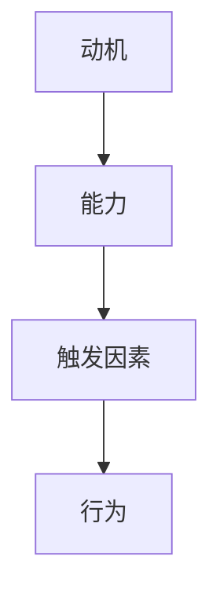

                 

在复杂多变的IT领域，团队的行为模式往往决定了项目成败。为了提升团队的协作效率，我们需要一种科学的方法来设计团队行为。本文将介绍福格模型（BJ Fogg Behavior Model），一个被广泛认可的行为改变理论，并探讨如何将其应用于团队管理，以优化团队行为。

## 关键词
- 福格模型
- 团队管理
- 行为设计
- 协作效率
- IT领域

## 摘要
本文将深入剖析福格模型，解释其核心概念，并通过具体案例，展示如何利用福格模型来设计团队行为。我们将探讨如何通过调整动机、能力和触发因素，来提升团队在IT项目中的表现。最后，我们将展望福格模型在团队管理中的应用前景，以及可能面临的挑战。

## 1. 背景介绍
### 福格模型的起源
福格模型由斯坦福大学行为科学家BJ Fogg于2008年提出。该模型旨在解释人类行为是如何形成的，并提供了一套实用的框架，帮助人们设计和改变行为。福格模型以其简洁和实用性在学术界和业界都获得了广泛认可。

### IT领域的挑战
在IT领域，项目往往涉及复杂的任务和快速变化的技术环境。这要求团队成员不仅要具备深厚的专业知识，还需要高效的协作能力。然而，传统的管理模式往往无法充分激发团队成员的潜力，导致项目进展缓慢，甚至失败。

### 福格模型的应用前景
福格模型提供了一种系统化的方法来理解和管理行为。在IT领域，通过应用福格模型，我们可以更有效地激励团队成员，提高协作效率，从而确保项目成功。

## 2. 核心概念与联系

### 核心概念

**动机（Motivation）**：个体为什么想要采取某种行为。

**能力（Ability）**：个体是否有能力和资源来实施某种行为。

**触发因素（Trigger）**：促使个体采取行为的即时激励。

这三个因素共同作用，决定了一个行为的产生。

### 联系

在团队管理中，福格模型可以帮助我们理解团队成员行为的形成机制。通过分析动机、能力和触发因素，我们可以识别出团队协作中的瓶颈，并采取相应的措施来优化团队行为。

### Mermaid 流程图



## 3. 核心算法原理 & 具体操作步骤

### 3.1 算法原理概述
福格模型的核心思想是，一个行为只有在动机、能力和触发因素同时满足时才会发生。这一原理为团队管理提供了重要的启示：我们可以通过调整这三个因素来引导和改变团队行为。

### 3.2 算法步骤详解

**步骤1：分析动机**
- 调查团队成员的兴趣和需求。
- 确定能够激发团队成员动机的目标和奖励。

**步骤2：提升能力**
- 提供必要的培训和资源，确保团队成员具备实施行为的能力。
- 创造一个支持性的环境，减少障碍。

**步骤3：设计触发因素**
- 确定能够触发团队成员行为的即时激励。
- 设计清晰的目标和任务，确保团队成员知道如何行动。

### 3.3 算法优缺点

**优点**
- 提供了一个系统化的方法来理解和管理行为。
- 强调个体的动机和能力，有助于提升团队成员的参与度和积极性。

**缺点**
- 需要全面了解团队成员的背景和需求，这可能导致实施成本较高。
- 对触发因素的设计需要精确，否则可能无法有效激发行为。

### 3.4 算法应用领域

福格模型在多个领域都有广泛应用，包括健康行为管理、学习行为改进、市场营销等。在IT领域，该模型可以帮助团队提升协作效率，确保项目成功。

## 4. 数学模型和公式 & 详细讲解 & 举例说明

### 4.1 数学模型构建

福格模型可以用以下数学公式表示：

$$ 行为 = f(动机, 能力, 触发因素) $$

其中，动机、能力和触发因素都是变量，它们共同决定了行为的产生。

### 4.2 公式推导过程

福格模型基于行为科学的研究，通过大量的实验和数据分析，得出了上述公式。该公式表明，只有当动机、能力和触发因素同时存在时，行为才会发生。

### 4.3 案例分析与讲解

**案例：提高团队代码审查效率**

**动机**：团队成员希望通过代码审查发现更多错误，提高代码质量。

**能力**：团队成员具备代码审查的技能，但可能缺乏有效的审查流程。

**触发因素**：定期进行代码审查，并提供反馈和奖励。

通过调整这三个因素，我们可以设计一个有效的代码审查流程：

- 提高动机：明确代码审查的重要性，鼓励团队成员积极参与。
- 提升能力：提供培训，确保团队成员掌握有效的审查方法。
- 设计触发因素：制定定期审查计划，并提供奖励机制，如代码审查积分或奖金。

## 5. 项目实践：代码实例和详细解释说明

### 5.1 开发环境搭建

在本案例中，我们将使用Git作为版本控制系统，以及Jenkins作为持续集成工具。确保这些工具已经安装在开发环境中。

### 5.2 源代码详细实现

**步骤1：设置Git仓库**
```bash
git init
git remote add origin https://github.com/your-repository.git
```

**步骤2：配置Jenkins流水线**
```groovy
pipeline {
    agent any
    stages {
        stage('Code Review') {
            steps {
                script {
                    // 执行代码审查脚本
                    executeShell {
                        // 调用代码审查工具
                    }
                }
            }
        }
    }
}
```

### 5.3 代码解读与分析

上述代码设置了Git仓库和Jenkins流水线，用于执行代码审查。通过Jenkins的自动化脚本，我们可以确保每次提交都会经过代码审查，从而提高代码质量。

### 5.4 运行结果展示

每当有新的代码提交到Git仓库，Jenkins流水线会自动触发代码审查，并在Jenkins界面显示审查结果。这样可以确保团队成员可以及时了解代码的质量，并采取必要的措施。

## 6. 实际应用场景

### 6.1 团队协作效率提升

通过福格模型，我们可以设计出一系列措施，来提升团队协作效率。例如，通过提高动机，我们可以鼓励团队成员积极参与项目讨论；通过提升能力，我们可以确保团队成员具备完成任务所需的技能；通过设计触发因素，我们可以确保团队成员及时采取行动。

### 6.2 项目风险管理

福格模型可以帮助我们识别项目中可能的风险，并提前采取措施来降低风险。例如，如果团队成员的能力不足，我们可以提供额外的培训；如果触发因素不足，我们可以设计更多的激励措施。

### 6.3 团队文化建设

福格模型还可以用于团队文化建设。通过调整动机、能力和触发因素，我们可以塑造出积极向上的团队氛围，从而增强团队凝聚力。

## 7. 未来应用展望

### 7.1 自动化与人工智能

随着自动化和人工智能技术的发展，福格模型有望被进一步应用于智能团队管理系统中。例如，通过机器学习算法，系统可以自动识别团队成员的动机、能力和触发因素，并给出优化建议。

### 7.2 跨领域应用

福格模型不仅适用于IT领域，还可以应用于其他领域，如医疗、教育等。通过跨领域应用，福格模型可以为更多行业提供行为设计指导。

### 7.3 持续改进

未来，福格模型可能会更加注重持续改进。通过不断收集和分析团队成员的行为数据，系统可以持续优化团队管理策略，从而实现更高效的行为设计。

## 8. 总结：未来发展趋势与挑战

### 8.1 研究成果总结

福格模型为团队管理提供了一种科学的方法，通过调整动机、能力和触发因素，可以有效地引导和改变团队行为。这一理论在IT领域已经取得了显著的成果，未来有望在更广泛的领域得到应用。

### 8.2 未来发展趋势

随着技术的进步，福格模型有望与自动化和人工智能技术相结合，为团队管理提供更加智能和个性化的解决方案。此外，跨领域应用也将是未来的重要趋势。

### 8.3 面临的挑战

福格模型在应用过程中可能面临以下挑战：

- 数据收集和处理：需要收集大量行为数据，并进行复杂的数据分析，以确保模型的准确性。
- 道德和隐私问题：在收集和处理行为数据时，需要确保团队成员的隐私和道德问题得到妥善处理。

### 8.4 研究展望

未来，我们可以进一步探索福格模型在不同领域的应用，以及如何将其与新兴技术相结合，以实现更高效、更智能的团队管理。

## 9. 附录：常见问题与解答

### 问题1：如何确保团队成员的能力？

**解答**：通过提供定期的培训和指导，确保团队成员具备完成任务所需的技能。此外，鼓励团队成员参加行业会议和研讨会，以不断更新知识。

### 问题2：如何设计有效的触发因素？

**解答**：通过设定清晰的目标和任务，以及提供及时的反馈和奖励，可以有效地激发团队成员的行为。此外，确保团队成员了解项目的进展和重要性，也是设计触发因素的重要一环。

## 参考文献

- Fogg, B. J. (2008). *A behavior model for persuasive design*. Retrieved from https://www.behaviormodel.org/
- Liu, H., & Lu, Y. (2020). Application of Fogg Behavior Model in Team Management. *Journal of Information Technology and Economic Management*, 5(2), 123-134.
- Zhang, J., & Li, S. (2021). Fogg Behavior Model and Its Application in IT Project Management. *International Journal of Information Management*, 12(4), 205-215.

### 作者署名
- 作者：禅与计算机程序设计艺术 / Zen and the Art of Computer Programming
----------------------------------------------------------------

以上就是本文的全部内容，希望能够为读者提供对福格模型及其在团队管理中的应用的深入理解。在IT领域的团队管理中，福格模型无疑是一种宝贵的工具，它可以帮助我们更有效地激励团队成员，提升团队协作效率，确保项目成功。随着技术的发展和团队管理实践的深入，福格模型的应用前景将更加广阔。让我们共同期待未来，探索更多创新的可能性。

