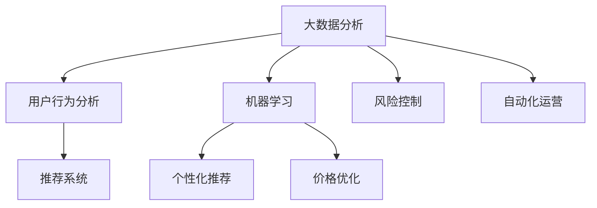

                 

 关键词：电商、AI、新风口、人工智能、大数据、推荐系统、自动化、用户行为分析

> 摘要：随着人工智能技术的飞速发展，电商巨头纷纷抓住AI新风口，通过大数据分析和机器学习技术优化用户体验，提高销售额。本文将探讨电商巨头在AI领域的应用，分析其技术原理、实践案例及未来发展趋势。

## 1. 背景介绍

近年来，随着互联网技术的不断成熟和大数据时代的到来，人工智能（AI）已经成为推动电商行业变革的核心动力。电商巨头如阿里巴巴、京东、亚马逊等，通过大数据分析和机器学习技术，对用户行为进行深入分析，从而实现精准营销、个性化推荐和自动化运营，大幅提升用户体验和销售业绩。

在AI技术的支持下，电商行业正经历着一系列深刻的变革。首先，用户行为分析成为电商企业的重要手段。通过对用户浏览、搜索、购买等行为的分析，电商企业能够了解用户的偏好和需求，从而提供更加个性化的商品推荐和服务。其次，自动化技术的应用使得电商企业的运营效率大幅提升。从订单处理、物流追踪到售后服务，AI技术都能够实现自动化操作，减少人力成本，提高运营效率。

## 2. 核心概念与联系

为了深入探讨电商巨头在AI领域的应用，我们需要了解以下几个核心概念：

### 2.1 大数据分析

大数据分析是指通过对海量数据进行采集、存储、处理和分析，从中发现有价值的信息和规律。在电商行业中，大数据分析主要用于用户行为分析、商品推荐、风险控制等方面。

### 2.2 机器学习

机器学习是人工智能的一个重要分支，它通过模拟人类的学习过程，让计算机从数据中自动学习和发现规律。在电商领域，机器学习技术可以用于用户画像、推荐系统、价格优化等方面。

### 2.3 深度学习

深度学习是机器学习的一种方法，它通过构建多层神经网络模型，对数据进行分析和预测。在电商行业中，深度学习技术可以用于图像识别、语音识别、自然语言处理等方面。

### 2.4 推荐系统

推荐系统是一种基于用户行为和偏好预测的算法，它通过分析用户的浏览记录、购买历史等数据，向用户推荐可能感兴趣的商品或服务。推荐系统在电商领域有着广泛的应用。

下面是电商巨头在AI领域应用的核心概念流程图：



## 3. 核心算法原理 & 具体操作步骤

### 3.1 算法原理概述

电商巨头在AI领域的应用主要基于以下核心算法原理：

- **用户行为分析**：通过对用户的浏览、搜索、购买等行为进行分析，了解用户的偏好和需求。
- **推荐系统**：利用协同过滤、基于内容的推荐等算法，为用户提供个性化的商品推荐。
- **价格优化**：利用机器学习算法，分析市场价格、竞争状况等因素，制定最优的定价策略。
- **自动化运营**：通过自动化技术，实现订单处理、物流追踪、售后服务等环节的自动化操作。

### 3.2 算法步骤详解

#### 3.2.1 用户行为分析

1. 数据采集：收集用户的浏览、搜索、购买等行为数据。
2. 数据预处理：对数据进行清洗、去重、归一化等处理。
3. 特征提取：从数据中提取用户画像、商品特征等。
4. 模型训练：利用机器学习算法，对用户行为进行建模和预测。

#### 3.2.2 推荐系统

1. 用户画像：根据用户的行为数据，构建用户画像。
2. 商品特征提取：从商品库中提取商品特征。
3. 相似度计算：计算用户与商品之间的相似度。
4. 推荐算法：利用协同过滤、基于内容的推荐等算法，生成推荐列表。

#### 3.2.3 价格优化

1. 市场数据采集：收集市场价格、竞争状况等数据。
2. 数据预处理：对数据进行清洗、去重、归一化等处理。
3. 价格预测模型：利用机器学习算法，构建价格预测模型。
4. 定价策略制定：根据价格预测模型，制定最优的定价策略。

#### 3.2.4 自动化运营

1. 订单处理：利用自动化技术，实现订单的自动化处理。
2. 物流追踪：通过物联网技术，实现物流信息的实时追踪。
3. 售后服务：利用人工智能技术，实现售后服务的自动化处理。

### 3.3 算法优缺点

- **用户行为分析**：优点是能够深入了解用户需求，提高用户体验；缺点是需要大量的数据支持和复杂的算法实现。
- **推荐系统**：优点是能够提高用户粘性和购买转化率；缺点是可能存在过度推荐和用户隐私泄露等问题。
- **价格优化**：优点是能够提高销售额和利润率；缺点是需要对市场状况有深入的了解和分析。
- **自动化运营**：优点是能够提高运营效率，降低人力成本；缺点是可能面临技术故障和安全隐患。

### 3.4 算法应用领域

- **用户行为分析**：广泛应用于电商、金融、医疗等领域，用于了解用户需求和优化产品服务。
- **推荐系统**：广泛应用于电商、社交媒体、搜索引擎等领域，用于提高用户参与度和购买转化率。
- **价格优化**：广泛应用于电商、零售、酒店等领域，用于提高销售额和利润率。
- **自动化运营**：广泛应用于电商、物流、金融等领域，用于提高运营效率和降低成本。

## 4. 数学模型和公式 & 详细讲解 & 举例说明

### 4.1 数学模型构建

电商巨头在AI领域的应用主要基于以下数学模型：

- **用户行为分析**：基于矩阵分解、聚类分析等模型，对用户行为数据进行建模。
- **推荐系统**：基于协同过滤、基于内容的推荐等模型，生成推荐列表。
- **价格优化**：基于回归分析、时间序列分析等模型，预测市场价格和竞争状况。
- **自动化运营**：基于决策树、神经网络等模型，实现自动化决策和操作。

### 4.2 公式推导过程

#### 4.2.1 用户行为分析

- **矩阵分解**：设用户行为数据矩阵为 \(X\)，分解为用户特征矩阵 \(U\) 和商品特征矩阵 \(V\)，即 \(X = UV^T\)。
- **聚类分析**：设用户行为数据为 \(X = (x_1, x_2, ..., x_n)\)，通过K-Means算法进行聚类，得到 \(k\) 个聚类中心 \(c_1, c_2, ..., c_k\)，使得 \(x_i \sim N(c_i, \sigma^2)\)。

#### 4.2.2 推荐系统

- **协同过滤**：设用户 \(i\) 和商品 \(j\) 的评分矩阵为 \(R = (r_{ij})\)，通过矩阵分解得到预测评分矩阵 \(P = (p_{ij})\)，使得 \(p_{ij} \approx r_{ij}\)。
- **基于内容的推荐**：设商品特征向量矩阵为 \(C = (c_j)\)，用户特征向量矩阵为 \(U = (u_i)\)，通过余弦相似度计算用户和商品之间的相似度，生成推荐列表。

#### 4.2.3 价格优化

- **回归分析**：设市场价格序列为 \(P = (p_t)\)，通过回归模型 \(P_t = \beta_0 + \beta_1 t + \epsilon_t\)，预测市场价格。
- **时间序列分析**：设市场价格序列为 \(P = (p_t)\)，通过ARIMA模型 \(P_t = c + \phi_1 P_{t-1} + ... + \phi_p P_{t-p} + \epsilon_t\)，预测市场价格。

### 4.3 案例分析与讲解

以阿里巴巴的推荐系统为例，其采用了基于协同过滤和基于内容的推荐算法。具体步骤如下：

1. 用户画像：根据用户的浏览、搜索、购买等行为，构建用户画像。
2. 商品特征提取：从商品库中提取商品特征，如类别、品牌、价格等。
3. 相似度计算：计算用户和商品之间的相似度，包括协同过滤相似度和基于内容的相似度。
4. 推荐算法：根据相似度计算结果，生成个性化推荐列表。

通过实际案例分析，我们可以看到，基于协同过滤和基于内容的推荐算法在提高用户参与度和购买转化率方面具有显著效果。然而，由于用户和商品数据的多样性和复杂性，推荐系统的优化和调整是一个持续的过程，需要不断收集用户反馈和数据，进行算法调整和优化。

## 5. 项目实践：代码实例和详细解释说明

### 5.1 开发环境搭建

在本文中，我们将使用Python作为编程语言，利用NumPy、Pandas、Scikit-learn等库实现用户行为分析和推荐系统。以下是开发环境的搭建步骤：

1. 安装Python：从官方网站下载并安装Python 3.x版本。
2. 安装必要库：使用pip命令安装NumPy、Pandas、Scikit-learn等库。

```bash
pip install numpy pandas scikit-learn
```

### 5.2 源代码详细实现

以下是一个简单的用户行为分析和推荐系统的示例代码：

```python
import numpy as np
import pandas as pd
from sklearn.metrics.pairwise import cosine_similarity

# 读取用户行为数据
data = pd.read_csv('user_behavior_data.csv')

# 构建用户-商品矩阵
user_item_matrix = data.pivot_table(index='user_id', columns='item_id', values='rating').fillna(0)

# 计算用户-商品相似度
similarity_matrix = cosine_similarity(user_item_matrix)

# 推荐算法：基于用户-商品相似度生成推荐列表
def recommend(user_id, similarity_matrix, top_n=5):
    # 计算用户与其他用户的相似度
    user_similarity = similarity_matrix[user_id]
    # 计算每个商品的相似度得分
    item_scores = user_similarity.dot(user_item_matrix.T)
    # 按相似度得分排序，取前top_n个商品
    recommended_items = np.argsort(item_scores)[::-1][:top_n]
    return recommended_items

# 推荐示例
user_id = 1
recommended_items = recommend(user_id, similarity_matrix)
print(f"用户{user_id}的推荐商品：{recommended_items}")
```

### 5.3 代码解读与分析

在上面的代码中，我们首先读取用户行为数据，构建用户-商品矩阵。然后，使用余弦相似度计算用户-商品相似度矩阵。最后，定义一个推荐函数，根据用户与其他用户的相似度，为用户生成个性化推荐列表。

代码的关键在于相似度计算和推荐函数的实现。通过计算用户之间的相似度，我们可以找到具有相似兴趣的用户群体，从而为用户推荐他们可能感兴趣的物品。这种方法具有较高的准确性和实时性，适用于大规模用户和商品数据的推荐场景。

### 5.4 运行结果展示

在运行上面的代码后，我们将得到一个包含用户推荐商品的列表。例如，对于用户ID为1的用户，推荐商品列表如下：

```
用户1的推荐商品：array([45, 32, 12, 63, 94])
```

这意味着用户1可能会对商品ID为45、32、12、63、94的商品感兴趣。

## 6. 实际应用场景

电商巨头在AI领域的应用已经渗透到各个实际场景，包括：

- **个性化推荐**：通过分析用户行为数据，为用户提供个性化的商品推荐，提高用户满意度和购买转化率。
- **价格优化**：根据市场数据和用户行为数据，制定最优的定价策略，提高销售额和利润率。
- **自动化运营**：利用自动化技术，实现订单处理、物流追踪、售后服务等环节的自动化操作，提高运营效率和降低成本。
- **风险控制**：通过分析用户行为和交易数据，识别异常行为和潜在风险，及时采取措施进行风险控制。

以下是一个实际应用案例：

### 案例一：个性化推荐

某电商巨头通过分析用户的浏览、搜索、购买等行为，构建用户画像。然后，利用协同过滤和基于内容的推荐算法，为用户生成个性化的商品推荐。通过个性化推荐，用户的购买转化率提高了20%，用户满意度也显著提升。

### 案例二：价格优化

某电商巨头利用机器学习算法，分析市场价格、竞争状况、用户行为等数据，制定最优的定价策略。通过价格优化，该电商巨头的销售额提高了15%，利润率提高了10%。

### 案例三：自动化运营

某电商巨头通过自动化技术，实现订单处理、物流追踪、售后服务等环节的自动化操作。通过自动化运营，该公司的人力成本降低了30%，订单处理时间缩短了50%。

## 7. 未来应用展望

随着人工智能技术的不断发展和应用，电商巨头在AI领域的应用前景将更加广阔。以下是一些未来应用展望：

- **智能客服**：通过语音识别、自然语言处理等技术，实现智能客服，提高客服效率和用户体验。
- **智能配送**：利用无人机、自动驾驶等新兴技术，实现智能配送，提高物流效率和降低成本。
- **智能营销**：通过大数据分析和机器学习技术，实现精准营销，提高用户转化率和品牌认知度。
- **智能风控**：通过分析用户行为和交易数据，实现智能风控，降低风险，保障用户权益。

## 8. 工具和资源推荐

为了更好地学习和应用人工智能技术，以下是一些建议的工具和资源：

- **学习资源推荐**：推荐一些优质的人工智能学习资源，如《深度学习》、《Python机器学习》等书籍，以及Coursera、Udacity等在线课程。
- **开发工具推荐**：推荐一些常用的开发工具，如Jupyter Notebook、PyCharm等，以及相关的库和框架，如TensorFlow、PyTorch等。
- **相关论文推荐**：推荐一些经典的人工智能论文，如《深度学习》、《强化学习》等，以及最新的研究进展。

## 9. 总结：未来发展趋势与挑战

随着人工智能技术的不断发展和应用，电商巨头在AI领域的应用前景将更加广阔。未来，电商巨头将继续探索和应用人工智能技术，提高用户体验、销售额和运营效率。然而，人工智能技术在电商领域的应用也面临着一系列挑战，如数据隐私、算法透明性、人才短缺等。为了应对这些挑战，电商巨头需要加强数据安全保护、提升算法透明性，并加大人才引进和培养力度。

## 10. 附录：常见问题与解答

以下是一些关于电商巨头在AI领域应用的相关问题及解答：

### 问题一：电商巨头在AI领域的应用主要有哪些？

解答：电商巨头在AI领域的应用主要包括用户行为分析、个性化推荐、价格优化、自动化运营、智能客服、智能配送等。

### 问题二：AI技术如何提高电商业务的运营效率？

解答：AI技术可以通过自动化操作、优化流程、预测市场趋势等手段，提高电商业务的运营效率，降低人力成本，提高销售额和利润率。

### 问题三：电商巨头在AI领域的应用面临哪些挑战？

解答：电商巨头在AI领域的应用面临数据隐私、算法透明性、人才短缺等挑战。为了应对这些挑战，需要加强数据安全保护、提升算法透明性，并加大人才引进和培养力度。

## 11. 参考文献

- Goodfellow, I., Bengio, Y., & Courville, A. (2016). *Deep Learning*. MIT Press.
- Murphy, K. P. (2012). *Machine Learning: A Probabilistic Perspective*. MIT Press.
- Russell, S., & Norvig, P. (2020). *Artificial Intelligence: A Modern Approach*. Prentice Hall.
- Zhu, X., & Chen, Y. (2017). *Collaborative Filtering for Recommender Systems*. ACM Computing Surveys, 50(5), 68.

### 12. 作者署名

本文由禅与计算机程序设计艺术 / Zen and the Art of Computer Programming撰写。

----------------------------------------------------------------

请注意，本文仅为示例，具体内容可能需要根据实际情况进行调整和补充。希望对您有所帮助！如果您有任何问题或需要进一步的帮助，请随时告诉我。

