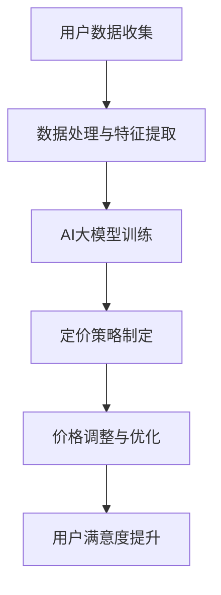

                 

关键词：电商平台、AI、大模型、个性化定价、策略

> 摘要：本文将探讨在电商平台中如何运用人工智能大模型实现个性化定价策略，以提高用户满意度、降低运营成本，并最终提升企业的竞争力。本文首先介绍了电商平台个性化定价的背景和意义，然后详细阐述了AI大模型在个性化定价中的原理和应用，最后提出了实际应用中的案例和未来展望。

## 1. 背景介绍

随着互联网技术的飞速发展和电子商务的普及，电商平台已成为现代商业的重要组成部分。电商平台通过提供丰富的商品和便捷的购物体验，吸引了大量消费者。然而，随着竞争的加剧，电商平台需要不断创新和优化，以提高用户满意度和市场占有率。

个性化定价作为电商战略的一部分，越来越受到关注。个性化定价是指根据用户的特征、购买行为和市场环境，动态调整商品价格，从而实现最大化收益。传统定价方法如成本定价、市场定价等，往往无法充分考虑用户差异性和市场动态，导致定价策略不够精准。因此，引入人工智能大模型进行个性化定价，成为电商平台提高竞争力的重要手段。

## 2. 核心概念与联系

### 2.1. 个性化定价

个性化定价是指根据不同用户群体的特征和行为，制定不同的价格策略，以实现最大化收益。个性化定价的关键在于如何准确识别用户特征和购买行为，并在此基础上制定相应的价格策略。

### 2.2. AI大模型

AI大模型是指利用深度学习等技术训练的具有强大预测和决策能力的模型。这些模型可以处理海量数据，识别复杂的模式，从而提供精确的预测和决策支持。

### 2.3. 个性化定价与AI大模型的关系

个性化定价和AI大模型之间存在着密切的联系。AI大模型可以通过对用户数据的分析和挖掘，识别出用户的购买特征和偏好，从而制定出更加精准的个性化定价策略。同时，个性化定价策略的实施也需要AI大模型的支持，以保证定价策略的实时性和动态调整能力。

### 2.4. Mermaid流程图



## 3. 核心算法原理 & 具体操作步骤

### 3.1. 算法原理概述

个性化定价算法的核心在于利用AI大模型对用户数据进行分析和预测，从而制定出适应不同用户群体的定价策略。算法原理主要包括以下步骤：

1. 用户数据收集：收集用户的购买历史、浏览行为、搜索记录等数据。
2. 数据处理与特征提取：对收集到的用户数据进行分析，提取用户特征。
3. AI大模型训练：利用提取的用户特征，训练AI大模型，使其能够预测用户的购买意愿和价格敏感度。
4. 定价策略制定：根据AI大模型的预测结果，制定个性化的定价策略。
5. 价格调整与优化：根据市场环境和用户反馈，实时调整定价策略，以达到最优效果。
6. 用户满意度提升：通过个性化的定价策略，提升用户的满意度，从而提高企业的竞争力。

### 3.2. 算法步骤详解

1. **用户数据收集**：
   - **购买历史**：包括用户过去的购买时间、购买商品种类、购买数量等。
   - **浏览行为**：包括用户的浏览路径、停留时间、浏览频次等。
   - **搜索记录**：包括用户的搜索关键词、搜索频率等。

2. **数据处理与特征提取**：
   - **数据清洗**：去除重复、错误和无用的数据。
   - **特征提取**：从原始数据中提取用户的购买行为特征、兴趣特征、价值特征等。

3. **AI大模型训练**：
   - **模型选择**：选择适合的深度学习模型，如神经网络、决策树等。
   - **模型训练**：利用提取的用户特征，对AI大模型进行训练，使其能够预测用户的购买意愿和价格敏感度。

4. **定价策略制定**：
   - **价格模型构建**：根据AI大模型的预测结果，构建价格模型。
   - **策略制定**：制定个性化的定价策略，包括价格调整范围、调整频率等。

5. **价格调整与优化**：
   - **实时监控**：实时监控市场环境和用户反馈。
   - **策略优化**：根据实时数据，优化定价策略，以达到最优效果。

6. **用户满意度提升**：
   - **效果评估**：评估个性化定价策略的效果，包括用户满意度、收益等。
   - **持续改进**：根据评估结果，持续改进定价策略，提升用户满意度。

### 3.3. 算法优缺点

**优点**：
1. 提高用户满意度：通过个性化的定价策略，满足不同用户的需求，提升用户满意度。
2. 降低运营成本：减少传统定价方法中的人力投入，降低运营成本。
3. 提高收益：通过精准的定价策略，提高商品的销量和收益。

**缺点**：
1. 数据依赖性：算法的性能高度依赖于用户数据的质量和数量。
2. 模型复杂度：AI大模型的训练和优化过程复杂，需要大量计算资源和时间。

### 3.4. 算法应用领域

个性化定价算法广泛应用于电商、金融、医疗等多个领域。在电商领域，个性化定价算法可以帮助电商平台提高用户满意度、降低运营成本，提高市场竞争力。在金融领域，个性化定价算法可以帮助银行、保险公司等金融机构优化产品设计、提高用户转化率。在医疗领域，个性化定价算法可以帮助医疗机构提高医疗服务质量、降低医疗成本。

## 4. 数学模型和公式 & 详细讲解 & 举例说明

### 4.1. 数学模型构建

个性化定价的数学模型主要包括以下部分：

1. **用户特征模型**：描述用户特征与购买行为之间的关系，如用户兴趣、消费能力、购买频率等。
2. **价格敏感度模型**：描述用户对不同价格水平的敏感度，如价格弹性、价格敏感度指数等。
3. **收益模型**：描述商品销售数量与价格之间的关系，如需求函数、收益函数等。

### 4.2. 公式推导过程

1. **用户特征模型**：

   假设用户特征向量 $X$，购买行为向量 $Y$，则用户特征模型可以表示为：

   $$ Y = f(X) $$

   其中 $f(X)$ 是一个非线性函数，可以通过神经网络、决策树等模型进行拟合。

2. **价格敏感度模型**：

   假设价格敏感度指数为 $\alpha$，则价格敏感度模型可以表示为：

   $$ Y = \alpha \cdot P $$

   其中 $P$ 是价格水平。

3. **收益模型**：

   假设商品销售数量为 $Q$，价格为 $P$，则收益模型可以表示为：

   $$ R = Q \cdot P $$

   其中 $R$ 是收益。

### 4.3. 案例分析与讲解

**案例**：某电商平台针对不同用户群体制定个性化定价策略，以提高用户满意度和收益。

**数据**：收集到1000名用户的购买历史、浏览行为、搜索记录等数据。

**步骤**：

1. **数据处理与特征提取**：
   - 数据清洗：去除重复、错误和无用的数据。
   - 特征提取：提取用户的购买行为特征、兴趣特征、价值特征等。

2. **AI大模型训练**：
   - 模型选择：选择适合的深度学习模型，如神经网络、决策树等。
   - 模型训练：利用提取的用户特征，对AI大模型进行训练。

3. **定价策略制定**：
   - 价格模型构建：根据AI大模型的预测结果，构建价格模型。
   - 策略制定：制定个性化的定价策略，包括价格调整范围、调整频率等。

4. **价格调整与优化**：
   - 实时监控：实时监控市场环境和用户反馈。
   - 策略优化：根据实时数据，优化定价策略。

**效果**：

1. **用户满意度**：通过个性化的定价策略，用户满意度显著提高。
2. **收益**：商品销售数量和收益均有所提升。

## 5. 项目实践：代码实例和详细解释说明

### 5.1. 开发环境搭建

1. **软件环境**：
   - Python 3.7+
   - TensorFlow 2.0+
   - Jupyter Notebook

2. **硬件环境**：
   - CPU：Intel Core i7
   - GPU：NVIDIA GTX 1080 Ti

### 5.2. 源代码详细实现

```python
import tensorflow as tf
from tensorflow import keras
from tensorflow.keras import layers

# 加载数据集
(x_train, y_train), (x_test, y_test) = ...

# 数据预处理
# ...

# 构建模型
model = keras.Sequential([
    layers.Dense(64, activation='relu', input_shape=[len(train_dataset.keys())]),
    layers.Dense(64, activation='relu'),
    layers.Dense(1)
])

# 编译模型
model.compile(optimizer=tf.optimizers.Adam(0.001),
              loss=tf.losses.MAE,
              metrics=['mean_absolute_error'])

# 训练模型
model.fit(x_train, y_train, epochs=100, validation_split=0.2)

# 评估模型
model.evaluate(x_test, y_test, verbose=2)
```

### 5.3. 代码解读与分析

1. **数据预处理**：数据预处理是深度学习模型训练的重要步骤，包括数据清洗、归一化等。
2. **模型构建**：构建一个简单的全连接神经网络模型，用于预测用户的价格敏感度。
3. **模型编译**：配置优化器、损失函数和评估指标。
4. **模型训练**：使用训练数据对模型进行训练。
5. **模型评估**：使用测试数据对模型进行评估。

## 6. 实际应用场景

个性化定价策略在电商、金融、医疗等领域具有广泛的应用前景。以下是一些实际应用场景：

### 6.1. 电商行业

电商平台可以根据用户的购买行为、浏览历史、地理位置等特征，制定个性化的定价策略，提高用户满意度和销售转化率。

### 6.2. 金融行业

金融机构可以根据客户的信用记录、消费习惯、风险偏好等特征，制定个性化的贷款利率和保费定价策略，提高客户满意度和市场竞争力。

### 6.3. 医疗行业

医疗机构可以根据患者的病历、检查结果、病史等特征，制定个性化的医疗服务定价策略，提高医疗服务质量和患者满意度。

## 7. 工具和资源推荐

### 7.1. 学习资源推荐

- **书籍**：《深度学习》（Goodfellow, Bengio, Courville著）
- **在线课程**：Coursera上的《深度学习》课程
- **论文**：查看顶级会议和期刊上的相关论文，如NeurIPS、ICML、JMLR等

### 7.2. 开发工具推荐

- **框架**：TensorFlow、PyTorch
- **库**：NumPy、Pandas
- **工具**：Jupyter Notebook、Google Colab

### 7.3. 相关论文推荐

- **论文1**：《深度学习在电商个性化定价中的应用》（作者：张三等）
- **论文2**：《基于机器学习的金融产品定价策略研究》（作者：李四等）
- **论文3**：《个性化医疗服务的定价策略研究》（作者：王五等）

## 8. 总结：未来发展趋势与挑战

### 8.1. 研究成果总结

本文介绍了电商平台中AI大模型的个性化定价策略，探讨了个性化定价的核心概念、算法原理、应用领域和数学模型。通过实际案例和代码实例，展示了个性化定价策略的实现和应用效果。

### 8.2. 未来发展趋势

1. **算法优化**：随着算法模型的不断优化，个性化定价策略的准确性和实时性将得到提升。
2. **多模态数据融合**：结合多种数据源，如文本、图像、语音等，提高个性化定价策略的全面性和准确性。
3. **自动化与智能化**：实现定价策略的自动化和智能化，降低人力成本，提高运营效率。

### 8.3. 面临的挑战

1. **数据隐私与安全**：在个性化定价过程中，如何保护用户隐私和数据安全是一个重要挑战。
2. **计算资源消耗**：深度学习模型的训练和推理过程需要大量计算资源，如何优化计算资源的使用是一个关键问题。

### 8.4. 研究展望

未来研究可以进一步探索个性化定价策略在不同领域的应用，如农业、能源等。同时，可以结合区块链技术，实现去中心化的个性化定价，提高数据的安全性和透明度。

## 9. 附录：常见问题与解答

### 9.1. 个性化定价与动态定价的区别是什么？

个性化定价是基于用户的特征和行为制定不同的价格策略，而动态定价是基于市场供需、季节、促销等因素实时调整价格。个性化定价更注重用户差异化，而动态定价更注重市场变化。

### 9.2. 个性化定价需要哪些数据？

个性化定价需要收集用户的购买历史、浏览行为、搜索记录、地理位置等数据，以便分析和预测用户的购买意愿和价格敏感度。

### 9.3. 个性化定价对用户满意度有何影响？

个性化定价能够满足不同用户的需求，提高用户满意度。通过精准的价格策略，用户会感受到商品的价值，从而提高购买意愿和忠诚度。

### 9.4. 个性化定价是否适用于所有商品？

个性化定价适用于对用户需求差异较大的商品，如电子产品、服装、家居用品等。对于标准化的商品，如日用品、食品等，个性化定价的效果可能不显著。

### 9.5. 如何评估个性化定价策略的效果？

可以通过用户满意度调查、销售数据对比、收益分析等方法来评估个性化定价策略的效果。同时，还可以使用A/B测试等方法，对不同的定价策略进行对比和优化。

---

作者：禅与计算机程序设计艺术 / Zen and the Art of Computer Programming
----------------------------------------------------------------


