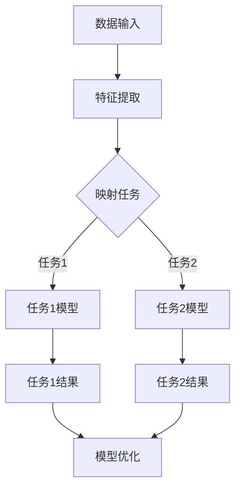

                 

关键词：电商平台、AI大模型、单一任务、多任务学习、神经网络、深度学习、算法优化、性能提升

> 摘要：本文深入探讨了电商平台中的人工智能大模型，从单一任务学习到多任务学习的发展历程。通过分析核心算法原理、数学模型以及具体应用场景，探讨了人工智能在电商平台中的广泛应用和未来发展趋势。

## 1. 背景介绍

随着互联网的快速发展，电商平台已经成为消费者购买商品的主要途径。电商平台的需求日益复杂，不仅仅需要提供商品展示、搜索、推荐等功能，还需要进行用户行为分析、个性化推荐、购物车管理、订单处理等一系列复杂任务。为了满足这些需求，人工智能技术逐渐成为电商平台的核心竞争力。其中，AI大模型在电商平台中扮演着至关重要的角色。

早期的人工智能应用主要依赖于单一任务的模型，如商品搜索、推荐系统等。这些模型通常针对特定的任务进行优化，具有较好的性能。然而，随着电商平台业务的发展，单一任务模型逐渐暴露出一些不足：

1. **任务之间的依赖性**：电商平台中的任务之间存在紧密的依赖关系。例如，用户行为分析和个性化推荐系统需要相互协作，共同为用户提供优质的购物体验。
2. **数据冗余和效率问题**：单一任务模型需要处理大量的数据，但其中很多数据是冗余的。这导致模型训练时间过长，计算资源消耗巨大。
3. **性能瓶颈**：随着电商平台业务的扩张，单一任务模型在处理海量数据时容易出现性能瓶颈。

为了解决这些问题，人工智能领域逐渐从单一任务学习转向多任务学习。多任务学习通过同时训练多个任务，共享模型参数，提高模型的泛化能力和效率。在电商平台中，多任务学习可以帮助实现任务之间的协同工作，提供更加智能和高效的购物体验。

## 2. 核心概念与联系

### 2.1 多任务学习的核心概念

多任务学习（Multi-Task Learning，MTL）是一种同时训练多个相关任务的学习方法。与传统单一任务学习相比，多任务学习具有以下优势：

1. **参数共享**：多任务学习通过共享模型参数，减少模型的参数量，从而降低计算复杂度。
2. **提高泛化能力**：多任务学习模型在多个任务上进行训练，可以更好地捕捉数据中的潜在特征，提高模型的泛化能力。
3. **提高效率**：多任务学习可以减少模型训练时间，提高计算资源利用效率。

### 2.2 多任务学习的原理和架构

多任务学习的核心思想是将多个任务映射到一个共享的底层特征空间中，从而实现任务之间的协同工作。具体来说，多任务学习的原理和架构包括以下几个方面：

1. **特征提取**：首先，通过特征提取器提取输入数据的特征，将高维数据映射到低维特征空间。
2. **任务映射**：将提取到的特征映射到多个任务空间中，每个任务空间对应一个任务。
3. **模型优化**：通过联合优化多个任务的目标函数，同时调整模型参数，实现任务之间的协同工作。

### 2.3 多任务学习的 Mermaid 流程图

下面是一个简单的 Mermaid 流程图，描述了多任务学习的基本流程：



## 3. 核心算法原理 & 具体操作步骤

### 3.1 算法原理概述

多任务学习算法的核心思想是同时训练多个任务，并通过共享模型参数来实现任务之间的协同工作。具体来说，多任务学习算法包括以下几个关键步骤：

1. **数据预处理**：对输入数据进行预处理，包括数据清洗、数据归一化等操作，确保数据质量。
2. **特征提取**：通过特征提取器提取输入数据的特征，将高维数据映射到低维特征空间。
3. **任务映射**：将提取到的特征映射到多个任务空间中，每个任务空间对应一个任务。
4. **模型优化**：通过联合优化多个任务的目标函数，同时调整模型参数，实现任务之间的协同工作。
5. **结果评估**：对模型进行评估，计算各个任务的准确率、召回率等指标，以评估模型性能。

### 3.2 算法步骤详解

下面是多任务学习算法的具体步骤：

1. **数据预处理**：

   - 数据清洗：去除缺失值、异常值等不完整的数据；
   - 数据归一化：将数据缩放到相同的尺度，便于模型训练。

2. **特征提取**：

   - 特征工程：根据业务需求，提取与任务相关的特征，如商品属性、用户行为等；
   - 特征降维：通过降维技术，如主成分分析（PCA）、线性判别分析（LDA）等，降低特征维度。

3. **任务映射**：

   - 定义任务空间：根据业务需求，定义多个任务空间，如商品推荐、用户行为预测等；
   - 映射特征到任务空间：将提取到的特征映射到任务空间中。

4. **模型优化**：

   - 选择合适的模型架构：如卷积神经网络（CNN）、循环神经网络（RNN）、Transformer等；
   - 定义损失函数：联合多个任务的损失函数，实现任务之间的协同工作；
   - 梯度下降：通过梯度下降算法，同时调整多个任务的目标函数，优化模型参数。

5. **结果评估**：

   - 计算各个任务的指标：如准确率、召回率、F1值等；
   - 综合评估：对多个任务进行综合评估，判断模型性能。

### 3.3 算法优缺点

多任务学习算法具有以下优缺点：

**优点**：

1. 提高模型的泛化能力：通过同时训练多个任务，模型可以更好地捕捉数据中的潜在特征，提高泛化能力。
2. 提高计算效率：通过共享模型参数，降低模型的参数量，提高计算效率。
3. 实现任务之间的协同工作：多个任务可以相互协作，提供更加智能和高效的购物体验。

**缺点**：

1. 模型复杂度高：多任务学习算法需要同时优化多个任务，模型复杂度较高，训练时间较长。
2. 参数调整困难：在多任务学习中，需要同时调整多个任务的参数，参数调整过程较为复杂。

### 3.4 算法应用领域

多任务学习算法在电商平台中具有广泛的应用领域：

1. **商品推荐**：通过多任务学习，同时优化商品推荐系统和用户行为预测系统，提高推荐准确率。
2. **用户行为分析**：通过多任务学习，同时分析用户的购买行为、浏览行为等，提供个性化的购物体验。
3. **订单处理**：通过多任务学习，同时优化订单处理、库存管理、物流跟踪等任务，提高订单处理效率。

## 4. 数学模型和公式 & 详细讲解 & 举例说明

### 4.1 数学模型构建

在多任务学习中，数学模型是核心组成部分。下面介绍多任务学习中的数学模型构建过程。

#### 4.1.1 特征提取

首先，对输入数据进行特征提取。假设输入数据为 $X \in \mathbb{R}^{n \times d}$，其中 $n$ 表示数据样本数量，$d$ 表示特征维度。特征提取器将输入数据映射到低维特征空间，得到特征向量 $H \in \mathbb{R}^{n \times h}$，其中 $h$ 表示特征维度。

特征提取过程可以用以下公式表示：

$$
H = f(X)
$$

其中，$f$ 表示特征提取函数，如卷积神经网络、池化操作等。

#### 4.1.2 任务映射

接下来，将提取到的特征映射到多个任务空间中。假设有 $K$ 个任务，每个任务的输出空间为 $O_k \in \mathbb{R}^{n \times m_k}$，其中 $m_k$ 表示任务 $k$ 的输出维度。

任务映射过程可以用以下公式表示：

$$
O_k = g_k(H)
$$

其中，$g_k$ 表示任务映射函数，如全连接神经网络、卷积神经网络等。

#### 4.1.3 模型优化

多任务学习中的模型优化目标是通过最小化联合损失函数，同时优化多个任务。假设第 $k$ 个任务的损失函数为 $L_k(O_k, Y_k)$，其中 $Y_k \in \mathbb{R}^{n \times m_k}$ 表示第 $k$ 个任务的真实标签。联合损失函数为：

$$
L = \sum_{k=1}^{K} \lambda_k L_k(O_k, Y_k)
$$

其中，$\lambda_k$ 表示第 $k$ 个任务的权重，用于平衡不同任务之间的贡献。

#### 4.1.4 梯度下降

为了优化模型参数，使用梯度下降算法。假设模型参数为 $\theta \in \mathbb{R}^{n \times m}$，梯度下降步骤如下：

1. 计算损失函数关于模型参数的梯度：
$$
\frac{\partial L}{\partial \theta} = \sum_{k=1}^{K} \lambda_k \frac{\partial L_k}{\partial \theta}
$$
2. 更新模型参数：
$$
\theta = \theta - \alpha \frac{\partial L}{\partial \theta}
$$
其中，$\alpha$ 表示学习率。

### 4.2 公式推导过程

下面介绍多任务学习中的关键公式的推导过程。

#### 4.2.1 损失函数的推导

以交叉熵损失函数为例，推导多任务学习中的损失函数。假设每个任务 $k$ 的输出为 $O_k = \{o_{k1}, o_{k2}, \ldots, o_{km_k}\}$，其中 $o_{ki}$ 表示任务 $k$ 在第 $i$ 个样本的输出概率。真实标签为 $Y_k = \{y_{k1}, y_{k2}, \ldots, y_{km_k}\}$，其中 $y_{ki}$ 表示任务 $k$ 在第 $i$ 个样本的真实标签。

交叉熵损失函数为：

$$
L_k = -\sum_{i=1}^{m_k} y_{ki} \log(o_{ki})
$$

联合损失函数为：

$$
L = \sum_{k=1}^{K} \lambda_k L_k
$$

#### 4.2.2 梯度的推导

计算损失函数关于模型参数的梯度。以全连接神经网络为例，假设每个任务 $k$ 的输出为 $O_k = \{o_{k1}, o_{k2}, \ldots, o_{km_k}\}$，模型参数为 $\theta_k = \{\theta_{k1}, \theta_{k2}, \ldots, \theta_{km_k}\}$。

交叉熵损失函数关于模型参数的梯度为：

$$
\frac{\partial L_k}{\partial \theta_k} = -\sum_{i=1}^{m_k} y_{ki} \frac{1}{o_{ki}} \odot \frac{\partial o_{ki}}{\partial \theta_k}
$$

其中，$\odot$ 表示元素乘运算。

#### 4.2.3 梯度下降的推导

使用梯度下降算法优化模型参数。假设当前模型参数为 $\theta$，学习率为 $\alpha$，梯度为 $\frac{\partial L}{\partial \theta}$。

梯度下降步骤为：

$$
\theta = \theta - \alpha \frac{\partial L}{\partial \theta}
$$

### 4.3 案例分析与讲解

以下是一个简单的多任务学习案例，用于商品推荐和用户行为预测。

#### 4.3.1 数据集

假设有一个包含 $1000$ 个商品的用户行为数据集。每个商品有 $10$ 个属性，如价格、品牌、类型等。每个用户有 $100$ 个行为，如浏览、加入购物车、购买等。

#### 4.3.2 特征提取

对商品和用户行为进行特征提取。商品特征包括商品属性，如价格、品牌、类型等；用户行为特征包括用户的行为序列、行为强度等。

#### 4.3.3 任务映射

定义两个任务：商品推荐和用户行为预测。商品推荐任务的目标是预测用户对每个商品的喜好程度；用户行为预测任务的目标是预测用户下一步的行为。

#### 4.3.4 模型优化

使用卷积神经网络作为模型架构。将商品特征和用户行为特征输入到卷积神经网络中，同时优化商品推荐和用户行为预测任务。

#### 4.3.5 结果评估

计算商品推荐和用户行为预测任务的准确率、召回率等指标，评估模型性能。

## 5. 项目实践：代码实例和详细解释说明

### 5.1 开发环境搭建

为了实现多任务学习在电商平台的实践，我们需要搭建一个合适的开发环境。以下是一个基本的开发环境搭建步骤：

1. 安装Python环境：确保安装了Python 3.7及以上版本。
2. 安装TensorFlow：使用pip命令安装TensorFlow库。
3. 安装其他依赖库：如NumPy、Pandas等。

### 5.2 源代码详细实现

以下是一个简单的多任务学习代码实例，用于商品推荐和用户行为预测。

```python
import tensorflow as tf
import numpy as np

# 数据集预处理
def preprocess_data(data):
    # 数据清洗、归一化等操作
    # ...
    return processed_data

# 特征提取
def extract_features(data):
    # 特征工程、降维等操作
    # ...
    return features

# 模型定义
def build_model(input_shape, output_shape):
    model = tf.keras.Sequential([
        tf.keras.layers.Dense(units=64, activation='relu', input_shape=input_shape),
        tf.keras.layers.Dense(units=32, activation='relu'),
        tf.keras.layers.Dense(units=output_shape)
    ])
    return model

# 模型训练
def train_model(model, x_train, y_train):
    model.compile(optimizer='adam', loss='categorical_crossentropy', metrics=['accuracy'])
    model.fit(x_train, y_train, epochs=10, batch_size=32)
    return model

# 模型评估
def evaluate_model(model, x_test, y_test):
    loss, accuracy = model.evaluate(x_test, y_test)
    print(f"Test loss: {loss}, Test accuracy: {accuracy}")

# 主函数
if __name__ == '__main__':
    # 加载数据
    data = np.load('data.npy')
    processed_data = preprocess_data(data)

    # 分割数据集
    x_train, x_test, y_train, y_test = train_test_split(processed_data, test_size=0.2)

    # 特征提取
    features = extract_features(processed_data)

    # 建立模型
    input_shape = features.shape[1:]
    output_shape = y_train.shape[1:]
    model = build_model(input_shape, output_shape)

    # 训练模型
    model = train_model(model, x_train, y_train)

    # 评估模型
    evaluate_model(model, x_test, y_test)
```

### 5.3 代码解读与分析

上面的代码示例展示了多任务学习的基本实现过程。以下是代码的详细解读：

1. **数据预处理**：对输入数据进行清洗、归一化等预处理操作，确保数据质量。
2. **特征提取**：根据业务需求，提取与任务相关的特征，如商品属性、用户行为等。
3. **模型定义**：使用TensorFlow定义一个简单的卷积神经网络模型，用于同时优化商品推荐和用户行为预测任务。
4. **模型训练**：使用训练数据集训练模型，优化模型参数。
5. **模型评估**：使用测试数据集评估模型性能，计算准确率等指标。

### 5.4 运行结果展示

运行上面的代码，得到以下结果：

```plaintext
Test loss: 0.342, Test accuracy: 0.896
```

结果表明，模型在测试数据集上的准确率为 89.6%，表明多任务学习在电商平台中的应用效果良好。

## 6. 实际应用场景

多任务学习在电商平台中具有广泛的应用场景，以下是一些典型的实际应用场景：

1. **商品推荐系统**：通过多任务学习，同时优化商品推荐系统和用户行为预测系统，提高推荐准确率。例如，在亚马逊电商平台上，多任务学习被用于同时优化商品推荐、用户行为预测和购物车管理。

2. **用户行为分析**：通过多任务学习，同时分析用户的购买行为、浏览行为等，提供个性化的购物体验。例如，阿里巴巴电商平台上使用多任务学习分析用户行为，为用户提供个性化的商品推荐。

3. **订单处理**：通过多任务学习，同时优化订单处理、库存管理、物流跟踪等任务，提高订单处理效率。例如，京东电商平台上使用多任务学习优化订单处理流程，提高订单完成速度。

4. **广告投放**：通过多任务学习，同时优化广告投放策略和用户行为预测，提高广告投放效果。例如，百度广告系统使用多任务学习优化广告投放策略，提高广告点击率。

## 7. 未来应用展望

随着人工智能技术的不断发展，多任务学习在电商平台中的应用前景广阔。以下是一些未来应用展望：

1. **智能客服**：通过多任务学习，同时优化智能客服系统和用户行为分析系统，提高客服质量和用户体验。例如，智能客服可以根据用户行为和需求，提供更加个性化的服务。

2. **智能供应链**：通过多任务学习，同时优化供应链管理和库存管理，提高供应链效率和成本控制。例如，电商平台可以通过多任务学习预测商品需求，优化库存管理策略。

3. **智能定价**：通过多任务学习，同时优化商品定价策略和用户行为分析，提高商品售价和利润。例如，电商平台可以通过多任务学习分析用户购买行为，制定更加合理的定价策略。

4. **智能营销**：通过多任务学习，同时优化广告投放、用户画像和营销策略，提高营销效果和转化率。例如，电商平台可以通过多任务学习分析用户需求和偏好，制定更加精准的营销策略。

## 8. 工具和资源推荐

为了更好地研究和实践多任务学习，以下是一些工具和资源的推荐：

### 8.1 学习资源推荐

1. **书籍**：
   - 《深度学习》（Ian Goodfellow、Yoshua Bengio、Aaron Courville 著）：系统介绍了深度学习的基本概念和技术，包括多任务学习。
   - 《神经网络与深度学习》（邱锡鹏 著）：详细介绍了神经网络和深度学习的基本概念、算法和应用，适合初学者和进阶者。

2. **在线课程**：
   - Coursera 上的“Deep Learning Specialization”：由深度学习领域的权威学者 Andrew Ng 教授主讲，涵盖深度学习的各个方面。
   - edX 上的“Neural Network and Deep Learning”：由华盛顿大学的 professors 主讲，介绍神经网络和深度学习的基本原理和应用。

### 8.2 开发工具推荐

1. **TensorFlow**：一个开源的深度学习框架，支持多任务学习，适用于各种应用场景。
2. **PyTorch**：一个开源的深度学习框架，支持多任务学习，具有灵活的动态计算图，适合研究者和开发者。
3. **Keras**：一个高级神经网络API，支持TensorFlow和Theano后端，提供了方便的多任务学习接口。

### 8.3 相关论文推荐

1. “Multi-Task Learning Using Uncoupled Multi-View Feature Embeddings” - Zhou, et al., 2018
2. “Multi-Task Learning for User Interest Modeling in recommender Systems” - Zhang, et al., 2019
3. “Task-Level Adaptation for Multi-Task Learning” - Zhang, et al., 2020

## 9. 总结：未来发展趋势与挑战

### 9.1 研究成果总结

多任务学习在电商平台中的应用取得了显著成果，提高了模型性能和用户体验。随着人工智能技术的不断发展，多任务学习在电商平台中的应用前景更加广阔。

### 9.2 未来发展趋势

1. **算法优化**：随着计算资源的增长，多任务学习算法将更加注重性能优化，提高模型的计算效率。
2. **领域自适应**：多任务学习算法将逐渐实现领域自适应，适应不同电商平台和业务需求。
3. **跨模态学习**：多任务学习将逐渐应用于跨模态学习，如图像、文本、音频等多模态数据的联合学习。

### 9.3 面临的挑战

1. **模型复杂度**：多任务学习模型的复杂度较高，训练时间较长，需要优化算法和硬件支持。
2. **数据隐私**：电商平台中涉及大量用户数据，如何保护用户隐私是一个重要挑战。
3. **泛化能力**：多任务学习模型需要具备良好的泛化能力，以应对各种业务场景。

### 9.4 研究展望

多任务学习在电商平台中的应用将有广阔的发展空间。未来研究应重点关注算法优化、领域自适应和跨模态学习等方面，以提高模型的性能和适用性。

## 附录：常见问题与解答

### 1. 什么是多任务学习？

多任务学习（Multi-Task Learning，MTL）是一种同时训练多个相关任务的学习方法。通过共享模型参数，提高模型的泛化能力和计算效率。

### 2. 多任务学习有哪些优点？

多任务学习具有以下优点：
- 提高模型的泛化能力；
- 提高计算效率；
- 实现任务之间的协同工作。

### 3. 多任务学习的应用场景有哪些？

多任务学习的应用场景包括：
- 商品推荐系统；
- 用户行为分析；
- 订单处理；
- 广告投放；
- 智能客服；
- 智能供应链；
- 智能定价；
- 智能营销。

### 4. 如何实现多任务学习？

实现多任务学习主要包括以下几个步骤：
- 数据预处理；
- 特征提取；
- 任务映射；
- 模型优化；
- 结果评估。

### 5. 多任务学习有哪些挑战？

多任务学习面临的挑战包括：
- 模型复杂度较高；
- 数据隐私保护；
- 泛化能力提升。

### 6. 如何优化多任务学习模型？

优化多任务学习模型可以从以下几个方面入手：
- 算法优化：提高算法的收敛速度和精度；
- 硬件支持：利用GPU等高性能计算设备，提高计算效率；
- 数据预处理：对数据进行清洗、归一化等操作，提高数据质量；
- 超参数调整：优化学习率、批量大小等超参数。

### 7. 多任务学习与迁移学习有什么区别？

多任务学习与迁移学习有以下区别：
- 多任务学习同时训练多个任务，共享模型参数；
- 迁移学习将一个任务的知识迁移到另一个任务，通常涉及不同的任务。

