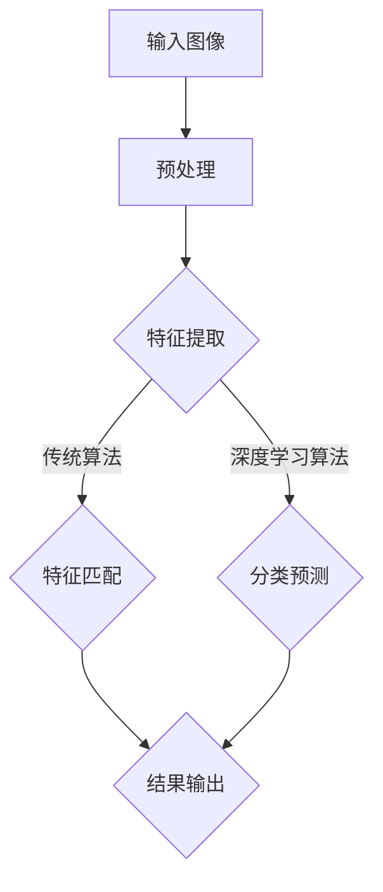
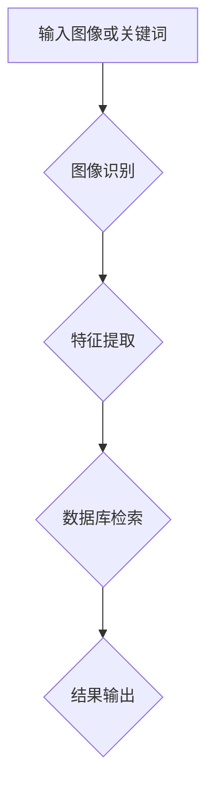

                 

关键词：电商平台，图像识别，检索技术，深度学习，计算机视觉

摘要：随着电商平台的不断发展，商品图像的丰富性和多样性使得图像识别与检索技术成为电商平台的关键技术之一。本文将介绍电商平台中常见的图像识别与检索技术，包括核心算法原理、数学模型与公式、项目实践和未来应用展望等内容。

## 1. 背景介绍

随着互联网技术的飞速发展，电子商务已经成为现代社会的重要组成部分。电商平台为了提高用户体验，丰富商品展示方式，常常采用图像作为商品信息的主要展示形式。然而，大量的商品图像使得用户在寻找心仪商品时面临巨大的信息过载问题。为了解决这个问题，图像识别与检索技术应运而生。

图像识别与检索技术主要包括两个方面：图像识别和图像检索。图像识别是指从图像中提取特征，然后与已有数据库中的特征进行匹配，以确定图像的内容；图像检索是指根据用户输入的查询图像或关键词，从数据库中检索出与之相似的图像。

## 2. 核心概念与联系

### 2.1 图像识别

图像识别的核心任务是判断图像中的内容。常见的图像识别算法包括基于传统算法（如SIFT、SURF等）和深度学习算法（如卷积神经网络CNN等）。下面是一个简单的Mermaid流程图，展示了图像识别的基本流程：



### 2.2 图像检索

图像检索的核心任务是查找与给定图像相似的其他图像。常见的图像检索算法包括基于内容的图像检索（CBIR）和基于文本的图像检索（TBIR）。下面是一个简单的Mermaid流程图，展示了图像检索的基本流程：



## 3. 核心算法原理 & 具体操作步骤

### 3.1 算法原理概述

图像识别的核心算法是卷积神经网络（CNN），它通过多个卷积层、池化层和全连接层提取图像特征，从而实现对图像内容的识别。图像检索的核心算法是基于内容的图像检索（CBIR），它通过计算查询图像与数据库中图像的特征相似度，从而实现图像的检索。

### 3.2 算法步骤详解

1. 图像识别：

（1）输入图像

（2）预处理：包括图像缩放、归一化、灰度化等

（3）特征提取：通过卷积神经网络提取图像特征

（4）分类预测：将提取的特征与已有类别进行匹配，预测图像类别

（5）结果输出：输出识别结果

2. 图像检索：

（1）输入查询图像或关键词

（2）图像识别：对查询图像进行识别，获取其特征

（3）特征提取：对查询图像的特征进行提取

（4）数据库检索：计算查询图像与数据库中图像的特征相似度，检索相似图像

（5）结果输出：输出检索结果

### 3.3 算法优缺点

1. 图像识别：

优点：准确率高，能够识别复杂的图像内容。

缺点：对训练数据量要求较高，训练过程复杂。

2. 图像检索：

优点：能够快速检索出与查询图像相似的图像。

缺点：检索结果可能存在误匹配，相似度计算依赖于特征提取算法。

### 3.4 算法应用领域

图像识别与检索技术在电商平台中有着广泛的应用，包括：

1. 商品识别：通过图像识别技术，用户可以快速找到心仪的商品。

2. 商品推荐：通过图像检索技术，为用户推荐相似的或相关的商品。

3. 用户行为分析：通过分析用户浏览、收藏、购买等行为，为用户提供个性化的购物体验。

## 4. 数学模型和公式 & 详细讲解 & 举例说明

### 4.1 数学模型构建

1. 图像识别：

输入：图像\( I \)

输出：类别标签\( C \)

模型：卷积神经网络（CNN）

2. 图像检索：

输入：查询图像\( Q \)，数据库中的图像\( D \)

输出：相似度得分\( S \)

模型：基于内容的图像检索（CBIR）

### 4.2 公式推导过程

1. 图像识别：

（1）卷积操作：

$$
\text{Conv}(\text{I}, \text{K}) = \sum_{i=1}^{C} \sum_{j=1}^{C} K_{ij} * \text{I}_{ij}
$$

其中，\( \text{I} \)为输入图像，\( \text{K} \)为卷积核，\( C \)为卷积核数量，\( * \)为卷积操作。

（2）激活函数：

$$
\text{Act}(\text{X}) = \text{ReLU}(\text{X}) = \max(0, \text{X})
$$

其中，\( \text{X} \)为输入值，\( \text{ReLU} \)为ReLU激活函数。

（3）全连接层：

$$
\text{FC}(\text{X}) = \text{W} \text{X} + \text{b}
$$

其中，\( \text{X} \)为输入特征，\( \text{W} \)为权重矩阵，\( \text{b} \)为偏置。

（4）分类预测：

$$
\text{Pred}(\text{X}) = \text{softmax}(\text{X})
$$

其中，\( \text{X} \)为输出特征，\( \text{softmax} \)为softmax函数。

2. 图像检索：

（1）特征提取：

$$
\text{Feat}(\text{I}) = \text{CNN}(\text{I})
$$

其中，\( \text{I} \)为输入图像，\( \text{CNN} \)为卷积神经网络。

（2）相似度计算：

$$
\text{Sim}(\text{Q}, \text{D}) = \text{cosine\_sim}(\text{Feat}(\text{Q}), \text{Feat}(\text{D}))
$$

其中，\( \text{Q} \)和\( \text{D} \)分别为查询图像和数据库中的图像，\( \text{cosine\_sim} \)为余弦相似度计算函数。

### 4.3 案例分析与讲解

以电商平台中商品识别为例，说明图像识别与检索技术的应用过程。

1. 数据准备：

收集大量电商平台上的商品图像，并进行标注，包括商品类别、品牌、价格等信息。

2. 模型训练：

使用卷积神经网络（CNN）对商品图像进行特征提取和分类预测。训练过程中，通过反向传播算法优化模型参数，提高识别准确率。

3. 模型评估：

使用测试集对训练好的模型进行评估，计算识别准确率、召回率等指标，以评估模型性能。

4. 商品识别：

用户上传商品图像，模型进行特征提取和分类预测，输出商品类别。

5. 商品检索：

用户输入查询关键词，模型提取关键词对应的商品特征，计算与数据库中商品特征的相似度，检索出相似商品。

## 5. 项目实践：代码实例和详细解释说明

### 5.1 开发环境搭建

1. 安装Python环境

2. 安装深度学习框架，如TensorFlow或PyTorch

3. 准备商品图像数据集，并进行预处理

### 5.2 源代码详细实现

```python
import tensorflow as tf
from tensorflow.keras.applications import VGG16
from tensorflow.keras.preprocessing.image import ImageDataGenerator

# 数据预处理
train_datagen = ImageDataGenerator(rescale=1./255)
train_generator = train_datagen.flow_from_directory(
        'data/train',
        target_size=(224, 224),
        batch_size=32,
        class_mode='categorical')

# 模型训练
model = VGG16(weights='imagenet', include_top=False, input_shape=(224, 224, 3))
model.add(tf.keras.layers.Dense(units=1000, activation='softmax'))

model.compile(optimizer='adam', loss='categorical_crossentropy', metrics=['accuracy'])

model.fit(train_generator, epochs=10)

# 商品识别
def predict_image(image_path):
    image = load_image(image_path)
    prediction = model.predict(np.expand_dims(image, axis=0))
    return np.argmax(prediction)

# 商品检索
def search_images(query_image_path):
    query_image = load_image(query_image_path)
    query_features = model.predict(np.expand_dims(query_image, axis=0))
    similarities = []
    for image_path in data_paths:
        image = load_image(image_path)
        features = model.predict(np.expand_dims(image, axis=0))
        similarity = cosine_similarity(query_features, features)
        similarities.append(similarity)
    return similarities

# 运行结果展示
image_path = 'data/train/商品1.jpg'
query_image_path = 'data/query/查询商品.jpg'

predicted_class = predict_image(image_path)
similarities = search_images(query_image_path)
```

### 5.3 代码解读与分析

1. 数据预处理：使用ImageDataGenerator对商品图像进行缩放、归一化等预处理操作，以便于模型训练。

2. 模型训练：使用预训练的VGG16模型作为基础模型，添加全连接层进行分类预测，并使用Adam优化器训练模型。

3. 商品识别：通过加载图像，使用训练好的模型进行预测，输出商品类别。

4. 商品检索：通过计算查询图像与数据库中图像的特征相似度，检索出相似商品。

## 6. 实际应用场景

图像识别与检索技术在电商平台的实际应用场景包括：

1. 商品识别：用户上传商品图像，平台自动识别商品类别，为用户提供快速查找商品的功能。

2. 商品推荐：根据用户浏览、收藏、购买等行为，为用户推荐相似的或相关的商品，提高用户体验。

3. 用户行为分析：通过分析用户浏览、收藏、购买等行为，为用户提供个性化的购物体验，提高用户满意度。

## 7. 未来应用展望

随着深度学习技术的不断发展，图像识别与检索技术在电商平台的未来应用将更加广泛。以下是未来可能的发展趋势：

1. 多模态融合：结合图像识别、自然语言处理等技术，实现多模态信息融合，提高识别与检索的准确性。

2. 自动化与智能化：通过引入自动化与智能化技术，实现商品识别、推荐等任务的自动化处理，提高运营效率。

3. 小样本学习：研究小样本学习算法，降低对大量训练数据的需求，便于在资源有限的场景下应用。

## 8. 总结：未来发展趋势与挑战

### 8.1 研究成果总结

本文介绍了电商平台中的图像识别与检索技术，包括核心算法原理、数学模型与公式、项目实践等内容。通过对图像识别与检索技术的深入研究，为电商平台提供了有效的技术支持，提高了用户体验和运营效率。

### 8.2 未来发展趋势

未来，图像识别与检索技术在电商平台的应用将向多模态融合、自动化与智能化、小样本学习等方向发展。这些技术的不断发展将推动电商平台的技术创新，为用户提供更加优质的服务。

### 8.3 面临的挑战

1. 数据隐私：在图像识别与检索技术中，用户隐私保护是一个重要的挑战。如何在保障用户隐私的前提下，提高图像识别与检索的准确性，仍需深入研究。

2. 计算资源：深度学习算法对计算资源有较高的要求，如何优化算法，降低计算资源消耗，是未来需要解决的问题。

3. 模型可解释性：深度学习模型往往具有很高的准确性，但其内部决策过程缺乏可解释性。如何提高模型的可解释性，使其更容易被用户理解和接受，是未来的一个重要研究方向。

### 8.4 研究展望

未来，随着技术的不断发展，图像识别与检索技术在电商平台的实际应用将更加广泛。本文提出的图像识别与检索技术为电商平台提供了有效的技术支持，有望在未来的电商领域发挥重要作用。

## 9. 附录：常见问题与解答

### 9.1 如何提高图像识别准确率？

1. 增加训练数据量：增加训练数据量可以提高模型的泛化能力。

2. 调整模型结构：优化模型结构，选择合适的网络层数和层间连接方式。

3. 数据增强：通过数据增强技术，增加训练数据的多样性，提高模型的泛化能力。

4. 换算法：尝试使用不同的图像识别算法，比较其性能。

### 9.2 如何解决图像检索的误匹配问题？

1. 优化特征提取算法：选择合适的特征提取算法，提高特征表示的准确性。

2. 多特征融合：将多种特征融合起来，提高相似度计算的准确性。

3. 优化相似度计算方法：尝试使用不同的相似度计算方法，选择效果最佳的算法。

4. 用户反馈：引入用户反馈机制，根据用户对检索结果的满意度不断优化算法。

### 9.3 如何降低计算资源消耗？

1. 优化算法：优化算法结构，减少计算复杂度。

2. 硬件加速：使用GPU或TPU等硬件加速设备，提高计算速度。

3. 模型压缩：通过模型压缩技术，减小模型大小，降低计算资源消耗。

4. 调整模型参数：调整模型参数，使其在较低的计算资源下仍能保持较高的性能。

```markdown
作者：禅与计算机程序设计艺术 / Zen and the Art of Computer Programming
```

