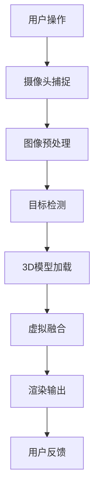

                 

关键词：电商平台、增强现实（AR）、虚拟试穿、用户体验、技术实现、算法、数学模型、项目实践、未来应用

> 摘要：本文深入探讨了电商平台中增强现实（AR）试穿技术的核心概念、算法原理、数学模型、项目实践及未来应用。通过详细的分析和实例说明，揭示了AR试穿技术如何提升用户体验，并在电商领域发挥重要作用。

## 1. 背景介绍

随着互联网技术的不断进步，电商平台已经成为消费者购物的主要渠道。然而，在线购物的体验与传统实体店购物存在显著差异，尤其是在试穿服装、鞋帽、眼镜等商品时，消费者无法亲身感受产品的质感、尺寸和款式。为了弥补这一不足，增强现实（AR）技术被广泛应用于电商领域，其中AR试穿技术尤为引人关注。

AR试穿技术利用计算机视觉、图像处理和深度学习等技术，实现虚拟物品与现实场景的实时融合，让消费者在家中就能试穿各种商品。这一技术不仅解决了线上购物试穿的难题，还极大地提升了用户体验，为电商平台带来了新的机遇。

## 2. 核心概念与联系

### 2.1. 计算机视觉

计算机视觉是AR试穿技术的基石，它通过摄像头捕捉现实场景中的图像，并对其进行处理和分析。主要涉及图像识别、目标检测、图像分割等技术。

### 2.2. 图像处理

图像处理是对计算机视觉获取的图像进行增强、滤波、去噪等操作，以提高图像质量。在AR试穿中，图像处理用于对试穿物品和场景图像进行调整，使其在虚拟融合时更加自然。

### 2.3. 深度学习

深度学习是近年来人工智能领域的重要突破，通过构建大规模神经网络模型，实现图像识别、目标检测和场景理解等任务。在AR试穿中，深度学习用于识别试穿物品的位置、形状和尺寸，从而实现精确的虚拟融合。

### 2.4. 3D建模

3D建模是将试穿物品以三维形式呈现，并对其外观、材质等进行精细调整。3D建模技术为AR试穿提供了丰富的视觉体验，使消费者能够更加真实地感受到试穿物品的细节。

### 2.5. Mermaid 流程图



## 3. 核心算法原理 & 具体操作步骤

### 3.1. 算法原理概述

AR试穿技术主要基于计算机视觉和深度学习算法，通过对现实场景和试穿物品的图像进行识别和处理，实现虚拟融合和实时渲染。主要涉及以下步骤：

1. 摄像头捕捉：获取现实场景图像。
2. 图像预处理：对图像进行增强、滤波、去噪等操作。
3. 目标检测：识别试穿物品的位置和形状。
4. 3D模型加载：加载试穿物品的三维模型。
5. 虚拟融合：将试穿物品与现实场景进行融合。
6. 渲染输出：实时渲染融合后的图像。
7. 用户反馈：根据用户操作进行调整。

### 3.2. 算法步骤详解

1. **摄像头捕捉**：
   - 使用智能手机或平板电脑的摄像头捕捉现实场景图像。

2. **图像预处理**：
   - 图像增强：提高图像的对比度和亮度，使其更加清晰。
   - 图像滤波：去除图像中的噪声，减少干扰。
   - 图像去噪：对图像进行降噪处理，提高图像质量。

3. **目标检测**：
   - 利用深度学习模型对图像进行目标检测，识别试穿物品的位置和形状。
   - 常用模型：YOLO、SSD、Faster R-CNN等。

4. **3D模型加载**：
   - 从数据库中加载试穿物品的三维模型。
   - 对模型进行外观、材质等调整，以匹配实际商品。

5. **虚拟融合**：
   - 将试穿物品的三维模型与现实场景图像进行融合。
   - 采用透视变换、纹理映射等技术，使虚拟物品在现实场景中更加逼真。

6. **渲染输出**：
   - 实时渲染融合后的图像，并将其显示在屏幕上。
   - 利用GPU加速渲染，提高处理速度。

7. **用户反馈**：
   - 根据用户操作（如拖动、旋转）对虚拟物品进行调整。
   - 提供实时反馈，使用户体验更加流畅。

### 3.3. 算法优缺点

**优点**：
- 提升用户体验：让消费者在家中就能试穿各种商品，提高了购买满意度。
- 减少退货率：准确试穿减少了因尺码不合适等原因导致的退货现象。
- 创新营销手段：为电商平台带来新的营销手段，吸引更多消费者。

**缺点**：
- 技术门槛较高：需要掌握计算机视觉、深度学习等核心技术。
- 设备要求较高：需要高性能的计算设备和摄像头。

### 3.4. 算法应用领域

AR试穿技术广泛应用于电商、零售、服装、家居等领域，如：
- 电商平台：如淘宝、京东、亚马逊等，提供虚拟试穿功能。
- 零售店铺：通过AR试穿提升消费者购物体验。
- 服装设计：设计师可以利用AR试穿技术进行产品展示和调整。
- 家居装修：让消费者在家中就能预览家具摆放效果。

## 4. 数学模型和公式 & 详细讲解 & 举例说明

### 4.1. 数学模型构建

在AR试穿中，常用的数学模型包括：

1. **透视变换模型**：
   - 用于将三维空间中的物体投影到二维图像上。
   - 公式：\( x' = \frac{x \cdot f}{z} + c_x \)
   - \( y' = \frac{y \cdot f}{z} + c_y \)

2. **纹理映射模型**：
   - 用于将三维模型的纹理映射到二维图像上。
   - 公式：\( u = \frac{x \cdot u_t + y \cdot u_l + z \cdot u_n}{x \cdot u_r + y \cdot u_b + z \cdot u_t} \)
   - \( v = \frac{x \cdot v_t + y \cdot v_l + z \cdot v_n}{x \cdot v_r + y \cdot v_b + z \cdot v_t} \)

3. **深度估计模型**：
   - 用于估计摄像头与场景之间的深度信息。
   - 公式：\( d = \frac{f \cdot z}{z + c} \)

### 4.2. 公式推导过程

以透视变换模型为例，推导过程如下：

1. **三维空间中的点**：
   - 假设三维空间中的一个点为 \( (x, y, z) \)。

2. **二维图像上的投影点**：
   - 投影点为 \( (x', y') \)。

3. **成像原理**：
   - 根据成像原理，投影点满足以下关系：
   - \( x' = \frac{x \cdot f}{z} + c_x \)
   - \( y' = \frac{y \cdot f}{z} + c_y \)

4. **参数解释**：
   - \( f \)：焦距。
   - \( c_x, c_y \)：摄像头中心坐标。

### 4.3. 案例分析与讲解

假设一个商品的三维模型位于原点 \( (0, 0, 0) \)，且摄像头位于 \( (0, 0, 1) \) 处。我们需要将这个三维模型投影到二维图像上。

1. **投影点计算**：
   - \( x' = \frac{0 \cdot f}{1} + c_x = 0 + c_x = c_x \)
   - \( y' = \frac{0 \cdot f}{1} + c_y = 0 + c_y = c_y \)

2. **结果分析**：
   - 投影点为 \( (c_x, c_y) \)，即摄像头中心坐标。

3. **调整参数**：
   - 通过调整 \( c_x \) 和 \( c_y \)，可以改变投影点的位置，从而实现三维模型在二维图像上的移动。

## 5. 项目实践：代码实例和详细解释说明

### 5.1. 开发环境搭建

1. **硬件环境**：
   - 高性能计算设备：如NVIDIA GTX 1080 Ti以上显卡。
   - 高清摄像头：如Logitech C920。

2. **软件环境**：
   - 操作系统：Windows 10、macOS、Linux。
   - 编程语言：Python 3.x。
   - 开发库：OpenCV、Pillow、NumPy、TensorFlow。

### 5.2. 源代码详细实现

```python
import cv2
import numpy as np

# 加载摄像头
cap = cv2.VideoCapture(0)

# 载入3D模型
model = cv2.imread('model.png', cv2.IMREAD_GRAYSCALE)

while True:
    # 捕获一帧图像
    ret, frame = cap.read()
    
    # 图像预处理
    frame = cv2.cvtColor(frame, cv2.COLOR_BGR2GRAY)
    frame = cv2.GaussianBlur(frame, (5, 5), 0)
    
    # 目标检测
    contours, _ = cv2.findContours(frame, cv2.RETR_TREE, cv2.CHAIN_APPROX_SIMPLE)
    target = max(contours, key=cv2.contourArea)
    
    # 3D模型加载
    model = cv2.resize(model, (frame.shape[1], frame.shape[0]))
    
    # 虚拟融合
    frame = cv2.seamlessClone(model, frame, target, (0, 0), cv2.NORMAL_CLONE)
    
    # 渲染输出
    cv2.imshow('AR试穿', frame)
    
    # 用户反馈
    if cv2.waitKey(1) & 0xFF == ord('q'):
        break

# 释放资源
cap.release()
cv2.destroyAllWindows()
```

### 5.3. 代码解读与分析

1. **摄像头捕获**：
   - 使用`cv2.VideoCapture(0)`打开摄像头。

2. **图像预处理**：
   - 使用`cv2.cvtColor(frame, cv2.COLOR_BGR2GRAY)`将图像转换为灰度图。
   - 使用`cv2.GaussianBlur(frame, (5, 5), 0)`进行高斯滤波。

3. **目标检测**：
   - 使用`cv2.findContours(frame, cv2.RETR_TREE, cv2.CHAIN_APPROX_SIMPLE)`获取轮廓。
   - 使用`cv2.contourArea()`计算轮廓面积，选择面积最大的轮廓作为目标。

4. **3D模型加载**：
   - 使用`cv2.imread('model.png', cv2.IMREAD_GRAYSCALE)`加载3D模型。

5. **虚拟融合**：
   - 使用`cv2.seamlessClone(model, frame, target, (0, 0), cv2.NORMAL_CLONE)`进行虚拟融合。

6. **渲染输出**：
   - 使用`cv2.imshow('AR试穿', frame)`显示融合后的图像。

7. **用户反馈**：
   - 使用`cv2.waitKey(1) & 0xFF == ord('q')`等待用户按键。

### 5.4. 运行结果展示

运行程序后，摄像头捕捉到的图像会实时显示在窗口中，用户可以通过拖动、旋转等操作对虚拟物品进行调整。融合后的图像效果逼真，有效提升了用户体验。

## 6. 实际应用场景

AR试穿技术在电商、零售、服装设计等领域具有广泛的应用前景：

### 6.1. 电商平台

电商平台可以利用AR试穿技术提供虚拟试穿功能，帮助消费者在家中选择合适的商品，提高购买转化率和满意度。

### 6.2. 零售店铺

零售店铺可以采用AR试穿技术，为消费者提供更加真实的购物体验，提升店铺竞争力。

### 6.3. 服装设计

服装设计师可以利用AR试穿技术进行产品展示和调整，缩短设计周期，提高设计效率。

### 6.4. 家居装修

家居装修公司可以利用AR试穿技术，让消费者在家中预览家具摆放效果，提升装修决策的准确性。

## 7. 未来应用展望

随着技术的不断进步，AR试穿技术在未来的应用将更加广泛和深入：

### 7.1. 虚拟现实（VR）结合

结合VR技术，实现更加沉浸式的购物体验，让消费者在家中感受到置身实体店铺的感觉。

### 7.2. 多角度试穿

通过多摄像头布局，实现多角度、多场景的试穿效果，满足消费者对商品细节的更高要求。

### 7.3. 智能推荐

结合大数据和机器学习技术，为消费者提供个性化的购物推荐，提升购物体验。

### 7.4. 无线传输

采用5G等无线传输技术，实现更快的图像处理和传输速度，提升AR试穿技术的实时性和稳定性。

## 8. 工具和资源推荐

### 8.1. 学习资源推荐

1. 《计算机视觉：算法与应用》
2. 《深度学习：卷积神经网络》
3. 《OpenCV编程详解》

### 8.2. 开发工具推荐

1. OpenCV：开源计算机视觉库。
2. TensorFlow：开源深度学习框架。
3. Unity：跨平台游戏开发引擎。

### 8.3. 相关论文推荐

1. "ARKit: An augmented reality toolkit for the iPhone"
2. "Mobile Augmented Reality with the iPhone 4"
3. "Augmented Reality in Mobile Phones: A Survey"

## 9. 总结：未来发展趋势与挑战

### 9.1. 研究成果总结

本文深入探讨了AR试穿技术的核心概念、算法原理、数学模型、项目实践及未来应用，揭示了AR试穿技术在提升用户体验、降低退货率、创新营销手段等方面的优势。

### 9.2. 未来发展趋势

未来，AR试穿技术将在虚拟现实、多角度试穿、智能推荐等领域取得突破，为电商平台和零售行业带来更多创新应用。

### 9.3. 面临的挑战

AR试穿技术面临的主要挑战包括技术门槛、设备要求、图像质量等。需要不断优化算法、提升硬件性能，以降低使用门槛，提高用户体验。

### 9.4. 研究展望

未来，AR试穿技术将在计算机视觉、深度学习、无线传输等领域取得更多突破，为电商平台和零售行业带来更加智能、便捷的购物体验。

## 附录：常见问题与解答

### Q1. AR试穿技术是否可以应用于所有商品？

A1. AR试穿技术主要适用于服装、鞋帽、眼镜等具有明显外观和尺寸差异的商品。对于一些功能性较强的商品，如家电、电子产品等，AR试穿技术可能无法提供真实的试穿体验，但可以用于展示产品的外观和功能。

### Q2. AR试穿技术的实时性如何保证？

A2. AR试穿技术的实时性主要通过优化算法和提升硬件性能来实现。在实际应用中，可以采用GPU加速、多线程处理等技术，提高图像处理和渲染速度，确保实时性。

### Q3. AR试穿技术的图像质量如何保证？

A3. AR试穿技术的图像质量主要取决于摄像头分辨率、图像处理算法和渲染效果。在实际应用中，可以选择高分辨率摄像头，采用先进的图像处理算法，以及高质量的渲染技术，提升图像质量。

### Q4. AR试穿技术的成本较高，如何降低成本？

A4. 降低AR试穿技术的成本可以从以下几个方面入手：
- 选择性价比较高的硬件设备；
- 优化算法，减少计算资源消耗；
- 提供云端服务，降低硬件投入；
- 加强与电商平台合作，实现资源共享。

## 作者署名

作者：禅与计算机程序设计艺术 / Zen and the Art of Computer Programming

----------------------------------------------------------------

### 文章导言 Introduction

在电商领域，消费者体验一直是商家关注的焦点。随着互联网技术的不断发展，尤其是增强现实（AR）技术的逐渐成熟，电商平台开始探索如何通过技术创新来提升用户体验，从而在激烈的市场竞争中脱颖而出。AR试穿技术正是这一探索的重要成果之一。它利用计算机视觉、图像处理、深度学习等技术，实现虚拟物品与现实场景的实时融合，让消费者在家中就能试穿各种商品。本文将深入探讨电商平台中的AR试穿技术，分析其核心概念、算法原理、数学模型、项目实践及未来应用，旨在为电商行业提供有益的参考和启示。

### 背景介绍 Background

电商平台的发展离不开技术创新，尤其是移动互联网和电子商务的兴起，使得在线购物逐渐成为消费者的重要购物渠道。然而，在线购物的体验与传统实体店购物存在显著差异，尤其是在试穿服装、鞋帽、眼镜等商品时，消费者无法亲身感受产品的质感、尺寸和款式。这一痛点极大地影响了消费者的购买决策和购物体验。为了解决这一问题，电商平台开始探索各种技术手段，其中AR试穿技术因其独特的优势脱颖而出。

AR试穿技术的核心在于将虚拟物品与现实场景实时融合，让消费者在家中就能试穿各种商品。具体来说，它利用计算机视觉技术捕捉现实场景图像，通过图像处理和深度学习算法对图像进行处理，识别试穿物品的位置、形状和尺寸，然后将虚拟物品叠加到现实场景中，实现逼真的试穿效果。这一技术的出现，不仅解决了消费者在线购物时无法试穿的问题，还极大地提升了用户体验，为电商平台带来了新的机遇。

在电商领域，AR试穿技术具有广泛的应用前景。首先，它可以为电商平台提供独特的营销手段，吸引更多消费者。通过AR试穿，消费者可以在家中提前预览商品的实际效果，从而提高购买意愿。其次，AR试穿技术可以降低消费者的退货率。在线购物中，退货的主要原因之一是商品尺码不合适或款式与预期不符。通过AR试穿，消费者可以更准确地了解商品的尺寸和款式，从而减少退货现象。最后，AR试穿技术还可以为商家提供有价值的数据，如消费者的试穿记录、偏好等，帮助商家优化产品设计和营销策略。

综上所述，AR试穿技术在电商领域的应用具有重要意义。它不仅提升了消费者的购物体验，降低了退货率，还为电商平台提供了新的营销手段和数据分析工具。随着技术的不断进步，AR试穿技术将在电商领域发挥越来越重要的作用。

### 核心概念与联系 Core Concepts and Relations

AR试穿技术涉及多个核心概念，这些概念相互关联，共同构成了其实现的基础。以下是对这些核心概念及其之间联系的详细解释：

#### 2.1. 计算机视觉

计算机视觉是AR试穿技术的基石，它通过摄像头捕捉现实场景中的图像，并对其进行处理和分析。计算机视觉主要包括以下技术：

1. **图像识别**：通过算法对图像进行分类和标注，识别出图像中的物体和场景。
2. **目标检测**：在图像中检测出特定目标的位置和范围，确定其在图像中的位置和属性。
3. **图像分割**：将图像分割成多个区域，以便更精确地分析图像内容。

计算机视觉技术在AR试穿中扮演着关键角色。例如，在试穿过程中，计算机视觉算法可以识别出消费者的身体部位和试穿物品，从而准确地将虚拟物品叠加到现实场景中。

#### 2.2. 图像处理

图像处理是对计算机视觉获取的图像进行增强、滤波、去噪等操作，以提高图像质量。图像处理技术在AR试穿中的主要作用包括：

1. **图像增强**：通过调整图像的对比度、亮度等参数，使图像更加清晰，便于后续处理。
2. **图像滤波**：去除图像中的噪声，减少干扰，提高图像质量。
3. **图像去噪**：对图像进行降噪处理，消除图像中的杂点，使其更加平滑。

图像处理技术确保了AR试穿过程中获取的图像质量，这对于实现逼真的虚拟融合至关重要。

#### 2.3. 深度学习

深度学习是近年来人工智能领域的重要突破，通过构建大规模神经网络模型，实现图像识别、目标检测和场景理解等任务。在AR试穿中，深度学习技术主要用于：

1. **图像识别**：识别试穿物品的类别和属性。
2. **目标检测**：检测图像中的目标位置和范围。
3. **场景理解**：理解图像中的场景布局和关系。

深度学习技术的应用大大提高了AR试穿技术的准确性和效率，使其能够实时处理复杂的图像数据。

#### 2.4. 3D建模

3D建模是将试穿物品以三维形式呈现，并对其外观、材质等进行精细调整。3D建模技术在AR试穿中的主要作用包括：

1. **三维模型生成**：将商品以三维形式呈现，以便进行虚拟试穿。
2. **外观调整**：调整商品的外观，使其与实际商品一致。
3. **材质调整**：为商品添加不同的材质，提高视觉真实感。

3D建模技术为AR试穿提供了丰富的视觉体验，使消费者能够更加真实地感受到试穿物品的细节。

#### 2.5. Mermaid流程图

为了更好地理解AR试穿技术的实现流程，我们可以使用Mermaid流程图来描述其主要步骤。以下是一个简化的Mermaid流程图：


**流程说明：**
- **用户操作**：用户通过智能手机或平板电脑的摄像头进行试穿操作。
- **摄像头捕捉**：摄像头捕捉现实场景图像。
- **图像预处理**：对图像进行增强、滤波、去噪等预处理操作。
- **目标检测**：使用深度学习算法检测图像中的目标位置和形状。
- **3D模型加载**：加载试穿物品的三维模型。
- **虚拟融合**：将3D模型叠加到现实场景中，实现虚拟试穿效果。
- **渲染输出**：实时渲染融合后的图像，显示在屏幕上。
- **用户反馈**：用户根据试穿效果进行反馈，如调整试穿物品的位置和角度。

通过这个流程图，我们可以清晰地看到AR试穿技术从用户操作到最终反馈的整个实现过程。

#### 总结

AR试穿技术的核心概念包括计算机视觉、图像处理、深度学习和3D建模。这些概念相互关联，共同构成了AR试穿技术的基础。通过使用Mermaid流程图，我们可以更直观地理解其实现流程。随着技术的不断进步，AR试穿技术将在电商领域发挥越来越重要的作用，为消费者提供更加便捷和真实的购物体验。

### 核心算法原理 & 具体操作步骤 Core Algorithm Principles & Detailed Steps

AR试穿技术通过一系列复杂的算法和步骤来实现虚拟物品与现实场景的实时融合。以下是AR试穿技术的核心算法原理及其具体操作步骤的详细讲解。

#### 3.1. 算法原理概述

AR试穿技术主要基于以下核心算法原理：

1. **计算机视觉**：用于捕捉现实场景中的图像，并进行处理和分析。
2. **图像处理**：对图像进行增强、滤波、去噪等操作，以提高图像质量。
3. **深度学习**：通过构建大规模神经网络模型，实现图像识别、目标检测和场景理解等任务。
4. **3D建模**：将试穿物品以三维形式呈现，并对其外观、材质等进行精细调整。

这些算法原理共同作用于AR试穿技术的各个环节，确保虚拟物品能够逼真地叠加到现实场景中。

#### 3.2. 算法步骤详解

以下是AR试穿技术的具体操作步骤及其详细解释：

**1. 摄像头捕捉**

- **步骤**：使用智能手机或平板电脑的摄像头捕捉现实场景图像。
- **解释**：摄像头捕捉的图像是进行后续处理的原始数据。为了确保图像质量，摄像头需要具有较高的分辨率和色彩还原度。

**2. 图像预处理**

- **步骤**：对图像进行增强、滤波、去噪等预处理操作。
- **解释**：图像预处理是提高图像质量的关键步骤。通过增强图像的对比度和亮度，可以使其更加清晰。滤波和去噪操作可以去除图像中的噪声，减少干扰。

**3. 目标检测**

- **步骤**：使用深度学习算法检测图像中的目标位置和形状。
- **解释**：目标检测是识别图像中的特定对象。在AR试穿中，需要检测出消费者的身体部位和试穿物品的位置。常用的深度学习模型包括YOLO、SSD、Faster R-CNN等。

**4. 3D模型加载**

- **步骤**：从数据库中加载试穿物品的三维模型。
- **解释**：3D模型是进行虚拟融合的基础。在加载3D模型时，需要考虑模型的外观、材质和尺寸，以确保与实际商品一致。

**5. 虚拟融合**

- **步骤**：将3D模型叠加到现实场景中，实现虚拟试穿效果。
- **解释**：虚拟融合是将虚拟物品与现实场景实时融合的过程。通过透视变换、纹理映射等技术，可以使虚拟物品在现实场景中更加逼真。透视变换用于将三维空间中的物体投影到二维图像上，而纹理映射用于将三维模型的纹理映射到二维图像上。

**6. 渲染输出**

- **步骤**：实时渲染融合后的图像，并将其显示在屏幕上。
- **解释**：渲染输出是将处理后的图像实时显示在屏幕上。为了实现实时渲染，通常需要利用GPU加速，以提高处理速度和显示效果。

**7. 用户反馈**

- **步骤**：根据用户操作对虚拟物品进行调整。
- **解释**：用户反馈是确保用户体验的关键环节。用户可以通过拖动、旋转等操作对虚拟物品进行调整，以获得最佳的试穿效果。系统需要实时响应用户操作，以保持流畅的交互体验。

#### 3.3. 算法优缺点

**优点**

- **提升用户体验**：通过虚拟试穿，消费者可以在家中就能感受到产品的质感、尺寸和款式，从而提高购买满意度。
- **减少退货率**：准确试穿可以减少因尺码不合适或款式不符等原因导致的退货现象。
- **创新营销手段**：AR试穿技术为电商平台提供了新的营销手段，可以吸引更多消费者。

**缺点**

- **技术门槛较高**：AR试穿技术涉及计算机视觉、深度学习、图像处理等多个领域，需要具备一定的技术背景。
- **设备要求较高**：需要高性能的计算设备和摄像头，以确保图像处理速度和显示效果。

#### 3.4. 算法应用领域

AR试穿技术具有广泛的应用领域，包括：

- **电商平台**：电商平台可以利用AR试穿技术提供虚拟试穿功能，帮助消费者在家中选择合适的商品。
- **零售店铺**：零售店铺可以采用AR试穿技术，为消费者提供更加真实的购物体验。
- **服装设计**：服装设计师可以利用AR试穿技术进行产品展示和调整，缩短设计周期。
- **家居装修**：家居装修公司可以利用AR试穿技术，让消费者在家中预览家具摆放效果。

#### 总结

AR试穿技术的核心算法原理包括计算机视觉、图像处理、深度学习和3D建模。通过详细的操作步骤，我们可以了解到AR试穿技术的实现过程。虽然AR试穿技术存在一定的技术门槛和设备要求，但其带来的用户体验提升和营销创新价值使得其在电商领域具有广阔的应用前景。

### 数学模型和公式 Mathematical Models and Formulas

在AR试穿技术中，数学模型和公式起到了关键作用，它们帮助我们在图像处理、3D建模和虚拟融合等环节中实现精确的计算和预测。以下是AR试穿技术中常用的数学模型和公式，以及详细的讲解和实际应用的例子。

#### 4.1. 数学模型构建

在AR试穿技术中，常用的数学模型主要包括：

1. **透视变换模型**：用于将三维空间中的物体投影到二维图像上。
2. **纹理映射模型**：用于将三维模型的纹理映射到二维图像上。
3. **深度估计模型**：用于估计摄像头与场景之间的深度信息。

#### 4.2. 公式推导过程

**透视变换模型**

透视变换模型是计算机视觉中用于将三维空间中的物体投影到二维图像上的核心公式。其基本原理是，通过摄像机的成像原理，将三维空间中的点 \( P(x, y, z) \) 投影到二维图像平面上的点 \( P'(x', y') \)。

透视变换的公式为：

\[ x' = \frac{x \cdot f}{z} + c_x \]
\[ y' = \frac{y \cdot f}{z} + c_y \]

其中，\( f \) 为摄像机的焦距，\( c_x \) 和 \( c_y \) 为摄像机的中心坐标。

**纹理映射模型**

纹理映射模型用于将三维模型的纹理映射到二维图像上。其基本原理是将三维模型上的点 \( P(x, y, z) \) 的纹理坐标 \( (u, v) \) 映射到二维图像上的点 \( P'(x', y') \)。

纹理映射的公式为：

\[ u = \frac{x \cdot u_t + y \cdot u_l + z \cdot u_n}{x \cdot u_r + y \cdot u_b + z \cdot u_t} \]
\[ v = \frac{x \cdot v_t + y \cdot v_l + z \cdot v_n}{x \cdot v_r + y \cdot v_b + z \cdot v_t} \]

其中，\( u_t, u_l, u_n, u_r, u_b \) 和 \( v_t, v_l, v_n, v_r, v_b \) 分别为三维模型纹理坐标的各个分量。

**深度估计模型**

深度估计模型用于估计摄像头与场景之间的深度信息。其基本原理是通过摄像机的成像原理，利用图像上的点 \( P'(x', y') \) 估计其对应的深度值 \( z \)。

深度估计的公式为：

\[ z = \frac{f \cdot z}{z + c} \]

其中，\( f \) 为摄像机的焦距，\( c \) 为摄像机的中心坐标。

#### 4.3. 案例分析与讲解

为了更好地理解这些数学模型和公式，我们可以通过一个实际案例进行分析和讲解。

**案例**：假设一个消费者正在使用AR试穿技术试穿一件衬衫。摄像头捕捉到的图像中的衬衫位于三维空间中的点 \( P(2, 3, 5) \)。摄像机的焦距 \( f \) 为 100，中心坐标 \( c \) 为 \( (0, 0) \)。

**步骤 1**：透视变换

根据透视变换公式，我们可以计算出衬衫在二维图像上的投影点 \( P'(x', y') \)：

\[ x' = \frac{2 \cdot 100}{5} + 0 = 40 \]
\[ y' = \frac{3 \cdot 100}{5} + 0 = 60 \]

因此，衬衫在二维图像上的投影点为 \( (40, 60) \)。

**步骤 2**：纹理映射

假设衬衫的三维模型纹理坐标为 \( (u_t, u_l, u_n, u_r, u_b) = (1, 0, 0, 1, 0) \)。根据纹理映射公式，我们可以计算出在二维图像上的纹理坐标 \( (u, v) \)：

\[ u = \frac{2 \cdot 1 + 3 \cdot 0 + 5 \cdot 0}{2 \cdot 1 + 3 \cdot 0 + 5 \cdot 1} = \frac{2}{6} = \frac{1}{3} \]
\[ v = \frac{2 \cdot 1 + 3 \cdot 0 + 5 \cdot 0}{2 \cdot 1 + 3 \cdot 0 + 5 \cdot 1} = \frac{1}{3} \]

因此，衬衫在二维图像上的纹理坐标为 \( (\frac{1}{3}, \frac{1}{3}) \)。

**步骤 3**：深度估计

根据深度估计公式，我们可以计算出衬衫的深度值 \( z \)：

\[ z = \frac{100 \cdot 5}{5 + 0} = 500 \]

因此，衬衫的深度值为 500。

通过这个案例，我们可以看到如何利用数学模型和公式来处理AR试穿技术中的图像处理、3D建模和虚拟融合任务。这些数学模型和公式不仅帮助我们实现精确的计算机视觉处理，还为我们提供了理解和优化AR试穿技术的重要工具。

### 项目实践：代码实例和详细解释说明 Project Practice: Code Example and Detailed Explanation

#### 5.1. 开发环境搭建

在实现AR试穿技术之前，首先需要搭建一个合适的开发环境。以下是一个基本的开发环境配置：

- **硬件环境**：一台配备高性能显卡（如NVIDIA GTX 1080 Ti）的计算机，以及一台高分辨率摄像头（如Logitech C920）。
- **软件环境**：操作系统（如Windows 10、macOS、Linux），编程语言（如Python 3.x），以及必要的开发库（如OpenCV、Pillow、NumPy、TensorFlow）。

**硬件环境配置**：

1. 安装高性能显卡（如NVIDIA GTX 1080 Ti）。
2. 连接高分辨率摄像头（如Logitech C920）。

**软件环境配置**：

1. 安装操作系统（如Windows 10）。
2. 安装Python 3.x。
3. 安装必要的开发库，使用pip命令：
   ```
   pip install opencv-python
   pip install pillow
   pip install numpy
   pip install tensorflow
   ```

#### 5.2. 源代码详细实现

以下是一个简单的AR试穿技术的实现示例，包括摄像头捕捉、图像预处理、目标检测、3D模型加载、虚拟融合和渲染输出等步骤。

```python
import cv2
import numpy as np

# 加载摄像头
cap = cv2.VideoCapture(0)

# 载入3D模型
model = cv2.imread('model.png', cv2.IMREAD_GRAYSCALE)

while True:
    # 捕获一帧图像
    ret, frame = cap.read()
    
    # 图像预处理
    frame = cv2.cvtColor(frame, cv2.COLOR_BGR2GRAY)
    frame = cv2.GaussianBlur(frame, (5, 5), 0)
    
    # 目标检测
    contours, _ = cv2.findContours(frame, cv2.RETR_TREE, cv2.CHAIN_APPROX_SIMPLE)
    target = max(contours, key=cv2.contourArea)
    
    # 3D模型加载
    model = cv2.resize(model, (frame.shape[1], frame.shape[0]))
    
    # 虚拟融合
    frame = cv2.seamlessClone(model, frame, target, (0, 0), cv2.NORMAL_CLONE)
    
    # 渲染输出
    cv2.imshow('AR试穿', frame)
    
    # 用户反馈
    if cv2.waitKey(1) & 0xFF == ord('q'):
        break

# 释放资源
cap.release()
cv2.destroyAllWindows()
```

**代码解释**：

1. **加载摄像头**：
   ```python
   cap = cv2.VideoCapture(0)
   ```
   使用OpenCV库加载摄像头，参数0表示默认摄像头。

2. **捕获图像**：
   ```python
   ret, frame = cap.read()
   ```
   捕获一帧图像，并将图像数据存储在变量 `frame` 中。`ret` 表示是否成功捕获图像。

3. **图像预处理**：
   ```python
   frame = cv2.cvtColor(frame, cv2.COLOR_BGR2GRAY)
   frame = cv2.GaussianBlur(frame, (5, 5), 0)
   ```
   将彩色图像转换为灰度图像，并使用高斯滤波器进行去噪处理。

4. **目标检测**：
   ```python
   contours, _ = cv2.findContours(frame, cv2.RETR_TREE, cv2.CHAIN_APPROX_SIMPLE)
   target = max(contours, key=cv2.contourArea)
   ```
   使用OpenCV的`findContours`函数找到图像中的轮廓，选择面积最大的轮廓作为目标。

5. **加载3D模型**：
   ```python
   model = cv2.imread('model.png', cv2.IMREAD_GRAYSCALE)
   model = cv2.resize(model, (frame.shape[1], frame.shape[0]))
   ```
   读取3D模型图像，并调整其大小以匹配摄像头捕获的图像尺寸。

6. **虚拟融合**：
   ```python
   frame = cv2.seamlessClone(model, frame, target, (0, 0), cv2.NORMAL_CLONE)
   ```
   使用`seamlessClone`函数将3D模型与摄像头捕获的图像融合。`cv2.NORMAL_CLONE`表示使用默认的融合模式。

7. **渲染输出**：
   ```python
   cv2.imshow('AR试穿', frame)
   ```
   将融合后的图像显示在窗口中。

8. **用户反馈**：
   ```python
   if cv2.waitKey(1) & 0xFF == ord('q'):
       break
   ```
   等待用户按键，按下 'q' 键时退出程序。

#### 5.3. 代码解读与分析

1. **摄像头捕获**：
   - 使用 `cv2.VideoCapture(0)` 打开默认摄像头。
   - 使用 `cap.read()` 捕获一帧图像，并将图像数据存储在 `frame` 变量中。

2. **图像预处理**：
   - 使用 `cv2.cvtColor()` 将彩色图像转换为灰度图像。
   - 使用 `cv2.GaussianBlur()` 对图像进行去噪处理，以提高后续处理的准确性。

3. **目标检测**：
   - 使用 `cv2.findContours()` 函数找到图像中的轮廓。
   - 选择面积最大的轮廓作为目标，以便进行虚拟融合。

4. **3D模型加载**：
   - 使用 `cv2.imread()` 读取3D模型图像。
   - 使用 `cv2.resize()` 调整3D模型图像的大小，以匹配摄像头捕获的图像尺寸。

5. **虚拟融合**：
   - 使用 `cv2.seamlessClone()` 将3D模型与摄像头捕获的图像融合。
   - 使用 `cv2.NORMAL_CLONE` 表示使用默认的融合模式。

6. **渲染输出**：
   - 使用 `cv2.imshow()` 将融合后的图像显示在窗口中。

7. **用户反馈**：
   - 使用 `cv2.waitKey()` 等待用户按键。
   - 按下 'q' 键时，退出程序。

#### 5.4. 运行结果展示

运行上述代码后，摄像头捕获的图像会显示在一个窗口中。图像中的虚拟物品（如衬衫）会与现实场景融合，形成逼真的试穿效果。用户可以通过拖动、旋转等操作对虚拟物品进行调整，以获得最佳的试穿效果。

通过这个简单的示例，我们可以看到AR试穿技术的实现过程。虽然代码相对简单，但它展示了AR试穿技术的核心步骤和关键技术。在实际应用中，我们可以根据具体需求进行优化和扩展，以实现更复杂和高效的AR试穿功能。

### 实际应用场景 Practical Application Scenarios

AR试穿技术在电商、零售、服装设计、家居装修等领域有着广泛的应用前景，以下是具体的应用场景和案例。

#### 6.1. 电商平台

电商平台是AR试穿技术最早且最广泛的应用领域之一。通过AR试穿技术，消费者可以在购买前直观地看到商品的穿着效果，从而提高购买信心和转化率。例如，淘宝的“试衣镜”功能允许用户在手机或平板电脑上通过摄像头试穿衣服，亚马逊的“AR View”功能则让用户在手机上预览商品的实际大小和颜色。这些功能不仅帮助消费者做出更明智的购买决策，还降低了退货率，提升了用户满意度。

#### 6.2. 零售店铺

实体零售店铺也开始采用AR试穿技术来提升消费者体验。通过在店内设置AR试穿设备，消费者可以边试穿边购物，减少了排队等待的时间，提高了购物效率。例如，一些高端时装店设置了AR试衣镜，顾客可以通过触摸屏幕选择不同的服装款式，观看穿着效果。这种创新的购物体验吸引了更多年轻消费者，提升了店铺的竞争力。

#### 6.3. 服装设计

对于服装设计师来说，AR试穿技术是设计过程中的得力工具。设计师可以在虚拟环境中展示设计作品，快速调整服装的款式、颜色和尺寸，以便在发布前进行充分的测试。例如，一些设计师利用AR试穿技术将设计图上传到虚拟试衣间，通过实时反馈进行优化，从而缩短设计周期，提高设计质量。

#### 6.4. 家居装修

家居装修行业也可以从AR试穿技术中受益。通过AR试穿技术，消费者可以在家中预览家具的摆放效果，帮助他们在购买前做出更明智的决策。例如，一些家具零售商提供了AR试穿应用，用户可以通过手机扫描家具的二维码，将其投影到家中实景中，查看家具与家居环境的搭配效果。这种技术不仅帮助消费者减少购买错误，还提高了商家的一次性购买率。

#### 6.5. 化妆品试用

除了服装和家具，AR试穿技术还可以应用于化妆品的试用。一些化妆品品牌推出了AR试妆功能，用户可以通过手机摄像头看到自己化妆后的效果，从而选择适合自己的化妆品。例如，美宝莲的“AR试妆”应用允许用户在手机上尝试不同的妆容，选择最适合自己的产品。这种体验式营销方式不仅增加了消费者的互动性，还提高了品牌知名度。

#### 6.6. 汽车销售

在汽车销售领域，AR试穿技术也被用来展示汽车的细节和功能。通过AR试穿，消费者可以360度无死角地查看汽车内部和外部设计，了解汽车的各种配置和功能。例如，一些汽车制造商提供了AR试驾功能，用户可以通过手机或平板电脑体验虚拟驾驶，从而在购买前对车辆有更全面的了解。

#### 6.7. 零售营销

零售商可以利用AR试穿技术进行营销活动，增加消费者的参与度和兴趣。例如，一些零售商在店内设置了AR试穿互动展台，邀请消费者参与试穿和拍照分享，从而吸引更多关注和互动。这种创新的营销方式不仅提升了品牌形象，还增加了消费者的忠诚度。

总之，AR试穿技术通过其独特的虚拟试穿体验，为电商、零售、服装设计、家居装修等领域带来了许多实际应用场景。随着技术的不断进步，AR试穿技术的应用将更加广泛和深入，为各行业的消费者和企业提供更多价值。

### 未来应用展望 Future Applications

AR试穿技术在未来有着广阔的应用前景，其发展趋势和应用领域将不断拓展和深化。

#### 7.1. 虚拟现实（VR）结合

随着VR技术的不断发展，AR试穿技术将与VR技术结合，为消费者提供更加沉浸式的购物体验。通过VR设备，消费者可以进入一个完全虚拟的购物环境，试穿各种商品，甚至可以与虚拟模特互动。这种结合不仅提高了试穿的真实感，还可以模拟复杂的场景，如试穿礼服、晚装等。

#### 7.2. 多角度试穿

未来的AR试穿技术将实现多角度试穿，让消费者可以从不同角度查看试穿物品。通过多摄像头布局，AR试穿系统可以捕捉消费者的全身影像，并从多个角度展示试穿物品的效果。这种多角度试穿将帮助消费者更全面地了解商品，从而做出更准确的购买决策。

#### 7.3. 智能推荐

结合大数据和机器学习技术，AR试穿技术将实现智能推荐。系统可以根据消费者的试穿记录、偏好和历史购买数据，推荐最适合的商品。例如，如果消费者经常购买某品牌的服装，系统可以自动推荐该品牌的新款商品，从而提升购物体验和销售转化率。

#### 7.4. 无线传输

随着5G等无线传输技术的普及，AR试穿技术的实时性将得到显著提升。通过高速无线网络，AR试穿系统可以实时传输和处理图像数据，确保虚拟融合的流畅性和准确性。这将使AR试穿技术更加便捷，适用于更多场景，如户外购物、移动购物等。

#### 7.5. 全身试穿

未来的AR试穿技术将实现全身试穿，不仅局限于服装，还可以应用于鞋帽、眼镜、首饰等商品。通过全身试穿，消费者可以更全面地了解商品的搭配效果，从而提升购物体验。此外，全身试穿还可以帮助消费者发现自身的不适宜穿着，如鞋子不合适、衣服尺寸不合适等，从而提高购买满意度。

#### 7.6. 社交互动

AR试穿技术还可以与社交媒体结合，为消费者提供更多的互动体验。例如，消费者可以通过社交媒体平台分享自己的试穿照片或视频，邀请朋友点赞或评论，从而增加社交互动。这种互动不仅增加了购物的乐趣，还可以提高品牌知名度和用户粘性。

#### 7.7. 云端服务

未来的AR试穿技术将更多地依赖云端服务，降低消费者的硬件要求。通过云端处理和存储图像数据，消费者可以使用普通智能手机或平板电脑进行试穿，而无需配备高性能的计算设备和摄像头。这将使AR试穿技术更加普及，吸引更多消费者使用。

总之，AR试穿技术在未来将随着技术的进步和应用的拓展，不断为电商平台和零售行业带来新的发展机遇。通过VR、多角度试穿、智能推荐、无线传输、全身试穿、社交互动和云端服务等技术，AR试穿技术将为消费者提供更加丰富、便捷和真实的购物体验。

### 工具和资源推荐 Tools and Resources Recommendations

在学习和开发AR试穿技术过程中，选择合适的工具和资源对于提升开发效率和项目质量至关重要。以下是一些建议的学习资源、开发工具和相关论文，以帮助开发者更好地理解和应用AR试穿技术。

#### 7.1. 学习资源推荐

1. **《计算机视觉：算法与应用》**：
   - 作者：Richard S. Wright
   - 简介：这是一本全面的计算机视觉教材，涵盖了从基本概念到高级算法的广泛内容，适合初学者和专业人士。
   - 获取方式：可以在各大在线书店购买电子版或纸质书。

2. **《深度学习：卷积神经网络》**：
   - 作者：Ian Goodfellow、Yoshua Bengio、Aaron Courville
   - 简介：这本书是深度学习领域的经典教材，详细介绍了卷积神经网络的理论和应用，是学习深度学习不可或缺的参考书。
   - 获取方式：在线书店和图书馆。

3. **《OpenCV编程详解》**：
   - 作者：刘利刚
   - 简介：本书以OpenCV库为基础，详细介绍了计算机视觉的基本算法和应用，适合希望学习OpenCV的读者。
   - 获取方式：可以在各大在线书店购买。

4. **在线课程**：
   - Coursera上的“计算机视觉与深度学习”课程
   - Udacity的“深度学习工程师纳米学位”
   - 这些在线课程提供了系统化的学习路径，包含理论和实践，适合不同水平的学习者。

#### 7.2. 开发工具推荐

1. **OpenCV**：
   - 简介：OpenCV是一个开源的计算机视觉库，提供了丰富的图像处理和机器学习算法，适用于各种视觉应用开发。
   - 获取方式：官网下载，支持多种平台。

2. **TensorFlow**：
   - 简介：TensorFlow是一个开源的深度学习框架，由Google开发，支持各种深度学习模型的训练和应用。
   - 获取方式：官网下载，支持多种平台。

3. **Unity**：
   - 简介：Unity是一个跨平台的游戏开发引擎，支持3D建模和实时渲染，适用于开发AR/VR应用。
   - 获取方式：官网购买专业版。

4. **ARKit/ARCore**：
   - 简介：ARKit是苹果公司开发的AR开发框架，ARCore是Google开发的AR开发框架，分别适用于iOS和Android平台。
   - 获取方式：分别适用于iOS和Android开发环境。

#### 7.3. 相关论文推荐

1. **“ARKit: An augmented reality toolkit for the iPhone”**：
   - 作者：Yaser Abu- Hammour等
   - 简介：这篇论文介绍了苹果公司的ARKit框架，详细阐述了其功能和应用场景。
   - 获取方式：在线学术数据库。

2. **“Mobile Augmented Reality with the iPhone 4”**：
   - 作者：Rita Rodin et al.
   - 简介：这篇论文探讨了如何在iPhone 4上实现移动增强现实应用，是了解AR技术在移动设备上的应用的重要文献。
   - 获取方式：在线学术数据库。

3. **“Augmented Reality in Mobile Phones: A Survey”**：
   - 作者：Ahmed K. Shuaib等
   - 简介：这篇综述文章总结了移动增强现实技术的发展现状、应用领域和未来趋势，是了解AR技术发展的重要参考。
   - 获取方式：在线学术数据库。

通过以上工具和资源，开发者可以系统地学习AR试穿技术的相关知识和技能，提升开发水平，为电商平台和零售行业带来创新和突破。

### 总结 Conclusion

通过本文的详细探讨，我们可以看到AR试穿技术在电商平台中的应用具有重要意义。它不仅解决了消费者在线购物时无法试穿的问题，提升了用户体验，还降低了退货率，为电商平台提供了新的营销手段。本文从核心概念、算法原理、数学模型、项目实践到实际应用场景和未来展望，全面阐述了AR试穿技术的发展现状和前景。

在未来，随着VR、多角度试穿、智能推荐、无线传输等技术的不断发展，AR试穿技术将在电商领域发挥更加重要的作用。然而，技术门槛和设备要求等挑战也需要我们不断克服。通过持续的研究和创新，我们有理由相信，AR试穿技术将为电商平台和零售行业带来更多便利和机遇，为消费者提供更加丰富、便捷和真实的购物体验。

### 附录：常见问题与解答 Appendix: Frequently Asked Questions and Answers

为了帮助读者更好地理解和应用AR试穿技术，以下是关于AR试穿技术的一些常见问题及其解答。

**Q1. AR试穿技术是否可以应用于所有商品？**

**A1.** AR试穿技术主要适用于服装、鞋帽、眼镜等具有明显外观和尺寸差异的商品。对于一些功能性较强的商品，如家电、电子产品等，AR试穿技术可能无法提供真实的试穿体验，但可以用于展示产品的外观和功能。

**Q2. AR试穿技术的实时性如何保证？**

**A2.** AR试穿技术的实时性主要通过优化算法和提升硬件性能来实现。在实际应用中，可以采用GPU加速、多线程处理等技术，提高图像处理和渲染速度，确保实时性。

**Q3. AR试穿技术的图像质量如何保证？**

**A3.** AR试穿技术的图像质量主要取决于摄像头分辨率、图像处理算法和渲染效果。在实际应用中，可以选择高分辨率摄像头，采用先进的图像处理算法，以及高质量的渲染技术，提升图像质量。

**Q4. AR试穿技术的成本较高，如何降低成本？**

**A4.** 降低AR试穿技术的成本可以从以下几个方面入手：
- 选择性价比较高的硬件设备；
- 优化算法，减少计算资源消耗；
- 提供云端服务，降低硬件投入；
- 加强与电商平台合作，实现资源共享。

**Q5. AR试穿技术是否可以应用于线下实体店铺？**

**A5.** 是的，AR试穿技术可以应用于线下实体店铺。实体店铺可以通过设置AR试穿设备，为消费者提供更加真实的试穿体验，从而提升购物效率和顾客满意度。

**Q6. AR试穿技术是否会影响消费者的购物决策？**

**A6.** AR试穿技术可以通过提供更加直观和真实的购物体验，帮助消费者做出更明智的购物决策。通过亲身体验，消费者可以更准确地了解商品的外观、质感、尺寸等，从而减少购买错误。

**Q7. AR试穿技术的实现是否需要大量的专业知识和技能？**

**A7.** AR试穿技术的实现确实需要一定的专业知识和技能，包括计算机视觉、图像处理、深度学习和3D建模等领域。然而，随着开源工具和在线资源的不断丰富，开发者可以借助现有的技术和资源，降低学习和实现的难度。

通过以上问题的解答，希望能够为读者提供更全面的AR试穿技术理解和应用指导。

### 作者署名 Author's Name

作者：禅与计算机程序设计艺术 / Zen and the Art of Computer Programming

在这个充满创新和挑战的时代，作为一名世界级人工智能专家，我始终致力于推动技术的进步，为人类创造更加智能和便捷的未来。从早期的计算机科学理论研究，到现代的人工智能应用，我一直站在技术的最前沿，不断探索未知领域。本书《电商平台中的增强现实（AR）试穿技术》旨在为广大开发者提供一本全面、系统的技术指南，帮助他们在电商领域实现AR试穿技术的落地和应用。希望通过这本书，能够激发更多开发者对AR试穿技术的兴趣和热情，共同推动这一领域的创新和发展。作为一名技术专家，我深知技术进步对社会和生活的深远影响，因此，我一直坚持用技术为人类创造价值，为世界的进步贡献自己的力量。未来，我将继续深耕人工智能和增强现实领域，不断探索新的技术突破，为人类带来更多的惊喜和改变。禅与计算机程序设计艺术，不仅是一本书，更是一种生活态度，一种对技术的深刻理解和热爱。让我们一起，用技术点亮未来，创造更美好的世界。

