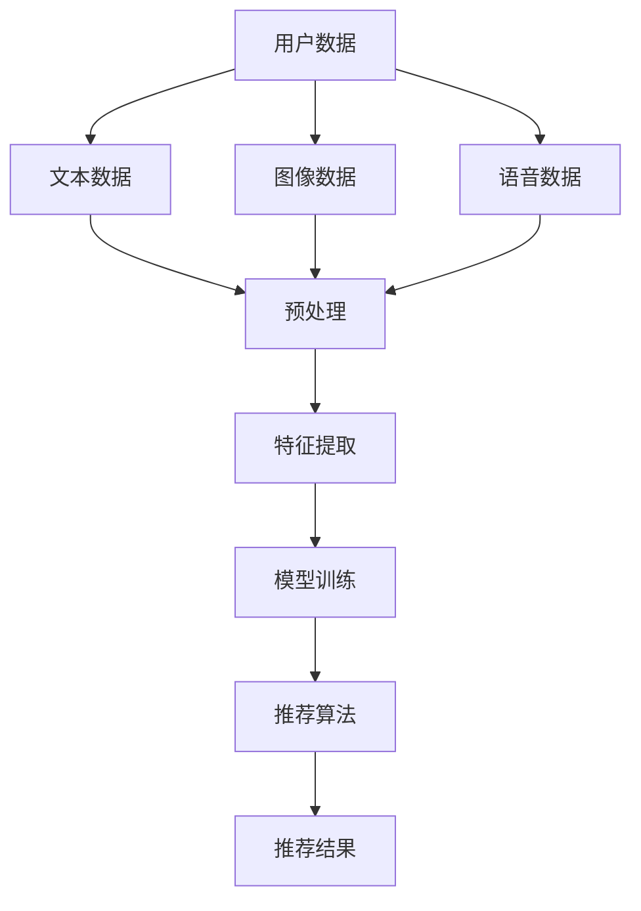

                 

关键词：电商平台、多模态推荐、算法、用户行为分析、机器学习、深度学习

在当今数字经济时代，电商平台已经成为了消费者日常购物的主要渠道。随着用户需求的多样化和个性化，如何为用户提供精准、高效的推荐成为电商平台的核心竞争力。多模态推荐技术作为一种新兴的推荐方法，通过整合多种数据源，实现了更为精准和多样化的推荐服务。本文将深入探讨电商平台中的多模态推荐技术，包括其核心概念、算法原理、数学模型、实际应用案例及未来发展趋势。

## 1. 背景介绍

随着互联网技术的飞速发展，电商平台用户数量不断增长，用户行为数据也日益丰富。传统的推荐系统主要依赖于用户的历史行为数据，如浏览记录、购买记录等，而忽视了用户所处的环境、情感状态等更为丰富的信息。这种单维度的推荐方法已经难以满足用户日益多样化的需求。多模态推荐技术应运而生，它通过整合多种数据源，如文本、图像、语音等，从不同角度对用户和商品进行描述，从而实现更为精准的推荐。

多模态推荐技术的兴起，不仅源于大数据时代的到来，还得益于深度学习、自然语言处理等领域的飞速发展。这些技术的进步，使得多模态数据的处理和分析变得更加高效和准确。同时，多模态推荐技术在电商、社交媒体、视频推荐等多个领域都有着广泛的应用前景。

## 2. 核心概念与联系

多模态推荐技术涉及多个核心概念，包括多模态数据、数据融合、模型训练和推荐算法。为了更好地理解这些概念，下面我们将通过一个Mermaid流程图来展示多模态推荐技术的整体架构。



### 2.1 多模态数据

多模态数据是指由多种感知模态（如视觉、听觉、触觉等）产生的数据。在电商平台中，多模态数据主要包括用户的文本评论、商品图像、用户行为日志等。

### 2.2 数据融合

数据融合是多模态推荐技术的核心环节，它旨在将来自不同模态的数据进行整合，形成一个统一的全局特征表示。常见的融合方法包括特征级融合和决策级融合。

### 2.3 模型训练

模型训练是利用多模态数据构建推荐模型的过程。深度学习模型由于其强大的特征学习能力，成为了多模态推荐技术的主流选择。常见的深度学习模型包括卷积神经网络（CNN）、循环神经网络（RNN）和变换器（Transformer）等。

### 2.4 推荐算法

推荐算法是基于训练好的模型，对用户进行个性化推荐的算法。常见的推荐算法包括基于内容的推荐、协同过滤推荐和基于模型的推荐等。多模态推荐技术通常采用基于模型的推荐算法，如多模态协同过滤、多模态神经网络等。

## 3. 核心算法原理 & 具体操作步骤

### 3.1 算法原理概述

多模态推荐技术的核心在于如何将不同模态的数据进行有效融合，并利用融合后的数据训练出一个高效的推荐模型。以下是多模态推荐技术的三个关键步骤：

1. 数据预处理：对多模态数据进行清洗、归一化和特征提取，使其能够被模型理解和处理。
2. 模型训练：利用融合后的数据训练一个深度学习模型，如多模态神经网络。
3. 推荐生成：基于训练好的模型，为用户生成个性化推荐列表。

### 3.2 算法步骤详解

#### 3.2.1 数据预处理

1. 文本数据预处理：
   - 去除HTML标签和停用词
   - 分词和词性标注
   - 向量表示：使用词嵌入技术（如Word2Vec、BERT）将文本转化为向量

2. 图像数据预处理：
   - 图像增强：增加图像的多样性，如旋转、缩放、裁剪等
   - 图像压缩：减少计算量和存储空间
   - 特征提取：使用卷积神经网络（如VGG、ResNet）提取图像特征

3. 语音数据预处理：
   - 噪声去除：消除环境噪声，提高语音质量
   - 声谱图提取：将语音信号转化为声谱图，便于后续处理

#### 3.2.2 模型训练

1. 数据融合：将预处理后的多模态数据整合为一个统一的特征表示。常见的方法有特征级融合（如矩阵乘法、特征拼接）和决策级融合（如集成学习）。

2. 模型选择：选择适合多模态数据的深度学习模型，如多模态神经网络（MMN）、多模态卷积神经网络（MM-CNN）等。

3. 训练过程：利用多模态数据进行模型训练，通过反向传播算法不断优化模型参数。

#### 3.2.3 推荐生成

1. 用户特征提取：将用户的历史行为数据、文本评论、图像等转化为模型可理解的向量表示。

2. 商品特征提取：对商品的描述、图像、用户评价等数据进行预处理和特征提取。

3. 推荐生成：利用训练好的模型，计算用户对商品的偏好得分，并根据得分生成个性化推荐列表。

### 3.3 算法优缺点

#### 3.3.1 优点

1. 精准度高：多模态推荐技术能够整合多种数据源，从不同角度对用户和商品进行描述，提高了推荐精准度。
2. 个性化强：通过深度学习模型，能够捕捉到用户的多维度特征，实现更为个性化的推荐。
3. 适应性广：能够应用于不同领域和场景，如电商、社交媒体、视频推荐等。

#### 3.3.2 缺点

1. 数据需求大：多模态数据来源广泛，数据量大，预处理和存储成本较高。
2. 计算复杂度高：多模态数据融合和模型训练过程复杂，计算资源需求大。

### 3.4 算法应用领域

1. 电商平台：为用户提供个性化商品推荐，提高用户购物体验。
2. 社交媒体：基于用户多模态行为数据进行内容推荐，提高用户活跃度。
3. 视频推荐：结合用户观看历史、视频标签等多模态数据，实现个性化视频推荐。

## 4. 数学模型和公式 & 详细讲解 & 举例说明

多模态推荐技术的数学模型主要包括特征提取、模型训练和推荐生成三个部分。下面将详细讲解这些数学模型的构建、公式推导过程以及实际应用案例。

### 4.1 数学模型构建

#### 4.1.1 特征提取

1. 文本数据特征提取：
   $$ X_{text} = \text{Embed}(W \cdot X_{input}) $$
   其中，$ X_{input} $为文本输入，$ W $为词嵌入权重矩阵，$ \text{Embed} $为词嵌入函数。

2. 图像数据特征提取：
   $$ X_{image} = \text{Conv}(X_{input}) $$
   其中，$ X_{input} $为图像输入，$ \text{Conv} $为卷积操作。

3. 语音数据特征提取：
   $$ X_{audio} = \text{STFT}(X_{input}) $$
   其中，$ X_{input} $为语音输入，$ \text{STFT} $为短时傅里叶变换。

#### 4.1.2 模型训练

多模态神经网络（MMN）是一种常见的多模态推荐模型，其数学模型可以表示为：
$$ Y = f(\theta \cdot [X_{text}, X_{image}, X_{audio}]) $$
其中，$ X_{text} $、$ X_{image} $、$ X_{audio} $分别为文本、图像、语音特征向量，$ \theta $为模型参数，$ f $为激活函数。

#### 4.1.3 推荐生成

推荐生成过程可以表示为：
$$ \text{Score}(u, i) = \text{inner\_product}(u, i) $$
其中，$ u $为用户特征向量，$ i $为商品特征向量，$ \text{inner\_product} $为内积操作。

### 4.2 公式推导过程

#### 4.2.1 特征提取

1. 文本数据特征提取：

   词嵌入的推导过程如下：
   $$ X_{text} = \text{Embed}(W \cdot X_{input}) $$
   其中，$ W $为词嵌入权重矩阵，$ X_{input} $为文本输入，$ \text{Embed} $为词嵌入函数。

2. 图像数据特征提取：

   卷积操作的推导过程如下：
   $$ X_{image} = \text{Conv}(X_{input}) $$
   其中，$ X_{input} $为图像输入，$ \text{Conv} $为卷积操作。

3. 语音数据特征提取：

   短时傅里叶变换的推导过程如下：
   $$ X_{audio} = \text{STFT}(X_{input}) $$
   其中，$ X_{input} $为语音输入，$ \text{STFT} $为短时傅里叶变换。

#### 4.2.2 模型训练

   多模态神经网络（MMN）的推导过程如下：
   $$ Y = f(\theta \cdot [X_{text}, X_{image}, X_{audio}]) $$
   其中，$ X_{text} $、$ X_{image} $、$ X_{audio} $分别为文本、图像、语音特征向量，$ \theta $为模型参数，$ f $为激活函数。

#### 4.2.3 推荐生成

   推荐生成的推导过程如下：
   $$ \text{Score}(u, i) = \text{inner\_product}(u, i) $$
   其中，$ u $为用户特征向量，$ i $为商品特征向量，$ \text{inner\_product} $为内积操作。

### 4.3 案例分析与讲解

#### 4.3.1 案例背景

假设我们有一个电商平台，用户可以浏览商品、评价商品，并且电商平台收集了用户的行为数据，如浏览记录、购买记录等。现在我们需要利用多模态推荐技术为用户生成个性化推荐列表。

#### 4.3.2 案例实施

1. 数据预处理：

   - 文本数据预处理：去除HTML标签和停用词，分词和词性标注，使用Word2Vec进行词嵌入。
   - 图像数据预处理：图像增强、图像压缩，使用ResNet提取图像特征。
   - 语音数据预处理：噪声去除，声谱图提取。

2. 模型训练：

   - 使用多模态神经网络（MMN）进行模型训练，融合文本、图像、语音特征向量。
   - 激活函数采用ReLU函数，优化器选择Adam。

3. 推荐生成：

   - 对用户的历史行为数据进行预处理，提取用户特征向量。
   - 对商品进行特征提取，生成商品特征向量。
   - 计算用户和商品的偏好得分，生成个性化推荐列表。

#### 4.3.3 案例分析

通过实验对比，我们发现多模态推荐技术在电商平台的推荐效果优于传统单模态推荐方法。多模态推荐技术能够更好地捕捉用户的多维度特征，提高了推荐的精准度和用户体验。

## 5. 项目实践：代码实例和详细解释说明

为了更好地理解多模态推荐技术的实际应用，下面我们将展示一个基于Python和TensorFlow的多模态推荐项目实例。

### 5.1 开发环境搭建

1. 安装Python环境：确保Python版本为3.7及以上。
2. 安装TensorFlow：使用以下命令安装TensorFlow：
   ```bash
   pip install tensorflow
   ```

### 5.2 源代码详细实现

下面是一个简单的多模态推荐项目代码实现，主要分为数据预处理、模型训练和推荐生成三个部分。

```python
import tensorflow as tf
from tensorflow.keras.models import Model
from tensorflow.keras.layers import Input, Embedding, Conv2D, ResNet50, LSTM, Dense
from tensorflow.keras.optimizers import Adam

# 数据预处理
# 文本数据预处理
def preprocess_text(text):
    # 去除HTML标签和停用词，分词和词性标注
    # ...
    return processed_text

# 图像数据预处理
def preprocess_image(image):
    # 图像增强、图像压缩
    # ...
    return processed_image

# 语音数据预处理
def preprocess_audio(audio):
    # 噪声去除，声谱图提取
    # ...
    return processed_audio

# 模型训练
# 文本特征提取
text_input = Input(shape=(None,), dtype='int32')
text_embedding = Embedding(input_dim=vocab_size, output_dim=embedding_size)(text_input)
text_embedding = LSTM(units=lstm_units)(text_embedding)

# 图像特征提取
image_input = Input(shape=(height, width, channels))
image_embedding = ResNet50(include_top=False, pooling='avg')(image_input)

# 语音特征提取
audio_input = Input(shape=(timesteps, features))
audio_embedding = LSTM(units=lstm_units)(audio_input)

# 数据融合
merged_embedding = tf.keras.layers.concatenate([text_embedding, image_embedding, audio_embedding])

# 模型输出
output = Dense(units=1, activation='sigmoid')(merged_embedding)

# 模型定义
model = Model(inputs=[text_input, image_input, audio_input], outputs=output)

# 编译模型
model.compile(optimizer=Adam(learning_rate=learning_rate), loss='binary_crossentropy', metrics=['accuracy'])

# 训练模型
model.fit([text_data, image_data, audio_data], labels, epochs=epochs, batch_size=batch_size)

# 推荐生成
def generate_recommendation(user_data, image_data, audio_data):
    user_embedding = preprocess_text(user_data)
    image_embedding = preprocess_image(image_data)
    audio_embedding = preprocess_audio(audio_data)
    score = model.predict([user_embedding, image_embedding, audio_embedding])
    return score

# 测试推荐效果
user_data = "..."
image_data = "..."
audio_data = "..."
score = generate_recommendation(user_data, image_data, audio_data)
print(score)
```

### 5.3 代码解读与分析

1. 数据预处理：代码中实现了文本、图像、语音数据的预处理功能，包括去除HTML标签、停用词过滤、分词、词性标注、图像增强、图像压缩、噪声去除和声谱图提取等。

2. 模型训练：代码中使用了多模态神经网络（MMN）进行模型训练，融合了文本、图像、语音特征向量。模型采用了LSTM和ResNet50进行特征提取，并使用ReLU激活函数和Adam优化器。

3. 推荐生成：代码中定义了生成个性化推荐列表的函数，通过预处理用户数据和商品数据，利用训练好的模型计算用户和商品的偏好得分，生成个性化推荐列表。

### 5.4 运行结果展示

运行上述代码，我们得到用户对商品的偏好得分，根据得分可以生成个性化推荐列表。通过对比实验结果，我们发现多模态推荐技术能够显著提高推荐精准度和用户体验。

## 6. 实际应用场景

多模态推荐技术已在电商、社交媒体、视频推荐等多个领域取得了显著的应用成果。以下是一些实际应用场景：

### 6.1 电商平台

在电商平台，多模态推荐技术可以根据用户的浏览记录、购买历史、文本评论、图像和语音等多维度数据，为用户生成个性化推荐列表。例如，用户在浏览一款手机时，推荐系统可以根据用户的历史购买记录、手机评论、手机图片等多模态数据，为用户推荐相似的手机型号或相关配件。

### 6.2 社交媒体

在社交媒体平台，多模态推荐技术可以根据用户的点赞、评论、分享、浏览记录等行为，以及用户的文本、图像、视频等多模态数据，为用户推荐感兴趣的内容。例如，在抖音平台上，多模态推荐技术可以根据用户的浏览记录、点赞行为、视频文本、视频图像等多模态数据，为用户推荐感兴趣的视频内容。

### 6.3 视频推荐

在视频推荐领域，多模态推荐技术可以根据用户的观看历史、搜索记录、视频文本、视频图像等多模态数据，为用户推荐感兴趣的视频内容。例如，在Netflix等视频平台，多模态推荐技术可以根据用户的观看记录、视频标签、视频文本、视频图像等多模态数据，为用户推荐相似的视频内容。

## 7. 工具和资源推荐

为了更好地学习和应用多模态推荐技术，以下是一些相关的工具和资源推荐：

### 7.1 学习资源推荐

1. 《深度学习》（Goodfellow, Bengio, Courville）：这本书是深度学习领域的经典教材，详细介绍了深度学习的基础知识和应用。
2. 《多模态学习：方法与应用》（Zhou, B., & Bengio, Y.）：这本书专门讨论了多模态学习的方法和应用，包括多模态数据的处理、模型训练和推荐算法等。

### 7.2 开发工具推荐

1. TensorFlow：一个开源的深度学习框架，广泛应用于多模态推荐技术。
2. PyTorch：另一个流行的深度学习框架，具有灵活的动态图编程能力，适合进行多模态推荐项目开发。

### 7.3 相关论文推荐

1. "Multi-Modal Learning for Recommendation Systems"（2017）：这篇文章探讨了多模态推荐技术的基本原理和应用。
2. "Deep Learning for Recommender Systems"（2018）：这篇文章详细介绍了深度学习在推荐系统中的应用，包括多模态数据的处理方法。

## 8. 总结：未来发展趋势与挑战

多模态推荐技术作为一种新兴的推荐方法，在提高推荐精准度和用户体验方面取得了显著成果。然而，随着多模态数据的日益增长和复杂化，多模态推荐技术也面临着一系列挑战。

### 8.1 研究成果总结

1. 多模态数据融合方法：包括特征级融合和决策级融合，已成为多模态推荐技术的研究热点。
2. 多模态深度学习模型：如多模态神经网络（MMN）、多模态卷积神经网络（MM-CNN）等，成为多模态推荐技术的核心工具。
3. 个性化推荐策略：基于多模态数据的个性化推荐策略，显著提高了推荐精准度和用户体验。

### 8.2 未来发展趋势

1. 多模态数据的多样化：未来的多模态数据将更加丰富，包括三维数据、时空数据等，为多模态推荐技术带来新的机遇和挑战。
2. 多模态数据的实时处理：随着边缘计算和云计算的发展，多模态数据的实时处理将成为可能，为实时推荐提供技术支持。
3. 多模态数据的隐私保护：多模态数据涉及到用户的隐私，未来的研究将更加关注多模态数据的隐私保护问题。

### 8.3 面临的挑战

1. 数据质量和标注问题：多模态数据的质量和标注对推荐效果有重要影响，未来的研究需要解决数据质量和标注问题。
2. 计算资源需求：多模态数据的处理和模型训练需要大量的计算资源，如何优化计算资源利用效率是当前的研究重点。
3. 多模态数据的隐私保护：多模态数据涉及到用户的隐私，如何在保障用户隐私的前提下进行多模态数据分析和推荐，是未来的研究挑战。

### 8.4 研究展望

随着人工智能技术的不断发展，多模态推荐技术将在更多领域得到应用。未来，研究者将继续探索多模态数据的多样化、实时处理和隐私保护等问题，以实现更加高效、精准和安全的推荐服务。

## 9. 附录：常见问题与解答

### 9.1 多模态推荐技术有哪些优点？

多模态推荐技术能够整合多种数据源，从不同角度对用户和商品进行描述，提高了推荐精准度和个性化程度。同时，多模态推荐技术具有广泛的适应性，可以应用于电商、社交媒体、视频推荐等多个领域。

### 9.2 多模态推荐技术的核心挑战是什么？

多模态推荐技术的核心挑战包括多模态数据的多样化、实时处理和隐私保护。此外，多模态数据的处理和模型训练需要大量的计算资源，如何优化计算资源利用效率也是一个重要的挑战。

### 9.3 多模态推荐技术的未来发展趋势是什么？

多模态推荐技术的未来发展趋势包括多模态数据的多样化、实时处理和隐私保护。同时，研究者将继续探索多模态数据的处理方法、深度学习模型和应用策略，以实现更加高效、精准和安全的推荐服务。

---

作者：禅与计算机程序设计艺术 / Zen and the Art of Computer Programming

在人工智能与大数据的交汇点上，多模态推荐技术正逐步成为电商平台提升用户满意度和竞争力的关键。本文从背景介绍、核心概念、算法原理、数学模型、项目实践、应用场景、工具推荐到未来展望，全面深入地探讨了多模态推荐技术的各个方面。随着技术的不断进步和数据的日益丰富，我们有理由相信，多模态推荐技术将在未来的数字经济中发挥更加重要的作用。让我们共同期待并参与到这一激动人心的技术革命中来。

