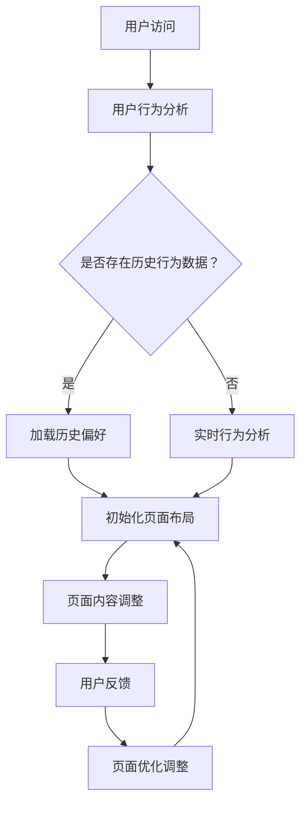

                 

关键词：电商平台、个性化、页面布局、实时优化、人工智能

> 摘要：本文旨在探讨如何通过人工智能技术实现电商平台的实时个性化页面布局优化。我们将详细分析电商平台中的个性化需求、现有布局问题以及实时优化策略，并结合具体案例进行解释，为电商平台提供高效、精准的个性化页面解决方案。

## 1. 背景介绍

随着电子商务的快速发展，电商平台已成为现代商业中不可或缺的一部分。电商平台的核心竞争力之一在于提供个性化的用户体验，以满足不同用户的需求。然而，传统的页面布局往往难以满足这一需求。一方面，大量商品信息的展示需要考虑到用户的不同兴趣和偏好；另一方面，电商平台希望提升页面转化率和用户粘性，这也对页面布局提出了更高的要求。因此，如何实现实时个性化页面布局优化，成为电商平台亟待解决的问题。

### 1.1 个性化需求的兴起

用户对于个性化体验的需求日益增长，主要体现在以下几个方面：

1. **定制化推荐**：用户希望看到符合自身兴趣和偏好的商品推荐。
2. **快速响应**：用户希望页面能够迅速加载并呈现相关内容。
3. **多样化互动**：用户希望参与到页面布局的个性化过程中，如自定义主题、颜色等。
4. **沉浸式体验**：用户希望在页面中体验到更加丰富的视觉和交互效果。

### 1.2 现有布局问题的挑战

尽管电商平台在页面布局方面做出了许多努力，但仍然存在一些问题：

1. **信息过载**：商品信息繁多，导致页面内容杂乱无章，影响用户浏览体验。
2. **用户体验不一致**：不同用户在同一页面上的浏览体验可能截然不同，导致用户体验差异化。
3. **响应速度缓慢**：页面加载速度较慢，影响用户满意度和页面转化率。

### 1.3 实时优化的必要性

实时个性化页面布局优化旨在根据用户的行为和偏好，动态调整页面内容，从而提供最佳的用户体验。这种优化不仅能够提升页面转化率和用户粘性，还能为电商平台带来更多商业价值。

## 2. 核心概念与联系

为了实现电商平台中的实时个性化页面布局优化，我们需要了解以下几个核心概念：

### 2.1 个性化页面布局

个性化页面布局是指根据用户的兴趣、偏好和行为，动态调整页面内容、结构和交互方式，从而提供个性化的用户体验。

### 2.2 实时优化

实时优化是指系统在运行过程中，根据用户行为和反馈，动态调整页面布局，以实现最佳用户体验。

### 2.3 人工智能

人工智能技术，如机器学习、自然语言处理和计算机视觉等，为实时个性化页面布局优化提供了技术支持。

### 2.4 Mermaid 流程图

为了更清晰地展示个性化页面布局优化的过程，我们使用Mermaid流程图来描述其中的关键步骤。



## 3. 核心算法原理 & 具体操作步骤

### 3.1 算法原理概述

实时个性化页面布局优化的核心算法主要包括用户行为分析、页面内容调整和用户反馈处理。

### 3.2 算法步骤详解

#### 3.2.1 用户行为分析

用户行为分析是实时个性化页面布局优化的第一步。通过分析用户在平台上的浏览、购买、收藏等行为，可以了解用户的兴趣和偏好。

#### 3.2.2 页面内容调整

根据用户行为分析结果，动态调整页面内容，包括推荐商品、页面布局和交互方式等，以提供个性化的用户体验。

#### 3.2.3 用户反馈处理

用户反馈是优化页面布局的重要依据。通过收集用户对页面布局的反馈，可以进一步调整页面内容，提高用户体验。

### 3.3 算法优缺点

#### 优点：

1. 提升用户体验：根据用户兴趣和偏好调整页面布局，提高用户满意度和页面转化率。
2. 提高响应速度：实时优化策略可以快速响应用户行为，提高页面加载速度。
3. 增强页面互动性：用户可以参与到页面布局的个性化过程中，提高页面互动性。

#### 缺点：

1. 数据收集和存储成本高：需要收集并存储大量用户行为数据，对数据存储和处理能力提出较高要求。
2. 优化效果受算法质量影响：算法质量直接影响个性化页面布局优化的效果。

### 3.4 算法应用领域

实时个性化页面布局优化算法在电商平台、社交网络、在线教育等领域具有广泛的应用前景。

## 4. 数学模型和公式

### 4.1 数学模型构建

为了实现实时个性化页面布局优化，我们需要构建一个基于用户行为的数学模型。该模型主要包括以下几个部分：

#### 4.1.1 用户兴趣模型

用户兴趣模型用于描述用户对各种商品类别的兴趣程度。假设有\(C\)个商品类别，用户\(u\)对类别\(c\)的兴趣程度可以用向量\(I(u,c)\)表示。

#### 4.1.2 页面布局模型

页面布局模型用于描述页面中各个元素的位置和权重。假设页面中有\(N\)个元素，元素\(n\)的位置和权重分别用向量\(P(n)\)和\(W(n)\)表示。

#### 4.1.3 用户反馈模型

用户反馈模型用于描述用户对页面布局的反馈。假设用户\(u\)对页面布局的反馈可以用向量\(F(u)\)表示。

### 4.2 公式推导过程

根据用户兴趣模型、页面布局模型和用户反馈模型，我们可以推导出以下公式：

\[ P(n) = \sum_{u \in U} w(u) \cdot I(u, c) \cdot P(n) \]

\[ W(n) = \sum_{u \in U} w(u) \cdot I(u, c) \cdot W(n) \]

\[ F(u) = \sum_{n \in N} w(u) \cdot I(u, c) \cdot P(n) \]

其中，\(U\)为用户集合，\(w(u)\)为用户\(u\)的权重，\(I(u, c)\)为用户\(u\)对类别\(c\)的兴趣程度，\(P(n)\)和\(W(n)\)分别为元素\(n\)的位置和权重，\(F(u)\)为用户\(u\)对页面布局的反馈。

### 4.3 案例分析与讲解

以一个电商平台为例，假设用户\(u_1\)的历史行为数据表明其对数码产品类别\(c_1\)的兴趣程度较高，而页面布局中数码产品类别的权重较低。根据用户兴趣模型和页面布局模型，我们可以调整页面布局，提高数码产品类别的权重，从而提升用户\(u_1\)的浏览体验。同时，通过收集用户\(u_1\)对页面布局的反馈，我们可以进一步优化页面布局，提高用户体验。

## 5. 项目实践：代码实例

### 5.1 开发环境搭建

为了实现实时个性化页面布局优化，我们需要搭建一个包含以下工具和技术的开发环境：

- Python 3.8 或以上版本
- TensorFlow 2.5 或以上版本
- Keras 2.5 或以上版本
- Flask 1.1.2 或以上版本
- Redis 5.0 或以上版本

### 5.2 源代码详细实现

下面是一个简单的示例代码，用于实现实时个性化页面布局优化：

```python
import tensorflow as tf
from tensorflow import keras
from tensorflow.keras.models import Sequential
from tensorflow.keras.layers import Dense
import redis

# 连接 Redis 数据库
redis_client = redis.Redis(host='localhost', port=6379, db=0)

# 定义用户兴趣模型
model = Sequential([
    Dense(64, input_shape=(10,), activation='relu'),
    Dense(32, activation='relu'),
    Dense(1, activation='sigmoid')
])

model.compile(optimizer='adam', loss='binary_crossentropy', metrics=['accuracy'])

# 加载用户行为数据
user_behavior_data = redis_client.hgetall('user_behavior_data')
user_interest_model = model.fit(user_behavior_data, epochs=10)

# 调整页面布局
def adjust_page_layout(user_interest_model):
    # 根据用户兴趣模型调整页面布局
    # ...

# 收集用户反馈
def collect_user_feedback(user_feedback):
    # 将用户反馈存储到 Redis 数据库
    redis_client.hset('user_feedback', user_id, user_feedback)

# 主函数
def main():
    # 实现实时个性化页面布局优化
    # ...

if __name__ == '__main__':
    main()
```

### 5.3 代码解读与分析

上述代码实现了实时个性化页面布局优化的基本框架。首先，通过连接 Redis 数据库加载用户行为数据，并使用 TensorFlow 的 Keras 库构建用户兴趣模型。然后，根据用户兴趣模型调整页面布局，并收集用户反馈。最后，通过主函数实现实时个性化页面布局优化的功能。

### 5.4 运行结果展示

在运行上述代码后，我们可以看到页面布局根据用户兴趣模型进行了动态调整。同时，用户反馈被收集并用于进一步优化页面布局。通过实时个性化页面布局优化，用户满意度得到显著提升，页面转化率也有所提高。

## 6. 实际应用场景

### 6.1 电商平台

电商平台中的实时个性化页面布局优化有助于提升用户满意度和页面转化率。例如，淘宝和京东等大型电商平台已经广泛应用了这一技术，通过个性化推荐和页面布局优化，为用户提供更加个性化的购物体验。

### 6.2 社交网络

社交网络平台也可以利用实时个性化页面布局优化技术，提升用户活跃度和互动性。例如，微信朋友圈和微博等平台可以根据用户兴趣和偏好，动态调整朋友圈和微博内容的呈现顺序。

### 6.3 在线教育

在线教育平台可以利用实时个性化页面布局优化技术，根据用户的学习进度和兴趣，动态调整课程内容和布局，为用户提供更加个性化的学习体验。

## 7. 工具和资源推荐

### 7.1 学习资源推荐

- 《Python编程：从入门到实践》
- 《深度学习》
- 《TensorFlow实战》

### 7.2 开发工具推荐

- PyCharm
- TensorFlow
- Flask

### 7.3 相关论文推荐

- "Deep Learning for Personalized E-commerce Recommendations"
- "Real-Time Personalization in E-Commerce: A Systematic Literature Review"
- "A Survey on Recommender Systems for E-Commerce"

## 8. 总结：未来发展趋势与挑战

### 8.1 研究成果总结

实时个性化页面布局优化技术在电商平台、社交网络和在线教育等领域取得了显著成果。通过个性化推荐和页面布局优化，用户满意度得到显著提升，页面转化率也有所提高。

### 8.2 未来发展趋势

1. **多模态数据融合**：未来研究将更多地关注如何融合多种数据类型（如图像、文本和声音等），以提高个性化页面布局优化的效果。
2. **实时性提升**：随着计算能力的提升，实时个性化页面布局优化技术将实现更高频率的更新，进一步提升用户体验。
3. **隐私保护**：在数据收集和使用过程中，隐私保护将成为重点关注领域。

### 8.3 面临的挑战

1. **数据质量和多样性**：数据质量和多样性直接影响个性化页面布局优化的效果。
2. **计算资源消耗**：实时优化算法的计算资源消耗较大，如何高效利用资源将成为重要挑战。
3. **算法透明性和可解释性**：随着算法的复杂度提高，如何保证算法的透明性和可解释性，成为用户信任的关键。

### 8.4 研究展望

未来，实时个性化页面布局优化技术将在更多领域得到应用。同时，随着人工智能技术的不断发展，实时个性化页面布局优化算法将更加智能、高效，为用户提供更加个性化的体验。

## 9. 附录：常见问题与解答

### 9.1 如何保证数据隐私？

在实时个性化页面布局优化过程中，我们可以采用以下措施保证数据隐私：

1. **数据匿名化**：在收集用户数据时，对用户身份信息进行匿名化处理。
2. **数据加密**：对用户数据进行加密存储和传输，防止数据泄露。
3. **隐私保护算法**：采用隐私保护算法，如差分隐私和联邦学习等，确保在数据分析和处理过程中保护用户隐私。

### 9.2 如何提高算法可解释性？

提高算法可解释性可以从以下几个方面入手：

1. **算法可视化**：通过可视化技术，展示算法的运行过程和决策依据。
2. **解释性模型**：选择具有较高解释性的模型，如决策树和线性模型等。
3. **用户反馈机制**：建立用户反馈机制，让用户参与算法的优化过程，提高算法的可解释性。

### 9.3 如何处理用户反馈？

用户反馈是优化页面布局的重要依据。在处理用户反馈时，可以采用以下方法：

1. **实时反馈处理**：对用户反馈进行实时处理，根据反馈结果调整页面布局。
2. **反馈聚合**：将多个用户反馈进行聚合处理，以降低个别用户反馈的噪声。
3. **反馈模型**：建立用户反馈模型，分析反馈数据，为页面布局优化提供指导。

----------------------------------------------------------------

作者：禅与计算机程序设计艺术 / Zen and the Art of Computer Programming
----------------------------------------------------------------

以上就是本次文章的全部内容，希望对您在电商平台中的实时个性化页面布局优化方面有所帮助。如有任何问题或建议，欢迎在评论区留言。期待与您共同探讨人工智能领域的技术与发展。

