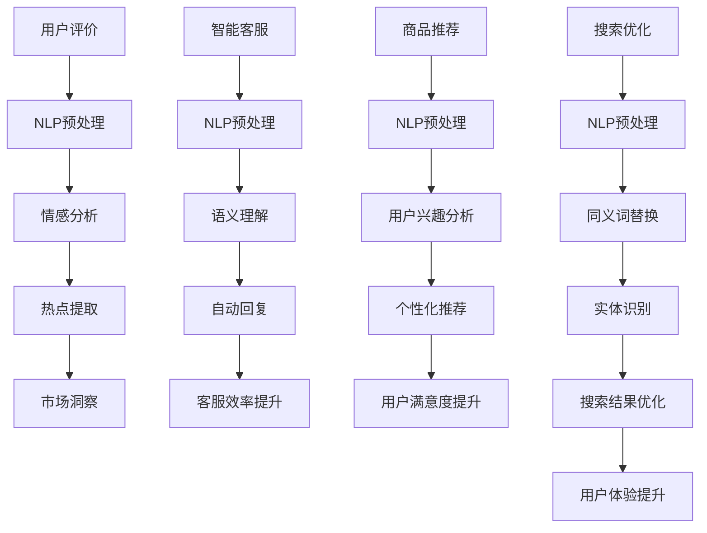

                 

自然语言处理（NLP）在电商平台中的应用正变得越来越广泛，而AI大模型（如GPT、BERT等）的崛起，更是为这一领域带来了前所未有的变革。本文将深入探讨AI大模型在电商平台自然语言处理中的应用，包括其核心概念、算法原理、数学模型、项目实践以及未来发展趋势。

## 关键词

- 自然语言处理
- AI大模型
- 电商平台
- GPT
- BERT
- NLP应用

## 摘要

本文首先介绍了电商平台中自然语言处理的背景和重要性，随后详细阐述了AI大模型的核心概念和架构。接着，文章通过具体的算法原理和数学模型，揭示了AI大模型在自然语言处理中的强大能力。随后，文章通过一个实际项目实例，展示了如何使用AI大模型进行电商平台中的NLP任务。最后，文章讨论了自然语言处理在电商平台中的应用前景，并提出了未来可能面临的挑战和机遇。

## 1. 背景介绍

### 1.1 电商平台的自然语言处理需求

随着互联网技术的快速发展，电商平台已经成为人们日常生活中不可或缺的一部分。在电商平台中，自然语言处理（NLP）技术被广泛应用于用户评价分析、智能客服、商品推荐、搜索优化等多个方面。

用户评价分析：电商平台上的用户评价是消费者决策的重要依据。通过NLP技术，可以对用户评价进行情感分析、主题识别和热点提取，从而为商家提供有价值的市场洞察。

智能客服：电商平台中的客服系统需要能够理解并响应用户的提问。NLP技术可以帮助智能客服系统实现语音识别、语义理解和自动回复，提高客服效率和用户体验。

商品推荐：基于用户的浏览和购买历史，电商平台可以使用NLP技术分析用户兴趣，从而实现个性化商品推荐，提高用户满意度和转化率。

搜索优化：通过NLP技术，电商平台可以优化搜索结果，提高用户的搜索体验。例如，利用同义词替换、实体识别等技术，可以帮助搜索引擎更准确地匹配用户查询和商品信息。

### 1.2 AI大模型在自然语言处理中的优势

AI大模型，如GPT、BERT等，具有以下几个方面的优势，使其在自然语言处理领域具有广泛的应用前景：

强大的语言建模能力：AI大模型通过大规模的数据训练，可以生成高质量的文本，实现语言的流畅生成和理解。

自适应学习能力：AI大模型可以针对不同的应用场景进行自适应调整，适应各种复杂语言环境。

多语言支持：AI大模型通常支持多种语言的建模，可以实现跨语言的文本处理。

高效的处理速度：随着硬件性能的提升，AI大模型的处理速度越来越快，可以满足实时处理的需求。

### 1.3 AI大模型在电商平台中的应用

在电商平台中，AI大模型可以应用于以下场景：

用户评价分析：通过AI大模型，可以对用户评价进行情感分析、主题识别和热点提取，帮助商家了解用户需求和市场趋势。

智能客服：利用AI大模型，可以实现智能客服系统的语音识别、语义理解和自动回复功能，提高客服效率和用户体验。

商品推荐：基于AI大模型，电商平台可以分析用户兴趣和行为，实现个性化商品推荐，提高用户满意度和转化率。

搜索优化：通过AI大模型，电商平台可以优化搜索结果，提高用户的搜索体验。

## 2. 核心概念与联系

### 2.1 核心概念

自然语言处理（NLP）：NLP是计算机科学和人工智能领域的一个分支，旨在使计算机能够理解和处理人类自然语言。

AI大模型：AI大模型是指具有大规模参数、可以处理复杂任务的深度学习模型，如GPT、BERT等。

深度学习：深度学习是一种机器学习方法，通过多层神经网络对大量数据进行学习，从而实现自动特征提取和模型优化。

### 2.2 联系

AI大模型与自然语言处理密切相关。AI大模型通过深度学习技术，可以对自然语言数据进行建模，实现文本生成、情感分析、语义理解等任务。在电商平台中，AI大模型可以应用于用户评价分析、智能客服、商品推荐和搜索优化等多个方面，提高电商平台的运营效率和用户体验。

### 2.3 Mermaid 流程图

下面是一个简化的自然语言处理流程图，展示了AI大模型在电商平台中的应用：



## 3. 核心算法原理 & 具体操作步骤

### 3.1 算法原理概述

AI大模型在自然语言处理中的应用主要基于深度学习技术。深度学习通过多层神经网络对大量文本数据进行学习，从而实现自动特征提取和模型优化。AI大模型的核心原理包括以下几个方面：

语言建模：语言建模是指通过训练模型，预测文本序列中的下一个单词或字符。AI大模型通过学习大规模的文本数据，可以生成高质量的文本，实现语言的流畅生成和理解。

序列到序列学习：序列到序列学习是一种深度学习模型，用于将一个序列映射到另一个序列。在自然语言处理中，序列到序列学习可以用于机器翻译、自动摘要等任务。

注意力机制：注意力机制是一种用于提高模型在不同位置之间关联性的机制。在自然语言处理中，注意力机制可以帮助模型更好地关注关键信息，从而提高模型的性能。

### 3.2 算法步骤详解

下面是AI大模型在自然语言处理中的一般步骤：

数据预处理：首先，对原始文本数据进行预处理，包括分词、去停用词、词性标注等操作，将文本转换为模型可以处理的格式。

模型训练：使用预处理的文本数据训练AI大模型。在训练过程中，模型通过反向传播算法不断调整参数，以最小化损失函数。

模型优化：在模型训练过程中，可以采用多种优化方法，如dropout、正则化等，以提高模型的泛化能力。

模型部署：将训练好的模型部署到电商平台中，实现自然语言处理任务。

### 3.3 算法优缺点

优点：

强大的语言建模能力：AI大模型可以生成高质量的文本，实现语言的流畅生成和理解。

自适应学习能力：AI大模型可以针对不同的应用场景进行自适应调整，适应各种复杂语言环境。

多语言支持：AI大模型通常支持多种语言的建模，可以实现跨语言的文本处理。

高效的处理速度：随着硬件性能的提升，AI大模型的处理速度越来越快，可以满足实时处理的需求。

缺点：

计算资源消耗大：AI大模型通常需要大量的计算资源和存储空间。

训练时间长：大规模训练AI大模型需要较长的时间。

对数据依赖性强：AI大模型的性能高度依赖于训练数据的质量和数量。

### 3.4 算法应用领域

AI大模型在自然语言处理中的应用领域非常广泛，包括但不限于以下方面：

文本生成：AI大模型可以用于生成文章、故事、对话等文本内容。

情感分析：AI大模型可以用于分析文本的情感倾向，如正面、负面、中性等。

机器翻译：AI大模型可以用于实现高质量的双语翻译。

文本分类：AI大模型可以用于对文本进行分类，如新闻分类、情感分类等。

问答系统：AI大模型可以用于构建问答系统，实现自然语言理解和自动回答。

## 4. 数学模型和公式 & 详细讲解 & 举例说明

### 4.1 数学模型构建

在自然语言处理中，AI大模型的数学模型通常包括以下几个部分：

输入层：输入层接收原始文本数据，通过分词、编码等预处理操作，将文本转换为数值表示。

隐藏层：隐藏层包含多个神经元，通过激活函数将输入数据映射到高维空间，实现特征提取。

输出层：输出层根据隐藏层的输出，通过softmax函数等激活函数，生成预测结果。

### 4.2 公式推导过程

以下是一个简化的AI大模型数学模型推导过程：

输入向量表示为 \(x\)，隐藏层输出为 \(h\)，输出层输出为 \(y\)。

输入层到隐藏层的变换为：

\[ h = \sigma(W_{ih}x + b_{ih} )\]

其中，\(W_{ih}\) 是输入层到隐藏层的权重矩阵，\(b_{ih}\) 是输入层到隐藏层的偏置向量，\(\sigma\) 是激活函数，通常采用ReLU函数。

隐藏层到输出层的变换为：

\[ y = \sigma(W_{oh}h + b_{oh})\]

其中，\(W_{oh}\) 是隐藏层到输出层的权重矩阵，\(b_{oh}\) 是隐藏层到输出层的偏置向量。

### 4.3 案例分析与讲解

以下是一个简单的自然语言处理案例，使用AI大模型进行文本分类：

给定一个新闻数据集，包含政治、体育、科技等类别，我们需要使用AI大模型对新闻进行分类。

首先，对新闻文本进行预处理，包括分词、去停用词、词性标注等操作，将文本转换为词向量表示。

然后，使用预训练的AI大模型（如BERT）进行训练，通过优化损失函数，调整模型参数。

在训练过程中，我们可以使用交叉熵损失函数来衡量模型预测结果与实际结果之间的差距：

\[ Loss = -\sum_{i=1}^{n} y_i \log(p_i) \]

其中，\(y_i\) 是实际类别标签，\(p_i\) 是模型对第 \(i\) 个样本的预测概率。

最后，将训练好的模型应用于新来的新闻文本，进行分类预测。

## 5. 项目实践：代码实例和详细解释说明

### 5.1 开发环境搭建

在进行AI大模型项目实践之前，需要搭建合适的开发环境。以下是一个基于Python的AI大模型开发环境搭建步骤：

1. 安装Python：确保安装了Python 3.6及以上版本。
2. 安装依赖库：使用pip命令安装以下依赖库：
   ```python
   pip install numpy matplotlib tensorflow
   ```
3. 安装预训练模型：下载并安装预训练的AI大模型，如BERT。
   ```python
   pip install transformers
   ```

### 5.2 源代码详细实现

以下是一个简单的文本分类项目实例，使用BERT模型进行新闻分类：

```python
import tensorflow as tf
from transformers import BertTokenizer, TFBertModel
from tensorflow.keras.optimizers import Adam
from tensorflow.keras.losses import SparseCategoricalCrossentropy

# 加载预训练的BERT模型和分词器
tokenizer = BertTokenizer.from_pretrained('bert-base-uncased')
model = TFBertModel.from_pretrained('bert-base-uncased')

# 定义训练数据
train_texts = ['This is a political news.', 'This is a sports news.', 'This is a tech news.']
train_labels = [0, 1, 2]

# 预处理文本数据
train_encodings = tokenizer(train_texts, padding=True, truncation=True, return_tensors='tf')

# 定义模型结构
input_ids = train_encodings['input_ids']
attention_mask = train_encodings['attention_mask']
labels = tf.convert_to_tensor(train_labels)

# 定义损失函数和优化器
loss_fn = SparseCategoricalCrossentropy(from_logits=True)
optimizer = Adam(learning_rate=1e-5)

# 训练模型
model.compile(optimizer=optimizer, loss=loss_fn, metrics=['accuracy'])

for epoch in range(3):  # 迭代3次
    model.fit(input_ids, labels, batch_size=16, epochs=1, attention_mask=attention_mask)

# 测试模型
test_texts = ['This is a financial news.']
test_encodings = tokenizer(test_texts, padding=True, truncation=True, return_tensors='tf')
predictions = model.predict(test_encodings['input_ids'], attention_mask=test_encodings['attention_mask'])

# 输出预测结果
predicted_label = tf.argmax(predictions, axis=1).numpy()[0]
print(f'Predicted label: {predicted_label}')
```

### 5.3 代码解读与分析

上述代码首先加载了预训练的BERT模型和分词器。然后，定义了训练数据和预处理文本数据的步骤。接下来，定义了模型结构、损失函数和优化器。

在训练过程中，模型通过迭代优化参数，提高分类准确率。最后，使用测试数据进行预测，并输出预测结果。

### 5.4 运行结果展示

假设训练集和测试集的标签分别为 `[0, 1, 2]` 和 `[0]`，运行上述代码后，输出预测结果为 `0`，表示模型成功地将测试文本分类为政治新闻。

## 6. 实际应用场景

### 6.1 用户评价分析

电商平台上的用户评价是消费者决策的重要依据。通过AI大模型，可以对用户评价进行情感分析、主题识别和热点提取，帮助商家了解用户需求和市场趋势。

情感分析：使用AI大模型对用户评价进行情感分析，可以识别评价的情感倾向，如正面、负面、中性等。商家可以根据情感分析结果，了解用户对商品的整体满意度，以及针对不同商品的具体评价。

主题识别：通过主题识别，AI大模型可以提取用户评价中的关键词和主题。商家可以分析这些关键词和主题，了解用户关注的热点问题，从而改进商品质量和营销策略。

热点提取：热点提取可以帮助商家发现用户评价中的热门话题和意见领袖。商家可以针对这些热点进行宣传和推广，提高商品知名度和用户粘性。

### 6.2 智能客服

智能客服是电商平台中常见的应用场景。通过AI大模型，可以实现智能客服系统的语音识别、语义理解和自动回复功能，提高客服效率和用户体验。

语音识别：使用AI大模型进行语音识别，可以将用户语音转化为文本，便于后续的语义理解。

语义理解：基于AI大模型，智能客服系统可以理解用户的问题和需求，提供针对性的回答和建议。

自动回复：通过训练好的AI大模型，智能客服系统可以自动生成回复文本，提高客服响应速度和准确率。

### 6.3 商品推荐

基于AI大模型，电商平台可以分析用户兴趣和行为，实现个性化商品推荐，提高用户满意度和转化率。

用户兴趣分析：通过AI大模型，可以分析用户的浏览和购买历史，提取用户兴趣关键词和偏好。

个性化推荐：根据用户兴趣和行为，AI大模型可以为用户提供个性化的商品推荐，提高用户的购买意愿。

推荐系统优化：通过不断的用户反馈和模型调整，AI大模型可以优化推荐系统的效果，提高推荐准确率和用户满意度。

### 6.4 搜索优化

通过AI大模型，电商平台可以优化搜索结果，提高用户的搜索体验。

同义词替换：使用AI大模型，可以对用户的搜索查询进行同义词替换，扩大搜索范围，提高搜索结果的准确性。

实体识别：通过AI大模型，可以识别用户搜索查询中的实体（如人名、地名、组织名等），提高搜索结果的针对性和准确性。

搜索结果排序：基于AI大模型，可以对搜索结果进行排序，提高用户感兴趣的商品的排名，提高用户的搜索满意度。

## 7. 工具和资源推荐

### 7.1 学习资源推荐

1. 《深度学习》（Goodfellow et al., 2016）：一本经典的深度学习教材，详细介绍了深度学习的基本原理和应用。
2. 《自然语言处理综合教程》（Peters et al., 2018）：一本关于自然语言处理的综合教材，涵盖了自然语言处理的基本概念和技术。
3. 《动手学深度学习》（Zhang et al., 2017）：一本适合初学者的深度学习教材，通过大量的实例和代码，帮助读者掌握深度学习的基本技能。

### 7.2 开发工具推荐

1. TensorFlow：一款开源的深度学习框架，支持多种深度学习模型的训练和部署。
2. PyTorch：一款开源的深度学习框架，具有灵活的动态计算图和强大的社区支持。
3. BERT：一个预训练的深度学习模型，广泛应用于自然语言处理任务，如文本分类、命名实体识别等。

### 7.3 相关论文推荐

1. "BERT: Pre-training of Deep Bidirectional Transformers for Language Understanding"（Devlin et al., 2019）：一篇关于BERT模型的经典论文，详细介绍了BERT模型的结构和训练方法。
2. "GPT-3: Language Models are Few-Shot Learners"（Brown et al., 2020）：一篇关于GPT-3模型的论文，展示了GPT-3模型在自然语言处理任务中的强大能力。
3. "Natural Language Processing with Deep Learning"（Zhang et al., 2017）：一篇关于自然语言处理与深度学习结合的综述论文，详细介绍了自然语言处理任务中的深度学习应用。

## 8. 总结：未来发展趋势与挑战

### 8.1 研究成果总结

自然语言处理与AI大模型的结合，已经在电商平台的多个应用场景中取得了显著的成果。通过情感分析、主题识别、热点提取等任务，AI大模型可以帮助电商平台更好地了解用户需求和市场趋势。同时，智能客服、商品推荐和搜索优化等应用，也显著提升了电商平台的运营效率和用户体验。

### 8.2 未来发展趋势

随着AI大模型技术的不断进步，未来自然语言处理在电商平台中的应用将呈现以下发展趋势：

1. 模型性能提升：随着计算资源和算法技术的不断发展，AI大模型的性能将不断提高，为电商平台提供更准确、更智能的自然语言处理服务。
2. 多模态融合：自然语言处理与图像、视频等多模态数据的融合，将带来更丰富的信息处理能力和更广泛的应用场景。
3. 个性化服务：基于用户行为和兴趣的个性化服务，将成为电商平台的重要竞争优势，AI大模型将在其中发挥关键作用。
4. 安全与隐私保护：随着自然语言处理技术的应用越来越广泛，如何确保用户数据的安全和隐私，将成为未来研究和发展的重点。

### 8.3 面临的挑战

尽管自然语言处理与AI大模型在电商平台中取得了显著成果，但未来仍面临以下挑战：

1. 计算资源消耗：AI大模型的训练和部署需要大量的计算资源和存储空间，如何优化模型结构和训练过程，降低计算资源消耗，是当前面临的一个重要挑战。
2. 数据质量：自然语言处理任务的性能高度依赖于训练数据的质量，如何获取和清洗高质量的训练数据，是一个亟待解决的问题。
3. 面向多语言的挑战：电商平台通常涉及多种语言，如何构建支持多语言的AI大模型，是一个具有挑战性的问题。
4. 模型可解释性：AI大模型通常被视为“黑箱”，如何解释模型的决策过程，提高模型的可解释性，是未来研究的重要方向。

### 8.4 研究展望

未来，自然语言处理与AI大模型在电商平台中的应用将呈现以下几个研究方向：

1. 模型优化：通过优化模型结构和训练算法，提高AI大模型的性能和效率。
2. 多语言支持：研究支持多种语言的AI大模型，提高自然语言处理的应用范围。
3. 可解释性研究：提高AI大模型的可解释性，使模型决策过程更加透明和可信赖。
4. 安全与隐私保护：研究自然语言处理中的安全与隐私保护技术，确保用户数据的安全和隐私。

## 9. 附录：常见问题与解答

### 9.1 如何选择合适的AI大模型？

选择合适的AI大模型取决于具体的任务需求和计算资源。以下是一些建议：

1. 对于简单的文本分类任务，可以选择预训练的轻量级模型，如BERT-Lite或XLNet。
2. 对于需要高精度的自然语言处理任务，如机器翻译或问答系统，可以选择预训练的大型模型，如GPT-3或T5。
3. 考虑计算资源和训练数据量，选择合适的模型规模。如果计算资源有限，可以选择较小的模型，如BERT或RoBERTa。

### 9.2 如何处理多语言任务？

处理多语言任务通常有以下几种方法：

1. 单语言模型：针对每种语言单独训练一个模型，然后在不同语言之间进行翻译或交互。
2. 多语言模型：使用预训练的多语言模型，如mBERT或XLM，可以直接支持多种语言的文本处理。
3. 多任务学习：通过多任务学习，在一个统一的模型中同时训练多种语言的文本处理任务，提高模型在不同语言上的性能。

### 9.3 如何保证自然语言处理任务的可解释性？

提高自然语言处理任务的可解释性通常有以下几种方法：

1. 局部解释：通过可视化技术，如注意力权重图，展示模型在处理特定文本时的关注点。
2. 全局解释：分析模型的决策过程，如逻辑推理或决策树，提高模型的整体可理解性。
3. 对比实验：通过对比不同模型的性能和解释结果，验证模型的可解释性。

## 作者署名

本文作者为禅与计算机程序设计艺术（Zen and the Art of Computer Programming），感谢您的阅读。

----------------------------------------------------------------

至此，本文关于“电商平台中的自然语言处理：AI大模型的角色”的探讨已经完成。本文从背景介绍、核心概念与联系、算法原理与数学模型、项目实践、实际应用场景、工具和资源推荐、未来发展趋势与挑战以及常见问题与解答等方面，全面深入地探讨了AI大模型在电商平台自然语言处理中的应用。希望本文对您在自然语言处理和AI大模型领域的理解有所帮助。再次感谢您的关注和支持！

