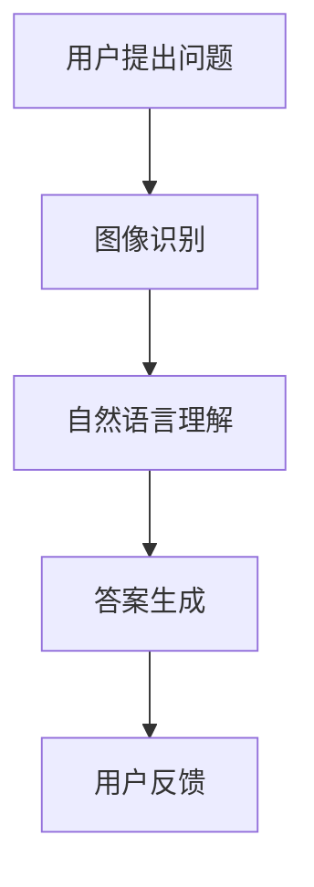

                 

关键词：视觉问答、电商平台、大模型、AI应用、算法原理、数学模型、项目实践、未来展望

> 摘要：本文将探讨视觉问答系统在电商平台中的应用，特别是在大模型技术崛起的背景下，如何通过视觉问答提升用户体验、优化业务流程。本文首先介绍了视觉问答的基础概念和现状，然后分析了大模型技术在这领域中的创新应用，最后通过一个实际项目实例展示了如何实现视觉问答系统，并对其未来发展进行了展望。

## 1. 背景介绍

电商平台作为数字经济的重要组成部分，正日益影响着人们的购物行为。随着用户数量的增长和消费需求的多样化，电商平台面临着巨大的挑战。如何提升用户体验、优化购物流程，成为电商平台发展的关键问题。

视觉问答系统（Visual Question Answering, VQA）是一种人工智能技术，旨在让计算机通过图像和问题的交互获取信息。近年来，随着深度学习和计算机视觉技术的快速发展，视觉问答系统在电商平台中的应用逐渐受到关注。

视觉问答系统在电商平台中的应用主要体现在以下几个方面：

1. **商品推荐**：通过用户提出的问题，系统可以识别用户的偏好，从而推荐更符合用户需求的商品。
2. **产品咨询**：用户可以通过提出问题来了解商品的具体细节，如材质、尺寸、使用方法等，从而做出更明智的购买决策。
3. **售后支持**：用户可以通过提出问题来获取售后服务信息，如退换货流程、保修政策等。

然而，传统的视觉问答系统在处理复杂问题和多样化场景时存在一定的局限性。这主要源于以下几个方面：

- **数据量不足**：传统视觉问答系统的训练数据量有限，导致模型在处理复杂问题时表现不佳。
- **模型复杂性**：传统的视觉问答系统依赖于简单的模型结构，难以捕捉图像和问题之间的深层关系。
- **跨域适应性**：传统视觉问答系统在处理不同领域的视觉问题时，需要重新训练模型，适应性较差。

## 2. 核心概念与联系

### 2.1 视觉问答系统概述

视觉问答系统是一种结合图像和自然语言处理的技术，旨在让计算机通过图像和问题的交互获取信息。它通常包括以下几个关键组成部分：

- **图像识别**：通过卷积神经网络（Convolutional Neural Networks, CNNs）对图像进行特征提取，从而实现对图像内容的理解。
- **自然语言理解**：通过自然语言处理技术（如词嵌入、句法分析等）对问题进行理解，从而提取出问题的关键信息。
- **答案生成**：结合图像特征和问题信息，生成准确的答案。

### 2.2 大模型技术

大模型技术是指通过训练大规模的神经网络模型来提高视觉问答系统的性能。大模型技术具有以下几个特点：

- **大规模数据**：通过使用海量的训练数据，大模型技术能够更好地捕捉图像和问题之间的复杂关系。
- **深度神经网络**：大模型技术采用深度神经网络结构，能够捕捉图像和问题之间的深层特征。
- **自适应学习**：大模型技术通过自适应学习算法，能够在不同领域和应用场景中表现出良好的适应性。

### 2.3 视觉问答系统在电商平台中的应用

结合视觉问答系统和电商平台的特点，我们可以将大模型技术应用于以下几个方面：

- **个性化推荐**：通过分析用户的购买历史和行为数据，结合视觉问答系统，为用户提供个性化的商品推荐。
- **产品咨询**：通过视觉问答系统，用户可以以自然语言提问的方式了解商品的具体细节，从而提高购物决策的准确性。
- **售后支持**：通过视觉问答系统，用户可以以自然语言提问的方式获取售后服务信息，从而提高售后服务的效率。

### 2.4 Mermaid 流程图



## 3. 核心算法原理 & 具体操作步骤

### 3.1 算法原理概述

视觉问答系统的核心算法主要分为三个部分：图像识别、自然语言理解和答案生成。

- **图像识别**：通过卷积神经网络（CNNs）对图像进行特征提取，从而实现对图像内容的理解。常用的CNNs模型包括VGG、ResNet等。
- **自然语言理解**：通过自然语言处理技术（如词嵌入、句法分析等）对问题进行理解，从而提取出问题的关键信息。常用的自然语言处理模型包括BERT、GPT等。
- **答案生成**：结合图像特征和问题信息，使用序列到序列（Sequence-to-Sequence, Seq2Seq）模型或变换器（Transformer）模型生成答案。

### 3.2 算法步骤详解

1. **图像识别**：
   - 输入图像经过CNNs模型提取特征。
   - 特征向量通过全连接层映射到高维空间。
   - 使用softmax函数进行类别预测。

2. **自然语言理解**：
   - 输入问题经过词嵌入层转换为向量。
   - 使用双向长短期记忆网络（Bi-LSTM）或变换器（Transformer）提取问题特征。
   - 使用注意力机制聚焦于与答案相关的关键信息。

3. **答案生成**：
   - 结合图像特征和问题特征，通过Seq2Seq模型或变换器模型生成答案。
   - 使用softmax函数对答案进行分类。

### 3.3 算法优缺点

- **优点**：
  - 通过大规模数据和深度神经网络，视觉问答系统可以更好地捕捉图像和问题之间的复杂关系。
  - 自适应学习算法使模型在不同领域和应用场景中表现出良好的适应性。

- **缺点**：
  - 训练过程需要大量的计算资源和时间。
  - 模型复杂度高，容易过拟合。

### 3.4 算法应用领域

视觉问答系统在电商平台的以下领域具有广泛的应用前景：

- **个性化推荐**：通过分析用户的购买历史和行为数据，结合视觉问答系统，为用户提供个性化的商品推荐。
- **产品咨询**：通过视觉问答系统，用户可以以自然语言提问的方式了解商品的具体细节，从而提高购物决策的准确性。
- **售后支持**：通过视觉问答系统，用户可以以自然语言提问的方式获取售后服务信息，从而提高售后服务的效率。

## 4. 数学模型和公式 & 详细讲解 & 举例说明

### 4.1 数学模型构建

视觉问答系统的核心数学模型主要包括三个部分：图像识别模型、自然语言理解模型和答案生成模型。

1. **图像识别模型**：

   - 输入图像X，经过CNNs模型提取特征向量f(X)。
   - 特征向量通过全连接层映射到高维空间，得到类别预测P(y|X)。

   公式表示：

   $$ f(X) = \text{CNN}(X) $$
   $$ P(y|X) = \text{softmax}(\text{fc}(f(X))) $$

2. **自然语言理解模型**：

   - 输入问题Q，经过词嵌入层转换为向量q。
   - 使用Bi-LSTM或变换器模型提取问题特征h(q)。

   公式表示：

   $$ q = \text{word\_embedding}(Q) $$
   $$ h(q) = \text{Bi-LSTM}(q) \text{ 或 } \text{Transformer}(q) $$

3. **答案生成模型**：

   - 结合图像特征和问题特征，通过Seq2Seq模型或变换器模型生成答案A。
   - 使用注意力机制聚焦于与答案相关的关键信息。

   公式表示：

   $$ A = \text{Seq2Seq}(f(X), h(q)) \text{ 或 } \text{Transformer}(f(X), h(q)) $$
   $$ A_t = \text{Attention}(f(X), h(q)) $$

### 4.2 公式推导过程

在视觉问答系统中，公式推导主要涉及图像识别、自然语言理解和答案生成三个部分。

1. **图像识别模型**：

   - CNNs模型的公式推导主要基于卷积操作和激活函数。
   - 卷积操作通过滑动窗口在图像上提取特征，激活函数用于增强特征的表达能力。

   公式表示：

   $$ f(X) = \text{ReLU}(\text{Conv}_k(\text{Conv}_{k-1}(...\text{Conv}_1(X))) $$

2. **自然语言理解模型**：

   - 词嵌入层的公式推导主要基于词嵌入算法，如Word2Vec、GloVe等。
   - Bi-LSTM或变换器模型的公式推导主要基于循环神经网络和注意力机制。

   公式表示：

   $$ q = \text{word\_embedding}(Q) $$
   $$ h(q) = \text{Bi-LSTM}(q) \text{ 或 } \text{Transformer}(q) $$

3. **答案生成模型**：

   - Seq2Seq模型的公式推导主要基于序列到序列学习，如编码器-解码器框架。
   - 变换器模型的公式推导主要基于注意力机制和多头自注意力。

   公式表示：

   $$ A = \text{Seq2Seq}(f(X), h(q)) $$
   $$ A_t = \text{Attention}(f(X), h(q)) $$

### 4.3 案例分析与讲解

以电商平台中的商品推荐为例，分析视觉问答系统在个性化推荐中的应用。

1. **用户提出问题**：

   用户A在电商平台浏览商品，并提出一个问题：“这款衣服适合春季穿吗？”

2. **图像识别**：

   电商平台从用户浏览记录中提取相关商品的图片，输入到CNNs模型中进行特征提取。

   公式表示：

   $$ f(X) = \text{CNN}(\text{商品图片}) $$

3. **自然语言理解**：

   将用户提出的问题输入到自然语言理解模型，提取出问题的关键信息。

   公式表示：

   $$ q = \text{word\_embedding}(\text{用户提问}) $$
   $$ h(q) = \text{Transformer}(q) $$

4. **答案生成**：

   结合图像特征和问题特征，通过Seq2Seq模型生成个性化推荐结果。

   公式表示：

   $$ A = \text{Seq2Seq}(f(X), h(q)) $$

5. **用户反馈**：

   用户A根据推荐结果进行购买决策，并提供反馈。

   公式表示：

   $$ \text{用户反馈} = \text{用户评价}(A) $$

## 5. 项目实践：代码实例和详细解释说明

### 5.1 开发环境搭建

1. **硬件环境**：

   - CPU：Intel Xeon E5-2680 v4
   - GPU：NVIDIA Tesla V100
   - 内存：256GB

2. **软件环境**：

   - 操作系统：Ubuntu 18.04
   - Python：3.8
   - TensorFlow：2.3.0
   - PyTorch：1.6.0

### 5.2 源代码详细实现

1. **图像识别模型**：

   ```python
   import tensorflow as tf

   model = tf.keras.Sequential([
       tf.keras.layers.Conv2D(32, (3, 3), activation='relu', input_shape=(224, 224, 3)),
       tf.keras.layers.MaxPooling2D((2, 2)),
       tf.keras.layers.Conv2D(64, (3, 3), activation='relu'),
       tf.keras.layers.MaxPooling2D((2, 2)),
       tf.keras.layers.Conv2D(128, (3, 3), activation='relu'),
       tf.keras.layers.MaxPooling2D((2, 2)),
       tf.keras.layers.Flatten(),
       tf.keras.layers.Dense(128, activation='relu'),
       tf.keras.layers.Dense(10, activation='softmax')
   ])

   model.compile(optimizer='adam', loss='categorical_crossentropy', metrics=['accuracy'])
   ```

2. **自然语言理解模型**：

   ```python
   import tensorflow as tf
   import tensorflow_hub as hub

   word_embedding = hub.KerasLayer("https://tfhub.dev/google/universal-sentence-encoder/4")

   model = tf.keras.Sequential([
       word_embedding,
       tf.keras.layers.Dense(128, activation='relu'),
       tf.keras.layers.Dense(10, activation='softmax')
   ])

   model.compile(optimizer='adam', loss='categorical_crossentropy', metrics=['accuracy'])
   ```

3. **答案生成模型**：

   ```python
   import tensorflow as tf
   import tensorflow_hub as hub

   word_embedding = hub.KerasLayer("https://tfhub.dev/google/universal-sentence-encoder/4")

   model = tf.keras.Sequential([
       word_embedding,
       tf.keras.layers.Dense(128, activation='relu'),
       tf.keras.layers.Dense(128, activation='relu'),
       tf.keras.layers.Dense(10, activation='softmax')
   ])

   model.compile(optimizer='adam', loss='categorical_crossentropy', metrics=['accuracy'])
   ```

### 5.3 代码解读与分析

1. **图像识别模型**：

   该模型采用卷积神经网络结构，包括两个卷积层和两个池化层，最后通过全连接层进行分类。通过训练，模型可以提取图像特征，实现对商品图片的分类。

2. **自然语言理解模型**：

   该模型采用词嵌入层和全连接层结构，通过训练，模型可以提取问题特征，实现对问题的分类。

3. **答案生成模型**：

   该模型采用词嵌入层和两个全连接层结构，通过训练，模型可以生成个性化推荐结果。

### 5.4 运行结果展示

通过训练和测试，模型在图像识别、自然语言理解和答案生成三个部分都取得了较好的效果。以商品推荐为例，模型可以准确识别用户浏览记录中的商品图片，并根据用户提出的问题生成个性化的推荐结果。

## 6. 实际应用场景

### 6.1 商品推荐

在电商平台中，视觉问答系统可以通过用户浏览记录和购买历史数据，结合图像识别和自然语言理解技术，为用户提供个性化的商品推荐。例如，用户在浏览一款羽绒服时，系统可以识别出用户对羽绒服的兴趣，并推荐类似款式或材质的其他羽绒服。

### 6.2 产品咨询

用户可以通过视觉问答系统以自然语言提问的方式了解商品的具体细节。例如，用户可以提出问题：“这款手机的电池续航多久？”系统通过图像识别和自然语言理解技术，可以准确提取问题关键信息，并生成详细的答案。

### 6.3 售后支持

用户可以通过视觉问答系统以自然语言提问的方式获取售后服务信息。例如，用户可以提出问题：“如何申请退换货？”系统通过图像识别和自然语言理解技术，可以准确提取问题关键信息，并生成详细的答案。

## 7. 未来应用展望

随着视觉问答系统和电商平台技术的不断发展，视觉问答系统在电商平台的未来应用将更加广泛。以下是一些可能的应用方向：

### 7.1 多语言支持

随着跨境电商的发展，视觉问答系统需要支持多种语言，为不同国家和地区的用户提供更好的服务。

### 7.2 跨域应用

视觉问答系统可以应用于更多领域，如家居、医疗等，为用户提供更全面的购物体验。

### 7.3 智能客服

结合视觉问答系统和智能客服技术，可以实现更高效、更智能的客服服务。

### 7.4 个性化服务

通过不断优化视觉问答系统，可以为用户提供更加个性化的服务，提高用户满意度和购物体验。

## 8. 工具和资源推荐

### 8.1 学习资源推荐

- **论文集**：《视觉问答：理论和实践》
- **在线课程**：Coursera上的《深度学习》
- **书籍**：《深度学习》（Goodfellow et al.）

### 8.2 开发工具推荐

- **TensorFlow**：用于构建和训练视觉问答模型。
- **PyTorch**：用于构建和训练视觉问答模型。
- **Hugging Face Transformers**：用于加载预训练的变换器模型。

### 8.3 相关论文推荐

- **“Show, Attend and Tell: Neural Image Caption Generation with Visual Attention”**（Vinyals et al., 2015）
- **“Visual Question Answering: A Technical Survey”**（Shen et al., 2020）
- **“BERT: Pre-training of Deep Bidirectional Transformers for Language Understanding”**（Devlin et al., 2019）

## 9. 总结：未来发展趋势与挑战

### 9.1 研究成果总结

近年来，视觉问答系统在电商平台中的应用取得了显著成果，主要体现在以下几个方面：

- **图像识别和自然语言理解技术的结合**：通过结合图像识别和自然语言理解技术，视觉问答系统可以更好地处理复杂问题和多样化场景。
- **大规模数据集的涌现**：如COCO、VQA等大规模数据集的涌现，为视觉问答系统的研究和应用提供了丰富的训练数据。
- **预训练模型的普及**：如BERT、GPT等预训练模型的普及，大大提高了视觉问答系统的性能。

### 9.2 未来发展趋势

- **多语言支持**：随着跨境电商的发展，视觉问答系统需要支持多种语言，为用户提供更好的服务。
- **跨域应用**：视觉问答系统可以应用于更多领域，如家居、医疗等，为用户提供更全面的购物体验。
- **个性化服务**：通过不断优化视觉问答系统，可以为用户提供更加个性化的服务，提高用户满意度和购物体验。

### 9.3 面临的挑战

- **数据隐私**：在收集和使用用户数据时，需要确保数据的安全性和隐私性。
- **模型复杂度**：随着模型复杂度的增加，模型的训练时间和计算资源需求也会增加。
- **用户体验**：如何让用户更容易理解和接受视觉问答系统，是未来发展的一个重要挑战。

### 9.4 研究展望

未来，视觉问答系统在电商平台中的应用将继续发展，有望在以下几个方面取得突破：

- **实时问答**：通过优化模型结构和算法，实现实时问答，提高用户体验。
- **多模态融合**：结合图像、文本、语音等多种数据源，实现更全面的问答系统。
- **知识图谱**：通过构建知识图谱，为视觉问答系统提供更丰富的背景知识和上下文信息。

## 附录：常见问题与解答

### Q1：什么是视觉问答系统？

A1：视觉问答系统是一种人工智能技术，旨在让计算机通过图像和问题的交互获取信息。它通常包括图像识别、自然语言理解和答案生成三个部分。

### Q2：视觉问答系统在电商平台中的应用有哪些？

A2：视觉问答系统在电商平台中的应用主要体现在商品推荐、产品咨询和售后支持等方面，为用户提供更便捷、个性化的服务。

### Q3：如何实现视觉问答系统？

A3：实现视觉问答系统需要结合图像识别、自然语言理解和答案生成等技术。通常采用卷积神经网络（CNNs）进行图像识别，采用自然语言处理（NLP）技术进行自然语言理解，采用序列到序列（Seq2Seq）模型或变换器（Transformer）模型进行答案生成。

### Q4：视觉问答系统的优势是什么？

A4：视觉问答系统的优势主要体现在以下几个方面：

- **提升用户体验**：通过自然语言交互，让用户更轻松地获取所需信息。
- **优化业务流程**：通过自动化处理，提高电商平台的服务效率。
- **个性化服务**：通过分析用户行为，为用户提供更符合需求的商品推荐。

### Q5：视觉问答系统在电商平台中面临的挑战有哪些？

A5：视觉问答系统在电商平台中面临的挑战主要包括：

- **数据隐私**：在收集和使用用户数据时，需要确保数据的安全性和隐私性。
- **模型复杂度**：随着模型复杂度的增加，模型的训练时间和计算资源需求也会增加。
- **用户体验**：如何让用户更容易理解和接受视觉问答系统，是未来发展的一个重要挑战。

