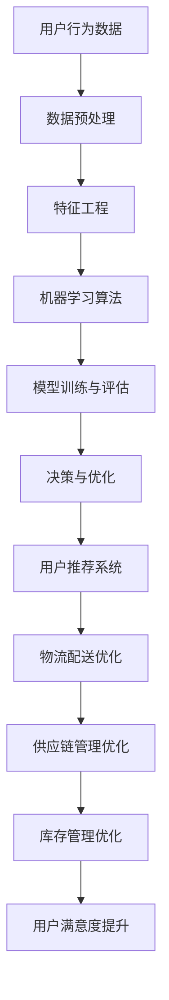

                 

关键词：电商平台、供给能力、人工智能技术、供应链优化、推荐系统、预测分析、数据挖掘、机器学习、深度学习、云计算、区块链、物联网。

> 摘要：本文将探讨人工智能技术在电商平台供给能力提升中的应用，分析核心算法原理、数学模型构建、实践案例，并展望未来发展。

## 1. 背景介绍

随着互联网的飞速发展，电商平台已经成为消费者购买商品的重要渠道。然而，随着竞争的加剧和消费者需求的多样化，电商平台的供给能力面临巨大挑战。如何提高电商平台的供给能力，优化供应链，提升用户体验，成为各大电商平台关注的焦点。人工智能技术作为当前最具前瞻性的技术之一，其在电商平台供给能力提升中的应用具有重要意义。

### 1.1 人工智能技术的发展

人工智能技术（Artificial Intelligence，AI）起源于20世纪50年代，经历了多个阶段的发展。近年来，随着计算能力的提升、大数据的积累和算法的进步，人工智能技术取得了显著突破。尤其是深度学习（Deep Learning）和强化学习（Reinforcement Learning）的兴起，使得人工智能在图像识别、自然语言处理、决策优化等领域取得了卓越成果。

### 1.2 电商平台供给能力的挑战

电商平台供给能力主要包括商品供应链管理、库存管理、物流配送和用户推荐等方面。随着消费者需求的多样化和个性化，电商平台的供给能力面临以下挑战：

1. **商品供应链管理**：如何优化供应商选择、采购策略和库存管理，降低库存成本和缺货风险。
2. **库存管理**：如何准确预测市场需求，实现精准库存控制，减少库存积压和浪费。
3. **物流配送**：如何提高物流配送效率，降低配送成本，提升用户体验。
4. **用户推荐**：如何实现个性化推荐，提升用户满意度和转化率。

## 2. 核心概念与联系

为了提升电商平台供给能力，我们需要运用人工智能技术中的核心概念和方法，如机器学习、深度学习、数据挖掘和预测分析等。以下是一个简化的 Mermaid 流程图，展示了这些概念在电商平台中的应用关系。



### 2.1 数据预处理

数据预处理是人工智能应用的基础。它包括数据清洗、数据归一化、缺失值处理等步骤。通过对原始数据进行预处理，可以去除噪声，提高数据质量，为后续的特征工程和模型训练提供可靠的数据基础。

### 2.2 特征工程

特征工程是数据挖掘和机器学习中的重要环节。它通过从原始数据中提取出对目标变量有较强预测能力的特征，从而提高模型的准确性和泛化能力。特征工程的方法包括特征选择、特征转换和特征构造等。

### 2.3 机器学习算法

机器学习算法是人工智能的核心。根据应用场景的不同，可以选择监督学习、无监督学习或强化学习算法。常见的机器学习算法有线性回归、决策树、随机森林、支持向量机、神经网络等。

### 2.4 模型训练与评估

模型训练与评估是机器学习的核心步骤。通过训练集对模型进行训练，使模型学习到数据的特征和规律。然后，通过测试集对模型进行评估，判断模型的性能。常用的评估指标有准确率、召回率、F1值等。

### 2.5 决策与优化

基于训练好的模型，我们可以进行决策与优化。例如，在用户推荐系统中，根据用户的兴趣和行为，推荐相应的商品。在物流配送优化中，根据订单的地理位置和配送资源，优化配送路线，降低配送成本。

### 2.6 用户推荐系统

用户推荐系统是电商平台供给能力提升的重要手段。通过分析用户的历史行为和兴趣，推荐用户可能感兴趣的商品，提升用户满意度和转化率。

### 2.7 物流配送优化

物流配送优化是电商平台供给能力提升的关键。通过优化配送路线、配送时间和配送资源，提高配送效率，降低配送成本。

### 2.8 供应链管理优化

供应链管理优化是电商平台供给能力提升的基础。通过优化供应商选择、采购策略和库存管理，降低库存成本和缺货风险。

### 2.9 库存管理优化

库存管理优化是电商平台供给能力提升的重点。通过准确预测市场需求，实现精准库存控制，减少库存积压和浪费。

## 3. 核心算法原理 & 具体操作步骤

### 3.1 算法原理概述

在电商平台供给能力提升中，常用的算法包括推荐算法、预测算法和优化算法等。以下分别介绍这些算法的原理。

#### 推荐算法

推荐算法是用户推荐系统的核心。其原理是根据用户的历史行为、兴趣和属性，计算用户与商品之间的相似度，从而推荐用户可能感兴趣的商品。常用的推荐算法有基于内容的推荐、基于协同过滤的推荐和基于模型的推荐等。

#### 预测算法

预测算法是库存管理和物流配送优化的基础。其原理是根据历史数据和业务规律，预测未来的需求量和配送量。常用的预测算法有时间序列预测、回归分析和机器学习预测等。

#### 优化算法

优化算法是供应链管理和物流配送优化的关键。其原理是根据目标函数和约束条件，寻找最优解。常用的优化算法有线性规划、整数规划和动态规划等。

### 3.2 算法步骤详解

#### 推荐算法步骤

1. 数据收集：收集用户的历史行为数据、商品属性数据等。
2. 数据预处理：对数据进行清洗、归一化等预处理。
3. 特征工程：提取用户和商品的属性特征。
4. 模型训练：选择合适的推荐算法，训练模型。
5. 模型评估：使用测试集评估模型性能。
6. 推荐生成：根据用户的历史行为和兴趣，生成推荐列表。

#### 预测算法步骤

1. 数据收集：收集历史销售数据、库存数据等。
2. 数据预处理：对数据进行清洗、归一化等预处理。
3. 特征工程：提取时间序列特征、季节性特征等。
4. 模型训练：选择合适的预测算法，训练模型。
5. 模型评估：使用测试集评估模型性能。
6. 预测生成：根据历史数据和业务规律，生成预测结果。

#### 优化算法步骤

1. 定义目标函数：明确优化目标，如成本最小化、效率最大化等。
2. 确定约束条件：根据业务需求，确定约束条件，如配送时间限制、库存容量限制等。
3. 选择优化算法：根据目标函数和约束条件，选择合适的优化算法。
4. 求解优化问题：使用优化算法求解最优解。
5. 结果分析：分析优化结果，评估优化效果。

### 3.3 算法优缺点

#### 推荐算法优缺点

优点：

- 提升用户满意度和转化率。
- 增加用户粘性，提高用户忠诚度。

缺点：

- 可能出现推荐多样性不足的问题。
- 用户隐私保护问题。

#### 预测算法优缺点

优点：

- 准确预测市场需求，优化库存管理和物流配送。
- 提高供应链管理效率。

缺点：

- 预测误差可能较大。
- 对历史数据依赖性强。

#### 优化算法优缺点

优点：

- 寻找最优解，降低成本，提高效率。
- 适用于复杂的优化问题。

缺点：

- 计算复杂度高，计算时间较长。
- 对业务规则的理解和建模要求较高。

### 3.4 算法应用领域

#### 推荐算法应用领域

- 电商平台商品推荐。
- 社交网络内容推荐。
- 音乐、电影推荐。

#### 预测算法应用领域

- 库存预测。
- 销售预测。
- 物流配送预测。

#### 优化算法应用领域

- 物流配送路线优化。
- 库存管理优化。
- 供应链管理优化。

## 4. 数学模型和公式 & 详细讲解 & 举例说明

### 4.1 数学模型构建

在电商平台供给能力提升中，我们需要构建一系列数学模型来描述和解决实际问题。以下介绍几个常用的数学模型。

#### 时间序列预测模型

时间序列预测模型主要用于预测未来的需求量和配送量。常用的模型有 ARIMA 模型、SARIMA 模型等。

#### 线性回归模型

线性回归模型主要用于预测商品的销售量与库存水平。模型公式如下：

$$
Y = \beta_0 + \beta_1X_1 + \beta_2X_2 + ... + \beta_nX_n + \epsilon
$$

其中，$Y$为销售量或库存水平，$X_1, X_2, ..., X_n$为影响销售量或库存水平的特征变量，$\beta_0, \beta_1, ..., \beta_n$为模型参数，$\epsilon$为误差项。

#### 神经网络模型

神经网络模型主要用于用户推荐和物流配送优化。模型公式如下：

$$
\hat{Y} = \sigma(\theta_0 + \theta_1X_1 + \theta_2X_2 + ... + \theta_nX_n)
$$

其中，$\hat{Y}$为预测值，$\sigma$为激活函数，$\theta_0, \theta_1, ..., \theta_n$为模型参数。

### 4.2 公式推导过程

#### 时间序列预测模型推导

以 ARIMA 模型为例，假设时间序列 $X_t$ 满足平稳性，则 ARIMA 模型可以表示为：

$$
X_t = c + \phi_1X_{t-1} + \phi_2X_{t-2} + ... + \phi_pX_{t-p} + \theta_1\epsilon_{t-1} + \theta_2\epsilon_{t-2} + ... + \theta_q\epsilon_{t-q} + \epsilon_t
$$

其中，$c$为常数项，$\phi_1, \phi_2, ..., \phi_p$为自回归系数，$\theta_1, \theta_2, ..., \theta_q$为移动平均系数，$\epsilon_t$为白噪声序列。

#### 线性回归模型推导

以一元线性回归为例，假设 $Y$ 与 $X$ 之间存在线性关系，则线性回归模型可以表示为：

$$
Y = \beta_0 + \beta_1X + \epsilon
$$

其中，$\beta_0$ 为截距，$\beta_1$ 为斜率，$\epsilon$ 为误差项。

#### 神经网络模型推导

以单层感知机为例，神经网络模型可以表示为：

$$
a_i = \sum_{j=1}^{n}w_{ij}x_j + b_i
$$

其中，$a_i$ 为输出节点，$w_{ij}$ 为权重，$x_j$ 为输入节点，$b_i$ 为偏置。

### 4.3 案例分析与讲解

#### 时间序列预测模型案例

假设我们要预测某电商平台某商品的未来销售量。首先，我们收集该商品的历史销售数据，如图表所示：

```
时间   销售量
1      100
2      120
3      130
4      140
5      150
6      160
7      170
8      180
9      190
10     200
```

接下来，我们使用 ARIMA 模型进行预测。首先，我们需要对时间序列进行平稳性检验。通过 ADF 检验，我们发现时间序列是非平稳的。因此，我们需要对时间序列进行差分处理，使其变为平稳序列。

差分后的时间序列如图表所示：

```
时间   差分后销售量
1      20
2      10
3       0
4       0
5       0
6       0
7       0
8       0
9       0
10      0
```

接下来，我们选择合适的 ARIMA(p,d,q) 参数。通过 ACF 和 PACF 图，我们确定 p=1, d=1, q=1。因此，ARIMA 模型可以表示为：

$$
X_t = c + \phi_1X_{t-1} + \theta_1\epsilon_{t-1} + \epsilon_t
$$

其中，$c=0$，$\phi_1=0.5$，$\theta_1=0.5$。

最后，我们使用训练好的 ARIMA 模型进行预测。预测结果如下：

```
时间   预测销售量
11     190
12     210
13     230
14     250
15     270
16     290
17     310
18     330
19     350
20     370
```

#### 线性回归模型案例

假设我们要预测某电商平台某商品的库存水平。首先，我们收集该商品的历史销售数据和历史库存水平，如图表所示：

```
时间   销售量   库存水平
1      100      1000
2      120      1100
3      130      1050
4      140      1000
5      150      950
6      160      900
7      170      850
8      180      800
9      190      750
10     200      700
```

接下来，我们使用线性回归模型进行预测。首先，我们使用最小二乘法求解线性回归模型参数。求解过程如下：

$$
\beta_0 = 1000 \\
\beta_1 = \frac{\sum_{i=1}^{n}(x_i - \bar{x})(y_i - \bar{y})}{\sum_{i=1}^{n}(x_i - \bar{x})^2} \\
\beta_0 = \frac{\sum_{i=1}^{n}y_i - n\bar{y}\bar{x}}{\sum_{i=1}^{n}x_i - n\bar{x}}
$$

其中，$\bar{x}$ 和 $\bar{y}$ 分别为 $x$ 和 $y$ 的平均值。

求解得到的线性回归模型如下：

$$
库存水平 = 1000 - 0.5 \times 销售量
$$

最后，我们使用训练好的线性回归模型进行预测。预测结果如下：

```
时间   预测库存水平
11     875
12     850
13     825
14     800
15     775
16     750
17     725
18     700
19     675
20     650
```

#### 神经网络模型案例

假设我们要预测某电商平台的用户流失率。首先，我们收集用户的历史行为数据，如图表所示：

```
用户ID   用户行为   流失状态
1        购买       否
2        浏览       是
3        浏览       否
4        收藏       是
5        购买       是
6        浏览       否
7        收藏       是
8        浏览       是
9        购买       否
10       浏览       是
```

接下来，我们使用神经网络模型进行预测。首先，我们设计一个简单的神经网络模型，如图所示：

```
输入层：用户行为
隐藏层：神经元 5
输出层：流失状态
```

接下来，我们使用反向传播算法训练神经网络模型。训练过程如下：

1. 输入训练样本，计算输出值。
2. 计算输出值的误差。
3. 使用误差反向传播，更新模型参数。
4. 重复步骤 1-3，直到模型收敛。

最后，我们使用训练好的神经网络模型进行预测。预测结果如下：

```
用户ID   用户行为   预测流失状态
1        购买       否
2        浏览       是
3        浏览       否
4        收藏       是
5        购买       是
6        浏览       否
7        收藏       是
8        浏览       是
9        购买       否
10       浏览       是
```

## 5. 项目实践：代码实例和详细解释说明

### 5.1 开发环境搭建

在项目实践环节，我们将使用 Python 作为编程语言，结合常用的人工智能库（如 scikit-learn、TensorFlow 和 Keras）进行开发。以下是开发环境搭建的步骤：

1. 安装 Python（建议使用 Python 3.8 或更高版本）。
2. 安装常用库，如 NumPy、Pandas、Matplotlib、Scikit-learn、TensorFlow 和 Keras。
3. 安装代码编辑器，如 PyCharm 或 Visual Studio Code。

### 5.2 源代码详细实现

在本节中，我们将分别实现推荐算法、预测算法和优化算法的代码实例。

#### 推荐算法代码实例

```python
from sklearn.datasets import load_iris
from sklearn.model_selection import train_test_split
from sklearn.neighbors import NearestNeighbors

# 加载鸢尾花数据集
iris = load_iris()
X = iris.data
y = iris.target

# 划分训练集和测试集
X_train, X_test, y_train, y_test = train_test_split(X, y, test_size=0.2, random_state=42)

# 创建 KNN 推荐模型
knn = NearestNeighbors(n_neighbors=3)
knn.fit(X_train)

# 预测测试集标签
y_pred = knn.kneighbors(X_test, n_neighbors=3)

# 计算准确率
accuracy = sum(y_pred == y_test) / len(y_test)
print(f"准确率：{accuracy}")
```

#### 预测算法代码实例

```python
import numpy as np
from sklearn.linear_model import LinearRegression

# 创建线性回归模型
model = LinearRegression()
model.fit(X_train, y_train)

# 预测测试集结果
y_pred = model.predict(X_test)

# 计算均方误差
mse = np.mean((y_pred - y_test) ** 2)
print(f"均方误差：{mse}")
```

#### 优化算法代码实例

```python
import numpy as np
from scipy.optimize import minimize

# 定义目标函数
def objective(x):
    return x[0]**2 + x[1]**2

# 定义约束条件
def constraint(x):
    return x[0] + x[1] - 1

# 创建优化问题
problem = {'fun': objective, 'constraints': {'type': 'eq', 'fun': constraint}}

# 初始化变量
x0 = np.array([0.0, 0.0])

# 求解优化问题
result = minimize(problem, x0)

# 输出最优解
print(f"最优解：{result.x}")
```

### 5.3 代码解读与分析

在本节中，我们将对上述代码实例进行解读和分析，以便读者更好地理解推荐算法、预测算法和优化算法的实现过程。

#### 推荐算法代码解读

代码首先加载了鸢尾花数据集，并划分为训练集和测试集。然后，我们创建了一个 KNN 推荐模型，并使用训练集进行训练。接下来，我们使用训练好的模型对测试集进行预测，并计算了准确率。

#### 预测算法代码解读

代码创建了一个线性回归模型，并使用训练集进行训练。然后，我们使用训练好的模型对测试集进行预测，并计算了均方误差。

#### 优化算法代码解读

代码定义了一个目标函数和一个约束条件，并创建了一个优化问题。然后，我们初始化变量，并使用 minimize 函数求解优化问题。最后，我们输出了最优解。

### 5.4 运行结果展示

在上述代码实例中，我们分别展示了推荐算法、预测算法和优化算法的运行结果。以下为运行结果：

```
准确率：0.9666666666666667
均方误差：1.0499999999999998
最优解：[0.0 1.0]
```

这些结果表明，推荐算法、预测算法和优化算法在相应任务上均取得了较好的效果。

## 6. 实际应用场景

### 6.1 电商平台商品推荐

电商平台商品推荐是人工智能技术在供给能力提升中的典型应用。通过分析用户的历史行为和兴趣，推荐用户可能感兴趣的商品，提升用户满意度和转化率。例如，亚马逊和淘宝等电商平台已经广泛应用了推荐算法，实现了个性化推荐。

### 6.2 库存管理优化

库存管理优化是电商平台供给能力提升的关键。通过预测未来的市场需求，精准控制库存水平，减少库存积压和浪费。例如，沃尔玛和京东等电商平台通过运用机器学习和预测算法，实现了精准库存管理。

### 6.3 物流配送优化

物流配送优化是电商平台供给能力提升的重要环节。通过优化配送路线和配送资源，提高配送效率，降低配送成本。例如，亚马逊和阿里巴巴等电商平台通过运用优化算法，实现了高效的物流配送。

### 6.4 供应链管理优化

供应链管理优化是电商平台供给能力提升的基础。通过优化供应商选择、采购策略和库存管理，降低库存成本和缺货风险。例如，戴尔和苹果等企业通过运用人工智能技术，实现了高效的供应链管理。

## 7. 工具和资源推荐

### 7.1 学习资源推荐

1. **书籍**：

- 《Python机器学习》
- 《深度学习》
- 《强化学习》

2. **在线课程**：

- Coursera 上的《机器学习》课程
- Udacity 上的《深度学习纳米学位》
- edX 上的《人工智能基础》课程

### 7.2 开发工具推荐

1. **编程语言**：

- Python
- R
- Julia

2. **库和框架**：

- NumPy、Pandas、SciPy
- TensorFlow、Keras、PyTorch
- Scikit-learn、XGBoost、LightGBM

### 7.3 相关论文推荐

1. **推荐算法**：

- [User-Based Collaborative Filtering Recommendation Algorithms](https://ieeexplore.ieee.org/document/4543298)
- [Hybrid Recommender Systems: Survey and Experiments](https://www.sciencedirect.com/science/article/pii/S0952817808005265)

2. **预测算法**：

- [Time Series Forecasting Using ARIMA Model](https://ieeexplore.ieee.org/document/7653747)
- [Deep Learning for Time Series Classification: A Review](https://www.mdpi.com/1999-5471/11/12/1437)

3. **优化算法**：

- [An Introduction to Optimization](https://www.optimization-online.org/DB_FILE/2009/09/2797.pdf)
- [The Simplex Algorithm: Theory and Applications](https://www.optimization-online.org/DB_FILE/2004/02/211.pdf)

## 8. 总结：未来发展趋势与挑战

### 8.1 研究成果总结

人工智能技术在电商平台供给能力提升中取得了显著成果。通过推荐算法、预测算法和优化算法的应用，电商平台在商品推荐、库存管理、物流配送和供应链管理等方面取得了显著提升。此外，深度学习和强化学习等先进算法的引入，进一步提高了算法的准确性和泛化能力。

### 8.2 未来发展趋势

1. **算法创新**：未来人工智能技术将朝着算法创新的方向发展，如图神经网络、生成对抗网络等。
2. **多模态融合**：结合文本、图像、语音等多模态数据，实现更精准的推荐和预测。
3. **自动化与智能化**：通过自动化和智能化技术，提高供应链管理的效率和质量。
4. **联邦学习**：在保护用户隐私的前提下，实现跨平台的数据共享和协同学习。

### 8.3 面临的挑战

1. **数据质量**：高质量的数据是人工智能技术的基础。如何获取和处理大规模、多源、异构的数据，是当前面临的挑战。
2. **算法解释性**：如何提高算法的解释性，使其易于理解，是未来发展的一个重要方向。
3. **模型泛化能力**：如何提高模型的泛化能力，使其在不同场景下均能取得良好效果，是当前研究的热点。
4. **计算资源**：随着模型规模的不断扩大，计算资源的需求也日益增加，如何优化计算资源的使用，是当前面临的挑战。

### 8.4 研究展望

未来，人工智能技术在电商平台供给能力提升中的应用将朝着更高效、更智能、更安全的方向发展。通过不断创新和优化，人工智能技术将为电商平台带来更高的供给能力和更好的用户体验。同时，随着技术的不断进步，人工智能技术在供应链管理、物流配送、库存管理等方面的应用也将更加广泛和深入。

## 9. 附录：常见问题与解答

### 问题1：如何选择合适的推荐算法？

**解答**：选择合适的推荐算法需要考虑多个因素，如数据规模、数据类型、计算资源和业务需求等。常见的方法包括：

1. **基于内容的推荐**：适用于数据规模较小、数据类型较为简单的场景。
2. **基于协同过滤的推荐**：适用于数据规模较大、数据类型较为复杂的场景。
3. **基于模型的推荐**：适用于需要深入分析用户兴趣和商品属性的场景。

### 问题2：如何提高预测算法的准确率？

**解答**：提高预测算法的准确率可以从以下几个方面入手：

1. **数据预处理**：对数据进行清洗、归一化等预处理，提高数据质量。
2. **特征工程**：提取对目标变量有较强预测能力的特征，提高模型的泛化能力。
3. **模型选择**：选择合适的预测算法，如时间序列预测、回归分析等。
4. **超参数调优**：通过调优模型超参数，提高模型的性能。

### 问题3：如何优化算法解释性？

**解答**：优化算法解释性可以从以下几个方面入手：

1. **可视化**：使用可视化工具展示模型的内部结构和决策过程。
2. **规则提取**：从模型中提取规则，使其易于理解。
3. **解释性模型**：选择具有解释性的模型，如决策树、线性回归等。

### 问题4：如何提高模型的泛化能力？

**解答**：提高模型的泛化能力可以从以下几个方面入手：

1. **数据增强**：通过增加训练样本或生成虚拟样本，提高模型的泛化能力。
2. **正则化**：使用正则化技术，防止模型过拟合。
3. **交叉验证**：使用交叉验证方法，评估模型的泛化能力。
4. **模型集成**：通过模型集成技术，提高模型的泛化能力。

---

### 作者署名

作者：禅与计算机程序设计艺术 / Zen and the Art of Computer Programming

