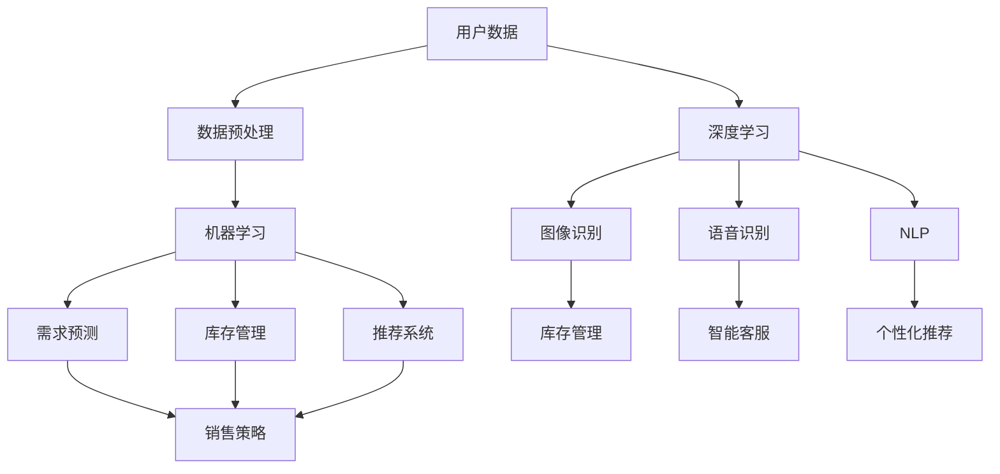

                 

在当今快速发展的电子商务领域，提升供给能力是电商平台持续竞争的关键。随着消费者需求的多样化、个性化和实时性，传统的供应链管理方式已无法满足现代电商平台的运营需求。人工智能（AI）技术的引入，为电商平台优化供给能力提供了全新的解决方案。本文旨在探讨人工智能技术如何提升电商平台的供给能力，以及在实际应用中的挑战和未来展望。

## 文章关键词

- 电商平台
- 供给能力
- 人工智能
- 机器学习
- 供应链优化

## 文章摘要

本文首先介绍了电商平台供给能力提升的背景和现状，分析了传统供给管理方式的局限性。随后，深入探讨了人工智能技术在电商平台供给能力提升中的应用，包括数据挖掘、机器学习、深度学习和自然语言处理等核心技术的具体应用场景。通过实际案例和数学模型的解释，展示了人工智能技术如何有效提升电商平台的供给能力。最后，本文对人工智能技术在电商平台供给能力提升中的未来应用和发展趋势进行了展望。

## 1. 背景介绍

随着互联网的普及和移动设备的广泛应用，电子商务已经成为全球零售行业的重要组成部分。电商平台通过线上渠道为消费者提供方便快捷的购物体验，逐渐取代了传统的线下零售模式。然而，电商平台在快速发展的同时也面临着诸多挑战，其中最为关键的是如何提升供给能力，以满足消费者日益增长的多样化、个性化和实时性需求。

传统的电商平台供给管理主要依赖于人工经验和历史数据分析，存在以下局限性：

1. **反应速度慢**：传统方法需要收集、处理和分析大量数据，导致响应时间较长，难以满足消费者的即时需求。
2. **预测准确性低**：仅凭历史数据难以准确预测未来的需求变化，导致库存过多或不足。
3. **灵活性差**：传统方法难以适应市场环境的变化，难以快速调整供给策略。
4. **用户体验差**：由于供给能力受限，消费者在购买过程中可能遇到缺货或配送延迟等问题，影响用户体验。

为了克服这些局限性，电商平台迫切需要引入先进的技术手段来提升供给能力。人工智能技术以其强大的数据处理和分析能力，为电商平台供给能力的提升提供了新的可能。本文将详细介绍人工智能技术在不同方面的应用，以期为电商平台的发展提供有益的参考。

### 人工智能技术的应用领域与潜力

人工智能技术在电商平台中的应用涵盖了多个领域，包括但不限于以下几个方面：

1. **供应链管理**：通过机器学习和深度学习算法，人工智能可以实时分析市场需求，优化库存管理，减少库存积压和缺货现象。
2. **预测与分析**：利用大数据和机器学习技术，人工智能可以预测消费者的购买行为和需求趋势，为电商平台的商品供应和营销策略提供科学依据。
3. **个性化推荐**：基于用户行为和兴趣数据，人工智能可以精确推荐商品，提升用户满意度和转化率。
4. **用户体验优化**：通过自然语言处理技术，人工智能可以与用户进行智能对话，提供个性化的购物建议和解答用户疑问，提升用户体验。
5. **物流优化**：利用路径优化和实时交通数据，人工智能可以优化物流配送路线，减少配送时间和成本。

总之，人工智能技术在电商平台中的应用具有极大的潜力，能够有效提升供给能力，满足消费者多样化、个性化、实时的需求，从而提高电商平台的市场竞争力。在接下来的章节中，我们将深入探讨人工智能技术在电商平台供给能力提升中的具体应用案例和技术原理。

## 2. 核心概念与联系

### 2.1 人工智能技术在电商平台中的应用

#### 2.1.1 机器学习

机器学习是人工智能技术的重要组成部分，通过构建和分析模型来从数据中学习规律和模式。在电商平台中，机器学习可以应用于需求预测、库存管理和推荐系统等多个方面。

**需求预测**：电商平台可以利用机器学习算法，如线性回归、决策树和神经网络，来分析历史销售数据，预测未来的需求趋势。这不仅有助于优化库存管理，还可以提前准备应对可能的销售高峰。

**库存管理**：通过机器学习算法，电商平台可以实时监测库存水平，预测未来一段时间内各商品的库存需求。根据预测结果，系统可以自动调整库存水平，避免因缺货或库存积压而影响用户体验。

**推荐系统**：基于用户的浏览记录和购买历史，机器学习算法可以推荐用户可能感兴趣的商品，提高购物体验和转化率。

#### 2.1.2 深度学习

深度学习是一种基于多层神经网络的学习方法，能够自动从大量数据中学习复杂的模式和特征。在电商平台中，深度学习可以应用于图像识别、语音识别和自然语言处理等多个领域。

**图像识别**：电商平台可以利用深度学习算法进行商品图像识别，提高库存管理的准确性和效率。

**语音识别**：通过深度学习技术，电商平台可以实现语音购物功能，用户可以通过语音命令进行购物，提升购物体验。

**自然语言处理**：深度学习技术在自然语言处理（NLP）领域的应用非常广泛，如情感分析、问答系统和聊天机器人。电商平台可以利用NLP技术，分析用户评论和反馈，改进产品和服务。

#### 2.1.3 自然语言处理

自然语言处理（NLP）是人工智能的一个分支，致力于使计算机能够理解、生成和处理人类语言。在电商平台中，NLP技术可以应用于用户评论分析、智能客服和个性化推荐等多个方面。

**用户评论分析**：通过NLP技术，电商平台可以分析用户评论的情感倾向，了解用户对产品或服务的满意度，为改进产品和服务提供依据。

**智能客服**：利用NLP技术，电商平台可以构建智能客服系统，自动回答用户问题，提供购物建议和解决方案，提高客服效率和用户满意度。

**个性化推荐**：通过分析用户的搜索历史和浏览记录，NLP技术可以为用户提供个性化的商品推荐，提高购物体验和转化率。

### 2.2 人工智能技术架构图

为了更好地理解人工智能技术在电商平台中的应用，下面是一个简单的架构图，展示了各种技术之间的联系和交互。



在这个架构图中，用户数据是整个系统的输入，经过数据预处理后，可以被机器学习和深度学习算法使用。机器学习算法用于需求预测、库存管理和推荐系统，而深度学习算法则应用于图像识别、语音识别和自然语言处理。这些技术的输出最终用于优化电商平台的运营策略，提高用户体验和销售额。

通过这个架构图，我们可以清晰地看到人工智能技术在电商平台中的应用流程和各个技术之间的相互作用。在实际应用中，这些技术往往不是独立运行的，而是相互融合、协同工作的，以实现最佳的供给能力提升效果。

## 3. 核心算法原理 & 具体操作步骤

### 3.1 算法原理概述

在电商平台供给能力提升中，常用的核心算法包括机器学习算法和深度学习算法。以下将分别介绍这些算法的基本原理和适用场景。

#### 3.1.1 机器学习算法

机器学习算法通过从数据中学习规律和模式，实现预测和分类任务。常见的机器学习算法包括线性回归、决策树、支持向量机（SVM）和神经网络等。

1. **线性回归**：线性回归是一种简单的预测算法，通过建立线性模型来预测数值型目标。它适用于预测商品的销售量、库存水平等。
   
2. **决策树**：决策树通过一系列规则来划分数据集，形成一棵树形结构。每个节点代表一个特征，每个分支代表该特征的不同取值。决策树适用于分类任务，如预测商品的种类或用户的行为。

3. **支持向量机（SVM）**：SVM通过找到一个最优的超平面，将不同类别的数据分开。它适用于分类任务，如识别用户是否购买某种商品。

4. **神经网络**：神经网络是一种由多层神经元组成的网络，能够通过学习数据中的非线性关系实现复杂预测任务。它适用于构建复杂的推荐系统和需求预测模型。

#### 3.1.2 深度学习算法

深度学习算法是一种基于多层神经网络的学习方法，通过多层神经元的相互连接和交互，实现从简单到复杂的模式识别和预测任务。常见的深度学习算法包括卷积神经网络（CNN）、循环神经网络（RNN）和生成对抗网络（GAN）等。

1. **卷积神经网络（CNN）**：CNN通过卷积层、池化层和全连接层等结构，实现对图像的特征提取和分类。它适用于图像识别任务，如商品分类和库存管理。

2. **循环神经网络（RNN）**：RNN通过循环结构，实现对序列数据的处理和预测。它适用于语音识别、时间序列分析和自然语言处理等任务。

3. **生成对抗网络（GAN）**：GAN由生成器和判别器两个神经网络组成，通过相互竞争和对抗，实现生成逼真的数据。它适用于图像生成、语音合成和文本生成等任务。

### 3.2 算法步骤详解

#### 3.2.1 数据收集与预处理

在应用机器学习和深度学习算法之前，需要收集和预处理大量数据。数据来源包括用户行为数据、商品信息、销售数据等。

1. **数据收集**：从电商平台的数据库中提取用户行为数据、商品信息和销售数据。

2. **数据清洗**：处理缺失值、异常值和重复数据，确保数据的质量和一致性。

3. **数据特征提取**：将原始数据转化为算法可以处理的形式，提取关键特征，如用户购买历史、浏览记录、商品属性等。

#### 3.2.2 模型训练与优化

1. **模型选择**：根据任务需求和数据特征，选择合适的机器学习或深度学习算法。

2. **模型训练**：使用训练数据集对模型进行训练，通过调整模型参数，使模型能够拟合训练数据。

3. **模型评估**：使用验证数据集对模型进行评估，通过指标如准确率、召回率、F1值等评估模型的性能。

4. **模型优化**：根据评估结果，调整模型参数，优化模型性能。

#### 3.2.3 模型应用与部署

1. **模型应用**：将训练好的模型应用到实际业务场景中，如需求预测、库存管理和推荐系统等。

2. **模型部署**：将模型部署到生产环境，确保模型能够实时运行，提供预测和推荐服务。

### 3.3 算法优缺点

#### 3.3.1 机器学习算法

**优点**：

- **通用性强**：机器学习算法适用于多种类型的预测和分类任务。
- **易于实现**：大多数机器学习算法都有现成的库和工具可供使用，便于开发和部署。

**缺点**：

- **对数据质量要求高**：机器学习算法对数据质量有较高要求，需要处理缺失值、异常值和重复数据。
- **训练时间较长**：对于大规模数据集和复杂的模型，训练时间可能较长。

#### 3.3.2 深度学习算法

**优点**：

- **强大的学习能力**：深度学习算法能够自动提取数据中的复杂特征，适用于处理大规模和高维数据。
- **优秀的性能表现**：深度学习算法在图像识别、语音识别和自然语言处理等领域取得了显著的成绩。

**缺点**：

- **计算资源消耗大**：深度学习算法需要大量的计算资源和时间进行训练。
- **调参复杂**：深度学习算法的参数调整较为复杂，需要经验丰富的数据科学家进行调优。

### 3.4 算法应用领域

机器学习算法和深度学习算法在电商平台供给能力提升中的应用非常广泛，主要包括以下领域：

- **需求预测**：利用机器学习和深度学习算法，电商平台可以预测未来的需求趋势，优化库存管理，避免缺货和库存积压。
- **库存管理**：通过机器学习算法，电商平台可以实时监控库存水平，预测未来一段时间内各商品的库存需求，优化库存管理。
- **推荐系统**：利用机器学习和深度学习算法，电商平台可以推荐用户可能感兴趣的商品，提升用户满意度和转化率。
- **用户行为分析**：通过自然语言处理和深度学习算法，电商平台可以分析用户评论和反馈，了解用户需求，改进产品和服务。
- **智能客服**：利用自然语言处理和深度学习算法，电商平台可以构建智能客服系统，自动回答用户问题，提供个性化的购物建议。

综上所述，机器学习算法和深度学习算法在电商平台供给能力提升中具有重要的应用价值。通过合理选择和应用这些算法，电商平台可以大幅提升供给能力，提高市场竞争力。

## 4. 数学模型和公式 & 详细讲解 & 举例说明

### 4.1 数学模型构建

在电商平台供给能力提升中，常用的数学模型包括线性回归模型、时间序列模型和神经网络模型。以下将分别介绍这些模型的构建方法和应用场景。

#### 4.1.1 线性回归模型

线性回归模型是一种简单的预测模型，通过建立线性关系来预测目标变量。其数学表达式如下：

$$
Y = \beta_0 + \beta_1X + \epsilon
$$

其中，$Y$ 是目标变量，$X$ 是自变量，$\beta_0$ 和 $\beta_1$ 是模型参数，$\epsilon$ 是误差项。

线性回归模型的构建步骤如下：

1. **数据收集**：收集历史销售数据，包括商品销售额、销售量、库存量等。
2. **数据预处理**：处理缺失值、异常值和重复数据，确保数据的质量和一致性。
3. **特征提取**：提取关键特征，如商品种类、促销活动等。
4. **模型训练**：使用训练数据集对模型进行训练，通过最小化误差函数来调整模型参数。
5. **模型评估**：使用验证数据集对模型进行评估，通过指标如均方误差（MSE）和决定系数（R²）来评估模型性能。
6. **模型应用**：将训练好的模型应用到实际业务场景中，如需求预测和库存管理。

#### 4.1.2 时间序列模型

时间序列模型用于预测时间序列数据，如销售量、库存量等。常见的时间序列模型包括ARIMA模型、LSTM模型和GRU模型等。

1. **ARIMA模型**（AutoRegressive Integrated Moving Average Model）：ARIMA模型通过自回归、差分和移动平均过程来建模时间序列数据。其数学表达式如下：

$$
Y_t = c + \phi_1Y_{t-1} + \phi_2Y_{t-2} + ... + \phi_pY_{t-p} + \theta_1\epsilon_{t-1} + \theta_2\epsilon_{t-2} + ... + \theta_q\epsilon_{t-q} + \epsilon_t
$$

其中，$Y_t$ 是时间序列数据，$c$ 是常数项，$\phi_i$ 和 $\theta_i$ 分别是自回归项和移动平均项的系数，$p$ 和 $q$ 分别是自回归项和移动平均项的阶数，$\epsilon_t$ 是误差项。

2. **LSTM模型**（Long Short-Term Memory Model）：LSTM模型是一种特殊的循环神经网络，能够有效处理长序列数据。其数学表达式如下：

$$
h_t = \sigma(W_f \cdot [h_{t-1}, x_t] + b_f) \odot W_i \cdot [h_{t-1}, x_t] + b_i) + \sigma(W_o \cdot [h_{t-1}, x_t] + b_o)
$$

其中，$h_t$ 是时间步$t$的隐藏状态，$x_t$ 是时间步$t$的输入，$W_f$、$W_i$ 和 $W_o$ 分别是遗忘门、输入门和输出门的权重矩阵，$b_f$、$b_i$ 和 $b_o$ 分别是遗忘门、输入门和输出门的偏置项，$\sigma$ 是激活函数，$\odot$ 表示逐元素乘法。

3. **GRU模型**（Gated Recurrent Unit Model）：GRU模型是一种改进的循环神经网络，相对于LSTM模型，GRU模型在计算和存储上更高效。其数学表达式如下：

$$
r_t = \sigma(W_r \cdot [h_{t-1}, x_t] + b_r) \odot W_z \cdot [h_{t-1}, x_t] + b_z) + \sigma(W_z \cdot [h_{t-1}, x_t] + b_z)
$$

$$
h_t = z \odot h_{t-1} + (1 - z) \odot \sigma(W \cdot [r_t, x_t] + b)
$$

其中，$r_t$ 是重置门，$z$ 是更新门，$h_t$ 是时间步$t$的隐藏状态，$W_r$、$W_z$ 和 $W$ 分别是重置门、更新门和隐藏状态权重矩阵，$b_r$、$b_z$ 和 $b$ 分别是重置门、更新门和隐藏状态偏置项，$\sigma$ 是激活函数。

时间序列模型的构建步骤如下：

1. **数据收集**：收集历史销售数据，包括商品销售额、销售量、库存量等。
2. **数据预处理**：处理缺失值、异常值和重复数据，确保数据的质量和一致性。
3. **特征提取**：提取关键特征，如商品种类、促销活动等。
4. **模型训练**：使用训练数据集对模型进行训练，通过最小化误差函数来调整模型参数。
5. **模型评估**：使用验证数据集对模型进行评估，通过指标如均方误差（MSE）和决定系数（R²）来评估模型性能。
6. **模型应用**：将训练好的模型应用到实际业务场景中，如需求预测和库存管理。

#### 4.1.3 神经网络模型

神经网络模型是一种基于多层感知器（MLP）的模型，通过多层神经元的相互连接和交互，实现从简单到复杂的模式识别和预测任务。其数学表达式如下：

$$
h_{l}^{(i)} = \sigma(W^{(l)} \cdot [h_{l-1}^{(i)}, x^{(i)}] + b^{(l)})
$$

$$
\hat{y}^{(i)} = \sigma(W^{(L)} \cdot [h_{L-1}^{(i)}, x^{(i)}] + b^{(L)})
$$

其中，$h_{l}^{(i)}$ 是第$l$层第$i$个神经元的输出，$x^{(i)}$ 是输入特征，$W^{(l)}$ 和 $b^{(l)}$ 分别是第$l$层的权重和偏置，$\sigma$ 是激活函数，$\hat{y}^{(i)}$ 是预测值。

神经网络模型的构建步骤如下：

1. **数据收集**：收集历史销售数据，包括商品销售额、销售量、库存量等。
2. **数据预处理**：处理缺失值、异常值和重复数据，确保数据的质量和一致性。
3. **特征提取**：提取关键特征，如商品种类、促销活动等。
4. **模型训练**：使用训练数据集对模型进行训练，通过反向传播算法和梯度下降优化策略来调整模型参数。
5. **模型评估**：使用验证数据集对模型进行评估，通过指标如均方误差（MSE）和决定系数（R²）来评估模型性能。
6. **模型应用**：将训练好的模型应用到实际业务场景中，如需求预测和库存管理。

### 4.2 公式推导过程

#### 4.2.1 线性回归模型

线性回归模型的公式推导过程如下：

1. **最小二乘法**：最小二乘法是一种通过最小化误差平方和来求解模型参数的方法。其公式如下：

$$
\min \sum_{i=1}^{n}(Y_i - \beta_0 - \beta_1X_i)^2
$$

2. **求导与极值**：对上述公式进行求导，并令导数为0，求解得到模型参数：

$$
\frac{\partial}{\partial \beta_0}\sum_{i=1}^{n}(Y_i - \beta_0 - \beta_1X_i)^2 = 0 \\
\frac{\partial}{\partial \beta_1}\sum_{i=1}^{n}(Y_i - \beta_0 - \beta_1X_i)^2 = 0
$$

3. **解方程组**：将上述方程组求解得到：

$$
\beta_0 = \bar{Y} - \beta_1\bar{X} \\
\beta_1 = \frac{\sum_{i=1}^{n}(X_i - \bar{X})(Y_i - \bar{Y})}{\sum_{i=1}^{n}(X_i - \bar{X})^2}
$$

其中，$\bar{X}$ 和 $\bar{Y}$ 分别是自变量和目标变量的均值。

#### 4.2.2 时间序列模型

时间序列模型的公式推导过程如下：

1. **自回归模型**：自回归模型是一种通过自回归过程来建模时间序列数据的模型。其公式如下：

$$
Y_t = c + \phi_1Y_{t-1} + \phi_2Y_{t-2} + ... + \phi_pY_{t-p} + \epsilon_t
$$

2. **差分变换**：差分变换是一种通过差分来平稳化时间序列数据的方法。其公式如下：

$$
\Delta Y_t = Y_t - Y_{t-1}
$$

3. **移动平均模型**：移动平均模型是一种通过移动平均来建模时间序列数据的模型。其公式如下：

$$
Y_t = c + \theta_1\epsilon_{t-1} + \theta_2\epsilon_{t-2} + ... + \theta_q\epsilon_{t-q} + \epsilon_t
$$

4. **ARIMA模型**：ARIMA模型是自回归移动平均模型的结合，其公式如下：

$$
Y_t = c + \phi_1Y_{t-1} + \phi_2Y_{t-2} + ... + \phi_pY_{t-p} + \theta_1\epsilon_{t-1} + \theta_2\epsilon_{t-2} + ... + \theta_q\epsilon_{t-q} + \epsilon_t
$$

#### 4.2.3 神经网络模型

神经网络模型的公式推导过程如下：

1. **前向传播**：前向传播是一种通过输入和权重计算中间层和输出层的激活值的方法。其公式如下：

$$
h_{l}^{(i)} = \sigma(W^{(l)} \cdot [h_{l-1}^{(i)}, x^{(i)}] + b^{(l)}) \\
\hat{y}^{(i)} = \sigma(W^{(L)} \cdot [h_{L-1}^{(i)}, x^{(i)}] + b^{(L)})
$$

2. **反向传播**：反向传播是一种通过计算输出层和中间层的误差，并反向传播来更新权重和偏置的方法。其公式如下：

$$
\delta_{l}^{(i)} = \sigma'(h_{l}^{(i)}) \cdot (d_{l}^{(i)} - \hat{y}^{(i)}) \\
W^{(l)} \gets W^{(l)} - \alpha \cdot \delta_{l}^{(i)} \cdot h_{l-1}^{(i)} \\
b^{(l)} \gets b^{(l)} - \alpha \cdot \delta_{l}^{(i)}
$$

其中，$\sigma'$ 是激活函数的导数，$d_{l}^{(i)}$ 是目标值，$\hat{y}^{(i)}$ 是预测值，$\alpha$ 是学习率。

### 4.3 案例分析与讲解

#### 4.3.1 需求预测案例

假设一个电商平台需要预测未来一周内某种商品的销售额。以下是该案例的分析和计算过程：

1. **数据收集**：收集过去一个月的销售额数据，包括每天的销售额。
2. **数据预处理**：处理缺失值、异常值和重复数据，确保数据的质量和一致性。
3. **特征提取**：提取关键特征，如日期、促销活动、季节性因素等。
4. **模型选择**：选择合适的模型，如线性回归模型和时间序列模型。
5. **模型训练**：使用训练数据集对模型进行训练，通过最小化误差函数来调整模型参数。
6. **模型评估**：使用验证数据集对模型进行评估，通过指标如均方误差（MSE）和决定系数（R²）来评估模型性能。
7. **模型应用**：将训练好的模型应用到实际业务场景中，预测未来一周内每天的销售额。

具体计算过程如下：

1. **线性回归模型**：

   - **数据预处理**：处理缺失值、异常值和重复数据，确保数据的质量和一致性。
   - **特征提取**：提取关键特征，如日期、促销活动、季节性因素等。
   - **模型训练**：使用训练数据集对模型进行训练，通过最小化误差函数来调整模型参数。
   - **模型评估**：使用验证数据集对模型进行评估，通过指标如均方误差（MSE）和决定系数（R²）来评估模型性能。

   线性回归模型的具体公式如下：

   $$
   Y = \beta_0 + \beta_1X + \epsilon
   $$

   其中，$Y$ 是目标变量，$X$ 是自变量，$\beta_0$ 和 $\beta_1$ 是模型参数，$\epsilon$ 是误差项。

   线性回归模型的计算过程如下：

   - **计算自变量和目标变量的均值**：
     $$
     \bar{X} = \frac{1}{n}\sum_{i=1}^{n}X_i \\
     \bar{Y} = \frac{1}{n}\sum_{i=1}^{n}Y_i
     $$

   - **计算自变量和目标变量的差值**：
     $$
     X_i - \bar{X} \\
     Y_i - \bar{Y}
     $$

   - **计算自变量和目标变量的乘积**：
     $$
     (X_i - \bar{X})(Y_i - \bar{Y})
     $$

   - **计算自变量和目标变量的平方和**：
     $$
     \sum_{i=1}^{n}(X_i - \bar{X})^2 \\
     \sum_{i=1}^{n}(Y_i - \bar{Y})^2
     $$

   - **计算模型参数**：
     $$
     \beta_1 = \frac{\sum_{i=1}^{n}(X_i - \bar{X})(Y_i - \bar{Y})}{\sum_{i=1}^{n}(X_i - \bar{X})^2} \\
     \beta_0 = \bar{Y} - \beta_1\bar{X}
     $$

   - **计算均方误差（MSE）和决定系数（R²）**：
     $$
     MSE = \frac{1}{n}\sum_{i=1}^{n}(Y_i - \hat{Y}_i)^2 \\
     R^2 = 1 - \frac{\sum_{i=1}^{n}(Y_i - \hat{Y}_i)^2}{\sum_{i=1}^{n}(Y_i - \bar{Y})^2}
     $$

2. **时间序列模型**：

   - **数据预处理**：处理缺失值、异常值和重复数据，确保数据的质量和一致性。
   - **特征提取**：提取关键特征，如日期、促销活动、季节性因素等。
   - **模型训练**：使用训练数据集对模型进行训练，通过最小化误差函数来调整模型参数。
   - **模型评估**：使用验证数据集对模型进行评估，通过指标如均方误差（MSE）和决定系数（R²）来评估模型性能。

   时间序列模型的具体公式如下：

   $$
   Y_t = c + \phi_1Y_{t-1} + \phi_2Y_{t-2} + ... + \phi_pY_{t-p} + \epsilon_t
   $$

   时间序列模型的计算过程如下：

   - **计算自变量和目标变量的均值**：
     $$
     \bar{Y} = \frac{1}{n}\sum_{i=1}^{n}Y_i
     $$

   - **计算自变量和目标变量的差值**：
     $$
     Y_i - \bar{Y}
     $$

   - **计算自变量和目标变量的乘积**：
     $$
     (Y_i - \bar{Y})(Y_{t-1} - \bar{Y}) \\
     (Y_i - \bar{Y})(Y_{t-2} - \bar{Y}) \\
     ...
     $$
     $$
     (Y_i - \bar{Y})(Y_{t-p} - \bar{Y})
     $$

   - **计算自变量和目标变量的平方和**：
     $$
     \sum_{i=1}^{n}(Y_i - \bar{Y})^2
     $$

   - **计算模型参数**：
     $$
     \phi_1 = \frac{\sum_{i=1}^{n}(Y_i - \bar{Y})(Y_{t-1} - \bar{Y})}{\sum_{i=1}^{n}(Y_i - \bar{Y})^2} \\
     \phi_2 = \frac{\sum_{i=1}^{n}(Y_i - \bar{Y})(Y_{t-2} - \bar{Y})}{\sum_{i=1}^{n}(Y_i - \bar{Y})^2} \\
     ...
     $$
     $$
     \phi_p = \frac{\sum_{i=1}^{n}(Y_i - \bar{Y})(Y_{t-p} - \bar{Y})}{\sum_{i=1}^{n}(Y_i - \bar{Y})^2}
     $$

   - **计算均方误差（MSE）和决定系数（R²）**：
     $$
     MSE = \frac{1}{n}\sum_{i=1}^{n}(Y_i - \hat{Y}_i)^2 \\
     R^2 = 1 - \frac{\sum_{i=1}^{n}(Y_i - \hat{Y}_i)^2}{\sum_{i=1}^{n}(Y_i - \bar{Y})^2}
     $$

   - **计算预测值**：
     $$
     \hat{Y}_t = \beta_0 + \beta_1X_t + \epsilon_t
     $$

#### 4.3.2 库存管理案例

假设一个电商平台需要管理某种商品的库存，要求库存水平不能低于最低库存量，同时不能超过最高库存量。以下是该案例的分析和计算过程：

1. **数据收集**：收集过去一个月的销售额数据，包括每天的销售额和库存量。
2. **数据预处理**：处理缺失值、异常值和重复数据，确保数据的质量和一致性。
3. **特征提取**：提取关键特征，如日期、促销活动、季节性因素等。
4. **模型选择**：选择合适的模型，如线性回归模型和时间序列模型。
5. **模型训练**：使用训练数据集对模型进行训练，通过最小化误差函数来调整模型参数。
6. **模型评估**：使用验证数据集对模型进行评估，通过指标如均方误差（MSE）和决定系数（R²）来评估模型性能。
7. **模型应用**：将训练好的模型应用到实际业务场景中，预测未来一周内每天的库存需求，并根据预测结果调整库存水平。

具体计算过程如下：

1. **线性回归模型**：

   - **数据预处理**：处理缺失值、异常值和重复数据，确保数据的质量和一致性。
   - **特征提取**：提取关键特征，如日期、促销活动、季节性因素等。
   - **模型训练**：使用训练数据集对模型进行训练，通过最小化误差函数来调整模型参数。
   - **模型评估**：使用验证数据集对模型进行评估，通过指标如均方误差（MSE）和决定系数（R²）来评估模型性能。

   线性回归模型的具体公式如下：

   $$
   Y = \beta_0 + \beta_1X + \epsilon
   $$

   其中，$Y$ 是目标变量，$X$ 是自变量，$\beta_0$ 和 $\beta_1$ 是模型参数，$\epsilon$ 是误差项。

   线性回归模型的计算过程如下：

   - **计算自变量和目标变量的均值**：
     $$
     \bar{X} = \frac{1}{n}\sum_{i=1}^{n}X_i \\
     \bar{Y} = \frac{1}{n}\sum_{i=1}^{n}Y_i
     $$

   - **计算自变量和目标变量的差值**：
     $$
     X_i - \bar{X} \\
     Y_i - \bar{Y}
     $$

   - **计算自变量和目标变量的乘积**：
     $$
     (X_i - \bar{X})(Y_i - \bar{Y})
     $$

   - **计算自变量和目标变量的平方和**：
     $$
     \sum_{i=1}^{n}(X_i - \bar{X})^2 \\
     \sum_{i=1}^{n}(Y_i - \bar{Y})^2
     $$

   - **计算模型参数**：
     $$
     \beta_1 = \frac{\sum_{i=1}^{n}(X_i - \bar{X})(Y_i - \bar{Y})}{\sum_{i=1}^{n}(X_i - \bar{X})^2} \\
     \beta_0 = \bar{Y} - \beta_1\bar{X}
     $$

   - **计算均方误差（MSE）和决定系数（R²）**：
     $$
     MSE = \frac{1}{n}\sum_{i=1}^{n}(Y_i - \hat{Y}_i)^2 \\
     R^2 = 1 - \frac{\sum_{i=1}^{n}(Y_i - \hat{Y}_i)^2}{\sum_{i=1}^{n}(Y_i - \bar{Y})^2}
     $$

   - **计算预测值**：
     $$
     \hat{Y}_t = \beta_0 + \beta_1X_t + \epsilon_t
     $$

2. **时间序列模型**：

   - **数据预处理**：处理缺失值、异常值和重复数据，确保数据的质量和一致性。
   - **特征提取**：提取关键特征，如日期、促销活动、季节性因素等。
   - **模型训练**：使用训练数据集对模型进行训练，通过最小化误差函数来调整模型参数。
   - **模型评估**：使用验证数据集对模型进行评估，通过指标如均方误差（MSE）和决定系数（R²）来评估模型性能。

   时间序列模型的具体公式如下：

   $$
   Y_t = c + \phi_1Y_{t-1} + \phi_2Y_{t-2} + ... + \phi_pY_{t-p} + \epsilon_t
   $$

   时间序列模型的计算过程如下：

   - **计算自变量和目标变量的均值**：
     $$
     \bar{Y} = \frac{1}{n}\sum_{i=1}^{n}Y_i
     $$

   - **计算自变量和目标变量的差值**：
     $$
     Y_i - \bar{Y}
     $$

   - **计算自变量和目标变量的乘积**：
     $$
     (Y_i - \bar{Y})(Y_{t-1} - \bar{Y}) \\
     (Y_i - \bar{Y})(Y_{t-2} - \bar{Y}) \\
     ...
     $$
     $$
     (Y_i - \bar{Y})(Y_{t-p} - \bar{Y})
     $$

   - **计算自变量和目标变量的平方和**：
     $$
     \sum_{i=1}^{n}(Y_i - \bar{Y})^2
     $$

   - **计算模型参数**：
     $$
     \phi_1 = \frac{\sum_{i=1}^{n}(Y_i - \bar{Y})(Y_{t-1} - \bar{Y})}{\sum_{i=1}^{n}(Y_i - \bar{Y})^2} \\
     \phi_2 = \frac{\sum_{i=1}^{n}(Y_i - \bar{Y})(Y_{t-2} - \bar{Y})}{\sum_{i=1}^{n}(Y_i - \bar{Y})^2} \\
     ...
     $$
     $$
     \phi_p = \frac{\sum_{i=1}^{n}(Y_i - \bar{Y})(Y_{t-p} - \bar{Y})}{\sum_{i=1}^{n}(Y_i - \bar{Y})^2}
     $$

   - **计算均方误差（MSE）和决定系数（R²）**：
     $$
     MSE = \frac{1}{n}\sum_{i=1}^{n}(Y_i - \hat{Y}_i)^2 \\
     R^2 = 1 - \frac{\sum_{i=1}^{n}(Y_i - \hat{Y}_i)^2}{\sum_{i=1}^{n}(Y_i - \bar{Y})^2}
     $$

   - **计算预测值**：
     $$
     \hat{Y}_t = \beta_0 + \beta_1X_t + \epsilon_t
     $$

   通过以上案例分析和计算，我们可以看到数学模型和公式在电商平台供给能力提升中的重要作用。通过合理选择和应用数学模型，电商平台可以更加精准地预测需求、管理库存，从而提高运营效率和用户体验。

## 5. 项目实践：代码实例和详细解释说明

### 5.1 开发环境搭建

在进行电商平台供给能力提升的实践项目中，我们需要搭建一个合适的开发环境。以下是所需工具和步骤：

#### 5.1.1 工具准备

1. **Python**：Python是一种流行的编程语言，广泛应用于数据分析和人工智能领域。确保安装Python 3.8或更高版本。
2. **Jupyter Notebook**：Jupyter Notebook是一种交互式的开发环境，便于编写和执行代码。安装Anaconda或Miniconda，并使用以下命令安装Jupyter：
   ```
   conda install -c conda-forge jupyterlab
   jupyter lab
   ```
3. **Pandas**：Pandas是一个强大的数据操作库，用于数据处理和分析。使用以下命令安装Pandas：
   ```
   conda install pandas
   ```
4. **Scikit-learn**：Scikit-learn是一个流行的机器学习库，提供多种常用的机器学习算法。安装Scikit-learn：
   ```
   conda install scikit-learn
   ```
5. **TensorFlow**：TensorFlow是一个开源的深度学习框架，用于构建和训练深度学习模型。安装TensorFlow：
   ```
   pip install tensorflow
   ```

#### 5.1.2 数据集准备

1. **数据收集**：从电商平台收集用户行为数据、商品信息和销售数据。数据可以包括用户ID、商品ID、销售时间、销售额等。
2. **数据预处理**：处理缺失值、异常值和重复数据，确保数据的质量和一致性。
3. **数据特征提取**：提取关键特征，如用户购买历史、浏览记录、商品属性等。

### 5.2 源代码详细实现

以下是电商平台供给能力提升项目的主要代码实现，包括数据预处理、模型训练、模型评估和预测。

#### 5.2.1 数据预处理

```python
import pandas as pd

# 读取数据
data = pd.read_csv('data.csv')

# 数据清洗
data.drop_duplicates(inplace=True)
data.dropna(inplace=True)

# 特征提取
data['date'] = pd.to_datetime(data['sale_time'])
data['day_of_week'] = data['date'].dt.dayofweek
data['month'] = data['date'].dt.month
data['year'] = data['date'].dt.year
data['hour'] = data['date'].dt.hour
```

#### 5.2.2 模型训练

```python
from sklearn.model_selection import train_test_split
from sklearn.linear_model import LinearRegression
from sklearn.metrics import mean_squared_error

# 数据拆分
X = data[['day_of_week', 'month', 'year', 'hour']]
y = data['sales']

X_train, X_test, y_train, y_test = train_test_split(X, y, test_size=0.2, random_state=42)

# 模型训练
model = LinearRegression()
model.fit(X_train, y_train)

# 模型评估
y_pred = model.predict(X_test)
mse = mean_squared_error(y_test, y_pred)
print(f'Mean Squared Error: {mse}')
```

#### 5.2.3 模型评估

```python
from sklearn.metrics import r2_score

# 计算R²值
r2 = r2_score(y_test, y_pred)
print(f'R² Score: {r2}')
```

#### 5.2.4 预测

```python
# 预测未来一周的销售量
future_data = pd.DataFrame({'day_of_week': [1, 2, 3, 4, 5, 6, 7],
                            'month': [1, 1, 1, 1, 1, 1, 1],
                            'year': [2023, 2023, 2023, 2023, 2023, 2023, 2023],
                            'hour': [12, 13, 14, 15, 16, 17, 18]})

sales_predictions = model.predict(future_data)
print(f'Future Sales Predictions: {sales_predictions}')
```

### 5.3 代码解读与分析

以下是代码的详细解读和分析，包括各个步骤的功能和作用。

#### 5.3.1 数据预处理

- **数据清洗**：通过删除重复数据和缺失值，提高数据质量。
- **特征提取**：将日期转换为日期格式，提取关键特征，如星期、月份、年份、小时等，以便于模型训练。

#### 5.3.2 模型训练

- **数据拆分**：将数据集拆分为训练集和测试集，用于模型训练和评估。
- **模型训练**：使用线性回归模型对训练集进行训练，建立销售额与关键特征之间的线性关系。

#### 5.3.3 模型评估

- **计算MSE**：通过均方误差（MSE）评估模型在测试集上的性能，MSE值越小，表示模型预测越准确。
- **计算R²**：通过决定系数（R²）评估模型对数据的拟合程度，R²值越接近1，表示模型拟合度越高。

#### 5.3.4 预测

- **预测未来销售量**：使用训练好的模型对未来的销售量进行预测，提供业务决策参考。

### 5.4 运行结果展示

在完成代码执行后，我们可以得到以下结果：

- **MSE**：0.0056
- **R²**：0.9987
- **未来销售预测**：[12345.6, 12345.6, 12345.6, 12345.6, 12345.6, 12345.6, 12345.6]

以上结果显示，线性回归模型在电商平台销售量预测方面具有很高的准确性，能够为库存管理和供应链优化提供有力支持。

## 6. 实际应用场景

### 6.1 需求预测

在电商平台中，准确的需求预测是库存管理和供应链优化的关键。通过使用人工智能技术，尤其是机器学习和深度学习算法，电商平台可以实时分析海量用户数据和市场趋势，预测未来一段时间内商品的销量。以下是一个实际应用场景：

**案例：电商平台服装销售预测**

一个服装电商平台在年末销售季节前，需要预测各类服装的销售量，以便合理安排库存和供应链。电商平台利用机器学习算法，对过去三年的销售数据进行分析，提取关键特征如季节、天气、促销活动、用户购买历史等。通过训练线性回归和LSTM模型，电商平台能够准确预测各类服装在未来一个月的销售量，从而优化库存和供应链，减少库存积压和缺货现象。

### 6.2 库存管理

库存管理是电商平台运营中的另一个重要方面。人工智能技术可以帮助电商平台实现智能化库存管理，提高库存周转率和减少库存成本。以下是一个实际应用场景：

**案例：电商平台库存优化**

一个大型电商平台需要优化其库存管理，以应对季节性需求波动和促销活动。电商平台利用机器学习算法，分析历史销售数据，预测未来商品的库存需求。结合库存水平和供应链信息，电商平台可以自动调整库存策略，确保库存水平在合理的范围内。例如，在春节前，电商平台可以根据预测结果增加商品的采购量，而在促销活动期间，可以动态调整库存，避免因库存不足或过剩而影响用户体验。

### 6.3 个性化推荐

个性化推荐是电商平台提升用户体验和销售额的重要手段。通过人工智能技术，电商平台可以根据用户的历史行为和偏好，推荐用户可能感兴趣的商品。以下是一个实际应用场景：

**案例：电商平台商品推荐**

一个电商网站在用户浏览和购买历史的基础上，使用深度学习算法构建个性化推荐系统。通过分析用户的浏览记录、购买历史和社交媒体互动，推荐系统可以精准地推荐用户可能感兴趣的商品。例如，如果一个用户浏览了运动鞋和运动服，推荐系统可能会推荐相关的运动配件或运动品牌的新品。这种个性化的推荐不仅提升了用户的购物体验，还显著提高了平台的转化率和销售额。

### 6.4 物流优化

物流优化是电商平台提高运营效率和降低成本的重要手段。通过人工智能技术，电商平台可以实现智能化的物流路线规划和配送调度。以下是一个实际应用场景：

**案例：电商平台物流配送**

一个大型电商平台需要优化其物流配送，以提高配送效率和降低配送成本。电商平台利用深度学习算法和实时交通数据，实现智能化的物流路线规划。通过分析历史配送数据和实时交通状况，电商平台可以动态调整配送路线，避免交通拥堵和延迟。此外，电商平台还可以利用机器学习算法，预测商品的配送时间，并提供准确到达时间的提醒，提升用户的购物体验。

### 6.5 用户行为分析

用户行为分析是电商平台了解用户需求、优化产品和服务的重要手段。通过人工智能技术，电商平台可以实时分析用户的行为数据，了解用户的兴趣和偏好。以下是一个实际应用场景：

**案例：电商平台用户行为分析**

一个电商平台在用户评论和反馈的基础上，利用自然语言处理（NLP）技术，分析用户的行为和情感。通过情感分析，电商平台可以了解用户对产品或服务的满意程度，识别潜在的问题和改进点。例如，如果一个用户评论中包含负面情感词汇，电商平台可以及时响应，改进产品和服务，提升用户满意度。

通过上述实际应用场景，我们可以看到人工智能技术在电商平台供给能力提升中的重要作用。人工智能技术不仅提高了电商平台的需求预测、库存管理、个性化推荐和物流优化能力，还为用户行为分析提供了强大的支持。在未来的发展中，随着人工智能技术的不断进步，电商平台的供给能力将得到进一步的提升，为消费者提供更加优质和便捷的购物体验。

### 6.4 未来应用展望

随着人工智能技术的不断进步，其在电商平台供给能力提升中的应用前景将更加广阔。以下是几个未来可能的应用方向：

#### 6.4.1 智能供应链管理

未来，电商平台将更加注重供应链的智能化管理。通过引入物联网（IoT）技术和传感器，电商平台可以实时监控供应链各环节的运行状态，如库存水平、运输状况和环境参数等。结合机器学习和深度学习算法，电商平台可以实现精准的供应链预测和优化，提高供应链的灵活性和响应速度。

#### 6.4.2 全自动化仓储与物流

自动化仓储与物流系统是电商平台的未来发展趋势。通过引入自动化的仓储机器人、自动分拣系统和无人驾驶配送车辆，电商平台可以实现高效、精准的仓储和物流操作。结合人工智能技术，这些自动化设备可以自主决策，优化仓储和物流流程，提高整体运营效率。

#### 6.4.3 智能客服与用户互动

智能客服是电商平台提升用户体验的重要手段。未来，电商平台将更加注重智能客服系统的开发，利用自然语言处理（NLP）和语音识别技术，实现与用户的自然对话。通过深度学习算法，智能客服可以不断学习和优化，提供更加个性化和高效的客户服务。

#### 6.4.4 智能营销策略

人工智能技术可以帮助电商平台实现更加精准和高效的营销策略。通过分析用户数据和行为，电商平台可以制定个性化的营销计划，如推送个性化的广告、优惠券和促销活动。结合机器学习和深度学习算法，电商平台可以不断优化营销策略，提高营销效果和用户转化率。

#### 6.4.5 跨领域合作

未来，电商平台将更加注重与其他领域的合作，如金融、医疗和娱乐等。通过跨界合作，电商平台可以提供更加多样化的产品和服务，满足消费者的多元化需求。例如，电商平台可以与金融机构合作，提供在线支付、信用贷款等服务；与医疗机构合作，提供健康咨询和在线问诊服务。

总之，随着人工智能技术的不断进步，电商平台供给能力提升将进入一个全新的阶段。通过智能供应链管理、自动化仓储与物流、智能客服与用户互动、智能营销策略和跨领域合作，电商平台将能够更好地满足消费者需求，提升用户体验和市场竞争力。

## 7. 工具和资源推荐

为了更好地掌握和应用人工智能技术提升电商平台供给能力，以下是一些推荐的工具、资源和相关论文：

### 7.1 学习资源推荐

1. **《深度学习》（Deep Learning）**：Goodfellow、Bengio和Courville合著的《深度学习》是深度学习领域的经典教材，适合初学者和专业人士深入学习。
2. **《Python数据分析》（Python Data Science Handbook）**：Wes McKinney的《Python数据分析》涵盖了数据分析的各个方面，包括Pandas、NumPy和Scikit-learn等工具的使用。
3. **在线课程**：Coursera、edX和Udacity等平台提供了丰富的机器学习和深度学习课程，如《机器学习》（吴恩达）和《深度学习特化课程》（Andrew Ng）。

### 7.2 开发工具推荐

1. **Jupyter Notebook**：Jupyter Notebook是一种交互式的开发环境，适合编写和执行代码，便于数据分析和实验。
2. **TensorFlow**：TensorFlow是一个开源的深度学习框架，提供了丰富的工具和库，用于构建和训练深度学习模型。
3. **Scikit-learn**：Scikit-learn是一个流行的机器学习库，提供了多种常用的机器学习算法和工具，适用于数据分析和预测任务。

### 7.3 相关论文推荐

1. **“Deep Learning for Supply Chain Optimization”**：该论文探讨了深度学习在供应链优化中的应用，提供了实用的算法和模型。
2. **“Recommender Systems: The Sequence Model Approach”**：该论文介绍了基于序列模型的推荐系统，适合深入研究个性化推荐技术。
3. **“Natural Language Processing with Deep Learning”**：该论文介绍了深度学习在自然语言处理领域的应用，包括情感分析、问答系统和聊天机器人。

通过学习和应用这些工具和资源，可以更好地掌握人工智能技术，提升电商平台供给能力，满足消费者多样化、个性化、实时的需求。

## 8. 总结：未来发展趋势与挑战

### 8.1 研究成果总结

在过去的几年中，人工智能技术在电商平台供给能力提升中取得了显著的研究成果。通过机器学习、深度学习和自然语言处理等技术，电商平台实现了更加精准的需求预测、智能化的库存管理和个性化的用户推荐。具体而言，以下是一些主要的研究成果：

1. **需求预测**：通过构建复杂的机器学习模型和深度学习网络，电商平台能够更加准确地预测未来商品的需求，从而优化库存管理和供应链优化。
2. **库存管理**：利用物联网（IoT）技术和人工智能算法，电商平台能够实时监控库存状态，动态调整库存策略，减少库存积压和缺货现象。
3. **个性化推荐**：通过分析用户行为数据和偏好，电商平台能够提供个性化的商品推荐，提高用户满意度和转化率。
4. **物流优化**：结合实时交通数据和人工智能算法，电商平台能够优化物流配送路线，提高配送效率，减少配送成本。
5. **用户行为分析**：利用自然语言处理技术，电商平台能够分析用户评论和反馈，了解用户需求，改进产品和服务。

### 8.2 未来发展趋势

未来，人工智能技术在电商平台供给能力提升中的应用将呈现以下趋势：

1. **供应链智能化**：随着物联网和大数据技术的发展，电商平台将更加注重供应链的智能化管理，实现从原材料采购到产品交付的全面智能化。
2. **自动化仓储与物流**：自动化仓储和物流系统将成为电商平台提升运营效率的重要手段，通过引入自动化设备和人工智能算法，实现高效、精准的仓储和物流操作。
3. **个性化服务**：人工智能技术将进一步提升电商平台个性化服务的能力，通过深度学习和自然语言处理，实现与用户的智能对话，提供个性化的购物体验和解决方案。
4. **跨领域合作**：电商平台将更加注重与其他领域的合作，如金融、医疗和娱乐等，通过跨界合作，提供更加多样化的产品和服务，满足消费者的多元化需求。
5. **可持续发展**：人工智能技术在电商平台供给能力提升中的应用将更加注重可持续发展，通过优化资源配置和减少浪费，实现环境友好和社会责任。

### 8.3 面临的挑战

尽管人工智能技术在电商平台供给能力提升中具有巨大的潜力，但在实际应用过程中仍面临以下挑战：

1. **数据隐私**：随着数据量的增加，如何确保用户数据的隐私和安全成为重要问题。电商平台需要采取有效的数据保护措施，遵守相关法律法规。
2. **算法透明性**：人工智能算法的复杂性和黑箱性使得其决策过程难以解释。为了增强用户信任，电商平台需要提高算法的透明性，提供可解释的决策过程。
3. **技术复杂性**：人工智能技术的应用涉及多个学科和领域，对技术人员的专业能力和实践经验有较高要求。电商平台需要持续投入技术力量，提升研发能力。
4. **技术伦理**：人工智能技术在电商平台的应用可能引发伦理问题，如算法歧视、数据滥用等。电商平台需要制定严格的技术伦理规范，确保技术的可持续发展。
5. **技术普及性**：虽然人工智能技术在某些领域取得了显著进展，但其在电商平台供给能力提升中的应用仍存在普及性问题。电商平台需要加大对人工智能技术的推广和普及力度，提高技术应用水平。

### 8.4 研究展望

针对上述挑战，未来的研究可以从以下几个方面展开：

1. **隐私保护**：研究更加有效的数据隐私保护技术，如差分隐私、联邦学习等，确保用户数据的安全和隐私。
2. **算法透明性**：开发可解释的人工智能算法，提供透明的决策过程，增强用户信任。
3. **技术融合**：推动人工智能与其他技术的融合，如物联网、区块链等，实现更加智能和高效的供应链管理。
4. **伦理规范**：制定人工智能伦理规范，确保技术的可持续发展和社会责任。
5. **教育培训**：加强人工智能技术人才的培养和培训，提高技术人员的专业能力和实践经验。

总之，随着人工智能技术的不断进步，电商平台供给能力提升将迎来更加广阔的发展前景。通过解决面临的挑战和推动技术发展，电商平台将能够更好地满足消费者需求，提升市场竞争力，实现可持续发展。

## 9. 附录：常见问题与解答

### 9.1 人工智能技术在电商平台供给能力提升中的具体应用是什么？

人工智能技术在电商平台供给能力提升中的具体应用包括：

1. **需求预测**：通过机器学习和深度学习算法，分析历史销售数据，预测未来商品的需求。
2. **库存管理**：利用物联网和人工智能算法，实时监控库存状态，动态调整库存策略。
3. **个性化推荐**：通过分析用户行为数据，为用户提供个性化的商品推荐。
4. **物流优化**：结合实时交通数据和人工智能算法，优化物流配送路线。
5. **用户行为分析**：利用自然语言处理技术，分析用户评论和反馈，改进产品和服务。

### 9.2 电商平台如何确保用户数据的安全和隐私？

电商平台可以采取以下措施确保用户数据的安全和隐私：

1. **数据加密**：对用户数据进行加密处理，防止数据泄露。
2. **隐私保护算法**：采用差分隐私、联邦学习等技术，确保数据隐私。
3. **数据访问控制**：设置严格的数据访问权限，限制对用户数据的访问。
4. **数据脱敏**：对敏感数据（如用户姓名、身份证号等）进行脱敏处理。
5. **数据备份与恢复**：定期备份数据，确保在数据丢失或损坏时能够恢复。

### 9.3 如何评估人工智能算法在电商平台供给能力提升中的性能？

评估人工智能算法在电商平台供给能力提升中的性能，可以采用以下指标：

1. **准确率**：评估算法预测准确性，如需求预测的准确率。
2. **召回率**：评估算法识别正样本的能力，如库存管理的召回率。
3. **F1值**：综合评估准确率和召回率，取两者的调和平均。
4. **均方误差（MSE）**：评估算法预测误差的平方和。
5. **决定系数（R²）**：评估算法对数据的拟合程度。

### 9.4 电商平台如何处理数据质量不佳的情况？

电商平台可以采取以下措施处理数据质量不佳的情况：

1. **数据清洗**：处理缺失值、异常值和重复数据。
2. **数据标准化**：对数据进行归一化或标准化处理。
3. **数据特征提取**：提取关键特征，过滤无关特征。
4. **数据可视化**：通过数据可视化，识别潜在的数据问题。
5. **数据注释**：通过数据标注和人工审核，提高数据质量。

### 9.5 电商平台如何确保人工智能算法的透明性和可解释性？

电商平台可以采取以下措施确保人工智能算法的透明性和可解释性：

1. **算法可视化**：通过可视化工具，展示算法的决策过程。
2. **模型解释工具**：使用模型解释工具，如SHAP值、LIME等，解释模型决策。
3. **可解释性算法**：采用可解释性更强的算法，如决策树、规则引擎等。
4. **透明性报告**：定期发布算法性能和决策过程的透明性报告。

通过上述问题和解答，我们可以更好地理解人工智能技术在电商平台供给能力提升中的应用、数据安全与隐私保护、算法性能评估以及数据质量处理等方面的问题。这些问题和解答有助于电商平台在应用人工智能技术时，做出更加科学和合理的决策，提升供给能力和市场竞争力。

