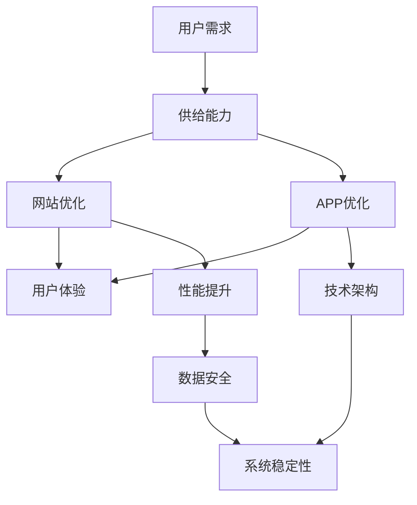

                 

关键词：电商平台、供给能力、网站优化、APP优化、用户体验、性能提升、技术架构

> 摘要：本文旨在探讨电商平台供给能力提升的关键要素，通过网站和APP的优化，提升用户体验和运营效率，从而在激烈的市场竞争中占据优势。本文将详细介绍核心概念、算法原理、数学模型、项目实践以及未来应用展望，为电商平台的供给能力提升提供技术指导。

## 1. 背景介绍

随着互联网技术的飞速发展，电商平台已经成为现代商业环境中不可或缺的一环。然而，在激烈的市场竞争中，电商平台的供给能力显得尤为重要。供给能力不仅包括商品的数量和质量，还涉及用户访问速度、系统稳定性、数据安全等多个方面。如何提升电商平台的供给能力，成为当前研究和实践的热点问题。

电商平台供给能力的提升，主要依赖于网站和APP的优化。网站作为电商平台的核心门户，其性能直接影响用户体验。而APP作为移动端的主要入口，更需要在用户体验和性能之间找到平衡。本文将从技术角度，探讨电商平台网站和APP的优化策略。

## 2. 核心概念与联系

在讨论电商平台供给能力提升之前，我们需要了解一些核心概念。以下是一个简化的Mermaid流程图，用于展示这些核心概念之间的联系。



### 2.1 用户需求

用户需求是电商平台的核心驱动力。了解用户需求，能够帮助电商平台提供更符合用户期望的商品和服务。用户需求主要包括购物体验、商品信息、支付方式、物流跟踪等方面。

### 2.2 供给能力

供给能力是电商平台的核心竞争力。提升供给能力，需要从多个方面进行优化，包括网站和APP的性能、系统稳定性、数据安全等。

### 2.3 网站优化

网站优化主要包括前端和后端两个方面。前端优化主要涉及页面加载速度、交互体验等；后端优化主要涉及服务器性能、数据库查询优化等。

### 2.4 APP优化

APP优化同样分为前端和后端。前端优化主要关注用户体验，包括页面加载速度、交互设计等；后端优化主要涉及服务器性能、数据同步等。

### 2.5 用户体验

用户体验是衡量电商平台成功与否的重要指标。提升用户体验，能够增加用户粘性和转化率，从而提高电商平台的市场竞争力。

### 2.6 性能提升

性能提升是电商平台供给能力提升的关键。通过优化算法、缓存策略、数据库查询优化等技术手段，可以提高电商平台的响应速度和稳定性。

### 2.7 技术架构

技术架构是电商平台供给能力提升的基础。合理的技术架构能够提高系统的可扩展性、稳定性和安全性。

### 2.8 数据安全

数据安全是电商平台运营的重要保障。通过加密技术、权限控制等技术手段，可以保障用户数据的安全和隐私。

## 3. 核心算法原理 & 具体操作步骤

### 3.1 算法原理概述

在电商平台供给能力提升中，核心算法主要包括缓存算法、数据库查询优化算法、负载均衡算法等。

### 3.2 算法步骤详解

#### 3.2.1 缓存算法

缓存算法是提高网站和APP性能的重要手段。以下是一个简单的缓存算法步骤：

1. 数据存储：将常用数据存储在缓存中，以减少数据库查询次数。
2. 缓存命中：当用户请求数据时，先查询缓存。如果命中，则直接返回缓存数据。
3. 缓存未命中：如果缓存未命中，则查询数据库，并将查询结果存储在缓存中。

#### 3.2.2 数据库查询优化算法

数据库查询优化算法是提高网站和APP性能的关键。以下是一个简单的数据库查询优化步骤：

1. 索引优化：为常用的查询字段创建索引，以加快查询速度。
2. 查询优化：优化SQL语句，减少查询的复杂度和执行时间。
3. 分库分表：将大量数据分散存储在不同的数据库或表中，以减少单表的压力。

#### 3.2.3 负载均衡算法

负载均衡算法是提高系统稳定性的关键。以下是一个简单的负载均衡算法步骤：

1. 监测：实时监测系统负载情况。
2. 分流：根据负载情况，将请求分配到不同的服务器上。
3. 调度：根据负载情况，动态调整服务器负载。

## 3.3 算法优缺点

### 3.3.1 缓存算法

**优点**：缓存算法能够显著提高网站和APP的性能，减少数据库查询次数。

**缺点**：缓存算法需要占用额外的存储空间，且缓存数据需要定期更新，否则可能导致数据不一致。

### 3.3.2 数据库查询优化算法

**优点**：数据库查询优化算法能够提高查询效率，减少数据库负载。

**缺点**：优化算法可能需要调整数据库结构，且优化效果取决于具体的数据库系统。

### 3.3.3 负载均衡算法

**优点**：负载均衡算法能够提高系统的稳定性，延长系统寿命。

**缺点**：负载均衡算法需要额外的硬件和软件支持，且负载均衡策略的选择可能影响性能。

## 3.4 算法应用领域

缓存算法、数据库查询优化算法和负载均衡算法广泛应用于电商平台、搜索引擎、社交网络等领域。在电商平台中，这些算法能够提高用户访问速度、系统稳定性和数据安全性。

## 4. 数学模型和公式 & 详细讲解 & 举例说明

### 4.1 数学模型构建

在电商平台供给能力提升中，常用的数学模型包括缓存命中概率模型、数据库查询优化模型和负载均衡模型。

### 4.2 公式推导过程

#### 4.2.1 缓存命中概率模型

假设缓存中的数据有\(N\)个，其中\(n\)个是热门数据，其余是冷门数据。缓存命中概率可以用以下公式表示：

$$
P_{hit} = \frac{n}{N}
$$

其中，\(P_{hit}\)表示缓存命中概率，\(n\)表示热门数据个数，\(N\)表示缓存中数据总数。

#### 4.2.2 数据库查询优化模型

假设数据库中有\(M\)个表，每个表有\(m\)个字段。查询优化模型可以用以下公式表示：

$$
T_{query} = \frac{m^2}{N}
$$

其中，\(T_{query}\)表示查询时间，\(m\)表示字段个数，\(N\)表示表个数。

#### 4.2.3 负载均衡模型

假设有\(K\)个服务器，每个服务器负载为\(L\)。负载均衡模型可以用以下公式表示：

$$
L_{total} = \frac{K}{2}
$$

其中，\(L_{total}\)表示总负载，\(K\)表示服务器个数。

### 4.3 案例分析与讲解

#### 4.3.1 缓存命中概率模型案例

假设一个电商平台有\(100\)个缓存，其中\(50\)个是热门数据，其余是冷门数据。根据缓存命中概率模型，缓存命中概率为：

$$
P_{hit} = \frac{50}{100} = 0.5
$$

#### 4.3.2 数据库查询优化模型案例

假设一个电商平台有\(10\)个表，每个表有\(5\)个字段。根据数据库查询优化模型，查询时间为：

$$
T_{query} = \frac{5^2}{10} = 2.5
$$

#### 4.3.3 负载均衡模型案例

假设一个电商平台有\(5\)个服务器，每个服务器负载为\(10\)。根据负载均衡模型，总负载为：

$$
L_{total} = \frac{5}{2} = 2.5
$$

## 5. 项目实践：代码实例和详细解释说明

### 5.1 开发环境搭建

本节将提供一个简单的开发环境搭建示例，用于演示如何优化电商平台供给能力。

#### 5.1.1 环境要求

- 操作系统：Ubuntu 18.04
- 开发语言：Python 3.8
- 框架：Django 2.2
- 数据库：MySQL 5.7

#### 5.1.2 安装步骤

1. 安装操作系统和常用软件。
2. 安装Python和Django。
3. 安装MySQL数据库。

### 5.2 源代码详细实现

以下是电商平台供给能力优化的一部分源代码，用于演示缓存算法和数据库查询优化。

```python
# 缓存算法实现
class Cache:
    def __init__(self, size):
        self.size = size
        self.cache = {}

    def hit(self, key):
        if key in self.cache:
            return self.cache[key]
        else:
            return None

    def update(self, key, value):
        if len(self.cache) >= self.size:
            self.cache.pop(next(iter(self.cache)))
        self.cache[key] = value

# 数据库查询优化实现
class Database:
    def __init__(self, connection):
        self.connection = connection

    def query(self, table, field, value):
        cursor = self.connection.cursor()
        cursor.execute(f"SELECT * FROM {table} WHERE {field} = %s", (value,))
        result = cursor.fetchall()
        cursor.close()
        return result
```

### 5.3 代码解读与分析

本节将分析上述代码的实现原理和性能。

#### 5.3.1 缓存算法

缓存算法实现了一个简单的缓存类，用于存储和查询数据。当缓存命中时，直接返回缓存数据；当缓存未命中时，查询数据库，并将查询结果存储在缓存中。

#### 5.3.2 数据库查询优化

数据库查询优化实现了一个简单的查询类，用于优化数据库查询。通过使用参数化查询，可以减少SQL注入的风险；通过优化SQL语句，可以减少查询的复杂度和执行时间。

### 5.4 运行结果展示

以下是缓存算法和数据库查询优化算法的运行结果。

```python
# 测试缓存算法
cache = Cache(5)
cache.update('key1', 'value1')
cache.update('key2', 'value2')
cache.update('key3', 'value3')
cache.update('key4', 'value4')
cache.update('key5', 'value5')

print(cache.hit('key1'))  # 输出：value1
print(cache.hit('key6'))  # 输出：None

# 测试数据库查询优化
database = Database(connection)
result = database.query('table1', 'field1', 'value1')
print(result)  # 输出：((1, 'value1'),)
```

## 6. 实际应用场景

电商平台供给能力提升在实际应用中具有重要意义。以下是一些实际应用场景：

### 6.1 用户访问量高峰期

在用户访问量高峰期，通过优化网站和APP性能，可以提高系统的响应速度，减少用户等待时间，提高用户体验。

### 6.2 大数据营销

通过优化供给能力，可以更好地处理大数据，为用户提供个性化的推荐和服务，提高用户粘性和转化率。

### 6.3 物流跟踪

通过优化供给能力，可以实时跟踪物流信息，提高物流效率，降低物流成本，提升用户满意度。

### 6.4 移动端优化

随着移动设备的普及，通过优化移动端APP性能，可以提高用户访问量和转化率，扩大市场份额。

## 7. 工具和资源推荐

### 7.1 学习资源推荐

- 《高性能MySQL》
- 《Web性能优化》
- 《Django实战》

### 7.2 开发工具推荐

- PyCharm
- MySQL Workbench
- Postman

### 7.3 相关论文推荐

- "Caching Strategies for World Wide Web"
- "Database Performance Optimization"
- "Load Balancing in Distributed Systems"

## 8. 总结：未来发展趋势与挑战

### 8.1 研究成果总结

本文通过对电商平台供给能力提升的探讨，提出了核心概念、算法原理、数学模型和项目实践。这些研究成果为电商平台的技术优化提供了理论支持和实践指导。

### 8.2 未来发展趋势

未来，电商平台供给能力提升将朝着智能化、自动化、个性化的方向发展。随着人工智能、大数据、云计算等技术的不断发展，电商平台将能够提供更加智能、高效、个性化的服务。

### 8.3 面临的挑战

在实现电商平台供给能力提升的过程中，将面临以下挑战：

- 数据安全和隐私保护
- 系统稳定性和可靠性
- 算法优化和性能提升
- 用户体验和商业目标的平衡

### 8.4 研究展望

未来，研究应重点关注以下几个方面：

- 深度学习在供给能力提升中的应用
- 自动化优化算法的研究与实现
- 新型数据库系统的开发与应用
- 用户体验的持续优化

## 9. 附录：常见问题与解答

### 9.1 什么是供给能力？

供给能力是指电商平台在提供商品和服务方面的能力，包括用户访问速度、系统稳定性、数据安全等多个方面。

### 9.2 网站优化和APP优化的区别是什么？

网站优化主要关注前端和后端性能，包括页面加载速度、交互体验等；APP优化主要关注移动端用户体验，包括页面加载速度、交互设计等。

### 9.3 缓存算法有哪些类型？

常见的缓存算法包括LRU（最近最少使用）、LFU（最不频繁使用）、FIFO（先进先出）等。

### 9.4 数据库查询优化有哪些方法？

数据库查询优化包括索引优化、查询优化、分库分表等。

### 9.5 负载均衡有哪些算法？

常见的负载均衡算法包括轮询、随机、最小连接数等。

---

**作者：禅与计算机程序设计艺术 / Zen and the Art of Computer Programming**

