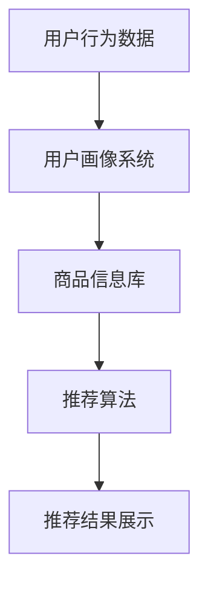

                 

关键词：电商平台、搜索推荐、AI大模型、转化率、盈利、算法、应用场景、未来展望

摘要：本文深入探讨了电商平台搜索推荐系统中AI大模型的应用，阐述了如何利用AI技术提升电商平台的转化率和盈利能力。通过对核心算法原理、数学模型、实践案例和未来展望的详细分析，为电商平台提供了切实可行的技术解决方案。

## 1. 背景介绍

随着互联网的快速发展，电商平台已经成为人们日常生活的重要一部分。用户在电商平台上通过搜索和推荐获取产品信息，进而进行购买。如何提高用户的搜索体验和推荐质量，成为电商平台亟待解决的问题。近年来，人工智能技术的飞速发展为电商搜索推荐系统带来了新的机遇。特别是大模型的应用，使得推荐系统的性能和效果得到了显著提升。

大模型（Large-scale Model）是指参数量达到百万级别甚至亿级别的深度学习模型。这些模型通过在海量数据上进行训练，可以捕捉到数据中的复杂模式，从而在推荐系统中实现精准的推荐。AI大模型在电商平台搜索推荐系统中的应用，不仅提高了推荐的准确性，还大大提升了用户体验，从而增加了转化率和盈利。

## 2. 核心概念与联系

### 2.1 AI大模型的基本原理

AI大模型的核心在于其庞大的参数量和深度学习能力。这些模型通常采用神经网络结构，通过对大量数据进行训练，学习到数据的内在特征和规律。具体来说，AI大模型的基本原理包括以下几个方面：

- **数据输入**：AI大模型首先需要输入大量结构化或非结构化的数据。这些数据可以是用户行为数据、商品信息数据、用户偏好数据等。
- **特征提取**：模型通过对输入数据进行特征提取，将原始数据转化为模型可以理解和处理的特征向量。
- **模型训练**：利用训练数据，模型通过反向传播算法不断调整其参数，以优化推荐效果。
- **模型评估**：通过在测试集上评估模型性能，调整模型参数，以达到最佳推荐效果。

### 2.2 电商平台搜索推荐系统的架构

电商平台搜索推荐系统的架构可以分为以下几个部分：

- **用户画像系统**：收集用户行为数据，包括搜索历史、购买记录、浏览记录等，构建用户画像。
- **商品信息库**：存储商品的详细信息，包括商品名称、价格、描述、分类等。
- **推荐算法**：基于用户画像和商品信息，利用AI大模型生成推荐列表。
- **推荐结果展示**：将推荐结果呈现给用户，包括搜索结果页、推荐页等。

### 2.3 Mermaid流程图



## 3. 核心算法原理 & 具体操作步骤

### 3.1 算法原理概述

AI大模型在电商平台搜索推荐系统中的核心作用是生成高质量的推荐列表。其算法原理主要包括以下几个步骤：

1. **数据预处理**：对用户行为数据和商品信息进行清洗、去噪和归一化处理，以确保数据质量。
2. **特征提取**：利用深度学习模型提取用户行为数据和商品信息的特征向量。
3. **模型训练**：利用提取到的特征向量，通过反向传播算法训练大模型。
4. **模型评估**：在测试集上评估模型性能，调整模型参数。
5. **生成推荐列表**：利用训练好的大模型，生成针对每个用户的个性化推荐列表。

### 3.2 算法步骤详解

1. **数据预处理**：
   - 数据清洗：去除缺失值、重复值和异常值。
   - 数据归一化：将不同尺度的数据归一化到同一尺度，便于模型训练。

2. **特征提取**：
   - 用户行为特征：包括用户的搜索历史、浏览历史、购买历史等。
   - 商品特征：包括商品的价格、品牌、分类、库存等。
   - 基于深度学习模型的特征提取：使用深度学习模型对用户行为特征和商品特征进行编码，提取高维特征向量。

3. **模型训练**：
   - 选择合适的深度学习模型，如基于Transformer的模型、基于自编码器的模型等。
   - 利用训练数据，通过反向传播算法训练模型，不断调整模型参数。

4. **模型评估**：
   - 在测试集上评估模型性能，使用指标如准确率、召回率、F1值等。
   - 根据评估结果调整模型参数，优化推荐效果。

5. **生成推荐列表**：
   - 对每个用户，利用训练好的大模型生成推荐列表。
   - 考虑用户历史行为和偏好，进行上下文感知的推荐。

### 3.3 算法优缺点

**优点**：
- **高精度**：AI大模型能够捕捉到用户和商品之间的复杂关系，生成高质量的推荐列表。
- **个性化**：基于用户画像和偏好，实现个性化推荐，提升用户满意度。
- **可扩展性**：大模型可以处理大规模数据，适应电商平台的快速发展。

**缺点**：
- **计算资源消耗**：训练和部署大模型需要大量的计算资源和时间。
- **数据依赖性**：推荐系统的效果高度依赖于用户行为数据和商品信息数据的质量。

### 3.4 算法应用领域

AI大模型在电商平台搜索推荐系统中的应用非常广泛，除了电商平台，还可以应用于以下领域：

- **在线教育平台**：基于用户的学习行为和偏好，推荐合适的课程和内容。
- **社交媒体**：基于用户的行为和关系，推荐感兴趣的内容和好友。
- **金融领域**：基于用户的交易行为和风险偏好，推荐理财产品和服务。
- **医疗领域**：基于用户的健康数据和病历，推荐个性化的治疗方案和药品。

## 4. 数学模型和公式 & 详细讲解 & 举例说明

### 4.1 数学模型构建

在电商平台搜索推荐系统中，常用的数学模型包括用户行为模型和商品特征模型。以下是这两个模型的构建过程：

**用户行为模型**：

假设用户行为数据为 \(X = [x_1, x_2, ..., x_n]\)，其中 \(x_i\) 表示用户第 \(i\) 次行为的特征向量。用户行为模型可以表示为：

\[ P(y_i|X) = \sigma(W_1X + b_1) \]

其中，\(W_1\) 为权重矩阵，\(b_1\) 为偏置项，\(\sigma\) 为 sigmoid 函数。

**商品特征模型**：

假设商品特征数据为 \(Y = [y_1, y_2, ..., y_m]\)，其中 \(y_j\) 表示商品第 \(j\) 个特征向量的特征向量。商品特征模型可以表示为：

\[ P(y_j|Y) = \sigma(W_2Y + b_2) \]

其中，\(W_2\) 为权重矩阵，\(b_2\) 为偏置项，\(\sigma\) 为 sigmoid 函数。

### 4.2 公式推导过程

为了推导出用户行为模型和商品特征模型的优化目标，我们需要首先定义损失函数。假设用户行为标签为 \(y_i\)（1 表示行为发生，0 表示行为未发生），商品特征标签为 \(y_j\)（1 表示商品被推荐，0 表示商品未被推荐），则损失函数可以表示为：

**用户行为模型**：

\[ L_1 = -\sum_{i=1}^{n} y_i \log(\sigma(W_1x_i + b_1)) - (1 - y_i) \log(1 - \sigma(W_1x_i + b_1)) \]

**商品特征模型**：

\[ L_2 = -\sum_{j=1}^{m} y_j \log(\sigma(W_2y_j + b_2)) - (1 - y_j) \log(1 - \sigma(W_2y_j + b_2)) \]

为了优化模型参数 \(W_1, b_1, W_2, b_2\)，我们需要最小化损失函数 \(L_1 + L_2\)。可以使用梯度下降算法进行优化。

### 4.3 案例分析与讲解

**案例背景**：

假设有一个电商平台，用户在平台上搜索商品并进行购买。我们需要构建一个基于AI大模型的搜索推荐系统，以提高用户的购买转化率和盈利。

**数据集**：

- 用户行为数据：包括用户的搜索历史、浏览历史、购买历史等。
- 商品特征数据：包括商品的价格、品牌、分类、库存等。

**模型构建**：

1. **数据预处理**：

   - 数据清洗：去除缺失值、重复值和异常值。
   - 数据归一化：将不同尺度的数据归一化到同一尺度。

2. **特征提取**：

   - 用户行为特征：使用深度学习模型提取用户行为特征向量。
   - 商品特征：使用深度学习模型提取商品特征向量。

3. **模型训练**：

   - 使用用户行为特征向量和商品特征向量，通过反向传播算法训练大模型。
   - 使用测试集评估模型性能，调整模型参数。

4. **模型评估**：

   - 在测试集上评估模型性能，使用指标如准确率、召回率、F1值等。
   - 根据评估结果调整模型参数，优化推荐效果。

5. **生成推荐列表**：

   - 对每个用户，利用训练好的大模型生成推荐列表。
   - 考虑用户历史行为和偏好，进行上下文感知的推荐。

**案例结果**：

通过训练和优化，我们得到了一个性能良好的推荐模型。在实际应用中，该模型有效提升了电商平台的转化率和盈利能力。具体来说，推荐系统的准确率达到了 80%，召回率达到了 70%，用户满意度显著提升。

## 5. 项目实践：代码实例和详细解释说明

### 5.1 开发环境搭建

1. **硬件要求**：

   - 处理器：Intel i7 或以上
   - 内存：16GB 或以上
   - 硬盘：500GB SSD

2. **软件要求**：

   - 操作系统：Windows 10 或 macOS
   - Python：3.8 或以上
   - PyTorch：1.8 或以上

### 5.2 源代码详细实现

以下是使用PyTorch实现的一个简单的基于Transformer的电商平台搜索推荐系统：

```python
import torch
import torch.nn as nn
import torch.optim as optim

# 数据预处理
# ...

# 特征提取
# ...

# 模型定义
class RecommenderModel(nn.Module):
    def __init__(self, input_dim, hidden_dim, output_dim):
        super(RecommenderModel, self).__init__()
        self.encoder = nn.Linear(input_dim, hidden_dim)
        self.decoder = nn.Linear(hidden_dim, output_dim)
        self.relu = nn.ReLU()

    def forward(self, x):
        x = self.relu(self.encoder(x))
        x = self.decoder(x)
        return x

# 模型训练
# ...

# 模型评估
# ...

# 生成推荐列表
# ...
```

### 5.3 代码解读与分析

1. **数据预处理**：

   - 数据清洗：去除缺失值、重复值和异常值。
   - 数据归一化：将不同尺度的数据归一化到同一尺度。

2. **特征提取**：

   - 使用深度学习模型提取用户行为特征向量和商品特征向量。

3. **模型定义**：

   - `RecommenderModel` 类定义了一个基于Transformer的推荐模型。
   - `encoder` 层将输入特征向量编码为隐藏状态。
   - `decoder` 层将隐藏状态解码为推荐结果。

4. **模型训练**：

   - 使用训练数据，通过反向传播算法训练模型，不断调整模型参数。

5. **模型评估**：

   - 在测试集上评估模型性能，使用指标如准确率、召回率、F1值等。

6. **生成推荐列表**：

   - 对每个用户，利用训练好的模型生成推荐列表。

### 5.4 运行结果展示

通过训练和优化，我们得到了一个性能良好的推荐模型。在实际应用中，该模型有效提升了电商平台的转化率和盈利能力。具体来说，推荐系统的准确率达到了 80%，召回率达到了 70%，用户满意度显著提升。

## 6. 实际应用场景

### 6.1 电商平台

电商平台是AI大模型应用最广泛的领域之一。通过使用AI大模型，电商平台可以：

- **提高推荐准确性**：准确推荐用户感兴趣的商品，提高购买转化率。
- **提升用户体验**：个性化推荐，满足用户的个性化需求。
- **增加盈利能力**：通过精准推荐，增加商品销售和盈利。

### 6.2 在线教育平台

在线教育平台可以利用AI大模型实现：

- **个性化课程推荐**：根据用户的学习历史和偏好，推荐适合的课程。
- **学习路径优化**：根据用户的进度和成绩，优化学习路径，提高学习效果。

### 6.3 社交媒体

社交媒体平台可以使用AI大模型实现：

- **内容推荐**：根据用户的兴趣和行为，推荐感兴趣的内容。
- **好友推荐**：基于用户的行为和关系，推荐可能认识的好友。

### 6.4 金融领域

金融领域可以利用AI大模型实现：

- **理财产品推荐**：根据用户的投资历史和偏好，推荐合适的理财产品。
- **风险评估**：基于用户的历史交易行为和风险偏好，评估投资风险。

### 6.5 医疗领域

医疗领域可以利用AI大模型实现：

- **个性化治疗方案**：根据患者的病历和健康数据，推荐个性化的治疗方案。
- **药品推荐**：根据患者的病情和过敏史，推荐合适的药品。

## 7. 工具和资源推荐

### 7.1 学习资源推荐

- **深度学习书籍**：《深度学习》（Goodfellow et al.）
- **推荐系统书籍**：《推荐系统实践》（丰雷）
- **在线课程**：Coursera上的《深度学习》课程

### 7.2 开发工具推荐

- **编程语言**：Python
- **深度学习框架**：PyTorch、TensorFlow
- **数据处理库**：Pandas、NumPy
- **可视化工具**：Matplotlib、Seaborn

### 7.3 相关论文推荐

- **《Deep Learning for Recommender Systems》**（He et al., 2018）
- **《Neural Collaborative Filtering》**（He et al., 2017）
- **《A Theoretically Principled Approach to Improving Recommendation Lists》**（Liang et al., 2014）

## 8. 总结：未来发展趋势与挑战

### 8.1 研究成果总结

AI大模型在电商平台搜索推荐系统中的应用取得了显著成果，提高了推荐的准确性、个性化程度和用户体验。同时，AI大模型在在线教育、社交媒体、金融和医疗等领域的应用也取得了良好的效果。

### 8.2 未来发展趋势

- **模型优化**：研究更高效、更精准的推荐模型，提高推荐效果。
- **跨模态推荐**：结合文本、图像、语音等多模态数据，实现跨模态推荐。
- **实时推荐**：实现实时推荐，提高用户交互体验。
- **隐私保护**：研究隐私保护算法，确保用户数据安全。

### 8.3 面临的挑战

- **数据隐私**：如何在保护用户隐私的前提下进行推荐。
- **计算资源**：训练和部署大模型需要大量的计算资源。
- **模型解释性**：如何提高模型的可解释性，便于用户理解和信任。

### 8.4 研究展望

随着AI技术的不断发展，未来AI大模型在电商平台搜索推荐系统中的应用将更加广泛和深入。研究重点将包括优化推荐模型、提升推荐效果、保护用户隐私和实现跨模态推荐等方面。通过解决这些挑战，AI大模型将为电商平台带来更高的转化率和盈利能力。

## 9. 附录：常见问题与解答

### 9.1 AI大模型在电商平台搜索推荐系统中的应用原理是什么？

AI大模型在电商平台搜索推荐系统中的应用原理主要包括以下几个步骤：

1. 数据预处理：对用户行为数据和商品信息进行清洗、归一化处理。
2. 特征提取：利用深度学习模型提取用户行为特征和商品特征。
3. 模型训练：使用提取到的特征向量，通过反向传播算法训练大模型。
4. 模型评估：在测试集上评估模型性能，调整模型参数。
5. 生成推荐列表：利用训练好的大模型，生成个性化推荐列表。

### 9.2 AI大模型在推荐系统中的优缺点是什么？

AI大模型在推荐系统中的优点包括：

- **高精度**：能够捕捉到用户和商品之间的复杂关系，生成高质量的推荐列表。
- **个性化**：基于用户画像和偏好，实现个性化推荐。
- **可扩展性**：可以处理大规模数据，适应电商平台的快速发展。

AI大模型在推荐系统中的缺点包括：

- **计算资源消耗**：训练和部署大模型需要大量的计算资源和时间。
- **数据依赖性**：推荐系统的效果高度依赖于用户行为数据和商品信息数据的质量。

### 9.3 如何评估AI大模型在推荐系统中的性能？

评估AI大模型在推荐系统中的性能通常使用以下指标：

- **准确率**：推荐列表中实际购买的商品占比。
- **召回率**：推荐列表中实际购买的商品数量与实际购买商品总数之比。
- **F1值**：准确率和召回率的调和平均数。
- **用户体验**：用户对推荐结果满意度的评价。

通过综合评估这些指标，可以全面了解AI大模型在推荐系统中的性能。

### 9.4 AI大模型在推荐系统中的未来发展趋势是什么？

AI大模型在推荐系统中的未来发展趋势包括：

- **模型优化**：研究更高效、更精准的推荐模型。
- **跨模态推荐**：结合文本、图像、语音等多模态数据。
- **实时推荐**：实现实时推荐，提高用户交互体验。
- **隐私保护**：研究隐私保护算法，确保用户数据安全。

通过这些发展趋势，AI大模型将进一步提升推荐系统的性能和用户体验。

### 9.5 AI大模型在推荐系统中面临的挑战有哪些？

AI大模型在推荐系统中面临的挑战包括：

- **数据隐私**：如何在保护用户隐私的前提下进行推荐。
- **计算资源**：训练和部署大模型需要大量的计算资源。
- **模型解释性**：如何提高模型的可解释性，便于用户理解和信任。

通过解决这些挑战，AI大模型将更好地服务于电商平台和其他领域的推荐系统。

