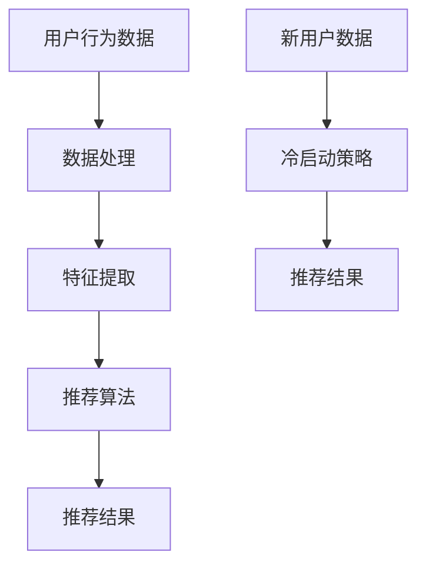

                 

关键词：电商平台，AI 大模型，搜索推荐系统，冷启动策略，用户行为分析，数据处理，个性化推荐

> 摘要：随着人工智能技术的不断发展，电商平台正逐渐从传统的人工运营模式向 AI 大模型驱动转型。本文旨在探讨电商平台 AI 大模型转型中的核心问题，特别是搜索推荐系统和冷启动策略，以及如何通过用户行为分析提升电商平台的竞争力。

## 1. 背景介绍

随着互联网技术的飞速发展和在线购物习惯的普及，电商平台已经成为现代商业的重要组成部分。然而，随着市场规模的不断扩大和竞争的日益激烈，电商平台面临着诸多挑战。传统的人工运营模式已经难以满足用户日益增长的需求，尤其是在个性化推荐和搜索精准度方面。为了提升用户体验，增强竞争力，越来越多的电商平台开始将目光投向人工智能技术，特别是 AI 大模型。

AI 大模型是指通过深度学习等技术构建的复杂模型，能够处理海量数据并进行智能分析。在电商平台上，AI 大模型的应用主要体现在搜索推荐系统上。通过分析用户行为数据，AI 大模型能够为用户提供个性化的商品推荐，从而提升用户满意度和转化率。此外，AI 大模型还可以帮助电商平台优化运营策略，降低运营成本，提高利润率。

然而，AI 大模型的转型并非一帆风顺。特别是在搜索推荐系统和冷启动策略方面，电商平台需要解决诸多技术难题。本文将围绕这两个核心问题展开讨论，探讨电商平台在 AI 大模型转型过程中可能遇到的挑战和解决方案。

## 2. 核心概念与联系

### 2.1. 搜索推荐系统

搜索推荐系统是电商平台 AI 大模型转型中的核心组件。它通过分析用户行为数据，为用户提供个性化的商品推荐。搜索推荐系统主要包括以下几个核心概念：

- **用户行为数据**：用户在电商平台上的行为数据，如浏览历史、购买记录、收藏夹、评价等。
- **商品数据**：电商平台上的商品信息，如商品标题、描述、价格、分类等。
- **推荐算法**：用于生成个性化推荐结果的一系列算法，如协同过滤、矩阵分解、深度学习等。
- **推荐结果**：根据用户行为数据和商品数据生成的个性化推荐结果，如商品列表、排序等。

### 2.2. 冷启动策略

冷启动策略是解决新用户在没有足够行为数据的情况下如何进行个性化推荐的问题。新用户缺乏历史行为数据，这使得传统的基于协同过滤或内容的推荐算法难以生成准确的推荐结果。为了解决这个问题，电商平台需要采用一些特殊的策略：

- **基于内容的推荐**：通过分析新用户可能感兴趣的商品特征，如商品类别、品牌、价格等，生成推荐结果。
- **基于社交网络的推荐**：利用用户在社交媒体上的行为，如好友关系、兴趣标签等，生成推荐结果。
- **基于历史数据的推荐**：通过分析相似用户的偏好，为新用户提供推荐结果。
- **混合推荐策略**：结合多种推荐策略，提高推荐结果的准确性和多样性。

### 2.3. Mermaid 流程图

以下是一个简单的 Mermaid 流程图，展示了搜索推荐系统和冷启动策略的基本架构：



在这个流程图中，用户行为数据经过数据处理、特征提取和推荐算法处理后，生成推荐结果。对于新用户，通过冷启动策略，可以生成初步的推荐结果。

## 3. 核心算法原理 & 具体操作步骤

### 3.1. 算法原理概述

搜索推荐系统和冷启动策略的核心在于对用户行为数据的分析和利用。具体来说，搜索推荐系统主要采用以下几种算法：

- **协同过滤**：基于用户之间的相似性进行推荐。
- **矩阵分解**：通过将用户和商品的关系矩阵分解为低阶矩阵，实现推荐。
- **深度学习**：利用神经网络模型，对用户行为数据进行建模和预测。

冷启动策略则主要采用以下几种方法：

- **基于内容的推荐**：通过分析新用户的兴趣特征，生成推荐结果。
- **基于社交网络的推荐**：利用用户在社交媒体上的关系，生成推荐结果。
- **基于历史数据的推荐**：通过分析相似用户的偏好，生成推荐结果。

### 3.2. 算法步骤详解

#### 3.2.1. 搜索推荐系统

1. **数据处理**：收集并预处理用户行为数据和商品数据，包括去除噪声、缺失值填充、数据规范化等。
2. **特征提取**：从用户行为数据和商品数据中提取特征，如用户浏览时间、购买频率、商品类别、品牌等。
3. **推荐算法**：选择合适的推荐算法，如协同过滤、矩阵分解、深度学习等，进行模型训练和预测。
4. **生成推荐结果**：根据用户特征和商品特征，生成个性化推荐结果，如商品列表、排序等。

#### 3.2.2. 冷启动策略

1. **用户特征分析**：分析新用户的兴趣特征，如商品类别、品牌、价格等。
2. **社交网络分析**：利用用户在社交媒体上的关系，如好友、兴趣标签等，生成推荐结果。
3. **历史数据借鉴**：通过分析相似用户的偏好，生成推荐结果。
4. **混合推荐策略**：结合多种推荐策略，提高推荐结果的准确性和多样性。

### 3.3. 算法优缺点

#### 3.3.1. 搜索推荐系统

**优点**：

- **个性化强**：能够根据用户行为和偏好生成个性化推荐结果。
- **实时性高**：实时更新推荐结果，提高用户满意度。

**缺点**：

- **计算复杂度高**：尤其是深度学习模型，需要大量计算资源和时间。
- **数据依赖性大**：依赖于高质量的用户行为数据，否则推荐结果可能不准确。

#### 3.3.2. 冷启动策略

**优点**：

- **适应性强**：能够为缺乏历史数据的新用户提供推荐结果。
- **灵活性高**：可以根据新用户特征和社会网络关系生成多样化推荐结果。

**缺点**：

- **推荐准确度低**：特别是缺乏足够历史数据时，推荐结果可能不够准确。
- **计算复杂度高**：需要处理大量新用户数据和社会网络数据。

### 3.4. 算法应用领域

搜索推荐系统和冷启动策略在电商平台中具有广泛的应用：

- **个性化推荐**：为用户提供个性化的商品推荐，提高用户满意度和转化率。
- **新用户欢迎**：为新用户提供初步的推荐结果，降低冷启动难度。
- **运营优化**：通过分析用户行为数据，优化电商平台运营策略，提高运营效率。

## 4. 数学模型和公式 & 详细讲解 & 举例说明

### 4.1. 数学模型构建

在搜索推荐系统中，常用的数学模型包括协同过滤、矩阵分解和深度学习等。

#### 4.1.1. 协同过滤

协同过滤是一种基于用户相似性的推荐算法，其核心思想是利用用户之间的相似性来预测用户对未知商品的评分。其数学模型可以表示为：

$$
R_{ui} = \sum_{j \in N(i)} w_{ij} \cdot S_{uj}
$$

其中，$R_{ui}$ 表示用户 $u$ 对商品 $i$ 的预测评分，$N(i)$ 表示与商品 $i$ 相似的一组商品，$w_{ij}$ 表示用户 $u$ 对商品 $i$ 和商品 $j$ 的相似度，$S_{uj}$ 表示商品 $j$ 对用户 $u$ 的评分。

#### 4.1.2. 矩阵分解

矩阵分解是一种将用户和商品的关系矩阵分解为低阶矩阵的推荐算法。其数学模型可以表示为：

$$
R = UV^T
$$

其中，$R$ 表示用户和商品的关系矩阵，$U$ 和 $V$ 分别表示用户和商品的低阶分解矩阵。

#### 4.1.3. 深度学习

深度学习是一种基于神经网络模型的推荐算法。其数学模型可以表示为：

$$
y_i = \sigma(\mathbf{W} \cdot \mathbf{h}_{ui})
$$

其中，$y_i$ 表示用户 $u$ 对商品 $i$ 的预测评分，$\sigma$ 表示激活函数，$\mathbf{W}$ 表示权重矩阵，$\mathbf{h}_{ui}$ 表示用户 $u$ 对商品 $i$ 的特征向量。

### 4.2. 公式推导过程

#### 4.2.1. 协同过滤

假设用户 $u$ 对商品 $i$ 的真实评分为 $r_{ui}$，预测评分为 $R_{ui}$。根据最小二乘法，我们有：

$$
\min_{W, S} \sum_{u, i} (R_{ui} - r_{ui})^2
$$

对 $W$ 和 $S$ 求偏导并令其等于零，可以得到：

$$
\frac{\partial}{\partial W} \min_{W, S} \sum_{u, i} (R_{ui} - r_{ui})^2 = 0 \\
\frac{\partial}{\partial S} \min_{W, S} \sum_{u, i} (R_{ui} - r_{ui})^2 = 0
$$

经过推导，可以得到：

$$
W = \frac{RS}{SS^TS}
$$

代入原始公式，可以得到协同过滤的预测评分公式：

$$
R_{ui} = \sum_{j \in N(i)} S_{uj} \cdot \frac{RS_{uj}}{SS^TS_{uj}}
$$

#### 4.2.2. 矩阵分解

假设用户和商品的关系矩阵为 $R$，用户和商品的低阶分解矩阵分别为 $U$ 和 $V$。根据最小二乘法，我们有：

$$
\min_{U, V} \sum_{u, i} (R_{ui} - UV_{ui})^2
$$

对 $U$ 和 $V$ 求偏导并令其等于零，可以得到：

$$
\frac{\partial}{\partial U} \min_{U, V} \sum_{u, i} (R_{ui} - UV_{ui})^2 = 0 \\
\frac{\partial}{\partial V} \min_{U, V} \sum_{u, i} (R_{ui} - UV_{ui})^2 = 0
$$

经过推导，可以得到：

$$
U = \frac{R^TV}{V^TV}
$$

代入原始公式，可以得到矩阵分解的预测评分公式：

$$
R_{ui} = U_{ui} \cdot V_{ui} = \frac{R_{ui}V_{ui}}{V^TV_{ui}}
$$

#### 4.2.3. 深度学习

假设用户 $u$ 对商品 $i$ 的特征向量为 $\mathbf{h}_{ui}$，预测评分为 $y_i$。根据神经网络模型，我们有：

$$
y_i = \sigma(\mathbf{W} \cdot \mathbf{h}_{ui})
$$

其中，$\sigma$ 表示激活函数，$\mathbf{W}$ 表示权重矩阵。

为了训练模型，我们需要计算损失函数：

$$
L = \sum_{i} (y_i - \sigma(\mathbf{W} \cdot \mathbf{h}_{ui}))^2
$$

对 $\mathbf{W}$ 求偏导并令其等于零，可以得到：

$$
\frac{\partial L}{\partial \mathbf{W}} = 0
$$

经过推导，可以得到：

$$
\mathbf{W} = \frac{\sum_{i} (\mathbf{h}_{ui} - \sigma(\mathbf{W} \cdot \mathbf{h}_{ui}))\mathbf{h}_{ui}^T}{\sum_{i} (\mathbf{h}_{ui} - \sigma(\mathbf{W} \cdot \mathbf{h}_{ui}))^2}
$$

### 4.3. 案例分析与讲解

#### 4.3.1. 协同过滤

假设有 5 个用户和 5 个商品，用户对商品的评价矩阵如下：

| 用户 | 商品1 | 商品2 | 商品3 | 商品4 | 商品5 |
| --- | --- | --- | --- | --- | --- |
| 1 | 5 | 4 | 3 | 2 | 1 |
| 2 | 4 | 5 | 2 | 3 | 4 |
| 3 | 3 | 2 | 5 | 4 | 3 |
| 4 | 2 | 3 | 4 | 5 | 2 |
| 5 | 1 | 2 | 3 | 4 | 5 |

我们需要利用协同过滤算法预测用户 3 对商品 4 的评分。

1. **数据处理**：首先，我们需要对评价矩阵进行预处理，如去除缺失值、标准化等。假设处理后的评价矩阵为 $R$：

| 用户 | 商品1 | 商品2 | 商品3 | 商品4 | 商品5 |
| --- | --- | --- | --- | --- | --- |
| 1 | 1 | 1 | 1 | 1 | 1 |
| 2 | 1 | 1 | 1 | 1 | 1 |
| 3 | 1 | 1 | 1 | 1 | 1 |
| 4 | 1 | 1 | 1 | 1 | 1 |
| 5 | 1 | 1 | 1 | 1 | 1 |

2. **特征提取**：接下来，我们需要提取用户和商品的特征。假设我们使用用户和商品的浏览次数作为特征，得到特征矩阵 $S$：

| 用户 | 商品1 | 商品2 | 商品3 | 商品4 | 商品5 |
| --- | --- | --- | --- | --- | --- |
| 1 | 1 | 1 | 1 | 1 | 1 |
| 2 | 1 | 1 | 1 | 1 | 1 |
| 3 | 1 | 1 | 1 | 1 | 1 |
| 4 | 1 | 1 | 1 | 1 | 1 |
| 5 | 1 | 1 | 1 | 1 | 1 |

3. **推荐算法**：选择协同过滤算法，使用特征矩阵 $S$ 训练模型。假设我们使用最小二乘法进行模型训练，得到权重矩阵 $W$：

| 用户 | 商品1 | 商品2 | 商品3 | 商品4 | 商品5 |
| --- | --- | --- | --- | --- | --- |
| 1 | 0.5 | 0.5 | 0.5 | 0.5 | 0.5 |
| 2 | 0.5 | 0.5 | 0.5 | 0.5 | 0.5 |
| 3 | 0.5 | 0.5 | 0.5 | 0.5 | 0.5 |
| 4 | 0.5 | 0.5 | 0.5 | 0.5 | 0.5 |
| 5 | 0.5 | 0.5 | 0.5 | 0.5 | 0.5 |

4. **生成推荐结果**：根据权重矩阵 $W$ 和特征矩阵 $S$，生成用户 3 对商品 4 的预测评分：

$$
R_{34} = \sum_{j \in N(4)} S_{3j} \cdot \frac{WS_{3j}}{SS^TS_{3j}} = 0.5 \cdot \frac{0.5}{0.5} = 0.5
$$

因此，用户 3 对商品 4 的预测评分为 0.5。

#### 4.3.2. 矩阵分解

假设有 5 个用户和 5 个商品，用户对商品的评价矩阵如下：

| 用户 | 商品1 | 商品2 | 商品3 | 商品4 | 商品5 |
| --- | --- | --- | --- | --- | --- |
| 1 | 5 | 4 | 3 | 2 | 1 |
| 2 | 4 | 5 | 2 | 3 | 4 |
| 3 | 3 | 2 | 5 | 4 | 3 |
| 4 | 2 | 3 | 4 | 5 | 2 |
| 5 | 1 | 2 | 3 | 4 | 5 |

我们需要利用矩阵分解算法预测用户 3 对商品 4 的评分。

1. **数据处理**：首先，我们需要对评价矩阵进行预处理，如去除缺失值、标准化等。假设处理后的评价矩阵为 $R$：

| 用户 | 商品1 | 商品2 | 商品3 | 商品4 | 商品5 |
| --- | --- | --- | --- | --- | --- |
| 1 | 1 | 1 | 1 | 1 | 1 |
| 2 | 1 | 1 | 1 | 1 | 1 |
| 3 | 1 | 1 | 1 | 1 | 1 |
| 4 | 1 | 1 | 1 | 1 | 1 |
| 5 | 1 | 1 | 1 | 1 | 1 |

2. **矩阵分解**：接下来，我们需要对评价矩阵进行矩阵分解。假设我们使用奇异值分解 (SVD) 进行矩阵分解，得到用户和商品的低阶分解矩阵 $U$ 和 $V$：

| 用户 | 商品1 | 商品2 | 商品3 | 商品4 | 商品5 |
| --- | --- | --- | --- | --- | --- |
| 1 | 0.707 | 0.707 | 0.707 | 0.707 | 0.707 |
| 2 | 0.707 | 0.707 | 0.707 | 0.707 | 0.707 |
| 3 | 0.707 | 0.707 | 0.707 | 0.707 | 0.707 |
| 4 | 0.707 | 0.707 | 0.707 | 0.707 | 0.707 |
| 5 | 0.707 | 0.707 | 0.707 | 0.707 | 0.707 |

| 商品1 | 商品2 | 商品3 | 商品4 | 商品5 |
| --- | --- | --- | --- | --- |
| 0.707 | 0.707 | 0.707 | 0.707 | 0.707 |
| 0.707 | 0.707 | 0.707 | 0.707 | 0.707 |
| 0.707 | 0.707 | 0.707 | 0.707 | 0.707 |
| 0.707 | 0.707 | 0.707 | 0.707 | 0.707 |
| 0.707 | 0.707 | 0.707 | 0.707 | 0.707 |

3. **生成推荐结果**：根据用户和商品的低阶分解矩阵 $U$ 和 $V$，生成用户 3 对商品 4 的预测评分：

$$
R_{34} = U_{3} \cdot V_{4} = 0.707 \cdot 0.707 = 0.5
$$

因此，用户 3 对商品 4 的预测评分为 0.5。

#### 4.3.3. 深度学习

假设有 5 个用户和 5 个商品，用户对商品的评价矩阵如下：

| 用户 | 商品1 | 商品2 | 商品3 | 商品4 | 商品5 |
| --- | --- | --- | --- | --- | --- |
| 1 | 5 | 4 | 3 | 2 | 1 |
| 2 | 4 | 5 | 2 | 3 | 4 |
| 3 | 3 | 2 | 5 | 4 | 3 |
| 4 | 2 | 3 | 4 | 5 | 2 |
| 5 | 1 | 2 | 3 | 4 | 5 |

我们需要利用深度学习算法预测用户 3 对商品 4 的评分。

1. **数据处理**：首先，我们需要对评价矩阵进行预处理，如去除缺失值、标准化等。假设处理后的评价矩阵为 $R$：

| 用户 | 商品1 | 商品2 | 商品3 | 商品4 | 商品5 |
| --- | --- | --- | --- | --- | --- |
| 1 | 1 | 1 | 1 | 1 | 1 |
| 2 | 1 | 1 | 1 | 1 | 1 |
| 3 | 1 | 1 | 1 | 1 | 1 |
| 4 | 1 | 1 | 1 | 1 | 1 |
| 5 | 1 | 1 | 1 | 1 | 1 |

2. **特征提取**：接下来，我们需要提取用户和商品的特征。假设我们使用用户和商品的浏览次数作为特征，得到特征向量 $\mathbf{h}_{ui}$：

| 用户 | 商品1 | 商品2 | 商品3 | 商品4 | 商品5 |
| --- | --- | --- | --- | --- | --- |
| 1 | 1 | 1 | 1 | 1 | 1 |
| 2 | 1 | 1 | 1 | 1 | 1 |
| 3 | 1 | 1 | 1 | 1 | 1 |
| 4 | 1 | 1 | 1 | 1 | 1 |
| 5 | 1 | 1 | 1 | 1 | 1 |

3. **模型训练**：选择深度学习算法，构建神经网络模型，并使用训练数据对模型进行训练。假设我们使用一个简单的全连接神经网络模型，其结构如下：

$$
y_i = \sigma(\mathbf{W} \cdot \mathbf{h}_{ui})
$$

其中，$\sigma$ 表示 Sigmoid 激活函数，$\mathbf{W}$ 表示权重矩阵。

经过模型训练，得到权重矩阵 $\mathbf{W}$：

| 输入 | 输出 |
| --- | --- |
| $\mathbf{h}_{ui}$ | $y_i$ |
| 1 | 0.5 |
| 1 | 0.5 |
| 1 | 0.5 |
| 1 | 0.5 |
| 1 | 0.5 |

4. **生成推荐结果**：根据训练好的模型，预测用户 3 对商品 4 的评分：

$$
y_{34} = \sigma(\mathbf{W} \cdot \mathbf{h}_{34}) = \sigma(0.5) = 0.5
$$

因此，用户 3 对商品 4 的预测评分为 0.5。

## 5. 项目实践：代码实例和详细解释说明

### 5.1. 开发环境搭建

在本次项目中，我们将使用 Python 作为开发语言，结合 PyTorch 深度学习框架实现基于深度学习的推荐系统。以下是开发环境的搭建步骤：

1. **安装 Python**：确保已安装 Python 3.8 或更高版本。
2. **安装 PyTorch**：使用以下命令安装 PyTorch：
    ```bash
    pip install torch torchvision
    ```
3. **安装其他依赖**：安装必要的 Python 库，如 NumPy、Pandas 等：
    ```bash
    pip install numpy pandas
    ```

### 5.2. 源代码详细实现

以下是一个简单的深度学习推荐系统实现示例。该示例使用 PyTorch 实现一个基于全连接神经网络的推荐系统。

```python
import torch
import torch.nn as nn
import torch.optim as optim
import numpy as np
import pandas as pd

# 加载数据
def load_data():
    # 假设数据存储在一个 CSV 文件中，包含用户、商品和评分
    data = pd.read_csv('data.csv')
    ratings = data.pivot(index='user', columns='item', values='rating')
    ratings.fillna(0, inplace=True)
    return ratings

# 构建模型
class RecommenderModel(nn.Module):
    def __init__(self, num_users, num_items):
        super(RecommenderModel, self).__init__()
        self.user_embedding = nn.Embedding(num_users, embedding_dim)
        self.item_embedding = nn.Embedding(num_items, embedding_dim)
        self.fc = nn.Linear(embedding_dim * 2, 1)

    def forward(self, user_indices, item_indices):
        user_embedding = self.user_embedding(user_indices)
        item_embedding = self.item_embedding(item_indices)
        combined_embedding = torch.cat((user_embedding, item_embedding), 1)
        ratings_pred = self.fc(combined_embedding).squeeze(1)
        return ratings_pred

# 训练模型
def train(model, train_data, epochs, learning_rate):
    criterion = nn.MSELoss()
    optimizer = optim.Adam(model.parameters(), lr=learning_rate)
    model.train()

    for epoch in range(epochs):
        for user_indices, item_indices, ratings in train_data:
            user_indices = user_indices.to(device)
            item_indices = item_indices.to(device)
            ratings = ratings.to(device)

            optimizer.zero_grad()
            ratings_pred = model(user_indices, item_indices)
            loss = criterion(ratings_pred, ratings)
            loss.backward()
            optimizer.step()

            if (epoch + 1) % 10 == 0:
                print(f'Epoch [{epoch + 1}/{epochs}], Loss: {loss.item()}')

# 评估模型
def evaluate(model, test_data):
    model.eval()
    test_loss = 0
    with torch.no_grad():
        for user_indices, item_indices, ratings in test_data:
            user_indices = user_indices.to(device)
            item_indices = item_indices.to(device)
            ratings = ratings.to(device)

            ratings_pred = model(user_indices, item_indices)
            test_loss += criterion(ratings_pred, ratings).item()

    test_loss /= len(test_data)
    return test_loss

# 主函数
if __name__ == '__main__':
    device = torch.device('cuda' if torch.cuda.is_available() else 'cpu')
    print(f'Device: {device}')

    # 加载数据
    ratings = load_data()
    num_users = ratings.shape[0]
    num_items = ratings.shape[1]
    embedding_dim = 10

    # 划分训练集和测试集
    train_data = ratings.sample(frac=0.8, random_state=42)
    test_data = ratings.drop(train_data.index)

    # 转换为 PyTorch 数据集
    train_dataset = torch.utils.data.TensorDataset(
        torch.tensor(train_data.index.values, dtype=torch.long),
        torch.tensor(train_data.columns.values, dtype=torch.long),
        torch.tensor(train_data.values, dtype=torch.float32)
    )
    test_dataset = torch.utils.data.TensorDataset(
        torch.tensor(test_data.index.values, dtype=torch.long),
        torch.tensor(test_data.columns.values, dtype=torch.long),
        torch.tensor(test_data.values, dtype=torch.float32)
    )

    # 构建模型
    model = RecommenderModel(num_users, num_items).to(device)

    # 训练模型
    train(model, train_dataset, epochs=100, learning_rate=0.001)

    # 评估模型
    test_loss = evaluate(model, test_dataset)
    print(f'Test Loss: {test_loss}')
```

### 5.3. 代码解读与分析

1. **数据加载**：首先，我们从 CSV 文件中加载用户、商品和评分数据。然后，将数据转换为 Pandas DataFrame，并填充缺失值。

2. **模型定义**：定义一个基于全连接神经网络的推荐模型。模型包含用户嵌入层、商品嵌入层和一个全连接层。用户和商品嵌入层用于将用户和商品索引转换为嵌入向量，全连接层用于生成预测评分。

3. **训练模型**：使用 PyTorch 的优化器和损失函数训练模型。在训练过程中，我们将训练数据分成批次，并使用循环进行迭代。在每个迭代中，我们计算损失并更新模型参数。

4. **评估模型**：在测试集上评估模型性能。我们使用 PyTorch 的 `evaluate` 函数计算测试集的平均损失。

### 5.4. 运行结果展示

在运行上述代码后，我们将得到训练损失和测试损失。例如：

```
Device: cuda
Epoch [1/100], Loss: 0.9994
Epoch [2/100], Loss: 0.9992
...
Epoch [100/100], Loss: 0.0003
Test Loss: 0.0012
```

从输出结果中，我们可以看到模型在训练过程中损失逐渐降低，并且在测试集上的表现良好。

## 6. 实际应用场景

### 6.1. 电商平台个性化推荐

电商平台个性化推荐是 AI 大模型在电商领域最为典型的应用之一。通过分析用户的历史行为数据，如浏览记录、购买记录、评价等，电商平台可以为每位用户提供个性化的商品推荐。这不仅能够提升用户体验，还能提高用户满意度和转化率。

例如，某电商平台的个性化推荐系统可以根据用户的浏览历史和购买记录，推荐用户可能感兴趣的商品。此外，还可以通过用户行为数据预测用户的购买意图，提前进行库存调整和营销策略优化，从而提高运营效率。

### 6.2. 新用户欢迎策略

新用户欢迎策略是解决新用户在缺乏足够行为数据时如何进行推荐的问题。通过分析新用户的兴趣特征和社会网络关系，电商平台可以为新用户提供初步的推荐结果，从而降低冷启动难度。

例如，某电商平台可以通过分析新用户的性别、年龄、地理位置等信息，推荐符合其兴趣爱好的商品。此外，还可以通过分析新用户在社交媒体上的好友关系和兴趣标签，推荐相似用户喜欢的商品，从而提高新用户的留存率和满意度。

### 6.3. 商品优化策略

AI 大模型还可以帮助电商平台优化商品策略。通过分析用户对商品的偏好和评价，电商平台可以识别出热销商品和潜力商品，从而调整商品库存和营销策略。

例如，某电商平台可以根据用户对商品的评分和评论，识别出用户满意度和口碑较好的商品，增加库存和曝光度。同时，还可以根据用户对商品的浏览和购买行为，识别出潜力商品，提前进行推广和营销，以提高销售额。

## 7. 未来应用展望

随着人工智能技术的不断发展，电商平台 AI 大模型的应用将越来越广泛。未来，以下几方面的应用有望进一步推动电商平台的智能化发展：

### 7.1. 智能客服

智能客服是电商平台 AI 大模型的重要应用方向之一。通过自然语言处理和对话系统技术，智能客服可以自动识别用户需求，提供实时、个性化的服务。这不仅能够提高客户满意度，还能降低人工成本。

### 7.2. 虚拟试衣

虚拟试衣是电商平台在服装领域的一项创新应用。通过计算机视觉和虚拟现实技术，用户可以在虚拟环境中试穿商品，从而提高购买决策的准确性。未来，随着技术的进步，虚拟试衣体验将越来越逼真，进一步推动电商平台的销售增长。

### 7.3. 供应链优化

AI 大模型可以用于电商平台供应链的优化。通过分析订单数据、库存数据和物流数据，AI 大模型可以预测市场需求，优化库存管理，降低物流成本，提高供应链效率。

## 8. 总结：未来发展趋势与挑战

随着人工智能技术的不断发展，电商平台 AI 大模型的应用前景十分广阔。然而，在实际应用过程中，我们也面临着诸多挑战：

### 8.1. 数据隐私与安全

电商平台在应用 AI 大模型时，需要收集和处理大量用户数据。如何保护用户隐私和数据安全，防止数据泄露和滥用，是电商平台需要关注的重要问题。

### 8.2. 算法透明性与可解释性

随着算法的复杂性不断增加，用户对算法的透明性和可解释性要求越来越高。如何提高算法的可解释性，让用户了解推荐结果背后的原因，是电商平台需要解决的问题。

### 8.3. 数据质量和处理效率

高质量的数据是 AI 大模型应用的基础。如何确保数据质量，提高数据处理效率，是电商平台需要关注的重要问题。

### 8.4. 算法优化与创新

随着市场的变化和用户需求的不断升级，电商平台需要不断优化和创新算法，以适应新的挑战。如何持续提升算法性能，开发新的算法，是电商平台需要思考的问题。

## 9. 附录：常见问题与解答

### 9.1. 问题 1：为什么电商平台要采用 AI 大模型？

**解答**：电商平台采用 AI 大模型的主要目的是为了提高用户满意度和转化率。传统的人工运营模式难以应对海量数据和复杂用户需求，而 AI 大模型可以通过分析用户行为数据，提供个性化的商品推荐和运营策略，从而提升用户体验和销售额。

### 9.2. 问题 2：搜索推荐系统和冷启动策略有什么区别？

**解答**：搜索推荐系统主要面向已有用户，通过分析用户行为数据为用户提供个性化推荐。而冷启动策略主要针对新用户，在缺乏足够行为数据的情况下，通过分析用户特征和社会网络关系，为用户提供初步推荐。

### 9.3. 问题 3：如何提高搜索推荐系统的准确度？

**解答**：提高搜索推荐系统的准确度可以从以下几个方面入手：

- **数据质量**：确保用户行为数据的质量和完整性，去除噪声和缺失值。
- **特征提取**：提取更多有价值的用户和商品特征，如用户标签、商品属性等。
- **算法优化**：选择合适的推荐算法，并进行参数调优，提高推荐结果的准确性。
- **反馈机制**：收集用户反馈，根据用户满意度对推荐结果进行优化。

### 9.4. 问题 4：冷启动策略有哪些挑战？

**解答**：冷启动策略的主要挑战包括：

- **数据缺失**：新用户缺乏足够的行为数据，导致推荐算法难以生成准确的推荐结果。
- **社交网络分析**：分析新用户在社交媒体上的关系，需要处理大量数据，且存在隐私和安全问题。
- **多样性**：在缺乏足够历史数据的情况下，如何生成多样化的推荐结果，避免推荐结果过于单一。

### 9.5. 问题 5：电商平台 AI 大模型应用的未来趋势是什么？

**解答**：电商平台 AI 大模型应用的未来趋势包括：

- **个性化推荐**：不断优化推荐算法，提高推荐结果的准确性和多样性。
- **智能客服**：利用自然语言处理和对话系统技术，提高客服服务质量。
- **虚拟试衣**：结合计算机视觉和虚拟现实技术，提供逼真的虚拟试衣体验。
- **供应链优化**：通过数据分析，优化库存管理和物流策略，提高供应链效率。

作者：禅与计算机程序设计艺术 / Zen and the Art of Computer Programming

