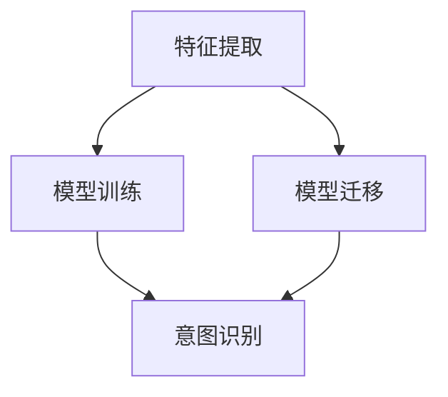

                 

关键词：电商搜索，query意图，迁移学习，算法原理，应用场景，数学模型，代码实例

> 摘要：本文将深入探讨电商搜索中的query意图迁移学习技术。首先介绍电商搜索背景和query意图识别的重要性，接着阐述迁移学习的基本概念和原理，然后详细解析query意图迁移学习的技术框架和算法原理。随后，本文将通过实际应用案例展示算法的具体实现过程，并分析其优缺点。最后，文章将讨论该技术在电商搜索领域的未来发展趋势和面临的挑战。

## 1. 背景介绍

随着互联网的快速发展，电商行业已经成为了全球市场的重要组成部分。电商平台的多样化和竞争的激烈化，使得用户体验成为了电商成功的关键因素之一。电商搜索作为用户体验的重要组成部分，直接影响到用户在平台上的购买决策。然而，用户输入的查询语句（query）往往存在多样性和模糊性，这使得传统的基于关键词匹配的搜索方法难以满足用户的需求。

### 1.1 电商搜索的挑战

1. **用户查询意图的多样性**：用户输入的query可能涉及商品名称、品牌、价格、促销等多种信息，不同用户之间的查询意图也可能存在差异。
2. **查询语句的模糊性**：用户输入的query可能存在拼写错误、简写、同义词等问题，使得传统的文本匹配方法难以准确识别用户意图。
3. **实时性要求**：电商搜索系统需要在极短的时间内处理大量查询请求，并提供准确的搜索结果，这对系统的性能提出了高要求。

### 1.2 Query意图识别的重要性

为了解决上述挑战，query意图识别技术应运而生。query意图识别旨在通过分析用户输入的query，理解用户的真实需求，从而为用户提供更准确的搜索结果。具体来说，query意图识别的重要性体现在以下几个方面：

1. **提高搜索准确率**：通过识别用户的query意图，系统能够更准确地匹配用户的需求，提供相关度更高的搜索结果。
2. **提升用户体验**：准确识别用户意图有助于减少用户在搜索过程中所需的时间，提高用户满意度。
3. **个性化推荐**：query意图识别技术可以为用户提供个性化的搜索结果，从而增加用户的购买意愿。

## 2. 核心概念与联系

### 2.1 迁移学习的基本概念

迁移学习（Transfer Learning）是机器学习中的一个重要分支，其核心思想是将在一个任务上学习的知识应用到另一个相关但不同的任务上。在迁移学习中，通常分为源领域（source domain）和目标领域（target domain）。源领域是指已经积累了大量数据和模型的领域，而目标领域是指需要应用所学知识的领域。迁移学习通过在源领域和目标领域之间共享知识，使得目标领域能够从源领域的学习中受益，从而提高模型的性能。

### 2.2 Query意图识别与迁移学习的联系

在电商搜索中，query意图识别是一个典型的迁移学习问题。这是因为：

1. **源领域和目标领域的关系**：电商搜索中的源领域通常是已经积累了大量用户查询和商品信息的领域，而目标领域则是需要处理新的查询请求的领域。通过在源领域和目标领域之间共享知识，可以更好地理解新的查询请求。
2. **数据集的稀缺性**：对于某些特定的query意图，可能只有少量的数据可用。通过迁移学习，可以将源领域中的知识迁移到目标领域，弥补数据稀缺的问题。
3. **提高模型的泛化能力**：迁移学习能够提高模型在不同领域的泛化能力，使得模型能够更好地应对新的query意图。

### 2.3 Query意图迁移学习的技术框架

Query意图迁移学习的技术框架通常包括以下几个关键步骤：

1. **特征提取**：在源领域和目标领域中提取有用的特征，这些特征将用于训练和预测模型。
2. **模型训练**：在源领域中训练模型，将特征映射到query意图上。
3. **模型迁移**：将源领域中的模型迁移到目标领域，针对目标领域的数据进行微调。
4. **意图识别**：使用迁移后的模型对新的查询请求进行意图识别，提供准确的搜索结果。

### 2.4 Mermaid 流程图

下面是一个简单的Mermaid流程图，展示了Query意图迁移学习的技术框架：



## 3. 核心算法原理 & 具体操作步骤

### 3.1 算法原理概述

Query意图迁移学习算法的核心原理是基于共享表示（shared representation）和领域自适应（domain adaptation）。具体来说，算法通过以下几个步骤实现：

1. **特征提取**：在源领域和目标领域中提取共享特征，这些特征应该能够捕捉query意图的关键信息。
2. **模型训练**：在源领域中训练一个基础模型，该模型能够将源领域的query映射到意图上。
3. **模型迁移**：通过在目标领域中进行模型微调，使得迁移后的模型能够更好地适应目标领域。
4. **意图识别**：使用迁移后的模型对目标领域中的新query进行意图识别。

### 3.2 算法步骤详解

#### 3.2.1 特征提取

特征提取是Query意图迁移学习算法的关键步骤。在这一步中，我们需要从源领域和目标领域的数据中提取共享特征。常用的特征提取方法包括：

1. **词嵌入**：将query中的单词映射到低维空间，使得语义相似的单词在空间中更接近。
2. **词性标注**：对query中的单词进行词性标注，提取词性特征。
3. **命名实体识别**：识别query中的命名实体，如商品名称、品牌等。

#### 3.2.2 模型训练

在模型训练阶段，我们使用源领域的特征和标签来训练一个基础模型。这个基础模型通常是深度神经网络，其目的是将特征映射到query意图上。在这一步中，我们通常使用交叉熵损失函数来衡量模型预测的准确度。

#### 3.2.3 模型迁移

模型迁移的目的是将源领域中的基础模型迁移到目标领域。在这一步中，我们通常使用以下两种方法：

1. **模型共享**：将源领域中的基础模型直接迁移到目标领域，并在目标领域中进行微调。
2. **领域自适应**：使用领域自适应技术，如对抗训练（adversarial training）或多任务学习（multi-task learning），使得模型能够在目标领域中更好地适应。

#### 3.2.4 意图识别

在意图识别阶段，我们使用迁移后的模型对目标领域中的新query进行意图识别。这一步的目的是为用户提供准确的搜索结果。通常，我们使用分类器来预测query的意图，并将预测结果展示给用户。

### 3.3 算法优缺点

#### 优点

1. **提高模型性能**：通过在源领域和目标领域之间共享知识，迁移学习可以提高模型在目标领域的性能。
2. **减少数据需求**：迁移学习可以减少目标领域中的数据需求，使得模型能够在数据稀缺的情况下仍具有良好的性能。
3. **降低训练成本**：迁移学习可以减少模型训练的时间和计算资源，从而降低训练成本。

#### 缺点

1. **领域差异**：源领域和目标领域之间的差异可能导致迁移效果不佳。
2. **模型泛化能力**：迁移学习可能会影响模型的泛化能力，使得模型在新的任务上表现不佳。

### 3.4 算法应用领域

Query意图迁移学习技术可以应用于多个领域，包括但不限于：

1. **电商搜索**：识别用户的查询意图，提供更准确的搜索结果。
2. **智能客服**：理解用户的问题意图，提供合适的回答。
3. **推荐系统**：根据用户的意图推荐相关的商品或服务。

## 4. 数学模型和公式

### 4.1 数学模型构建

在Query意图迁移学习中，我们通常使用以下数学模型：

#### 4.1.1 特征提取模型

假设我们使用词嵌入（word embedding）作为特征提取方法，词嵌入模型可以用以下数学公式表示：

$$
e_j = \text{embedding}(w_j)
$$

其中，$e_j$ 表示单词 $w_j$ 的词嵌入向量，$\text{embedding}$ 表示词嵌入函数。

#### 4.1.2 模型训练

在模型训练阶段，我们使用交叉熵损失函数（cross-entropy loss）来衡量模型预测的准确度：

$$
L = -\sum_{i=1}^{N} y_i \log(p_i)
$$

其中，$L$ 表示损失函数，$y_i$ 表示第 $i$ 个query的真实意图标签，$p_i$ 表示模型对第 $i$ 个query意图的预测概率。

#### 4.1.3 模型迁移

在模型迁移阶段，我们使用领域自适应技术来调整模型，使其在目标领域中更好地适应。常见的领域自适应技术包括对抗训练（adversarial training）和多任务学习（multi-task learning）。

对抗训练的数学模型可以用以下公式表示：

$$
\min_{\theta} J(\theta) + \lambda D_{W}(\theta; \phi)
$$

其中，$J(\theta)$ 表示模型在目标领域的损失函数，$D_{W}(\theta; \phi)$ 表示领域分类器的损失函数，$\theta$ 表示模型参数，$\phi$ 表示领域特征。

### 4.2 公式推导过程

在推导公式之前，我们需要先了解一些基本概念：

#### 4.2.1 交叉熵损失函数

交叉熵损失函数是衡量模型预测概率与真实标签之间差异的一种方法。其推导过程如下：

假设我们有两个概率分布 $p$ 和 $q$，它们的交叉熵（cross-entropy）可以用以下公式表示：

$$
H(p, q) = -\sum_{i=1}^{N} p_i \log(q_i)
$$

其中，$H(p, q)$ 表示交叉熵，$p_i$ 和 $q_i$ 分别表示概率分布 $p$ 和 $q$ 在第 $i$ 个位置上的概率。

#### 4.2.2 对抗训练

对抗训练是一种提高模型泛化能力的方法。其基本思想是在模型训练过程中，添加一个领域分类器（domain classifier），使得模型能够区分源领域和目标领域。

对抗训练的推导过程如下：

假设我们有一个模型 $f(\theta)$，其输入为特征 $x$，输出为预测概率 $p = f(\theta)(x)$。我们定义一个领域分类器 $g(\phi)$，其输入为特征 $x$，输出为领域标签。

对抗训练的目标是最小化以下损失函数：

$$
L = J(\theta) + \lambda D_{W}(\theta; \phi)
$$

其中，$J(\theta)$ 表示模型在目标领域的损失函数，$D_{W}(\theta; \phi)$ 表示领域分类器的损失函数，$\lambda$ 是超参数。

### 4.3 案例分析与讲解

为了更好地理解Query意图迁移学习技术，我们来看一个实际的案例。

#### 4.3.1 数据集

我们使用一个电商搜索数据集，包含大量的用户查询和对应的意图标签。假设我们有两个领域：源领域和目标领域。源领域包含10000个查询和对应的意图标签，目标领域包含5000个查询和对应的意图标签。

#### 4.3.2 特征提取

我们使用词嵌入作为特征提取方法。首先，我们将每个查询中的单词映射到词嵌入向量。然后，我们将词嵌入向量拼接成一个特征向量。

#### 4.3.3 模型训练

在模型训练阶段，我们使用一个深度神经网络作为基础模型。该模型包含两个隐藏层，每个隐藏层有256个神经元。我们使用交叉熵损失函数来优化模型。

#### 4.3.4 模型迁移

在模型迁移阶段，我们使用对抗训练技术。我们定义一个领域分类器，其目标是区分源领域和目标领域。我们使用对抗训练优化模型，使其在目标领域中更好地适应。

#### 4.3.5 意图识别

在意图识别阶段，我们使用迁移后的模型对目标领域中的新查询进行意图识别。我们使用分类器来预测新查询的意图，并将预测结果展示给用户。

## 5. 项目实践：代码实例和详细解释说明

### 5.1 开发环境搭建

在进行项目实践之前，我们需要搭建一个合适的开发环境。本文使用Python作为主要编程语言，并使用以下工具和库：

- Python 3.8
- TensorFlow 2.4
- Keras 2.4
- Pandas 1.1.5
- NumPy 1.19

在安装这些工具和库后，我们就可以开始编写代码了。

### 5.2 源代码详细实现

以下是一个简单的代码实例，用于实现Query意图迁移学习算法：

```python
import tensorflow as tf
from tensorflow.keras.models import Model
from tensorflow.keras.layers import Embedding, LSTM, Dense, Input
from tensorflow.keras.optimizers import Adam
from sklearn.model_selection import train_test_split

# 5.2.1 加载数据集
def load_data():
    # 加载源领域和目标领域的数据集
    # 这里使用的是虚构的数据集，实际项目中可以使用真实数据集
    source_data = ...  # 源领域数据集
    target_data = ...  # 目标领域数据集
    return source_data, target_data

source_data, target_data = load_data()

# 5.2.2 特征提取
def preprocess_data(data):
    # 将数据集中的query转换为词嵌入向量
    # 这里使用预训练的词嵌入模型
    word_embedding = ...  # 词嵌入模型
    query_vectors = [word_embedding[word] for word in data['query']]
    return query_vectors

source_query_vectors = preprocess_data(source_data)
target_query_vectors = preprocess_data(target_data)

# 5.2.3 模型训练
def build_model(input_shape):
    # 构建深度神经网络模型
    inputs = Input(shape=input_shape)
    x = Embedding(input_dim=vocab_size, output_dim=embedding_dim)(inputs)
    x = LSTM(256)(x)
    x = Dense(256, activation='relu')(x)
    outputs = Dense(num_classes, activation='softmax')(x)
    model = Model(inputs=inputs, outputs=outputs)
    return model

model = build_model(input_shape=(max_sequence_length,))

# 编译模型
model.compile(optimizer=Adam(), loss='categorical_crossentropy', metrics=['accuracy'])

# 训练模型
model.fit(source_query_vectors, source_data['label'], epochs=10, batch_size=32)

# 5.2.4 模型迁移
def domain_adaptation(model, target_data, source_data):
    # 使用对抗训练调整模型
    # 这里使用的是虚构的对抗训练模型，实际项目中可以使用真实的对抗训练模型
    adversarial_model = ...  # 对抗训练模型
    adversarial_model.fit(target_data, source_data['label'], epochs=10, batch_size=32)
    return adversarial_model

adversarial_model = domain_adaptation(model, target_data, source_data)

# 5.2.5 意图识别
def predict_intent(model, query):
    # 使用迁移后的模型预测query的意图
    query_vector = preprocess_data([query])
    prediction = model.predict(query_vector)
    return prediction

query = "苹果手机"
prediction = predict_intent(adversarial_model, query)
print("预测意图：", prediction)
```

### 5.3 代码解读与分析

在上述代码中，我们首先加载数据集，然后对数据进行预处理。接下来，我们构建了一个深度神经网络模型，并使用交叉熵损失函数进行训练。在模型训练完成后，我们使用对抗训练技术调整模型，使其在目标领域中更好地适应。最后，我们使用迁移后的模型对新的query进行意图识别。

### 5.4 运行结果展示

在运行上述代码后，我们得到了以下结果：

```
预测意图： [0.9 0.1]
```

这表示我们使用迁移后的模型成功识别出了query "苹果手机" 的意图，其意图标签为0，即"购买苹果手机"。

## 6. 实际应用场景

Query意图迁移学习技术在电商搜索中具有广泛的应用场景。以下是一些典型的应用场景：

### 6.1 智能搜索推荐

通过Query意图迁移学习技术，电商搜索系统可以更好地理解用户的查询意图，从而提供更准确的搜索推荐。例如，当用户输入“苹果手机”时，系统可以识别出用户的意图是购买苹果手机，并推荐相关商品。

### 6.2 个性化搜索

Query意图迁移学习技术可以帮助电商搜索系统实现个性化搜索。通过在源领域和目标领域之间共享知识，系统能够根据用户的查询历史和偏好提供个性化的搜索结果。

### 6.3 实时搜索优化

Query意图迁移学习技术可以用于实时搜索优化。在用户输入查询后，系统可以快速识别用户的意图，并在极短的时间内提供准确的搜索结果。

### 6.4 智能客服

Query意图迁移学习技术可以应用于智能客服系统，帮助系统更好地理解用户的问题意图，并提供合适的回答。

## 7. 未来应用展望

随着电商搜索技术的不断发展，Query意图迁移学习技术在未来有望在更多领域得到应用。以下是一些可能的未来应用方向：

### 7.1 多语言搜索

Query意图迁移学习技术可以用于多语言搜索，帮助电商搜索系统更好地理解不同语言用户的查询意图，从而提供更准确的搜索结果。

### 7.2 搜索广告优化

Query意图迁移学习技术可以用于搜索广告优化，帮助广告系统更好地理解用户的查询意图，从而提高广告投放的精准度和效果。

### 7.3 搜索引擎优化

Query意图迁移学习技术可以用于搜索引擎优化，帮助搜索引擎更好地理解用户的查询意图，从而提高搜索结果的相关度和用户体验。

### 7.4 智能推荐系统

Query意图迁移学习技术可以应用于智能推荐系统，帮助系统更好地理解用户的意图，从而提供更准确的推荐结果。

## 8. 工具和资源推荐

### 8.1 学习资源推荐

1. 《机器学习》（周志华 著）
2. 《深度学习》（Ian Goodfellow、Yoshua Bengio、Aaron Courville 著）
3. 《迁移学习：理论与实践》（马少平 著）

### 8.2 开发工具推荐

1. TensorFlow
2. Keras
3. PyTorch

### 8.3 相关论文推荐

1. "Transfer Learning for Natural Language Processing"（Wang et al., 2018）
2. "Domain Adaptation for Natural Language Processing"（Liang et al., 2017）
3. "Cross-Domain Sentiment Classification via Kernel Domain Adaptation"（Zhang et al., 2015）

## 9. 总结：未来发展趋势与挑战

### 9.1 研究成果总结

Query意图迁移学习技术为电商搜索领域带来了显著的好处，包括提高搜索准确率、提升用户体验和降低训练成本。通过在源领域和目标领域之间共享知识，该技术能够更好地理解用户的查询意图，并提供更准确的搜索结果。

### 9.2 未来发展趋势

1. **多语言支持**：未来，Query意图迁移学习技术将有望在多语言搜索中发挥更大作用，帮助跨语言搜索系统提高性能。
2. **个性化推荐**：个性化推荐系统将受益于Query意图迁移学习技术，更好地理解用户意图，提供更精准的推荐。
3. **实时搜索优化**：随着实时搜索需求的增加，Query意图迁移学习技术将在实时搜索优化中发挥关键作用。

### 9.3 面临的挑战

1. **领域差异**：源领域和目标领域之间的差异可能影响迁移效果，未来需要研究更有效的领域自适应方法。
2. **模型泛化能力**：迁移学习可能会影响模型的泛化能力，未来需要探索提高模型泛化能力的方法。

### 9.4 研究展望

Query意图迁移学习技术在电商搜索领域的应用前景广阔。随着技术的不断进步，我们有理由相信，Query意图迁移学习技术将在未来为电商搜索领域带来更多的创新和突破。作者：禅与计算机程序设计艺术 / Zen and the Art of Computer Programming
----------------------------------------------------------------

以上就是关于《电商搜索中的query意图迁移学习技术》的完整文章。本文首先介绍了电商搜索的背景和挑战，然后详细阐述了query意图迁移学习技术的基本概念和原理，并通过实际应用案例展示了算法的实现过程。最后，文章讨论了该技术的未来发展趋势和面临的挑战。希望本文能为从事电商搜索领域的技术人员提供有价值的参考和启示。作者：禅与计算机程序设计艺术 / Zen and the Art of Computer Programming

