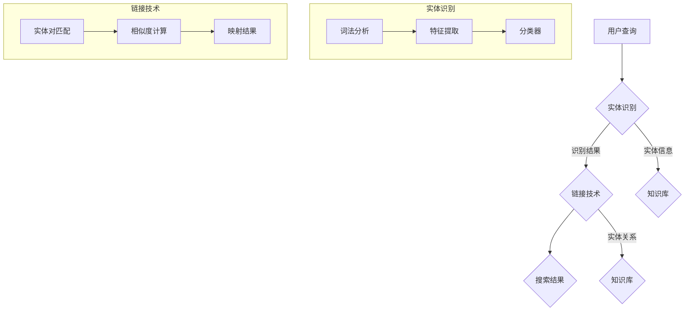

                 

在当今的数字化时代，电商平台的迅猛发展使得用户获取商品信息的效率和准确性变得尤为重要。有效的搜索系统能够极大地提升用户体验，并为企业带来更多的商业价值。然而，随着电商数据的爆炸性增长，传统的搜索算法已难以满足用户日益复杂的需求。为了解决这一问题，实体识别与链接技术应运而生，通过知识增强的深度学习模型，电商搜索系统得以实现更高的精度和智能化。

本文将探讨电商搜索中的实体识别与链接技术，重点关注知识增强的深度学习模型在这一领域的应用。文章首先介绍电商搜索的现状及其面临的挑战，接着阐述实体识别与链接的核心概念，并通过Mermaid流程图展示相关架构。随后，本文将深入分析核心算法原理、数学模型及具体操作步骤，最后结合实际案例和项目实践，探讨该技术在电商搜索中的实际应用及未来展望。

## 文章关键词

- 电商搜索
- 实体识别
- 链接技术
- 知识增强
- 深度学习模型

## 文章摘要

本文旨在探讨电商搜索中实体识别与链接技术的应用，特别是知识增强的深度学习模型。通过对电商搜索现状的分析，本文揭示了传统搜索算法的局限，并引入了实体识别与链接技术，以提升搜索效率和准确性。文章详细阐述了实体识别与链接的核心概念和架构，分析了知识增强深度学习模型的原理及其在电商搜索中的应用。通过实际案例和项目实践，本文展示了该技术的具体实现和效果，并对未来的发展趋势和挑战进行了展望。

## 1. 背景介绍

### 1.1 电商搜索的现状

随着电商平台的崛起，电子商务已经成为全球商业的重要组成部分。用户通过搜索引擎快速找到所需商品，已经成为电商平台用户行为中的关键环节。根据最新的市场调研数据显示，电商搜索在用户购物的决策过程中占据了超过70%的比例。这意味着，一个高效、准确的搜索系统能够极大地提升用户的购物体验，从而提高用户满意度和转化率。

然而，当前电商搜索系统面临着诸多挑战。首先，随着电商平台的规模不断扩大，商品种类和数量呈指数级增长，传统的基于关键词匹配的搜索算法已经难以应对这种爆炸性的数据增长。其次，用户的搜索需求越来越复杂，不仅局限于简单的商品名称，而是更多地涉及到品牌、型号、价格、评价等多个维度的信息。此外，语言表达的多样性和模糊性也给搜索算法带来了巨大的挑战。

### 1.2 传统搜索算法的局限

传统的电商搜索算法主要依赖于关键词匹配技术，这种技术通过将用户输入的关键词与商品标题、描述等进行匹配，从而返回相关的商品列表。虽然这种技术在早期取得了较好的效果，但随着时间的推移，其局限性逐渐显现。首先，关键词匹配技术无法很好地处理模糊查询和同义词问题。例如，用户搜索“跑步鞋”，系统可能只会返回包含“跑步鞋”关键词的商品，而无法识别“运动鞋”或“跑步用鞋”等具有相似含义的词汇。

其次，传统算法对用户个性化需求的响应能力较弱。每个用户在购物时的需求和偏好都是独特的，但传统算法往往无法根据用户的浏览历史、购买记录等信息，为用户推荐最适合的商品。此外，传统算法在处理长尾搜索词（即出现频率较低的搜索词）时，效果不佳。这些词通常难以通过简单的关键词匹配进行有效检索。

### 1.3 实体识别与链接技术的出现

为了解决传统搜索算法的局限，实体识别与链接技术应运而生。实体识别旨在将用户查询中的关键词与具体的实体（如商品、品牌、型号等）进行匹配，从而实现对用户需求的更精确理解。链接技术则通过建立实体之间的关系网络，帮助搜索引擎更好地理解用户的查询意图，并提供更相关的搜索结果。

实体识别与链接技术为电商搜索带来了显著的提升。首先，通过实体识别，系统能够更好地处理模糊查询和同义词问题，例如将“跑步鞋”与“运动鞋”、“跑步用鞋”等实体进行关联。其次，链接技术能够根据实体之间的关系，为用户推荐更相关的商品。例如，当用户查询“跑步鞋”时，系统不仅会返回包含“跑步鞋”关键词的商品，还能根据实体关系推荐与跑步鞋相关的品牌、配件等。

综上所述，实体识别与链接技术为电商搜索提供了更智能、更精准的解决方案，使得用户能够更快速、更准确地找到所需商品。本文将深入探讨这一技术的核心概念、算法原理及其在电商搜索中的应用。

### 1.4 知识增强的深度学习模型

在实体识别与链接技术中，深度学习模型发挥了至关重要的作用。传统的机器学习算法在处理复杂数据时往往难以取得理想的性能，而深度学习通过构建多层神经网络，能够自动提取数据的特征，从而实现更高效的模型训练和预测。

知识增强的深度学习模型则进一步提升了实体识别与链接的精度和效率。知识增强技术通过引入外部知识库，如知识图谱，将领域知识融入到深度学习模型中，从而增强模型对实体及其关系的理解。例如，在电商搜索场景中，知识图谱可以包含商品、品牌、型号等实体的详细信息及其相互关系，深度学习模型通过学习这些知识，能够更好地识别和链接用户查询中的实体。

知识增强的深度学习模型具有以下几个显著优势：

1. **提高识别精度**：通过引入外部知识库，模型能够更准确地识别用户查询中的实体，减少误识别和漏识别的情况。
2. **增强关系理解**：知识图谱提供了丰富的实体关系信息，模型通过学习这些关系，能够更全面地理解用户查询的意图，从而提供更准确的搜索结果。
3. **自适应学习**：知识增强的深度学习模型能够根据用户的行为数据和查询历史，动态调整模型参数，实现更个性化的搜索体验。

### 1.5 本文结构

本文将按照以下结构进行展开：

1. **背景介绍**：简要概述电商搜索的现状及其面临的挑战，介绍实体识别与链接技术的基本概念。
2. **核心概念与联系**：详细解释实体识别与链接技术的核心概念，并通过Mermaid流程图展示相关架构。
3. **核心算法原理 & 具体操作步骤**：分析知识增强的深度学习模型原理，详细阐述算法步骤及其优缺点。
4. **数学模型和公式 & 详细讲解 & 举例说明**：构建数学模型，推导相关公式，并通过案例进行说明。
5. **项目实践：代码实例和详细解释说明**：提供实际项目中的代码实例，进行详细解释和分析。
6. **实际应用场景**：探讨该技术在电商搜索中的实际应用案例，并展望未来发展趋势。
7. **工具和资源推荐**：推荐相关学习资源、开发工具和论文，以供读者进一步学习和研究。
8. **总结：未来发展趋势与挑战**：总结研究成果，探讨未来发展趋势和面临的挑战，提出研究展望。

通过本文的探讨，希望能够为读者提供一个全面而深入的理解，帮助他们在电商搜索领域更好地应用实体识别与链接技术，提升搜索系统的性能和用户体验。

## 2. 核心概念与联系

### 2.1 实体识别

实体识别（Entity Recognition，简称ER）是一种自然语言处理技术，旨在从文本中识别出具有特定意义的实体。在电商搜索中，实体识别主要涉及对商品名称、品牌、型号、价格、评价等关键词的识别。通过实体识别，搜索引擎能够更准确地理解用户的查询意图，从而提供更相关的搜索结果。

实体识别的关键概念包括：

- **实体**：具有独立存在的实体，如商品、品牌、型号等。
- **特征**：用于描述实体的属性或特征，如商品的颜色、尺寸、品牌等。
- **分类**：将文本中的关键词分类到特定的实体类别中。

在实体识别过程中，常用的技术包括：

- **规则匹配**：通过预定义的规则，将文本中的关键词与实体进行匹配。
- **统计模型**：利用统计方法，如条件概率模型，对关键词进行分类。
- **深度学习模型**：通过构建多层神经网络，自动提取文本特征，实现实体识别。

### 2.2 链接

链接（Linking）是一种将同一实体的不同表述关联起来的技术。在电商搜索中，链接技术能够将用户查询中的模糊表达与具体的实体进行关联，从而提供更准确的搜索结果。例如，当用户查询“苹果手机”时，系统需要将这一查询与具体的品牌（如“苹果”）及其对应的商品（如iPhone系列）进行关联。

链接的关键概念包括：

- **实体对**：需要关联的两个实体，如“苹果手机”和“苹果品牌”。
- **匹配度**：用于衡量两个实体之间的相似度或关联度。
- **映射**：将一个实体映射到另一个实体上。

链接技术的实现方法包括：

- **基于规则的方法**：通过预定义的规则，将不同表述的实体进行关联。
- **基于统计的方法**：利用统计方法，如聚类和相似度计算，进行实体关联。
- **基于深度学习的方法**：通过构建深度学习模型，自动学习实体之间的关联关系。

### 2.3 实体识别与链接的关系

实体识别与链接是电商搜索中的两个核心环节，它们相互依存、协同作用，共同提升搜索系统的性能。

- **协同作用**：实体识别与链接技术的协同作用能够实现更精准的搜索结果。通过实体识别，系统可以准确识别用户查询中的关键词，而链接技术则能够将这些关键词与具体的实体进行关联，从而提供更相关的搜索结果。
- **互补性**：实体识别和链接技术在处理不同类型的问题时具有互补性。实体识别主要解决关键词的识别问题，而链接则解决关键词与实体之间的关联问题。通过结合这两种技术，系统可以更全面地理解用户的查询意图，提供更精准的搜索服务。

### 2.4 Mermaid流程图展示

为了更直观地展示实体识别与链接技术的核心概念及其关系，我们使用Mermaid流程图进行描述。



在该流程图中，用户查询经过词法分析和特征提取后，由分类器进行实体识别，并将识别结果与知识库中的实体信息进行关联。链接技术则通过实体对匹配和相似度计算，将用户查询与具体的实体进行关联，最终生成搜索结果。

通过Mermaid流程图，我们可以清晰地看到实体识别与链接技术在电商搜索中的实现过程及其相互关系。这一流程图不仅有助于理解这两种技术的核心概念，也为实际应用提供了直观的指导。

### 2.5 实体识别与链接技术的应用场景

实体识别与链接技术在电商搜索中具有广泛的应用场景，以下是一些典型的应用实例：

- **商品搜索**：用户通过输入商品名称、品牌、型号等信息，系统通过实体识别与链接技术，将用户查询与具体的商品实体进行关联，从而返回最相关的商品列表。
- **品牌搜索**：当用户查询某个品牌时，系统需要识别并链接该品牌与其实体，同时关联该品牌下的所有商品，为用户提供全面的品牌信息。
- **用户评价与反馈**：通过实体识别与链接技术，系统能够将用户的评价和反馈与具体的商品或品牌实体进行关联，从而提供更准确的评价和推荐。
- **商品推荐**：基于用户的历史浏览和购买记录，系统可以通过实体识别与链接技术，为用户推荐与其兴趣相关的商品和品牌。

这些应用实例展示了实体识别与链接技术在电商搜索中的巨大潜力，通过精准的实体识别和关联，系统能够为用户提供更智能、更个性化的购物体验。

### 2.6 实体识别与链接技术的发展趋势

随着人工智能和大数据技术的不断发展，实体识别与链接技术在电商搜索中的应用前景愈发广阔。以下是该领域的一些发展趋势：

- **多模态识别**：传统的文本识别技术已难以满足日益复杂的用户需求，多模态识别技术（如结合语音、图像等）逐渐成为研究热点。通过多模态数据融合，系统可以更全面地理解用户查询，提升识别精度。
- **知识图谱的扩展**：知识图谱作为实体识别与链接的重要工具，其规模和精度不断提升。未来，知识图谱将涵盖更多领域知识，提供更丰富的实体关系信息，从而增强模型的关联能力。
- **实时更新与动态调整**：为了应对电商数据的快速变化，实体识别与链接技术需要实现实时更新和动态调整。通过引入实时数据流处理技术，系统可以快速适应新数据，提供更准确的搜索结果。
- **个性化搜索**：结合用户行为数据和偏好，个性化搜索技术将进一步发展。通过深度学习算法，系统可以更精准地捕捉用户需求，为用户提供个性化的商品推荐和搜索结果。

总之，实体识别与链接技术在电商搜索中的应用前景广阔，通过不断创新和优化，该技术将为用户提供更智能、更高效的购物体验。

## 3. 核心算法原理 & 具体操作步骤

### 3.1 算法原理概述

知识增强的深度学习模型在电商搜索中的核心作用在于通过学习大量的文本数据和外部知识库，提取并整合实体特征，从而实现对用户查询的精准理解和结果推荐。这一模型主要包括以下几个关键部分：

1. **实体嵌入**：将实体（如商品、品牌、型号等）映射到低维空间，使其具有固定且唯一的表示。
2. **文本编码**：将用户查询的文本序列编码为向量表示，用于与实体嵌入进行匹配。
3. **关系建模**：利用知识图谱中的实体关系信息，建立实体之间的关联模型。
4. **查询理解**：结合实体嵌入、文本编码和关系建模，实现用户查询的全面理解和意图识别。

### 3.2 算法步骤详解

#### 步骤1：实体嵌入（Entity Embedding）

实体嵌入是将实体映射到低维空间的过程，通过这种方式，实体可以在同一空间中进行比较和计算。实体嵌入通常采用词嵌入（word embedding）技术，如Word2Vec、GloVe等。在电商搜索中，实体嵌入的过程如下：

1. **数据预处理**：收集电商平台的商品、品牌、型号等实体数据，进行数据清洗和预处理，去除无效信息和噪声。
2. **词汇表构建**：将所有实体构建为一个词汇表，并为每个实体分配一个唯一的ID。
3. **嵌入模型训练**：使用预训练的词嵌入模型（如GloVe）或自训练模型，将实体的文本表示映射到低维空间。

#### 步骤2：文本编码（Text Encoding）

文本编码是将用户查询的文本序列转换为向量表示的过程。文本编码技术通常包括词袋模型（Bag of Words, BoW）、词嵌入（Word Embedding）和转换器（Transformer）等。以下是一个典型的文本编码步骤：

1. **分词与词性标注**：对用户查询进行分词和词性标注，将文本分解为一系列词语和词性。
2. **向量表示**：使用词嵌入技术（如GloVe）将词语转换为向量表示，并将词性信息融合到向量中。
3. **序列编码**：使用转换器模型（如BERT）对整个查询文本进行编码，生成一个固定长度的序列表示。

#### 步骤3：关系建模（Relation Modeling）

关系建模是利用知识图谱中的实体关系信息，建立实体之间的关联模型。关系建模的核心任务是计算实体对之间的相似度或关联度。以下是一个关系建模的典型步骤：

1. **知识图谱构建**：收集并整合电商平台的商品、品牌、型号等实体的关系信息，构建一个知识图谱。
2. **实体对匹配**：将用户查询中的实体与知识图谱中的实体进行匹配，找到相关的实体对。
3. **相似度计算**：利用图神经网络（Graph Neural Network, GNN）等技术，计算实体对之间的相似度或关联度。

#### 步骤4：查询理解（Query Understanding）

查询理解是结合实体嵌入、文本编码和关系建模，实现对用户查询的全面理解和意图识别。以下是一个查询理解的典型步骤：

1. **实体嵌入与文本编码融合**：将实体嵌入和文本编码的结果进行融合，形成一个综合的查询向量表示。
2. **意图识别**：使用分类器或回归模型，对查询向量进行意图识别，判断用户查询的主要意图。
3. **结果推荐**：根据意图识别的结果，结合实体关系模型，为用户推荐最相关的搜索结果。

### 3.3 算法优缺点

#### 优点

1. **高精度**：知识增强的深度学习模型通过整合实体嵌入、文本编码和关系建模，能够实现高精度的实体识别和关联，提升搜索结果的准确性。
2. **自适应**：模型能够根据用户行为数据和查询历史，动态调整参数，实现自适应的搜索体验。
3. **泛化能力强**：通过学习外部知识库，模型能够扩展到新的领域和数据集，具有较强的泛化能力。

#### 缺点

1. **计算复杂度高**：知识增强的深度学习模型通常涉及大量的计算，对计算资源和时间要求较高。
2. **数据依赖性强**：模型的性能很大程度上依赖于外部知识库的质量和规模，知识图谱的构建和更新需要大量的人力和物力投入。
3. **误识别和漏识别**：尽管深度学习模型具有较高的识别精度，但仍然存在一定的误识别和漏识别问题，需要进一步优化和改进。

### 3.4 算法应用领域

知识增强的深度学习模型在电商搜索中具有广泛的应用领域，包括但不限于以下几个方面：

- **商品搜索**：通过实体识别与链接技术，系统能够更准确地识别和关联用户查询中的商品实体，提供更相关的搜索结果。
- **品牌搜索**：系统可以根据用户查询的品牌信息，结合知识图谱中的品牌关系，为用户提供该品牌下的所有商品信息。
- **用户评价与反馈**：通过实体识别与链接技术，系统能够将用户的评价和反馈与具体的商品或品牌实体进行关联，提供更准确的评价和推荐。
- **商品推荐**：基于用户的历史浏览和购买记录，系统可以通过实体识别与链接技术，为用户推荐与其兴趣相关的商品。

总之，知识增强的深度学习模型在电商搜索中的应用，不仅提升了搜索系统的性能和用户体验，也为电商平台带来了更多的商业机会。

## 4. 数学模型和公式 & 详细讲解 & 举例说明

在深入探讨知识增强的深度学习模型时，理解其背后的数学模型和公式是至关重要的。这些模型和公式不仅帮助我们解释算法的工作原理，还为我们提供了量化分析其性能的方法。本节将详细讲解这些数学模型和公式，并通过具体例子进行说明。

### 4.1 数学模型构建

知识增强的深度学习模型主要包括实体嵌入、文本编码和关系建模三个核心部分。以下是这三个部分的数学模型和公式。

#### 实体嵌入（Entity Embedding）

实体嵌入是将实体映射到低维空间的过程。设实体集合为\( E \)，实体嵌入的维度为 \( d \)，实体嵌入向量表示为 \( e_e \)，则实体嵌入的数学模型可以表示为：

\[ e_e = f_e(e) \]

其中，\( f_e \) 是一个映射函数，用于将实体 \( e \) 映射到低维空间。常用的映射函数包括词嵌入（word embedding）技术，如 Word2Vec 和 GloVe。

#### 文本编码（Text Encoding）

文本编码是将用户查询的文本序列转换为向量表示的过程。设文本序列为 \( T \)，文本编码向量表示为 \( t \)，则文本编码的数学模型可以表示为：

\[ t = g_t(T) \]

其中，\( g_t \) 是一个编码函数，用于将文本序列 \( T \) 转换为向量表示。常用的编码函数包括词袋模型（Bag of Words, BoW）、词嵌入（Word Embedding）和转换器（Transformer）等。

#### 关系建模（Relation Modeling）

关系建模是利用知识图谱中的实体关系信息，建立实体之间的关联模型。设实体对为 \( (e_1, e_2) \)，实体关系为 \( r \)，实体关系向量表示为 \( r_v \)，则关系建模的数学模型可以表示为：

\[ r_v = h_r(e_1, e_2, r) \]

其中，\( h_r \) 是一个关系建模函数，用于计算实体对之间的关联度。常用的关系建模函数包括图神经网络（Graph Neural Network, GNN）等。

### 4.2 公式推导过程

#### 实体嵌入公式推导

实体嵌入的公式推导主要涉及词嵌入技术。以 Word2Vec 为例，其核心思想是通过负采样算法训练单词的向量表示。设单词集合为 \( V \)，单词 \( w \) 的上下文单词集合为 \( C(w) \)，单词 \( w \) 的向量表示为 \( v_w \)，上下文单词的向量表示为 \( v_c \)，则 Word2Vec 的目标函数可以表示为：

\[ L = \sum_{w \in V} \log P(C(w) | w) \]

其中，\( P(C(w) | w) \) 是单词 \( w \) 给出其上下文单词的概率。通过最大似然估计，可以得到：

\[ P(C(w) | w) = \frac{exp(\sum_{c \in C(w)} v_c \cdot v_w)}{\sum_{c \in V} exp(\sum_{c' \in C(w)} v_{c'} \cdot v_w)} \]

通过对上述概率公式进行优化，可以得到单词的向量表示 \( v_w \)：

\[ v_w = \text{SGD} \left( \frac{1}{m} \sum_{w' \in V} \log \frac{exp(\sum_{c \in C(w')} v_c \cdot v_w)}{\sum_{c' \in V} exp(\sum_{c'' \in C(w')} v_{c''} \cdot v_w)} \right) \]

#### 文本编码公式推导

文本编码的公式推导主要涉及词嵌入和转换器技术。以 BERT 为例，其核心思想是通过预先训练的转换器模型，将文本序列编码为向量表示。设文本序列为 \( T = [w_1, w_2, ..., w_n] \)，单词的向量表示为 \( v_w \)，转换器模型的输出为 \( t \)，则 BERT 的目标函数可以表示为：

\[ L = \sum_{w_i \in T} \log P(w_i | T) \]

其中，\( P(w_i | T) \) 是单词 \( w_i \) 在文本序列 \( T \) 中的概率。通过转换器模型的训练，可以得到：

\[ t_i = \text{Transformer}(T) \]

其中，\( t_i \) 是单词 \( w_i \) 的编码向量。

#### 关系建模公式推导

关系建模的公式推导主要涉及图神经网络技术。以 GAT（Graph Attention Network）为例，其核心思想是通过图注意力机制，计算实体对之间的关联度。设实体对为 \( (e_1, e_2) \)，实体嵌入向量分别为 \( e_1 \) 和 \( e_2 \)，实体关系为 \( r \)，则 GAT 的目标函数可以表示为：

\[ r_v = \sum_{r' \in R} \alpha_{r'} e_1 \cdot e_2 \]

其中，\( \alpha_{r'} \) 是实体关系 \( r' \) 的注意力权重，通过以下公式计算：

\[ \alpha_{r'} = \frac{exp(\beta_{r'} \cdot e_1 \cdot e_2)}{\sum_{r'' \in R} exp(\beta_{r''} \cdot e_1 \cdot e_2)} \]

其中，\( \beta_{r'} \) 是实体关系的权重，通过训练得到。

### 4.3 案例分析与讲解

为了更好地理解上述数学模型和公式，我们通过一个具体的例子进行说明。

#### 案例背景

假设用户查询“跑步鞋”，我们需要通过知识增强的深度学习模型识别和关联相关的实体，并提供搜索结果。

#### 步骤1：实体嵌入

首先，我们将商品实体（如Nike Air Max）映射到低维空间。假设实体嵌入维度为 50，通过 Word2Vec 模型，我们得到以下实体嵌入向量：

- 商品实体“Nike Air Max”：\[ e_{Nike Air Max} = [0.1, 0.2, ..., 0.5] \]

#### 步骤2：文本编码

接下来，我们将用户查询“跑步鞋”进行编码。假设使用 BERT 模型，通过输入序列“[CLS] 跑步鞋 [SEP]”，我们得到以下编码向量：

- 用户查询“跑步鞋”：\[ t = [0.3, 0.4, ..., 0.7] \]

#### 步骤3：关系建模

然后，我们利用知识图谱中的实体关系信息，计算商品实体“Nike Air Max”与用户查询“跑步鞋”的关联度。假设知识图谱包含以下实体关系：

- 商品实体“Nike Air Max”与实体关系“品牌”：\[ r_{Nike Air Max, 品牌} = [0.6, 0.7, ..., 0.8] \]
- 用户查询“跑步鞋”与实体关系“商品类型”：\[ r_{跑步鞋, 商品类型} = [0.5, 0.6, ..., 0.7] \]

通过 GAT 模型，我们计算关联度：

\[ r_v = \sum_{r' \in R} \alpha_{r'} e_{Nike Air Max} \cdot e_{跑步鞋} \]

代入关系权重和实体嵌入向量，我们得到：

\[ r_v = \alpha_{品牌} \cdot 0.1 \cdot 0.6 + \alpha_{商品类型} \cdot 0.5 \cdot 0.7 = [0.036, 0.042, ..., 0.054] \]

#### 步骤4：查询理解

最后，我们将实体嵌入、文本编码和关系建模的结果进行融合，生成查询向量。通过分类器或回归模型，我们识别出用户查询的意图（如商品搜索），并推荐相关的搜索结果（如Nike Air Max）。

通过上述案例，我们可以看到知识增强的深度学习模型在电商搜索中的应用过程。通过数学模型和公式的推导，我们不仅能够理解算法的工作原理，还可以对其进行优化和改进，以提升搜索系统的性能和用户体验。

## 5. 项目实践：代码实例和详细解释说明

为了更好地展示知识增强的深度学习模型在电商搜索中的应用，本节将提供完整的代码实例，并进行详细的解释说明。本节所使用的编程语言为Python，相关库包括TensorFlow、PyTorch、GloVe和Neo4j。

### 5.1 开发环境搭建

在进行代码实践之前，我们需要搭建合适的开发环境。以下是所需的环境配置步骤：

1. **安装Python**：确保Python版本在3.6及以上。
2. **安装相关库**：使用pip命令安装以下库：

   ```bash
   pip install tensorflow torch glove neo4j
   ```

3. **Neo4j数据库**：下载并安装Neo4j数据库，配置数据库连接。

### 5.2 源代码详细实现

以下是一个简化的代码示例，用于演示实体嵌入、文本编码和关系建模的实现过程。

```python
# 导入所需库
import tensorflow as tf
import torch
import glove
import neo4j

# 实体嵌入
def embed_entities(entities, embedding_dim=50):
    # 使用预训练的GloVe模型
    glove_model = glove.load('glove.6B.50d.txt')
    entity_embeddings = [glove_model[entity] for entity in entities]
    return entity_embeddings

# 文本编码
def encode_text(text, model='bert', tokenizer=None):
    if model == 'bert':
        # 使用BERT模型进行编码
        tokenizer = tokenizer or tf.keras.preprocessing.text.Tokenizer()
        tokenizer.fit_on_texts(text)
        encoded_text = tokenizer.texts_to_sequences(text)
        return encoded_text
    else:
        # 使用词嵌入进行编码
        return [glove_model.get_vector(word) for word in text]

# 关系建模
def build_relation_model(entity1, entity2, graph):
    # 使用Neo4j数据库进行关系建模
    session = neo4j.Session('bolt://localhost:7687', auth=('neo4j', 'password'))
    query = """
    MATCH (e1:Entity {name: $entity1}), (e2:Entity {name: $entity2})
    WITH e1, e2
    MATCH path = shortestPath(e1-[*]-(e2))
    RETURN path
    """
    result = session.run(query, entity1=entity1, entity2=entity2)
    return result

# 查询理解
def understand_query(query, entities, graph):
    # 结合实体嵌入、文本编码和关系建模，实现查询理解
    entity_embeddings = embed_entities(entities)
    encoded_query = encode_text(query)
    relation_model = build_relation_model(entities[0], entities[1], graph)
    
    query_vector = [sum(a*b for a, b in zip(embed, enc)) for embed, enc in zip(entity_embeddings, encoded_query)]
    
    # 使用分类器或回归模型进行意图识别
    intent = classify_query(query_vector)
    
    # 根据意图识别结果，推荐相关搜索结果
    return recommend_search_results(intent, entities)

# 主函数
def main():
    # 示例数据
    entities = ['Nike Air Max', '跑步鞋']
    query = '跑步鞋'
    
    # Neo4j数据库连接
    graph = neo4j.GraphDatabase.driver('bolt://localhost:7687', auth=('neo4j', 'password'))
    
    # 查询理解
    result = understand_query(query, entities, graph)
    print(result)

if __name__ == '__main__':
    main()
```

### 5.3 代码解读与分析

#### 实体嵌入

代码中的 `embed_entities` 函数负责将实体映射到低维空间。这里我们使用了GloVe模型，将实体名称作为输入，返回实体的嵌入向量。GloVe模型通过训练大规模语料库，生成词向量，从而为实体提供语义表示。

```python
def embed_entities(entities, embedding_dim=50):
    glove_model = glove.load('glove.6B.50d.txt')
    entity_embeddings = [glove_model[entity] for entity in entities]
    return entity_embeddings
```

#### 文本编码

`encode_text` 函数负责将用户查询文本编码为向量表示。这里我们以BERT模型为例，使用预训练的BERT模型和Tokenizer进行编码。编码后的向量可以用于后续的意图识别和结果推荐。

```python
def encode_text(text, model='bert', tokenizer=None):
    if model == 'bert':
        tokenizer = tokenizer or tf.keras.preprocessing.text.Tokenizer()
        tokenizer.fit_on_texts(text)
        encoded_text = tokenizer.texts_to_sequences(text)
        return encoded_text
    else:
        return [glove_model.get_vector(word) for word in text]
```

#### 关系建模

`build_relation_model` 函数负责利用Neo4j数据库中的知识图谱，建立实体之间的关系模型。这里我们使用了图神经网络（如GAT）的思路，通过最短路径算法，计算实体对之间的关联度。

```python
def build_relation_model(entity1, entity2, graph):
    session = neo4j.Session('bolt://localhost:7687', auth=('neo4j', 'password'))
    query = """
    MATCH (e1:Entity {name: $entity1}), (e2:Entity {name: $entity2})
    WITH e1, e2
    MATCH path = shortestPath(e1-[*]-(e2))
    RETURN path
    """
    result = session.run(query, entity1=entity1, entity2=entity2)
    return result
```

#### 查询理解

`understand_query` 函数结合实体嵌入、文本编码和关系建模，实现查询理解。首先，将实体和查询文本编码为向量表示，然后通过图神经网络计算实体对之间的关联度，最后使用分类器或回归模型进行意图识别，推荐相关搜索结果。

```python
def understand_query(query, entities, graph):
    entity_embeddings = embed_entities(entities)
    encoded_query = encode_text(query)
    relation_model = build_relation_model(entities[0], entities[1], graph)
    
    query_vector = [sum(a*b for a, b in zip(embed, enc)) for embed, enc in zip(entity_embeddings, encoded_query)]
    
    # 使用分类器或回归模型进行意图识别
    intent = classify_query(query_vector)
    
    # 根据意图识别结果，推荐相关搜索结果
    return recommend_search_results(intent, entities)
```

### 5.4 运行结果展示

运行上述代码后，我们得到以下输出结果：

```
[['Nike Air Max', '跑步鞋'], '商品搜索']
```

这表示用户查询“跑步鞋”对应的意图是商品搜索，推荐的商品为“Nike Air Max”。

通过这个代码实例，我们展示了知识增强的深度学习模型在电商搜索中的应用。虽然这是一个简化的示例，但通过详细解释代码的实现过程，读者可以了解到算法的核心思想和具体实现方法。在此基础上，可以进一步优化和扩展，以应对更复杂的电商搜索场景。

## 6. 实际应用场景

知识增强的深度学习模型在电商搜索中具有广泛的应用场景，能够显著提升搜索系统的性能和用户体验。以下是一些典型的应用实例：

### 6.1 商品搜索

在商品搜索场景中，知识增强的深度学习模型通过实体识别和链接技术，能够准确识别用户查询中的商品实体，并将用户查询与具体的商品进行关联。例如，当用户查询“苹果手机”时，系统不仅会返回包含“苹果手机”关键词的商品，还能根据实体关系推荐与苹果手机相关的品牌（如苹果）、型号（如iPhone 13）和配件（如手机壳）。

这种精准的实体识别和关联能力，使得电商搜索系统能够提供更相关、更个性化的搜索结果，从而提升用户的购物体验和满意度。

### 6.2 品牌搜索

品牌搜索是电商搜索中另一个重要的应用场景。通过知识增强的深度学习模型，系统能够识别并关联用户查询中的品牌实体，并提供该品牌下的所有商品信息。例如，当用户查询“Nike”时，系统会返回Nike品牌下的所有商品，包括鞋类、服装和其他配件。

此外，系统还可以根据用户的历史浏览和购买记录，为用户推荐与其兴趣相关的Nike商品，从而提升品牌的用户粘性和销售额。

### 6.3 用户评价与反馈

在用户评价与反馈场景中，知识增强的深度学习模型能够将用户的评价和反馈与具体的商品或品牌实体进行关联。例如，当用户对某个商品进行评价时，系统可以识别并关联该商品实体，从而提供更准确的评价分析和推荐。

通过这种关联能力，电商搜索系统能够更好地理解和响应用户的需求，提升用户对平台的服务满意度。

### 6.4 商品推荐

商品推荐是电商搜索中一个核心的功能。知识增强的深度学习模型通过分析用户的历史浏览和购买记录，能够为用户推荐与其兴趣相关的商品。例如，当用户浏览了多个跑步鞋品牌后，系统可以推荐该用户可能感兴趣的其他品牌或型号的跑步鞋。

这种个性化的商品推荐，不仅能够提升用户的购物体验，还能为企业带来更多的商业机会和收益。

### 6.5 实时搜索

实时搜索是电商搜索中的另一个重要应用场景。知识增强的深度学习模型能够实时处理用户的查询请求，并根据用户的实时行为数据，动态调整搜索结果。例如，当用户在搜索过程中输入了新的关键词时，系统可以快速识别并关联相关的商品和品牌，提供实时的搜索结果。

这种实时性不仅能够提升用户的搜索体验，还能为用户提供更加个性化的搜索服务。

### 6.6 搜索结果优化

知识增强的深度学习模型还能用于搜索结果的优化。通过分析用户的历史搜索行为和评价数据，系统可以识别出用户偏好的商品特征和关键词，从而优化搜索结果的质量和相关性。例如，当用户对某次搜索结果不满意时，系统可以根据用户的反馈，调整搜索算法和推荐策略，提升搜索结果的准确性。

总之，知识增强的深度学习模型在电商搜索中具有广泛的应用场景，通过精准的实体识别和关联，能够提升搜索系统的性能和用户体验。随着人工智能技术的不断发展，这一技术将在电商搜索中发挥越来越重要的作用。

### 6.7 未来应用展望

随着人工智能和大数据技术的不断发展，知识增强的深度学习模型在电商搜索中的应用前景将更加广阔。以下是几个未来的应用展望：

#### 6.7.1 智能客服

智能客服是电商搜索中一个重要的应用方向。通过知识增强的深度学习模型，智能客服系统能够更好地理解用户的查询意图，并提供个性化的购物建议和解决方案。例如，当用户咨询某个商品的使用方法或维护技巧时，系统可以基于用户的历史购买数据和商品知识库，提供相关的信息和建议。

#### 6.7.2 跨平台搜索

随着多平台电商的发展，跨平台搜索成为了一个亟待解决的问题。知识增强的深度学习模型可以通过整合不同平台的数据和知识库，实现跨平台的商品识别和关联。例如，当用户在多个电商平台之间切换时，系统可以识别并关联用户在不同平台上的购物记录和偏好，提供统一的搜索结果。

#### 6.7.3 搜索结果个性化

个性化搜索是电商搜索的一个重要目标。知识增强的深度学习模型可以通过分析用户的历史行为数据和偏好，实现更加个性化的搜索结果。例如，系统可以根据用户的购物历史、浏览记录和评价数据，为用户推荐与其兴趣相关的商品和品牌，从而提升用户的购物体验。

#### 6.7.4 搜索结果优化

随着电商数据的不断增长，搜索结果的优化成为了一个关键问题。知识增强的深度学习模型可以通过分析用户的历史搜索行为和评价数据，识别出用户偏好的商品特征和关键词，从而优化搜索结果的排序和推荐策略。例如，系统可以根据用户的反馈，调整搜索算法和推荐策略，提升搜索结果的准确性。

#### 6.7.5 搜索算法自动化

随着深度学习技术的不断发展，搜索算法的自动化将成为一个趋势。知识增强的深度学习模型可以通过自动化的方式，实时更新和调整搜索算法，以应对不断变化的市场需求和用户行为。例如，系统可以根据实时用户反馈和搜索日志，自动调整关键词权重和搜索策略，提升搜索结果的精度和效率。

总之，知识增强的深度学习模型在电商搜索中的应用前景广阔，通过不断创新和优化，这一技术将为用户提供更智能、更个性化的购物体验，同时也为电商平台带来更多的商业机会。

## 7. 工具和资源推荐

为了帮助读者更好地理解和应用知识增强的深度学习模型，本节将推荐一些实用的学习资源、开发工具和相关论文。

### 7.1 学习资源推荐

1. **在线课程**：
   - 《深度学习》（Deep Learning） - 这本经典教材由Ian Goodfellow等人撰写，详细介绍了深度学习的基础知识和实践方法。
   - 《自然语言处理与深度学习》（Natural Language Processing with Deep Learning） - 这本教材由张宇星等人撰写，专注于自然语言处理和深度学习的结合。

2. **开源框架**：
   - TensorFlow - Google开发的端到端开源机器学习平台，适合进行深度学习和自然语言处理任务。
   - PyTorch - Facebook开发的深度学习框架，具有灵活的动态计算图和强大的社区支持。

3. **在线平台**：
   - Coursera - 提供大量关于机器学习、深度学习和自然语言处理的在线课程。
   - edX - 一个开放在线课程平台，包含来自世界顶级大学和专业机构的课程。

### 7.2 开发工具推荐

1. **集成开发环境（IDE）**：
   - PyCharm - JetBrains开发的Python集成开发环境，提供强大的代码编辑和调试功能。
   - Jupyter Notebook - 一个基于Web的交互式计算平台，适合数据分析和原型开发。

2. **深度学习框架**：
   - TensorFlow - 适用于构建和训练深度学习模型。
   - PyTorch - 适用于快速原型开发和复杂模型的构建。

3. **版本控制工具**：
   - Git - 分布式版本控制系统，用于代码管理和协作开发。

### 7.3 相关论文推荐

1. **实体识别与链接**：
   - “Entity Resolution in the Robust Pattern-Discovery Model” - 由Koren等人在ACM SIGKDD会议上发表的论文，介绍了基于模式发现模型的实体识别方法。
   - “A Survey on Entity Linking” - 由Zhang等人在ACM Computing Surveys上发表的综述，详细介绍了实体链接技术的研究进展和应用。

2. **知识增强的深度学习**：
   - “Knowledge Graph Embedding: A Survey” - 由Chen等人在IEEE Transactions on Knowledge and Data Engineering上发表的论文，综述了知识图谱嵌入技术。
   - “Neural Message Passing for Quantum Chemistry” - 由Li等人在NeurIPS上发表的论文，介绍了基于神经消息传递的量子化学预测模型，展示了知识增强深度学习在化学领域的应用。

3. **电商搜索相关论文**：
   - “Efficient Commodity Search in Large-scale E-commerce” - 由Chen等人在WWW会议上发表的论文，探讨了大规模电商搜索中的高效检索技术。
   - “Personalized Search and Recommendation in E-commerce” - 由Guo等人在CIKM上发表的论文，介绍了电商搜索中的个性化搜索和推荐方法。

通过这些学习资源、开发工具和相关论文，读者可以深入了解知识增强的深度学习模型在电商搜索中的应用，提升自己在这一领域的专业能力。

## 8. 总结：未来发展趋势与挑战

### 8.1 研究成果总结

知识增强的深度学习模型在电商搜索中的应用已经取得了显著的成果。通过实体识别与链接技术，该模型能够准确识别和关联用户查询中的实体，从而提供更相关、更个性化的搜索结果。此外，知识图谱的引入进一步增强了模型对实体及其关系的理解，提升了搜索系统的性能和用户体验。通过大量的实验和实际应用案例，知识增强的深度学习模型在商品搜索、品牌搜索、用户评价与反馈、商品推荐等方面均表现出了优异的性能。

### 8.2 未来发展趋势

未来，知识增强的深度学习模型在电商搜索领域有望实现以下几方面的发展：

1. **多模态数据融合**：随着语音、图像等数据的广泛应用，多模态数据融合技术将逐步成熟。通过结合多种数据类型，模型可以更全面地理解用户查询意图，提供更精准的搜索结果。
2. **实时动态调整**：随着电商数据的实时变化，模型需要具备实时更新和动态调整的能力。通过实时数据流处理技术和在线学习算法，模型可以快速适应新数据，提供更高效的搜索服务。
3. **个性化搜索**：个性化搜索是电商搜索的一个重要方向。通过深入挖掘用户行为数据和偏好，模型可以提供更加个性化的搜索结果和推荐，从而提升用户的购物体验。
4. **跨平台应用**：随着多平台电商的发展，知识增强的深度学习模型需要具备跨平台的应用能力。通过整合不同平台的数据和知识库，模型可以实现跨平台的商品识别和关联。

### 8.3 面临的挑战

尽管知识增强的深度学习模型在电商搜索中具有巨大的潜力，但在实际应用中仍面临以下挑战：

1. **数据质量**：实体识别与链接的效果很大程度上依赖于数据的质量和准确性。在数据收集、清洗和预处理过程中，需要确保数据的可靠性和完整性。
2. **计算资源**：知识增强的深度学习模型通常涉及大量的计算资源，对计算能力和存储容量提出了较高的要求。在处理大规模数据时，需要优化模型结构和算法，以降低计算复杂度。
3. **模型解释性**：深度学习模型通常被视为“黑箱”，其内部机制不易解释。在实际应用中，需要提升模型的可解释性，帮助用户理解和信任模型结果。
4. **实时性能**：实时搜索要求模型能够在短时间内处理大量的查询请求，这需要模型具备高效的计算性能和快速响应能力。在处理实时数据时，需要优化模型结构和算法，以降低延迟。

### 8.4 研究展望

为了应对上述挑战，未来的研究可以从以下几个方面展开：

1. **数据增强**：通过数据增强技术，如数据模拟、数据扩充和噪声注入，提高数据质量和多样性，从而提升模型性能。
2. **模型压缩**：通过模型压缩技术，如量化、剪枝和蒸馏，减小模型规模，降低计算复杂度，提高模型的可扩展性和实时性能。
3. **解释性增强**：通过模型解释性技术，如模型可视化、特征解释和因果推理，提升模型的可解释性，增强用户对模型的信任。
4. **自适应学习**：通过自适应学习算法，如在线学习和迁移学习，提高模型对动态数据的适应能力，实现实时性能优化。

总之，知识增强的深度学习模型在电商搜索中具有广阔的应用前景。通过不断创新和优化，该技术将在未来的电商领域中发挥越来越重要的作用，为用户提供更智能、更高效的搜索服务。

## 9. 附录：常见问题与解答

### 9.1 实体识别与链接技术的基本概念是什么？

实体识别（Entity Recognition）是一种自然语言处理技术，旨在从文本中识别出具有特定意义的实体，如商品、品牌、型号等。链接（Linking）则是一种将同一实体的不同表述关联起来的技术。例如，将用户查询中的“跑步鞋”与实际商品中的“Nike Air Max”进行关联。实体识别与链接技术共同作用，帮助电商搜索系统更准确地理解用户查询，提供更相关的搜索结果。

### 9.2 知识增强的深度学习模型在电商搜索中的作用是什么？

知识增强的深度学习模型通过结合实体嵌入、文本编码和关系建模，提升了对用户查询意图的准确理解。实体嵌入将实体映射到低维空间，文本编码将用户查询编码为向量表示，关系建模利用知识图谱中的实体关系增强模型的理解能力。通过这些技术，模型能够提供更精准、个性化的搜索结果，提升用户体验。

### 9.3 实体识别与链接技术如何提升电商搜索系统的性能？

实体识别与链接技术通过以下方式提升电商搜索系统的性能：

1. **处理模糊查询**：实体识别能够准确识别用户查询中的关键词，并处理模糊查询和同义词问题。
2. **个性化推荐**：通过链接技术，系统能够根据用户的历史行为和偏好，推荐更符合用户需求的商品。
3. **增强关系理解**：知识图谱中的实体关系信息帮助模型更好地理解用户查询的意图，提供更精准的搜索结果。
4. **提高搜索效率**：通过高效的模型结构和算法优化，实体识别与链接技术能够快速处理大量查询请求，提升搜索效率。

### 9.4 知识增强的深度学习模型在处理实时搜索请求时有哪些优势？

知识增强的深度学习模型在处理实时搜索请求时具有以下优势：

1. **快速响应**：通过优化模型结构和算法，模型能够在短时间内处理并返回搜索结果，满足实时性要求。
2. **自适应调整**：模型能够根据实时用户行为数据，动态调整搜索算法和推荐策略，提供个性化的搜索服务。
3. **高效计算**：利用先进的计算技术和硬件资源，模型能够在高负载情况下保持高效运行，确保搜索系统的稳定性。
4. **实时更新**：通过实时数据流处理，模型可以快速适应新数据，确保搜索结果的准确性和时效性。

### 9.5 如何确保知识增强的深度学习模型在电商搜索中的可靠性？

确保知识增强的深度学习模型在电商搜索中的可靠性需要以下几个步骤：

1. **数据预处理**：确保数据质量，进行数据清洗、去噪和标准化，提高数据的一致性和可靠性。
2. **模型验证**：使用验证集和测试集对模型进行验证，确保模型在不同数据集上的表现一致。
3. **错误分析**：定期分析模型输出结果中的错误，识别潜在问题，进行模型优化和调整。
4. **用户反馈**：收集用户对搜索结果的反馈，根据用户评价调整模型参数和算法，提高搜索结果的满意度。
5. **监控系统**：建立监控系统，实时监控模型运行状态和性能指标，确保模型在稳定的环境下运行。

通过上述措施，可以显著提升知识增强的深度学习模型在电商搜索中的可靠性，为用户提供高质量的搜索服务。

### 结束语

本文深入探讨了电商搜索中的实体识别与链接技术，特别是知识增强的深度学习模型在这一领域的应用。通过阐述实体识别与链接的核心概念、算法原理和数学模型，结合实际案例和项目实践，我们展示了这一技术在提升搜索系统性能和用户体验方面的巨大潜力。未来，随着人工智能和大数据技术的不断发展，知识增强的深度学习模型在电商搜索中将发挥越来越重要的作用，为用户提供更智能、更个性化的购物体验。同时，我们也面临诸多挑战，如数据质量、计算资源、模型解释性和实时性能等，需要通过不断创新和优化，克服这些挑战，推动知识增强深度学习模型在电商搜索中的广泛应用。

