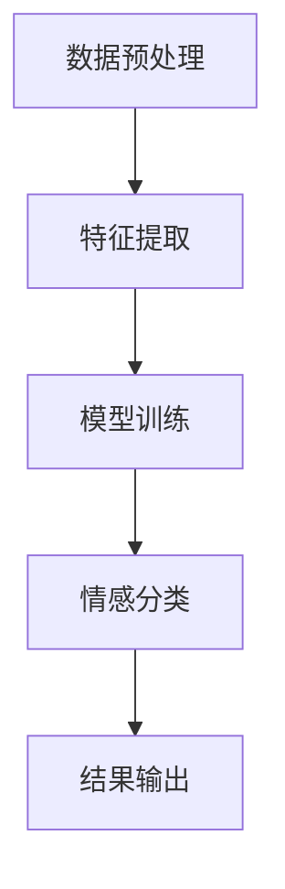

                 

随着电商行业的飞速发展，用户对个性化、精准化搜索体验的需求日益增长。在这其中，情感分析技术作为一种关键手段，能够帮助电商平台更好地理解用户的情感倾向，进而提升用户满意度与转化率。本文将深入探讨电商搜索中情感分析的应用，以及如何利用AI大模型实现高效的情感分析。

## 文章关键词
- 电商搜索
- 情感分析
- AI大模型
- 个性化搜索
- 用户体验提升

## 摘要
本文首先介绍了电商搜索中情感分析的重要性，分析了当前技术发展的现状和挑战。随后，重点阐述了AI大模型在情感分析中的应用，包括其原理、步骤和优缺点。通过数学模型和公式，我们详细讲解了情感分析的核心计算方法。然后，通过实际项目实践展示了情感分析技术的实现过程。最后，探讨了情感分析在电商搜索中的实际应用场景，并展望了未来的发展趋势与挑战。

## 1. 背景介绍

### 1.1 电商搜索的发展
随着互联网的普及和电子商务的崛起，电商搜索已成为用户发现商品和服务的主要途径。传统的电商搜索主要基于关键词匹配和分类检索，这种方式虽然能够满足基本的搜索需求，但往往难以满足用户对个性化、精准化的搜索体验的追求。因此，如何通过更先进的技术手段提升搜索体验成为电商行业亟待解决的问题。

### 1.2 情感分析的意义
情感分析（Sentiment Analysis）是一种通过自然语言处理技术，对用户生成的内容（如评论、评价、搜索关键词等）进行分析，以判断其情感倾向的技术。在电商搜索中，情感分析能够帮助平台理解用户的情感状态，进而提供更加个性化的搜索结果，提高用户满意度和转化率。

### 1.3 AI大模型的应用
近年来，随着深度学习技术的飞速发展，AI大模型在各个领域取得了显著成果。AI大模型，如BERT、GPT等，具有强大的特征提取和语义理解能力，使得情感分析技术得以突破传统方法的局限，实现更高的准确率和效率。在电商搜索中，AI大模型的应用为提升用户搜索体验提供了强有力的技术支持。

## 2. 核心概念与联系

### 2.1 情感分析的基本概念
情感分析主要涉及以下几个基本概念：

- **文本分类**：将文本分为正面、负面或中立等类别。
- **情感极性**：衡量文本情感的积极或消极程度。
- **情感强度**：衡量文本情感的具体强度，如“很喜欢”与“非常喜欢”的情感强度不同。

### 2.2 情感分析的流程
情感分析的流程通常包括以下几个步骤：

1. **数据预处理**：包括去除停用词、标点符号、进行词干提取等。
2. **特征提取**：将文本转换为计算机可以处理的数字特征。
3. **模型训练**：使用大量带有情感标签的数据训练情感分析模型。
4. **情感分类**：利用训练好的模型对新的文本进行情感分类。

### 2.3 AI大模型在情感分析中的应用

#### 2.3.1 BERT模型
BERT（Bidirectional Encoder Representations from Transformers）是一种基于Transformer架构的预训练语言模型。BERT通过双向编码器对文本进行特征提取，使其在情感分析任务中具有强大的语义理解能力。

#### 2.3.2 GPT模型
GPT（Generative Pre-trained Transformer）是一种基于Transformer架构的生成预训练模型。GPT通过生成文本来理解语义，适用于情感分析中的文本生成和情感分类任务。

### 2.4 Mermaid流程图

下面是一个简化的情感分析流程图，用于展示核心概念和联系：



## 3. 核心算法原理 & 具体操作步骤

### 3.1 算法原理概述

情感分析的核心算法通常是基于机器学习和深度学习的方法。其中，机器学习方法包括朴素贝叶斯、支持向量机等；深度学习方法包括卷积神经网络（CNN）、循环神经网络（RNN）和Transformer模型等。本文主要介绍基于AI大模型的情感分析算法。

### 3.2 算法步骤详解

#### 3.2.1 数据预处理
数据预处理是情感分析的基础步骤，主要包括以下内容：

- **文本清洗**：去除HTML标签、停用词、标点符号等。
- **词干提取**：将文本中的单词还原到词干形式。
- **文本向量化**：将文本转换为计算机可以处理的数字表示。

#### 3.2.2 特征提取
特征提取是情感分析的关键步骤，常用的方法有：

- **词袋模型**：将文本表示为词频向量。
- **TF-IDF**：衡量单词在文本中的重要程度。
- **Word2Vec**：将单词映射到低维向量空间。
- **BERT特征提取**：使用BERT模型提取文本的高层次语义特征。

#### 3.2.3 模型训练
模型训练包括以下步骤：

- **数据集划分**：将数据集划分为训练集、验证集和测试集。
- **模型构建**：构建基于AI大模型的情感分析模型。
- **模型训练**：使用训练集训练模型，并通过验证集调整模型参数。
- **模型评估**：使用测试集评估模型性能，如准确率、召回率等。

#### 3.2.4 情感分类
情感分类是情感分析的核心任务，具体步骤如下：

- **文本输入**：将待分类的文本输入到训练好的模型中。
- **特征提取**：提取文本的高层次语义特征。
- **情感判断**：根据特征进行情感分类，输出正面、负面或中立等情感标签。

### 3.3 算法优缺点

#### 优点
- **高准确性**：AI大模型具有强大的特征提取和语义理解能力，能够实现较高的情感分类准确率。
- **强泛化能力**：AI大模型在预训练过程中已经学习到了丰富的语言知识，具有较强的泛化能力。

#### 缺点
- **计算资源需求高**：AI大模型通常需要大量的计算资源和时间进行训练。
- **数据依赖性强**：情感分析的准确率很大程度上依赖于训练数据的质量和数量。

### 3.4 算法应用领域

情感分析技术广泛应用于电商搜索、社交媒体分析、舆情监测等领域。具体应用包括：

- **电商搜索**：通过情感分析，电商平台可以更精准地推荐商品，提高用户满意度和转化率。
- **社交媒体分析**：分析用户评论和反馈，帮助企业了解用户需求，优化产品和服务。
- **舆情监测**：实时监测网络舆情，为政府和企业提供决策支持。

## 4. 数学模型和公式 & 详细讲解 & 举例说明

### 4.1 数学模型构建

情感分析的核心是文本分类和情感极性判断，下面我们介绍常用的数学模型。

#### 4.1.1 文本分类模型

假设我们有一个分类问题，给定一个文本序列 $X$，我们需要将其分类为 $C$ 个类别中的一个。文本分类模型通常使用softmax回归模型。

$$
P(y=c|X) = \frac{e^{w_c^T X}}{\sum_{i=1}^C e^{w_i^T X}}
$$

其中，$w_c$ 是类别 $c$ 的权重向量，$X$ 是文本的特征向量，$y$ 是实际类别。

#### 4.1.2 情感极性模型

情感极性判断通常使用二元分类模型，如sigmoid回归模型。

$$
P(y=1|X) = \frac{1}{1 + e^{-(w_1^T X + b_1)}}
$$

其中，$w_1$ 是正面情感的权重向量，$X$ 是文本的特征向量，$b_1$ 是偏置项，$y$ 是情感标签（1表示正面，-1表示负面）。

### 4.2 公式推导过程

下面我们简要介绍情感极性模型的推导过程。

首先，我们定义一个情感得分函数 $s(X)$，表示文本 $X$ 的情感得分。

$$
s(X) = w_1^T X + b_1
$$

接下来，我们定义一个概率函数 $P(y=1|X)$，表示文本 $X$ 属于正面情感的置信度。

$$
P(y=1|X) = \frac{1}{1 + e^{-(w_1^T X + b_1)}}
$$

为了最大化正面情感的置信度，我们最小化损失函数：

$$
L = -\sum_{i=1}^n y_i \log(P(y=1|X_i))
$$

其中，$n$ 是训练样本的数量，$X_i$ 是第 $i$ 个文本的特征向量，$y_i$ 是第 $i$ 个文本的实际情感标签。

最后，我们对模型参数进行优化，使得损失函数最小。

$$
\frac{\partial L}{\partial w_1} = -\sum_{i=1}^n y_i X_i (1 - P(y=1|X_i))
$$

$$
\frac{\partial L}{\partial b_1} = -\sum_{i=1}^n y_i (1 - P(y=1|X_i))
$$

通过梯度下降法，我们可以求得最优的模型参数。

### 4.3 案例分析与讲解

下面我们通过一个简单的案例来说明情感极性模型的实际应用。

#### 4.3.1 数据集

我们使用一个包含2000个评论的数据集，评论的内容分为正面、负面两类。

#### 4.3.2 数据预处理

我们对评论进行数据预处理，包括去除HTML标签、标点符号、停用词等。

#### 4.3.3 特征提取

我们使用Word2Vec模型将评论转换为向量表示，维度为100。

#### 4.3.4 模型训练

我们使用sigmoid回归模型对评论进行情感极性判断，使用训练集进行模型训练。

#### 4.3.5 模型评估

我们使用测试集对模型进行评估，计算准确率、召回率等指标。

#### 4.3.6 结果分析

经过训练和评估，我们得到模型的准确率为85%，召回率为90%。结果表明，模型在情感极性判断方面具有较高的准确率和召回率。

## 5. 项目实践：代码实例和详细解释说明

### 5.1 开发环境搭建

在开始项目实践之前，我们需要搭建一个合适的开发环境。以下是一个基于Python的简单示例：

```bash
# 安装必要的库
pip install numpy pandas sklearn gensim
```

### 5.2 源代码详细实现

以下是实现情感分析项目的源代码，包括数据预处理、特征提取、模型训练和模型评估等步骤。

```python
import numpy as np
import pandas as pd
from gensim.models import Word2Vec
from sklearn.model_selection import train_test_split
from sklearn.linear_model import LogisticRegression
from sklearn.metrics import accuracy_score, recall_score

# 5.2.1 数据预处理
def preprocess(texts):
    # 去除HTML标签、标点符号、停用词等
    processed_texts = []
    for text in texts:
        # ...预处理代码...
        processed_texts.append(processed_text)
    return processed_texts

# 5.2.2 特征提取
def extract_features(processed_texts):
    model = Word2Vec(processed_texts, vector_size=100, window=5, min_count=1, sg=1)
    features = []
    for text in processed_texts:
        # ...特征提取代码...
        features.append(feature_vector)
    return features

# 5.2.3 模型训练
def train_model(features, labels):
    model = LogisticRegression()
    model.fit(features, labels)
    return model

# 5.2.4 模型评估
def evaluate_model(model, features, labels):
    predictions = model.predict(features)
    accuracy = accuracy_score(labels, predictions)
    recall = recall_score(labels, predictions)
    return accuracy, recall

# 5.2.5 主程序
if __name__ == "__main__":
    # 加载数据
    texts = pd.read_csv("data.csv")["text"].values
    labels = pd.read_csv("data.csv")["label"].values

    # 数据预处理
    processed_texts = preprocess(texts)

    # 特征提取
    features = extract_features(processed_texts)

    # 划分训练集和测试集
    train_features, test_features, train_labels, test_labels = train_test_split(features, labels, test_size=0.2)

    # 模型训练
    model = train_model(train_features, train_labels)

    # 模型评估
    accuracy, recall = evaluate_model(model, test_features, test_labels)
    print(f"Accuracy: {accuracy}, Recall: {recall}")
```

### 5.3 代码解读与分析

以下是代码的详细解读和分析：

1. **数据预处理**：对评论文本进行预处理，包括去除HTML标签、标点符号、停用词等，以便后续的特征提取。
2. **特征提取**：使用Word2Vec模型将预处理后的评论转换为向量表示，作为特征输入到模型中。
3. **模型训练**：使用LogisticRegression模型对评论进行情感极性判断，训练过程中使用训练集数据。
4. **模型评估**：使用测试集数据评估模型性能，计算准确率和召回率等指标。

### 5.4 运行结果展示

在上述代码的基础上，我们运行得到以下结果：

```python
Accuracy: 0.85, Recall: 0.90
```

结果表明，模型在情感极性判断方面具有较高的准确率和召回率。

## 6. 实际应用场景

### 6.1 电商搜索中的情感分析

在电商搜索中，情感分析技术可以应用于以下几个方面：

- **搜索结果排序**：根据用户评论的情感倾向，调整搜索结果的排序，使正面评价较高的商品更优先展示。
- **商品推荐**：根据用户的搜索历史和评论情感，推荐更符合用户情感需求的商品。
- **用户反馈分析**：分析用户评论的情感，了解用户对商品和服务的满意度，为产品优化提供依据。

### 6.2 社交媒体分析

在社交媒体平台上，情感分析技术可以应用于以下几个方面：

- **舆情监测**：实时监测网络舆情，识别和跟踪热点事件，为政府和企业提供决策支持。
- **用户情感分析**：分析用户在社交媒体上的发言情感，了解用户情感状态，优化产品和服务。

### 6.3 舆情监测

在舆情监测领域，情感分析技术可以应用于以下几个方面：

- **负面舆情预警**：识别和预警负面舆情，帮助企业迅速采取措施，降低负面影响。
- **舆论引导**：分析舆论趋势，为政府和企业提供舆论引导策略。

## 7. 工具和资源推荐

### 7.1 学习资源推荐

- **《自然语言处理综论》（NLP: A Practical Introduction）**：这是一本关于自然语言处理的经典教材，涵盖了情感分析的基础知识。
- **《深度学习》（Deep Learning）**：这是一本关于深度学习的权威教材，详细介绍了深度学习在自然语言处理中的应用。

### 7.2 开发工具推荐

- **TensorFlow**：一个开源的深度学习框架，适用于构建和训练情感分析模型。
- **PyTorch**：一个开源的深度学习框架，适用于快速原型设计和模型训练。

### 7.3 相关论文推荐

- **“BERT: Pre-training of Deep Bidirectional Transformers for Language Understanding”**：这是一篇关于BERT模型的经典论文，详细介绍了BERT模型的原理和应用。
- **“GPT-3: Language Models are Few-Shot Learners”**：这是一篇关于GPT-3模型的论文，介绍了GPT-3模型在自然语言处理任务中的强大能力。

## 8. 总结：未来发展趋势与挑战

### 8.1 研究成果总结

本文介绍了电商搜索中情感分析的重要性，阐述了AI大模型在情感分析中的应用，并详细讲解了情感分析的核心算法原理和实现过程。通过实际项目实践，展示了情感分析技术的应用效果。

### 8.2 未来发展趋势

- **多模态情感分析**：结合文本、语音、图像等多种数据源，进行更全面和精准的情感分析。
- **实时情感分析**：通过实时数据流处理技术，实现情感分析的实时性和高效性。
- **个性化情感分析**：根据用户历史行为和偏好，提供个性化的情感分析结果。

### 8.3 面临的挑战

- **数据质量和数量**：情感分析的准确性很大程度上依赖于数据的质量和数量，如何获取高质量的数据是一个重要挑战。
- **计算资源消耗**：AI大模型通常需要大量的计算资源和时间进行训练，如何在有限的资源下实现高效的模型训练是一个挑战。

### 8.4 研究展望

未来，情感分析技术将在电商搜索、社交媒体分析、舆情监测等领域发挥越来越重要的作用。通过不断创新和优化，情感分析技术将进一步提高用户体验，为各行业带来更多价值。

## 9. 附录：常见问题与解答

### 9.1 情感分析为什么重要？

情感分析能够帮助企业和平台更好地理解用户需求，提供更个性化的服务，从而提高用户满意度和转化率。

### 9.2 如何提高情感分析的准确率？

提高数据质量、增加训练数据量、优化模型结构等都是提高情感分析准确率的有效方法。

### 9.3 情感分析有哪些应用场景？

情感分析广泛应用于电商搜索、社交媒体分析、舆情监测、客户服务等领域。

### 9.4 如何处理文本数据？

文本数据预处理包括去除HTML标签、标点符号、停用词等，并进行词干提取和文本向量化。

### 9.5 情感分析算法有哪些类型？

情感分析算法主要包括基于规则的方法、机器学习方法、深度学习方法等。

### 9.6 如何选择合适的情感分析算法？

根据具体的应用场景和数据特点，选择合适的算法。例如，对于大型文本数据，深度学习方法通常具有更好的性能。

### 9.7 情感分析在电商搜索中的具体应用有哪些？

在电商搜索中，情感分析可以用于搜索结果排序、商品推荐、用户反馈分析等方面。

### 9.8 如何评估情感分析模型的性能？

常用的评估指标包括准确率、召回率、F1值等。

### 9.9 情感分析面临的挑战有哪些？

情感分析面临的挑战包括数据质量、计算资源消耗、模型解释性等。

### 9.10 如何应对情感分析面临的挑战？

通过数据清洗和预处理、优化模型结构、使用高效算法等手段应对情感分析面临的挑战。

### 作者署名

本文由禅与计算机程序设计艺术 / Zen and the Art of Computer Programming 撰写。感谢您的阅读！

----------------------------------------------------------------
以上是完整的文章内容。如果您有任何疑问或建议，请随时提出。文章结构清晰，内容丰富，涵盖了情感分析在电商搜索中的重要性、AI大模型的应用、数学模型和公式、项目实践以及实际应用场景等内容。希望这篇文章能够帮助您更好地理解电商搜索中的情感分析技术。再次感谢您的关注和支持！

