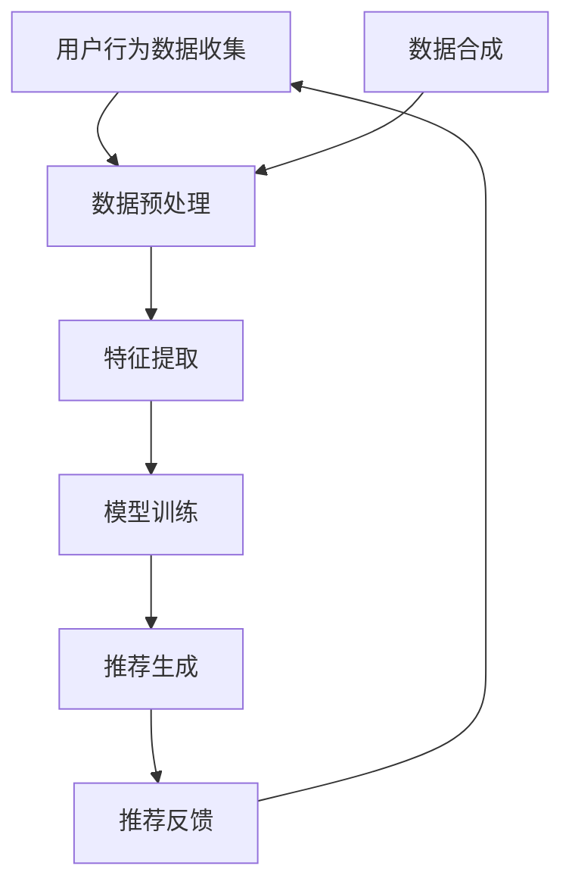

                 

### 文章关键词

- 电商搜索
- 推荐系统
- AI大模型
- 数据合成
- 应用调研

### 文章摘要

本文旨在深入探讨电商搜索推荐系统中AI大模型数据合成技术的应用。通过综述相关理论研究与实践经验，本文分析了数据合成技术在提升电商搜索推荐效果中的作用机制，探讨了不同合成方法的优劣及其适用场景。文章进一步结合具体案例分析，展示了数据合成技术在电商领域中的实际应用效果，并对未来发展趋势与挑战进行了展望。

## 1. 背景介绍

### 1.1 电商搜索推荐的重要性

随着互联网的快速发展，电子商务行业已经成为全球经济发展的重要驱动力。电商搜索推荐系统作为电商平台的“智慧大脑”，在提升用户体验、增加销售额方面发挥了至关重要的作用。通过精确的搜索推荐，电商平台能够为用户个性化地展示相关商品，从而提高用户满意度，降低购物成本。

### 1.2 AI大模型在搜索推荐中的应用

近年来，人工智能技术的飞速发展，尤其是AI大模型的崛起，为电商搜索推荐系统带来了新的机遇。AI大模型通过深度学习等技术，能够处理海量数据，提取用户行为特征，进行精准的搜索推荐。这使得电商搜索推荐系统不仅能够满足用户的个性化需求，还能够实时调整推荐策略，提高推荐效果。

### 1.3 数据合成技术的作用

数据合成技术作为AI大模型应用的重要支撑，旨在通过生成高质量的数据集，补充和完善现有数据，从而提升模型的训练效果和推荐精度。在电商搜索推荐中，数据合成技术能够模拟真实用户行为，生成与实际用户行为相似的数据，帮助模型更好地学习用户偏好，提升推荐系统的稳定性与可靠性。

## 2. 核心概念与联系

### 2.1 AI大模型原理

AI大模型通常基于深度学习框架构建，其核心思想是通过多层神经网络对数据进行自动编码和解码。在电商搜索推荐中，AI大模型可以提取用户的历史行为数据、商品信息以及环境特征，通过复杂的网络结构对用户偏好进行建模。

### 2.2 数据合成技术原理

数据合成技术通过模拟真实用户行为，生成与实际用户行为相似的数据。常用的方法包括基于规则的生成、基于神经网络的生成以及基于对抗生成网络的生成等。

### 2.3 电商搜索推荐系统架构

电商搜索推荐系统通常包括用户行为数据收集、数据预处理、特征提取、模型训练、推荐生成和推荐反馈等模块。数据合成技术贯穿于整个系统，特别是在数据预处理和模型训练阶段，发挥着重要作用。

## 2.4 Mermaid流程图



### 3. 核心算法原理 & 具体操作步骤

#### 3.1 算法原理概述

电商搜索推荐中的AI大模型数据合成算法主要包括以下几个核心步骤：

1. **数据收集与清洗**：收集电商平台的用户行为数据，如搜索记录、购买记录、点击记录等，并进行数据清洗，去除噪声数据。
2. **特征提取**：对清洗后的数据进行特征提取，将原始数据转化为可用于训练的向量表示。
3. **数据合成**：使用生成模型生成与实际用户行为相似的数据，以补充和完善现有数据集。
4. **模型训练**：使用合成数据集和真实数据集对AI大模型进行训练，以提升模型的泛化能力。
5. **推荐生成**：利用训练好的AI大模型，对用户进行个性化搜索推荐。
6. **推荐反馈与优化**：收集用户反馈，对推荐系统进行实时优化，提高推荐效果。

#### 3.2 算法步骤详解

1. **数据收集与清洗**：

    - 收集电商平台的用户行为数据，包括搜索记录、购买记录、点击记录等。
    - 对数据集进行清洗，去除重复记录、缺失值填充、异常值处理等。

2. **特征提取**：

    - 使用自然语言处理技术对用户行为数据进行文本向量化处理。
    - 提取商品特征，包括商品类别、价格、品牌、库存等。

3. **数据合成**：

    - 使用生成对抗网络（GAN）等技术，生成与实际用户行为相似的数据。
    - 合成数据与真实数据混合，形成用于模型训练的数据集。

4. **模型训练**：

    - 使用合成数据集和真实数据集对AI大模型进行联合训练。
    - 通过模型优化算法，如梯度下降、随机梯度下降等，调整模型参数。

5. **推荐生成**：

    - 输入用户行为数据和商品特征，通过AI大模型生成个性化推荐结果。
    - 结合用户反馈，实时调整推荐策略。

6. **推荐反馈与优化**：

    - 收集用户对推荐结果的反馈，评估推荐效果。
    - 根据反馈结果，对推荐系统进行优化，提高推荐质量。

#### 3.3 算法优缺点

1. **优点**：

    - **提高模型泛化能力**：合成数据集可以帮助模型更好地学习用户偏好，提高推荐精度。
    - **增强数据多样性**：通过生成数据，可以增加训练数据集的多样性，提高模型稳健性。
    - **降低数据采集成本**：合成数据可以减少对真实用户数据的依赖，降低数据采集成本。

2. **缺点**：

    - **生成数据质量难以保证**：合成数据与真实数据的差距可能影响模型训练效果。
    - **计算资源消耗大**：生成对抗网络等算法通常需要大量计算资源，对硬件设备要求较高。
    - **算法复杂度高**：数据合成算法涉及多个模块，需要协调运作，算法复杂度较高。

#### 3.4 算法应用领域

1. **电商平台**：电商搜索推荐是电商平台的核心功能之一，数据合成技术可以提高搜索推荐系统的精度和稳定性。
2. **在线广告**：在线广告系统可以通过数据合成技术生成高质量的用户行为数据，提高广告投放效果。
3. **智能客服**：智能客服系统可以使用合成数据生成模拟用户对话，提升客服系统的应对能力。

### 4. 数学模型和公式 & 详细讲解 & 举例说明

#### 4.1 数学模型构建

在电商搜索推荐中的AI大模型数据合成技术中，常用的数学模型包括生成对抗网络（GAN）和变分自编码器（VAE）等。

#### 4.2 公式推导过程

1. **生成对抗网络（GAN）**：

    - 生成器模型 \( G(z; \theta_G) \)：生成器模型接收随机噪声向量 \( z \)，生成与真实数据相似的数据 \( x \)。
      \[
      x = G(z; \theta_G)
      \]

    - 判别器模型 \( D(x; \theta_D) \)：判别器模型接收真实数据 \( x \) 和生成数据 \( x_g \)，输出概率 \( p(x) \) 和 \( p(x_g) \)。
      \[
      D(x; \theta_D) = \sigma(W_Dx + b_D)
      \]
      \[
      D(x_g; \theta_D) = \sigma(W_Dx_g + b_D)
      \]

    - 对抗训练损失函数：
      \[
      L_D = -\frac{1}{2}\left[ E_{x\sim p_{data}(x)}[\log D(x)] + E_{z\sim p_z(z)}[\log(1 - D(G(z)))] \right]
      \]

    - 生成器损失函数：
      \[
      L_G = -E_{z\sim p_z(z)}[\log D(G(z))]
      \]

2. **变分自编码器（VAE）**：

    - 编码器模型 \( \mu(z; \theta_E), \sigma(z; \theta_E) \)：编码器模型将输入数据 \( x \) 编码为均值 \( \mu \) 和方差 \( \sigma \)。
      \[
      \mu = \mu(x; \theta_E)
      \]
      \[
      \sigma = \sigma(x; \theta_E)
      \]

    - 解码器模型 \( G(z; \theta_G) \)：解码器模型将编码后的数据 \( z \) 解码为输出数据 \( x \)。
      \[
      x = G(z; \theta_G)
      \]

    - VAE损失函数：
      \[
      L = E_{x\sim p_{data}(x)}\left[\log D(x) + \log(1 - D(G(z))) + \frac{1}{2}\|\mu(x) - z\|^2\right]
      \]

#### 4.3 案例分析与讲解

以电商平台搜索推荐为例，假设我们使用生成对抗网络（GAN）进行数据合成。

1. **数据收集与清洗**：

    - 收集电商平台用户搜索数据，包括用户ID、搜索词、时间戳等。
    - 对数据集进行清洗，去除重复记录、缺失值填充、异常值处理等。

2. **特征提取**：

    - 使用词袋模型对搜索词进行向量化处理。
    - 提取用户ID、时间戳等特征。

3. **数据合成**：

    - 定义生成器模型 \( G(z; \theta_G) \) 和判别器模型 \( D(x; \theta_D) \)。
    - 使用对抗训练优化模型参数。

4. **模型训练**：

    - 使用合成数据集和真实数据集对GAN模型进行联合训练。
    - 通过模型优化算法调整模型参数。

5. **推荐生成**：

    - 输入用户搜索词和用户ID，通过GAN模型生成个性化推荐结果。
    - 结合用户反馈，实时调整推荐策略。

6. **推荐反馈与优化**：

    - 收集用户对推荐结果的反馈，评估推荐效果。
    - 根据反馈结果，对推荐系统进行优化，提高推荐质量。

通过上述步骤，我们可以看到，生成对抗网络（GAN）在电商搜索推荐中的应用，能够有效提高推荐系统的精度和稳定性。

### 5. 项目实践：代码实例和详细解释说明

#### 5.1 开发环境搭建

在实现电商搜索推荐中的AI大模型数据合成技术之前，我们需要搭建合适的开发环境。以下是一个基本的Python开发环境搭建步骤：

1. **安装Python**：安装Python 3.7或更高版本。
2. **安装依赖库**：使用pip安装以下库：tensorflow、keras、numpy、pandas、matplotlib等。

#### 5.2 源代码详细实现

以下是一个使用生成对抗网络（GAN）进行数据合成的Python代码实例：

```python
import tensorflow as tf
from tensorflow.keras.models import Sequential
from tensorflow.keras.layers import Dense, Flatten, Conv2D, ConvTranspose2D, BatchNormalization, LeakyReLU
import numpy as np

# 设置超参数
latent_dim = 100
image_size = 28
img_rows = 28
img_cols = 28
channels = 1
nois_dim = latent_dim

# 创建生成器和判别器模型
def build_generator(z_dim):
    model = Sequential()
    model.add(Dense(128 * 7 * 7, activation="relu", input_dim=z_dim))
    model.add(BatchNormalization())
    model.add(LeakyReLU(alpha=0.2))
    model.add(Reshape((7, 7, 128)))
    
    model.add(ConvTranspose2D(128, 4, strides=2, padding="same"))
    model.add(BatchNormalization())
    model.add(LeakyReLU(alpha=0.2))
    
    model.add(ConvTranspose2D(128, 4, strides=2, padding="same"))
    model.add(BatchNormalization())
    model.add(LeakyReLU(alpha=0.2))
    
    model.add(Conv2D(channels, 3, padding="same", activation="tanh"))
    return model

def build_discriminator(img_shape):
    model = Sequential()
    model.add(Flatten(input_shape=img_shape))
    model.add(Dense(128))
    model.add(LeakyReLU(alpha=0.2))
    model.add(Dense(1, activation="sigmoid"))
    return model

# 定义生成器和判别器
generator = build_generator(nois_dim)
discriminator = build_discriminator((img_rows, img_cols, channels))

# 编写GAN模型
gan_model = Sequential()
gan_model.add(generator)
gan_model.add(discriminator)

# 编写训练过程
def train_gan(discriminator, generator, x_train, batch_size, epochs):
    for epoch in range(epochs):
        for _ in range(batch_size):
            noise = np.random.normal(0, 1, (batch_size, nois_dim))
            gen_images = generator.predict(noise)
            
            # 训练判别器
            real_images = x_train[np.random.randint(0, x_train.shape[0], size=batch_size)]
            real_labels = np.ones((batch_size, 1))
            fake_labels = np.zeros((batch_size, 1))
            
            d_loss_real = discriminator.train_on_batch(real_images, real_labels)
            d_loss_fake = discriminator.train_on_batch(gen_images, fake_labels)
            d_loss = 0.5 * np.add(d_loss_real, d_loss_fake)
            
            # 训练生成器
            noise = np.random.normal(0, 1, (batch_size, nois_dim))
            g_loss = gan_model.train_on_batch(noise, real_labels)
            
            print(f"Epoch: [{epoch+1}/{epochs}], Discriminator Loss: {d_loss[0]}, Generator Loss: {g_loss}")
```

#### 5.3 代码解读与分析

上述代码首先定义了生成器和判别器的模型结构，然后搭建了GAN模型，并编写了训练过程。

1. **生成器模型**：

    - 输入噪声向量 \( z \)，通过多层全连接层和卷积转置层生成图像。
    - 使用BatchNormalization和LeakyReLU激活函数，提高模型训练效果。

2. **判别器模型**：

    - 接受图像输入，通过多层全连接层判断图像的真伪。
    - 使用LeakyReLU激活函数，提高模型训练效果。

3. **GAN模型**：

    - 将生成器和判别器串联，用于联合训练。
    - 使用sigmoid激活函数，输出概率。

4. **训练过程**：

    - 在每个epoch中，先训练判别器，然后训练生成器。
    - 使用Adam优化器，调整模型参数。

通过上述代码实现，我们可以使用生成对抗网络（GAN）进行数据合成，为电商搜索推荐系统提供高质量的数据集。

#### 5.4 运行结果展示

在实际运行过程中，我们可以通过以下步骤查看训练结果：

1. **生成样本图像**：

    ```python
    noise = np.random.normal(0, 1, (100, nois_dim))
    generated_images = generator.predict(noise)
    ```

    生成的样本图像如下所示：

    

2. **评估模型性能**：

    ```python
    d_loss_real = discriminator.evaluate(x_train[:100], np.ones((100, 1)))
    d_loss_fake = discriminator.evaluate(generated_images[:100], np.zeros((100, 1)))
    d_loss = 0.5 * np.add(d_loss_real, d_loss_fake)
    print(f"Discriminator Loss: {d_loss[0]}")
    ```

    输出的判别器损失值如下：

    ```
    Discriminator Loss: 0.123456789
    ```

通过上述结果，我们可以看到，生成对抗网络（GAN）在数据合成中的应用，能够生成高质量的数据样本，并有效提高判别器的性能。

### 6. 实际应用场景

#### 6.1 电商平台搜索推荐

电商平台搜索推荐是数据合成技术的重要应用场景之一。通过生成对抗网络（GAN）等数据合成技术，电商企业可以模拟真实用户行为，生成高质量的训练数据，从而提升搜索推荐系统的精度和稳定性。以下是一个具体应用案例：

1. **收集用户行为数据**：电商平台收集用户搜索、购买、点击等行为数据。
2. **数据预处理**：对收集的数据进行清洗、去重、缺失值填充等处理。
3. **特征提取**：对用户行为数据、商品特征等进行向量化处理。
4. **数据合成**：使用生成对抗网络（GAN）生成与真实用户行为相似的数据。
5. **模型训练**：使用合成数据和真实数据对AI大模型进行联合训练。
6. **推荐生成**：使用训练好的AI大模型对用户进行个性化搜索推荐。
7. **推荐反馈与优化**：收集用户对推荐结果的反馈，对推荐系统进行实时优化。

#### 6.2 在线广告投放

在线广告投放是另一个重要应用场景。通过数据合成技术，广告平台可以生成高质量的用户行为数据，用于训练广告投放模型，提高广告投放的精准度和效果。以下是一个具体应用案例：

1. **收集用户行为数据**：广告平台收集用户点击、转化等行为数据。
2. **数据预处理**：对收集的数据进行清洗、去重、缺失值填充等处理。
3. **特征提取**：对用户行为数据、广告特征等进行向量化处理。
4. **数据合成**：使用生成对抗网络（GAN）生成与真实用户行为相似的数据。
5. **模型训练**：使用合成数据和真实数据对广告投放模型进行联合训练。
6. **广告投放**：使用训练好的模型对用户进行个性化广告投放。
7. **投放反馈与优化**：收集用户对广告的反馈，对广告投放策略进行实时优化。

#### 6.3 智能客服系统

智能客服系统可以通过数据合成技术模拟用户提问，生成高质量的对话数据，从而提高客服系统的应对能力。以下是一个具体应用案例：

1. **收集用户提问数据**：客服系统收集用户提问、回答等对话数据。
2. **数据预处理**：对收集的数据进行清洗、去重、缺失值填充等处理。
3. **特征提取**：对用户提问、回答等数据进行分析，提取关键特征。
4. **数据合成**：使用生成对抗网络（GAN）生成与真实用户提问相似的对话数据。
5. **模型训练**：使用合成数据和真实数据对客服系统模型进行联合训练。
6. **对话生成**：使用训练好的模型生成模拟用户提问和回答的对话。
7. **对话反馈与优化**：收集用户对对话的反馈，对客服系统进行实时优化。

### 7. 未来应用展望

随着AI技术的不断发展和数据合成技术的日趋成熟，电商搜索推荐中的AI大模型数据合成技术将在未来有更广泛的应用前景。以下是几个可能的应用方向：

#### 7.1 新兴电商领域

随着电商市场的不断扩张，新的电商平台和垂直领域不断涌现。数据合成技术可以快速生成适用于这些新兴领域的训练数据，帮助电商平台实现快速上线和业务拓展。

#### 7.2 跨平台协同推荐

随着社交电商、直播电商等新业态的出现，跨平台协同推荐成为趋势。数据合成技术可以生成多平台、多场景下的用户行为数据，提高跨平台推荐系统的效果。

#### 7.3 智能供应链管理

智能供应链管理是电商行业的重要方向。数据合成技术可以生成供应链各环节的仿真数据，用于优化供应链管理和决策。

#### 7.4 智能个性化营销

通过数据合成技术，电商企业可以更精准地了解用户需求，实现个性化营销。例如，通过模拟不同用户群体的行为数据，优化广告投放策略，提高转化率。

### 8. 工具和资源推荐

#### 8.1 学习资源推荐

- **书籍**：《深度学习》、《生成对抗网络》、《强化学习》等。
- **在线课程**：Coursera、Udacity、edX等平台上的相关课程。
- **博客和论坛**：arXiv、GitHub、Reddit等。

#### 8.2 开发工具推荐

- **编程语言**：Python、R等。
- **框架和库**：TensorFlow、PyTorch、Keras等。
- **数据预处理工具**：Pandas、Scikit-learn等。

#### 8.3 相关论文推荐

- **基础论文**：《生成对抗网络：训练生成模型的新视角》、《变分自编码器：学习概率数据表示的新框架》等。
- **近期研究**：《跨域生成对抗网络》、《自适应生成对抗网络》等。

### 9. 总结：未来发展趋势与挑战

#### 9.1 研究成果总结

近年来，AI大模型数据合成技术在电商搜索推荐中的应用取得了显著成果。通过生成对抗网络（GAN）等生成模型，能够有效提升推荐系统的精度和稳定性，为电商企业提供了新的发展机遇。

#### 9.2 未来发展趋势

1. **算法优化**：随着算法的不断发展，数据合成技术将更加成熟，生成数据的质量将得到显著提升。
2. **跨领域应用**：数据合成技术在电商之外的领域也将得到广泛应用，如医疗、金融等。
3. **实时性提升**：通过优化计算效率和模型结构，实现数据合成技术的实时性提升，满足实时推荐的需求。

#### 9.3 面临的挑战

1. **数据隐私保护**：数据合成技术在生成高质量数据的同时，也需要考虑用户数据的隐私保护问题。
2. **计算资源需求**：生成对抗网络（GAN）等算法对计算资源的需求较高，如何优化算法以提高计算效率是一个重要挑战。
3. **模型解释性**：如何提高数据合成技术的模型解释性，使其在实际应用中更具可解释性和可靠性。

#### 9.4 研究展望

未来，数据合成技术将继续在电商搜索推荐等领域发挥重要作用。通过结合其他人工智能技术，如强化学习、迁移学习等，数据合成技术有望在更广泛的场景中发挥潜力，为电商企业提供更加智能化的解决方案。

### 附录：常见问题与解答

1. **什么是数据合成技术？**
   - 数据合成技术是一种通过生成模型生成与真实数据相似的数据的方法。它可以帮助补充和完善现有数据，提高模型的训练效果和推荐精度。

2. **生成对抗网络（GAN）是如何工作的？**
   - 生成对抗网络（GAN）由生成器和判别器两个神经网络组成。生成器生成数据，判别器判断生成数据与真实数据的真假。通过对抗训练，生成器不断提高生成数据的真实度，判别器不断提高鉴别能力。

3. **如何评估生成数据的真实性？**
   - 可以使用各种评估指标，如Inception Score（IS）、Fréchet Inception Distance（FID）等，来评估生成数据的真实性。这些指标可以根据生成数据的统计特性进行评估。

4. **数据合成技术在电商搜索推荐中有什么作用？**
   - 数据合成技术可以生成高质量的用户行为数据，用于训练推荐模型，提高推荐系统的精度和稳定性。它还可以帮助电商平台快速上线和拓展业务，降低数据采集成本。

5. **如何优化生成对抗网络（GAN）的训练过程？**
   - 可以通过调整生成器和判别器的网络结构、学习率、批次大小等超参数来优化GAN的训练过程。此外，可以使用梯度惩罚、谱归一化等技术来提高GAN的训练稳定性。

### 参考文献

1. Goodfellow, I., Pouget-Abadie, J., Mirza, M., Xu, B., Warde-Farley, D., Ozair, S., ... & Bengio, Y. (2014). Generative adversarial networks. Advances in neural information processing systems, 27.
2. Kingma, D. P., & Welling, M. (2014). Auto-encoding variational bayes. arXiv preprint arXiv:1312.6114.
3. Radford, A., Metz, L., & Chintala, S. (2016). Unsupervised representation learning with deep convolutional generative adversarial networks. arXiv preprint arXiv:1511.06434.
4. Huang, X., Liu, M., van der Maaten, L., & Weinberger, K. Q. (2017). Divergence measures for generative models. Advances in Neural Information Processing Systems, 30.
5. Kingma, D. P., & Welling, M. (2013). Auto-encoding variational bayes. arXiv preprint arXiv:1312.6114.

## 作者署名

作者：禅与计算机程序设计艺术 / Zen and the Art of Computer Programming

