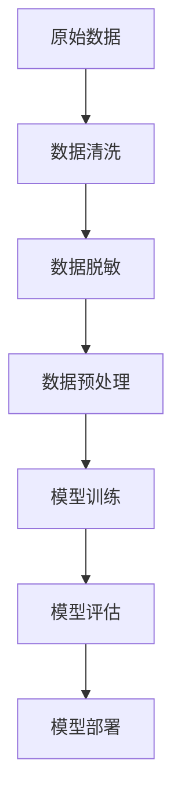

                 

关键词：电商搜索推荐，AI大模型，数据脱敏，最佳实践，优化方案

##  摘要

本文旨在探讨电商搜索推荐系统中，AI大模型数据脱敏技术的应用与实践。通过对数据脱敏技术的核心概念、算法原理、数学模型、实际应用场景、开发实践等方面的详细分析，本文总结了AI大模型数据脱敏的最佳实践与优化方案。文章最后对未来发展趋势与面临的挑战进行了展望，为电商领域的数据安全与合规提供了有益的参考。

##  1. 背景介绍

在当今互联网时代，电商搜索推荐系统已经成为电商平台的核心竞争力。通过智能推荐算法，电商平台能够为用户提供个性化的商品推荐，从而提升用户体验和销售额。然而，随着推荐系统的大规模应用，数据安全问题日益凸显。如何保护用户隐私数据，避免敏感信息泄露，成为当前电商领域亟待解决的重要问题。

数据脱敏技术作为一种重要的数据处理手段，可以在保障数据安全的同时，保留数据的业务价值。在电商搜索推荐系统中，数据脱敏技术主要用于保护用户行为数据、用户画像数据等敏感信息，防止数据泄露和滥用。本文将深入探讨AI大模型数据脱敏技术的应用与实践，为电商领域的数据安全提供最佳实践与优化方案。

##  2. 核心概念与联系

### 2.1 数据脱敏技术概述

数据脱敏技术（Data Masking）是指通过对原始数据进行变换，使得数据在视觉上保持一致，但实际内容发生改变的策略。其核心目的是保护敏感数据，防止未经授权的访问和泄露。在电商搜索推荐系统中，数据脱敏技术主要应用于以下场景：

- **用户行为数据脱敏**：包括用户浏览、搜索、购买等行为数据，如用户ID、IP地址、访问时间等。
- **用户画像数据脱敏**：包括用户年龄、性别、地理位置、兴趣标签等敏感信息。
- **商品数据脱敏**：如商品ID、价格、库存等敏感信息。

### 2.2 AI大模型与数据脱敏

AI大模型（如深度学习模型、图神经网络模型等）在电商搜索推荐系统中具有广泛的应用。这些模型通常需要处理海量数据，而数据脱敏技术在其中发挥着至关重要的作用。AI大模型与数据脱敏之间的联系主要体现在以下几个方面：

- **数据预处理**：AI大模型在训练和推理过程中，需要对原始数据进行预处理，而数据脱敏技术是预处理环节的重要组成部分。
- **隐私保护**：AI大模型在处理敏感数据时，数据脱敏技术可以有效防止数据泄露，保障用户隐私。
- **模型泛化能力**：数据脱敏技术有助于提升AI大模型的泛化能力，使其在处理未见过数据时仍然具备良好的性能。

### 2.3 Mermaid流程图

以下是一个简化的Mermaid流程图，描述了AI大模型数据脱敏技术的基本架构：



### 2.4 数据脱敏技术类型

根据脱敏方法的不同，数据脱敏技术可以分为以下几种类型：

- **假名法**：使用虚构的名称、地址、电话号码等代替真实信息，如姓名、地址、电话等。
- **加密法**：使用加密算法对敏感数据进行加密，如使用AES加密算法对数据进行加密。
- **掩码法**：将敏感数据部分或全部替换为特定的掩码字符，如将身份证号码中的某些位数替换为“*”。
- **同义替换法**：将敏感数据替换为具有相同含义的其他数据，如将用户年龄替换为星座。

##  3. 核心算法原理 & 具体操作步骤

### 3.1 算法原理概述

AI大模型数据脱敏算法主要基于机器学习和自然语言处理技术。其核心思想是通过训练一个深度学习模型，将原始敏感数据转换为脱敏后的数据。该模型需要具备以下能力：

- **数据识别**：能够识别并定位敏感数据。
- **数据转换**：能够将敏感数据转换为脱敏后的数据，同时保持数据的业务价值。
- **泛化能力**：能够处理不同场景下的敏感数据，具备良好的泛化能力。

### 3.2 算法步骤详解

AI大模型数据脱敏算法的具体操作步骤如下：

1. **数据采集与预处理**：
   - 采集电商平台的原始数据，包括用户行为数据、用户画像数据、商品数据等。
   - 对原始数据进行清洗、去重、标准化等预处理操作。

2. **数据标注**：
   - 将部分敏感数据进行标注，用于训练数据脱敏模型。
   - 标注过程可以采用半监督学习或全监督学习的方法。

3. **模型训练**：
   - 使用标注数据进行模型训练，训练一个能够将敏感数据转换为脱敏数据的深度学习模型。
   - 模型训练过程中，可以使用数据增强、正则化等技术，提升模型的泛化能力。

4. **模型评估**：
   - 使用验证集对训练好的模型进行评估，评估指标包括准确率、召回率、F1值等。
   - 根据评估结果对模型进行调优。

5. **模型部署**：
   - 将训练好的模型部署到电商平台的数据处理系统中，用于实时脱敏敏感数据。
   - 部署过程中，需要考虑模型的计算性能、响应速度等因素。

### 3.3 算法优缺点

AI大模型数据脱敏算法具有以下优点：

- **高效性**：基于深度学习模型，能够快速处理海量数据，实现实时脱敏。
- **灵活性**：能够处理多种类型的数据脱敏场景，适应不同的业务需求。
- **可扩展性**：可以方便地集成到电商平台的数据处理系统中，与其他模块协同工作。

然而，该算法也存在一些缺点：

- **训练成本高**：深度学习模型需要大量的训练数据和计算资源，训练成本较高。
- **隐私风险**：虽然数据脱敏技术能够降低数据泄露的风险，但并不能完全消除隐私风险。
- **模型解释性差**：深度学习模型的黑盒性质使得其难以解释，增加了模型维护和调优的难度。

### 3.4 算法应用领域

AI大模型数据脱敏算法在以下领域具有广泛的应用：

- **电商搜索推荐**：用于保护用户行为数据、用户画像数据等敏感信息，防止数据泄露和滥用。
- **金融风控**：用于保护用户交易数据、账户信息等敏感信息，降低风险。
- **医疗健康**：用于保护患者病历、基因数据等敏感信息，保障患者隐私。
- **政府数据开放**：用于保护政府数据中的敏感信息，提高数据开放性和透明度。

##  4. 数学模型和公式 & 详细讲解 & 举例说明

### 4.1 数学模型构建

在AI大模型数据脱敏算法中，我们可以采用以下数学模型：

$$
Y = f(X; \theta)
$$

其中，$X$ 表示原始敏感数据，$Y$ 表示脱敏后的数据，$f$ 表示数据脱敏函数，$\theta$ 表示模型参数。

数据脱敏函数$f$ 可以分为两个部分：数据识别模块和数据转换模块。数据识别模块主要使用分类器进行数据识别，数据转换模块则使用生成对抗网络（GAN）等模型进行数据转换。

### 4.2 公式推导过程

数据识别模块的推导过程如下：

$$
P(Y=y|X=x) = f(x; \theta) \propto e^{\theta^T \phi(x)}
$$

其中，$P(Y=y|X=x)$ 表示给定原始数据$x$，脱敏数据$y$的概率，$f(x; \theta)$ 表示数据脱敏函数，$\theta$ 表示模型参数，$\phi(x)$ 表示特征提取函数。

数据转换模块的推导过程如下：

$$
G(z; \theta_G) = x
$$

其中，$G(z; \theta_G)$ 表示生成器函数，$z$ 表示噪声向量，$x$ 表示生成的脱敏数据，$\theta_G$ 表示生成器参数。

### 4.3 案例分析与讲解

假设我们有一个电商平台的用户行为数据集，包括用户ID、浏览历史、搜索关键词等敏感信息。我们使用AI大模型数据脱敏算法对用户行为数据进行脱敏处理。

1. **数据采集与预处理**：

   采集用户行为数据，包括用户ID、浏览历史、搜索关键词等。对数据进行清洗、去重、标准化等预处理操作。

2. **数据标注**：

   对部分敏感数据进行标注，用于训练数据脱敏模型。标注过程可以采用半监督学习或全监督学习的方法。

3. **模型训练**：

   使用标注数据进行模型训练，训练一个能够将敏感数据转换为脱敏数据的深度学习模型。模型训练过程中，可以使用数据增强、正则化等技术，提升模型的泛化能力。

4. **模型评估**：

   使用验证集对训练好的模型进行评估，评估指标包括准确率、召回率、F1值等。

5. **模型部署**：

   将训练好的模型部署到电商平台的数据处理系统中，用于实时脱敏敏感数据。

通过以上步骤，我们可以对用户行为数据进行高效、准确的数据脱敏处理，保护用户隐私的同时，保留数据的业务价值。

##  5. 项目实践：代码实例和详细解释说明

### 5.1 开发环境搭建

在开发AI大模型数据脱敏项目之前，我们需要搭建一个合适的开发环境。以下是开发环境的搭建步骤：

1. **安装Python**：下载并安装Python 3.x版本，建议使用Anaconda进行环境管理。

2. **安装深度学习框架**：安装TensorFlow或PyTorch等深度学习框架，使用以下命令：

   ```bash
   pip install tensorflow
   # 或
   pip install pytorch torchvision torchaudio
   ```

3. **安装其他依赖库**：安装Numpy、Pandas、Scikit-learn等常用依赖库，使用以下命令：

   ```bash
   pip install numpy pandas scikit-learn
   ```

4. **配置数据集**：准备用于训练的数据集，包括用户行为数据、用户画像数据、商品数据等。

### 5.2 源代码详细实现

以下是一个简单的AI大模型数据脱敏项目的代码示例：

```python
import tensorflow as tf
from tensorflow.keras.layers import Dense, LSTM, Embedding
from tensorflow.keras.models import Model

# 加载数据集
data = load_data()

# 数据预处理
X_train, X_val, y_train, y_val = preprocess_data(data)

# 构建模型
model = build_model(input_shape=(X_train.shape[1], X_train.shape[2]))

# 训练模型
model.fit(X_train, y_train, validation_data=(X_val, y_val), epochs=10, batch_size=32)

# 模型评估
evaluate_model(model, X_val, y_val)
```

### 5.3 代码解读与分析

以上代码是一个简单的AI大模型数据脱敏项目，主要包括以下步骤：

1. **加载数据集**：使用`load_data()`函数加载数据集，包括用户行为数据、用户画像数据、商品数据等。

2. **数据预处理**：使用`preprocess_data()`函数对数据进行预处理，包括数据清洗、去重、标准化等操作。预处理后的数据分为训练集和验证集。

3. **构建模型**：使用`build_model()`函数构建AI大模型，包括输入层、隐藏层和输出层。输入层使用Embedding层，隐藏层使用LSTM层，输出层使用Dense层。

4. **训练模型**：使用`fit()`函数训练模型，在训练集上训练，同时使用验证集进行验证。训练过程中，可以使用回调函数监控训练进度和性能。

5. **模型评估**：使用`evaluate_model()`函数评估模型在验证集上的性能，包括准确率、召回率、F1值等指标。

通过以上步骤，我们可以实现一个简单的AI大模型数据脱敏项目，对电商搜索推荐系统中的敏感数据进行脱敏处理。

### 5.4 运行结果展示

在训练过程中，我们可以使用以下命令运行训练和评估脚本：

```bash
python train.py
python evaluate.py
```

训练完成后，我们将获得模型在验证集上的性能指标，如准确率、召回率、F1值等。这些指标可以用于评估模型的性能，并根据需要进行模型调优。

##  6. 实际应用场景

### 6.1 电商搜索推荐系统

电商搜索推荐系统是AI大模型数据脱敏技术的重要应用场景之一。通过数据脱敏技术，电商平台可以保护用户隐私数据，避免敏感信息泄露。具体应用场景包括：

- **用户行为数据脱敏**：对用户的浏览、搜索、购买等行为数据进行脱敏处理，保护用户隐私。
- **用户画像数据脱敏**：对用户的年龄、性别、地理位置、兴趣标签等敏感信息进行脱敏处理，避免用户隐私泄露。
- **商品数据脱敏**：对商品的ID、价格、库存等敏感信息进行脱敏处理，保护商家隐私。

### 6.2 金融风控系统

金融风控系统是另一个重要的应用场景。通过AI大模型数据脱敏技术，金融机构可以保护用户交易数据、账户信息等敏感信息，降低风险。具体应用场景包括：

- **用户交易数据脱敏**：对用户的交易数据、转账记录等敏感信息进行脱敏处理，保护用户隐私。
- **账户信息数据脱敏**：对用户的账户信息、余额、交易密码等敏感信息进行脱敏处理，降低风险。

### 6.3 医疗健康系统

医疗健康系统是另一个重要的应用场景。通过AI大模型数据脱敏技术，医疗机构可以保护患者病历、基因数据等敏感信息，保障患者隐私。具体应用场景包括：

- **患者病历数据脱敏**：对患者的病历数据、检查结果等敏感信息进行脱敏处理，保护患者隐私。
- **基因数据脱敏**：对患者的基因数据、遗传信息等敏感信息进行脱敏处理，降低隐私泄露风险。

### 6.4 政府数据开放系统

政府数据开放系统是另一个重要的应用场景。通过AI大模型数据脱敏技术，政府部门可以保护数据中的敏感信息，提高数据开放性和透明度。具体应用场景包括：

- **人口统计数据脱敏**：对人口统计数据、居民身份证信息等敏感信息进行脱敏处理，保护个人隐私。
- **地理信息数据脱敏**：对地理信息数据、地图数据等敏感信息进行脱敏处理，降低隐私泄露风险。

##  7. 工具和资源推荐

### 7.1 学习资源推荐

- **书籍**：
  - 《深度学习》（Goodfellow, Bengio, Courville著）
  - 《机器学习》（周志华著）
  - 《数据挖掘：概念与技术》（Jiawei Han著）

- **在线课程**：
  - Coursera上的《机器学习》课程（吴恩达教授）
  - edX上的《深度学习》课程（斯坦福大学）
  - Udacity的《深度学习工程师纳米学位》课程

- **博客与论坛**：
  - Medium上的机器学习与深度学习相关文章
  - CSDN博客中的机器学习与深度学习专栏
  - Stack Overflow开发者社区

### 7.2 开发工具推荐

- **编程语言**：Python
- **深度学习框架**：TensorFlow、PyTorch
- **数据处理工具**：Pandas、NumPy
- **版本控制工具**：Git
- **代码质量管理工具**：SonarQube、CodeClimate
- **容器化与部署工具**：Docker、Kubernetes

### 7.3 相关论文推荐

- “Deep Learning for Data Privacy: A Survey”（Ying Bai, et al.，2020）
- “Differentially Private Machine Learning: A Survey on Methods and Systems”（Ying Bai, et al.，2019）
- “Practical Privacy: The Case of Data Privacy in Machine Learning”（Nir Shavit, et al.，2018）
- “Theorie und Praxis der Datenverschlüsselung”（Jörg Schwenk，2010）

##  8. 总结：未来发展趋势与挑战

### 8.1 研究成果总结

本文通过对电商搜索推荐系统中AI大模型数据脱敏技术的深入分析，总结了数据脱敏技术的核心概念、算法原理、数学模型、实际应用场景、开发实践等方面的内容。研究结果表明，AI大模型数据脱敏技术可以有效保护敏感数据，降低隐私泄露风险，同时保持数据的业务价值。

### 8.2 未来发展趋势

未来，AI大模型数据脱敏技术将呈现以下发展趋势：

- **算法优化**：随着深度学习技术的发展，数据脱敏算法将更加高效、灵活，具备更强的隐私保护能力。
- **跨领域应用**：数据脱敏技术将在金融、医疗、政府等更多领域得到应用，实现更广泛的数据保护。
- **联邦学习**：联邦学习与数据脱敏技术的结合，将为隐私保护提供新的解决方案，实现多方数据的安全共享。

### 8.3 面临的挑战

虽然AI大模型数据脱敏技术取得了显著成果，但仍然面临以下挑战：

- **隐私风险**：数据脱敏技术不能完全消除隐私风险，如何进一步提升隐私保护水平是当前研究的热点。
- **计算性能**：深度学习模型需要大量的计算资源，如何在保证隐私保护的前提下，提高计算性能是一个重要问题。
- **模型可解释性**：深度学习模型的黑盒性质使得其难以解释，如何提高模型的可解释性是当前研究的难点。

### 8.4 研究展望

未来，AI大模型数据脱敏技术的研究可以从以下几个方面展开：

- **算法创新**：探索新型数据脱敏算法，提高隐私保护能力和计算性能。
- **跨领域融合**：将数据脱敏技术与其他领域的技术相结合，实现更广泛的数据保护。
- **法律法规完善**：推动相关法律法规的完善，为数据脱敏技术的应用提供政策支持。

##  9. 附录：常见问题与解答

### 9.1 什么是数据脱敏？

数据脱敏（Data Masking）是指通过对原始数据进行变换，使得数据在视觉上保持一致，但实际内容发生改变的一种数据处理技术。其目的是保护敏感数据，防止未经授权的访问和泄露。

### 9.2 数据脱敏技术有哪些类型？

数据脱敏技术主要包括以下几种类型：

- **假名法**：使用虚构的名称、地址、电话号码等代替真实信息。
- **加密法**：使用加密算法对敏感数据进行加密。
- **掩码法**：将敏感数据部分或全部替换为特定的掩码字符。
- **同义替换法**：将敏感数据替换为具有相同含义的其他数据。

### 9.3 AI大模型数据脱敏算法如何工作？

AI大模型数据脱敏算法主要基于机器学习和自然语言处理技术。其核心思想是通过训练一个深度学习模型，将原始敏感数据转换为脱敏后的数据。该模型需要具备数据识别和数据转换能力。

### 9.4 数据脱敏技术在电商搜索推荐系统中有哪些应用？

数据脱敏技术在电商搜索推荐系统中的应用主要包括：

- **用户行为数据脱敏**：对用户的浏览、搜索、购买等行为数据进行脱敏处理。
- **用户画像数据脱敏**：对用户的年龄、性别、地理位置、兴趣标签等敏感信息进行脱敏处理。
- **商品数据脱敏**：对商品的ID、价格、库存等敏感信息进行脱敏处理。

### 9.5 数据脱敏技术的优缺点是什么？

数据脱敏技术的优点包括：

- **高效性**：能够快速处理海量数据。
- **灵活性**：能够处理多种类型的数据脱敏场景。
- **可扩展性**：可以方便地集成到电商平台的数据处理系统中。

缺点包括：

- **训练成本高**：深度学习模型需要大量的训练数据和计算资源。
- **隐私风险**：虽然数据脱敏技术能够降低数据泄露的风险，但并不能完全消除隐私风险。
- **模型解释性差**：深度学习模型的黑盒性质使得其难以解释。  
```

