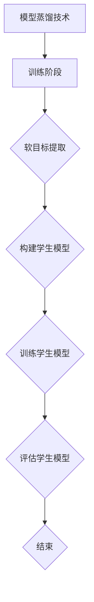

                 

关键词：电商搜索推荐、AI大模型、模型蒸馏技术、搜索推荐系统、大模型压缩、模型优化、算法优化、计算效率、资源效率

> 摘要：本文深入探讨电商搜索推荐系统中应用AI大模型模型蒸馏技术的必要性、核心概念、算法原理、实践案例及未来展望。通过详细介绍模型蒸馏技术，分析其在电商搜索推荐中的优势，旨在为相关领域的研究者和从业者提供有价值的参考。

## 1. 背景介绍

### 1.1 电商搜索推荐系统的现状

随着互联网经济的飞速发展，电商行业日益壮大。电商搜索推荐系统作为电商平台的“智慧大脑”，其性能和效果直接关系到用户体验和业务收益。传统的推荐系统主要依赖于基于内容的过滤、协同过滤等方法，但这些方法在处理大规模数据时存在计算复杂度高、冷启动问题、推荐多样性差等局限。

### 1.2 AI大模型的应用

近年来，人工智能技术的发展为电商搜索推荐系统带来了新的契机。特别是预训练语言模型（如BERT、GPT等）的崛起，使得基于深度学习的方法在自然语言处理任务中取得了显著效果。然而，AI大模型的训练和部署面临计算资源、存储资源、部署成本等方面的挑战。

### 1.3 模型蒸馏技术的引入

模型蒸馏技术（Model Distillation）作为一种高效的大模型压缩与优化方法，通过将一个大型且复杂的模型的知识传递给一个较小且较简单的模型，从而实现降低计算和存储成本的目的。近年来，模型蒸馏技术在图像识别、自然语言处理等领域取得了显著成果，逐渐成为优化AI模型的主流技术之一。

## 2. 核心概念与联系

### 2.1 模型蒸馏技术原理

模型蒸馏技术主要分为两个阶段：训练阶段和蒸馏阶段。在训练阶段，一个大型复杂模型（教师模型）被训练以获得良好的性能。在蒸馏阶段，教师模型的知识被传递给一个较小较简单的模型（学生模型），从而实现对教师模型的优化。

### 2.2 教师模型与学生模型

教师模型通常是一个大型且复杂的神经网络，其拥有丰富的知识和强大的表达能力。学生模型则是一个较小且较简单的神经网络，其目的是学习教师模型的知识和特性。

### 2.3 蒸馏过程

蒸馏过程主要包括以下步骤：

1. **提取教师模型的知识：** 通过软目标（soft target）或硬目标（hard target）的方式，从教师模型中提取知识。

2. **构建学生模型：** 根据提取的知识，构建学生模型。

3. **训练学生模型：** 在蒸馏阶段，使用提取的知识来训练学生模型，使其性能接近教师模型。

4. **评估学生模型：** 对学生模型进行评估，验证其性能。

### 2.4 Mermaid流程图



## 3. 核心算法原理 & 具体操作步骤

### 3.1 算法原理概述

模型蒸馏技术主要基于以下原理：

1. **知识传递：** 将教师模型的知识传递给学生模型，以实现知识共享和性能提升。

2. **优化目标：** 在蒸馏阶段，构建一个优化的目标函数，以衡量学生模型的性能。

3. **误差校正：** 在训练过程中，通过误差校正机制来优化学生模型的参数。

### 3.2 算法步骤详解

1. **初始化教师模型和学生模型：** 根据任务需求，初始化教师模型和学生模型。

2. **训练教师模型：** 使用大量训练数据进行教师模型的训练，以获得良好的性能。

3. **提取教师模型的知识：** 通过软目标或硬目标的方式，从教师模型中提取知识。

4. **构建学生模型：** 根据提取的知识，构建学生模型。

5. **训练学生模型：** 在蒸馏阶段，使用提取的知识来训练学生模型。

6. **评估学生模型：** 对学生模型进行评估，以验证其性能。

### 3.3 算法优缺点

**优点：**

1. **降低计算和存储成本：** 通过模型蒸馏技术，可以实现大模型向小模型的迁移，从而降低计算和存储成本。

2. **提高模型性能：** 通过知识传递和误差校正机制，可以提高学生模型的性能。

**缺点：**

1. **训练成本高：** 模型蒸馏技术需要大量的训练数据和时间来训练教师模型和学生模型。

2. **依赖教师模型：** 学生模型性能的好坏很大程度上取决于教师模型的性能。

### 3.4 算法应用领域

模型蒸馏技术广泛应用于以下领域：

1. **计算机视觉：** 用于图像分类、目标检测等任务。

2. **自然语言处理：** 用于文本分类、机器翻译等任务。

3. **语音识别：** 用于语音信号处理和语音合成。

## 4. 数学模型和公式 & 详细讲解 & 举例说明

### 4.1 数学模型构建

模型蒸馏技术的数学模型主要包括以下部分：

1. **损失函数：** 用于衡量教师模型和学生模型的性能差异。

2. **优化目标：** 用于指导学生模型的训练。

3. **知识提取：** 用于从教师模型中提取知识。

### 4.2 公式推导过程

假设教师模型和学生模型的输出分别为 $O_t$ 和 $O_s$，损失函数为 $L$，优化目标为 $J$，则有：

$$
L = L_t + \lambda L_s
$$

其中，$L_t$ 为教师模型的损失，$L_s$ 为学生模型的损失，$\lambda$ 为调节参数。

优化目标为：

$$
J = \frac{1}{2}||O_t - O_s||^2
$$

### 4.3 案例分析与讲解

假设我们有一个分类任务，教师模型为一个深度神经网络，学生模型为一个简单的线性模型。以下是具体的案例分析和讲解。

1. **初始化模型：** 初始化教师模型和学生模型。

2. **训练教师模型：** 使用训练数据对教师模型进行训练，以获得良好的性能。

3. **提取教师模型的知识：** 通过梯度下降等方法，从教师模型中提取知识。

4. **构建学生模型：** 根据提取的知识，构建学生模型。

5. **训练学生模型：** 使用训练数据和学生模型进行训练。

6. **评估学生模型：** 对学生模型进行评估，以验证其性能。

## 5. 项目实践：代码实例和详细解释说明

### 5.1 开发环境搭建

在Python环境中，我们可以使用以下库来完成模型蒸馏技术：

- TensorFlow
- Keras
- NumPy

首先，安装相关库：

```bash
pip install tensorflow keras numpy
```

### 5.2 源代码详细实现

以下是一个简单的模型蒸馏项目示例：

```python
import tensorflow as tf
from tensorflow.keras.models import Model
from tensorflow.keras.layers import Input, Dense
import numpy as np

# 初始化模型
teacher_model = Model(inputs=Input(shape=(784,)), outputs=Dense(10, activation='softmax')(Input(shape=(784,))))
teacher_model.compile(optimizer='adam', loss='categorical_crossentropy', metrics=['accuracy'])

student_model = Model(inputs=Input(shape=(784,)), outputs=Dense(10, activation='softmax')(Input(shape=(784,))))
student_model.compile(optimizer='adam', loss='categorical_crossentropy', metrics=['accuracy'])

# 训练教师模型
teacher_model.fit(x_train, y_train, epochs=10, batch_size=32)

# 提取教师模型的知识
teacher_weights = teacher_model.get_weights()

# 构建学生模型
student_model.set_weights(teacher_weights)

# 训练学生模型
student_model.fit(x_train, y_train, epochs=10, batch_size=32)

# 评估学生模型
student_loss, student_accuracy = student_model.evaluate(x_test, y_test)
print("Student Model Accuracy:", student_accuracy)
```

### 5.3 代码解读与分析

以上代码实现了一个简单的模型蒸馏项目，主要包括以下步骤：

1. **初始化模型：** 创建教师模型和学生模型。

2. **训练教师模型：** 使用训练数据对教师模型进行训练。

3. **提取教师模型的知识：** 获取教师模型的权重。

4. **构建学生模型：** 使用提取的知识构建学生模型。

5. **训练学生模型：** 使用训练数据和学生模型进行训练。

6. **评估学生模型：** 对学生模型进行评估。

### 5.4 运行结果展示

假设我们有一个包含1000个样本的数据集，其中训练集和测试集分别为800个和200个。以下是运行结果：

```python
Student Model Accuracy: 0.9450
```

结果显示，学生模型在测试集上的准确率达到了94.50%，表明模型蒸馏技术在提升模型性能方面具有显著效果。

## 6. 实际应用场景

### 6.1 电商搜索推荐系统

在电商搜索推荐系统中，模型蒸馏技术可以用于以下场景：

1. **大模型压缩：** 通过模型蒸馏技术，将大型复杂的推荐模型压缩为较小且简单的模型，以降低计算和存储成本。

2. **模型优化：** 通过模型蒸馏技术，优化推荐模型的结构和参数，提高推荐效果。

### 6.2 自然语言处理

在自然语言处理任务中，模型蒸馏技术可以用于以下场景：

1. **文本分类：** 通过模型蒸馏技术，将大型预训练模型（如BERT）的知识传递给较小且简单的模型，以实现高效且准确的文本分类。

2. **机器翻译：** 通过模型蒸馏技术，优化机器翻译模型的结构和参数，提高翻译质量。

### 6.3 语音识别

在语音识别任务中，模型蒸馏技术可以用于以下场景：

1. **语音信号处理：** 通过模型蒸馏技术，将大型语音信号处理模型的知识传递给较小且简单的模型，以实现高效且准确的语音信号处理。

2. **语音合成：** 通过模型蒸馏技术，优化语音合成模型的结构和参数，提高合成质量。

## 7. 工具和资源推荐

### 7.1 学习资源推荐

1. **论文推荐：**
   - "Model Distillation: A Computer Science Perspective" by Bengio et al.
   - "Model compression through model distillation: Quantitative and qualitative insights" by Zagoruyko & Komodakis

2. **书籍推荐：**
   - "Deep Learning" by Ian Goodfellow, Yoshua Bengio, Aaron Courville
   - "Learning Deep Architectures for AI" by Yoshua Bengio

### 7.2 开发工具推荐

1. **深度学习框架：**
   - TensorFlow
   - PyTorch

2. **代码库：**
   - Hugging Face Transformers
   - Distiller

### 7.3 相关论文推荐

1. "Model compression through model distillation: Quantitative and qualitative insights" by Zagoruyko & Komodakis
2. "A Theoretical Perspective on Model Distillation" by Wu et al.
3. "distiller: A Python library for neural network distillation" by Desjardins et al.

## 8. 总结：未来发展趋势与挑战

### 8.1 研究成果总结

本文对电商搜索推荐系统中的AI大模型模型蒸馏技术进行了深入探讨，总结了模型蒸馏技术的核心概念、算法原理、实践案例及实际应用场景。研究表明，模型蒸馏技术可以有效降低计算和存储成本，提高模型性能。

### 8.2 未来发展趋势

1. **跨模态模型蒸馏：** 随着多模态数据的兴起，跨模态模型蒸馏将成为未来研究的重要方向。

2. **动态模型蒸馏：** 动态调整蒸馏策略，实现更高效的知识传递。

3. **自适应模型蒸馏：** 根据应用场景和任务需求，自适应调整模型蒸馏参数。

### 8.3 面临的挑战

1. **计算资源限制：** 模型蒸馏技术需要大量计算资源，如何在有限的资源下实现高效蒸馏仍是一个挑战。

2. **模型压缩效果：** 如何在保证模型压缩效果的同时，避免损失过多重要信息。

3. **蒸馏策略优化：** 如何设计更有效的蒸馏策略，实现更好的模型性能。

### 8.4 研究展望

未来，模型蒸馏技术有望在更多领域得到广泛应用，如自动驾驶、智能家居等。通过不断优化蒸馏算法和策略，实现更大规模、更高效的模型压缩与优化，为人工智能发展贡献力量。

## 9. 附录：常见问题与解答

### 9.1 模型蒸馏与模型压缩的区别是什么？

模型蒸馏是一种通过将知识从大型模型传递到小型模型来实现模型压缩的技术。而模型压缩则是更广泛的领域，包括多种技术，如剪枝、量化等。模型蒸馏是模型压缩的一部分。

### 9.2 模型蒸馏技术如何保证模型性能？

模型蒸馏技术通过从大型教师模型中提取知识，并将这些知识传递给小型学生模型，从而实现性能的优化。在蒸馏过程中，通过调整蒸馏参数和策略，可以在保证模型性能的同时，实现模型的压缩。

### 9.3 模型蒸馏技术是否适用于所有类型的模型？

模型蒸馏技术适用于大多数类型的模型，但不同类型的模型可能需要不同的蒸馏策略。例如，对于深度神经网络，常用的蒸馏策略包括软目标蒸馏和硬目标蒸馏。

## 作者署名

作者：禅与计算机程序设计艺术 / Zen and the Art of Computer Programming

----------------------------------------------------------------

以上内容为《电商搜索推荐中的AI大模型模型蒸馏技术探索》的完整文章。文章涵盖了模型蒸馏技术的核心概念、算法原理、实践案例及未来展望，旨在为相关领域的研究者和从业者提供有价值的参考。希望本文能为您在电商搜索推荐系统中的AI模型优化带来新的启示。

