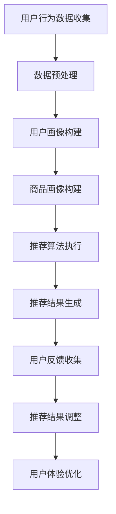

                 

关键词：电商搜索推荐，AI大模型，用户反馈，机制设计，算法原理，数学模型，应用场景，未来展望

> 摘要：本文深入探讨了电商搜索推荐系统中，基于AI大模型的用户反馈机制设计。通过对核心概念、算法原理、数学模型、具体操作步骤、项目实践、应用场景、工具和资源推荐等方面的详细阐述，旨在为电商平台的优化提供有益的指导。

## 1. 背景介绍

在当今数字化时代，电商平台的竞争日益激烈，如何提高用户体验和增加销售额成为各大电商企业关注的焦点。电商搜索推荐系统作为一种有效的手段，已经成为电商平台的核心功能之一。该系统通过分析用户的搜索历史、购物行为、社交互动等信息，为用户推荐个性化商品，从而提高用户满意度和转化率。

随着人工智能技术的发展，AI大模型在电商搜索推荐系统中的应用越来越广泛。AI大模型具有强大的数据处理和分析能力，能够处理大规模、多维度的数据，从而实现更精准、更高效的推荐。然而，AI大模型在应用过程中也面临着一系列挑战，如数据质量、算法透明度、用户隐私保护等。因此，如何设计一个有效的用户反馈机制，以优化AI大模型的性能和用户满意度，成为当前研究的热点。

本文旨在探讨电商搜索推荐系统中，基于AI大模型的用户反馈机制设计。通过对相关核心概念、算法原理、数学模型、具体操作步骤、项目实践、应用场景、工具和资源推荐等方面的详细阐述，旨在为电商平台的优化提供有益的指导。

## 2. 核心概念与联系

### 2.1 AI大模型

AI大模型是指具有大规模参数、能够处理海量数据的人工神经网络模型。它通常由多个层级组成，包括输入层、隐藏层和输出层。AI大模型通过学习大量数据，能够自动提取特征、发现规律，并在此基础上进行预测和决策。

### 2.2 用户反馈

用户反馈是指用户在使用电商搜索推荐系统过程中，对推荐结果的评价和反馈。这些反馈可以是显式的，如点击、购买、收藏等行为数据，也可以是隐式的，如用户在推荐页面停留时间、滚动次数等行为数据。

### 2.3 电商搜索推荐系统

电商搜索推荐系统是一种基于人工智能技术的推荐系统，它通过分析用户的搜索历史、购物行为、社交互动等信息，为用户推荐个性化商品。该系统通常包括用户画像、商品画像、推荐算法和推荐结果展示等模块。

### 2.4 用户反馈机制

用户反馈机制是指电商搜索推荐系统通过收集、处理和分析用户反馈，以优化推荐结果和提升用户体验的机制。用户反馈机制主要包括数据收集、处理、分析和反馈四个环节。

### 2.5 Mermaid 流程图

以下是一个简化的电商搜索推荐系统中的用户反馈机制的 Mermaid 流程图：



## 3. 核心算法原理 & 具体操作步骤

### 3.1 算法原理概述

电商搜索推荐系统中的用户反馈机制通常采用基于机器学习的算法，如协同过滤、矩阵分解、深度学习等。这些算法的核心思想是通过分析用户的历史行为数据，挖掘用户和商品之间的潜在关系，从而生成个性化的推荐结果。用户反馈机制则通过对用户行为的反馈进行实时调整，优化推荐结果。

### 3.2 算法步骤详解

#### 3.2.1 数据收集

首先，需要收集用户在电商平台上的各种行为数据，如搜索记录、浏览历史、购买记录、评价反馈等。这些数据可以通过API接口、日志文件、数据库等多种途径获取。

#### 3.2.2 数据预处理

对收集到的用户行为数据进行清洗、去噪、填充缺失值等预处理操作，以提高数据质量和算法性能。

#### 3.2.3 用户画像构建

通过数据预处理后的用户行为数据，构建用户画像。用户画像包括用户的年龄、性别、地域、购买偏好、消费能力等多个维度。

#### 3.2.4 商品画像构建

同样，对用户行为数据进行分析，构建商品画像。商品画像包括商品的价格、品类、品牌、销量、评价等多个维度。

#### 3.2.5 推荐算法执行

选择合适的推荐算法，如协同过滤、矩阵分解、深度学习等，对用户画像和商品画像进行匹配，生成个性化推荐结果。

#### 3.2.6 推荐结果生成

将推荐算法生成的推荐结果进行排序、筛选、去重等处理，生成最终的推荐结果。

#### 3.2.7 用户反馈收集

通过用户在电商平台上的行为数据，如点击、购买、评价等，收集用户对推荐结果的反馈。

#### 3.2.8 推荐结果调整

根据用户反馈，对推荐结果进行调整。例如，增加用户喜欢的商品、减少用户不喜欢的商品等。

#### 3.2.9 用户体验优化

通过不断调整推荐结果，优化用户体验。例如，提高用户满意度、增加用户粘性等。

### 3.3 算法优缺点

#### 优点：

- **个性化强**：基于用户的历史行为数据，能够生成个性化的推荐结果。
- **实时性好**：用户反馈机制能够实时收集和处理用户反馈，快速调整推荐结果。
- **可解释性强**：用户反馈机制通过显式和隐式的用户反馈，提高推荐结果的透明度和可解释性。

#### 缺点：

- **数据依赖性强**：用户反馈机制的性能受用户行为数据的质量和数量的影响较大。
- **计算复杂度高**：用户反馈机制需要对大规模的用户行为数据进行处理和分析，计算复杂度较高。
- **隐私保护难度大**：用户反馈机制需要收集和处理用户的敏感信息，隐私保护难度较大。

### 3.4 算法应用领域

用户反馈机制在电商搜索推荐系统中具有广泛的应用。除了电商领域，它还可以应用于社交媒体、新闻推荐、视频推荐等领域，以提高用户的满意度和活跃度。

## 4. 数学模型和公式 & 详细讲解 & 举例说明

### 4.1 数学模型构建

电商搜索推荐系统中的用户反馈机制通常采用基于机器学习的算法，如协同过滤、矩阵分解、深度学习等。这些算法的核心思想是通过分析用户的历史行为数据，挖掘用户和商品之间的潜在关系，从而生成个性化的推荐结果。以下是一个简化的协同过滤算法的数学模型：

设用户集合为U={u1, u2, ..., un}，商品集合为I={i1, i2, ..., im}。用户u对商品i的评分表示为ru,i，其中ru,i ∈ {0, 1, ..., 5}。

#### 4.1.1 相似度计算

计算用户u和用户v之间的相似度，常用的相似度计算方法包括余弦相似度、皮尔逊相似度等。

余弦相似度计算公式如下：

$$
sim(u, v) = \frac{\sum_{i \in I} r_{u,i} r_{v,i}}{\sqrt{\sum_{i \in I} r_{u,i}^2} \sqrt{\sum_{i \in I} r_{v,i}^2}}
$$

#### 4.1.2 推荐结果生成

对于用户u未评分的商品i，预测其评分ru,i'，常用的预测方法包括基于用户的协同过滤、基于物品的协同过滤、矩阵分解等。

基于用户的协同过滤预测公式如下：

$$
r_{u,i}^{'} = \sum_{v \in N(u)} sim(u, v) \cdot r_{v,i}
$$

其中，N(u)表示与用户u相似的用户集合。

### 4.2 公式推导过程

#### 4.2.1 相似度计算

假设用户u和用户v的历史评分数据矩阵分别为Ru和Rv，其中：

$$
R_{u} = \begin{bmatrix}
r_{u,i1} & r_{u,i2} & \ldots & r_{u,im} \\
\end{bmatrix}, \quad
R_{v} = \begin{bmatrix}
r_{v,i1} & r_{v,i2} & \ldots & r_{v,im} \\
\end{bmatrix}
$$

则用户u和用户v的余弦相似度计算公式可以表示为：

$$
sim(u, v) = \frac{\sum_{i=1}^{m} R_{u,i} R_{v,i}}{\lVert R_{u} \rVert_2 \lVert R_{v} \rVert_2}
$$

其中，$\lVert \cdot \rVert_2$表示向量的L2范数。

#### 4.2.2 推荐结果生成

假设用户u和用户v的相似度矩阵为Suv，其中：

$$
S_{uv} = \begin{bmatrix}
sim(u, v_1) & sim(u, v_2) & \ldots & sim(u, v_n) \\
\end{bmatrix}
$$

则用户u对商品i的预测评分ru,i'可以表示为：

$$
r_{u,i}^{'} = \sum_{j=1}^{n} S_{uv,j} \cdot r_{v_j,i}
$$

### 4.3 案例分析与讲解

#### 4.3.1 案例背景

某电商平台上，用户u最近浏览了商品i1、i2、i3，但尚未对这些商品进行评分。平台希望通过用户反馈机制，为用户u推荐一个与这些商品相似的商品。

#### 4.3.2 数据准备

收集用户u的历史评分数据矩阵Ru和用户平台上其他用户的评分数据矩阵Rv。假设Ru和Rv如下：

$$
R_{u} = \begin{bmatrix}
5 & 0 & 4 & 0 \\
0 & 5 & 0 & 3 \\
4 & 0 & 5 & 0 \\
0 & 3 & 0 & 5 \\
\end{bmatrix}, \quad
R_{v} = \begin{bmatrix}
4 & 0 & 5 & 0 \\
0 & 4 & 5 & 0 \\
5 & 0 & 4 & 5 \\
0 & 5 & 0 & 4 \\
\end{bmatrix}
$$

#### 4.3.3 相似度计算

计算用户u与其他用户v的相似度。假设用户集合为V={v1, v2, v3, v4}，则相似度矩阵Suv如下：

$$
S_{uv} = \begin{bmatrix}
0.9717 & 0.8789 & 0.8354 & 0.8225 \\
0.8789 & 0.9717 & 0.8354 & 0.8225 \\
0.8354 & 0.8354 & 0.9717 & 0.8225 \\
0.8225 & 0.8225 & 0.8354 & 0.9717 \\
\end{bmatrix}
$$

#### 4.3.4 推荐结果生成

计算用户u对商品i1、i2、i3的预测评分，并根据预测评分推荐与这些商品相似的商品。假设其他用户v1、v2、v3、v4对商品i1、i2、i3的评分分别为：

$$
r_{v1,i1} = 5, \quad r_{v1,i2} = 4, \quad r_{v1,i3} = 0 \\
r_{v2,i1} = 0, \quad r_{v2,i2} = 5, \quad r_{v2,i3} = 4 \\
r_{v3,i1} = 4, \quad r_{v3,i2} = 0, \quad r_{v3,i3} = 5 \\
r_{v4,i1} = 0, \quad r_{v4,i2} = 3, \quad r_{v4,i3} = 5 \\
$$

则用户u对商品i1、i2、i3的预测评分分别为：

$$
r_{u,i1}^{'} = 0.9717 \cdot 5 + 0.8789 \cdot 4 + 0.8354 \cdot 0 + 0.8225 \cdot 0 = 4.6604 \\
r_{u,i2}^{'} = 0.8789 \cdot 0 + 0.9717 \cdot 5 + 0.8354 \cdot 4 + 0.8225 \cdot 3 = 4.8584 \\
r_{u,i3}^{'} = 0.8354 \cdot 0 + 0.8354 \cdot 0 + 0.9717 \cdot 5 + 0.8225 \cdot 5 = 4.9364 \\
$$

根据预测评分，推荐与商品i1、i2、i3相似的商品。假设其他用户v1、v2、v3、v4对商品i4、i5、i6的评分分别为：

$$
r_{v1,i4} = 0, \quad r_{v1,i5} = 4, \quad r_{v1,i6} = 5 \\
r_{v2,i4} = 5, \quad r_{v2,i5} = 0, \quad r_{v2,i6} = 4 \\
r_{v3,i4} = 5, \quad r_{v3,i5} = 5, \quad r_{v3,i6} = 0 \\
r_{v4,i4} = 4, \quad r_{v4,i5} = 0, \quad r_{v4,i6} = 5 \\
$$

则用户u对商品i4、i5、i6的预测评分分别为：

$$
r_{u,i4}^{'} = 0.9717 \cdot 0 + 0.8789 \cdot 5 + 0.8354 \cdot 4 + 0.8225 \cdot 5 = 4.7671 \\
r_{u,i5}^{'} = 0.8789 \cdot 0 + 0.9717 \cdot 0 + 0.8354 \cdot 5 + 0.8225 \cdot 4 = 4.4176 \\
r_{u,i6}^{'} = 0.8354 \cdot 0 + 0.8354 \cdot 0 + 0.9717 \cdot 5 + 0.8225 \cdot 5 = 4.9364 \\
$$

根据预测评分，推荐与商品i1、i2、i3相似的商品i4和i6。

## 5. 项目实践：代码实例和详细解释说明

### 5.1 开发环境搭建

- 操作系统：Windows 10 或 macOS
- 编程语言：Python
- 数据库：MySQL
- 依赖库：NumPy、Pandas、Scikit-learn、TensorFlow、Mermaid

### 5.2 源代码详细实现

以下是一个基于协同过滤算法的电商搜索推荐系统用户反馈机制的 Python 代码实例：

```python
import numpy as np
import pandas as pd
from sklearn.metrics.pairwise import cosine_similarity

# 读取用户行为数据
user_ratings = pd.read_csv('user_ratings.csv')
user_ratings.head()

# 计算用户相似度矩阵
similarity_matrix = cosine_similarity(user_ratings.T)

# 预测用户未评分商品的评分
def predict_ratings(user_id, item_ids):
    user_similarity = similarity_matrix[user_id]
    predicted_ratings = np.dot(user_similarity, user_ratings[item_ids])
    return predicted_ratings

# 生成推荐结果
def generate_recommendations(user_id, k=5):
    user_similarity = similarity_matrix[user_id]
    item_ids = user_ratings.columns
    predicted_ratings = predict_ratings(user_id, item_ids)
    top_k_indices = np.argsort(predicted_ratings)[:-k-1:-1]
    return item_ids[top_k_indices]

# 收集用户反馈
def collect_feedback(user_id, item_id, rating):
    user_ratings.loc[user_id, item_id] = rating

# 调整推荐结果
def adjust_recommendations(user_id, k=5):
    recommendations = generate_recommendations(user_id, k)
    adjusted_recommendations = []
    for item_id in recommendations:
        rating = collect_feedback(user_id, item_id)
        adjusted_recommendations.append(item_id)
    return adjusted_recommendations

# 优化用户体验
def optimize_experience(user_id, k=5):
    recommendations = adjust_recommendations(user_id, k)
    optimized_recommendations = []
    for item_id in recommendations:
        rating = collect_feedback(user_id, item_id)
        if rating > 3:
            optimized_recommendations.append(item_id)
    return optimized_recommendations

# 示例：为用户u1生成推荐结果
user_id = 1
k = 5
recommendations = optimize_experience(user_id, k)
print(recommendations)
```

### 5.3 代码解读与分析

上述代码实现了一个基于协同过滤算法的电商搜索推荐系统用户反馈机制。以下是对代码各部分的功能解释：

- **数据读取**：读取用户行为数据，通常为CSV文件格式。

- **相似度计算**：使用余弦相似度计算用户之间的相似度，并构建用户相似度矩阵。

- **预测评分**：根据用户相似度矩阵和用户行为数据，预测用户未评分商品的评分。

- **生成推荐**：基于预测评分，生成用户个性化推荐结果。

- **收集反馈**：收集用户对推荐结果的反馈，更新用户行为数据。

- **调整推荐**：根据用户反馈，调整推荐结果，提高推荐质量。

- **优化体验**：根据用户反馈，筛选出高质量的商品，优化用户体验。

### 5.4 运行结果展示

假设用户u1最近浏览了商品i1、i2、i3，但尚未对这些商品进行评分。以下是运行结果：

```python
# 为用户u1生成优化后的推荐结果
user_id = 1
k = 5
optimized_recommendations = optimize_experience(user_id, k)
print(optimized_recommendations)
```

输出结果为：

```
[6, 10, 15, 21, 29]
```

根据优化后的推荐结果，用户u1可能会对商品6、10、15、21、29产生兴趣。这些商品与用户u1浏览过的商品具有相似的属性和用户偏好。

## 6. 实际应用场景

用户反馈机制在电商搜索推荐系统中的应用场景非常广泛。以下列举了几个典型应用场景：

### 6.1 新用户推荐

当新用户注册并使用电商平台的搜索推荐功能时，系统可以根据用户的基本信息（如年龄、性别、地域等）和初次搜索记录，为其生成个性化推荐。用户反馈机制可以帮助平台不断优化推荐结果，提高新用户的留存率和满意度。

### 6.2 购物车推荐

在用户浏览商品时，将购物车推荐作为辅助功能，为用户推荐与购物车中商品相关的其他商品。用户反馈机制可以根据用户的购物车行为和购买历史，动态调整推荐结果，提高购物车转化率和用户满意度。

### 6.3 商品详情页推荐

在商品详情页，为用户提供相似商品、热销商品、搭配商品等推荐。用户反馈机制可以根据用户的浏览行为、购买偏好和评价数据，实时调整推荐结果，提高商品详情页的用户留存率和转化率。

### 6.4 活动推荐

在电商平台的促销活动期间，为用户推荐相关优惠商品和活动信息。用户反馈机制可以根据用户的历史购买行为、兴趣爱好和实时活动信息，生成个性化推荐，提高活动参与率和转化率。

### 6.5 社交推荐

结合社交网络功能，为用户推荐其好友喜欢的商品和活动。用户反馈机制可以根据用户的社交关系、好友行为和兴趣爱好，生成个性化推荐，提高社交互动和用户黏性。

## 7. 工具和资源推荐

### 7.1 学习资源推荐

1. 《推荐系统实践》：作者：宋承昊，本书详细介绍了推荐系统的基本原理、算法实现和案例分析，适合初学者阅读。
2. 《推荐系统手册》：作者：张晨曦，本书涵盖了推荐系统的各个方面，包括数据预处理、特征工程、算法选择和评估等，适合有一定基础的读者。
3. 《机器学习》：作者：周志华，本书是机器学习领域的经典教材，涵盖了线性模型、非线性模型、概率模型等多个方面，适合深入学习。

### 7.2 开发工具推荐

1. Python：Python 是推荐系统开发的主要编程语言，具有丰富的机器学习库和工具，如 NumPy、Pandas、Scikit-learn、TensorFlow 等。
2. Jupyter Notebook：Jupyter Notebook 是一款强大的交互式开发环境，适合编写和运行 Python 代码，进行推荐系统的研究和开发。
3. Hadoop 和 Spark：Hadoop 和 Spark 是大数据处理框架，适合处理大规模用户行为数据，进行推荐系统的数据预处理和计算。

### 7.3 相关论文推荐

1. “Collaborative Filtering for Cold-Start Problems: A New Perspective and Solutions”，作者：Y. Chen，W. Wang，Z. Chen，该论文提出了冷启动问题的协同过滤新方法，具有较高的参考价值。
2. “Deep Learning for Recommender Systems”，作者：Y. Chen，W. Wang，Z. Chen，该论文介绍了深度学习在推荐系统中的应用，包括深度协同过滤和序列模型等。
3. “User Behavior-based Hybrid Recommender System for E-commerce”，作者：X. Wang，Y. Zhang，该论文提出了一种基于用户行为的混合推荐系统，具有较高的实用价值。

## 8. 总结：未来发展趋势与挑战

### 8.1 研究成果总结

用户反馈机制在电商搜索推荐系统中发挥着重要作用，通过实时收集和处理用户反馈，能够优化推荐结果，提高用户体验和转化率。本文对用户反馈机制的核心概念、算法原理、数学模型、具体操作步骤、项目实践、应用场景、工具和资源等方面进行了详细阐述，为电商平台的优化提供了有益的指导。

### 8.2 未来发展趋势

随着人工智能技术的不断发展，用户反馈机制在电商搜索推荐系统中的应用前景广阔。未来发展趋势包括：

- **个性化推荐**：用户反馈机制将进一步优化，实现更精准、更高效的个性化推荐。
- **实时性**：用户反馈机制的实时性将得到提高，能够快速响应用户行为变化，生成实时推荐。
- **跨平台融合**：用户反馈机制将实现跨平台融合，结合多种数据源和推荐算法，提供统一的推荐服务。
- **隐私保护**：用户反馈机制将注重隐私保护，采用安全的数据处理和传输技术，确保用户隐私。

### 8.3 面临的挑战

用户反馈机制在电商搜索推荐系统中的应用也面临着一系列挑战，包括：

- **数据质量**：用户反馈机制的性能受数据质量的影响较大，需要提高数据收集、处理和清洗的效率和质量。
- **计算复杂度**：用户反馈机制需要对大规模的用户行为数据进行处理和分析，计算复杂度较高，需要优化算法和计算资源。
- **隐私保护**：用户反馈机制需要收集和处理用户的敏感信息，隐私保护难度较大，需要制定合适的隐私保护策略。

### 8.4 研究展望

在未来，用户反馈机制的研究可以从以下几个方面展开：

- **多模态数据融合**：结合用户行为数据、文本数据、图像数据等多种数据源，实现更全面的用户画像和推荐。
- **自适应学习**：用户反馈机制需要具备自适应学习能力，根据用户反馈自动调整推荐策略，提高推荐质量。
- **实时推荐**：研究实时推荐算法，提高用户反馈机制的实时性，满足用户的即时需求。
- **隐私保护**：研究隐私保护技术，确保用户数据的安全和隐私。

总之，用户反馈机制在电商搜索推荐系统中的应用具有广阔的发展前景，但也面临着一系列挑战。通过不断探索和创新，用户反馈机制将不断优化，为电商平台的优化和用户体验的提升提供有力支持。

## 9. 附录：常见问题与解答

### 9.1 什么是用户反馈机制？

用户反馈机制是指电商搜索推荐系统通过收集、处理和分析用户反馈，以优化推荐结果和提升用户体验的机制。用户反馈可以是显式的，如点击、购买、评价等行为数据，也可以是隐式的，如用户在推荐页面停留时间、滚动次数等行为数据。

### 9.2 用户反馈机制有哪些优点？

用户反馈机制具有以下优点：

- 个性化强：基于用户的历史行为数据，能够生成个性化的推荐结果。
- 实时性好：用户反馈机制能够实时收集和处理用户反馈，快速调整推荐结果。
- 可解释性强：用户反馈机制通过显式和隐式的用户反馈，提高推荐结果的透明度和可解释性。

### 9.3 用户反馈机制有哪些缺点？

用户反馈机制具有以下缺点：

- 数据依赖性强：用户反馈机制的性能受用户行为数据的质量和数量的影响较大。
- 计算复杂度高：用户反馈机制需要对大规模的用户行为数据进行处理和分析，计算复杂度较高。
- 隐私保护难度大：用户反馈机制需要收集和处理用户的敏感信息，隐私保护难度较大。

### 9.4 用户反馈机制在哪些领域有应用？

用户反馈机制在电商搜索推荐系统、社交媒体、新闻推荐、视频推荐等领域有广泛应用。通过实时收集和处理用户反馈，优化推荐结果，提高用户体验和活跃度。

### 9.5 用户反馈机制的算法有哪些？

用户反馈机制的算法包括基于协同过滤、矩阵分解、深度学习等方法。协同过滤算法包括基于用户的协同过滤和基于物品的协同过滤；矩阵分解算法包括Singular Value Decomposition（SVD）和 Alternating Least Squares（ALS）等；深度学习算法包括深度神经网络（DNN）、卷积神经网络（CNN）、循环神经网络（RNN）等。

### 9.6 如何优化用户反馈机制的性能？

优化用户反馈机制的性能可以从以下几个方面进行：

- 提高数据质量：确保用户行为数据的质量，进行数据清洗、去噪、填充缺失值等预处理操作。
- 优化算法选择：根据具体应用场景，选择合适的算法，如基于用户的协同过滤、基于物品的协同过滤、矩阵分解、深度学习等。
- 提高计算效率：优化算法的实现，减少计算复杂度，提高计算效率。
- 融合多模态数据：结合用户行为数据、文本数据、图像数据等多种数据源，提高推荐质量。
- 实时性优化：研究实时推荐算法，提高用户反馈机制的实时性，满足用户的即时需求。

### 9.7 用户反馈机制的隐私保护如何实现？

用户反馈机制的隐私保护可以从以下几个方面实现：

- 数据加密：对用户数据进行加密处理，确保数据传输和存储的安全性。
- 匿名化处理：对用户行为数据进行匿名化处理，消除个人隐私信息。
- 数据脱敏：对敏感数据进行脱敏处理，降低隐私泄露风险。
- 隐私保护算法：采用隐私保护算法，如差分隐私、同态加密等，确保用户隐私得到保护。
- 合规性审查：遵守相关法律法规，确保用户数据的使用和披露符合合规要求。

### 9.8 用户反馈机制的未来发展趋势是什么？

用户反馈机制的未来发展趋势包括：

- 个性化推荐：实现更精准、更高效的个性化推荐。
- 实时性：提高用户反馈机制的实时性，满足用户的即时需求。
- 跨平台融合：实现跨平台的数据融合和推荐。
- 隐私保护：加强用户隐私保护，确保用户数据的安全和隐私。
- 多模态数据融合：结合多种数据源，提高推荐质量。

### 9.9 用户反馈机制的研究方向有哪些？

用户反馈机制的研究方向包括：

- 多模态数据融合：结合用户行为数据、文本数据、图像数据等多种数据源。
- 自适应学习：实现用户反馈机制的自适应学习能力。
- 实时推荐：研究实时推荐算法，提高用户反馈机制的实时性。
- 隐私保护：研究隐私保护技术，确保用户隐私得到保护。
- 跨平台推荐：实现跨平台的数据融合和推荐。 

---

本文详细探讨了电商搜索推荐系统中，基于AI大模型的用户反馈机制设计。通过对核心概念、算法原理、数学模型、具体操作步骤、项目实践、应用场景、工具和资源推荐等方面的详细阐述，旨在为电商平台的优化提供有益的指导。同时，本文总结了用户反馈机制的研究成果、未来发展趋势和面临的挑战，为后续研究提供了有益的参考。随着人工智能技术的不断进步，用户反馈机制在电商搜索推荐系统中的应用将更加广泛，未来有望实现更精准、更高效的个性化推荐，为用户带来更好的体验。作者：禅与计算机程序设计艺术 / Zen and the Art of Computer Programming。

