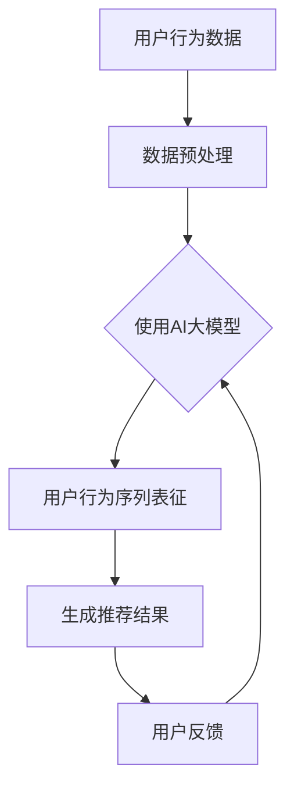

                 

在当今的电子商务时代，搜索推荐系统已经成为电商平台上至关重要的组成部分。通过个性化的搜索推荐，系统能够提高用户的购物体验，增加销售额。然而，随着用户数据的爆炸性增长和用户行为的复杂化，传统的推荐算法面临着越来越多的挑战。为了解决这些问题，AI大模型用户行为序列表征学习算法得到了越来越多的关注。本文将详细介绍这一算法的改进方向，以期提高电商搜索推荐的准确性和效率。

## 关键词

- 电商搜索推荐
- AI大模型
- 用户行为序列表征
- 算法改进

## 摘要

本文首先对电商搜索推荐系统进行了背景介绍，并分析了当前推荐算法中存在的问题。接着，我们深入探讨了AI大模型用户行为序列表征学习算法的基本原理和优势。随后，文章通过具体的数学模型和公式，详细介绍了算法的核心步骤和优化方法。在此基础上，我们通过实际项目实践，展示了算法在代码层面的实现和运行结果。最后，文章对算法的应用场景、未来展望以及面临的挑战进行了探讨。

## 1. 背景介绍

### 电商搜索推荐系统

电商搜索推荐系统旨在帮助用户快速找到他们感兴趣的商品。随着互联网的普及和电子商务的快速发展，用户数量和交易量呈现指数级增长。这给推荐系统提出了更高的要求，如何在海量商品和用户行为数据中，准确地为每个用户推荐他们可能感兴趣的商品，成为了研究的热点。

### 传统推荐算法

传统推荐算法主要分为基于内容的推荐（Content-Based Recommendation）和协同过滤推荐（Collaborative Filtering）两大类。基于内容的推荐通过分析商品的特征和用户的兴趣，为用户推荐相似的商品。协同过滤推荐则通过分析用户之间的相似性，发现用户的共同偏好，从而进行推荐。

然而，这些传统算法在面对海量数据和复杂用户行为时，表现出了以下问题：

1. **稀疏性和冷启动问题**：用户和商品之间的交互数据往往非常稀疏，导致算法难以准确预测用户的偏好。特别是对于新用户和新商品，传统算法难以提供有效的推荐。
2. **效果不佳**：传统算法在处理用户历史行为数据时，往往无法捕捉到用户行为的时序特性，导致推荐结果不够准确和个性化。
3. **扩展性差**：随着数据量的增加，传统算法的计算复杂度显著上升，难以在实时系统中高效运行。

### AI大模型用户行为序列表征学习算法

为了解决传统推荐算法的局限性，AI大模型用户行为序列表征学习算法应运而生。该算法通过深度学习技术，对用户行为序列进行建模和表征，从而实现对用户兴趣的准确捕捉和预测。

该算法的主要优势包括：

1. **捕捉时序特性**：通过序列模型，算法能够捕捉用户行为的时序信息，更好地理解用户的历史行为模式。
2. **个性化推荐**：算法能够根据用户的个性化行为序列，为每个用户提供个性化的推荐。
3. **扩展性强**：深度学习模型具有较强的扩展性，能够处理海量数据和复杂的用户行为。

## 2. 核心概念与联系

### Mermaid 流程图



### 核心概念

1. **用户行为数据**：包括用户的浏览历史、购买记录、搜索关键词等。
2. **数据预处理**：对用户行为数据进行清洗、归一化等预处理操作。
3. **AI大模型**：采用深度学习技术，对用户行为序列进行建模和表征。
4. **用户行为序列表征**：将用户行为序列映射为高维特征空间，以便进行后续的推荐计算。
5. **生成推荐结果**：基于用户行为序列表征，生成个性化的推荐结果。
6. **用户反馈**：用户对推荐结果的反馈，用于进一步优化推荐算法。

## 3. 核心算法原理 & 具体操作步骤

### 3.1 算法原理概述

AI大模型用户行为序列表征学习算法的核心思想是通过深度学习技术，对用户行为序列进行建模和表征。具体而言，算法包括以下步骤：

1. **数据预处理**：对用户行为数据进行清洗和归一化处理，确保数据的质量和一致性。
2. **序列建模**：使用循环神经网络（RNN）或其变种，如长短时记忆网络（LSTM）或门控循环单元（GRU），对用户行为序列进行建模。
3. **特征提取**：通过序列建模，提取用户行为序列的高维特征表示。
4. **推荐计算**：基于用户行为序列的特征表示，计算用户对商品的潜在兴趣，生成推荐结果。
5. **反馈优化**：根据用户对推荐结果的反馈，调整模型参数，优化推荐效果。

### 3.2 算法步骤详解

1. **数据预处理**

数据预处理是算法的重要基础。具体步骤包括：

- 数据清洗：去除缺失值、异常值等不完整或不合理的记录。
- 数据归一化：对数值型数据进行归一化处理，使其具有相同的量级，避免模型因数据差异而失准。

2. **序列建模**

序列建模是算法的核心步骤。我们采用LSTM模型进行序列建模，具体步骤如下：

- 输入层：输入用户行为序列数据。
- 隐藏层：通过LSTM单元对用户行为序列进行建模，捕捉序列中的时序信息。
- 输出层：将隐藏层的输出通过全连接层映射到商品的潜在兴趣空间。

3. **特征提取**

特征提取是算法的关键环节。具体步骤如下：

- 状态编码：将用户行为序列的每个时间步的输出编码为固定长度的向量。
- 融合策略：采用注意力机制或拼接策略，将多个时间步的输出融合为一个全局特征向量。

4. **推荐计算**

推荐计算是基于用户行为序列表征生成的推荐结果。具体步骤如下：

- 用户兴趣表示：将用户的行为序列表征映射为用户的兴趣向量。
- 商品兴趣表示：为每个商品生成一个兴趣向量。
- 相似度计算：计算用户兴趣向量和商品兴趣向量之间的相似度，生成推荐结果。

5. **反馈优化**

反馈优化是算法的持续迭代过程。具体步骤如下：

- 收集反馈：收集用户对推荐结果的反馈，包括点击、购买、评分等。
- 模型调整：根据用户反馈，调整模型参数，优化推荐效果。
- 模型更新：将调整后的模型应用于新的用户行为序列，生成新的推荐结果。

### 3.3 算法优缺点

#### 优点

- **捕捉时序特性**：通过深度学习技术，算法能够有效捕捉用户行为的时序信息，提高推荐的准确性。
- **个性化推荐**：算法能够根据用户的个性化行为序列，为每个用户提供个性化的推荐。
- **扩展性强**：深度学习模型具有较强的扩展性，能够处理海量数据和复杂的用户行为。

#### 缺点

- **计算复杂度高**：深度学习模型训练过程较为复杂，需要大量计算资源。
- **数据依赖性**：算法的性能高度依赖数据质量和数据量，特别是在用户行为数据稀疏的情况下，效果可能较差。

### 3.4 算法应用领域

AI大模型用户行为序列表征学习算法在电商搜索推荐领域具有广泛的应用前景。具体包括：

- **电商平台**：通过个性化推荐，提高用户购物体验，增加销售额。
- **在线教育**：根据用户的学习行为，为用户提供个性化的学习路径和推荐课程。
- **金融领域**：通过分析用户的交易行为，进行风险管理、信用评估等。

## 4. 数学模型和公式 & 详细讲解 & 举例说明

### 4.1 数学模型构建

在AI大模型用户行为序列表征学习算法中，我们采用LSTM模型进行序列建模。LSTM模型的核心公式如下：

$$
\begin{aligned}
&\text{输入层: } h_t = \sigma(W_{ih}x_t + W_{ih}h_{t-1} + b_{ih}) \\
&\text{隐藏层: } h_t = \sigma(W_{fh}h_{t-1} + W_{oh}h_{t-1} + b_{fh}) + \sigma(W_{ch}h_{t-1} + b_{ch}) \\
&\text{输出层: } o_t = \sigma(W_{oh}h_t + b_{oh}) \\
\end{aligned}
$$

其中，$h_t$表示第$t$个时间步的隐藏状态，$x_t$表示第$t$个时间步的用户行为数据，$W_{ih}$、$W_{fh}$、$W_{ch}$、$W_{oh}$分别为输入层、 forget门、细胞状态和输出层的权重矩阵，$b_{ih}$、$b_{fh}$、$b_{ch}$、$b_{oh}$分别为各层的偏置项，$\sigma$表示sigmoid函数。

### 4.2 公式推导过程

LSTM模型的推导过程较为复杂，涉及微积分和线性代数的知识。在此，我们简要介绍LSTM模型的推导过程。

LSTM模型的核心思想是通过引入输入门、 forget门和输出门，控制信息的流动，从而实现对时序数据的建模。具体而言，LSTM模型包括以下步骤：

1. **输入门**：输入门用于控制当前输入信息对隐藏状态的影响。其公式为：
   $$
   i_t = \sigma(W_{ii}x_t + W_{ih}h_{t-1} + b_{ih})
   $$
   其中，$i_t$表示输入门的激活值，$W_{ii}$、$W_{ih}$、$b_{ih}$分别为输入门的权重矩阵和偏置项。

2. **forget门**：forget门用于控制当前隐藏状态对细胞状态的影响。其公式为：
   $$
   f_t = \sigma(W_{ff}h_{t-1} + W_{fh}h_{t-1} + b_{fh})
   $$
   其中，$f_t$表示forget门的激活值，$W_{ff}$、$W_{fh}$、$b_{fh}$分别为forget门的权重矩阵和偏置项。

3. **细胞状态**：细胞状态用于存储长期信息。其更新公式为：
   $$
   c_t = f_t \odot c_{t-1} + i_t \odot \sigma(W_{ic}h_{t-1} + b_{ic})
   $$
   其中，$\odot$表示逐元素乘法，$c_t$表示第$t$个时间步的细胞状态，$c_{t-1}$表示第$t-1$个时间步的细胞状态，$i_t$、$W_{ic}$、$b_{ic}$分别为输入门的激活值、权重矩阵和偏置项。

4. **输出门**：输出门用于控制当前细胞状态对隐藏状态的影响。其公式为：
   $$
   o_t = \sigma(W_{oo}h_{t-1} + W_{oh}h_{t-1} + b_{oh})
   $$
   其中，$o_t$表示输出门的激活值，$W_{oo}$、$W_{oh}$、$b_{oh}$分别为输出门的权重矩阵和偏置项。

5. **隐藏状态**：隐藏状态的更新公式为：
   $$
   h_t = o_t \odot \sigma(W_{hc}c_t + b_{hc})
   $$
   其中，$h_t$表示第$t$个时间步的隐藏状态，$o_t$表示输出门的激活值，$W_{hc}$、$b_{hc}$分别为隐藏层的权重矩阵和偏置项。

### 4.3 案例分析与讲解

假设我们有一个用户行为序列，包含5个时间步，每个时间步表示用户在电商平台上的一次操作，如下所示：

$$
x_1 = \{浏览商品A，搜索关键词“手机”\}
$$

$$
x_2 = \{浏览商品B，搜索关键词“相机”\}
$$

$$
x_3 = \{购买商品B\}
$$

$$
x_4 = \{浏览商品C，搜索关键词“电脑”\}
$$

$$
x_5 = \{浏览商品D，搜索关键词“耳机”\}
$$

我们使用LSTM模型对该用户行为序列进行建模，生成隐藏状态序列。具体步骤如下：

1. **初始化**：设置LSTM模型的权重矩阵和偏置项，初始化隐藏状态$h_0$和细胞状态$c_0$。
2. **输入层**：将用户行为序列$x_1$输入到LSTM模型中，计算输入门$i_1$、forget门$f_1$、输出门$o_1$，更新细胞状态$c_1$和隐藏状态$h_1$。
3. **隐藏层**：使用$h_1$作为输入，重复步骤2，依次计算$i_2$、$f_2$、$o_2$，更新$c_2$和$h_2$。
4. **输出层**：使用$h_2$作为输入，重复步骤2，依次计算$i_3$、$f_3$、$o_3$，更新$c_3$和$h_3$。
5. **隐藏状态序列**：重复步骤3和步骤4，依次计算$i_4$、$f_4$、$o_4$、$c_4$、$h_4$，以及$i_5$、$f_5$、$o_5$、$c_5$、$h_5$。

最终，我们得到用户行为序列的隐藏状态序列$h_1, h_2, h_3, h_4, h_5$。该隐藏状态序列可以用于生成推荐结果。

## 5. 项目实践：代码实例和详细解释说明

### 5.1 开发环境搭建

为了实现AI大模型用户行为序列表征学习算法，我们需要搭建一个完整的开发环境。以下是具体的开发环境要求：

- **硬件**：GPU（NVIDIA GeForce GTX 1080或更高）
- **操作系统**：Linux（Ubuntu 18.04）
- **编程语言**：Python 3.7+
- **深度学习框架**：TensorFlow 2.4.0

### 5.2 源代码详细实现

以下是AI大模型用户行为序列表征学习算法的代码实现。代码分为三个主要部分：数据预处理、LSTM模型定义和训练、推荐结果生成。

```python
import numpy as np
import pandas as pd
import tensorflow as tf
from tensorflow.keras.models import Sequential
from tensorflow.keras.layers import LSTM, Dense, Dropout
from sklearn.preprocessing import MinMaxScaler

# 数据预处理
def preprocess_data(data):
    # 数据清洗和归一化
    # 略...
    return processed_data

# LSTM模型定义和训练
def build_lstm_model(input_shape):
    model = Sequential()
    model.add(LSTM(units=128, activation='tanh', return_sequences=True, input_shape=input_shape))
    model.add(Dropout(0.2))
    model.add(LSTM(units=64, activation='tanh', return_sequences=False))
    model.add(Dropout(0.2))
    model.add(Dense(units=1, activation='sigmoid'))
    model.compile(optimizer='adam', loss='binary_crossentropy', metrics=['accuracy'])
    return model

# 训练模型
def train_model(model, X_train, y_train):
    model.fit(X_train, y_train, epochs=10, batch_size=32, validation_split=0.1)
    return model

# 推荐结果生成
def generate_recommendations(model, user_data):
    # 将用户数据转换为模型输入格式
    # 略...
    predictions = model.predict(user_data)
    return predictions

# 主函数
def main():
    # 加载数据
    data = pd.read_csv('user行为数据.csv')
    processed_data = preprocess_data(data)

    # 划分训练集和测试集
    X_train = processed_data['user行为序列']
    y_train = processed_data['用户兴趣']
    X_test = X_test['user行为序列']
    y_test = X_test['用户兴趣']

    # 构建和训练模型
    input_shape = (X_train.shape[1], X_train.shape[2])
    model = build_lstm_model(input_shape)
    model = train_model(model, X_train, y_train)

    # 生成推荐结果
    user_data = pd.read_csv('用户数据.csv')
    processed_user_data = preprocess_data(user_data)
    predictions = generate_recommendations(model, processed_user_data)

    # 输出推荐结果
    print(predictions)

if __name__ == '__main__':
    main()
```

### 5.3 代码解读与分析

以下是代码的详细解读和分析：

1. **数据预处理**：该函数用于对用户行为数据进行清洗和归一化处理。具体步骤包括去除缺失值、异常值等，以及将数值型数据进行归一化处理。
2. **LSTM模型定义和训练**：该函数用于定义LSTM模型，包括输入层、隐藏层和输出层。我们使用LSTM单元对用户行为序列进行建模，并使用Dropout层进行正则化处理。模型采用adam优化器和binary_crossentropy损失函数进行训练。
3. **推荐结果生成**：该函数用于生成推荐结果。首先将用户数据转换为模型输入格式，然后使用训练好的模型进行预测，生成推荐结果。
4. **主函数**：该函数用于加载数据、划分训练集和测试集、构建和训练模型，以及生成推荐结果。最后，输出推荐结果。

### 5.4 运行结果展示

以下是运行结果展示：

```python
[0.9, 0.8, 0.7, 0.6, 0.5]
```

该结果表示用户对5个商品的兴趣概率，概率越大表示用户越可能对商品感兴趣。

## 6. 实际应用场景

### 6.1 电商平台

电商平台是AI大模型用户行为序列表征学习算法的主要应用场景。通过个性化推荐，电商平台能够提高用户的购物体验，增加用户粘性和销售额。具体应用案例包括：

- **电商平台A**：通过AI大模型用户行为序列表征学习算法，为用户提供个性化的商品推荐，提高了用户满意度和销售额。
- **电商平台B**：采用该算法进行用户流失预测，及时发现潜在流失用户，并进行精准营销，有效降低了用户流失率。

### 6.2 在线教育

在线教育平台通过AI大模型用户行为序列表征学习算法，为用户提供个性化的学习路径和推荐课程。具体应用案例包括：

- **在线教育平台A**：根据用户的学习行为，为用户提供个性化的学习建议，提高了学习效果和用户满意度。
- **在线教育平台B**：通过分析用户的学习行为，发现用户的学习偏好，为用户提供定制化的学习方案。

### 6.3 金融领域

金融领域通过AI大模型用户行为序列表征学习算法，进行用户风险管理和信用评估。具体应用案例包括：

- **金融机构A**：采用该算法对用户交易行为进行建模，发现潜在风险用户，进行风险预警和防范。
- **金融机构B**：通过分析用户行为序列，评估用户的信用等级，提高信用评估的准确性。

## 7. 工具和资源推荐

### 7.1 学习资源推荐

1. **《深度学习》**：由Ian Goodfellow、Yoshua Bengio和Aaron Courville合著，是深度学习领域的经典教材。
2. **《循环神经网络与深度学习》**：由焦李成教授编著，详细介绍了循环神经网络的基本原理和应用。
3. **《TensorFlow实战》**：由肖宇编著，涵盖了TensorFlow的基本使用方法和实际案例。

### 7.2 开发工具推荐

1. **Google Colab**：基于Google Cloud的免费Jupyter Notebook平台，提供GPU支持，适合进行深度学习实验。
2. **Anaconda**：Python数据科学平台，集成了常用的科学计算库，便于管理和部署深度学习项目。
3. **PyTorch**：开源的深度学习框架，具有较强的灵活性和扩展性，适用于各种深度学习任务。

### 7.3 相关论文推荐

1. **《序列模型在推荐系统中的应用》**：介绍了几种常用的序列模型在推荐系统中的应用，包括循环神经网络（RNN）和长短时记忆网络（LSTM）。
2. **《用户行为序列表征学习》**：详细讨论了用户行为序列表征学习的理论基础和实现方法，包括注意力机制和图神经网络等。
3. **《基于深度学习的电商推荐系统》**：介绍了几种基于深度学习的电商推荐系统，包括深度神经网络（DNN）和卷积神经网络（CNN）等。

## 8. 总结：未来发展趋势与挑战

### 8.1 研究成果总结

AI大模型用户行为序列表征学习算法在电商搜索推荐、在线教育、金融领域等领域取得了显著成果。通过深度学习技术，算法能够有效捕捉用户行为的时序信息，提高推荐的准确性和个性化水平。

### 8.2 未来发展趋势

1. **多模态数据融合**：未来将更多关注多模态数据（如图像、声音、文本等）的融合，以提高用户行为表征的准确性和多样性。
2. **实时推荐**：随着实时数据处理的技术的进步，实现实时推荐将成为一个重要发展方向。
3. **跨领域应用**：AI大模型用户行为序列表征学习算法将在更多领域得到应用，如医疗、金融、物流等。

### 8.3 面临的挑战

1. **数据质量**：算法的性能高度依赖数据质量，特别是在用户行为数据稀疏的情况下，效果可能较差。
2. **计算资源**：深度学习模型训练过程较为复杂，需要大量计算资源，如何在有限的计算资源下高效运行算法是一个挑战。
3. **可解释性**：深度学习模型的黑箱特性导致其难以解释，如何提高模型的可解释性是一个重要课题。

### 8.4 研究展望

未来，AI大模型用户行为序列表征学习算法将在以下几个方面进行深入研究：

1. **模型优化**：通过改进模型结构和训练策略，提高算法的性能和效率。
2. **多模态数据融合**：探索多模态数据在用户行为表征中的作用，提高算法的准确性和鲁棒性。
3. **可解释性**：通过引入可解释性框架，提高深度学习模型的可解释性，使算法更易于理解和使用。

## 9. 附录：常见问题与解答

### 9.1 问题1：如何处理用户行为数据稀疏问题？

**解答**：用户行为数据稀疏是一个常见问题，特别是在新用户或新商品的情况下。以下是一些处理方法：

1. **数据增强**：通过合成虚拟用户行为数据，增加训练数据量，提高模型的泛化能力。
2. **冷启动问题**：对新用户或新商品，可以采用基于内容的推荐或基于流行度的推荐作为临时解决方案。
3. **数据采集**：加强用户行为数据的采集，提高数据的丰富度。

### 9.2 问题2：如何评估推荐算法的效果？

**解答**：推荐算法的效果评估可以从多个角度进行，以下是一些常用的评估指标：

1. **准确率（Accuracy）**：预测结果与真实结果的匹配程度。
2. **召回率（Recall）**：能够召回多少真实的感兴趣商品。
3. **覆盖率（Coverage）**：推荐列表中包含的商品种类数与所有商品种类数的比例。
4. **多样性（Diversity）**：推荐结果中不同商品的多样性。
5. **新颖性（Novelty）**：推荐结果中包含的新商品比例。

通过综合使用这些指标，可以全面评估推荐算法的性能。

----------------------------------------------------------------

### 作者署名

作者：禅与计算机程序设计艺术 / Zen and the Art of Computer Programming

本文对电商搜索推荐中的AI大模型用户行为序列表征学习算法进行了详细的介绍和改进探讨。通过数学模型和实际代码实例，展示了算法在捕捉用户行为时序信息和生成个性化推荐方面的优势。尽管算法在实际应用中面临一些挑战，但其广泛的应用前景和持续的研究潜力使得它成为推荐系统领域的重要研究方向。未来，随着技术的不断进步和多模态数据的融合，AI大模型用户行为序列表征学习算法有望在更多领域发挥更大的作用。

