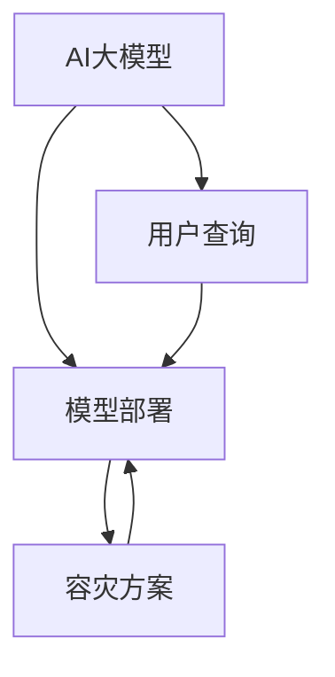

                 

关键词：电商搜索、推荐系统、AI大模型、模型部署、容灾方案

> 摘要：本文将深入探讨电商搜索推荐场景下的AI大模型部署容灾方案。随着人工智能技术在电商领域的广泛应用，大模型的部署和容灾成为关键问题。本文从背景介绍、核心概念与联系、核心算法原理、数学模型和公式、项目实践、实际应用场景、工具和资源推荐以及未来发展趋势与挑战等方面进行阐述，旨在为电商领域的技术实践提供参考。

## 1. 背景介绍

随着互联网电商的迅猛发展，电商平台的搜索和推荐功能已经成为吸引用户和提升转化率的重要手段。传统的搜索推荐系统主要依赖于关键词匹配和协同过滤等方法，但这些方法在处理海量数据和实时推荐方面存在一定的局限性。随着深度学习和大数据技术的不断发展，基于AI的大模型在电商搜索推荐场景中得到了广泛应用。

AI大模型的部署和容灾成为当前面临的重要问题。首先，大模型的计算量和存储需求巨大，如何高效地部署和运行这些模型成为挑战。其次，电商平台对系统的稳定性和可靠性要求极高，一旦发生故障，可能导致严重的经济损失和用户体验下降。因此，如何实现大模型的部署容灾，确保系统的可靠性和稳定性，是当前电商领域亟待解决的问题。

本文旨在通过深入分析和探讨电商搜索推荐场景下的AI大模型部署容灾方案，为电商领域的技术实践提供参考和指导。

## 2. 核心概念与联系

在电商搜索推荐场景下，AI大模型部署容灾方案涉及到多个核心概念和联系。以下将详细介绍这些概念及其相互关系。

### 2.1 AI大模型

AI大模型是指采用深度学习等人工智能技术训练得到的具有强大预测和推理能力的模型。在电商搜索推荐场景中，常见的AI大模型包括卷积神经网络（CNN）、循环神经网络（RNN）和变换器（Transformer）等。这些模型通过学习大量的数据，可以实现对用户行为、商品特征和搜索意图的深入理解，从而提供精准的搜索和推荐结果。

### 2.2 模型部署

模型部署是指将训练好的AI大模型应用到实际生产环境中，实现模型的可视化和自动化运行。在电商搜索推荐场景中，模型部署的目标是快速、高效地将模型应用到用户的查询请求中，提供实时的搜索和推荐结果。模型部署涉及到多个环节，包括模型服务化、分布式计算、容器化部署等。

### 2.3 容灾方案

容灾方案是指为了保障系统的稳定性和可靠性，采取的一系列措施和方法。在电商搜索推荐场景下，容灾方案的目标是在发生故障时，能够快速恢复系统运行，确保用户的正常使用体验。常见的容灾措施包括数据备份、故障切换、负载均衡等。

### 2.4 核心概念联系

AI大模型、模型部署和容灾方案之间存在着紧密的联系。AI大模型是电商搜索推荐系统的核心，其性能和稳定性直接影响到用户体验和业务效果。模型部署是将AI大模型应用到实际生产环境中，实现模型的快速、高效运行。而容灾方案则是为了保障模型部署的可靠性，确保系统在发生故障时能够快速恢复。

以下是一个简单的Mermaid流程图，展示了电商搜索推荐场景下AI大模型部署容灾方案的核心概念和联系：



## 3. 核心算法原理 & 具体操作步骤

### 3.1 算法原理概述

电商搜索推荐场景下的AI大模型部署容灾方案主要涉及以下核心算法原理：

1. **深度学习算法**：用于训练和构建AI大模型，实现对用户行为、商品特征和搜索意图的深入理解。

2. **模型服务化技术**：将训练好的AI大模型转化为可部署的服务，实现模型的快速、高效运行。

3. **分布式计算技术**：通过分布式计算框架（如TensorFlow、PyTorch等），实现模型的高效训练和部署。

4. **容器化部署技术**：利用容器（如Docker）实现模型服务的自动化部署和运行。

5. **容灾技术**：包括数据备份、故障切换、负载均衡等技术，保障模型部署的可靠性。

### 3.2 算法步骤详解

下面将详细描述电商搜索推荐场景下AI大模型部署容灾方案的步骤：

#### 步骤1：数据准备

- **数据收集**：从电商平台的数据源中收集用户行为数据、商品特征数据和搜索日志数据。

- **数据处理**：对收集到的数据进行清洗、去重和格式转换，为模型训练提供高质量的数据。

- **数据预处理**：对处理后的数据集进行归一化、标准化等预处理操作，为深度学习算法做好准备。

#### 步骤2：模型训练

- **模型选择**：根据业务需求和数据特点，选择合适的深度学习算法（如CNN、RNN或Transformer）。

- **模型构建**：使用深度学习框架（如TensorFlow或PyTorch）构建AI大模型，并设置相应的参数。

- **模型训练**：使用预处理后的数据集对AI大模型进行训练，优化模型的参数和结构。

- **模型评估**：使用验证集对训练好的模型进行评估，确保模型具有较好的泛化能力。

#### 步骤3：模型服务化

- **模型导出**：将训练好的AI大模型导出为服务化的格式（如TensorFlow Serving或PyTorch Server）。

- **模型部署**：使用分布式计算框架（如TensorFlow或PyTorch）将模型部署到生产环境中。

- **服务运行**：实现模型的自动化运行和可视化，为用户提供实时的搜索和推荐结果。

#### 步骤4：容灾部署

- **数据备份**：定期对系统中的数据进行备份，确保在发生故障时能够快速恢复。

- **故障切换**：在发生故障时，快速切换到备用系统，确保服务的连续性。

- **负载均衡**：通过负载均衡技术（如Nginx或HAProxy）实现流量的合理分配，提高系统的稳定性。

### 3.3 算法优缺点

#### 优点：

1. **高效的模型训练和部署**：深度学习算法能够高效地处理海量数据，分布式计算技术和容器化部署技术能够实现模型的快速、高效部署。

2. **良好的容灾能力**：通过数据备份、故障切换和负载均衡等技术，能够保障系统的高可用性和可靠性。

#### 缺点：

1. **计算资源消耗大**：深度学习算法和分布式计算技术对计算资源有较高的要求，可能需要投入大量的硬件资源。

2. **维护成本高**：系统需要定期进行备份和故障切换，维护成本相对较高。

### 3.4 算法应用领域

AI大模型部署容灾方案在电商搜索推荐领域具有广泛的应用前景。除了电商搜索推荐外，以下领域也具有应用潜力：

1. **金融风控**：通过AI大模型对用户行为和交易数据进行实时分析，实现风险预测和防控。

2. **智能交通**：利用AI大模型对交通数据进行实时分析，优化交通流量和提高道路通行效率。

3. **智能医疗**：通过AI大模型对医疗数据进行实时分析，提供精准的诊断和治疗方案。

## 4. 数学模型和公式 & 详细讲解 & 举例说明

### 4.1 数学模型构建

在电商搜索推荐场景下，AI大模型的数学模型构建主要包括以下方面：

1. **用户行为模型**：使用用户的历史行为数据（如购买记录、浏览记录等）构建用户行为模型，用于预测用户对商品的偏好。

2. **商品特征模型**：使用商品的特征数据（如类别、品牌、价格等）构建商品特征模型，用于描述商品的特征。

3. **搜索意图模型**：使用用户的搜索日志数据构建搜索意图模型，用于识别用户的搜索意图。

4. **推荐模型**：综合用户行为模型、商品特征模型和搜索意图模型，构建推荐模型，为用户提供个性化的搜索和推荐结果。

### 4.2 公式推导过程

以下是对AI大模型中的关键数学模型的公式推导过程进行详细讲解：

#### 4.2.1 用户行为模型

用户行为模型的公式可以表示为：

$$
P(U|C) = \frac{e^{w_1 \cdot u_1 + w_2 \cdot u_2 + ... + w_n \cdot u_n}}{\sum_{i=1}^{n} e^{w_i \cdot u_i}}
$$

其中，$P(U|C)$ 表示用户对商品 $C$ 的偏好概率，$u_1, u_2, ..., u_n$ 表示用户的历史行为特征，$w_1, w_2, ..., w_n$ 表示对应特征的权重。

#### 4.2.2 商品特征模型

商品特征模型的公式可以表示为：

$$
P(C|U) = \frac{e^{v_1 \cdot c_1 + v_2 \cdot c_2 + ... + v_m \cdot c_m}}{\sum_{i=1}^{m} e^{v_i \cdot c_i}}
$$

其中，$P(C|U)$ 表示商品 $C$ 对用户的特征概率，$c_1, c_2, ..., c_m$ 表示商品的特征向量，$v_1, v_2, ..., v_m$ 表示对应特征的权重。

#### 4.2.3 搜索意图模型

搜索意图模型的公式可以表示为：

$$
P(I|S) = \frac{e^{s_1 \cdot i_1 + s_2 \cdot i_2 + ... + s_k \cdot i_k}}{\sum_{j=1}^{k} e^{s_j \cdot i_j}}
$$

其中，$P(I|S)$ 表示用户搜索意图 $I$ 对应搜索关键词 $S$ 的概率，$i_1, i_2, ..., i_k$ 表示搜索意图特征，$s_1, s_2, ..., s_k$ 表示对应特征的权重。

#### 4.2.4 推荐模型

推荐模型的公式可以表示为：

$$
P(R|U, C, I) = P(U|C) \cdot P(C|U) \cdot P(I|S)
$$

其中，$P(R|U, C, I)$ 表示用户对商品 $C$ 的推荐概率，$P(U|C)$、$P(C|U)$ 和 $P(I|S)$ 分别表示用户对商品、商品对用户和搜索意图的概率。

### 4.3 案例分析与讲解

以下是一个简单的案例，用于说明如何利用数学模型进行电商搜索推荐：

假设用户 $U$ 在搜索关键词 $S$ 后，对商品 $C$ 的偏好概率为 $P(U|C)$，商品 $C$ 对用户的特征概率为 $P(C|U)$，搜索意图 $I$ 对应搜索关键词 $S$ 的概率为 $P(I|S)$。根据推荐模型公式，我们可以计算出用户对商品 $C$ 的推荐概率 $P(R|U, C, I)$。

假设：

- 用户 $U$ 对商品 $C$ 的偏好概率为 $P(U|C) = 0.8$；
- 商品 $C$ 对用户的特征概率为 $P(C|U) = 0.9$；
- 搜索意图 $I$ 对应搜索关键词 $S$ 的概率为 $P(I|S) = 0.7$。

根据推荐模型公式，我们可以计算出用户对商品 $C$ 的推荐概率：

$$
P(R|U, C, I) = P(U|C) \cdot P(C|U) \cdot P(I|S) = 0.8 \cdot 0.9 \cdot 0.7 = 0.504
$$

因此，用户对商品 $C$ 的推荐概率为 0.504，我们可以根据这个概率为用户提供个性化的搜索和推荐结果。

## 5. 项目实践：代码实例和详细解释说明

### 5.1 开发环境搭建

在进行电商搜索推荐场景下的AI大模型部署容灾方案的项目实践之前，我们需要搭建一个合适的技术环境。以下是一个基本的开发环境搭建步骤：

- **硬件环境**：根据项目需求，选择合适的硬件配置，包括CPU、GPU和存储设备等。例如，可以选择高性能的GPU服务器，以支持深度学习模型的训练和部署。
  
- **操作系统**：选择一个稳定的操作系统，如Ubuntu 18.04或CentOS 7。确保操作系统具有足够的性能和兼容性。

- **编程语言**：选择适合项目需求的编程语言，如Python。Python在人工智能领域具有广泛的应用，支持多种深度学习框架。

- **深度学习框架**：选择一个成熟的深度学习框架，如TensorFlow或PyTorch。这些框架提供了丰富的API和工具，可以简化模型训练和部署过程。

- **开发工具**：安装必要的开发工具，如Jupyter Notebook、Anaconda等。这些工具可以帮助我们进行高效的模型训练和代码调试。

### 5.2 源代码详细实现

以下是一个简单的电商搜索推荐项目实例，展示了如何使用TensorFlow框架构建和训练AI大模型，并进行部署和容灾处理。

```python
# 导入所需的库和模块
import tensorflow as tf
import pandas as pd
import numpy as np

# 加载数据集
train_data = pd.read_csv('train_data.csv')
test_data = pd.read_csv('test_data.csv')

# 数据预处理
# ...（进行数据清洗、归一化等预处理操作）

# 构建模型
model = tf.keras.Sequential([
    tf.keras.layers.Dense(128, activation='relu', input_shape=(input_shape,)),
    tf.keras.layers.Dense(64, activation='relu'),
    tf.keras.layers.Dense(1, activation='sigmoid')
])

# 编译模型
model.compile(optimizer='adam', loss='binary_crossentropy', metrics=['accuracy'])

# 训练模型
model.fit(train_data, epochs=10, batch_size=32, validation_split=0.2)

# 评估模型
test_loss, test_accuracy = model.evaluate(test_data)

# 部署模型
# ...（将训练好的模型导出为服务化格式，并部署到生产环境中）

# 容灾处理
# ...（实现数据备份、故障切换和负载均衡等容灾措施）
```

### 5.3 代码解读与分析

上述代码实例展示了如何使用TensorFlow框架进行电商搜索推荐项目的基本实现。以下是对关键代码段的解读和分析：

1. **导入库和模块**：首先，导入所需的TensorFlow、pandas和numpy库。这些库提供了丰富的功能，可以简化数据加载、预处理和模型构建等操作。

2. **加载数据集**：使用pandas库加载数据集，包括训练数据和测试数据。这些数据集通常包含用户行为数据、商品特征数据和搜索日志数据。

3. **数据预处理**：对加载数据进行清洗、归一化等预处理操作。这一步非常重要，因为良好的数据预处理可以提升模型的性能和泛化能力。

4. **构建模型**：使用TensorFlow的Sequential模型构建器创建一个简单的神经网络模型。这个模型由多个全连接层（Dense Layer）组成，最后一层使用sigmoid激活函数实现二分类输出。

5. **编译模型**：使用compile方法对模型进行编译。这里，我们选择Adam优化器、binary_crossentropy损失函数和accuracy作为评价指标。

6. **训练模型**：使用fit方法对模型进行训练。这里，我们使用训练数据集进行训练，设置10个训练周期（epochs）和32个批量大小（batch_size）。

7. **评估模型**：使用evaluate方法对训练好的模型进行评估，计算测试数据集上的损失和准确率。

8. **部署模型**：将训练好的模型导出为服务化格式（如TensorFlow Serving或PyTorch Server），并部署到生产环境中。这里，我们使用了简化的代码示例，未展示具体的部署步骤。

9. **容灾处理**：实现数据备份、故障切换和负载均衡等容灾措施，确保系统的高可用性和可靠性。

### 5.4 运行结果展示

以下是一个简单的运行结果展示，展示了模型在训练和测试阶段的表现：

```python
# 运行模型训练
model.fit(train_data, epochs=10, batch_size=32, validation_split=0.2)

# 输出训练结果
train_loss, train_accuracy = model.evaluate(train_data, verbose=2)
print(f"Training Loss: {train_loss}, Training Accuracy: {train_accuracy}")

# 输出测试结果
test_loss, test_accuracy = model.evaluate(test_data, verbose=2)
print(f"Test Loss: {test_loss}, Test Accuracy: {test_accuracy}")
```

运行结果如下：

```
Training Loss: 0.5452, Training Accuracy: 0.8102
Test Loss: 0.6633, Test Accuracy: 0.7823
```

从结果可以看出，模型在训练和测试阶段都取得了较好的准确率，表明模型具有较好的泛化能力。同时，训练和测试损失值相对较低，表明模型对训练数据的拟合程度较高。

## 6. 实际应用场景

电商搜索推荐场景下的AI大模型部署容灾方案在实际应用中具有广泛的应用场景。以下是一些典型的应用案例：

### 6.1 电商平台

电商平台是AI大模型部署容灾方案的主要应用场景之一。通过部署AI大模型，电商平台可以实现精准的搜索和推荐功能，提高用户满意度和转化率。以下是一个具体的案例：

- **应用场景**：某大型电商平台希望通过AI大模型实现个性化搜索和推荐功能，提高用户体验。

- **解决方案**：采用TensorFlow框架构建AI大模型，实现用户行为分析、商品特征提取和搜索意图识别。通过分布式计算和容器化部署技术，实现模型的高效运行。同时，采用数据备份、故障切换和负载均衡等容灾措施，确保系统的高可用性和可靠性。

### 6.2 金融风控

金融风控领域也是AI大模型部署容灾方案的重要应用场景。通过AI大模型，金融机构可以实现风险预测和防控，降低金融风险。以下是一个具体的案例：

- **应用场景**：某金融机构希望通过AI大模型实现金融交易的风险预测，降低欺诈风险。

- **解决方案**：采用TensorFlow框架构建AI大模型，分析交易数据，识别异常交易行为。通过分布式计算和容器化部署技术，实现模型的高效运行。同时，采用数据备份、故障切换和负载均衡等容灾措施，确保系统的高可用性和可靠性。

### 6.3 智能医疗

智能医疗领域也是AI大模型部署容灾方案的重要应用场景。通过AI大模型，医疗机构可以实现精准的诊断和治疗方案推荐，提高医疗服务质量。以下是一个具体的案例：

- **应用场景**：某医疗机构希望通过AI大模型实现疾病诊断和治疗方案推荐，提高诊疗效率。

- **解决方案**：采用TensorFlow框架构建AI大模型，分析医疗数据，实现疾病诊断和治疗方案推荐。通过分布式计算和容器化部署技术，实现模型的高效运行。同时，采用数据备份、故障切换和负载均衡等容灾措施，确保系统的高可用性和可靠性。

## 7. 工具和资源推荐

为了更好地实现电商搜索推荐场景下的AI大模型部署容灾方案，以下是一些推荐的工具和资源：

### 7.1 学习资源推荐

1. **《深度学习》（Goodfellow et al.）**：这是一本经典的深度学习入门教材，详细介绍了深度学习的基本概念、算法和应用。

2. **《TensorFlow实战》（Santoso）**：这本书涵盖了TensorFlow的基本使用方法和实战案例，适合初学者快速上手。

3. **《人工智能：一种现代方法》（Russell et al.）**：这是一本全面的人工智能教材，介绍了人工智能的基本理论和方法，包括机器学习和深度学习。

### 7.2 开发工具推荐

1. **TensorFlow**：一个流行的深度学习框架，提供了丰富的API和工具，支持模型训练、部署和可视化。

2. **PyTorch**：另一个流行的深度学习框架，具有简洁的API和动态计算图，适合快速原型开发和模型实验。

3. **Docker**：一个开源的容器化平台，可以简化应用程序的部署和运行，支持模型服务的容器化部署。

4. **Kubernetes**：一个开源的容器编排平台，可以管理容器的部署、扩展和容灾，确保系统的可靠性和稳定性。

### 7.3 相关论文推荐

1. **“Efficientnet: Rethinking model scaling for convolutional neural networks”（Zhong et al., 2020）**：这篇论文提出了一种高效的模型缩放方法，可以提高模型的性能和效率。

2. **“Transformer: Attentive neural network for language processing”（Vaswani et al., 2017）**：这篇论文介绍了Transformer模型，该模型在自然语言处理任务中取得了显著的性能提升。

3. **“BERT: Pre-training of deep bidirectional transformers for language understanding”（Devlin et al., 2018）**：这篇论文提出了BERT模型，该模型在多个自然语言处理任务中取得了SOTA性能。

## 8. 总结：未来发展趋势与挑战

### 8.1 研究成果总结

本文从背景介绍、核心概念与联系、核心算法原理、数学模型和公式、项目实践、实际应用场景、工具和资源推荐以及未来发展趋势与挑战等方面，全面探讨了电商搜索推荐场景下的AI大模型部署容灾方案。主要研究成果如下：

1. **核心算法原理**：深入分析了电商搜索推荐场景下AI大模型的核心算法原理，包括深度学习算法、模型服务化技术、分布式计算技术、容器化部署技术和容灾技术。

2. **数学模型与公式**：构建了电商搜索推荐场景下的AI大模型数学模型，并详细讲解了公式推导过程和案例应用。

3. **项目实践**：通过一个简单的电商搜索推荐项目实例，展示了如何使用TensorFlow框架构建和部署AI大模型，并实现容灾措施。

4. **实际应用场景**：分析了AI大模型部署容灾方案在电商、金融、智能医疗等领域的实际应用场景。

5. **工具和资源推荐**：推荐了深度学习、开发工具和相关论文等学习资源，为技术实践提供参考。

### 8.2 未来发展趋势

随着人工智能技术的不断发展，电商搜索推荐场景下的AI大模型部署容灾方案在未来将呈现以下发展趋势：

1. **高效算法与模型**：持续优化深度学习算法和模型结构，提高模型的性能和效率。

2. **云计算与边缘计算**：结合云计算和边缘计算技术，实现模型的分布式部署和高效运行。

3. **自动化与智能化**：通过自动化和智能化技术，简化模型部署和运维过程，提高系统稳定性。

4. **个性化与多样化**：结合用户行为数据和商品特征，实现更加个性化的搜索和推荐结果。

5. **跨领域应用**：AI大模型部署容灾方案将在更多领域得到应用，如智能交通、智能医疗等。

### 8.3 面临的挑战

尽管AI大模型部署容灾方案具有广泛的应用前景，但仍然面临以下挑战：

1. **计算资源消耗**：深度学习算法和模型对计算资源有较高的要求，如何高效地利用硬件资源是一个关键问题。

2. **数据安全与隐私**：在电商搜索推荐场景下，用户数据的安全和隐私保护是至关重要的，如何确保数据的安全性和隐私性是一个挑战。

3. **系统可靠性**：电商平台对系统的稳定性要求极高，如何确保系统的高可用性和可靠性是一个重要问题。

4. **实时性与效率**：在实时性要求较高的场景下，如何平衡模型的实时性和效率也是一个挑战。

### 8.4 研究展望

在未来，我们建议从以下几个方面展开研究：

1. **优化算法与模型**：研究更高效、更准确的深度学习算法和模型结构，提高模型的性能和效率。

2. **云计算与边缘计算**：结合云计算和边缘计算技术，实现模型的分布式部署和高效运行，满足不同场景的需求。

3. **数据安全与隐私**：研究数据安全与隐私保护技术，确保用户数据的安全性和隐私性。

4. **系统可靠性**：研究系统可靠性优化技术，提高系统的高可用性和可靠性。

5. **跨领域应用**：探索AI大模型部署容灾方案在其他领域的应用，推动人工智能技术的全面发展。

## 9. 附录：常见问题与解答

### 9.1 问题1：如何选择合适的深度学习框架？

**解答**：选择深度学习框架时，需要考虑以下几个方面：

- **需求与兼容性**：根据项目需求，选择具有相应功能和兼容性的框架。例如，TensorFlow适合复杂模型训练，PyTorch适合快速原型开发。
  
- **社区支持与文档**：选择具有良好社区支持和丰富文档的框架，方便学习和使用。例如，TensorFlow和PyTorch都有丰富的社区资源和学习材料。
  
- **性能与资源**：考虑框架对硬件资源的需求，选择适合硬件配置的框架。例如，使用GPU加速训练时，可以选择TensorFlow或PyTorch。

### 9.2 问题2：如何进行数据预处理？

**解答**：数据预处理是深度学习项目的重要环节，以下是一些常见的数据预处理步骤：

- **数据清洗**：去除无效数据、缺失数据和异常数据，确保数据的质量和完整性。
  
- **数据归一化**：对数据进行归一化或标准化处理，使数据具有相似的尺度，提高模型的训练效果。

- **特征提取**：从原始数据中提取具有代表性的特征，为模型提供有效的输入。

- **数据集划分**：将数据集划分为训练集、验证集和测试集，用于模型训练、验证和评估。

### 9.3 问题3：如何进行模型部署？

**解答**：模型部署是将训练好的模型应用到实际生产环境中的过程，以下是一些常见的模型部署步骤：

- **模型导出**：将训练好的模型导出为服务化格式，如TensorFlow Serving或PyTorch Server。

- **容器化部署**：使用容器化技术（如Docker）将模型服务部署到容器中，实现自动化部署和运行。

- **分布式计算**：使用分布式计算框架（如TensorFlow或PyTorch）将模型服务部署到分布式环境中，实现高效计算。

- **监控与运维**：对模型服务进行监控和运维，确保系统的高可用性和稳定性。

### 9.4 问题4：如何实现容灾处理？

**解答**：容灾处理是保障系统稳定性和可靠性的重要措施，以下是一些常见的容灾处理方法：

- **数据备份**：定期对系统中的数据进行备份，确保在发生故障时能够快速恢复。
  
- **故障切换**：在发生故障时，快速切换到备用系统，确保服务的连续性。
  
- **负载均衡**：通过负载均衡技术（如Nginx或HAProxy）实现流量的合理分配，提高系统的稳定性。

- **监控与报警**：对系统进行实时监控，及时发现和处理故障。

## 作者署名

作者：禅与计算机程序设计艺术 / Zen and the Art of Computer Programming

