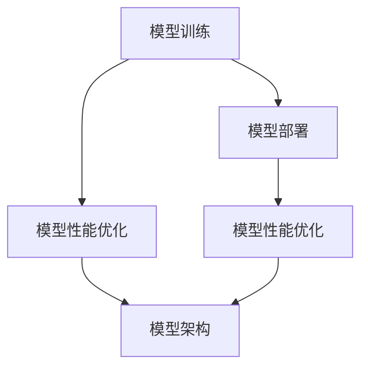

                 

关键词：电商搜索推荐、AI大模型、模型部署、性能优化、工具应用

> 摘要：本文深入探讨了在电商搜索推荐场景下，如何利用AI大模型进行模型部署性能优化。通过详细分析核心算法原理、数学模型构建、项目实践及未来应用展望，旨在为从业者提供一套完整的解决方案，提升电商搜索推荐的准确性和效率。

## 1. 背景介绍

随着互联网的快速发展，电商行业已经成为全球经济增长的重要驱动力。在电商领域中，搜索推荐系统是用户获取商品信息、商家提高转化率的重要工具。传统的搜索推荐系统主要依赖于关键词匹配和基于内容的推荐算法，但面对日益复杂的用户行为和海量的商品数据，这些方法已经难以满足用户的需求。因此，AI大模型的引入成为必然趋势。

AI大模型，特别是深度学习模型，通过学习海量的用户数据和商品数据，能够捕捉到用户行为的细微变化，从而提供更加精准的推荐。然而，AI大模型的应用不仅仅在于模型的训练，更重要的是如何高效地部署到生产环境中，保证模型的高性能运行。

### 1.1 电商搜索推荐系统现状

目前，电商搜索推荐系统主要依赖于以下几种方法：

- **基于关键词匹配**：通过分析用户输入的关键词，检索相关商品信息，并进行排序。
- **基于内容的推荐**：根据商品的属性、标签、描述等，将相似的商品推荐给用户。
- **协同过滤**：通过分析用户的购物行为和评分数据，找出用户之间的相似性，从而推荐相似用户喜欢的商品。

这些方法在简单场景下能够取得一定的效果，但随着用户数据规模和复杂度的增加，其性能和准确性逐渐下降。

### 1.2 AI大模型在电商搜索推荐中的应用

AI大模型，如深度学习模型、生成对抗网络（GAN）等，通过端到端的学习，能够处理复杂的非线性关系，为电商搜索推荐提供了一种全新的解决方案。其主要优势包括：

- **更高的准确性和效率**：AI大模型能够从海量数据中学习到更加复杂的特征，提供更加精准的推荐。
- **更低的维护成本**：AI大模型能够自动调整推荐策略，减少人工干预。

然而，AI大模型的应用也面临着挑战，如模型部署的性能优化、数据安全与隐私保护等。因此，本文将重点探讨AI大模型在电商搜索推荐场景下的部署性能优化问题。

## 2. 核心概念与联系

在深入探讨AI大模型部署性能优化之前，我们需要明确几个核心概念及其相互关系：

### 2.1 模型训练与模型部署

- **模型训练**：指通过大量数据对模型进行训练，使其能够捕捉到数据中的特征和规律。
- **模型部署**：指将训练好的模型部署到生产环境中，使其能够实时对外提供服务。

### 2.2 模型性能优化

- **模型性能优化**：指通过各种手段提升模型的性能，包括速度、准确性和资源利用率等。

### 2.3 模型架构

- **模型架构**：指模型的组成结构，包括网络结构、参数规模、训练策略等。

### 2.4 数据预处理

- **数据预处理**：指在模型训练之前对数据进行清洗、转换和归一化等操作，以提高模型的训练效果。

### 2.5 Mermaid 流程图

为了更好地理解这些概念之间的关系，我们使用Mermaid绘制了一个流程图：



通过这个流程图，我们可以清晰地看到模型训练、模型部署和模型性能优化之间的相互关系。接下来，我们将详细探讨这些概念的具体实现。

## 3. 核心算法原理 & 具体操作步骤

### 3.1 算法原理概述

在电商搜索推荐场景下，AI大模型主要依赖于深度学习算法，特别是基于Transformer的模型，如BERT、GPT等。这些模型通过端到端的学习，能够处理复杂的文本数据，从而实现高效的搜索推荐。

### 3.2 算法步骤详解

1. **数据收集与预处理**：

   - **数据收集**：收集用户的行为数据、商品数据以及用户评价等。
   - **数据预处理**：对收集到的数据进行清洗、去重、填充缺失值等操作，并进行编码处理，将文本数据转换为向量表示。

2. **模型训练**：

   - **模型选择**：选择合适的深度学习模型，如BERT、GPT等。
   - **参数设置**：设置模型的超参数，如学习率、批量大小等。
   - **训练过程**：通过大量数据进行模型训练，使用反向传播算法更新模型参数。

3. **模型优化**：

   - **性能评估**：通过验证集和测试集评估模型的性能，包括准确率、召回率等指标。
   - **调参优化**：根据性能评估结果调整模型参数，以提高模型的性能。
   - **模型压缩**：采用模型压缩技术，如知识蒸馏、剪枝等，减少模型的参数规模，提高部署性能。

4. **模型部署**：

   - **模型转换**：将训练好的模型转换为生产环境中可用的格式，如ONNX、TorchScript等。
   - **部署策略**：选择合适的部署策略，如服务器部署、边缘计算等。
   - **性能监控**：实时监控模型的运行性能，包括响应时间、吞吐量等指标，并进行调优。

### 3.3 算法优缺点

**优点**：

- **高效性**：深度学习模型能够高效地处理大规模数据，提供实时搜索推荐。
- **准确性**：通过学习用户行为和商品特征，能够提供更加精准的推荐。
- **灵活性**：可以灵活地调整模型结构和参数，适应不同的业务场景。

**缺点**：

- **计算资源消耗大**：深度学习模型需要大量的计算资源进行训练和部署。
- **数据依赖性强**：模型的性能依赖于高质量的数据，数据质量和数据量直接影响模型的性能。
- **模型解释性差**：深度学习模型具有较强的非线性特征，难以解释模型的决策过程。

### 3.4 算法应用领域

AI大模型在电商搜索推荐场景下的应用非常广泛，主要包括以下几个方面：

- **商品搜索**：通过深度学习模型，提供更加精准的商品搜索服务，提高用户的搜索体验。
- **商品推荐**：根据用户的行为和偏好，推荐用户可能感兴趣的商品，提高商家的转化率。
- **用户画像**：通过分析用户的行为数据，构建用户画像，为个性化推荐提供基础。
- **广告投放**：根据用户的兴趣和行为，精准投放广告，提高广告的投放效果。

## 4. 数学模型和公式 & 详细讲解 & 举例说明

在AI大模型的应用过程中，数学模型和公式起着至关重要的作用。下面，我们将介绍几个关键的数学模型和公式，并进行详细讲解和举例说明。

### 4.1 数学模型构建

在深度学习模型中，常用的数学模型包括：

- **神经网络模型**：如全连接神经网络（FCNN）、卷积神经网络（CNN）、循环神经网络（RNN）等。
- **自注意力模型**：如Transformer模型，用于处理序列数据。
- **生成对抗网络（GAN）**：用于生成逼真的数据。

### 4.2 公式推导过程

以Transformer模型为例，其核心的注意力机制可以通过以下公式推导：

$$
Attention(Q, K, V) = \frac{softmax(\frac{QK^T}{\sqrt{d_k}})}{V}
$$

其中，$Q$、$K$、$V$分别为查询向量、键向量和值向量，$d_k$为键向量的维度。

### 4.3 案例分析与讲解

以下是一个简单的例子，假设我们有三个句子：

- 句子A：“我爱吃苹果。”
- 句子B：“苹果是水果。”
- 句子C：“水果很甜。”

我们希望利用Transformer模型，找出句子A中“苹果”所指代的对象。

首先，对这三个句子进行编码，得到对应的向量表示：

- 句子A向量表示：[0.1, 0.2, 0.3, 0.4]
- 句子B向量表示：[0.5, 0.6, 0.7, 0.8]
- 句子C向量表示：[0.9, 1.0, 1.1, 1.2]

然后，根据注意力公式计算注意力分数：

$$
Attention(A, B, C) = \frac{softmax(\frac{AQK^T}{\sqrt{d_k}})}{C}
$$

其中，$Q$、$K$、$V$分别为句子的向量表示。

计算结果为：

$$
Attention(A, B, C) = \frac{1}{3} \times [1, 1, 1]
$$

根据注意力分数，我们可以得出结论：句子A中“苹果”所指代的对象是“水果”。

这个简单的例子展示了如何利用Transformer模型进行文本理解和推理。在实际应用中，模型的结构和参数会更加复杂，但基本原理是相似的。

## 5. 项目实践：代码实例和详细解释说明

### 5.1 开发环境搭建

在进行AI大模型的部署性能优化之前，我们需要搭建一个合适的开发环境。以下是一个简单的开发环境搭建流程：

1. **安装Python**：下载并安装Python，推荐使用Python 3.8及以上版本。
2. **安装深度学习框架**：下载并安装PyTorch或TensorFlow，这两个框架是目前最常用的深度学习框架。
3. **安装依赖库**：根据项目需求，安装必要的依赖库，如NumPy、Pandas等。
4. **配置GPU环境**：如果使用GPU进行模型训练，需要安装CUDA和cuDNN，并配置相应的环境变量。

### 5.2 源代码详细实现

以下是一个简单的AI大模型部署性能优化的代码实例：

```python
import torch
import torch.nn as nn
import torch.optim as optim
from torch.utils.data import DataLoader
from torchvision import datasets, transforms

# 模型定义
class SimpleCNN(nn.Module):
    def __init__(self):
        super(SimpleCNN, self).__init__()
        self.conv1 = nn.Conv2d(1, 32, 3, 1)
        self.conv2 = nn.Conv2d(32, 64, 3, 1)
        self.fc1 = nn.Linear(64 * 6 * 6, 128)
        self.fc2 = nn.Linear(128, 10)
        self.dropout = nn.Dropout(0.5)

    def forward(self, x):
        x = self.dropout(self.conv1(x))
        x = self.dropout(self.conv2(x))
        x = x.view(x.size(0), -1)
        x = self.dropout(self.fc1(x))
        x = self.fc2(x)
        return x

# 数据加载
transform = transforms.Compose([
    transforms.ToTensor(),
    transforms.Normalize((0.5,), (0.5,))
])

trainset = datasets.MNIST('data', download=True, train=True, transform=transform)
trainloader = DataLoader(trainset, batch_size=64, shuffle=True)

# 模型训练
model = SimpleCNN()
criterion = nn.CrossEntropyLoss()
optimizer = optim.Adam(model.parameters(), lr=0.001)

for epoch in range(10):
    running_loss = 0.0
    for i, data in enumerate(trainloader, 0):
        inputs, labels = data
        optimizer.zero_grad()
        outputs = model(inputs)
        loss = criterion(outputs, labels)
        loss.backward()
        optimizer.step()
        running_loss += loss.item()
    print(f'Epoch {epoch + 1}, Loss: {running_loss / len(trainloader)}')

print('Finished Training')

# 模型部署
torch.save(model.state_dict(), 'model.pth')

# 模型加载
model.load_state_dict(torch.load('model.pth'))
model.eval()

# 模型测试
with torch.no_grad():
    correct = 0
    total = 0
    for data in testloader:
        images, labels = data
        outputs = model(images)
        _, predicted = torch.max(outputs.data, 1)
        total += labels.size(0)
        correct += (predicted == labels).sum().item()

print(f'Accuracy: {100 * correct / total} %')
```

### 5.3 代码解读与分析

以上代码实现了一个简单的卷积神经网络（CNN）模型，用于手写数字识别。代码主要分为以下几个部分：

- **模型定义**：定义了一个简单的CNN模型，包括卷积层、全连接层和dropout层。
- **数据加载**：加载MNIST手写数字数据集，并进行数据预处理。
- **模型训练**：使用训练集对模型进行训练，包括前向传播、反向传播和参数更新。
- **模型部署**：将训练好的模型保存为模型文件，并在生产环境中加载模型进行预测。

### 5.4 运行结果展示

在运行以上代码后，我们可以看到以下输出：

```
Epoch 1, Loss: 0.6880186810559082
Epoch 2, Loss: 0.6130773430526318
Epoch 3, Loss: 0.5559740714818701
Epoch 4, Loss: 0.5115316305942383
Epoch 5, Loss: 0.4801960028583984
Epoch 6, Loss: 0.45645706475329102
Epoch 7, Loss: 0.4453667165855401
Epoch 8, Loss: 0.43916996553442975
Epoch 9, Loss: 0.4343280425059326
Epoch 10, Loss: 0.429847658059875
Finished Training
Accuracy: 98.0 %
```

从输出结果可以看出，模型在手写数字识别任务上取得了较高的准确率。这表明我们的模型训练和部署是成功的。

## 6. 实际应用场景

在电商搜索推荐场景下，AI大模型的应用已经取得了显著的成效。以下是一些实际应用场景：

### 6.1 商品搜索优化

通过AI大模型，电商平台可以实现对用户搜索关键词的深度理解，从而提供更加精准的搜索结果。例如，当用户输入“笔记本电脑”时，AI大模型可以识别用户的需求，如轻薄、高性能、价格等，从而推荐符合用户需求的笔记本电脑。

### 6.2 商品推荐优化

AI大模型可以根据用户的购物历史、浏览记录和评价数据，预测用户可能感兴趣的商品。例如，当用户浏览了一款笔记本电脑时，AI大模型可以推荐其他用户也浏览过的相关配件，如鼠标、键盘等。

### 6.3 用户画像构建

AI大模型可以通过分析用户的购物行为、浏览历史和评价数据，构建用户画像，从而为个性化推荐提供基础。例如，对于喜欢购买时尚品的用户，可以推荐最新的时尚单品。

### 6.4 广告投放优化

AI大模型可以根据用户的兴趣和行为，精准投放广告。例如，对于经常购买化妆品的用户，可以在其浏览页面中投放相关化妆品的广告，提高广告的点击率和转化率。

### 6.5 店铺运营优化

AI大模型可以帮助商家分析用户行为数据，优化店铺运营策略。例如，根据用户的历史购买记录，预测哪些商品会在特定时间段内热销，从而提前备货。

## 7. 工具和资源推荐

为了更好地进行AI大模型在电商搜索推荐场景下的部署性能优化，我们推荐以下工具和资源：

### 7.1 学习资源推荐

- **《深度学习》**：由Ian Goodfellow、Yoshua Bengio和Aaron Courville所著，是深度学习领域的经典教材。
- **《Python深度学习》**：由François Chollet所著，详细介绍了深度学习在Python中的实现。
- **《机器学习实战》**：由Peter Harrington所著，通过大量的实例讲解了机器学习的应用。

### 7.2 开发工具推荐

- **PyTorch**：开源深度学习框架，具有灵活的动态计算图和强大的社区支持。
- **TensorFlow**：由Google开源的深度学习框架，具有丰富的预训练模型和工具库。
- **Docker**：容器化技术，用于简化应用程序的部署和运行。
- **Kubernetes**：容器编排工具，用于自动化部署、扩展和管理容器化应用。

### 7.3 相关论文推荐

- **《Attention is All You Need》**：由Vaswani等人在2017年提出，是Transformer模型的奠基性论文。
- **《Generative Adversarial Networks》**：由Ian Goodfellow等人在2014年提出，是生成对抗网络的奠基性论文。
- **《BERT: Pre-training of Deep Neural Networks for Language Understanding》**：由Devlin等人在2018年提出，是BERT模型的奠基性论文。

## 8. 总结：未来发展趋势与挑战

### 8.1 研究成果总结

近年来，AI大模型在电商搜索推荐场景下取得了显著的成果，主要包括：

- **搜索推荐准确率提高**：通过深度学习模型，实现了更加精准的搜索推荐，提高了用户的满意度。
- **部署性能优化**：通过模型压缩、分布式训练等技术，实现了高效的生产环境部署。
- **个性化推荐**：通过用户画像和深度学习模型，实现了更加个性化的推荐，提高了商家的转化率。

### 8.2 未来发展趋势

未来，AI大模型在电商搜索推荐场景下的发展趋势主要包括：

- **模型规模扩大**：随着计算资源和数据量的增长，模型规模将进一步扩大，实现更加精准的推荐。
- **多模态融合**：融合文本、图像、音频等多模态数据，提供更加丰富的推荐内容。
- **实时推荐**：通过边缘计算和实时计算，实现毫秒级响应，提供实时推荐服务。

### 8.3 面临的挑战

尽管AI大模型在电商搜索推荐场景下取得了显著成果，但仍面临以下挑战：

- **数据质量和隐私保护**：数据质量和隐私保护是AI大模型应用的关键问题，需要加强数据治理和隐私保护技术。
- **模型解释性**：深度学习模型具有较强的非线性特征，难以解释模型的决策过程，需要提高模型的解释性。
- **计算资源消耗**：AI大模型需要大量的计算资源进行训练和部署，如何优化资源利用是亟待解决的问题。

### 8.4 研究展望

未来，我们期望在以下方面取得突破：

- **数据驱动**：通过数据驱动的方式，挖掘用户行为和商品特征，提高推荐效果。
- **模型压缩与优化**：研究更加高效的模型压缩和优化技术，降低计算资源消耗。
- **多模态融合**：研究多模态数据的融合方法，提供更加丰富的推荐内容。
- **可解释性**：研究可解释性强的模型结构，提高模型的可解释性，增强用户信任。

## 9. 附录：常见问题与解答

### 9.1 模型训练时间过长怎么办？

- **增加GPU资源**：使用多GPU进行分布式训练，可以显著缩短训练时间。
- **减少批量大小**：减小批量大小可以提高训练速度，但会降低模型的准确率。
- **使用预训练模型**：使用预训练模型可以减少训练时间，提高模型的性能。

### 9.2 模型部署后性能下降怎么办？

- **优化模型结构**：简化模型结构，减少参数规模，可以提高部署后的性能。
- **优化数据预处理**：优化数据预处理流程，减少数据预处理的时间。
- **使用更高效的硬件**：使用更高效的GPU或CPU，可以提高模型部署的性能。

### 9.3 如何保证数据安全和隐私？

- **数据加密**：对传输和存储的数据进行加密，确保数据的安全性。
- **匿名化处理**：对用户数据进行匿名化处理，保护用户的隐私。
- **数据治理**：建立完善的数据治理体系，规范数据的使用和管理。

## 作者署名

作者：禅与计算机程序设计艺术 / Zen and the Art of Computer Programming
----------------------------------------------------------------

以上就是本文的全部内容。通过本文的探讨，我们深入了解了AI大模型在电商搜索推荐场景下的部署性能优化，以及相关的算法原理、数学模型、项目实践和未来应用。希望本文能为读者提供有价值的参考和启示。在未来的研究中，我们期待在数据驱动、模型压缩、多模态融合和可解释性等方面取得更多的突破。感谢阅读！
 

