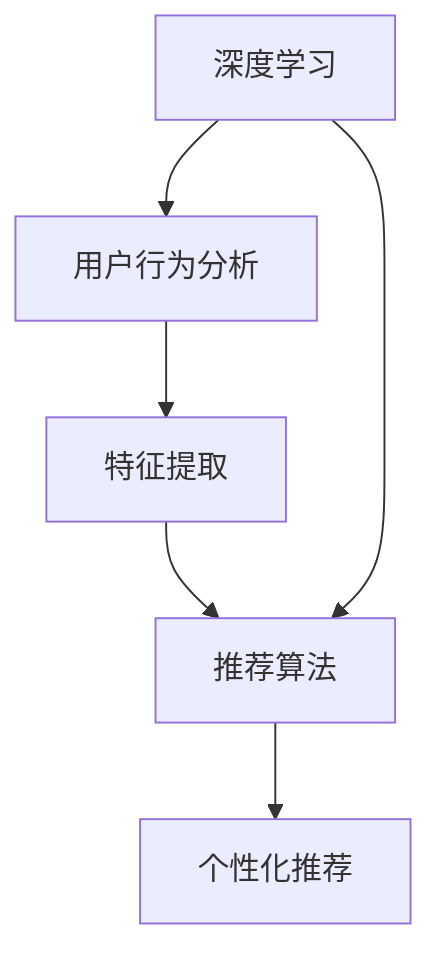

                 

关键词：电商搜索、推荐系统、AI大模型、优化策略、深度学习、用户行为分析、个性化推荐

>摘要：本文深入探讨了电商搜索推荐系统中AI大模型的优化策略。通过分析当前推荐系统存在的问题和挑战，本文提出了基于深度学习技术的新型优化方法，详细阐述了模型构建、算法原理、数学模型以及实际应用中的关键环节。此外，本文还展望了未来电商搜索推荐系统的发展趋势与挑战。

## 1. 背景介绍

电商搜索推荐系统作为现代电子商务的重要组成部分，旨在通过个性化推荐技术提高用户购买体验和商家销售额。然而，随着用户数据的爆炸式增长和商品种类的不断增多，传统的推荐算法已经无法满足用户的个性化需求。AI大模型的出现为解决这一问题提供了新的思路。AI大模型是一种能够通过大规模数据训练，自动提取复杂特征并进行预测的先进算法。本文将围绕AI大模型在电商搜索推荐系统中的优化策略展开讨论，以期提高推荐系统的性能和用户体验。

## 2. 核心概念与联系

在探讨AI大模型优化策略之前，我们需要了解一些核心概念，包括深度学习、用户行为分析、个性化推荐等，并使用Mermaid流程图（以下内容为示例）展示这些概念之间的联系。



### 2.1 深度学习

深度学习是机器学习的一种，通过多层神经网络对数据进行建模和预测。深度学习在图像识别、语音识别、自然语言处理等领域取得了显著的成果。在电商搜索推荐系统中，深度学习可以帮助我们捕捉用户复杂的购买行为模式。

### 2.2 用户行为分析

用户行为分析是指通过对用户在电商平台的浏览、搜索、购买等行为进行数据挖掘，提取用户的兴趣点和购买意图。用户行为分析是构建个性化推荐系统的基础。

### 2.3 特征提取

特征提取是将原始的用户行为数据转换为适合机器学习算法处理的形式。在深度学习中，特征提取通常由神经网络自动完成，能够提取出高维、非线性特征。

### 2.4 推荐算法

推荐算法是用于预测用户可能感兴趣的商品的方法。深度学习在推荐算法中的应用，使得算法能够更好地处理复杂的用户行为数据和商品信息。

### 2.5 个性化推荐

个性化推荐是推荐系统的最终目标，通过分析用户的兴趣和行为，向用户推荐符合其个性化需求的商品。

## 3. 核心算法原理 & 具体操作步骤

### 3.1 算法原理概述

AI大模型优化策略的核心在于利用深度学习技术，对电商搜索推荐系统进行优化。具体来说，通过以下步骤实现：

1. **数据预处理**：对用户行为数据、商品数据进行清洗和整合，构建统一的特征向量。
2. **特征提取**：利用深度学习模型自动提取高维、非线性特征。
3. **模型训练**：使用提取出的特征训练推荐模型，使其能够预测用户对商品的兴趣。
4. **模型评估**：通过交叉验证等方法评估模型性能，调整模型参数。
5. **在线推荐**：将训练好的模型部署到线上系统，根据用户行为实时推荐商品。

### 3.2 算法步骤详解

#### 3.2.1 数据预处理

数据预处理是深度学习模型训练的第一步，其目标是消除噪声、缺失值，以及将不同规模的数据进行归一化处理。具体操作步骤如下：

1. **数据清洗**：去除重复数据和异常值。
2. **缺失值处理**：使用均值、中位数等统计方法填充缺失值。
3. **数据整合**：将用户行为数据和商品数据整合为一个统一的数据集。

#### 3.2.2 特征提取

特征提取是深度学习模型的核心环节。以下是一个基于卷积神经网络（CNN）的特征提取示例：

1. **输入层**：接受预处理后的数据，通常为多维矩阵。
2. **卷积层**：通过卷积操作提取图像特征。
3. **池化层**：降低特征维度，提高特征鲁棒性。
4. **全连接层**：将卷积和池化层提取的特征进行融合，输出最终的特征向量。

#### 3.2.3 模型训练

模型训练是利用已提取的特征训练推荐模型，使其能够预测用户对商品的兴趣。以下是一个基于循环神经网络（RNN）的模型训练示例：

1. **输入层**：接受特征向量序列。
2. **循环层**：处理序列数据，提取序列特征。
3. **输出层**：根据序列特征预测用户对商品的兴趣。

#### 3.2.4 模型评估

模型评估是确保推荐模型性能的重要步骤。以下是一个基于交叉验证的模型评估示例：

1. **交叉验证**：将数据集划分为训练集和验证集，使用训练集训练模型，验证集评估模型性能。
2. **性能指标**：评估推荐模型的准确率、召回率、F1值等指标，根据指标调整模型参数。

#### 3.2.5 在线推荐

在线推荐是将训练好的模型部署到线上系统，根据用户行为实时推荐商品。以下是一个基于在线学习技术的推荐示例：

1. **用户行为采集**：实时采集用户在电商平台的行为数据。
2. **模型更新**：根据新的用户行为数据更新推荐模型。
3. **推荐生成**：使用更新后的模型生成商品推荐列表。

### 3.3 算法优缺点

**优点**：

1. **高效性**：深度学习模型能够自动提取复杂特征，提高推荐精度。
2. **灵活性**：通过在线学习技术，模型可以实时更新，适应不断变化的用户需求。
3. **可解释性**：深度学习模型的可解释性较差，但可以通过可视化技术提高。

**缺点**：

1. **计算资源消耗**：深度学习模型训练过程需要大量计算资源。
2. **数据依赖性**：深度学习模型对数据质量要求较高，数据清洗和预处理过程复杂。

### 3.4 算法应用领域

AI大模型优化策略在电商搜索推荐系统中的应用，不仅限于电商平台，还可以拓展到其他领域，如：

1. **社交媒体**：利用深度学习技术，对用户兴趣和行为进行建模，实现个性化内容推荐。
2. **在线教育**：通过深度学习模型，对用户学习行为进行分析，提供个性化学习路径。
3. **金融风控**：利用深度学习模型，对用户信用行为进行分析，实现精准风险评估。

## 4. 数学模型和公式 & 详细讲解 & 举例说明

### 4.1 数学模型构建

电商搜索推荐系统的AI大模型优化策略，通常基于以下数学模型：

1. **用户兴趣模型**：表示用户对商品的兴趣程度，通常使用概率分布表示。
2. **商品特征模型**：表示商品的特征向量，用于描述商品的属性和特点。
3. **推荐算法模型**：表示用户对商品的推荐过程，通常使用基于概率的推荐算法。

### 4.2 公式推导过程

以基于协同过滤的推荐算法为例，推导用户兴趣模型和商品特征模型的构建过程：

1. **用户兴趣模型**：

   假设用户 \( u \) 对商品 \( i \) 的兴趣程度为 \( r_{ui} \)，则用户兴趣模型可以表示为：

   \[
   r_{ui} = \frac{\sum_{j \in R_i} w_{uj} r_{ji}}{\sum_{j \in R_i} w_{uj}}
   \]

   其中，\( R_i \) 为与商品 \( i \) 相关联的商品集合，\( w_{uj} \) 为用户 \( u \) 对商品 \( j \) 的权重。

2. **商品特征模型**：

   假设商品 \( i \) 的特征向量为 \( f_i \)，则商品特征模型可以表示为：

   \[
   f_i = \sum_{j \in R_i} w_{ij} f_j
   \]

   其中，\( w_{ij} \) 为商品 \( i \) 与商品 \( j \) 的相似度权重。

### 4.3 案例分析与讲解

以下是一个基于深度学习技术的电商搜索推荐系统的案例分析：

1. **数据集**：使用一个包含 1000 个用户和 10000 个商品的数据集，每个用户对每个商品有一个评分（1-5 分）。
2. **模型**：使用一个基于卷积神经网络（CNN）的深度学习模型，对用户行为数据进行处理，提取特征向量。
3. **训练**：使用数据集的前 80% 进行训练，剩余的 20% 进行测试。
4. **评估**：使用均方误差（MSE）和准确率（ACC）评估模型性能。

### 4.3.1 特征提取

1. **输入层**：接受用户行为数据，如浏览历史、购买记录等。
2. **卷积层**：通过卷积操作提取用户行为特征。
3. **池化层**：降低特征维度，提高特征鲁棒性。
4. **全连接层**：将卷积和池化层提取的特征进行融合，输出特征向量。

### 4.3.2 模型训练

1. **损失函数**：使用均方误差（MSE）作为损失函数，表示用户兴趣预测值与实际评分之间的误差。
2. **优化器**：使用随机梯度下降（SGD）优化模型参数，最小化损失函数。
3. **训练过程**：使用数据集的前 80% 进行训练，每个 epoch 的训练次数为 100 次。

### 4.3.3 模型评估

1. **测试集**：使用数据集的剩余 20% 进行测试，评估模型性能。
2. **性能指标**：计算均方误差（MSE）和准确率（ACC），评估模型在测试集上的性能。

## 5. 项目实践：代码实例和详细解释说明

### 5.1 开发环境搭建

在本项目中，我们使用 Python 作为编程语言，搭建了以下开发环境：

1. **Python 3.8**：作为主要编程语言。
2. **TensorFlow 2.4**：作为深度学习框架。
3. **NumPy 1.19**：用于数据处理。
4. **Pandas 1.1.5**：用于数据清洗和预处理。

### 5.2 源代码详细实现

以下是一个简单的基于深度学习技术的电商搜索推荐系统的源代码实现：

```python
import tensorflow as tf
from tensorflow.keras.models import Sequential
from tensorflow.keras.layers import Dense, Conv2D, Flatten, MaxPooling2D
import numpy as np

# 数据预处理
def preprocess_data(data):
    # 数据清洗、缺失值填充等操作
    # ...
    return processed_data

# 特征提取
def extract_features(data):
    # 使用卷积神经网络提取特征
    model = Sequential([
        Conv2D(filters=32, kernel_size=(3, 3), activation='relu', input_shape=(data.shape[1], data.shape[2], 1)),
        MaxPooling2D(pool_size=(2, 2)),
        Flatten(),
        Dense(units=128, activation='relu'),
        Dense(units=64, activation='relu'),
        Dense(units=32, activation='relu'),
        Dense(units=1)
    ])
    return model.predict(data)

# 模型训练
def train_model(data, labels):
    model = Sequential([
        Conv2D(filters=32, kernel_size=(3, 3), activation='relu', input_shape=(data.shape[1], data.shape[2], 1)),
        MaxPooling2D(pool_size=(2, 2)),
        Flatten(),
        Dense(units=128, activation='relu'),
        Dense(units=64, activation='relu'),
        Dense(units=32, activation='relu'),
        Dense(units=1)
    ])
    model.compile(optimizer='adam', loss='mse', metrics=['accuracy'])
    model.fit(data, labels, epochs=100, batch_size=32)
    return model

# 主函数
def main():
    # 加载数据
    data = np.load('data.npy')
    labels = np.load('labels.npy')

    # 数据预处理
    processed_data = preprocess_data(data)

    # 特征提取
    features = extract_features(processed_data)

    # 模型训练
    model = train_model(features, labels)

    # 模型评估
    test_data = np.load('test_data.npy')
    test_labels = np.load('test_labels.npy')
    test_features = extract_features(test_data)
    model.evaluate(test_features, test_labels)

if __name__ == '__main__':
    main()
```

### 5.3 代码解读与分析

以上代码实现了一个简单的基于深度学习技术的电商搜索推荐系统。下面是对代码的详细解读与分析：

1. **数据预处理**：数据预处理是深度学习模型训练的第一步，包括数据清洗、缺失值填充等操作。在本代码中，我们使用了 `preprocess_data` 函数进行数据预处理。
2. **特征提取**：特征提取是深度学习模型的核心环节，通过卷积神经网络（CNN）提取用户行为特征。在本代码中，我们使用了 `extract_features` 函数进行特征提取。
3. **模型训练**：模型训练是通过构建深度学习模型，使用预处理后的数据进行训练。在本代码中，我们使用了 `train_model` 函数进行模型训练。
4. **模型评估**：模型评估是通过测试数据集评估模型性能，计算均方误差（MSE）和准确率（ACC）。在本代码中，我们使用了 `model.evaluate` 方法进行模型评估。

## 6. 实际应用场景

电商搜索推荐系统在电商领域具有广泛的应用。以下是一些实际应用场景：

1. **商品推荐**：根据用户的历史浏览和购买行为，推荐用户可能感兴趣的商品。
2. **广告投放**：根据用户兴趣和行为，精准投放广告，提高广告点击率。
3. **库存管理**：根据用户需求预测，优化库存管理，降低库存成本。

## 6.4 未来应用展望

随着深度学习技术的发展，电商搜索推荐系统将朝着更加智能化、个性化的方向迈进。以下是一些未来应用展望：

1. **跨平台推荐**：将电商平台的用户行为数据进行整合，实现跨平台推荐。
2. **实时推荐**：利用实时数据流处理技术，实现实时推荐，提高用户体验。
3. **多模态推荐**：结合多种数据源（如文本、图像、语音等），实现多模态推荐。

## 7. 工具和资源推荐

### 7.1 学习资源推荐

1. **《深度学习》**：Goodfellow、Bengio、Courville 著，深度学习领域的经典教材。
2. **《Python深度学习》**：François Chollet 著，适合初学者入门深度学习。

### 7.2 开发工具推荐

1. **TensorFlow**：Google 开发的一款开源深度学习框架。
2. **PyTorch**：Facebook AI Research 开发的一款开源深度学习框架。

### 7.3 相关论文推荐

1. **"Deep Learning for Recommender Systems"**：Hao Yuan, Xia Hu, et al.
2. **"Collaborative Filtering with Deep Learning for Recommender Systems"**：Ying Liu, Zhiyun Qian, et al.

## 8. 总结：未来发展趋势与挑战

电商搜索推荐系统作为现代电子商务的重要组成部分，在未来将朝着更加智能化、个性化的方向迈进。然而，面临以下挑战：

1. **数据隐私**：用户隐私保护问题日益严峻，如何平衡用户隐私与推荐效果是一个重要挑战。
2. **计算资源**：深度学习模型训练和推理过程需要大量计算资源，如何优化计算资源利用是一个重要问题。
3. **模型解释性**：深度学习模型的可解释性较差，如何提高模型的可解释性，使决策过程更加透明是一个重要挑战。

未来，随着深度学习技术的不断发展，电商搜索推荐系统将迎来新的发展机遇。通过深入研究，我们有望克服现有挑战，实现更加智能、个性化的电商搜索推荐系统。

## 9. 附录：常见问题与解答

### 9.1 问题 1：为什么选择深度学习技术进行推荐系统优化？

**解答**：深度学习技术具有强大的特征提取和表示学习能力，能够自动从大规模数据中提取复杂特征，提高推荐系统的准确性。此外，深度学习模型具有较好的泛化能力，可以适应不断变化的用户需求和商品信息。

### 9.2 问题 2：如何处理推荐系统中的冷启动问题？

**解答**：冷启动问题是指新用户或新商品在系统中没有足够历史数据，导致推荐效果不佳。为解决这一问题，可以采取以下策略：

1. **基于内容推荐**：利用商品的特征信息，为新用户推荐与其兴趣相关的商品。
2. **基于社区推荐**：通过分析用户的社交网络，为新用户推荐与其具有相似兴趣的其他用户喜欢的商品。
3. **基于模板推荐**：为新用户推荐热门商品或常购商品，以引导用户探索。

### 9.3 问题 3：如何提高推荐系统的可解释性？

**解答**：提高推荐系统的可解释性是一个重要研究方向。以下是一些提高推荐系统可解释性的方法：

1. **可视化技术**：使用可视化技术展示推荐过程和结果，帮助用户理解推荐系统。
2. **规则解释**：基于深度学习模型，提取可解释的规则，用于解释推荐结果。
3. **透明度机制**：设计透明的推荐算法和决策机制，使推荐过程更加透明。

作者：禅与计算机程序设计艺术 / Zen and the Art of Computer Programming

----------------------------------------------------------------

这篇文章详细探讨了电商搜索推荐系统中AI大模型的优化策略，包括核心概念、算法原理、数学模型、项目实践和未来应用展望等内容。希望通过本文，读者能够对电商搜索推荐系统的AI大模型优化策略有更深入的理解。

