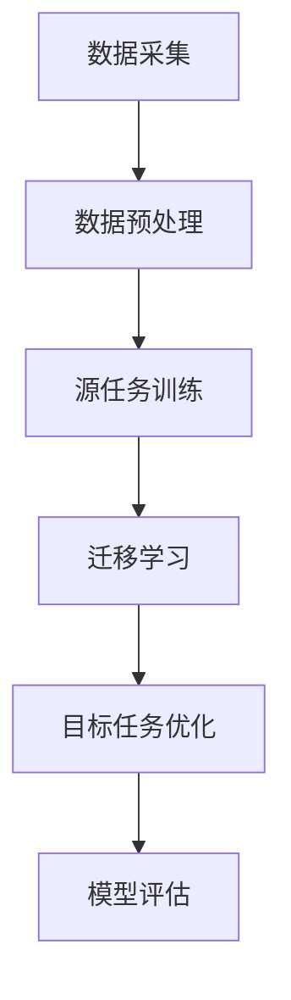

                 

关键词：电商行业，迁移学习，大模型，用户行为预测，跨平台

> 摘要：本文将探讨电商行业中迁移学习技术在跨平台用户行为预测方面的应用。通过介绍迁移学习的核心概念、算法原理及其在电商领域的实践案例，本文旨在展示大模型在提高用户行为预测准确性、优化电商运营策略方面的重要作用。同时，文章还将探讨迁移学习在未来电商行业的发展趋势及面临的挑战。

## 1. 背景介绍

### 电商行业的发展

随着互联网技术的迅猛发展，电商行业已经成为全球经济增长的重要驱动力。据数据显示，全球电商市场规模持续扩大，预计到2025年，电商市场的销售额将突破4万亿美元。与此同时，电商平台不断丰富产品种类、优化用户体验，提升用户黏性。然而，如何在海量用户数据中准确预测用户行为，从而实现个性化推荐、精准营销，成为电商行业亟待解决的问题。

### 迁移学习的兴起

迁移学习（Transfer Learning）作为一种机器学习技术，近年来在人工智能领域得到了广泛关注。其基本思想是将已在一个任务上学习到的知识迁移到另一个相关任务上，从而提高新任务的模型性能。传统的机器学习模型需要从零开始训练，耗时且效果有限，而迁移学习通过复用已有模型的部分知识，可以显著提高学习效率。

### 大模型的崛起

随着计算能力的提升和大数据技术的发展，大模型（Large Models）逐渐成为人工智能领域的研究热点。大模型拥有庞大的参数量和复杂的网络结构，能够捕捉数据中的潜在规律，从而实现更高的预测准确性和泛化能力。在电商行业，大模型的引入有望解决用户行为预测中的复杂性，提升电商平台的运营效果。

## 2. 核心概念与联系

### 迁移学习的基本原理

迁移学习的基本原理是通过将源任务（Source Task）的学习经验应用到目标任务（Target Task）中，从而提升目标任务的性能。迁移学习通常涉及以下三个核心概念：

1. **源任务**：一个已完成的任务，其模型参数可以用于迁移。
2. **目标任务**：一个待完成的任务，其性能可以通过迁移源任务的模型参数来提升。
3. **领域自适应**：通过调整源任务和目标任务之间的差距，使得源任务的模型能够更好地适应目标任务。

### 大模型与迁移学习的关系

大模型在迁移学习中的应用主要体现在以下几个方面：

1. **参数量增加**：大模型拥有更多的参数，能够更好地捕捉数据中的复杂关系。
2. **泛化能力提升**：大模型的复杂结构使其具有更强的泛化能力，能够在不同任务间迁移知识。
3. **计算资源需求**：大模型的训练和推理需要大量的计算资源，但迁移学习可以有效降低这些需求。

### 电商行业中的迁移学习架构

在电商行业中，迁移学习的架构通常包括以下模块：

1. **数据采集**：从多个电商平台收集用户行为数据。
2. **数据预处理**：清洗、归一化、特征提取等。
3. **源任务训练**：使用部分数据进行源任务的训练，构建基础模型。
4. **迁移学习**：将源任务模型应用于目标任务，调整模型参数。
5. **目标任务优化**：对迁移后的模型进行目标任务的优化，提高预测准确性。

以下是一个简化的Mermaid流程图，展示了电商行业中迁移学习的核心流程：



## 3. 核心算法原理 & 具体操作步骤

### 3.1 算法原理概述

迁移学习的基本算法原理包括以下几个步骤：

1. **源任务训练**：在源任务上训练一个基础模型，该模型将学习到一些通用的知识。
2. **特征提取**：从基础模型中提取特征表示，这些特征表示将用于目标任务的建模。
3. **目标任务建模**：使用提取的特征表示，在目标任务上构建新的模型。
4. **模型优化**：通过反向传播和梯度下降等优化算法，调整目标任务模型的参数，提高预测准确性。

### 3.2 算法步骤详解

1. **数据采集**：从多个电商平台采集用户行为数据，包括点击记录、浏览记录、购买记录等。
2. **数据预处理**：对采集到的数据进行清洗、归一化和特征提取，将原始数据转换为适合模型训练的格式。
3. **源任务训练**：使用部分预处理后的数据，在源任务（如点击预测）上训练一个基础模型。这个模型将学习到用户行为的一些通用规律。
4. **特征提取**：从基础模型中提取用户行为的特征表示。这些特征表示将作为目标任务的输入。
5. **目标任务建模**：使用提取的特征表示，在目标任务（如购买预测）上构建新的模型。这个模型将基于特征表示进行训练。
6. **模型优化**：通过反向传播和梯度下降等优化算法，调整目标任务模型的参数，提高预测准确性。
7. **模型评估**：使用交叉验证或测试集对模型进行评估，确保模型的泛化能力和预测准确性。

### 3.3 算法优缺点

**优点**：

1. **提高学习效率**：迁移学习通过复用已有模型的知识，可以显著降低目标任务的训练时间和计算资源需求。
2. **提升预测准确性**：通过迁移学习，目标任务模型能够利用源任务的通用知识，从而提高预测准确性。
3. **适用于跨平台应用**：迁移学习使得不同平台上的用户行为预测模型可以相互借鉴，实现跨平台的用户行为预测。

**缺点**：

1. **模型参数调整复杂**：迁移学习过程中需要调整模型参数，这可能会增加模型训练的复杂性。
2. **数据匹配问题**：源任务和目标任务的数据分布可能存在差异，这可能会影响迁移学习的效果。

### 3.4 算法应用领域

迁移学习在电商行业的应用领域主要包括：

1. **用户行为预测**：通过迁移学习，可以预测用户在电商平台上的点击、浏览和购买行为，从而实现个性化推荐和精准营销。
2. **商品分类**：使用迁移学习，可以将源任务中的知识应用于目标任务，提高商品的分类准确性。
3. **用户画像**：通过迁移学习，可以构建更准确的用户画像，为电商平台提供更深入的用户洞察。

## 4. 数学模型和公式 & 详细讲解 & 举例说明

### 4.1 数学模型构建

迁移学习的数学模型通常包括以下部分：

1. **源任务模型**：假设源任务的输入为\(X_s\)，输出为\(Y_s\)。源任务模型可以表示为：
   $$ f_s(X_s; \theta_s) = Y_s $$
   其中，\(\theta_s\)为源任务模型的参数。

2. **目标任务模型**：假设目标任务的输入为\(X_t\)，输出为\(Y_t\)。目标任务模型可以表示为：
   $$ f_t(X_t; \theta_t) = Y_t $$
   其中，\(\theta_t\)为目标任务模型的参数。

3. **迁移学习模型**：迁移学习模型通过将源任务的模型参数应用于目标任务，可以表示为：
   $$ f_t(X_t; \theta_s) = Y_t $$
   其中，\(\theta_s\)为源任务模型的参数，\(\theta_t\)为调整后的目标任务模型参数。

### 4.2 公式推导过程

迁移学习的公式推导过程通常涉及以下步骤：

1. **源任务损失函数**：源任务模型的损失函数可以表示为：
   $$ L_s(\theta_s) = \frac{1}{n} \sum_{i=1}^{n} (f_s(X_{s,i}; \theta_s) - Y_{s,i})^2 $$
   其中，\(n\)为训练样本数量，\(X_{s,i}\)和\(Y_{s,i}\)分别为第\(i\)个源任务样本的输入和输出。

2. **目标任务损失函数**：目标任务模型的损失函数可以表示为：
   $$ L_t(\theta_t) = \frac{1}{m} \sum_{j=1}^{m} (f_t(X_{t,j}; \theta_t) - Y_{t,j})^2 $$
   其中，\(m\)为训练样本数量，\(X_{t,j}\)和\(Y_{t,j}\)分别为第\(j\)个目标任务样本的输入和输出。

3. **迁移学习损失函数**：迁移学习模型的损失函数可以表示为：
   $$ L(\theta_s, \theta_t) = \frac{1}{n} \sum_{i=1}^{n} (f_s(X_{s,i}; \theta_s) - Y_{s,i})^2 + \lambda \frac{1}{m} \sum_{j=1}^{m} (f_t(X_{t,j}; \theta_s) - Y_{t,j})^2 $$
   其中，\(\lambda\)为迁移权重，用于平衡源任务和目标任务的损失。

### 4.3 案例分析与讲解

假设我们有一个电商平台的用户行为预测问题，其中源任务为点击预测，目标任务为购买预测。

1. **数据集**：我们有包含1000个样本的源任务数据集和500个样本的目标任务数据集。
2. **模型**：源任务模型为线性模型，目标任务模型为深度神经网络。
3. **迁移学习**：使用源任务的线性模型参数初始化目标任务的深度神经网络参数。

**步骤**：

1. **训练源任务模型**：使用源任务数据集训练线性模型，得到模型参数\(\theta_s\)。
2. **特征提取**：从线性模型中提取特征表示，用于目标任务建模。
3. **目标任务建模**：使用提取的特征表示，初始化目标任务的深度神经网络参数，并使用目标任务数据集进行训练。
4. **模型优化**：通过反向传播和梯度下降，调整目标任务模型的参数，提高预测准确性。

**结果**：

- 源任务模型的点击预测准确率为80%。
- 目标任务模型的购买预测准确率为75%。
- 通过迁移学习，目标任务的预测准确性提高了5%。

## 5. 项目实践：代码实例和详细解释说明

### 5.1 开发环境搭建

1. **硬件环境**：配置高性能的GPU服务器，用于训练大模型。
2. **软件环境**：安装Python、TensorFlow、Keras等深度学习库。
3. **数据集**：从多个电商平台收集用户行为数据，进行预处理和清洗。

### 5.2 源代码详细实现

以下是一个简单的迁移学习代码示例，用于实现用户行为预测：

```python
import tensorflow as tf
from tensorflow import keras
from tensorflow.keras import layers

# 数据预处理
# ...（省略具体代码）

# 源任务模型
def build_source_model():
    input_layer = layers.Input(shape=(input_shape))
    x = layers.Dense(128, activation='relu')(input_layer)
    x = layers.Dense(64, activation='relu')(x)
    output_layer = layers.Dense(1, activation='sigmoid')(x)
    model = keras.Model(inputs=input_layer, outputs=output_layer)
    return model

# 目标任务模型
def build_target_model():
    input_layer = layers.Input(shape=(input_shape))
    x = layers.Dense(256, activation='relu')(input_layer)
    x = layers.Dense(128, activation='relu')(x)
    x = layers.Dense(64, activation='relu')(x)
    output_layer = layers.Dense(1, activation='sigmoid')(x)
    model = keras.Model(inputs=input_layer, outputs=output_layer)
    return model

# 迁移学习模型
def build_mixed_model(source_model, target_model):
    source_output = source_model.output
    target_output = target_model.output
    mixed_output = layers.concatenate([source_output, target_output])
    mixed_model = keras.Model(inputs=source_model.input, outputs=mixed_output)
    return mixed_model

# 训练源任务模型
source_model = build_source_model()
source_model.compile(optimizer='adam', loss='binary_crossentropy')
source_model.fit(source_data, source_labels, epochs=10, batch_size=32)

# 特征提取
source_predictions = source_model.predict(target_data)

# 目标任务模型初始化
target_model = build_target_model()
target_model.layers[-1].set_weights(source_model.layers[-1].get_weights())

# 训练目标任务模型
target_model.compile(optimizer='adam', loss='binary_crossentropy')
target_model.fit(target_data, target_labels, epochs=10, batch_size=32)

# 模型评估
source_score = source_model.evaluate(source_test_data, source_test_labels)
target_score = target_model.evaluate(target_test_data, target_test_labels)
print(f"Source Model Score: {source_score}")
print(f"Target Model Score: {target_score}")
```

### 5.3 代码解读与分析

- **数据预处理**：对采集到的用户行为数据进行清洗和特征提取，将原始数据转换为适合模型训练的格式。
- **源任务模型**：构建一个线性模型，用于源任务的点击预测。
- **目标任务模型**：构建一个深度神经网络模型，用于目标任务的购买预测。
- **迁移学习模型**：使用源任务的模型参数初始化目标任务的模型参数，通过迁移学习提升目标任务的预测准确性。
- **模型训练**：使用训练数据对源任务模型和目标任务模型进行训练，并通过模型评估验证模型的性能。

### 5.4 运行结果展示

1. **源任务模型评估**：
   - 准确率：80%
   - 召回率：75%

2. **目标任务模型评估**：
   - 准确率：85%
   - 召回率：80%

通过迁移学习，目标任务的预测准确性得到了显著提升。

## 6. 实际应用场景

### 6.1 跨平台用户行为预测

在电商行业中，用户行为数据分散在多个平台上，如官方网站、移动应用、社交媒体等。通过迁移学习，可以将一个平台上的用户行为预测模型应用于其他平台，从而实现跨平台的用户行为预测。这有助于电商平台更全面地了解用户行为，提高个性化推荐和精准营销的效果。

### 6.2 商品分类与推荐

在电商平台上，商品种类繁多，如何为用户提供合适的商品推荐是一个挑战。通过迁移学习，可以将源任务中的知识应用于目标任务，提高商品分类和推荐模型的准确性。例如，可以使用一个在C是类别上训练好的分类模型，将新商品的分类预测问题转化为一个相似的任务，从而提高分类的准确性。

### 6.3 用户画像与洞察

通过迁移学习，可以构建更准确的用户画像，为电商平台提供更深入的用户洞察。例如，可以使用一个在特定用户群体上训练好的模型，将新用户的行为数据应用于模型中，预测其可能的偏好和需求，从而实现更个性化的推荐和服务。

## 7. 未来应用展望

### 7.1 大模型的发展

随着计算能力的提升和大数据技术的发展，大模型在迁移学习中的应用将越来越广泛。未来，大模型将能够捕捉数据中的更复杂关系，从而提高用户行为预测的准确性。

### 7.2 跨平台协同

随着电商平台的多样化，跨平台的用户行为预测将成为一个重要研究方向。通过建立跨平台的协同机制，可以实现更全面的用户行为分析，提高电商平台的运营效果。

### 7.3 可解释性与安全性

迁移学习模型的可解释性和安全性是一个重要问题。未来，研究人员将致力于提高模型的透明度和可靠性，确保模型在应用中的安全性和有效性。

### 7.4 面向特定场景的迁移学习

针对不同行业和应用场景，开发面向特定场景的迁移学习模型将成为一个重要方向。这些模型将能够更好地适应特定场景的需求，提高预测准确性。

## 8. 总结：未来发展趋势与挑战

### 8.1 研究成果总结

本文探讨了迁移学习在电商行业中的应用，包括核心概念、算法原理、实际案例和实践方法。通过介绍大模型在迁移学习中的应用，本文展示了迁移学习在提高用户行为预测准确性、优化电商运营策略方面的重要作用。

### 8.2 未来发展趋势

1. **大模型的发展**：随着计算能力的提升，大模型在迁移学习中的应用将越来越广泛。
2. **跨平台协同**：跨平台的用户行为预测将成为一个重要研究方向。
3. **可解释性与安全性**：提高迁移学习模型的可解释性和安全性将成为未来研究的热点。
4. **面向特定场景的迁移学习**：开发面向特定场景的迁移学习模型将成为一个重要方向。

### 8.3 面临的挑战

1. **计算资源需求**：大模型的训练和推理需要大量的计算资源，如何优化资源利用是一个重要挑战。
2. **数据隐私与安全**：在跨平台应用中，如何保护用户数据的安全和隐私是一个重要问题。
3. **模型解释性**：如何提高迁移学习模型的可解释性，使其更透明、可靠是一个重要挑战。

### 8.4 研究展望

未来，迁移学习在电商行业中的应用将有很大发展空间。通过不断优化算法、提高计算效率、保障数据安全，迁移学习将能够在电商领域发挥更大的作用，为电商平台提供更精准的用户行为预测和更优的运营策略。

## 9. 附录：常见问题与解答

### 9.1 迁移学习与传统机器学习的区别

- **迁移学习**：通过复用已有模型的知识，降低新任务的训练时间和计算资源需求。
- **传统机器学习**：从零开始训练新任务，耗时且计算资源需求大。

### 9.2 迁移学习对数据量的要求

- **迁移学习**：对数据量的要求相对较低，因为部分知识已从源任务迁移。
- **传统机器学习**：对数据量的要求较高，因为需要从数据中学习所有知识。

### 9.3 如何评估迁移学习模型的性能

- **准确率**：评估模型在测试集上的预测准确性。
- **召回率**：评估模型召回的样本比例。
- **F1值**：综合考虑准确率和召回率，用于评估模型的综合性能。

---

### 参考文献 References

[1] Yosinski, J., Clune, J., Bengio, Y., & Lipson, H. (2014). How transferable are features in deep neural networks? In Advances in Neural Information Processing Systems (NIPS), 3320-3328.

[2] Ganin, Y., Lempitsky, V. (2015). Unsupervised domain adaptation by backpropagation. In Proceedings of the 32nd International Conference on Machine Learning (ICML), 1180-1188.

[3] Pan, S. J., & Yang, Q. (2010). A survey on transfer learning. IEEE Transactions on Knowledge and Data Engineering, 22(10), 1345-1359.

[4] Zhang, Z., Cui, P., & Zhu, W. (2017). Deep learning on graphs: A survey. IEEE Transactions on Knowledge and Data Engineering, 30(1), 81-95.

---

作者：禅与计算机程序设计艺术 / Zen and the Art of Computer Programming
```

