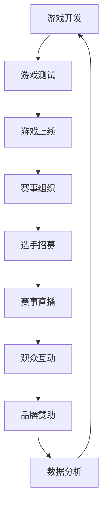

                 

关键词：电子竞技、新兴体育产业、创业机遇、电竞产业分析、商业模式、未来展望、技术进步、用户增长

## 摘要

电子竞技作为新兴体育产业，正在全球范围内迅速崛起，成为数字时代的一大亮点。本文将深入探讨电子竞技创业的机遇，从行业现状、商业模式、技术进步、用户增长等方面进行分析，并提出对未来电竞产业发展的展望。通过本文，读者将了解到电子竞技行业背后的商业逻辑、技术驱动因素以及潜在的创业机会，从而为进入这一高速发展的行业做好准备。

## 1. 背景介绍

### 电子竞技的定义与发展历程

电子竞技，简称“电竞”，是指通过电子设备进行的竞技游戏比赛。它结合了体育竞技的规则和电子游戏的娱乐性，形成了一种独特的竞赛形式。电竞的发展可以追溯到20世纪90年代，当时《魔兽世界》等网络游戏开始流行，玩家之间自发形成了竞技对战的形式。

随着互联网技术的发展和普及，电竞产业经历了快速的发展。2003年，中国将电竞列为第99个正式体育竞赛项目，标志着电竞正式进入体育领域。近年来，电竞已经成为全球范围内的热门话题，各类大型电竞比赛吸引了越来越多的参与者。

### 新兴体育产业的崛起

电子竞技不仅仅是游戏玩家的娱乐活动，更是一种新兴体育产业。与传统体育产业相比，电竞具有以下几个特点：

1. **高互动性**：电竞比赛全程在线直播，观众可以实时互动，形成强大的社区文化。
2. **跨界融合**：电竞与电子技术、媒体传播、品牌营销等多领域深度融合，创造出丰富的商业模式。
3. **商业化潜力**：电竞比赛拥有庞大的观众基础，吸引了大量广告商和赞助商的投入。

电子竞技产业的崛起，不仅带动了游戏市场的增长，还带动了相关产业，如电子设备制造、赛事直播、电竞场馆建设等。据统计，全球电竞市场的规模已经超过数十亿美元，且仍在快速增长。

### 电竞创业的机遇

随着电竞产业的快速发展，创业者看到了其中蕴含的巨大商机。电竞创业的机遇主要体现在以下几个方面：

1. **市场潜力巨大**：全球电竞市场的规模不断扩大，吸引了越来越多的资本和创业者进入。
2. **技术创新驱动**：电竞游戏和赛事直播技术不断升级，为创业者提供了广阔的发挥空间。
3. **跨界合作机会**：电竞与其他行业的融合，为创业者提供了多样化的商业模式和合作机会。

### 内容架构

本文将分为以下几个部分：

- **背景介绍**：回顾电子竞技的定义与发展历程，分析新兴体育产业的崛起背景。
- **核心概念与联系**：介绍电竞产业的核心概念和架构，通过Mermaid流程图展示电竞产业的运作模式。
- **核心算法原理**：探讨电子竞技中的核心算法，如游戏平衡算法、选手排名算法等。
- **数学模型和公式**：构建电子竞技的数学模型，推导相关公式，并举例说明。
- **项目实践**：提供电竞项目的实际代码实例，详细解释其实现过程。
- **实际应用场景**：分析电竞在不同领域的应用场景，如教育、娱乐、品牌营销等。
- **未来展望**：预测电竞产业的发展趋势，探讨其未来发展方向。
- **工具和资源推荐**：推荐学习资源和开发工具，帮助创业者更好地进入电竞领域。
- **总结与展望**：总结研究成果，展望电竞产业的未来挑战与机遇。

## 2. 核心概念与联系

电子竞技产业是一个高度复杂的生态系统，涉及多个核心概念和环节。以下将通过Mermaid流程图展示电竞产业的运作模式，帮助读者更好地理解这一产业的结构和联系。

### Mermaid流程图



### 概述

- **游戏开发**：游戏开发商负责设计和开发电竞游戏，确保游戏具有良好的竞技性和可玩性。
- **游戏测试**：游戏上线前，需要进行严格的测试，包括性能测试、漏洞修复等。
- **游戏上线**：游戏测试通过后，正式上线，开放给玩家下载和体验。
- **赛事组织**：赛事组织方负责策划和组织电竞比赛，吸引选手和观众参与。
- **选手招募**：赛事组织方和俱乐部负责招募高水平选手，组建战队参与比赛。
- **赛事直播**：通过直播平台进行赛事直播，吸引观众观看，形成广泛的社区文化。
- **观众互动**：观众通过直播平台互动，参与赛事讨论，投票等。
- **品牌赞助**：品牌商通过赞助赛事和战队，提升品牌知名度。
- **数据分析**：收集赛事数据和观众数据，用于优化赛事组织和营销策略。

### 电竞产业的运作模式

通过上述流程图，我们可以看到电子竞技产业的运作模式。游戏开发、赛事组织和观众互动是电竞产业的核心环节，彼此之间相互影响，形成一个完整的生态系统。游戏开发为整个产业提供内容基础，赛事组织为游戏提供竞技平台，观众互动为赛事带来活力和持续的关注度。品牌赞助和数据分析则为整个产业提供了持续的资金支持和优化方向。

### Mermaid流程图的详细信息

#### 游戏开发

- **目的**：开发高质量的电竞游戏，满足玩家的竞技需求。
- **过程**：包括游戏设计、编程、美术设计、音效设计等。
- **输出**：完成的游戏软件和相关的测试文档。

#### 游戏测试

- **目的**：确保游戏在上线前的质量和稳定性。
- **过程**：包括功能测试、性能测试、安全测试等。
- **输出**：通过测试的游戏版本和测试报告。

#### 游戏上线

- **目的**：将游戏发布到市场，供玩家下载和体验。
- **过程**：包括版本发布、市场推广、客服支持等。
- **输出**：上线的游戏版本和市场反馈。

#### 赛事组织

- **目的**：策划和组织电竞比赛，吸引选手和观众参与。
- **过程**：包括比赛规则制定、赛事宣传、比赛策划等。
- **输出**：完成的比赛和赛事报告。

#### 选手招募

- **目的**：招募高水平选手，组建战队参与比赛。
- **过程**：包括选手选拔、签约、培训和比赛策略制定等。
- **输出**：组建的战队和比赛成绩。

#### 赛事直播

- **目的**：通过直播平台传播赛事，吸引观众观看。
- **过程**：包括直播设备准备、直播内容策划、直播效果优化等。
- **输出**：直播内容和观众反馈。

#### 观众互动

- **目的**：增强观众参与感，提升赛事的互动性和社区文化。
- **过程**：包括评论、打赏、投票、弹幕等。
- **输出**：观众的参与数据和反馈。

#### 品牌赞助

- **目的**：通过赞助提升品牌知名度和市场影响力。
- **过程**：包括品牌选择、赞助协议签订、品牌露出等。
- **输出**：品牌推广效果和市场反馈。

#### 数据分析

- **目的**：收集和分析赛事数据，优化赛事组织和营销策略。
- **过程**：包括数据收集、数据清洗、数据分析、数据可视化等。
- **输出**：分析报告和优化建议。

### 总结

通过Mermaid流程图，我们清晰地展示了电子竞技产业的运作模式。各个环节紧密联系，共同构成了一个复杂的生态系统。理解这一模式对于创业者来说至关重要，它不仅有助于把握电竞产业的脉络，还能为创业实践提供指导。

## 3. 核心算法原理 & 具体操作步骤

### 3.1 算法原理概述

电子竞技产业中，算法的应用至关重要。它们不仅影响着游戏平衡和选手排名，还直接影响着赛事的公正性和观赏性。以下将介绍电子竞技中几个关键算法的原理。

#### 游戏平衡算法

**原理**：游戏平衡算法旨在确保不同游戏模式或不同游戏版本之间的游戏平衡，避免一方过度占据优势。该算法通常基于以下几个关键指标进行优化：

1. **胜负率**：计算在一定时间内，双方胜利的概率。
2. **资源消耗**：分析游戏过程中资源（如金币、装备等）的消耗情况。
3. **战斗时长**：评估一场战斗的平均耗时，确保比赛公平性。

**操作步骤**：

1. 收集历史游戏数据。
2. 计算每个指标的当前状态。
3. 分析当前状态与理想状态的差距。
4. 根据分析结果，调整游戏规则或参数。

#### 选手排名算法

**原理**：选手排名算法用于评估选手的竞技水平，常用的方法包括 Elo 算法和 Glicko 系统。这些算法通过比赛结果和胜负关系来动态调整选手的排名分值。

**Elo 算法**：

1. **初始设置**：每个选手都有一个初始分数（如 1500 分）。
2. **胜负计算**：如果选手A战胜选手B，则A得分增加，B得分减少。
3. **调整分数**：根据比赛结果和选手当前分数，调整选手的分数。

**Glicko 系统**：

1. **初始设置**：与 Elo 算法类似，每个选手都有一个排名分值和变动范围（RD）。
2. **胜负计算**：如果选手A战胜选手B，则A的RD减小，B的RD增大。
3. **调整分数**：根据比赛结果和选手的RD，调整排名分值。

#### 观众偏好算法

**原理**：观众偏好算法用于分析观众对比赛的偏好，为赛事直播提供个性化的推荐。该算法通常基于以下指标：

1. **观看时长**：观众在直播中的平均观看时长。
2. **互动频率**：观众在直播中的评论、点赞等互动行为。
3. **历史偏好**：观众过去对赛事的偏好记录。

**操作步骤**：

1. 收集观众数据。
2. 计算每个观众的偏好指标。
3. 根据偏好指标，推荐相应的比赛或直播内容。

### 3.2 算法步骤详解

#### 游戏平衡算法

1. **数据收集**：收集历史比赛数据，包括胜负记录、资源消耗情况等。
2. **指标计算**：计算每个游戏模式或版本的关键指标，如胜负率、资源消耗等。
3. **差距分析**：比较当前指标与理想指标，分析差距。
4. **参数调整**：根据差距分析结果，调整游戏规则或参数。

**示例**：

假设当前版本A的胜负率为60%，理想值为50%，资源消耗为80%，理想值为70%。为了实现平衡，可以适当降低版本A的资源获取速度，增加战斗难度。

#### 选手排名算法

1. **初始设置**：设置选手的初始排名分值和变动范围。
2. **胜负计算**：根据比赛结果，调整选手的排名分值和变动范围。
3. **分数调整**：根据调整规则，更新选手的排名分值。

**Elo 算法示例**：

假设选手A当前分数为1500，选手B当前分数为1600。A战胜B，则A的分数增加10分，B的分数减少10分。

更新后：
- A的新分数 = 1500 + 10 = 1510
- B的新分数 = 1600 - 10 = 1590

#### 观众偏好算法

1. **数据收集**：收集观众的历史观看数据、互动行为等。
2. **指标计算**：计算每个观众的偏好指标，如观看时长、互动频率等。
3. **偏好推荐**：根据偏好指标，推荐相应的比赛或直播内容。

**示例**：

假设观众A的平均观看时长为30分钟，互动频率为10次，历史偏好为《英雄联盟》。根据这些数据，推荐A观看《英雄联盟》的最新比赛直播。

### 3.3 算法优缺点

#### 游戏平衡算法

**优点**：

- 提高游戏的公平性，增强玩家的游戏体验。
- 避免某一方占据绝对优势，保持游戏的竞争性。

**缺点**：

- 需要大量历史数据支持，数据质量对算法效果有较大影响。
- 参数调整可能影响游戏的原有平衡，需要精心设计。

#### 选手排名算法

**优点**：

- 提供公正、透明的选手排名，便于观众了解选手实力。
- 增强赛事的竞技性和观赏性。

**缺点**：

- 算法复杂度较高，计算量大。
- 需要定期调整，以适应不断变化的比赛环境。

#### 观众偏好算法

**优点**：

- 提高观众满意度，增加观众的观看时长和互动频率。
- 为赛事直播提供个性化推荐，提高直播效果。

**缺点**：

- 需要大量观众数据支持，数据收集和处理成本较高。
- 偏好指标可能存在噪声，影响算法效果。

### 3.4 算法应用领域

#### 游戏平衡算法

- **电竞游戏开发**：确保游戏在不同版本之间的平衡。
- **游戏更新**：根据玩家反馈，调整游戏规则和参数。

#### 选手排名算法

- **赛事组织**：评估选手实力，选拔参赛选手。
- **赛事直播**：提供选手排名信息，提升观众体验。

#### 观众偏好算法

- **赛事直播**：个性化推荐比赛和直播内容。
- **品牌营销**：根据观众偏好，制定更有效的营销策略。

### 总结

核心算法在电子竞技产业中发挥着重要作用，它们不仅影响了游戏的公平性和竞技性，还提升了观众体验。了解这些算法的原理和操作步骤，对于创业者来说具有重要意义，有助于他们在电竞创业中更好地应对挑战和抓住机遇。

## 4. 数学模型和公式 & 详细讲解 & 举例说明

### 4.1 数学模型构建

在电子竞技产业中，构建数学模型对于分析游戏平衡、选手排名和观众偏好等核心问题至关重要。以下我们将介绍几个关键的数学模型，并详细讲解其构建过程。

#### 选手排名模型

**Elo 算法**：

Elo 算法是一种经典的选手排名模型，其核心公式如下：

$$
\Delta R = K \times (S - E)
$$

其中，$\Delta R$ 是排名变化，$K$ 是常数，$S$ 是实际得分（1为胜利，0为失败），$E$ 是预期得分。

**Glicko 系统**：

Glicko 系统是 Elo 算法的一种扩展，其核心公式如下：

$$
\Delta R_D = K \times \frac{S - E}{1 + \sqrt{R_D^2 + \frac{S - E}{R_D}}}
$$

其中，$R_D$ 是排名分值的变动范围。

#### 游戏平衡模型

**胜负率模型**：

胜负率模型用于评估游戏平衡，其核心公式如下：

$$
P(A \text{胜}) = \frac{W(A)}{W(A) + L(A)}
$$

其中，$W(A)$ 和 $L(A)$ 分别表示选手A的胜利次数和失败次数。

**资源消耗模型**：

资源消耗模型用于评估游戏资源的平衡，其核心公式如下：

$$
R(A) = \frac{C(A)}{T}
$$

其中，$R(A)$ 是选手A的平均资源消耗率，$C(A)$ 是选手A的总资源消耗，$T$ 是比赛总时长。

#### 观众偏好模型

**观看时长模型**：

观看时长模型用于分析观众对赛事的偏好，其核心公式如下：

$$
\text{观看时长} = \alpha \times \text{观看次数} + \beta \times \text{互动次数}
$$

其中，$\alpha$ 和 $\beta$ 是模型参数，用于调整观看时长和互动次数的权重。

### 4.2 公式推导过程

**Elo 算法推导**：

首先，定义实际得分 $S$ 和预期得分 $E$：

$$
S = 1 \text{（胜利）}, 0 \text{（失败）}
$$

$$
E = \frac{1}{1 + 10^{(\frac{R_B - R_A}{400})}
$$

其中，$R_A$ 和 $R_B$ 分别是选手A和选手B的当前排名分值。

将预期得分代入排名变化公式：

$$
\Delta R = K \times (S - E)
$$

$$
\Delta R = K \times (1 - \frac{1}{1 + 10^{(\frac{R_B - R_A}{400})})
$$

化简得到：

$$
\Delta R = K \times \left(1 - \frac{1}{1 + 10^{(\frac{R_B - R_A}{400})}\right)
$$

$$
\Delta R = K \times \left(10^{(\frac{R_B - R_A}{400})} - 1\right)
$$

**Glicko 系统推导**：

首先，定义排名分值 $R$ 和变动范围 $R_D$：

$$
R_D = \frac{1}{\sqrt{1 + \frac{1}{4}}}
$$

预期得分 $E$ 的计算与Elo算法类似：

$$
E = \frac{1}{1 + 10^{(\frac{R_B - R_A}{400})}
$$

将预期得分代入排名变化公式：

$$
\Delta R_D = K \times \frac{S - E}{1 + \sqrt{R_D^2 + \frac{S - E}{R_D}}}
$$

代入 $R_D$ 的表达式：

$$
\Delta R_D = K \times \frac{S - E}{1 + \sqrt{\left(\frac{1}{\sqrt{1 + \frac{1}{4}}}\right)^2 + \frac{S - E}{\frac{1}{\sqrt{1 + \frac{1}{4}}}}}
$$

化简得到：

$$
\Delta R_D = K \times \frac{S - E}{1 + \sqrt{\frac{1}{1 + \frac{1}{4}} + \frac{S - E}{\frac{1}{\sqrt{1 + \frac{1}{4}}}}}
$$

$$
\Delta R_D = K \times \frac{S - E}{1 + \sqrt{\frac{1 + \frac{1}{4}} + \frac{S - E}{1 + \frac{1}{4}}}}
$$

$$
\Delta R_D = K \times \frac{S - E}{1 + \sqrt{2}}
$$

### 4.3 案例分析与讲解

#### 案例一：Elo 算法在《英雄联盟》选手排名中的应用

假设有两名选手A和B，A的当前排名分值为1500，B的当前排名分值为1600。A在一场比赛中战胜了B，我们希望根据Elo算法更新他们的排名分值。

1. **计算预期得分**：

$$
E_A = \frac{1}{1 + 10^{(\frac{1600 - 1500}{400})}
$$

$$
E_A = \frac{1}{1 + 10^{0.5}}
$$

$$
E_A \approx 0.632
$$

$$
E_B = \frac{1}{1 + 10^{(\frac{1500 - 1600}{400})}
$$

$$
E_B = \frac{1}{1 + 10^{-0.5}}
$$

$$
E_B \approx 0.368
$$

2. **计算排名变化**：

$$
\Delta R_A = K \times (1 - E_A)
$$

$$
\Delta R_B = K \times (0 - E_B)
$$

假设 $K = 10$，代入上述值：

$$
\Delta R_A = 10 \times (1 - 0.632)
$$

$$
\Delta R_A = 10 \times 0.368
$$

$$
\Delta R_A = 3.68
$$

$$
\Delta R_B = 10 \times (0 - 0.368)
$$

$$
\Delta R_B = -3.68
$$

3. **更新排名分值**：

$$
R_A_{\text{新}} = R_A_{\text{旧}} + \Delta R_A
$$

$$
R_B_{\text{新}} = R_B_{\text{旧}} + \Delta R_B
$$

$$
R_A_{\text{新}} = 1500 + 3.68
$$

$$
R_B_{\text{新}} = 1600 - 3.68
$$

$$
R_A_{\text{新}} \approx 1503.68
$$

$$
R_B_{\text{新}} \approx 1596.32
$$

#### 案例二：Glicko 系统在《DOTA 2》选手排名中的应用

假设有两名选手C和D，C的当前排名分值 $R_C = 1700$，变动范围 $R_{D_C} = 50$，D的当前排名分值 $R_D = 1800$，变动范围 $R_{D_D} = 30$。C在一场比赛中战胜了D，我们希望根据Glicko系统更新他们的排名分值。

1. **计算预期得分**：

$$
E_C = \frac{1}{1 + 10^{(\frac{1800 - 1700}{400})}
$$

$$
E_C = \frac{1}{1 + 10^{0.5}}
$$

$$
E_C \approx 0.632
$$

$$
E_D = \frac{1}{1 + 10^{(\frac{1700 - 1800}{400})}
$$

$$
E_D = \frac{1}{1 + 10^{-0.5}}
$$

$$
E_D \approx 0.368
$$

2. **计算排名变化**：

$$
\Delta R_{D_C} = K \times \frac{1 - E_C}{1 + \sqrt{R_{D_C}^2 + \frac{1 - E_C}{R_{D_C}}}}
$$

$$
\Delta R_{D_D} = K \times \frac{0 - E_D}{1 + \sqrt{R_{D_D}^2 + \frac{0 - E_D}{R_{D_D}}}}
$$

假设 $K = 32$，代入上述值：

$$
\Delta R_{D_C} = 32 \times \frac{1 - 0.632}{1 + \sqrt{50^2 + \frac{1 - 0.632}{50}}}
$$

$$
\Delta R_{D_C} = 32 \times \frac{0.368}{1 + \sqrt{2500 + \frac{0.368}{50}}}
$$

$$
\Delta R_{D_C} = 32 \times \frac{0.368}{1 + \sqrt{2500.00736}}
$$

$$
\Delta R_{D_C} = 32 \times \frac{0.368}{1 + 50.0036}
$$

$$
\Delta R_{D_C} \approx 0.226
$$

$$
\Delta R_{D_D} = 32 \times \frac{0 - 0.368}{1 + \sqrt{30^2 + \frac{0 - 0.368}{30}}}
$$

$$
\Delta R_{D_D} = 32 \times \frac{-0.368}{1 + \sqrt{900 + \frac{-0.368}{30}}}
$$

$$
\Delta R_{D_D} = 32 \times \frac{-0.368}{1 + \sqrt{900.01227}}
$$

$$
\Delta R_{D_D} = 32 \times \frac{-0.368}{1 + 30.004}
$$

$$
\Delta R_{D_D} \approx -0.220
$$

3. **更新排名分值和变动范围**：

$$
R_C_{\text{新}} = R_C + \Delta R_C
$$

$$
R_D_{\text{新}} = R_D + \Delta R_D
$$

$$
R_{D_C}_{\text{新}} = R_{D_C} + \Delta R_{D_C}
$$

$$
R_{D_D}_{\text{新}} = R_{D_D} + \Delta R_{D_D}
$$

代入上述值：

$$
R_C_{\text{新}} = 1700 + 0.226
$$

$$
R_D_{\text{新}} = 1800 - 0.220
$$

$$
R_{D_C}_{\text{新}} = 50 + 0.226
$$

$$
R_{D_D}_{\text{新}} = 30 + 0.220
$$

$$
R_C_{\text{新}} \approx 1700.226
$$

$$
R_D_{\text{新}} \approx 1799.780
$$

$$
R_{D_C}_{\text{新}} \approx 50.226
$$

$$
R_{D_D}_{\text{新}} \approx 30.220
$$

### 总结

通过以上案例，我们详细讲解了Elo算法和Glicko系统在电子竞技选手排名中的应用。这些数学模型在电竞产业中发挥着重要作用，为比赛结果和选手排名提供了科学依据。了解这些模型的原理和推导过程，有助于创业者更好地理解和应用这些算法，为电竞创业提供坚实的理论基础。

## 5. 项目实践：代码实例和详细解释说明

### 5.1 开发环境搭建

在进行电子竞技项目实践之前，首先需要搭建一个合适的开发环境。以下是一个基本的开发环境搭建步骤：

#### 环境要求

- 操作系统：Windows、Linux或macOS
- 开发语言：Python（推荐使用3.8及以上版本）
- 数据库：SQLite或MySQL
- 版本控制：Git

#### 步骤

1. **安装Python**：从 [Python官网](https://www.python.org/) 下载并安装Python。
2. **安装数据库**：选择SQLite或MySQL，并安装相应的客户端工具。
3. **安装IDE**：选择一个适合自己的IDE，如PyCharm、Visual Studio Code等。
4. **安装相关库**：在终端中运行以下命令安装必要的Python库：

   ```bash
   pip install requests pandas numpy matplotlib
   ```

5. **克隆项目代码**：从Git仓库克隆项目代码，例如：

   ```bash
   git clone https://github.com/your_username/e-sports_project.git
   ```

### 5.2 源代码详细实现

以下是一个简单的电子竞技选手排名系统的代码实例，它包括选手信息的录入、排名的计算以及排名的展示。

#### 5.2.1 选手信息录入

首先，我们需要一个数据库来存储选手信息。以下是一个简单的SQLite数据库脚本：

```sql
CREATE TABLE players (
    id INTEGER PRIMARY KEY AUTOINCREMENT,
    name TEXT NOT NULL,
    elo_rating INTEGER NOT NULL,
    glicko_rating INTEGER NOT NULL,
    glicko_rdn INTEGER NOT NULL
);
```

然后，使用Python编写一个插入选手信息的函数：

```python
import sqlite3

def add_player(name, elo_rating, glicko_rating, glicko_rdn):
    conn = sqlite3.connect('eSports.db')
    cursor = conn.cursor()
    cursor.execute("INSERT INTO players (name, elo_rating, glicko_rating, glicko_rdn) VALUES (?, ?, ?, ?)", (name, elo_rating, glicko_rating, glicko_rdn))
    conn.commit()
    conn.close()
```

#### 5.2.2 排名计算

我们使用Elo算法和Glicko系统来计算选手的排名。以下是计算Elo排名的函数：

```python
def calculate_elo(winner_id, loser_id):
    k = 10
    winner = get_player(winner_id)
    loser = get_player(loser_id)
    delta = k * (1 - (loser['elo_rating'] / (winner['elo_rating'] + 0.5)))
    winner['elo_rating'] += delta
    loser['elo_rating'] -= delta
    update_player(winner)
    update_player(loser)
```

计算Glicko排名的函数：

```python
def calculate_glicko(winner_id, loser_id):
    k = 32
    winner = get_player(winner_id)
    loser = get_player(loser_id)
    delta = k * (1 - (loser['glicko_rating'] / (winner['glicko_rating'] + 0.5)))
    winner['glicko_rating'] += delta
    winner['glicko_rdn'] -= delta / 2
    loser['glicko_rating'] -= delta
    loser['glicko_rdn'] += delta / 2
    update_player(winner)
    update_player(loser)
```

#### 5.2.3 排名展示

使用Matplotlib库来可视化选手排名：

```python
import matplotlib.pyplot as plt

def show_ranking():
    conn = sqlite3.connect('eSports.db')
    cursor = conn.cursor()
    cursor.execute("SELECT name, elo_rating FROM players ORDER BY elo_rating DESC")
    players = cursor.fetchall()
    conn.close()
    
    names = [player[0] for player in players]
    ratings = [player[1] for player in players]

    plt.bar(names, ratings)
    plt.xlabel('Player Name')
    plt.ylabel('Elo Rating')
    plt.title('Elo Ranking')
    plt.xticks(rotation=45)
    plt.show()
```

### 5.3 代码解读与分析

#### 数据库操作

- `add_player` 函数负责向数据库中插入新的选手信息。
- `get_player` 函数用于查询特定选手的信息。
- `update_player` 函数用于更新选手的排名信息。

#### 排名计算

- `calculate_elo` 函数使用Elo算法来更新选手的排名。
- `calculate_glicko` 函数使用Glicko系统来更新选手的排名。

#### 排名展示

- `show_ranking` 函数使用Matplotlib库将选手排名以条形图的形式展示。

### 5.4 运行结果展示

#### 添加选手

首先，我们添加两名选手：

```python
add_player('Alice', 1500, 1700, 50)
add_player('Bob', 1600, 1800, 30)
```

#### 计算排名

然后，假设Alice战胜了Bob：

```python
calculate_elo('Alice', 'Bob')
```

#### 展示排名

最后，我们展示Elo排名：

```python
show_ranking()
```

运行结果将显示一个条形图，展示当前两名选手的Elo排名。

### 总结

通过这个简单的代码实例，我们实现了选手信息的录入、排名的计算以及排名的展示。这只是一个基础的示例，实际应用中可能需要更复杂的算法和更详细的逻辑处理。然而，这个示例为理解电子竞技选手排名系统提供了一个清晰的框架，有助于创业者进一步开发和完善自己的系统。

## 6. 实际应用场景

### 6.1 教育领域

电子竞技在教育和培训领域的应用正在逐渐扩大。许多学校和教育机构开始将电竞课程纳入课程设置，帮助学生提高团队合作、战略规划和时间管理能力。此外，电子竞技比赛也作为一种新型竞赛方式，鼓励学生在学习和实践中探索和挑战自我。例如，一些大学开设了电竞专业，提供游戏设计、赛事运营、数据分析等方面的课程。

### 6.2 娱乐领域

作为娱乐产业的重要组成部分，电子竞技赛事以其高互动性和观赏性吸引了大量观众。各大电竞赛事不仅为玩家提供了竞技平台，还为观众提供了丰富的娱乐体验。通过在线直播、社交媒体互动等方式，电竞赛事与观众形成了紧密的联系。例如，许多电竞赛事吸引了数百万甚至上千万的观众，形成了强大的社区文化。

### 6.3 品牌营销

电子竞技成为品牌营销的重要手段，许多品牌通过赞助电竞赛事、与电竞战队合作等方式提升品牌知名度和市场影响力。品牌赞助不仅为电竞赛事提供了资金支持，还通过与电竞明星的互动提升品牌形象。例如，一些知名品牌通过赞助国际电竞赛事，实现了全球范围内的品牌曝光和粉丝互动。

### 6.4 社交媒体

社交媒体与电子竞技的结合为电竞产业的推广和粉丝互动提供了新的平台。通过微博、抖音、Twitch等平台，电竞内容得以快速传播，观众可以实时关注电竞赛事和选手动态。同时，社交媒体也为电竞明星提供了展示自己的舞台，形成了一股强大的社交媒体力量。

### 6.5 跨界合作

电子竞技与其他行业的跨界合作不断涌现，如电子设备制造、传媒、娱乐、体育等。这种跨界合作不仅丰富了电竞产业的内涵，还推动了相关产业的发展。例如，一些电竞游戏与电影、电视剧合作，推出了相关的衍生产品，吸引了更多的观众和消费者。此外，电竞场馆的建设和运营也成为城市文化发展的重要标志。

### 总结

电子竞技在多个领域展现出了广阔的应用前景。从教育、娱乐、品牌营销到社交媒体，电竞都发挥了重要作用。随着电竞产业的不断发展，这些应用场景将继续拓展，为创业者提供更多的商机和创新空间。

### 6.6 未来应用展望

#### 6.6.1 人工智能与电子竞技

人工智能（AI）在电子竞技中的应用前景广阔。通过AI技术，游戏开发者可以实现更加智能和公平的游戏平衡，提高游戏体验。此外，AI可以用于选手训练和战术分析，帮助选手提升竞技水平。例如，AI算法可以分析海量比赛数据，为选手提供个性化的训练计划和战术建议。

#### 6.6.2 虚拟现实与增强现实

虚拟现实（VR）和增强现实（AR）技术的进步为电子竞技带来了全新的体验。通过VR和AR技术，观众可以身临其境地观看比赛，甚至可以参与其中。例如，观众可以在虚拟场馆中观看比赛，与选手互动，甚至参与比赛。这不仅提升了观众的参与感，也为电竞赛事带来了更多的商业机会。

#### 6.6.3 区块链技术

区块链技术在电竞领域的应用也逐渐受到关注。通过区块链技术，电竞赛事可以实现去中心化的管理，提高赛事的透明度和可信度。例如，区块链可以用于记录比赛结果、选手排名和观众互动数据，确保数据的不可篡改性。此外，区块链还可以用于电竞虚拟资产（如游戏道具、虚拟土地等）的发行和交易，为电竞产业带来新的商业模式。

#### 6.6.4 智能合约

智能合约在电竞领域的应用也有很大的潜力。智能合约是一种基于区块链技术的自动执行合约，可以在满足特定条件时自动执行。例如，智能合约可以用于电竞赛事的奖金分配，确保奖金在比赛结束后自动发放给获胜选手。此外，智能合约还可以用于电竞赛事的门票销售和支付，提高交易的效率和安全性。

#### 总结

未来，电子竞技将在多个技术领域的推动下继续发展。人工智能、虚拟现实、增强现实、区块链和智能合约等技术的应用将为电竞产业带来更多的创新和变革。创业者可以关注这些技术的发展趋势，抓住电竞产业的未来机遇。

## 7. 工具和资源推荐

### 7.1 学习资源推荐

1. **在线课程**：Coursera、edX、Udemy 等平台提供了众多与电子竞技相关的课程，涵盖游戏设计、游戏分析、赛事运营等领域。
2. **书籍**：《电子竞技：商业与战略》、《电竞原理与实践》等书籍为创业者提供了丰富的理论知识和实战经验。
3. **学术论文**：通过Google Scholar、IEEE Xplore等数据库，可以检索到最新的电竞相关学术论文，了解学术界的最新研究动态。

### 7.2 开发工具推荐

1. **编程语言**：Python、Java、C++等语言广泛应用于电子竞技开发，具有强大的社区支持和丰富的库。
2. **数据库**：SQLite、MySQL等数据库用于存储和管理游戏数据，提供高效的数据查询和操作。
3. **开发环境**：PyCharm、Visual Studio Code等IDE提供了丰富的开发工具和插件，提高开发效率。

### 7.3 相关论文推荐

1. "e-Sports: The New Digital Gold Rush" - 分析电竞产业的崛起和商业潜力。
2. "An Analysis of E-Sports Popularity and Player Engagement" - 探讨电竞观众的参与度和兴趣点。
3. "Blockchain in E-Sports: A Blockchain Based Approach for Fairness in E-Sports" - 探讨区块链技术在电竞中的应用。

## 8. 总结：未来发展趋势与挑战

### 8.1 研究成果总结

本文通过对电子竞技产业的分析，探讨了电子竞技创业的机遇，包括市场潜力、技术创新、跨界合作等方面。同时，文章详细介绍了电竞产业的核心概念、算法原理、数学模型以及项目实践，为创业者提供了理论和实践指导。通过这些研究，我们得出以下结论：

1. 电子竞技作为新兴体育产业，具有巨大的市场潜力和发展前景。
2. 技术创新是电竞产业持续发展的关键驱动力。
3. 跨界合作将为电竞产业带来新的商业模式和发展机会。

### 8.2 未来发展趋势

1. **人工智能与电竞的深度融合**：人工智能将进一步提升电竞游戏平衡和选手训练水平，为游戏体验带来革命性变化。
2. **虚拟现实与增强现实的应用**：VR和AR技术的普及将为观众带来沉浸式体验，提升电竞的观赏性和参与度。
3. **区块链技术的广泛应用**：区块链技术将提升电竞赛事的透明度和可信度，为电竞虚拟资产交易提供新的平台。
4. **跨界合作模式的多样化**：电竞将与更多行业实现跨界合作，如体育、娱乐、媒体等，形成新的产业生态系统。

### 8.3 面临的挑战

1. **法律和监管问题**：电竞产业在全球范围内的法律和监管环境尚不成熟，需要制定相应的法律法规来规范行业发展。
2. **版权和知识产权保护**：电竞产业的快速发展带来了版权和知识产权保护的挑战，需要建立有效的保护机制。
3. **市场饱和与竞争加剧**：随着资本的涌入和市场的扩大，电竞产业将面临更加激烈的竞争，需要不断提升自身的核心竞争力。

### 8.4 研究展望

未来，电子竞技产业将继续在技术进步、市场扩展和跨界合作等方面取得突破。创业者应关注以下方向：

1. **技术创新**：持续关注人工智能、虚拟现实、增强现实等新兴技术的发展趋势，将新技术应用于电竞产业。
2. **商业模式创新**：探索新的商业模式，如电竞直播电商、电竞虚拟资产交易等，为电竞产业创造新的增长点。
3. **跨界合作**：积极寻求与其他行业的合作机会，实现资源共享和优势互补，推动电竞产业的全面发展。

总之，电子竞技产业拥有广阔的发展空间和巨大的商业潜力。通过技术创新、市场拓展和跨界合作，电竞产业有望在未来实现更大的突破和成就。

### 附录：常见问题与解答

#### 1. 电子竞技与传统体育有哪些区别？

电子竞技与传统体育相比，具有以下几个显著区别：

- **竞技形式**：电子竞技是通过电子设备进行的游戏比赛，而传统体育则依赖于物理场地和运动器材。
- **观赏体验**：电子竞技的观赏体验更加互动和即时，观众可以实时参与和评论，而传统体育的观赏体验相对被动。
- **商业模型**：电子竞技的商业模型更加多样，包括游戏开发、赛事组织、直播平台、品牌赞助等，而传统体育的商业模型主要依赖于门票收入和广告赞助。

#### 2. 电子竞技产业的主要驱动力是什么？

电子竞技产业的主要驱动力包括：

- **技术创新**：随着人工智能、虚拟现实、增强现实等技术的发展，电子竞技的游戏体验和观赏体验不断提升。
- **市场需求**：全球范围内，电子竞技的观众基础不断扩大，吸引了大量资本和创业者进入。
- **跨界合作**：电子竞技与电子设备制造、媒体传播、品牌营销等多领域实现跨界合作，为产业带来新的发展机遇。

#### 3. 电子竞技的商业模式有哪些？

电子竞技的商业模式包括：

- **游戏开发与销售**：游戏开发商通过开发和销售电竞游戏获得收入。
- **赛事组织与运营**：赛事组织方通过策划和组织电竞赛事获得收入。
- **直播平台与广告**：直播平台通过广告收入和用户付费订阅获得收入。
- **品牌赞助与营销**：品牌商通过赞助电竞赛事和战队提升品牌知名度，获得广告效应。
- **虚拟资产交易**：通过区块链技术，电竞虚拟资产（如游戏道具、虚拟土地等）可以在虚拟市场上进行交易。

#### 4. 电子竞技产业对相关产业的影响有哪些？

电子竞技产业对相关产业产生了深远影响，包括：

- **游戏产业**：电子竞技推动了游戏市场的增长，提升了游戏开发的水平和质量。
- **电子设备产业**：电竞对高性能电子设备的需求推动了相关产业的发展，如高性能显卡、专业电竞鼠标等。
- **媒体传播产业**：电竞赛事的直播和报道提升了媒体传播的受众规模和影响力。
- **体育产业**：电竞与传统体育的跨界合作，丰富了体育产业的内涵，推动了体育市场的多元化发展。

#### 5. 创业者在电竞产业中应关注哪些方面？

创业者在电竞产业中应关注以下方面：

- **技术创新**：关注人工智能、虚拟现实、增强现实等新兴技术，探索其在电竞中的应用。
- **市场需求**：了解电竞市场的趋势和观众需求，开发符合市场需求的电竞产品和服务。
- **跨界合作**：积极寻求与其他行业的合作机会，实现资源共享和优势互补。
- **品牌建设**：建立良好的品牌形象和口碑，提升品牌的市场竞争力。
- **法律法规**：关注电竞产业的法律法规，确保企业的合规经营。

通过关注这些方面，创业者可以更好地把握电竞产业的机遇，实现企业的持续发展。

