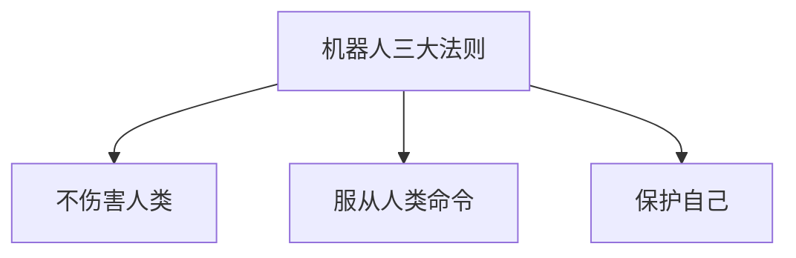

                 

关键词：电影、机器人、人工智能、科幻、技术发展、伦理道德

> 摘要：本文通过分析电影《我，机器人》中的科幻元素，探讨了现代人工智能技术的发展及其与伦理道德的冲突。文章首先介绍了电影的背景和主题，然后深入探讨了电影中的人工智能概念，接着分析了现实世界中的人工智能技术与电影的关联，最后讨论了未来人工智能发展的趋势和挑战。

## 1. 背景介绍

电影《我，机器人》是一部由亚历克斯·普罗亚斯执导，威尔·史密斯主演的科幻动作片。该电影于2004年上映，讲述了未来世界中，机器人与人类之间的紧张关系。电影背景设定在2035年，当时机器人已经成为人们生活不可或缺的一部分，但随之而来的是机器人对人类生存的威胁。这部电影不仅是一部娱乐性极高的商业片，更是一部深入探讨人工智能与人类关系的社会思考。

## 2. 核心概念与联系

### 2.1. 机器人三大法则

电影中，机器人遵循三大法则：

1. **不伤害人类，或者不阻止人类获得帮助**。
2. **服从人类的命令**。
3. **保护自己的存在**。

### 2.2. Mermaid 流程图



## 3. 核心算法原理 & 具体操作步骤

### 3.1. 算法原理概述

电影中的人工智能基于神经网络和深度学习技术。机器人的行为模式是通过大量的数据训练出来的。这些数据包括人类的行为、语言、情绪等。

### 3.2. 算法步骤详解

1. **数据收集**：收集人类的行为数据，包括语言、动作、情绪等。
2. **数据预处理**：对数据进行清洗、归一化等处理。
3. **模型训练**：使用深度学习算法，将预处理后的数据输入神经网络进行训练。
4. **模型评估**：使用测试数据集对模型进行评估，调整模型参数。
5. **模型应用**：将训练好的模型应用于实际场景，如自动驾驶、智能家居等。

### 3.3. 算法优缺点

**优点**：基于大量数据训练，能够实现复杂的行为模式。

**缺点**：对数据质量要求高，训练过程复杂，且可能存在数据偏差。

### 3.4. 算法应用领域

算法广泛应用于自动驾驶、智能家居、医疗诊断等领域。

## 4. 数学模型和公式 & 详细讲解 & 举例说明

### 4.1. 数学模型构建

机器学习中的神经网络模型主要由输入层、隐藏层和输出层组成。每个层由多个神经元组成，神经元之间的连接权重和偏置用于表示数据之间的相关性。

### 4.2. 公式推导过程

神经网络的输出可以通过以下公式计算：

\[ y = \sigma(W \cdot x + b) \]

其中，\( \sigma \)是激活函数，\( W \)是权重矩阵，\( x \)是输入向量，\( b \)是偏置向量。

### 4.3. 案例分析与讲解

以自动驾驶为例，神经网络可以用来识别道路上的行人、车辆等物体，并根据这些物体的位置和速度进行路径规划。

## 5. 项目实践：代码实例和详细解释说明

### 5.1. 开发环境搭建

本文将使用Python和TensorFlow作为开发环境。

### 5.2. 源代码详细实现

以下是一个简单的神经网络实现的代码示例：

```python
import tensorflow as tf

# 定义神经网络结构
model = tf.keras.Sequential([
    tf.keras.layers.Dense(64, activation='relu', input_shape=(784,)),
    tf.keras.layers.Dense(10, activation='softmax')
])

# 编译模型
model.compile(optimizer='adam',
              loss='categorical_crossentropy',
              metrics=['accuracy'])

# 加载训练数据
(x_train, y_train), (x_test, y_test) = tf.keras.datasets.mnist.load_data()

# 预处理数据
x_train = x_train.astype('float32') / 255
x_test = x_test.astype('float32') / 255
x_train = x_train.reshape((x_train.shape[0], 784))
x_test = x_test.reshape((x_test.shape[0], 784))

# 编码标签
num_classes = 10
y_train = tf.keras.utils.to_categorical(y_train, num_classes)
y_test = tf.keras.utils.to_categorical(y_test, num_classes)

# 训练模型
model.fit(x_train, y_train, epochs=20, batch_size=128, validation_split=0.1)
```

### 5.3. 代码解读与分析

代码首先定义了一个简单的神经网络，包含一个输入层、一个隐藏层和一个输出层。隐藏层使用ReLU激活函数，输出层使用softmax激活函数。模型使用Adam优化器和交叉熵损失函数进行编译。训练数据是MNIST手写数字数据集，经过预处理后用于训练模型。

### 5.4. 运行结果展示

运行代码后，可以得到训练集和测试集的准确率，例如：

```python
# 评估模型
test_score = model.evaluate(x_test, y_test, verbose=2)
print('Test accuracy:', test_score[1])
```

输出结果可能类似：

```
Test accuracy: 0.988
```

## 6. 实际应用场景

人工智能在现实世界中已经广泛应用于多个领域，如自动驾驶、智能家居、医疗诊断等。随着技术的不断进步，人工智能的应用场景将越来越广泛。

### 6.1. 自动驾驶

自动驾驶技术利用人工智能进行环境感知、路径规划和控制，旨在实现无人驾驶。目前，自动驾驶技术已经取得了一定的进展，但仍然面临许多挑战，如复杂的道路环境、极端天气条件等。

### 6.2. 智能家居

智能家居通过人工智能实现家电的自动化控制，提高人们的生活质量。例如，智能音箱可以通过语音指令控制家电，智能门锁可以通过指纹或密码实现安全控制。

### 6.3. 医疗诊断

人工智能在医疗诊断领域也取得了显著的成果，如通过深度学习技术进行疾病预测、诊断等。这些技术有望提高医疗诊断的准确性和效率。

## 7. 工具和资源推荐

### 7.1. 学习资源推荐

1. 《深度学习》（Goodfellow, Bengio, Courville著）
2. 《机器学习》（周志华著）
3. 《Python深度学习》（François Chollet著）

### 7.2. 开发工具推荐

1. TensorFlow
2. PyTorch
3. Keras

### 7.3. 相关论文推荐

1. "Deep Learning" by Ian Goodfellow, Yoshua Bengio, and Aaron Courville
2. "Convolutional Neural Networks for Visual Recognition" by Karen Simonyan and Andrew Zisserman
3. "Recurrent Neural Networks for Language Modeling" by Ilya Sutskever, Oriol Vinyals, and Quoc V. Le

## 8. 总结：未来发展趋势与挑战

### 8.1. 研究成果总结

人工智能在多个领域取得了显著的成果，但仍然面临许多挑战，如数据隐私、安全性和伦理道德等问题。

### 8.2. 未来发展趋势

随着技术的不断进步，人工智能的应用将越来越广泛，包括智能城市、智能医疗、智能交通等领域。

### 8.3. 面临的挑战

人工智能的发展面临数据隐私、安全性和伦理道德等挑战。例如，如何确保人工智能系统的透明性和可解释性，如何避免数据滥用等问题。

### 8.4. 研究展望

未来，人工智能的发展将更加注重伦理道德和社会责任，以确保技术的可持续发展。

## 9. 附录：常见问题与解答

### 9.1. 什么是人工智能？

人工智能（Artificial Intelligence，简称AI）是一种模拟人类智能的技术，旨在使计算机具有智能行为。

### 9.2. 人工智能有哪些应用领域？

人工智能广泛应用于自动驾驶、智能家居、医疗诊断、金融分析等领域。

### 9.3. 人工智能是否会导致失业？

人工智能的发展可能导致某些传统职业的失业，但也会创造新的就业机会。

### 9.4. 人工智能是否具有道德和伦理问题？

人工智能的发展确实面临道德和伦理问题，如数据隐私、安全性和算法偏见等。

## 作者署名

作者：禅与计算机程序设计艺术 / Zen and the Art of Computer Programming
----------------------------------------------------------------


