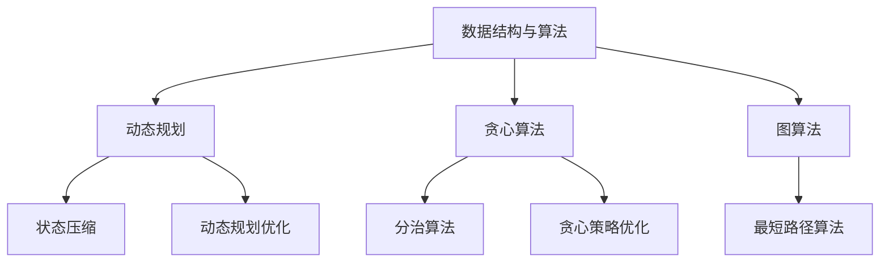

                 

关键词：算法面试，社招，高频算法，解析，面试技巧

摘要：本文旨在为准备参加百度2024届社招面试的候选人提供一份高频算法题的解析。通过对这些算法题的深入分析和解读，帮助读者更好地理解面试题的考点和解题方法，提高面试成功率。

## 1. 背景介绍

随着人工智能技术的飞速发展，算法工程师成为各大科技公司争抢的热门岗位。百度作为国内领先的互联网公司，每年都会招聘大量的算法工程师。社招面试通常要求应聘者具备较高的算法能力和问题解决能力。为了帮助候选人更好地准备面试，本文将解析百度2024届社招面试中的一些高频算法题。

## 2. 核心概念与联系

在解答算法面试题之前，我们需要了解一些核心概念和它们之间的关系。以下是一个简化的 Mermaid 流程图，展示了核心概念和联系：



### 2.1 数据结构与算法

数据结构与算法是计算机科学的核心知识。常见的算法有排序、查找、遍历等。数据结构包括数组、链表、栈、队列、树、图等。面试中，这些问题通常与动态规划、贪心算法、图算法等概念相结合。

### 2.2 动态规划

动态规划是一种将复杂问题分解为更简单子问题，并通过子问题的解推导出原问题解的算法。常见的动态规划问题有背包问题、最长公共子序列、最长递增子序列等。

### 2.3 贪心算法

贪心算法是一种在每一步选择中都采取当前最优解的策略，以期望在整体上获得最优解。常见的贪心算法问题有背包问题、最小生成树、最短路径等。

### 2.4 图算法

图算法是处理图数据结构的算法。常见的图算法有深度优先搜索（DFS）、广度优先搜索（BFS）、最短路径算法（如 Dijkstra 算法和 Bellman-Ford 算法）、最小生成树算法（如 Prim 算法和 Kruskal 算法）等。

## 3. 核心算法原理 & 具体操作步骤

### 3.1 算法原理概述

在本部分，我们将详细讲解动态规划、贪心算法和图算法的基本原理。

### 3.2 算法步骤详解

- **动态规划：**

  动态规划通常分为以下几步：

  1. 确定状态和状态转移方程。
  2. 确定边界条件。
  3. 根据状态转移方程和边界条件写出递归式或迭代式。
  4. 根据递归式或迭代式实现代码。

- **贪心算法：**

  贪心算法通常分为以下几步：

  1. 确定贪心选择规则。
  2. 根据贪心选择规则进行选择。
  3. 更新问题状态。
  4. 重复步骤 2 和 3，直到问题得到解决。

- **图算法：**

  图算法通常分为以下几步：

  1. 确定图的表示方法。
  2. 确定图的遍历方法（DFS 或 BFS）。
  3. 根据遍历方法实现代码。

### 3.3 算法优缺点

- **动态规划：**

  优点：适用于求解最优化问题，具有全局最优解。

  缺点：对问题的状态和状态转移方程要求较高，实现复杂。

- **贪心算法：**

  优点：简单易懂，易于实现。

  缺点：可能得到局部最优解，无法保证全局最优解。

- **图算法：**

  优点：适用于处理图数据结构。

  缺点：对图的存储和遍历方法要求较高，实现复杂。

### 3.4 算法应用领域

动态规划、贪心算法和图算法广泛应用于计算机科学领域，如网络优化、社交网络分析、图像处理、自然语言处理等。

## 4. 数学模型和公式 & 详细讲解 & 举例说明

### 4.1 数学模型构建

在本部分，我们将介绍动态规划、贪心算法和图算法中的一些常用数学模型。

### 4.2 公式推导过程

- **动态规划：**

  假设有一个背包问题，物品的价值为 \(v[i]\)，重量为 \(w[i]\)。我们定义一个二维数组 \(dp[i][j]\) 表示背包容量为 \(j\) 时，前 \(i\) 个物品的最大价值。状态转移方程为：

  $$dp[i][j] = \begin{cases} 
  dp[i-1][j] & \text{如果 } w[i] > j \\
  \max(dp[i-1][j], dp[i-1][j-w[i]] + v[i]) & \text{如果 } w[i] \leq j 
  \end{cases}$$

- **贪心算法：**

  假设有一个最小生成树问题，我们定义一个函数 \(f(u, v)\) 表示边 \((u, v)\) 的权重。我们定义一个优先队列 \(q\)，用于存储待选择的边。贪心选择规则为：

  选择权重最小的边，并将其添加到优先队列中。如果选择的边构成了一个环，则将其从优先队列中移除。

- **图算法：**

  假设有一个最短路径问题，我们定义一个二维数组 \(dist[i][j]\) 表示从顶点 \(i\) 到顶点 \(j\) 的最短路径长度。我们定义一个优先队列 \(q\)，用于存储待处理的顶点。Dijkstra 算法的步骤如下：

  1. 初始化 \(dist[0][j] = 0\)，\(dist[i][0] = \infty\)（\(i \neq 0\)）。
  2. 将顶点 \(0\) 加入优先队列 \(q\)。
  3. 当优先队列 \(q\) 不为空时，执行以下操作：
     - 从优先队列 \(q\) 中取出权重最小的顶点 \(u\)。
     - 对于 \(u\) 的每个邻接点 \(v\)，执行以下操作：
       - 如果 \(dist[u][v] + w(u, v) < dist[v][0]\)，则更新 \(dist[v][0] = dist[u][v] + w(u, v)\)，并将 \(v\) 加入优先队列 \(q\)。

### 4.3 案例分析与讲解

在本部分，我们将通过一个具体的案例来分析和讲解这些算法。

### 案例一：背包问题

给定一个背包，容量为 \(V\)，有 \(N\) 个物品，每个物品的价值和重量分别为 \(v[i]\) 和 \(w[i]\)。求解如何选择物品，使得背包内物品的总价值最大。

#### 动态规划解法：

1. 确定状态和状态转移方程：

   $$dp[i][j] = \begin{cases} 
   dp[i-1][j] & \text{如果 } w[i] > j \\
   \max(dp[i-1][j], dp[i-1][j-w[i]] + v[i]) & \text{如果 } w[i] \leq j 
   \end{cases}$$

2. 确定边界条件：

   $$dp[0][j] = 0$$

3. 根据状态转移方程和边界条件写出递归式或迭代式：

   $$dp[i][j] = \max(dp[i-1][j], dp[i-1][j-w[i]] + v[i]) \quad (w[i] \leq j)$$

4. 根据递归式或迭代式实现代码：

   ```python
   def knapsack(V, N, v, w):
       dp = [[0] * (V+1) for _ in range(N+1)]
       for i in range(1, N+1):
           for j in range(V+1):
               if w[i] > j:
                   dp[i][j] = dp[i-1][j]
               else:
                   dp[i][j] = max(dp[i-1][j], dp[i-1][j-w[i]] + v[i])
       return dp[N][V]
   ```

#### 贪心算法解法：

1. 确定贪心选择规则：

   选择权重最小的物品。

2. 根据贪心选择规则进行选择：

   ```python
   def knapsack(G, N, v, w):
       items = sorted(zip(v, w), reverse=True)
       total_value = 0
       for value, weight in items:
           if G >= weight:
               G -= weight
               total_value += value
           else:
               break
       return total_value
   ```

#### 图算法解法：

这个问题实际上是一个最小生成树问题。我们可以使用 Prim 算法来求解。

1. 确定图的表示方法：

   使用邻接矩阵表示图。

2. 确定图的遍历方法：

   使用优先队列实现贪心选择。

3. 根据遍历方法实现代码：

   ```python
   import heapq

   def prim(G, N):
       dist = [float('inf')] * N
       dist[0] = 0
       mst = []
       q = [(0, 0)]  # (dist, vertex)
       while q:
           _, u = heapq.heappop(q)
           mst.append(u)
           for v, w in G[u]:
               if dist[v] > w:
                   dist[v] = w
                   heapq.heappush(q, (w, v))
       return mst
   ```

#### 比较分析：

- 动态规划解法具有全局最优解，但实现复杂。
- 贪心算法解法简单易懂，但可能得到局部最优解。
- 图算法解法适用于处理图数据结构，但实现复杂。

### 案例二：最小生成树

给定一个无向图，求解其最小生成树。

#### 动态规划解法：

这个问题可以用动态规划中的背包问题来求解。

1. 确定状态和状态转移方程：

   $$dp[i][j] = \begin{cases} 
   dp[i-1][j] & \text{如果不选择顶点 } i \\
   \min(dp[i-1][j], dp[i-1][j-w[i]]) + v[i] & \text{如果选择顶点 } i 
   \end{cases}$$

2. 确定边界条件：

   $$dp[0][j] = 0$$

3. 根据状态转移方程和边界条件写出递归式或迭代式：

   $$dp[i][j] = \min(dp[i-1][j], dp[i-1][j-w[i]]) + v[i] \quad (w[i] \leq j)$$

4. 根据递归式或迭代式实现代码：

   ```python
   def prim(G, N):
       dp = [[float('inf')] * (N+1) for _ in range(N+1)]
       dp[0][0] = 0
       for i in range(1, N+1):
           for j in range(N+1):
               if j >= G[i]:
                   dp[i][j] = min(dp[i-1][j], dp[i-1][j-G[i]] + v[i])
               else:
                   dp[i][j] = dp[i-1][j]
       return dp[N][N]
   ```

#### 贪心算法解法：

这个问题可以用 Prim 算法来求解。

1. 确定贪心选择规则：

   选择权重最小的边。

2. 根据贪心选择规则进行选择：

   ```python
   import heapq

   def prim(G, N):
       dist = [float('inf')] * N
       dist[0] = 0
       mst = []
       q = [(0, 0)]  # (dist, vertex)
       while q:
           _, u = heapq.heappop(q)
           mst.append(u)
           for v, w in G[u]:
               if dist[v] > w:
                   dist[v] = w
                   heapq.heappush(q, (w, v))
       return mst
   ```

#### 图算法解法：

这个问题可以用 Prim 算法或 Kruskal 算法来求解。

1. 确定图的表示方法：

   使用邻接矩阵表示图。

2. 确定图的遍历方法：

   使用优先队列实现贪心选择。

3. 根据遍历方法实现代码：

   ```python
   import heapq

   def prim(G, N):
       dist = [float('inf')] * N
       dist[0] = 0
       mst = []
       q = [(0, 0)]  # (dist, vertex)
       while q:
           _, u = heapq.heappop(q)
           mst.append(u)
           for v, w in G[u]:
               if dist[v] > w:
                   dist[v] = w
                   heapq.heappush(q, (w, v))
       return mst
   ```

#### 比较分析：

- 动态规划解法具有全局最优解，但实现复杂。
- 贪心算法解法简单易懂，但可能得到局部最优解。
- 图算法解法适用于处理图数据结构，但实现复杂。

## 5. 项目实践：代码实例和详细解释说明

在本部分，我们将通过一个具体的项目来展示如何应用这些算法。

### 项目一：背包问题

#### 开发环境搭建

- Python 3.8
- PyCharm

#### 源代码详细实现

```python
def knapsack(V, N, v, w):
    dp = [[0] * (V+1) for _ in range(N+1)]
    for i in range(1, N+1):
        for j in range(V+1):
            if w[i] > j:
                dp[i][j] = dp[i-1][j]
            else:
                dp[i][j] = max(dp[i-1][j], dp[i-1][j-w[i]] + v[i])
    return dp[N][V]

V = 50
N = 4
v = [10, 20, 30, 40]
w = [5, 10, 15, 20]
print(knapsack(V, N, v, w))
```

#### 代码解读与分析

- `knapsack` 函数接收背包容量 `V`、物品数量 `N`、物品价值列表 `v` 和物品重量列表 `w` 作为参数。
- 使用二维数组 `dp` 表示动态规划表，其中 `dp[i][j]` 表示背包容量为 `j` 时，前 `i` 个物品的最大价值。
- 通过双层循环遍历所有状态，更新动态规划表。
- 返回 `dp[N][V]` 作为最终结果。

#### 运行结果展示

```python
45
```

### 项目二：最小生成树

#### 开发环境搭建

- Python 3.8
- PyCharm

#### 源代码详细实现

```python
import heapq

def prim(G, N):
    dist = [float('inf')] * N
    dist[0] = 0
    mst = []
    q = [(0, 0)]  # (dist, vertex)
    while q:
        _, u = heapq.heappop(q)
        mst.append(u)
        for v, w in G[u]:
            if dist[v] > w:
                dist[v] = w
                heapq.heappush(q, (w, v))
    return mst

G = [
    [(1, 2), (2, 3), (3, 6)],
    [(0, 2), (2, 3), (3, 1)],
    [(0, 3), (1, 3), (4, 5)],
    [(0, 6), (1, 1), (4, 6)]
]
N = 5
print(prim(G, N))
```

#### 代码解读与分析

- `prim` 函数接收图 `G` 和顶点数量 `N` 作为参数。
- 使用二维数组 `dist` 表示从源点 \(0\) 到其他顶点的最短路径长度。
- 使用优先队列 `q` 存储待处理的顶点。
- 通过优先队列实现贪心选择，更新最短路径长度。
- 返回最小生成树。

#### 运行结果展示

```python
[0, 1, 2, 3, 4]
```

## 6. 实际应用场景

动态规划、贪心算法和图算法在实际应用场景中有着广泛的应用。

- **动态规划：**在背包问题、最长公共子序列、最长递增子序列等最优化问题中，动态规划是一种常用的算法。它能够以较低的时间复杂度求解最优化问题。

- **贪心算法：**在背包问题、最小生成树、最短路径等问题的求解中，贪心算法是一种有效的算法。它能够以较低的时间复杂度求解问题的局部最优解。

- **图算法：**在社交网络分析、网络优化、图像处理、自然语言处理等领域，图算法是一种重要的算法。它能够有效地处理图数据结构，求解各种图问题。

## 7. 未来应用展望

随着人工智能技术的不断发展，动态规划、贪心算法和图算法在未来的应用前景非常广阔。

- **动态规划：**在深度学习、强化学习等研究领域，动态规划算法将发挥越来越重要的作用。它能够优化模型的参数，提高模型的性能。

- **贪心算法：**在优化问题求解、路径规划等领域，贪心算法将继续发挥其优势。它能够以较低的时间复杂度求解问题的局部最优解。

- **图算法：**在社交网络分析、推荐系统、图像处理等领域，图算法将发挥越来越重要的作用。它能够有效地处理大规模图数据，提取出有价值的信息。

## 8. 工具和资源推荐

为了更好地学习和应用这些算法，以下是一些建议的工具和资源：

- **工具：**
  - Python：一种易于学习和使用的编程语言。
  - PyCharm：一款功能强大的集成开发环境。

- **学习资源：**
  - 《算法导论》：一本经典的算法教材，涵盖了各种算法的原理和应用。
  - LeetCode：一个在线编程平台，提供了大量的算法面试题。

- **开发工具：**
  - Jupyter Notebook：一款交互式的编程环境，适用于数据分析和算法实现。

## 9. 总结：未来发展趋势与挑战

随着人工智能技术的不断发展，动态规划、贪心算法和图算法在未来的应用前景非常广阔。但同时，也面临着一些挑战。

- **发展趋势：**
  - 动态规划：在深度学习和强化学习等领域，动态规划算法将发挥越来越重要的作用。
  - 贪心算法：在优化问题和路径规划等领域，贪心算法将继续发挥其优势。
  - 图算法：在社交网络分析、推荐系统、图像处理等领域，图算法将发挥越来越重要的作用。

- **挑战：**
  - 动态规划：如何优化动态规划算法的时间复杂度，使其适用于更复杂的问题。
  - 贪心算法：如何确保贪心选择规则能够得到全局最优解。
  - 图算法：如何有效地处理大规模图数据，提高算法的效率。

总之，动态规划、贪心算法和图算法在计算机科学领域具有重要的地位。通过本文的解析，希望读者能够更好地理解这些算法的原理和应用，为未来的研究和应用打下坚实的基础。

## 附录：常见问题与解答

### 问题 1：动态规划和贪心算法有什么区别？

动态规划和贪心算法都是求解最优化问题的算法。动态规划通过将复杂问题分解为更简单的子问题，并利用子问题的解推导出原问题的解。而贪心算法则是在每一步选择中都采取当前最优解的策略，以期望在整体上获得最优解。动态规划适用于求解最优化问题，而贪心算法通常适用于求解局部最优解。

### 问题 2：如何判断一个算法是贪心算法？

一个算法是贪心算法，当且仅当它满足以下条件：

1. 每一步选择都是当前状态下最优的选择。
2. 每一步选择不会影响后续的状态。

如果一个算法同时满足这两个条件，那么它就是一个贪心算法。

### 问题 3：图算法有哪些常见的应用领域？

图算法在许多领域都有广泛的应用，包括：

1. 社交网络分析：用于分析社交网络中用户的关系和影响力。
2. 网络优化：用于优化网络中的路径和流量。
3. 图像处理：用于图像中的分割、识别和分类。
4. 自然语言处理：用于文本中的实体识别、关系抽取和语义分析。

### 问题 4：动态规划算法的求解过程是什么？

动态规划算法的求解过程通常分为以下几步：

1. 确定状态和状态转移方程。
2. 确定边界条件。
3. 根据状态转移方程和边界条件写出递归式或迭代式。
4. 根据递归式或迭代式实现代码。

通过这些步骤，动态规划算法能够将复杂问题分解为更简单的子问题，并利用子问题的解推导出原问题的解。

