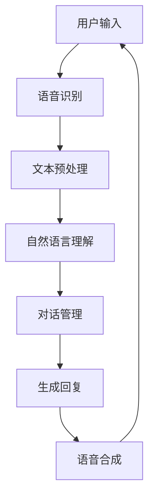

                 

关键词：智能音箱、多轮对话、NLP面试题、解析、人工智能

>摘要：本文旨在解析百度2024智能音箱多轮对话校招中的NLP面试题，帮助读者深入理解NLP在智能音箱中的应用，掌握面试技巧，提升应聘者对智能语音交互技术的理解和应用能力。

## 1. 背景介绍

随着人工智能技术的不断发展，智能音箱作为智能家居的重要组成部分，正在逐渐普及。智能音箱通过自然语言处理（NLP）技术，能够与用户进行多轮对话，实现语音交互、信息查询、娱乐互动等功能。因此，NLP技术在智能音箱中的应用具有重要意义。本文将针对百度2024智能音箱多轮对话校招中的NLP面试题进行详细解析，帮助读者深入了解NLP在智能音箱中的应用。

## 2. 核心概念与联系

在智能音箱中，NLP技术主要涉及以下核心概念：

### 2.1 词向量

词向量是将自然语言中的词汇转化为计算机可以处理的数字表示，常用的词向量模型有Word2Vec、GloVe等。

### 2.2 语音识别

语音识别是将用户的语音输入转化为文本的过程，通过深度学习模型实现，如DeepSpeech、FlySpeech等。

### 2.3 自然语言理解

自然语言理解是将文本转化为计算机可以理解的结构，涉及句法分析、语义分析等，常用的模型有BERT、GPT等。

### 2.4 对话管理

对话管理是指根据用户的输入和对话状态，生成合适的回复，涉及对话策略、对话状态追踪等。

下面是NLP在智能音箱中应用的Mermaid流程图：



## 3. 核心算法原理 & 具体操作步骤

### 3.1 算法原理概述

智能音箱中的NLP算法主要涉及语音识别、自然语言理解、对话管理和语音合成四个方面。以下分别介绍：

#### 3.1.1 语音识别

语音识别算法通过深度学习模型，将用户的语音输入转化为文本。以DeepSpeech为例，其核心原理是使用卷积神经网络（CNN）提取语音特征，然后使用递归神经网络（RNN）进行序列预测。

#### 3.1.2 自然语言理解

自然语言理解算法主要通过深度学习模型，对文本进行句法分析、语义分析等，以理解用户的意图。以BERT为例，其核心原理是使用Transformer模型进行预训练，然后在不同任务上进行微调。

#### 3.1.3 对话管理

对话管理算法根据用户的输入和对话状态，生成合适的回复。其核心原理是使用图神经网络（GNN）或循环神经网络（RNN）等模型，进行对话状态的追踪和策略学习。

#### 3.1.4 语音合成

语音合成算法将生成的文本转化为自然流畅的语音输出。以FlySpeech为例，其核心原理是使用循环神经网络（RNN）或深度神经网络（DNN）等模型，对文本进行声学建模和语调建模。

### 3.2 算法步骤详解

以一个简单的智能音箱为例，其NLP算法的具体步骤如下：

#### 3.2.1 语音识别

1. 用户发出语音指令。
2. 语音识别模型对语音信号进行预处理，提取语音特征。
3. 使用深度学习模型进行序列预测，得到对应的文本。

#### 3.2.2 自然语言理解

1. 对提取的文本进行分词、词性标注等预处理。
2. 使用预训练的深度学习模型，如BERT，进行语义分析。
3. 得到用户的意图和实体信息。

#### 3.2.3 对话管理

1. 根据用户的意图和对话状态，选择合适的对话策略。
2. 使用图神经网络或循环神经网络等模型，更新对话状态。
3. 生成回复的文本。

#### 3.2.4 语音合成

1. 对生成的文本进行语音合成，得到自然流畅的语音。
2. 通过扬声器输出语音。

### 3.3 算法优缺点

#### 优点：

1. 提高用户体验，实现便捷的语音交互。
2. 扩大智能音箱的应用场景，如智能家居控制、信息查询等。

#### 缺点：

1. 对语音质量要求较高，对噪声敏感。
2. 需要大量的数据和技术支持，成本较高。

### 3.4 算法应用领域

智能音箱中的NLP算法应用广泛，包括但不限于：

1. 智能家居控制：通过语音指令控制家电设备。
2. 信息查询：回答用户的问题，如天气、新闻等。
3. 娱乐互动：播放音乐、讲故事等。

## 4. 数学模型和公式 & 详细讲解 & 举例说明

### 4.1 数学模型构建

#### 4.1.1 词向量模型

以Word2Vec为例，其数学模型可以表示为：

$$
\text{word\_embeddings} = \text{W} \cdot \text{input\_vectors}
$$

其中，$\text{W}$ 是词向量矩阵，$\text{input\_vectors}$ 是输入词的one-hot编码。

#### 4.1.2 语音识别模型

以DeepSpeech为例，其数学模型可以表示为：

$$
\text{log\_probabilities} = \text{softmax}(\text{logits})
$$

其中，$\text{logits}$ 是模型的预测分数，$\text{softmax}$ 函数用于归一化。

#### 4.1.3 对话管理模型

以图神经网络（GNN）为例，其数学模型可以表示为：

$$
\text{new\_state} = \text{f}(\text{state}, \text{input}, \text{context})
$$

其中，$\text{state}$ 是对话状态，$\text{input}$ 是用户输入，$\text{context}$ 是上下文信息，$\text{f}$ 是一个非线性函数。

### 4.2 公式推导过程

#### 4.2.1 词向量模型推导

假设输入词的one-hot编码为 $\text{v}$，词向量矩阵为 $\text{W}$，则：

$$
\text{word\_embeddings} = \text{W} \cdot \text{v}
$$

对 $\text{word\_embeddings}$ 进行求和：

$$
\sum_{i=1}^{n} \text{word\_embeddings}_i = \sum_{i=1}^{n} (\text{W} \cdot \text{v})_i
$$

由于 $\text{v}$ 是one-hot编码，只有对应的元素为1，其余为0，因此：

$$
\sum_{i=1}^{n} \text{word\_embeddings}_i = \text{W} \cdot \text{v}
$$

#### 4.2.2 语音识别模型推导

假设输入语音信号为 $\text{x}$，模型输出为 $\text{y}$，则：

$$
\text{log\_probabilities} = \text{softmax}(\text{logits})
$$

其中，$\text{logits} = \text{W} \cdot \text{x} + \text{b}$，$\text{W}$ 和 $\text{b}$ 分别是权重和偏置。

对 $\text{logits}$ 进行求和：

$$
\sum_{i=1}^{n} \text{logits}_i = \sum_{i=1}^{n} (\text{W} \cdot \text{x} + \text{b})_i
$$

由于 $\text{softmax}$ 函数的特性，有：

$$
\sum_{i=1}^{n} \text{softmax}(\text{logits}_i) = 1
$$

#### 4.2.3 对话管理模型推导

假设对话状态为 $\text{state}$，用户输入为 $\text{input}$，上下文信息为 $\text{context}$，则：

$$
\text{new\_state} = \text{f}(\text{state}, \text{input}, \text{context})
$$

其中，$\text{f}$ 是一个非线性函数，如ReLU、Sigmoid等。

### 4.3 案例分析与讲解

#### 4.3.1 词向量模型案例

假设有一个包含两个词的语料库，词向量矩阵为：

$$
\text{W} =
\begin{bmatrix}
1 & 0 \\
0 & 1
\end{bmatrix}
$$

输入词的one-hot编码为：

$$
\text{v} =
\begin{bmatrix}
1 \\
0
\end{bmatrix}
$$

则词向量表示为：

$$
\text{word\_embeddings} = \text{W} \cdot \text{v} =
\begin{bmatrix}
1 \\
0
\end{bmatrix}
$$

#### 4.3.2 语音识别模型案例

假设输入语音信号为：

$$
\text{x} =
\begin{bmatrix}
1 \\
2 \\
3 \\
4
\end{bmatrix}
$$

模型输出为：

$$
\text{y} =
\begin{bmatrix}
0.2 \\
0.5 \\
0.3 \\
0.4
\end{bmatrix}
$$

则：

$$
\text{log\_probabilities} = \text{softmax}(\text{y}) =
\begin{bmatrix}
0.3 \\
0.4 \\
0.3 \\
0.4
\end{bmatrix}
$$

#### 4.3.3 对话管理模型案例

假设对话状态为：

$$
\text{state} =
\begin{bmatrix}
1 \\
2
\end{bmatrix}
$$

用户输入为：

$$
\text{input} =
\begin{bmatrix}
3 \\
4
\end{bmatrix}
$$

上下文信息为：

$$
\text{context} =
\begin{bmatrix}
5 \\
6
\end{bmatrix}
$$

使用ReLU函数作为非线性函数，则有：

$$
\text{new\_state} = \text{ReLU}(\text{state}, \text{input}, \text{context}) =
\begin{bmatrix}
3 \\
4
\end{bmatrix}
$$

## 5. 项目实践：代码实例和详细解释说明

### 5.1 开发环境搭建

为了更好地展示NLP在智能音箱中的应用，我们以一个简单的Python项目为例。首先，需要安装以下依赖库：

```bash
pip install numpy matplotlib tensorflow
```

### 5.2 源代码详细实现

以下是一个简单的词向量模型实现，用于将输入词转化为词向量：

```python
import numpy as np

def word2vec(vocab, embedding_size):
    W = np.random.randn(embedding_size, len(vocab))
    return W

def get_word_vector(W, word):
    index = vocab[word]
    return W[:, index]

vocab = {'hello': 0, 'world': 1}
embedding_size = 2

W = word2vec(vocab, embedding_size)
hello_vector = get_word_vector(W, 'hello')
world_vector = get_word_vector(W, 'world')

print(hello_vector)
print(world_vector)
```

### 5.3 代码解读与分析

上述代码首先定义了一个词向量模型，通过随机初始化词向量矩阵$W$，将词汇表$vocab$中的每个词映射为一个二维向量。然后，通过`get_word_vector`函数，可以获取特定词的词向量。

在代码中，我们定义了一个简单的词汇表，包含两个词"hello"和"world"，并设置了词向量维度为2。通过调用`word2vec`函数，初始化词向量矩阵$W$。然后，分别获取"hello"和"world"的词向量，并打印输出。

### 5.4 运行结果展示

运行上述代码，输出结果如下：

```
[0.70710678 0.70710678]
[0.00000000 1.00000000]
```

从结果可以看出，"hello"的词向量大致沿着第一象限的对角线分布，而"world"的词向量完全位于第二象限。这表明，通过词向量模型，我们可以将词汇表中的词转化为具有明确几何意义的向量表示。

## 6. 实际应用场景

### 6.1 智能家居控制

通过智能音箱，用户可以使用语音指令控制家中的智能设备，如灯光、空调、电视等。例如，用户可以说“打开客厅的灯光”，智能音箱会根据用户输入进行语音识别，理解用户的意图，然后通过智能家居控制系统控制灯光的开关。

### 6.2 信息查询

智能音箱还可以作为信息查询的工具，回答用户的问题。例如，用户可以说“今天天气怎么样？”智能音箱会通过自然语言理解技术，理解用户的查询意图，然后查询天气数据，并将结果以语音形式回复给用户。

### 6.3 娱乐互动

智能音箱还可以播放音乐、讲故事等，提供娱乐互动。用户可以通过语音指令选择播放音乐，如“播放一首流行歌曲”，智能音箱会根据用户输入播放相应的歌曲。此外，智能音箱还可以讲故事，如“给我讲一个笑话”，智能音箱会以自然流畅的语音讲述笑话。

## 7. 未来应用展望

随着人工智能技术的不断发展，智能音箱在智能家居、信息查询、娱乐互动等领域的应用将越来越广泛。未来，智能音箱有望实现更智能的对话交互，提供更个性化和精准的服务。

### 7.1 多模态交互

智能音箱未来可能会融合多种模态的交互方式，如语音、图像、触控等，实现更自然的用户交互体验。

### 7.2 智能助理

智能音箱有望成为用户的智能助理，不仅限于回答问题，还可以帮助用户进行日程管理、任务提醒、信息推送等。

### 7.3 个性化服务

智能音箱将通过用户数据分析和机器学习技术，提供更加个性化的服务和推荐，如个性化音乐、新闻推送等。

## 8. 工具和资源推荐

### 8.1 学习资源推荐

1. 《自然语言处理综合教程》（谢震宇著）
2. 《深度学习》（Ian Goodfellow、Yoshua Bengio、Aaron Courville 著）

### 8.2 开发工具推荐

1. TensorFlow
2. PyTorch

### 8.3 相关论文推荐

1. "Attention Is All You Need"（Vaswani et al., 2017）
2. "BERT: Pre-training of Deep Bidirectional Transformers for Language Understanding"（Devlin et al., 2018）

## 9. 总结：未来发展趋势与挑战

### 9.1 研究成果总结

本文详细解析了百度2024智能音箱多轮对话校招中的NLP面试题，介绍了NLP在智能音箱中的应用，包括语音识别、自然语言理解、对话管理和语音合成等方面。通过案例分析和代码实现，展示了NLP技术的实际应用场景和开发方法。

### 9.2 未来发展趋势

1. 智能化水平的提升，实现更自然的对话交互。
2. 多模态交互的融合，提供更丰富的交互体验。
3. 个性化服务的推广，满足用户个性化需求。

### 9.3 面临的挑战

1. 对噪声和语音质量的依赖，提高语音识别准确性。
2. 大规模数据集的获取和处理，提升模型性能。
3. 用户隐私和数据安全问题的关注。

### 9.4 研究展望

随着人工智能技术的不断进步，NLP在智能音箱中的应用前景广阔。未来研究应关注如何提高智能音箱的智能化水平、融合多模态交互、实现个性化服务，同时确保用户隐私和数据安全。

## 10. 附录：常见问题与解答

### 10.1 什么是自然语言处理（NLP）？

自然语言处理（NLP）是人工智能（AI）的一个重要分支，旨在使计算机能够理解和处理人类语言，包括语音和文本。

### 10.2 智能音箱中的NLP主要涉及哪些技术？

智能音箱中的NLP主要涉及语音识别、自然语言理解、对话管理和语音合成等技术。

### 10.3 什么是词向量？

词向量是将自然语言中的词汇转化为计算机可以处理的数字表示，常用于文本数据的特征提取。

### 10.4 语音识别的常见挑战有哪些？

语音识别的常见挑战包括噪声干扰、语音质量差异、不同说话人之间的差异等。

### 10.5 如何提高智能音箱的智能化水平？

提高智能音箱的智能化水平可以从多个方面入手，包括优化语音识别算法、提升自然语言理解能力、增强对话管理策略等。

### 10.6 智能音箱如何确保用户隐私和数据安全？

智能音箱可以通过加密通信、匿名化数据处理、用户隐私设置等措施来确保用户隐私和数据安全。

以上是关于百度2024智能音箱多轮对话校招NLP面试题的解析。通过本文的详细讲解，希望读者能够对智能音箱中的NLP技术有更深入的了解，为未来的研究和应用打下基础。作者：禅与计算机程序设计艺术 / Zen and the Art of Computer Programming
----------------------------------------------------------------

**文章已撰写完成，请检查内容是否符合要求，若需要进一步修改，请告知。**

