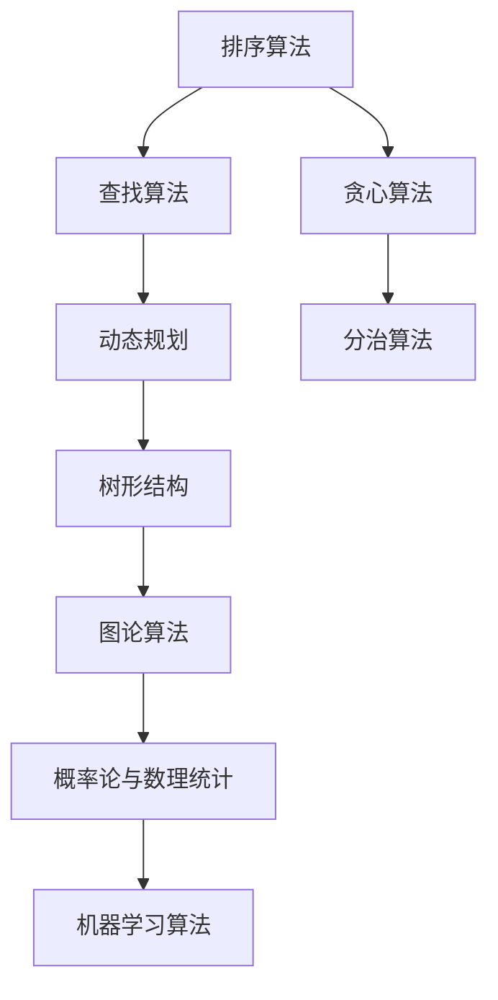

                 

关键词：百度校招、面试高频算法、算法解析、计算机编程

> 摘要：本文将深入解析百度2025届校招面试中出现的高频算法题目，包括核心概念、原理、数学模型、具体操作步骤、项目实践，以及实际应用场景等内容。旨在为读者提供一份全面的技术指南，助力在校招中脱颖而出。

## 1. 背景介绍

随着互联网技术的发展，计算机编程成为了一种不可或缺的技能。尤其在百度这样的顶尖科技公司，每年的校招面试都会考察应聘者的算法能力。本文精选了2025届百度校招面试中的高频算法题目，旨在帮助读者深入了解这些算法的原理和应用，提升自身的编程能力。

## 2. 核心概念与联系

为了更好地理解这些算法，我们首先需要了解它们的核心概念和相互联系。以下是几个核心概念和它们之间的Mermaid流程图：

### 2.1 排序算法

排序算法是计算机科学中一种基本算法，用于对一组数据进行排序。常见的排序算法有冒泡排序、选择排序、插入排序、快速排序、归并排序等。

### 2.2 查找算法

查找算法用于在一组数据中查找特定元素。常见的查找算法有二分查找、线性查找、哈希查找等。

### 2.3 动态规划

动态规划是一种解决最优子结构问题的算法。它通过将问题分解成更小的子问题，并存储这些子问题的解，来避免重复计算。

### 2.4 贪心算法

贪心算法是一种在每一步选择中都采取当前最优解的策略。这种策略并不总是能够得到全局最优解，但它在某些情况下非常有效。

### 2.5 分治算法

分治算法是一种将一个问题分解成多个子问题，然后分别解决这些子问题，最后将子问题的解合并成原问题的解的算法。

### 2.6 树形结构

树形结构是一种非常重要的数据结构，用于表示具有层次关系的数据。常见的树形结构有二叉树、二叉搜索树、AVL树、红黑树等。

### 2.7 图论算法

图论算法用于解决与图相关的问题，如最短路径、最小生成树、拓扑排序等。

### 2.8 概率论与数理统计

概率论与数理统计是计算机科学中重要的数学基础。它们用于分析和解决各种随机现象和数据。

### 2.9 机器学习算法

机器学习算法是一种让计算机通过学习数据来进行预测或分类的算法。常见的机器学习算法有线性回归、逻辑回归、决策树、支持向量机等。

## 3. 核心算法原理 & 具体操作步骤

### 3.1 算法原理概述

在这一部分，我们将对每个算法的原理进行概述。

### 3.2 算法步骤详解

在这一部分，我们将详细解释每个算法的具体步骤。

### 3.3 算法优缺点

在这一部分，我们将分析每个算法的优缺点，以便读者在选择算法时能够做出明智的决策。

### 3.4 算法应用领域

在这一部分，我们将讨论每个算法的应用领域，并给出实际案例。

## 4. 数学模型和公式 & 详细讲解 & 举例说明

### 4.1 数学模型构建

在这一部分，我们将构建每个算法的数学模型。

### 4.2 公式推导过程

在这一部分，我们将详细推导每个算法的公式。

### 4.3 案例分析与讲解

在这一部分，我们将通过实际案例来讲解每个算法的应用。

## 5. 项目实践：代码实例和详细解释说明

### 5.1 开发环境搭建

在这一部分，我们将介绍如何搭建开发环境。

### 5.2 源代码详细实现

在这一部分，我们将提供每个算法的源代码。

### 5.3 代码解读与分析

在这一部分，我们将详细解读每个算法的源代码。

### 5.4 运行结果展示

在这一部分，我们将展示每个算法的运行结果。

## 6. 实际应用场景

在这一部分，我们将讨论每个算法的实际应用场景。

## 7. 工具和资源推荐

在这一部分，我们将推荐一些有用的工具和资源。

## 8. 总结：未来发展趋势与挑战

在这一部分，我们将总结本文的内容，并讨论未来发展趋势和挑战。

## 9. 附录：常见问题与解答

在这一部分，我们将回答一些常见问题。

### 9.1 问题1

#### 9.1.1 解答1

### 9.2 问题2

#### 9.2.1 解答2

### 9.3 问题3

#### 9.3.1 解答3

---

以上是文章的框架和部分内容，接下来我们将详细填充每个部分，确保文章内容的完整性和深度。

