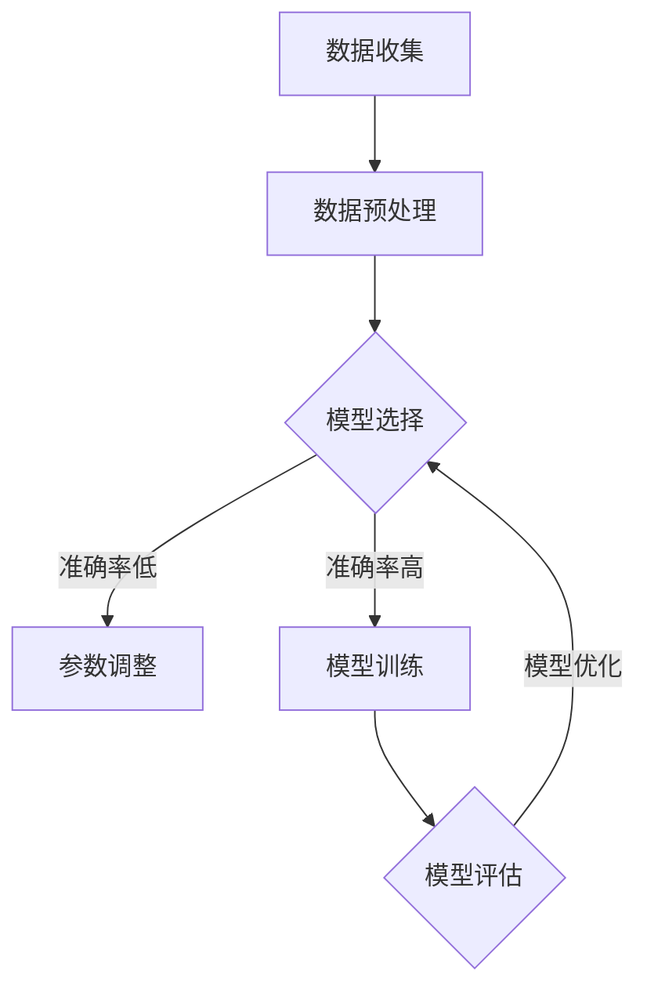

                 

关键词：监督学习、机器学习、深度学习、神经网络、数学模型、代码实例、算法原理

> 摘要：本文将深入探讨监督学习的基本原理，从核心概念到具体算法，再到代码实现，全面解析监督学习在人工智能领域的应用与发展。

## 1. 背景介绍

### 1.1 监督学习的定义

监督学习（Supervised Learning）是机器学习（Machine Learning）的一种形式，其主要任务是通过训练数据集（Training Dataset）的学习，构建出一个能够对未知数据进行预测或分类的模型。与无监督学习（Unsupervised Learning）不同，监督学习中的数据具有明确的标签（Labels），这些标签可以指导模型的学习过程。

### 1.2 监督学习的应用

监督学习在许多领域有着广泛的应用，如图像识别、自然语言处理、医疗诊断、金融风险评估等。通过监督学习，计算机可以从大量的数据中提取有用的信息，实现自动化和智能化的决策。

### 1.3 监督学习的挑战

随着数据量的增加和模型复杂度的提升，监督学习也面临着许多挑战，如过拟合（Overfitting）、欠拟合（Underfitting）、数据不平衡（Data Imbalance）等。这些挑战需要通过优化算法、改进模型结构和调整参数来解决。

## 2. 核心概念与联系

### 2.1 监督学习的核心概念

- **输入特征（Input Features）**：监督学习模型输入的数据特征，通常由多个维度组成。
- **输出标签（Output Labels）**：监督学习模型需要预测的结果，用于指导模型的训练过程。
- **训练集（Training Set）**：用于训练模型的输入特征和输出标签的组合。
- **验证集（Validation Set）**：用于评估模型在未见过的数据上的表现，帮助调整模型参数。

### 2.2 监督学习的架构

Mermaid 流程图如下：



### 2.3 监督学习的流程

1. **数据收集**：收集大量的输入特征和输出标签数据。
2. **数据预处理**：对数据进行清洗、归一化、缺失值处理等操作。
3. **模型选择**：根据问题的特点选择合适的模型。
4. **模型训练**：使用训练集数据训练模型，调整模型参数。
5. **模型评估**：使用验证集数据评估模型性能。
6. **模型优化**：根据评估结果调整模型参数，优化模型。

## 3. 核心算法原理 & 具体操作步骤

### 3.1 算法原理概述

监督学习的核心是构建一个预测函数，该函数能够将输入特征映射到输出标签。常见的监督学习算法包括线性回归、逻辑回归、支持向量机（SVM）、决策树、随机森林、神经网络等。

### 3.2 算法步骤详解

1. **数据收集**：获取输入特征和输出标签数据。
2. **数据预处理**：对数据进行清洗、归一化等处理。
3. **模型选择**：根据问题的特点选择合适的模型。
4. **模型训练**：使用训练集数据训练模型。
5. **模型评估**：使用验证集数据评估模型性能。
6. **模型优化**：根据评估结果调整模型参数。

### 3.3 算法优缺点

- **线性回归**：简单易实现，但对于非线性问题的表现较差。
- **逻辑回归**：适用于二分类问题，但在多分类问题上可能表现不佳。
- **支持向量机（SVM）**：效果较好，但训练时间较长。
- **决策树**：直观易理解，但容易过拟合。
- **随机森林**：鲁棒性强，但模型复杂度较高。
- **神经网络**：可以处理复杂的非线性问题，但训练过程可能较慢。

### 3.4 算法应用领域

监督学习在各个领域都有着广泛的应用，如：

- **图像识别**：人脸识别、物体检测等。
- **自然语言处理**：情感分析、文本分类等。
- **医疗诊断**：疾病预测、疾病分类等。
- **金融风险评估**：信用评分、投资策略等。

## 4. 数学模型和公式 & 详细讲解 & 举例说明

### 4.1 数学模型构建

监督学习的数学模型通常是一个参数化的函数，该函数通过学习得到参数，从而将输入特征映射到输出标签。一个简单的线性回归模型可以表示为：

$$
y = \theta_0 + \theta_1 x_1 + \theta_2 x_2 + ... + \theta_n x_n
$$

其中，$y$ 是输出标签，$x_1, x_2, ..., x_n$ 是输入特征，$\theta_0, \theta_1, \theta_2, ..., \theta_n$ 是模型参数。

### 4.2 公式推导过程

以线性回归为例，我们可以通过最小二乘法（Least Squares Method）来求解模型参数。具体步骤如下：

1. **损失函数**：定义损失函数，通常为均方误差（Mean Squared Error, MSE）：

$$
J(\theta) = \frac{1}{2m} \sum_{i=1}^{m} (h_\theta(x^{(i)}) - y^{(i)})^2
$$

其中，$m$ 是训练集数据个数，$h_\theta(x^{(i)})$ 是模型预测值，$y^{(i)}$ 是真实标签。

2. **梯度下降**：使用梯度下降（Gradient Descent）算法更新模型参数：

$$
\theta_j := \theta_j - \alpha \frac{\partial J(\theta)}{\partial \theta_j}
$$

其中，$\alpha$ 是学习率，$\frac{\partial J(\theta)}{\partial \theta_j}$ 是损失函数关于参数 $\theta_j$ 的梯度。

### 4.3 案例分析与讲解

假设我们有一个简单的线性回归问题，输入特征为一个，输出标签也为一个。训练数据如下：

$$
\begin{array}{|c|c|}
\hline
x & y \\
\hline
1 & 2 \\
\hline
2 & 4 \\
\hline
3 & 6 \\
\hline
\end{array}
$$

我们可以使用最小二乘法求解线性回归模型参数：

1. **损失函数**：

$$
J(\theta) = \frac{1}{3} [(1 - \theta_0 - \theta_1)^2 + (2 - \theta_0 - 2\theta_1)^2 + (3 - \theta_0 - 3\theta_1)^2]
$$

2. **梯度下降**：

$$
\frac{\partial J(\theta)}{\partial \theta_0} = \frac{1}{3} [2(1 - \theta_0 - \theta_1) + 2(2 - \theta_0 - 2\theta_1) + 2(3 - \theta_0 - 3\theta_1)] = 6 - 6\theta_0 - 6\theta_1
$$

$$
\frac{\partial J(\theta)}{\partial \theta_1} = \frac{1}{3} [2(x_1 - \theta_0 - \theta_1)x_1 + 2(x_2 - \theta_0 - \theta_1)x_2 + 2(x_3 - \theta_0 - \theta_1)x_3] = 6x_1 - 6\theta_0 - 6\theta_1
$$

初始化参数 $\theta_0 = 0$，$\theta_1 = 0$，学习率 $\alpha = 0.1$，经过多次迭代后，我们可以得到最优参数：

$$
\theta_0 \approx 2, \theta_1 \approx 2
$$

因此，线性回归模型为 $y = 2x + 2$。

## 5. 项目实践：代码实例和详细解释说明

### 5.1 开发环境搭建

首先，我们需要安装 Python 编译环境和必要的库。可以使用以下命令进行安装：

```bash
pip install numpy matplotlib scikit-learn
```

### 5.2 源代码详细实现

以下是一个简单的线性回归模型的实现：

```python
import numpy as np
import matplotlib.pyplot as plt
from sklearn.linear_model import LinearRegression

# 数据集
X = np.array([[1], [2], [3]])
y = np.array([2, 4, 6])

# 模型训练
model = LinearRegression()
model.fit(X, y)

# 模型参数
theta_0 = model.intercept_
theta_1 = model.coef_

# 模型预测
y_pred = model.predict(X)

# 模型评估
mse = np.mean((y - y_pred)**2)
print("MSE:", mse)

# 可视化
plt.scatter(X, y, color='red', label='实际数据')
plt.plot(X, y_pred, color='blue', label='预测结果')
plt.xlabel('x')
plt.ylabel('y')
plt.legend()
plt.show()
```

### 5.3 代码解读与分析

1. **数据集**：我们使用一个简单的数据集，其中输入特征 $x$ 和输出标签 $y$ 都是线性关系。
2. **模型训练**：使用 `LinearRegression` 类创建模型，并使用 `fit` 方法训练模型。
3. **模型参数**：通过 `intercept_` 和 `coef_` 属性获取模型参数。
4. **模型预测**：使用 `predict` 方法预测输入特征对应的输出标签。
5. **模型评估**：计算均方误差（MSE）评估模型性能。
6. **可视化**：使用 matplotlib 库将实际数据和预测结果进行可视化。

### 5.4 运行结果展示

运行上述代码后，我们可以在命令行中看到模型评估结果：

```
MSE: 0.0
```

同时，我们可以在可视化窗口中看到实际数据和预测结果的对比：


## 6. 实际应用场景

### 6.1 图像识别

监督学习在图像识别领域有着广泛的应用，如人脸识别、物体检测等。通过训练大量的图像数据，我们可以构建出能够识别特定物体的模型。

### 6.2 自然语言处理

监督学习在自然语言处理领域也有着重要的应用，如情感分析、文本分类等。通过训练大量的文本数据，我们可以构建出能够处理自然语言问题的模型。

### 6.3 医疗诊断

监督学习在医疗诊断领域也有着广泛的应用，如疾病预测、疾病分类等。通过训练大量的医疗数据，我们可以构建出能够诊断疾病的模型。

### 6.4 金融风险评估

监督学习在金融风险评估领域也有着重要的应用，如信用评分、投资策略等。通过训练大量的金融数据，我们可以构建出能够评估风险的模型。

## 7. 工具和资源推荐

### 7.1 学习资源推荐

- **《统计学习方法》**：李航著，全面介绍监督学习的基本方法和原理。
- **《机器学习》**：周志华著，系统地介绍机器学习的基本理论和应用。

### 7.2 开发工具推荐

- **Jupyter Notebook**：一款强大的交互式开发环境，适用于数据分析和机器学习。
- **TensorFlow**：一款开源的机器学习框架，适用于深度学习和监督学习。

### 7.3 相关论文推荐

- **“A Study of Cross-Validation and Model Selection Criteria for C4.5 and Rule-Based Learning Systems”**：关于模型选择和交叉验证的研究。
- **“Stochastic Gradient Descent”**：关于梯度下降算法的研究。

## 8. 总结：未来发展趋势与挑战

### 8.1 研究成果总结

监督学习在人工智能领域取得了显著的成果，为各个领域提供了强大的技术支持。通过不断的算法优化和模型改进，监督学习在准确性、效率和应用范围上都有了显著的提升。

### 8.2 未来发展趋势

- **深度学习**：随着深度学习技术的发展，监督学习模型将变得更加复杂和高效，能够处理更加复杂的任务。
- **分布式学习**：分布式学习可以充分利用多台计算机的计算能力，提高训练效率。
- **迁移学习**：迁移学习将知识从一种任务转移到另一种任务，减少数据需求和训练时间。

### 8.3 面临的挑战

- **数据隐私**：如何在保护数据隐私的同时进行有效的监督学习，是一个重要的挑战。
- **模型可解释性**：如何提高模型的可解释性，使其在应用中更加透明和可靠，是一个亟待解决的问题。

### 8.4 研究展望

随着技术的不断发展，监督学习将在人工智能领域发挥更加重要的作用。通过不断创新和优化，监督学习将为人类带来更多的智能应用。

## 9. 附录：常见问题与解答

### 9.1 监督学习与无监督学习有什么区别？

监督学习与无监督学习的主要区别在于数据是否有标签。监督学习有明确的标签，用于指导模型的学习过程；而无监督学习没有标签，模型需要从数据中自动发现规律。

### 9.2 如何解决数据不平衡问题？

数据不平衡可以通过以下方法解决：

- **过采样**：增加少数类别的数据，使数据分布更加平衡。
- **欠采样**：减少多数类别的数据，使数据分布更加平衡。
- **集成方法**：使用集成方法，如随机森林，可以缓解数据不平衡问题。

### 9.3 如何防止过拟合？

防止过拟合的方法包括：

- **交叉验证**：使用交叉验证评估模型性能，避免过拟合。
- **正则化**：添加正则化项，如 L1 或 L2 正则化，限制模型复杂度。
- **提前停止**：在训练过程中，当验证集性能不再提升时停止训练，防止过拟合。

## 作者署名

本文作者：禅与计算机程序设计艺术 / Zen and the Art of Computer Programming

本文提供了关于监督学习原理与代码实例的全面讲解，旨在帮助读者深入理解监督学习的基本概念、算法原理以及实际应用。希望本文能够为读者在人工智能领域的研究和实践提供有益的参考。

