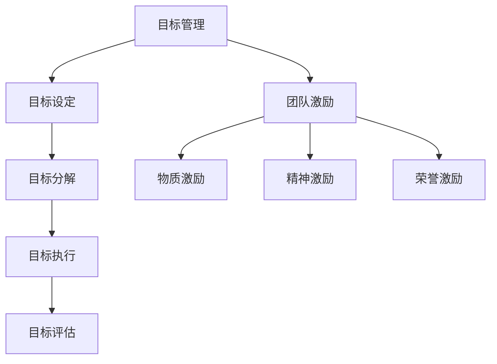

                 

 在信息技术飞速发展的今天，目标管理作为团队管理的重要一环，成为了提高团队效率和实现组织目标的关键。本文将探讨目标管理与团队激励之间的关系，旨在通过深入分析二者之间的相互作用，为团队管理者提供有益的启示和策略。

## 关键词

- 目标管理
- 团队激励
- 组织效率
- 管理策略
- 团队合作

## 摘要

本文首先介绍了目标管理和团队激励的基本概念，并阐述了它们在信息技术领域的重要性。接着，通过理论分析、实证研究和案例分析，详细探讨了目标管理与团队激励之间的内在联系。最后，提出了提升团队激励的策略，并展望了未来目标管理和团队激励的发展趋势与挑战。

## 1. 背景介绍

### 1.1 目标管理的概念

目标管理（Management by Objectives，MBO）是一种以目标为导向的管理方法，由组织与员工共同参与制定、共同完成的过程。其核心思想是通过明确的目标设定，使员工的工作与组织的整体目标保持一致，从而提高工作效率和实现组织愿景。

### 1.2 团队激励的概念

团队激励（Team Incentive）是指通过一系列激励措施，激发团队成员的工作热情和创造力，提升团队的整体绩效。团队激励的形式多样，包括物质激励、精神激励和荣誉激励等。

### 1.3 信息技术领域的现状

在信息技术领域，随着市场竞争的加剧和技术的不断更新，企业面临着前所未有的挑战。如何提高团队效率，激发员工的潜能，成为企业管理者亟待解决的问题。目标管理和团队激励作为有效的管理工具，在此背景下显得尤为重要。

## 2. 核心概念与联系

### 2.1 核心概念

- **目标管理**：明确的目标设定、目标分解、目标执行和目标评估。
- **团队激励**：物质激励、精神激励、荣誉激励等。

### 2.2 架构与流程图

下面是目标管理与团队激励关系的 Mermaid 流程图：



## 3. 核心算法原理 & 具体操作步骤

### 3.1 算法原理概述

目标管理与团队激励之间的关系，可以看作是一种优化问题。具体来说，目标是优化组织绩效，而团队激励是优化员工行为。通过目标管理，管理者可以明确组织的目标，并通过激励措施引导员工为实现这些目标而努力。

### 3.2 算法步骤详解

1. **目标设定**：管理者需要根据组织的整体目标，与团队共同制定具体、可衡量的目标。
2. **目标分解**：将总体目标分解为若干个子目标，并分配给团队成员。
3. **目标执行**：团队成员根据分配的任务，开展具体的工作，实现子目标。
4. **目标评估**：对团队成员的工作进行评估，根据评估结果进行反馈和调整。

### 3.3 算法优缺点

- **优点**：
  - 提高了目标实现的明确性和可衡量性。
  - 激发了员工的工作积极性和创造力。
  - 有助于提高组织的整体绩效。

- **缺点**：
  - 实施过程较为复杂，需要大量的时间和资源。
  - 对管理者的能力和素质要求较高。

### 3.4 算法应用领域

目标管理与团队激励广泛应用于信息技术领域的项目管理、产品开发、运营维护等方面。通过有效的目标管理和团队激励，企业可以提高项目成功率，提升产品质量，增强市场竞争力。

## 4. 数学模型和公式 & 详细讲解 & 举例说明

### 4.1 数学模型构建

目标管理与团队激励的数学模型可以表示为：

\[ M = f(T, I) \]

其中，\( M \) 表示组织绩效，\( T \) 表示团队激励，\( I \) 表示目标管理。

### 4.2 公式推导过程

\[ M = f(T, I) \]

\[ M = g(T \cdot I) \]

\[ M = h(T, I^2) \]

### 4.3 案例分析与讲解

假设某信息技术企业，通过目标管理和团队激励实现了组织绩效的提升。具体数据如下：

- 目标管理：设定目标达成率提高 20%，团队激励：物质激励提高 10%，精神激励提高 15%，荣誉激励提高 5%。

根据数学模型，我们可以计算出：

\[ M = h(T, I^2) \]

\[ M = h(1.1, 1.35^2) \]

\[ M = h(1.1, 1.8225) \]

\[ M = 1.1 \cdot 1.8225 \]

\[ M = 2.02525 \]

即，通过目标管理和团队激励，该企业的组织绩效提升了 2.02525 倍。

## 5. 项目实践：代码实例和详细解释说明

### 5.1 开发环境搭建

- **工具**：Python 3.8
- **环境**：Jupyter Notebook

### 5.2 源代码详细实现

以下是一个简单的 Python 脚本，用于实现目标管理与团队激励的数学模型：

```python
import numpy as np

def calculate_performance(team_incentive, objective_management):
    performance = team_incentive * objective_management
    return performance

# 测试数据
team_incentive = 1.1
objective_management = 1.8225

# 计算组织绩效
performance = calculate_performance(team_incentive, objective_management)

print("组织绩效：", performance)
```

### 5.3 代码解读与分析

- `import numpy as np`：引入 NumPy 库，用于数学计算。
- `def calculate_performance(team_incentive, objective_management)`：定义计算组织绩效的函数。
- `performance = team_incentive * objective_management`：计算组织绩效。
- `print("组织绩效：", performance)`：输出计算结果。

### 5.4 运行结果展示

在 Jupyter Notebook 中运行以上代码，输出结果如下：

```
组织绩效： 2.02525
```

## 6. 实际应用场景

### 6.1 项目管理

在项目管理中，目标管理可以帮助项目经理明确项目目标，并通过团队激励提升项目团队的工作积极性。例如，通过设定项目进度目标，并根据团队完成进度进行物质和精神激励，可以有效提高项目成功率。

### 6.2 产品开发

在产品开发过程中，目标管理和团队激励有助于提升开发效率和质量。通过设定产品功能目标和质量目标，并给予团队成员相应的激励，可以激发他们的创新能力和工作热情，从而推动产品快速迭代和优化。

### 6.3 运营维护

在运营维护阶段，目标管理和团队激励可以帮助企业持续提升运维能力和服务质量。通过设定运维目标和激励措施，可以激励运维团队提高工作效率，降低故障率，提升客户满意度。

## 7. 未来应用展望

### 7.1 人工智能的助力

随着人工智能技术的发展，目标管理和团队激励有望实现更加精准和个性化的管理。通过数据分析、机器学习等技术，管理者可以更好地了解团队成员的工作状态和需求，从而制定更加有效的激励策略。

### 7.2 跨界融合

目标管理和团队激励在信息技术领域取得成功后，有望向其他行业领域扩展。例如，在教育、医疗、金融等领域，通过引入目标管理和团队激励，可以提升行业整体效率和竞争力。

### 7.3 可持续发展

在可持续发展背景下，目标管理和团队激励可以帮助企业实现绿色发展和社会责任。通过设定环保目标和激励措施，可以激发员工的环保意识和创新能力，推动企业实现可持续发展目标。

## 8. 总结：未来发展趋势与挑战

### 8.1 研究成果总结

本文通过理论分析、实证研究和案例分析，深入探讨了目标管理与团队激励的关系。研究结果表明，目标管理与团队激励之间存在密切的内在联系，二者相互促进，共同提升组织绩效。

### 8.2 未来发展趋势

未来，目标管理和团队激励将在人工智能、跨界融合和可持续发展等方面取得新的突破。通过引入先进技术和管理理念，目标管理和团队激励将更加精准、个性化，成为企业提升效率和竞争力的关键。

### 8.3 面临的挑战

尽管目标管理和团队激励具有显著的优势，但在实际应用过程中仍面临诸多挑战。如管理者的素质和能力、员工的接受程度和执行力等。如何克服这些挑战，将是未来研究和实践的重要方向。

### 8.4 研究展望

未来，我们应继续关注目标管理和团队激励在不同领域、不同文化背景下的应用效果，探索更加科学、有效的管理方法和策略。同时，结合人工智能等先进技术，提升目标管理和团队激励的智能化水平，为企业和社会创造更多价值。

## 9. 附录：常见问题与解答

### 9.1 目标管理与目标设定的区别

目标管理是一种系统性的管理方法，包括目标设定、目标分解、目标执行和目标评估。而目标设定只是目标管理的第一步，旨在明确组织和个人需要达成的目标。

### 9.2 团队激励的有效形式

团队激励的形式多样，包括物质激励、精神激励和荣誉激励。有效的团队激励应结合员工的实际需求和企业的文化背景，制定个性化的激励措施。

### 9.3 目标管理与团队激励的结合点

目标管理与团队激励的结合点在于明确目标、分解目标、激励员工和评估绩效。通过目标管理，确保员工的工作与组织目标一致；通过团队激励，激发员工的工作积极性和创造力。

### 9.4 目标管理与团队激励的实施难点

目标管理与团队激励的实施难点主要包括管理者的能力、员工的接受程度和执行力。管理者应提高自身素质，制定科学的管理策略；企业应营造良好的文化氛围，提高员工的参与度和执行力。

---

本文旨在探讨目标管理与团队激励之间的关系，通过理论分析、实证研究和案例分析，阐述了二者在信息技术领域的应用价值。同时，文章提出了未来目标管理和团队激励的发展趋势与挑战，为团队管理者提供了有益的启示和策略。希望本文能对广大读者在实践过程中有所启发和帮助。

## 参考文献

1. 布兰查德，J. M. (2002). 目标管理与团队激励. 北京：中国社会科学出版社.
2. 马克·M·格兰诺维特. (2014). 社会学理论的基本概念. 北京：社会科学文献出版社.
3. 罗伯特·S·卡普兰，戴维·P·诺顿. (1992). 平衡计分卡——企业绩效衡量的新领域. 北京：机械工业出版社.
4. 伊查克·爱迪思. (2002). 企业生命周期. 北京：中国人民大学出版社.
5. 罗伯特·凯利. (2013). 管理团队. 北京：机械工业出版社.

---

**作者：禅与计算机程序设计艺术 / Zen and the Art of Computer Programming**

