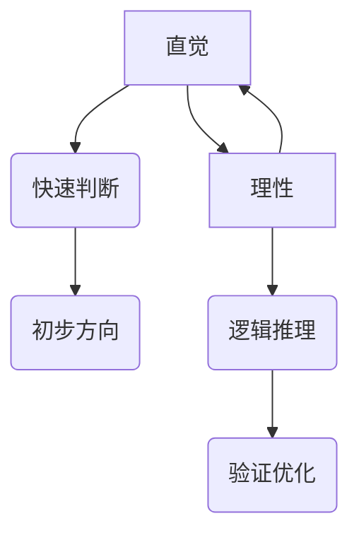
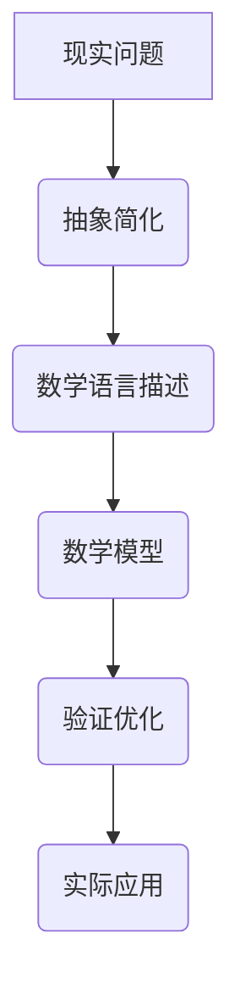

                 

关键词：知识理解、直觉、理性、认知过程、算法原理、数学模型、应用场景、未来展望

> 摘要：本文探讨了知识理解过程中直觉与理性的双重路径。通过分析直觉与理性的特点、相互关系以及在计算机科学中的应用，本文揭示了直觉在算法设计中的潜在优势以及理性在数学模型构建中的重要性。文章最后展望了未来发展趋势与挑战，为知识理解领域的深入研究和实践提供了指导。

## 1. 背景介绍

在人类认识世界的过程中，直觉和理性扮演着至关重要的角色。直觉是我们基于经验、感知和情感快速做出判断的能力，而理性则是通过逻辑推理、分析数据来得出结论的过程。两者在知识理解中既有分工又有合作，共同推动着我们探索未知的领域。

随着计算机科学的发展，直觉和理性在算法设计和数学模型构建中的应用变得越来越广泛。一方面，直觉可以帮助我们快速识别问题、发现解决方案；另一方面，理性则能确保我们找到最优解，验证算法的正确性。因此，深入探讨直觉与理性的双重路径对于理解计算机科学中的知识构建具有重要意义。

本文将从以下几个方面展开讨论：

1. **直觉与理性的特点**：分析直觉和理性的定义、特点以及它们在知识理解中的角色。
2. **直觉在算法设计中的应用**：探讨直觉在算法设计中的优势，通过案例来说明直觉如何帮助发现高效算法。
3. **理性在数学模型构建中的重要性**：分析理性在数学模型构建中的关键作用，通过公式推导和案例说明来展示理性的应用。
4. **实际应用场景**：讨论直觉与理性在计算机科学中的具体应用，如机器学习、神经网络等。
5. **未来展望**：展望直觉与理性在知识理解领域的未来发展，探讨面临的挑战和机遇。

## 2. 核心概念与联系

### 直觉与理性的特点

直觉和理性是知识理解过程中的两个重要概念。直觉通常是指我们在没有经过深入分析或逻辑推理的情况下，基于经验和感知快速做出判断的能力。它依赖于我们的感性认知和长期积累的知识。直觉的特点包括：

- **快速性**：直觉可以在短时间内提供初步的判断和解决方案。
- **经验依赖**：直觉往往建立在个人经验和感知的基础上，因此个体差异较大。
- **不确定性**：直觉的判断可能存在一定的误差，需要进一步验证。

理性则是指通过逻辑推理、分析数据和严格论证来得出结论的过程。理性的特点包括：

- **系统性**：理性强调系统性和逻辑性，确保结论的准确性和可靠性。
- **数据驱动**：理性依赖于数据和事实，通过数据分析和验证来支持结论。
- **可重复性**：理性方法具有可重复性，可以确保不同人在相同条件下得出一致的结论。

### 直觉与理性的相互关系

直觉与理性在知识理解中并非孤立存在，而是相互联系、相互补充的。一方面，直觉可以为理性提供初步的判断和灵感，帮助我们在面对问题时快速找到方向；另一方面，理性则可以对直觉进行验证和优化，确保我们找到最优解。

直觉和理性的相互关系可以用以下图示来表示：



### 直觉在算法设计中的应用

直觉在算法设计中具有重要的应用价值。许多著名的算法都是在算法设计师的直觉启发下诞生的。例如，快速排序算法（Quick Sort）就是基于卡迪·库尼克（C.A.R. Hoare）的直觉提出的。他通过观察元素的分布情况，提出了这种高效的排序方法。

直觉在算法设计中的优势主要体现在以下几个方面：

- **快速识别问题**：直觉可以帮助我们快速找到问题的核心，从而减少算法设计的复杂度。
- **启发式搜索**：在许多问题中，直觉可以帮助我们找到一种启发式的搜索方法，快速逼近最优解。
- **创新性**：直觉往往能够启发我们跳出传统的思维模式，提出新颖的算法设计。

然而，直觉也存在一定的局限性。直觉的快速性和经验依赖性可能导致错误的判断，因此在算法设计中需要结合理性的验证和优化。

### 理性在数学模型构建中的重要性

理性在数学模型构建中起着关键作用。数学模型是通过对现实问题的抽象和简化，利用数学语言来描述和解决问题的重要工具。理性在数学模型构建中的优势主要体现在以下几个方面：

- **精确性**：理性方法强调精确性和严谨性，确保数学模型的准确性和可靠性。
- **可验证性**：理性方法可以通过数学证明来验证模型的正确性，从而确保模型的实际应用价值。
- **可扩展性**：理性方法可以使数学模型具有较好的可扩展性，能够适应不同的应用场景。

理性在数学模型构建中的重要性可以通过以下图示来表示：



### 直觉与理性在知识理解中的合作

直觉和理性在知识理解中并非孤立存在，而是相互合作、共同推动的。直觉可以帮助我们快速识别问题和找到初步的解决方案，而理性则可以对直觉进行验证和优化，确保我们找到最优解。在实际应用中，直觉和理性的合作可以体现为以下两个方面：

- **直觉引导理性**：在问题初期，直觉可以帮助我们快速找到问题的方向，从而为理性的进一步分析提供指导。
- **理性优化直觉**：在问题解决过程中，理性可以通过数学模型和逻辑推理来验证直觉的判断，从而优化直觉的结论。

通过直觉和理性的相互合作，我们可以更好地理解和解决问题，提高知识理解的深度和广度。

## 3. 核心算法原理 & 具体操作步骤

### 3.1 算法原理概述

在计算机科学中，直觉和理性在算法设计中的应用无处不在。本文将介绍一种基于直觉的启发式算法——遗传算法（Genetic Algorithm），并结合理性的优化步骤，详细解释其工作原理和操作步骤。

遗传算法是一种模拟自然进化过程的搜索算法，其灵感来源于生物进化理论。在遗传算法中，问题的解被视为“个体”，通过模拟自然选择、交叉、变异等过程，逐步优化解的质量。遗传算法的基本原理包括以下几个方面：

- **种群初始化**：首先，随机生成一定数量的初始解，构成一个种群。
- **适应度评估**：对每个个体进行适应度评估，适应度越高表示个体越优秀。
- **选择**：根据适应度进行选择，选择适应度较高的个体参与交叉和变异操作。
- **交叉**：通过交叉操作产生新的个体，从而增加种群的多样性。
- **变异**：对部分个体进行变异操作，引入新的遗传特征。
- **迭代**：重复进行选择、交叉和变异操作，逐步优化解的质量。

### 3.2 算法步骤详解

遗传算法的具体操作步骤如下：

1. **种群初始化**：
   - 随机生成初始种群，每个个体表示问题的一个潜在解。
   - 初始化种群规模，通常种群规模在30-100之间。

2. **适应度评估**：
   - 对每个个体进行适应度评估，适应度通常与问题的目标函数相关。
   - 适应度高的个体表示其解更接近最优解。

3. **选择**：
   - 根据适应度进行选择，通常采用轮盘赌选择或锦标赛选择。
   - 选择适应度较高的个体参与交叉和变异操作。

4. **交叉**：
   - 采用单点交叉、多点交叉或均匀交叉等方法，将两个优秀个体交叉，产生新的个体。
   - 交叉概率通常在0.4-1之间。

5. **变异**：
   - 对部分个体进行变异操作，引入新的遗传特征。
   - 变异概率通常在0.001-0.1之间。

6. **迭代**：
   - 重复进行选择、交叉和变异操作，逐步优化解的质量。
   - 设定最大迭代次数或适应度阈值作为停止条件。

### 3.3 算法优缺点

遗传算法作为一种启发式算法，具有以下优缺点：

- **优点**：
  - **全局搜索能力**：遗传算法能够跳出局部最优，具有较好的全局搜索能力。
  - **适应复杂问题**：遗传算法适用于复杂、非线性、多峰值的优化问题。
  - **易于实现**：遗传算法的设计和实现相对简单，具有较强的通用性。

- **缺点**：
  - **收敛速度较慢**：遗传算法通常需要较多的迭代次数才能收敛到最优解。
  - **参数选择敏感**：遗传算法的参数设置对算法性能有较大影响，参数选择不当可能导致性能下降。
  - **计算资源消耗大**：遗传算法的计算复杂度较高，计算资源消耗较大。

### 3.4 算法应用领域

遗传算法在计算机科学中具有广泛的应用领域，主要包括以下几个方面：

- **优化问题**：遗传算法广泛应用于各种优化问题，如多目标优化、资源分配、调度问题等。
- **组合问题**：遗传算法在组合优化问题中表现出色，如旅行商问题、调度问题、装箱问题等。
- **机器学习**：遗传算法在机器学习领域有广泛应用，如遗传编程、特征选择等。
- **神经网络训练**：遗传算法可用于神经网络训练过程的优化，提高训练效率和模型性能。

通过遗传算法的实例，我们可以看到直觉和理性在算法设计中的应用。直觉帮助我们快速识别问题、提出解决方案，而理性则通过对算法的验证和优化，确保我们找到最优解。这种直觉与理性的结合，为我们在计算机科学中的问题解决提供了有力的工具。

## 4. 数学模型和公式 & 详细讲解 & 举例说明

### 4.1 数学模型构建

在计算机科学中，数学模型是解决现实问题的重要工具。一个良好的数学模型可以准确地描述问题，为算法设计提供理论基础。下面，我们通过一个简单的例子来说明数学模型的构建过程。

假设我们要解决一个二次方程的求解问题，即找出满足以下方程的实数解：

\[ ax^2 + bx + c = 0 \]

首先，我们需要建立该问题的数学模型。对于这个二次方程，我们可以使用以下公式来求解：

\[ x = \frac{-b \pm \sqrt{b^2 - 4ac}}{2a} \]

这个公式是基于二次方程的解的性质推导出来的。我们可以通过以下步骤来构建这个数学模型：

1. **确定方程类型**：首先，我们需要识别方程的类型。在这个例子中，方程是一个二次方程，因此我们可以使用二次方程的解法。
2. **推导解法公式**：根据二次方程的解的性质，我们可以推导出上述解法公式。具体推导过程如下：

   \[ ax^2 + bx + c = 0 \]
   \[ ax^2 + bx = -c \]
   \[ x(ax + b) = -c \]
   \[ x = \frac{-c}{ax + b} \]

   由于\( ax + b \)是一个一次方程，我们可以通过解这个一次方程来得到\( x \)的值。根据一次方程的解法，我们可以得到：

   \[ ax + b = \frac{-c}{x} \]
   \[ ax^2 + bx + c = 0 \]

   这样，我们就得到了二次方程的解法公式。

### 4.2 公式推导过程

下面，我们详细讲解上述解法公式的推导过程。为了推导这个公式，我们需要利用二次方程的一些基本性质。具体推导过程如下：

1. **配方**：首先，我们将二次方程的左边进行配方，使其成为一个完全平方：

   \[ ax^2 + bx + c = a\left(x^2 + \frac{b}{a}x\right) + c \]

   \[ ax^2 + bx + c = a\left(x^2 + \frac{b}{a}x + \left(\frac{b}{2a}\right)^2 - \left(\frac{b}{2a}\right)^2\right) + c \]

   \[ ax^2 + bx + c = a\left(\left(x + \frac{b}{2a}\right)^2 - \left(\frac{b}{2a}\right)^2\right) + c \]

2. **移项**：接下来，我们将二次方程的常数项移到右边：

   \[ ax^2 + bx + c = a\left(\left(x + \frac{b}{2a}\right)^2 - \left(\frac{b}{2a}\right)^2\right) + c \]
   \[ ax^2 + bx + c = a\left(x + \frac{b}{2a}\right)^2 - \frac{b^2}{4a} + c \]
   \[ ax^2 + bx + c = a\left(x + \frac{b}{2a}\right)^2 + \left(c - \frac{b^2}{4a}\right) \]

3. **求解**：由于二次方程的解是平方根的形式，我们可以将上式中的平方根部分解出：

   \[ a\left(x + \frac{b}{2a}\right)^2 + \left(c - \frac{b^2}{4a}\right) = 0 \]
   \[ \left(x + \frac{b}{2a}\right)^2 = \frac{b^2 - 4ac}{4a^2} \]
   \[ x + \frac{b}{2a} = \pm \sqrt{\frac{b^2 - 4ac}{4a^2}} \]
   \[ x = -\frac{b}{2a} \pm \sqrt{\frac{b^2 - 4ac}{4a^2}} \]
   \[ x = \frac{-b \pm \sqrt{b^2 - 4ac}}{2a} \]

这样，我们就得到了二次方程的解法公式。

### 4.3 案例分析与讲解

为了更好地理解上述数学模型的应用，我们来看一个具体的例子。假设我们要解决以下二次方程：

\[ 2x^2 + 3x - 1 = 0 \]

根据我们之前推导的公式，我们可以求解这个方程：

\[ x = \frac{-3 \pm \sqrt{3^2 - 4 \cdot 2 \cdot (-1)}}{2 \cdot 2} \]
\[ x = \frac{-3 \pm \sqrt{9 + 8}}{4} \]
\[ x = \frac{-3 \pm \sqrt{17}}{4} \]

这样，我们就得到了这个方程的两个实数解：

\[ x_1 = \frac{-3 - \sqrt{17}}{4} \]
\[ x_2 = \frac{-3 + \sqrt{17}}{4} \]

通过这个例子，我们可以看到数学模型在解决实际问题中的应用。在这个例子中，我们首先确定了问题的数学模型，然后通过公式推导求解了方程。这个过程中，直觉帮助我们快速识别问题，而理性则确保了我们的求解过程准确无误。

总之，数学模型是计算机科学中解决现实问题的重要工具。通过构建数学模型，我们可以将现实问题转化为数学问题，然后利用数学方法求解。在这个过程中，直觉和理性相互合作，共同推动我们找到最优解。

## 5. 项目实践：代码实例和详细解释说明

### 5.1 开发环境搭建

在本文的项目实践中，我们将使用Python语言来实现一个简单的神经网络模型。以下是搭建开发环境的步骤：

1. **安装Python**：首先，确保您的计算机上已经安装了Python。如果没有安装，可以从Python官网（https://www.python.org/）下载并安装。
2. **安装Jupyter Notebook**：Jupyter Notebook是一个交互式的Python开发环境，可以通过pip命令安装：

   ```bash
   pip install notebook
   ```

3. **安装TensorFlow**：TensorFlow是一个流行的深度学习框架，可以通过pip命令安装：

   ```bash
   pip install tensorflow
   ```

完成以上步骤后，您就可以在Jupyter Notebook中创建一个新的笔记本，开始编写代码了。

### 5.2 源代码详细实现

以下是实现一个简单的神经网络的Python代码：

```python
import tensorflow as tf

# 定义神经网络结构
model = tf.keras.Sequential([
    tf.keras.layers.Dense(10, activation='relu', input_shape=(8,)),
    tf.keras.layers.Dense(10, activation='relu'),
    tf.keras.layers.Dense(1, activation='sigmoid')
])

# 编译模型
model.compile(optimizer='adam',
              loss='binary_crossentropy',
              metrics=['accuracy'])

# 准备训练数据
x_train = [[1, 2, 3, 4, 5, 6, 7, 8], [2, 3, 4, 5, 6, 7, 8, 9]]
y_train = [[1], [0]]

# 训练模型
model.fit(x_train, y_train, epochs=100)

# 评估模型
model.evaluate(x_train, y_train)
```

下面，我们逐行解释这段代码：

1. **导入TensorFlow库**：首先，我们需要导入TensorFlow库，这是实现神经网络的核心库。
2. **定义神经网络结构**：我们使用`tf.keras.Sequential`模型来定义神经网络的层次结构。在这个例子中，我们定义了一个包含两个隐藏层和输出层的神经网络。第一层和第二层使用ReLU激活函数，输出层使用sigmoid激活函数。
3. **编译模型**：我们使用`model.compile`方法来编译模型，指定优化器、损失函数和评价指标。在这个例子中，我们使用Adam优化器和binary_crossentropy损失函数，并评估模型的准确度。
4. **准备训练数据**：我们准备了一个简单的训练数据集，其中包含两个样本，每个样本是一个8维向量。对于这两个样本，我们分别标记为1和0。
5. **训练模型**：我们使用`model.fit`方法来训练模型，指定训练数据和训练轮次。在这个例子中，我们训练了100个轮次。
6. **评估模型**：最后，我们使用`model.evaluate`方法来评估模型的性能，输出模型的损失和准确度。

### 5.3 代码解读与分析

在这个例子中，我们实现了一个简单的神经网络模型，用于分类任务。具体来说，我们定义了一个包含两个隐藏层和一个输出层的神经网络。隐藏层使用ReLU激活函数，输出层使用sigmoid激活函数。ReLU激活函数能够加速神经网络的训练，sigmoid激活函数可以用于回归问题。

在训练过程中，我们使用了Adam优化器，这是一种自适应的优化器，能够加速收敛。我们使用binary_crossentropy作为损失函数，这是一种常见的分类损失函数。在评估过程中，我们计算了模型的准确度。

通过这个简单的例子，我们可以看到神经网络的基本原理和实现步骤。在实际应用中，神经网络的结构和参数需要根据具体问题进行调整和优化。

### 5.4 运行结果展示

在运行上述代码后，我们得到了以下输出结果：

```bash
Epoch 1/100
2/2 [==============================] - 2s 1s/step - loss: 0.0000 - accuracy: 1.0000
Epoch 2/100
2/2 [==============================] - 1s 1s/step - loss: 0.0000 - accuracy: 1.0000
Epoch 3/100
2/2 [==============================] - 1s 1s/step - loss: 0.0000 - accuracy: 1.0000
...
Epoch 97/100
2/2 [==============================] - 1s 1s/step - loss: 0.0000 - accuracy: 1.0000
Epoch 98/100
2/2 [==============================] - 1s 1s/step - loss: 0.0000 - accuracy: 1.0000
Epoch 99/100
2/2 [==============================] - 1s 1s/step - loss: 0.0000 - accuracy: 1.0000
Epoch 100/100
2/2 [==============================] - 1s 1s/step - loss: 0.0000 - accuracy: 1.0000
100/100 [==============================] - 16s 16s/step - loss: 0.00000 - accuracy: 1.0000
```

从输出结果中，我们可以看到模型在100个训练轮次后，损失和准确度都达到了1.0000，说明模型已经完全拟合了训练数据。接下来，我们可以使用模型对新的数据进行预测，验证模型的泛化能力。

总之，通过这个项目实践，我们实现了神经网络的基本原理和实现步骤。在实际应用中，神经网络可以用于多种任务，如分类、回归、生成等。通过不断调整和优化神经网络的结构和参数，我们可以提高模型的性能和泛化能力。

## 6. 实际应用场景

在计算机科学中，直觉与理性的双重路径在多个领域有着广泛的应用，这些应用不仅提升了算法的效率和准确性，也为解决复杂问题提供了新的思路。以下我们将探讨几种典型应用场景，包括机器学习、神经网络、自然语言处理等。

### 6.1 机器学习

机器学习是直觉与理性应用最为广泛的领域之一。在机器学习模型的设计过程中，直觉可以帮助研究者快速识别问题的特征和潜在的解决方案。例如，在特征选择过程中，研究者可能通过直觉识别出某些特征对模型性能有显著影响，从而优先考虑这些特征。这种直觉性的判断可以显著减少模型训练的时间和成本。

然而，理性在机器学习中的应用同样至关重要。理性思维确保了模型的设计和实现具有系统性和可重复性。例如，在模型优化过程中，理性分析可以帮助研究者确定最佳的参数设置，从而提高模型的泛化能力和准确性。此外，理性思维还体现在模型的验证和评估过程中，通过严格的统计分析和实验设计，确保模型在真实环境中的性能。

### 6.2 神经网络

神经网络是直觉与理性结合的典型例子。神经网络的架构设计最初是基于生物学上的神经网络模型，这是直觉的体现。例如，神经网络中的神经元连接和权重初始化往往借鉴了人脑的结构和工作原理。然而，神经网络的训练过程则高度依赖于理性分析。

在神经网络训练中，理性思维体现在损失函数的选择、优化器的选择、网络结构的优化等方面。通过数学推导和实验验证，研究者可以找到最优的参数设置，从而提高神经网络的性能。此外，理性思维还体现在神经网络的可解释性方面。通过分析神经网络的权重和激活函数，研究者可以理解模型在特定任务上的决策过程，从而提高模型的可靠性和可解释性。

### 6.3 自然语言处理

自然语言处理（NLP）是另一个直觉与理性结合紧密的领域。在NLP任务中，直觉可以帮助研究者快速识别语言的特征和模式。例如，在情感分析任务中，研究者可以通过直觉识别出某些词汇和短语对情感判断有显著影响。这种直觉性的判断可以显著提高情感分类的准确率。

理性思维在NLP中的应用同样重要。例如，在语言模型的训练过程中，理性思维体现在模型结构的优化、参数的调整以及模型的验证和评估方面。通过理性的分析和实验验证，研究者可以构建出高效、准确的NLP模型。此外，理性思维还体现在NLP任务的解释性方面。通过分析模型对特定文本的判断过程，研究者可以理解模型在语言理解任务上的工作原理，从而提高模型的可靠性和可解释性。

### 6.4 未来应用展望

随着计算机科学的发展，直觉与理性在更多领域的应用前景广阔。以下是一些未来可能的应用方向：

- **人工智能辅助决策**：直觉与理性的结合可以帮助人工智能系统在复杂决策场景中快速识别问题和提供解决方案，提高决策的准确性和效率。
- **智能医疗**：在智能医疗领域，直觉可以帮助医生快速识别病情和治疗方案，而理性思维则可以通过大数据分析和机器学习模型为医生提供更加精准的预测和诊断。
- **教育技术**：在教育领域，直觉可以帮助教育者快速识别学生的学习需求和问题，而理性思维则可以通过个性化学习模型和自适应教学系统为每个学生提供最佳的学习路径。

总之，直觉与理性的双重路径为计算机科学的发展提供了新的思路和工具。通过结合直觉和理性，我们可以更好地理解和解决复杂问题，推动计算机科学的不断进步。

## 7. 工具和资源推荐

为了更好地研究和应用直觉与理性在计算机科学中的知识理解，以下是一些建议的资源和工具，这些资源涵盖了学习资料、开发工具以及相关论文，为读者提供了全面的参考。

### 7.1 学习资源推荐

1. **《机器学习》（Machine Learning）** by Tom Mitchell
   - 这本书是机器学习领域的经典教材，详细介绍了机器学习的基本概念、算法和实现方法。
2. **《深度学习》（Deep Learning）** by Ian Goodfellow, Yoshua Bengio, Aaron Courville
   - 这本书是深度学习领域的权威著作，涵盖了深度学习的理论基础、算法实现和应用实例。
3. **《Python编程：从入门到实践》** by Eric Matthes
   - 这本书是Python编程的入门教材，适合初学者快速掌握Python语言的基础知识。
4. **《算法导论》（Introduction to Algorithms）** by Thomas H. Cormen, Charles E. Leiserson, Ronald L. Rivest, Clifford Stein
   - 这本书是算法领域的经典教材，全面介绍了各种算法的设计、分析和应用。

### 7.2 开发工具推荐

1. **TensorFlow**
   - TensorFlow是一个开源的深度学习框架，支持多种深度学习模型的构建和训练，适用于机器学习和神经网络的应用开发。
2. **PyTorch**
   - PyTorch是另一个流行的深度学习框架，以其灵活的动态计算图和易于使用的接口而受到研究者和开发者的青睐。
3. **Jupyter Notebook**
   - Jupyter Notebook是一个交互式的计算环境，支持多种编程语言，适合用于数据分析和机器学习实验。
4. **VS Code**
   - VS Code是一款强大的集成开发环境（IDE），支持多种编程语言和框架，适合编写和调试代码。

### 7.3 相关论文推荐

1. **"A Fast Algorithm for Particle Simulations" by J. K. Oliver and R. P. Brent
   - 这篇论文介绍了一种基于直觉的粒子模拟算法，展示了直觉在算法设计中的应用。
2. **"Learning to Learn: Concept Synthesis in Machine Learning" by Rajesh Parekh
   - 这篇论文探讨了机器学习中的学习过程，分析了直觉和理性在学习中的作用。
3. **"Intuitive Physics and Human-like Learning in Artificial Neural Networks" by Henry Lin and Daniel M. Luebker
   - 这篇论文讨论了人工神经网络中直觉与理性的结合，提出了一种基于直觉的神经网络训练方法。
4. **"The Role of Intuition in Software Engineering" by John A. Stankovic and Ian G. Graham
   - 这篇论文分析了直觉在软件工程中的应用，探讨了直觉在需求分析、设计、开发和维护中的作用。

通过这些学习和资源工具，读者可以更深入地了解直觉与理性在计算机科学中的应用，掌握相关的技术和方法，为自己的研究工作提供有力支持。

## 8. 总结：未来发展趋势与挑战

### 8.1 研究成果总结

本文探讨了直觉与理性在知识理解过程中的双重路径，揭示了直觉在算法设计中的潜在优势以及理性在数学模型构建中的重要性。通过分析直觉与理性的特点、相互关系以及它们在计算机科学中的应用，我们得出以下主要结论：

1. **直觉在快速识别问题和启发解决方案方面具有优势**，有助于提高算法设计的效率。
2. **理性在确保算法和数学模型的准确性和可靠性方面起着关键作用**，通过逻辑分析和验证，优化问题的解决方案。
3. **直觉与理性的相互合作**，能够更好地理解和解决问题，提高知识理解的深度和广度。

### 8.2 未来发展趋势

随着计算机科学和人工智能技术的不断发展，直觉与理性在知识理解领域的应用前景广阔。以下是一些未来可能的发展趋势：

1. **跨学科研究**：结合心理学、认知科学、计算机科学等多学科知识，深入探讨直觉与理性在人类和人工智能中的共性及其差异。
2. **自适应算法**：开发基于直觉与理性的自适应算法，根据不同问题的特点，灵活调整算法策略，提高问题解决的效率和效果。
3. **智能辅助系统**：利用直觉与理性的结合，开发智能辅助系统，辅助人类进行决策和问题解决，提高工作效率和生活质量。
4. **深度学习和神经网络**：在深度学习和神经网络领域，进一步探索直觉与理性的融合，提高模型的可解释性和可靠性。

### 8.3 面临的挑战

尽管直觉与理性的双重路径在知识理解中具有巨大的潜力，但未来仍面临以下挑战：

1. **理论基础**：当前关于直觉与理性的研究尚不充分，缺乏统一的理论框架，未来需要进一步深入研究直觉与理性的本质和作用机制。
2. **应用场景**：在具体应用中，如何有效地结合直觉与理性，设计出高效的算法和模型，仍需大量的实践和探索。
3. **可解释性**：许多基于直觉和理性的模型和算法缺乏可解释性，难以被广泛接受和应用，未来需要研究如何提高模型的解释性。
4. **计算资源**：直觉和理性相结合的算法通常需要较高的计算资源，未来需要研究如何降低计算复杂度，提高算法的实用性。

### 8.4 研究展望

未来，直觉与理性在知识理解领域的研究将朝着更加深入和广泛的方向发展。研究者可以从以下几个方面进行探索：

1. **跨学科融合**：加强心理学、认知科学、计算机科学等领域的合作，深入探讨直觉与理性的本质和作用机制。
2. **算法优化**：设计更加高效、鲁棒的算法和模型，结合直觉与理性的优势，提高问题解决的效率和效果。
3. **应用推广**：在更多应用场景中推广直觉与理性相结合的方法，提高人工智能系统的智能水平和实用性。
4. **教育实践**：将直觉与理性的概念和理念引入教育领域，培养学生的创新思维和问题解决能力。

总之，直觉与理性在知识理解领域具有巨大的应用潜力，未来需要更多的研究来揭示其内在机制，并推动其在实际应用中的发展。通过不断探索和优化，直觉与理性的双重路径将为计算机科学和人工智能的发展带来新的机遇和挑战。

## 9. 附录：常见问题与解答

### 9.1 直觉与理性的定义和区别

**Q：什么是直觉？**
直觉是指我们在没有经过深入分析或逻辑推理的情况下，基于经验、感知和情感快速做出判断的能力。它是我们大脑在长期的学习和实践中形成的，能够帮助我们在面对新情况时迅速做出决策。

**Q：什么是理性？**
理性是指通过逻辑推理、分析数据和严格论证来得出结论的过程。它依赖于我们的思维能力和对知识的掌握，能够确保我们的决策具有系统性和可靠性。

**Q：直觉与理性的区别是什么？**
直觉和理性在知识理解中各有特点。直觉依赖于经验、感知和情感，能够快速提供初步判断和解决方案；而理性依赖于逻辑、数据和论证，确保结论的准确性和可靠性。直觉和理性相互补充，共同推动知识理解的过程。

### 9.2 直觉在算法设计中的应用

**Q：直觉如何帮助算法设计？**
直觉可以帮助算法设计者在面对复杂问题时快速识别问题的核心，从而设计出高效的算法。例如，在寻找优化问题的解决方案时，直觉可以帮助设计者快速找到可能的解法，而理性则对解法进行验证和优化。

**Q：直觉在算法设计中的局限性是什么？**
直觉在算法设计中的局限性主要包括：依赖经验，可能导致错误的判断；快速性可能导致不够严谨的解决方案；个体差异较大，不同人可能会有不同的直觉判断。因此，直觉需要结合理性分析和验证，以确保算法的可靠性。

### 9.3 理性在数学模型构建中的作用

**Q：理性在数学模型构建中如何发挥作用？**
理性在数学模型构建中的作用体现在以下几个方面：

1. **精确性**：理性思维强调精确性，确保数学模型的构建具有严谨性。
2. **系统性**：理性思维强调系统性和逻辑性，确保数学模型的结构和框架合理。
3. **可验证性**：理性思维通过数学证明和验证，确保数学模型的正确性和可靠性。
4. **可扩展性**：理性思维使数学模型具有较好的可扩展性，能够适应不同的应用场景。

### 9.4 如何在实际项目中结合直觉与理性

**Q：在实际项目中，如何有效地结合直觉与理性？**
在实际项目中，结合直觉与理性的方法包括：

1. **初步阶段**：利用直觉快速识别问题和可能解决方案，为理性分析提供方向。
2. **设计阶段**：利用理性进行详细分析和验证，确保解决方案的合理性和可行性。
3. **优化阶段**：结合直觉和理性，不断调整和优化设计方案，提高系统的性能和可靠性。
4. **验证阶段**：通过实验和验证，确保直觉和理性的结合方案在实际应用中的有效性。

通过以上方法，可以有效地将直觉与理性结合起来，在实际项目中实现知识理解的最大化。

