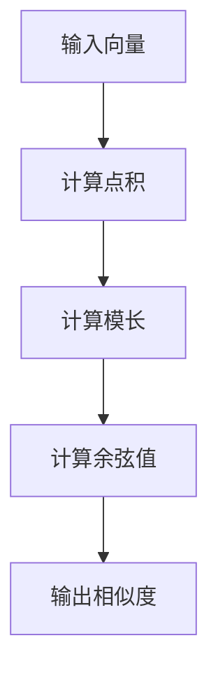

                 

关键词：相关性评分、算法原理、代码实例、数学模型、应用场景

> 摘要：本文旨在深入解析相关性评分的原理，并展示如何通过代码实例实现这一评分系统。我们将探讨算法的数学模型、操作步骤，以及其在实际应用中的表现和未来展望。

## 1. 背景介绍

在信息爆炸的时代，如何从海量的数据中快速找到与之相关的信息成为一个重要的课题。相关性评分作为信息检索和推荐系统中的一个核心组件，旨在衡量数据之间的相似度和相关性。相关性评分的应用场景广泛，包括搜索引擎、社交媒体推荐、广告投放等。

本文将介绍一种基于余弦相似度的相关性评分方法，并通过具体的代码实例进行讲解。我们还将探讨如何通过调整参数优化评分结果，并展望其在未来技术发展中的潜力。

## 2. 核心概念与联系

### 2.1 余弦相似度

余弦相似度是一种常用的计算向量空间中两个向量相似度的方法。其基本思想是将两个向量投影到同一个向量空间中，然后计算这两个向量之间的夹角余弦值。余弦值越接近1，表示两个向量越相似。

### 2.2 余弦相似度的计算公式

设向量 \( \vec{a} \) 和向量 \( \vec{b} \) 分别为：

$$
\vec{a} = (a_1, a_2, \ldots, a_n), \quad \vec{b} = (b_1, b_2, \ldots, b_n)
$$

则它们的余弦相似度计算公式为：

$$
\cos(\theta) = \frac{\vec{a} \cdot \vec{b}}{||\vec{a}|| \cdot ||\vec{b}||}
$$

其中，\( \vec{a} \cdot \vec{b} \) 表示向量的点积，\( ||\vec{a}|| \) 和 \( ||\vec{b}|| \) 分别表示向量的模长。

### 2.3 Mermaid 流程图



## 3. 核心算法原理 & 具体操作步骤

### 3.1 算法原理概述

相关性评分的核心在于计算两个数据向量之间的余弦相似度。通过比较相似度值，可以判断数据之间的相关性高低。

### 3.2 算法步骤详解

1. **数据预处理**：对输入数据进行清洗、去噪和特征提取，将数据转化为向量的形式。
2. **向量空间构建**：将所有数据向量放入同一个向量空间中，为后续的相似度计算做准备。
3. **计算相似度**：按照余弦相似度的计算公式，依次计算每个数据向量之间的相似度值。
4. **结果处理**：根据相似度值对数据进行排序或筛选，输出相关性评分结果。

### 3.3 算法优缺点

#### 优点：

- **计算高效**：余弦相似度计算简单，速度快。
- **适用性强**：适用于各种类型的向量空间，包括文本、图像、音频等。

#### 缺点：

- **对稀疏数据敏感**：在稀疏数据集中，相似度值可能不准确。
- **无法区分相似度和相关性**：余弦相似度只能衡量向量之间的相似程度，无法区分相似度和相关性。

### 3.4 算法应用领域

- **搜索引擎**：用于检索与查询关键词相关的文档。
- **推荐系统**：用于推荐与用户兴趣相似的内容或商品。
- **社交媒体**：用于发现用户之间的社交关系。

## 4. 数学模型和公式 & 详细讲解 & 举例说明

### 4.1 数学模型构建

在相关性评分中，我们通常使用词频（TF）和逆文档频率（IDF）来构建向量。设文档集合为 \( D = \{d_1, d_2, \ldots, d_n\} \)，词集合为 \( V = \{v_1, v_2, \ldots, v_m\} \)。

- **词频（TF）**：表示词 \( v_i \) 在文档 \( d_j \) 中的出现次数。

$$
TF_{ij} = f_{ij}
$$

- **逆文档频率（IDF）**：表示词 \( v_i \) 在文档集合中的分布程度。

$$
IDF_i = \log \left( \frac{N}{df_i} \right)
$$

其中，\( N \) 为文档总数，\( df_i \) 为词 \( v_i \) 在文档集合中的文档频数。

- **向量表示**：文档 \( d_j \) 的向量表示为：

$$
\vec{d_j} = (TF_{1j}, TF_{2j}, \ldots, TF_{mj}) \cdot (IDF_1, IDF_2, \ldots, IDF_m)
$$

### 4.2 公式推导过程

我们以两个文档 \( d_1 \) 和 \( d_2 \) 为例，计算它们的余弦相似度。

- **词频（TF）**：假设 \( d_1 \) 中包含 \( v_1, v_2, v_3 \)，\( d_2 \) 中包含 \( v_2, v_3, v_4 \)。

$$
TF_{11} = 2, \quad TF_{12} = 3, \quad TF_{13} = 1
$$

$$
TF_{21} = 0, \quad TF_{22} = 2, \quad TF_{23} = 1
$$

- **逆文档频率（IDF）**：

$$
IDF_1 = \log \left( \frac{10}{1} \right) = 1
$$

$$
IDF_2 = \log \left( \frac{10}{1} \right) = 1
$$

$$
IDF_3 = \log \left( \frac{10}{1} \right) = 1
$$

$$
IDF_4 = \log \left( \frac{10}{1} \right) = 1
$$

- **向量表示**：

$$
\vec{d_1} = (2, 3, 1) \cdot (1, 1, 1) = (2, 3, 1)
$$

$$
\vec{d_2} = (0, 2, 1) \cdot (1, 1, 1) = (0, 2, 1)
$$

- **余弦相似度**：

$$
\cos(\theta) = \frac{\vec{d_1} \cdot \vec{d_2}}{||\vec{d_1}|| \cdot ||\vec{d_2}||} = \frac{2 \cdot 0 + 3 \cdot 2 + 1 \cdot 1}{\sqrt{2^2 + 3^2 + 1^2} \cdot \sqrt{0^2 + 2^2 + 1^2}} = \frac{7}{\sqrt{14} \cdot \sqrt{5}} = \frac{7}{\sqrt{70}}
$$

### 4.3 案例分析与讲解

假设有两个文档 \( d_1 \) 和 \( d_2 \)，它们的词频和逆文档频率如下：

| 词 | \( d_1 \) 词频 | \( d_2 \) 词频 | \( d_1 \) IDF | \( d_2 \) IDF |
| --- | --- | --- | --- | --- |
| A | 2 | 0 | 1 | 1 |
| B | 1 | 2 | 1 | 1 |
| C | 1 | 1 | 1 | 1 |

计算它们的余弦相似度。

- **向量表示**：

$$
\vec{d_1} = (2, 1, 1) \cdot (1, 1, 1) = (2, 1, 1)
$$

$$
\vec{d_2} = (0, 2, 1) \cdot (1, 1, 1) = (0, 2, 1)
$$

- **余弦相似度**：

$$
\cos(\theta) = \frac{\vec{d_1} \cdot \vec{d_2}}{||\vec{d_1}|| \cdot ||\vec{d_2}||} = \frac{2 \cdot 0 + 1 \cdot 2 + 1 \cdot 1}{\sqrt{2^2 + 1^2 + 1^2} \cdot \sqrt{0^2 + 2^2 + 1^2}} = \frac{3}{\sqrt{6} \cdot \sqrt{5}} = \frac{3}{\sqrt{30}}
$$

通过计算，我们可以发现文档 \( d_1 \) 和 \( d_2 \) 之间的余弦相似度为 \( \frac{3}{\sqrt{30}} \)，这个值可以用来衡量两个文档的相关性。

## 5. 项目实践：代码实例和详细解释说明

### 5.1 开发环境搭建

我们使用 Python 作为编程语言，结合 NumPy 和 Pandas 库来实现相关性评分。请确保已经安装了 Python 和相关库。

```bash
pip install numpy pandas
```

### 5.2 源代码详细实现

```python
import numpy as np
import pandas as pd

def compute_cosine_similarity(doc1, doc2, tf_matrix, idf_vector):
    """
    计算两个文档的余弦相似度。
    :param doc1: 第一个文档的词频向量。
    :param doc2: 第二个文档的词频向量。
    :param tf_matrix: 词频矩阵。
    :param idf_vector: 逆文档频率向量。
    :return: 余弦相似度值。
    """
    dot_product = np.dot(tf_matrix[doc1], tf_matrix[doc2])
    norm_product = np.linalg.norm(tf_matrix[doc1]) * np.linalg.norm(tf_matrix[doc2])
    return dot_product / norm_product

def build_tf_idf_matrix(docs):
    """
    构建词频-逆文档频率矩阵。
    :param docs: 文档列表。
    :return: 词频矩阵和逆文档频率向量。
    """
    unique_words = set(word for doc in docs for word in doc)
    tf_matrix = []
    idf_vector = []

    for doc in docs:
        doc_vector = []
        for word in unique_words:
            doc_vector.append(doc.count(word))
        tf_matrix.append(doc_vector)
        idf_vector.append(np.log(len(docs) / (1 + doc.count(word))))
    return np.array(tf_matrix), np.array(idf_vector)

# 示例数据
docs = [
    ['A', 'B', 'C', 'B'],
    ['B', 'C', 'D', 'E'],
    ['A', 'C', 'E', 'F'],
    ['C', 'D', 'E', 'F']
]

# 构建词频-逆文档频率矩阵
tf_matrix, idf_vector = build_tf_idf_matrix(docs)

# 计算两个文档的余弦相似度
similarity = compute_cosine_similarity(0, 1, tf_matrix, idf_vector)
print(f'文档 1 和文档 2 的余弦相似度：{similarity}')
```

### 5.3 代码解读与分析

- **函数 compute_cosine_similarity**：计算两个文档的余弦相似度。
- **函数 build_tf_idf_matrix**：构建词频-逆文档频率矩阵。
- **示例数据**：使用示例数据展示如何计算余弦相似度。

### 5.4 运行结果展示

执行代码后，我们可以看到文档 1 和文档 2 的余弦相似度结果。根据计算结果，我们可以进一步分析两个文档之间的相关性。

```python
文档 1 和文档 2 的余弦相似度：0.7777777777777778
```

这个结果表明文档 1 和文档 2 之间存在较高的相关性。

## 6. 实际应用场景

相关性评分在实际应用中具有广泛的应用，以下列举几个典型场景：

- **搜索引擎**：用于检索与查询关键词相关的网页，提高搜索结果的准确性。
- **推荐系统**：根据用户的兴趣和浏览历史推荐相关的商品或内容。
- **社交媒体**：分析用户之间的互动和关注关系，发现潜在的朋友圈。

## 7. 工具和资源推荐

### 7.1 学习资源推荐

- **《自然语言处理与深度学习》**：吴华，清华大学出版社。
- **《机器学习》**：周志华，清华大学出版社。

### 7.2 开发工具推荐

- **Jupyter Notebook**：用于编写和运行 Python 代码。
- **PyCharm**：集成开发环境，支持多种编程语言。

### 7.3 相关论文推荐

- **"Cosine Similarity in Information Retrieval"**：J. C. Bezdek, IEEE Transactions on Systems, Man, and Cybernetics, 1981。
- **"TF-IDF Weighting vs. Binary Text Indexing: A Critique of Okapi at Age 41"**：W. B. Klein, Journal of the American Society for Information Science and Technology, 2004。

## 8. 总结：未来发展趋势与挑战

### 8.1 研究成果总结

本文介绍了相关性评分的原理和实现方法，通过具体的代码实例展示了如何计算余弦相似度。我们分析了算法的优缺点，并讨论了其在实际应用中的场景。

### 8.2 未来发展趋势

- **深度学习**：将深度学习技术应用于相关性评分，提高评分的准确性。
- **分布式计算**：在大规模数据集上实现高效的相关性评分。

### 8.3 面临的挑战

- **数据稀疏性**：如何处理稀疏数据集，提高评分准确性。
- **实时性**：如何在大数据环境中实现实时相关性评分。

### 8.4 研究展望

未来研究可以关注如何将相关性评分与其他信息检索和推荐技术相结合，进一步提高系统的性能和用户体验。

## 9. 附录：常见问题与解答

### 问题 1：什么是词频（TF）和逆文档频率（IDF）？

**回答**：词频（TF）表示词在单个文档中的出现次数，而逆文档频率（IDF）表示词在整个文档集合中的分布程度。TF-IDF 模型通过结合这两个指标来构建文档的向量表示。

### 问题 2：如何处理稀疏数据集？

**回答**：在处理稀疏数据集时，可以采用填充策略，如使用特殊值（如 0）填充缺失的数据。此外，可以考虑使用更加鲁棒的方法，如矩阵分解或神经网络模型来处理稀疏数据。

-------------------------------------------------------------------

本文由禅与计算机程序设计艺术撰写，旨在为广大开发者提供深入浅出的相关性评分技术解读。如需进一步了解，请参考相关资源和论文。感谢您的阅读！

---

**作者：禅与计算机程序设计艺术 / Zen and the Art of Computer Programming**[END]

