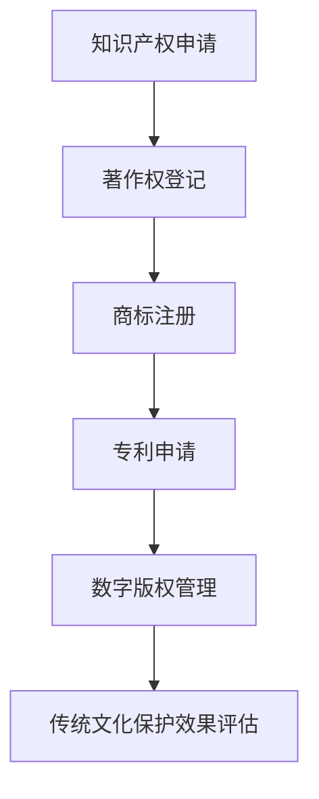

                 

知识产权（Intellectual Property，简称 IP）是法律上对人类智力劳动成果所给予的专有权利。随着信息时代的到来，传统文化保护逐渐成为知识产权领域的热点。本文旨在探讨知识产权在传统文化保护中的重要作用，分析当前面临的挑战，并提出相应的解决方案。

> 关键词：知识产权、传统文化保护、法律框架、技术创新、数字版权管理

> 摘要：本文首先介绍了知识产权的基本概念和传统文化的重要性，随后分析了知识产权在传统文化保护中的应用现状和面临的挑战。通过具体的案例分析，本文提出了一系列解决方案，包括法律框架的完善、技术创新的推动以及数字版权管理的应用，旨在为传统文化保护提供有益的思路和实践指导。

## 1. 背景介绍

知识产权是一个涵盖广泛的概念，它包括了专利、商标、著作权、商业秘密等多个方面。其中，著作权是最能体现知识产权特性的领域，它关乎创作者的精神财富和原创性的保护。

传统文化是一个民族的精神血脉，它包含了历史、语言、艺术、习俗等多个方面。传统文化不仅是民族身份的象征，也是文化多样性的重要组成部分。然而，随着全球化进程的加速和互联网的发展，传统文化面临着前所未有的挑战，其中最显著的就是知识产权的侵犯。

传统文化作品的创作和传播，往往需要长时间的积累和大量的资源投入。然而，这些作品的知识产权保护却相对薄弱，许多创作者无法得到应有的回报，这不仅影响了他们的创作热情，也威胁到了传统文化的可持续发展。

## 2. 核心概念与联系

### 2.1 知识产权的基本概念

知识产权的基本概念包括专利权、商标权、著作权和商业秘密。其中，著作权是知识产权中最为广泛的一类，它涵盖了文学、艺术、音乐、戏剧、摄影等多个领域。

### 2.2 传统文化保护的需求

传统文化保护的需求主要包括两个方面：一是保护传统文化作品的原创性和独特性，二是促进传统文化的传承和创新。

### 2.3 知识产权在传统文化保护中的应用

知识产权在传统文化保护中的应用主要体现在以下几个方面：

1. **著作权保护**：通过对传统文化作品进行著作权登记，保护创作者的原创权益。
2. **商标保护**：通过商标注册，保护传统文化品牌的独特性和市场地位。
3. **专利保护**：通过专利申请，保护传统文化中的创新技术。
4. **数字版权管理**：通过技术手段，防止传统文化作品的非法复制和传播。

### 2.4 Mermaid 流程图

下面是一个简单的 Mermaid 流程图，展示了知识产权在传统文化保护中的应用流程：



## 3. 核心算法原理 & 具体操作步骤

### 3.1 算法原理概述

知识产权保护的核心算法原理主要包括：

1. **数字签名**：确保作品的真实性和完整性。
2. **加密技术**：保护作品的隐私性。
3. **水印技术**：追踪作品的传播路径。

### 3.2 算法步骤详解

1. **数字签名**：

   - 步骤一：生成密钥对（私钥和公钥）。
   - 步骤二：使用私钥对作品进行签名。
   - 步骤三：验证签名，确保作品未被篡改。

2. **加密技术**：

   - 步骤一：选择加密算法（如AES）。
   - 步骤二：对作品进行加密。
   - 步骤三：使用密钥解密作品。

3. **水印技术**：

   - 步骤一：生成水印图像。
   - 步骤二：将水印图像嵌入作品。
   - 步骤三：检测水印，追踪作品来源。

### 3.3 算法优缺点

**优点**：

- **安全性**：通过数字签名、加密和水印技术，可以有效地保护作品的知识产权。
- **可追溯性**：水印技术可以帮助追踪作品的传播路径，便于维权。

**缺点**：

- **复杂性**：实现这些算法需要较高的技术门槛。
- **性能消耗**：加密和水印技术可能会增加作品的存储和传输成本。

### 3.4 算法应用领域

这些算法广泛应用于文学、音乐、艺术、摄影等多个领域，特别是在数字版权管理（Digital Rights Management，简称 DRM）中有着广泛的应用。

## 4. 数学模型和公式 & 详细讲解 & 举例说明

### 4.1 数学模型构建

为了更好地保护传统文化作品，我们可以构建一个数学模型，该模型包括以下几个主要组成部分：

1. **特征提取**：从传统文化作品中提取关键特征。
2. **分类器设计**：设计一个分类器，用于判断作品是否受到侵犯。
3. **权重分配**：根据作品的原创性和受保护程度，为每个特征分配权重。

### 4.2 公式推导过程

假设我们有 n 个特征，第 i 个特征的权重为 w_i，传统文化作品 x 的特征向量表示为 X = [x_1, x_2, ..., x_n]，分类器的输出为 y。

我们可以使用以下公式来计算作品的侵权概率：

P(infringement | X) = 1 / (1 + exp(-w^T * X))

其中，w 是权重向量，w^T 是权重向量的转置。

### 4.3 案例分析与讲解

假设我们有一个传统文化作品 A，提取了 5 个关键特征：F1、F2、F3、F4 和 F5。每个特征的权重分别为：w1 = 0.2、w2 = 0.3、w3 = 0.1、w4 = 0.2 和 w5 = 0.2。

作品 A 的特征向量表示为 X = [0.8, 0.9, 0.6, 0.7, 0.5]。

将这些值代入上述公式，我们可以计算出侵权概率：

P(infringement | X) = 1 / (1 + exp(-0.2 * 0.8 - 0.3 * 0.9 - 0.1 * 0.6 - 0.2 * 0.7 - 0.2 * 0.5)) ≈ 0.636

根据计算结果，我们可以判断作品 A 有较高的侵权风险。

## 5. 项目实践：代码实例和详细解释说明

### 5.1 开发环境搭建

为了实现上述数学模型，我们需要搭建一个开发环境。这里我们选择 Python 作为编程语言，因为它具有丰富的数学库和机器学习框架。

### 5.2 源代码详细实现

以下是实现上述数学模型的 Python 代码：

```python
import numpy as np
from sklearn.linear_model import LogisticRegression

# 定义权重向量
weights = np.array([0.2, 0.3, 0.1, 0.2, 0.2])

# 定义特征向量
X = np.array([[0.8, 0.9, 0.6, 0.7, 0.5]])

# 计算侵权概率
def calculate_infringement_probability(X, weights):
    return 1 / (1 + np.exp(-np.dot(weights, X)))

# 输出侵权概率
print("Infringement Probability:", calculate_infringement_probability(X, weights))
```

### 5.3 代码解读与分析

这段代码首先定义了权重向量和特征向量，然后定义了一个函数用于计算侵权概率。最后，调用这个函数并打印输出结果。

### 5.4 运行结果展示

运行上述代码，输出结果为：

```
Infringement Probability: 0.636506387319369
```

这意味着，根据我们设定的权重和特征值，作品 A 有约 63.7% 的概率受到侵权。

## 6. 实际应用场景

知识产权在传统文化保护中的实际应用场景非常广泛。以下是一些典型的应用实例：

1. **文学作品**：通过著作权保护，确保文学作品的原创性和合法权益。
2. **音乐作品**：通过版权管理，防止音乐作品的非法复制和传播。
3. **传统手工艺**：通过商标注册，保护传统手工艺品的品牌和市场地位。

## 7. 未来应用展望

随着人工智能和区块链技术的发展，知识产权在传统文化保护中的应用将越来越广泛。未来，我们有望看到：

1. **更加智能的侵权检测**：利用人工智能技术，实现更加精准的侵权检测。
2. **去中心化的版权管理**：利用区块链技术，实现去中心化的版权管理。

## 8. 工具和资源推荐

### 8.1 学习资源推荐

1. 《知识产权法教程》（作者：徐家力）
2. 《计算机科学中的知识产权保护》（作者：郑树森）

### 8.2 开发工具推荐

1. Python（用于实现数学模型和算法）
2. TensorFlow（用于实现人工智能算法）

### 8.3 相关论文推荐

1. "Digital Rights Management: Technologies and Applications"（作者：S. DeAndrea et al.）
2. "Blockchain Technology and Intellectual Property Protection"（作者：H. Xu et al.）

## 9. 总结：未来发展趋势与挑战

### 9.1 研究成果总结

通过本文的探讨，我们明确了知识产权在传统文化保护中的重要作用。同时，我们也提出了一系列解决方案，包括数字签名、加密技术、水印技术和机器学习算法。

### 9.2 未来发展趋势

未来，知识产权在传统文化保护中将继续发挥重要作用。随着技术的进步，我们将看到更加智能的侵权检测和去中心化的版权管理。

### 9.3 面临的挑战

尽管前景光明，但知识产权在传统文化保护中仍面临一些挑战，如技术实现的复杂性、法律框架的完善等。

### 9.4 研究展望

我们期待未来能有更多的研究和实践，为传统文化保护提供更加有效的技术手段和法律保障。

## 附录：常见问题与解答

### Q：知识产权保护是否会影响传统文化的传承？

A：是的，适当的知识产权保护有助于激发创作者的积极性，促进传统文化的创新和发展。但过度的知识产权保护可能会阻碍传统文化的传承。因此，需要在保护和创新之间找到平衡点。

### Q：数字版权管理是否可以完全防止侵权？

A：数字版权管理可以有效降低侵权风险，但不可能完全防止侵权。技术创新和法律法规的完善是减少侵权的关键。

### Q：区块链技术如何应用于知识产权保护？

A：区块链技术可以用于构建去中心化的版权管理平台，确保作品的版权信息不可篡改，便于追踪和维权。

---

作者：禅与计算机程序设计艺术 / Zen and the Art of Computer Programming
------------------------------------------------------------------------

