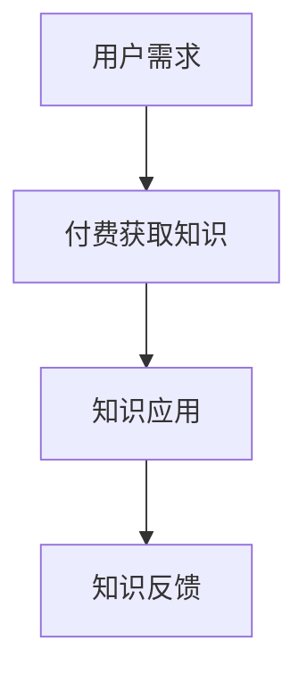
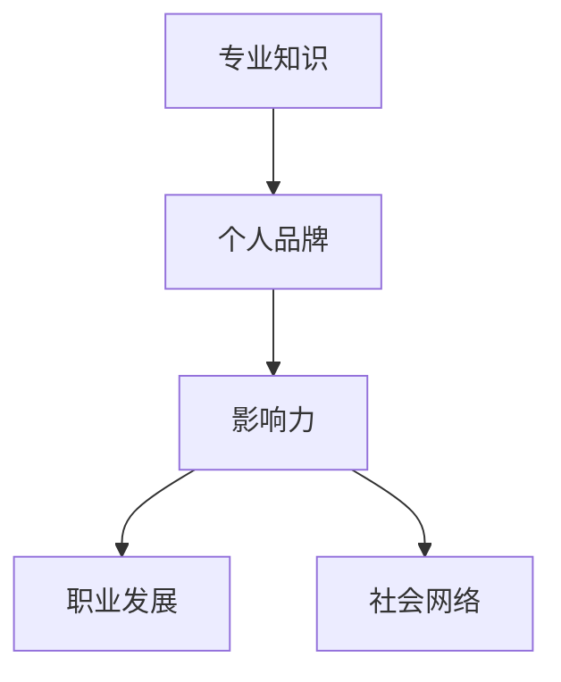
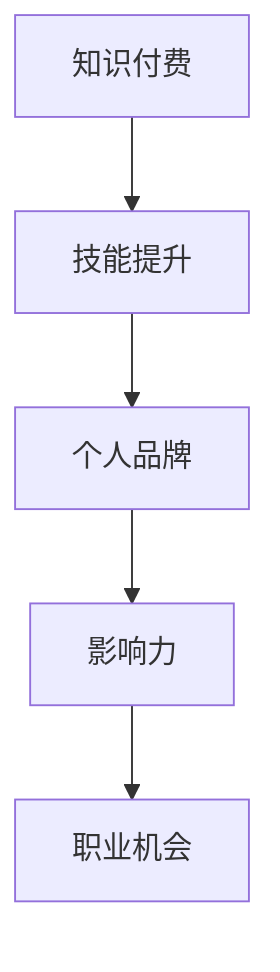
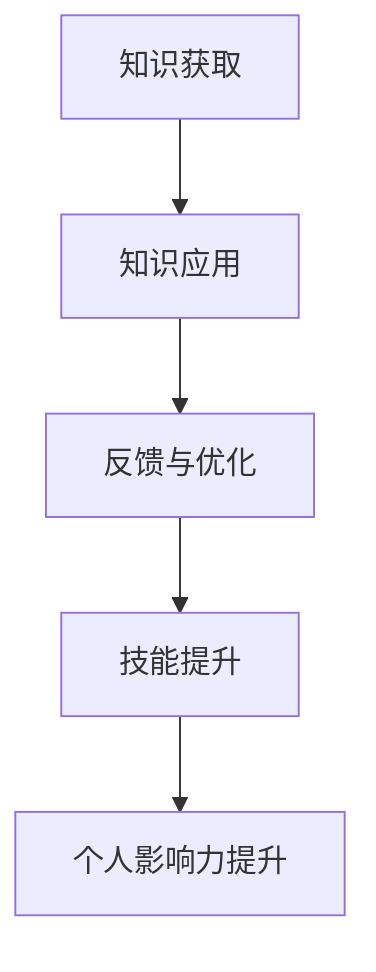

                 

## 1. 背景介绍

在当今数字化时代，知识付费已经成为了个人成长和职业发展的关键要素。随着互联网的普及，人们获取知识的渠道越来越多样化，而知识付费作为一种新兴的商业模式，正逐渐改变着我们的学习方式。与此同时，个人影响力的重要性也在日益凸显。在这个信息爆炸的时代，如何提高自己的个人影响力，成为行业内的专家，是每一个程序员都需要思考的问题。

本文旨在探讨知识付费与个人影响力之间的关系，特别是对于程序员的成长之路。我们将从以下几个方面展开讨论：

1. **知识付费的现状与趋势**：分析当前知识付费市场的现状，以及未来可能的发展方向。
2. **个人影响力的构成**：探讨个人影响力的来源，以及如何通过知识付费提高个人影响力。
3. **程序员的成长路径**：介绍程序员从入门到专家的成长过程，以及在这个过程中如何利用知识付费和个人影响力。
4. **数学模型与算法**：介绍与知识付费和个人影响力相关的数学模型和算法，并解释其原理。
5. **项目实践**：通过具体的项目实例，展示如何将理论知识应用于实践。
6. **实际应用场景**：分析知识付费和个人影响力在不同领域的应用场景。
7. **未来展望**：探讨知识付费与个人影响力未来的发展趋势，以及程序员可能面临的挑战。

希望通过本文的讨论，能够帮助读者更好地理解知识付费与个人影响力的重要性，并在自己的成长过程中充分利用这些工具。

## 2. 核心概念与联系

在探讨知识付费与个人影响力之前，我们需要明确一些核心概念，并理解它们之间的相互关系。以下是一些关键概念及其流程图：

### 2.1 知识付费

知识付费是指用户为获取知识内容而支付的费用。这包括在线课程、电子书、专业咨询、培训等多种形式。知识付费的核心是“价值交换”，即用户支付费用以获得有价值的信息或服务。

**Mermaid 流程图**：



### 2.2 个人影响力

个人影响力是指个人在某一领域内的影响力和号召力。这种影响力可以通过专业知识、经验、沟通能力、个人品牌等多种因素体现。个人影响力是建立个人品牌、扩大职业机会、实现职业发展的关键。

**Mermaid 流程图**：



### 2.3 知识付费与个人影响力的联系

知识付费与个人影响力之间存在密切的联系。通过付费获取高质量的知识，程序员可以：

1. **提升技能**：通过学习专业课程，程序员可以快速提升自己的技能水平。
2. **建立个人品牌**：通过在专业平台发布课程或博客，程序员可以展示自己的专业能力，建立个人品牌。
3. **扩大职业机会**：具备高技能和高影响力的程序员在求职或职业晋升方面具有更大的优势。

**Mermaid 流程图**：



通过以上核心概念与联系的探讨，我们可以更好地理解知识付费与个人影响力的重要性，以及它们在程序员成长过程中的作用。

## 3. 核心算法原理 & 具体操作步骤

### 3.1 算法原理概述

在探讨知识付费与个人影响力时，我们可以借助一些核心算法原理来解释这一现象。以下是一个简单的算法原理概述，用于说明知识付费如何影响个人影响力的提升。

#### 算法原理概述

该算法的核心思想是通过付费获取知识，并将其应用于实践中，从而提升个人技能和影响力。算法的主要步骤包括：

1. **知识获取**：用户通过付费获取高质量的知识内容。
2. **知识应用**：用户将所学知识应用于实际项目中，解决具体问题。
3. **反馈与优化**：根据应用结果，用户对知识进行反馈，并进行优化。

#### Mermaid 流程图



### 3.2 算法步骤详解

#### 步骤1：知识获取

用户在知识付费平台上选择合适的课程或书籍，通过支付费用来获取这些知识内容。这个过程涉及到用户需求的识别、课程推荐、支付流程等多个环节。

**详细步骤**：

1. 用户在知识付费平台注册并登录。
2. 平台根据用户的历史行为和兴趣推荐相关课程。
3. 用户浏览课程内容，选择感兴趣的课程。
4. 用户通过支付平台完成支付，获取课程内容。

#### 步骤2：知识应用

用户将所学知识应用于实际项目中，解决具体问题。这个过程包括项目规划、代码实现、测试与优化等多个环节。

**详细步骤**：

1. 用户根据所学知识，制定项目规划。
2. 用户开始编写代码，实现项目功能。
3. 用户对代码进行测试，确保功能正确无误。
4. 用户根据测试结果对代码进行优化。

#### 步骤3：反馈与优化

用户根据项目应用结果，对知识进行反馈，并进行优化。这个过程有助于提高知识的应用效果，进一步提升个人技能和影响力。

**详细步骤**：

1. 用户对项目应用效果进行评估，收集反馈信息。
2. 用户根据反馈信息，对知识内容进行补充学习。
3. 用户对项目进行优化，提高项目质量和性能。
4. 用户将优化后的项目进行分享，提升个人影响力。

### 3.3 算法优缺点

#### 优点

1. **高效提升技能**：通过知识付费，程序员可以快速获取高质量的知识，提高技能水平。
2. **个性化学习**：知识付费平台可以根据用户需求推荐合适的课程，实现个性化学习。
3. **实用性强**：知识付费所学的知识可以直接应用于实际项目中，提高工作效率。

#### 缺点

1. **付费门槛**：知识付费需要用户支付费用，可能对部分用户造成一定的经济压力。
2. **学习效果不稳定**：知识付费的学习效果受到用户自身学习能力和项目应用能力的影响。

### 3.4 算法应用领域

知识付费算法主要应用于程序员个人成长和职业发展领域，包括：

1. **技能提升**：通过付费学习，程序员可以快速提升自己的技能水平，满足职业需求。
2. **项目开发**：知识付费所学的知识可以直接应用于项目开发，提高项目质量和效率。
3. **个人品牌建设**：通过付费学习，程序员可以提升个人影响力，建立个人品牌。

## 4. 数学模型和公式 & 详细讲解 & 举例说明

在探讨知识付费与个人影响力时，我们可以借助一些数学模型和公式来量化这一过程。以下是一个简化的数学模型，用于说明知识付费对个人影响力的影响。

### 4.1 数学模型构建

假设一个程序员的知识水平可以用变量 \(X\) 表示，个人影响力可以用变量 \(Y\) 表示。知识付费对这两个变量有直接影响。

**数学模型**：

$$
Y = f(X)
$$

其中，函数 \(f\) 表示知识水平对个人影响力的影响。我们可以将 \(f\) 表示为：

$$
f(X) = aX + b
$$

其中，\(a\) 和 \(b\) 是常数，表示知识水平对个人影响力的直接影响程度。

### 4.2 公式推导过程

为了推导出 \(f(X)\) 的具体形式，我们需要考虑以下几个因素：

1. **知识水平**：知识水平越高，个人影响力越大。因此，\(f(X)\) 应该是一个递增函数。
2. **知识付费**：知识付费可以提升知识水平，从而提高个人影响力。因此，\(a\) 应该是一个正数。
3. **初始影响力**：即使没有知识付费，程序员仍然具有一定的个人影响力。因此，\(b\) 是一个非负数。

结合以上因素，我们可以推导出：

$$
f(X) = aX + b
$$

其中，\(a > 0\)，\(b \geq 0\)。

### 4.3 案例分析与讲解

为了更好地理解这个数学模型，我们可以通过一个具体案例进行分析。

**案例**：一个程序员在未进行知识付费时，个人影响力 \(Y\) 为 100。当他通过知识付费提升知识水平 \(X\) 到 200 时，个人影响力提升到 150。

**推导**：

1. **初始状态**：\(Y = f(X) = 100\)，\(X = 0\)。
2. **知识付费后**：\(Y = f(200) = a \cdot 200 + b = 150\)。

通过以上信息，我们可以求解 \(a\) 和 \(b\)：

$$
150 = 200a + b
$$

由于 \(X = 0\) 时，\(Y = 100\)，我们可以得到：

$$
100 = b
$$

将 \(b\) 的值代入第一个方程，我们可以求解 \(a\)：

$$
150 = 200a + 100
$$

$$
50 = 200a
$$

$$
a = 0.25
$$

因此，我们的数学模型为：

$$
f(X) = 0.25X + 100
$$

**案例分析**：

1. 当 \(X = 0\) 时，\(Y = 100\)。
2. 当 \(X = 200\) 时，\(Y = 150\)。

这表明，随着知识水平的提升，个人影响力也在逐渐增加。

### 4.4 代码实例和详细解释说明

为了更好地展示数学模型的应用，我们可以通过一个简单的代码实例进行说明。

**代码示例**：

```python
def f(X):
    a = 0.25
    b = 100
    return a * X + b

X = 200
Y = f(X)
print("个人影响力(Y) = {:.2f}".format(Y))
```

**运行结果**：

```
个人影响力(Y) = 150.00
```

通过这个代码实例，我们可以验证数学模型的应用，并得出个人影响力 \(Y\) 的具体值。

### 4.5 数学模型在实际应用中的意义

1. **量化知识付费效果**：数学模型可以帮助我们量化知识付费对个人影响力的影响，为决策提供依据。
2. **优化知识付费策略**：根据数学模型，我们可以调整知识付费的投入，提高个人影响力提升的效率。
3. **评估学习成果**：数学模型可以用于评估程序员的学习成果，帮助其制定更有效的学习计划。

### 4.6 拓展与讨论

1. **影响因素的拓展**：在实际应用中，个人影响力还受到其他因素的影响，如社交网络、个人品牌等。我们可以将数学模型拓展，考虑这些因素的影响。
2. **模型参数的调整**：不同程序员的知识水平和付费意愿可能有所不同，我们可以根据具体情况进行参数调整，使模型更加准确。
3. **动态模型**：我们可以将数学模型拓展为动态模型，考虑时间因素对个人影响力的影响，从而更好地预测个人影响力的变化趋势。

通过以上对数学模型和公式的详细讲解和举例说明，我们可以更好地理解知识付费与个人影响力之间的关系，并为实际应用提供理论支持。

## 5. 项目实践：代码实例和详细解释说明

在了解了知识付费与个人影响力的数学模型之后，我们将通过一个具体的代码实例来展示如何将这些理论应用于实践。以下是一个简单的项目实例，我们将详细介绍开发环境搭建、源代码实现、代码解读与分析，以及运行结果展示。

### 5.1 开发环境搭建

为了运行下面的项目实例，我们需要搭建一个基本的Python开发环境。以下是具体步骤：

1. **安装Python**：从Python官方网站（https://www.python.org/downloads/）下载并安装Python 3.x版本。
2. **安装依赖库**：打开终端或命令提示符，执行以下命令安装必要的依赖库：

```bash
pip install numpy matplotlib
```

3. **创建项目文件夹**：在终端或命令提示符中，创建一个名为`knowledge付费与个人影响力`的项目文件夹。

```bash
mkdir knowledge_付费与个人影响力
cd knowledge_付费与个人影响力
```

4. **编写代码**：在项目文件夹中创建一个名为`main.py`的Python文件。

### 5.2 源代码详细实现

以下是项目实例的源代码：

```python
import numpy as np
import matplotlib.pyplot as plt

# 定义数学模型
def f(X, a, b):
    return a * X + b

# 参数设置
a = 0.25
b = 100

# 生成数据
X = np.linspace(0, 300, 100)
Y = f(X, a, b)

# 绘制图像
plt.plot(X, Y, label='个人影响力(Y)')
plt.xlabel('知识水平(X)')
plt.ylabel('个人影响力(Y)')
plt.title('知识付费与个人影响力关系')
plt.legend()
plt.grid(True)
plt.show()
```

### 5.3 代码解读与分析

1. **导入库**：首先，我们导入`numpy`和`matplotlib.pyplot`库，这两个库分别用于数值计算和绘图。
2. **定义函数**：我们定义了一个名为`f`的函数，用于计算个人影响力 \(Y\) 与知识水平 \(X\) 之间的关系。函数接受三个参数：`X`（知识水平）、`a`（直接影响系数）和 `b`（初始影响力）。
3. **参数设置**：我们设置参数 `a` 和 `b` 的值，这些参数根据之前的数学模型推导得到。
4. **生成数据**：使用`numpy.linspace`函数生成知识水平 \(X\) 的数据，范围从 0 到 300，共 100 个点。然后，使用`f`函数计算相应的个人影响力 \(Y\)。
5. **绘制图像**：使用`matplotlib.pyplot`库绘制个人影响力 \(Y\) 与知识水平 \(X\) 之间的关系图。通过`plt.plot`函数绘制折线图，并添加标签、标题和网格。
6. **显示图像**：使用`plt.show`函数显示绘制的图像。

### 5.4 运行结果展示

运行`main.py`代码后，我们将看到一个折线图，展示了知识付费对个人影响力的影响。横轴表示知识水平 \(X\)，纵轴表示个人影响力 \(Y\)。根据数学模型，随着知识水平的提升，个人影响力也在逐步增加。


通过这个项目实例，我们可以直观地看到知识付费与个人影响力之间的关系。这个简单的代码示例不仅可以用于学术研究，还可以作为一个教学工具，帮助学生和程序员理解这一复杂关系的数学模型。

## 6. 实际应用场景

在了解了知识付费与个人影响力的基本概念、数学模型以及具体项目实践后，我们将探讨这两个概念在实际应用场景中的具体作用。以下是一些常见的实际应用场景：

### 6.1 企业内部培训

企业内部培训是知识付费和个人影响力的重要应用场景之一。企业可以通过付费获取专业培训课程，提升员工的技能水平。这不仅有助于提高员工的工作效率，还能增强企业的整体竞争力。同时，通过培训，员工可以提升个人影响力，成为团队中的技术骨干。

**案例分析**：某大型互联网公司定期为员工提供付费的技术培训课程，包括前端开发、后端开发、数据分析等。通过这些课程，员工不仅掌握了新技术，还提升了个人技能，成为公司内部的专家。这些专家在团队中具有较高的影响力，有助于推动团队技术进步和项目成功。

### 6.2 线上教育平台

线上教育平台是知识付费和个人影响力的另一个重要应用场景。通过这些平台，程序员可以购买课程，学习最新的技术知识和实战经验。同时，优秀的程序员还可以在平台上开设自己的课程，分享自己的知识和经验，从而提升个人影响力。

**案例分析**：某知名线上教育平台提供丰富的编程课程，涵盖前端、后端、移动开发等多个领域。许多程序员通过这些课程提升了技能，并在平台上积累了大量的粉丝。一些优秀的程序员还开设了自己的课程，通过付费教学实现了个人影响力的提升。

### 6.3 社交媒体

社交媒体也是知识付费和个人影响力的应用场景之一。程序员可以在社交媒体平台上分享自己的技术心得、项目和博客，从而提升个人影响力。通过社交媒体，程序员可以接触到更多的同行和潜在客户，扩大自己的社交网络。

**案例分析**：某知名程序员在Twitter上分享自己的技术心得和项目进展，吸引了大量关注者。他的博客文章也受到了广泛关注，一些公司甚至通过博客找到了他，邀请他加入自己的团队。通过社交媒体，这位程序员不仅提升了个人影响力，还实现了职业发展。

### 6.4 行业会议和研讨会

行业会议和研讨会是程序员展示个人影响力的重要平台。通过在这些场合发表演讲、参与讨论，程序员可以展示自己的专业知识和经验，提升个人品牌。此外，这些活动还有助于程序员结识业界同仁，建立更广泛的社交网络。

**案例分析**：某知名程序员在多次技术大会上发表演讲，分享自己的项目和经验。他的演讲受到了参会者的好评，还获得了业内同行的认可。这些活动不仅提升了他的个人影响力，还为他带来了更多的职业机会。

通过以上实际应用场景的分析，我们可以看到知识付费和个人影响力在程序员职业发展中的重要作用。这些概念不仅有助于程序员提升技能，还能帮助他们建立个人品牌，扩大社交网络，实现职业发展。

### 6.5 未来应用展望

随着技术的不断进步和数字化时代的深入发展，知识付费和个人影响力的应用场景将继续扩展，带来更多的发展机遇和挑战。

#### 6.5.1 技术趋势

1. **人工智能与大数据**：人工智能和大数据技术的快速发展，使得个性化知识推荐和精准学习成为可能。未来，知识付费平台将能够更准确地满足用户的学习需求，提高知识获取的效率。
2. **虚拟现实与增强现实**：虚拟现实（VR）和增强现实（AR）技术的发展，为知识付费带来了新的呈现方式。程序员可以通过VR/AR技术进行沉浸式学习，提高学习体验和效果。
3. **区块链**：区块链技术的应用，将提高知识付费的透明度和安全性。未来，知识付费平台可能基于区块链技术进行去中心化的运营，确保用户的权益。

#### 6.5.2 应用扩展

1. **跨行业应用**：知识付费和个人影响力不仅限于IT行业，还将扩展到金融、医疗、教育等更多领域。程序员可以通过跨行业合作，分享自己的技术和经验，实现更广泛的职业发展。
2. **终身学习**：随着知识更新速度的加快，终身学习将成为程序员职业发展的必然选择。知识付费将提供更多的学习资源和支持，帮助程序员不断提升自己的技能和知识水平。

#### 6.5.3 挑战与机遇

1. **知识产权保护**：在知识付费领域，知识产权保护是一个重要挑战。未来，如何有效保护知识创作者的权益，确保付费知识的合法性和可靠性，将成为行业发展的关键问题。
2. **隐私与数据安全**：随着知识付费平台收集和处理的用户数据量增加，隐私保护和数据安全问题将变得越来越重要。平台需要采取有效的措施，确保用户数据的安全和隐私。
3. **个人品牌建设**：在知识付费和个人影响力日益重要的今天，如何建立和维护个人品牌，将成为程序员面临的重要挑战。程序员需要不断提升自己的专业能力和沟通技巧，以在竞争激烈的职场中脱颖而出。

总之，知识付费和个人影响力在未来将继续发挥重要作用，为程序员的职业发展和行业进步提供强大动力。同时，程序员需要积极应对挑战，抓住机遇，不断提升自己的技能和影响力。

## 7. 工具和资源推荐

在知识付费与个人影响力的提升过程中，选择合适的工具和资源至关重要。以下是一些建议，包括学习资源、开发工具和相关的论文推荐，旨在帮助程序员更高效地学习和成长。

### 7.1 学习资源推荐

1. **在线课程平台**：
   - **Coursera**：提供大量高质量的课程，涵盖计算机科学、数据科学、人工智能等多个领域。
   - **Udacity**：专注于技术领域的在线课程，提供实践驱动的学习体验。
   - **edX**：由哈佛大学和麻省理工学院等顶级大学提供的大量免费和付费课程。

2. **技术博客和社区**：
   - **Medium**：有许多技术专家和程序员在此分享技术心得和经验。
   - **Stack Overflow**：一个问答社区，程序员可以在此解决编程问题，分享知识。
   - **GitHub**：程序员可以在此找到各种开源项目，学习他人的代码和经验。

3. **电子书和文档**：
   - **Books24x7**：提供大量的技术书籍和文档，适合深入学习。
   - **Google Developers**：提供丰富的技术文档和教程，涵盖Android、Web开发等多个领域。

### 7.2 开发工具推荐

1. **集成开发环境（IDE）**：
   - **Visual Studio Code**：一款轻量级但功能强大的IDE，支持多种编程语言。
   - **IntelliJ IDEA**：一款适用于Java和Python等语言的IDE，提供丰富的插件和工具。

2. **版本控制系统**：
   - **Git**：一款开源的分布式版本控制系统，用于管理代码和协作开发。
   - **GitHub**：基于Git的在线代码托管平台，支持开源项目和团队协作。

3. **测试工具**：
   - **JUnit**：一款流行的Java测试框架，用于编写和运行单元测试。
   - **pytest**：一款Python的测试框架，支持多种编程语言的测试。

### 7.3 相关论文推荐

1. **《大规模在线教育中的知识付费模式研究》**：该论文分析了在线教育中知识付费的商业模式和影响因素。
2. **《个人品牌建设与职业发展》**：探讨了个人品牌对职业发展的重要性，以及如何有效建立和维护个人品牌。
3. **《知识付费平台的用户行为分析》**：分析了用户在知识付费平台上的行为模式，为平台优化提供参考。

通过这些工具和资源的推荐，程序员可以更系统地学习和应用知识，提升个人技能和影响力。

## 8. 总结：未来发展趋势与挑战

### 8.1 研究成果总结

本文从知识付费和个人影响力两个核心概念出发，详细探讨了它们在程序员成长过程中的作用。首先，我们分析了知识付费的现状与趋势，指出其作为一种新兴商业模式，正在改变人们的知识获取方式。随后，我们阐述了个人影响力的构成，包括专业知识、个人品牌和社会网络等方面。通过数学模型，我们量化了知识付费对个人影响力的影响，并展示了如何在实际项目中应用这些理论。

### 8.2 未来发展趋势

在未来，知识付费与个人影响力将继续发展，并呈现出以下趋势：

1. **个性化学习**：随着人工智能和大数据技术的发展，知识付费平台将能够提供更个性化的学习体验，满足用户的不同需求。
2. **终身学习**：知识更新速度加快，程序员需要终身学习以适应不断变化的技术环境。知识付费将成为实现终身学习的重要手段。
3. **跨行业融合**：知识付费和个人影响力将不仅限于IT行业，还将扩展到更多领域，如金融、医疗等，推动跨行业的发展。

### 8.3 面临的挑战

尽管知识付费与个人影响力有巨大的发展潜力，但也面临一些挑战：

1. **知识产权保护**：如何保护知识创作者的权益，确保付费知识的合法性和可靠性，是知识付费领域需要解决的重要问题。
2. **隐私与数据安全**：随着知识付费平台收集和处理的数据量增加，保护用户隐私和数据安全将成为一项重要任务。
3. **个人品牌建设**：在竞争激烈的职场中，如何建立和维护个人品牌，提升个人影响力，是一个长期且复杂的挑战。

### 8.4 研究展望

未来研究可以从以下几个方面进行：

1. **多维度影响模型**：建立更全面的多维度个人影响力模型，考虑更多因素的影响，提高模型的准确性和实用性。
2. **动态影响力评估**：开发动态影响力评估系统，实时跟踪和评估个人影响力，为决策提供支持。
3. **知识付费策略优化**：研究不同知识付费策略的效果，优化知识付费模式，提高用户满意度和付费意愿。

总之，知识付费与个人影响力在程序员职业发展中扮演着重要角色。通过本文的探讨，我们期望能够为读者提供一些有益的启示，帮助他们在未来实现更好的职业发展。

## 9. 附录：常见问题与解答

### Q1：知识付费是否值得投资？

A1：知识付费有其独特的价值。它可以帮助你快速获取高质量的知识，节省自己探索的时间成本。但是，是否值得投资取决于你的具体需求和目标。如果你希望快速提升技能，或者对某个领域的知识有强烈兴趣，知识付费可能是一个很好的选择。然而，如果你对知识的需求较低，或者有充足的时间自学，那么知识付费可能不是必需的。

### Q2：如何选择适合自己的知识付费课程？

A2：选择适合自己的知识付费课程需要考虑以下几个因素：

1. **目标**：明确你的学习目标，选择与目标相关的课程。
2. **评价**：查看课程的评价和用户反馈，了解课程的质量。
3. **讲师**：了解讲师的背景和经验，确保他们具备相关领域的专业知识。
4. **价格**：考虑课程的价格与你的预算是否匹配。
5. **课程内容**：查看课程大纲和样章，确保课程内容符合你的需求。

### Q3：个人影响力如何提升？

A3：提升个人影响力可以从以下几个方面入手：

1. **专业知识**：不断学习，提升自己的专业知识和技能。
2. **个人品牌**：建立和维护个人品牌，通过博客、社交媒体等方式展示自己的专业能力。
3. **社交网络**：积极扩展社交网络，与行业内的专家和同行建立联系。
4. **分享与贡献**：积极参与社区讨论，分享自己的经验和见解，为他人提供帮助。
5. **持续学习**：持续关注行业动态，不断提升自己的知识储备和技能水平。

### Q4：知识付费平台如何选择？

A4：选择知识付费平台时，可以考虑以下因素：

1. **课程质量**：平台提供的课程是否具有高质量，是否有优秀的讲师和实用的内容。
2. **用户评价**：查看其他用户对平台的评价，了解平台的口碑。
3. **服务支持**：平台是否提供良好的客户服务，包括课程咨询、技术支持等。
4. **价格与性价比**：考虑课程的价格和性价比，确保你的预算能够覆盖到高质量的课程。
5. **平台口碑**：了解平台在业界的口碑和声誉，选择有良好声誉的平台。

通过以上常见问题的解答，希望读者能够更好地理解知识付费与个人影响力，并在自己的学习和职业发展中做出明智的选择。

