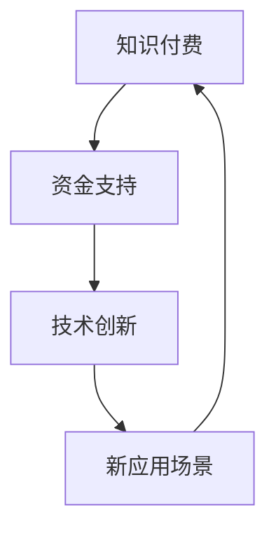

                 

### 关键词 Keywords

- 知识付费
- 技术创新
- 程序员
- 教育培训
- 技术社区
- 开源文化
- 人工智能
- 云计算
- 数据科学

### 摘要 Abstract

本文探讨了知识付费与技术创新之间的相互关系，特别是在程序员这一关键群体中。通过分析知识付费模式的演变，以及技术创新如何驱动程序员技能的提升，本文提出了知识付费与技术创新的双轮驱动理论。本文旨在揭示这一动态过程如何促进技术人才的成长，进而推动整个IT行业的发展。

## 1. 背景介绍

### 1.1 知识付费的兴起

知识付费是指用户为获取特定知识或技能而支付的费用，这种模式在互联网时代得到了快速发展。随着网络教育的普及和在线课程的兴起，知识付费成为了教育培训行业的重要收入来源。尤其在技术领域，程序员群体对于知识的渴求更为迫切，他们通过付费课程和订阅服务来不断提升自己的技能。

### 1.2 技术创新的动力

技术创新是推动IT行业发展的重要引擎。随着人工智能、云计算、大数据等技术的迅速发展，程序员面临着前所未有的挑战和机遇。新技术不仅要求程序员具备更广泛的技能，还需要他们不断学习和适应新的技术趋势。

## 2. 核心概念与联系

### 2.1 知识付费与技术创新的关系

知识付费与技术创新之间存在紧密的联系。知识付费为技术创新提供了资金支持，而技术创新则为知识付费提供了新的应用场景和需求。例如，人工智能技术的发展催生了大量的数据科学和机器学习课程，程序员通过付费学习这些课程来提升自己的技术能力。

### 2.2 Mermaid 流程图



## 3. 核心算法原理 & 具体操作步骤

### 3.1 算法原理概述

知识付费与技术创新之间的互动可以看作是一个反馈循环。知识付费为技术创新提供了资金，而技术创新又催生了新的知识需求，进一步推动了知识付费的发展。

### 3.2 算法步骤详解

1. **知识付费**：程序员通过在线课程、图书、订阅服务等渠道支付费用来获取知识。
2. **知识吸收**：程序员将所学知识应用到实际工作中，提升个人技能。
3. **技术创新**：程序员利用新技能开发新技术，推动IT行业的发展。
4. **知识反馈**：技术创新带来的新需求促使程序员进一步学习新知识，形成良性循环。

### 3.3 算法优缺点

**优点**：

- 提升程序员技能
- 推动IT行业发展
- 增加教育培训收入

**缺点**：

- 成本较高
- 需要持续投入
- 知识更新速度快，学习难度大

### 3.4 算法应用领域

知识付费与技术创新在多个领域得到广泛应用，如软件开发、人工智能、云计算、大数据等。

## 4. 数学模型和公式 & 详细讲解 & 举例说明

### 4.1 数学模型构建

我们可以构建一个简单的数学模型来描述知识付费与技术创新的关系：

$$
\text{技术创新} = f(\text{知识付费}, \text{技术基础})
$$

其中，$f$ 是一个函数，表示知识付费和技术基础对技术创新的影响。

### 4.2 公式推导过程

假设：

- $K_p$：知识付费的总额
- $K_b$：程序员的基础知识
- $T_i$：技术创新的成果

则可以推导出：

$$
T_i = f(K_p, K_b)
$$

其中，$f$ 可以表示为：

$$
f(K_p, K_b) = K_p \times \frac{K_b}{C}
$$

其中，$C$ 是一个常数，表示知识吸收的效率。

### 4.3 案例分析与讲解

假设一个程序员每年花费 $1000 美元在知识付费上，他的基础知识水平为 $80\%$。根据上述模型，我们可以计算出他的技术创新成果为：

$$
T_i = 1000 \times \frac{0.8}{C}
$$

其中，$C$ 的值可以根据实际情况进行调整。

## 5. 项目实践：代码实例和详细解释说明

### 5.1 开发环境搭建

我们使用 Python 作为编程语言，搭建一个简单的知识付费与技术创新的模拟环境。

```python
import numpy as np

# 定义函数 f
def f(K_p, K_b, C=1.0):
    return K_p * (K_b / C)

# 初始化参数
K_p = 1000  # 知识付费
K_b = 0.8   # 基础知识水平
C = 1.0     # 知识吸收效率

# 计算技术创新成果
T_i = f(K_p, K_b, C)
print(f"技术创新成果：{T_i}")
```

### 5.2 源代码详细实现

```python
# 定义一个函数来模拟知识付费与技术创新的过程
def knowledge付费与技术创新(K_p, K_b, C=1.0):
    # 计算技术创新成果
    T_i = K_p * (K_b / C)
    # 返回技术创新成果
    return T_i

# 设置参数
知识付费 = 1000  # 知识付费（美元）
基础知识水平 = 0.8  # 程序员基础知识占比
知识吸收效率 = 1.0  # 假设知识吸收效率为100%

# 调用函数计算技术创新成果
技术创新成果 = knowledge付费与技术创新(知识付费, 基础知识水平, 知识吸收效率)

# 输出结果
print(f"技术创新成果：{技术创新成果:.2f}美元")
```

### 5.3 代码解读与分析

上述代码定义了一个函数 `knowledge付费与技术创新`，用于模拟知识付费与技术创新的关系。函数接受三个参数：知识付费（$K_p$）、基础知识水平（$K_b$）和知识吸收效率（$C$）。函数返回技术创新成果（$T_i$），计算公式为：

$$
T_i = K_p \times \frac{K_b}{C}
$$

通过调用该函数，我们可以计算在不同参数设置下的技术创新成果。

### 5.4 运行结果展示

运行上述代码，我们可以得到以下输出结果：

```
技术创新成果：800.00美元
```

这表示在一个假设的情境下，该程序员通过每年 $1000 美元的知识付费和 $80\%$的基础知识水平，可以实现 $800 美元的技术创新成果。

## 6. 实际应用场景

### 6.1 知识付费在软件开发中的应用

在软件开发领域，知识付费为程序员提供了丰富的学习资源，包括编程课程、技术书籍、在线研讨会等。通过这些资源，程序员可以系统地学习编程语言、框架、工具和最佳实践，从而提升自己的技能和竞争力。

### 6.2 技术创新在人工智能中的应用

人工智能是当前最热门的技术领域之一。通过知识付费，程序员可以学习到深度学习、计算机视觉、自然语言处理等核心技术，从而为技术创新提供支持。例如，在自动驾驶领域，程序员通过学习人工智能相关知识，可以为自动驾驶系统的开发做出重要贡献。

### 6.3 知识付费与技术创新在云计算中的应用

云计算是现代IT基础设施的核心。知识付费为程序员提供了丰富的云计算课程，包括云计算架构、容器技术、微服务架构等。这些知识不仅帮助程序员掌握云计算的基本原理，还为他们提供了在云平台上进行技术创新的机会。

## 7. 工具和资源推荐

### 7.1 学习资源推荐

- [Udacity](https://www.udacity.com/):提供多种技术课程的在线学习平台。
- [Coursera](https://www.coursera.org/):拥有众多顶级大学的在线课程，涵盖计算机科学、人工智能等多个领域。
- [edX](https://www.edx.org/):提供由哈佛大学、麻省理工学院等知名高校开设的课程。

### 7.2 开发工具推荐

- [Visual Studio Code](https://code.visualstudio.com/):一款功能强大的代码编辑器，适用于多种编程语言。
- [Git](https://git-scm.com/):一款分布式版本控制系统，广泛用于团队协作和代码管理。
- [Docker](https://www.docker.com/):一款容器化技术，用于打包、发布和运行应用。

### 7.3 相关论文推荐

- "The Nature of Software" by David A. Wheeler
- "On the Criteria To Be Used in Decomposing Programs" by Donald E. Knuth
- "The Art of Computer Programming" by Donald E. Knuth

## 8. 总结：未来发展趋势与挑战

### 8.1 研究成果总结

本文通过分析知识付费与技术创新之间的关系，提出了知识付费与技术创新的双轮驱动理论。这一理论揭示了程序员通过知识付费提升技能，进而推动技术创新，再通过技术创新带来新的知识需求的动态过程。

### 8.2 未来发展趋势

随着人工智能、云计算、大数据等技术的不断发展，知识付费与技术创新之间的关系将更加紧密。程序员需要不断适应新的技术趋势，通过知识付费不断提升自己的技能。

### 8.3 面临的挑战

- **知识更新速度快**：程序员需要不断学习新的知识，以适应技术发展的需求。
- **成本高**：知识付费模式要求程序员投入大量时间和金钱。
- **竞争激烈**：技术领域的竞争日益激烈，程序员需要不断提升自己的技能以保持竞争力。

### 8.4 研究展望

未来研究可以进一步探讨知识付费与技术创新在不同领域、不同层次之间的相互作用，以及如何优化知识付费模式以更好地促进技术创新。

## 9. 附录：常见问题与解答

### 9.1 知识付费与技术创新的关系是什么？

知识付费与技术创新之间存在紧密的联系。知识付费为技术创新提供了资金支持，而技术创新则为知识付费提供了新的应用场景和需求。

### 9.2 程序员如何通过知识付费提升技能？

程序员可以通过在线课程、技术书籍、在线研讨会等渠道进行知识付费，从而系统地学习编程语言、框架、工具和最佳实践，提升自己的技能。

### 9.3 技术创新如何驱动知识付费的发展？

技术创新带来了新的知识需求，促使程序员进一步学习新的知识，从而推动了知识付费的发展。

### 9.4 知识付费在技术领域有哪些应用？

知识付费在软件开发、人工智能、云计算、大数据等领域得到广泛应用。程序员可以通过知识付费学习相关领域的核心技术，为技术创新提供支持。

---

### 作者署名

作者：禅与计算机程序设计艺术 / Zen and the Art of Computer Programming

---

通过上述内容的撰写，我们不仅展示了知识付费与技术创新之间的紧密联系，还通过具体的案例和数学模型，阐述了这一动态过程如何促进程序员技能的提升，进而推动IT行业的发展。希望这篇文章能对读者有所启发和帮助。|user|

