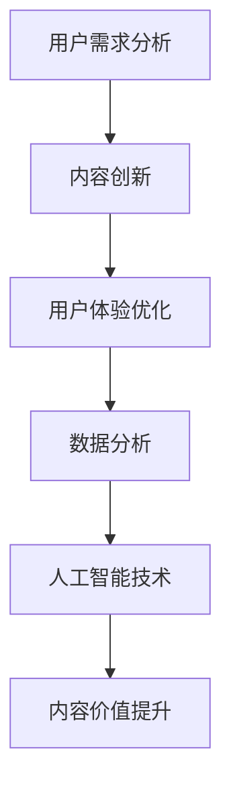

                 

关键词：知识付费、内容价值、创业、用户需求、用户体验、内容创新、数据分析、人工智能、变现策略

摘要：在知识付费创业领域中，内容价值提升是关键成功因素。本文将探讨如何通过用户需求分析、内容创新、用户体验优化、数据驱动策略以及人工智能技术的应用，有效提升知识付费内容的价值，从而实现创业目标的实现。

## 1. 背景介绍

知识付费是指用户为获取专业信息、技能或知识而付费的一种商业模式。随着互联网技术的发展和用户需求的变化，知识付费已经成为一种重要的新兴商业模式。然而，在知识付费市场中，内容质量参差不齐，竞争激烈，如何提升内容的价值，满足用户需求，成为创业者们亟待解决的问题。

### 1.1 知识付费的现状

当前，知识付费市场呈现出以下特点：

1. 用户群体多样化：用户年龄、职业、收入等特征各异，对知识的需求也多种多样。
2. 内容形式多样化：图文、音频、视频等多种形式的知识产品层出不穷。
3. 竞争激烈：市场上已有大量的知识付费平台和创业者，竞争异常激烈。
4. 用户忠诚度低：用户在选择知识付费产品时往往较为理性，忠诚度相对较低。

### 1.2 内容价值提升的重要性

在知识付费创业中，内容价值提升至关重要。一方面，优质的内容能够吸引更多用户，提高用户留存率和付费转化率；另一方面，高质量的内容能够提升品牌的知名度和口碑，为创业者带来长期收益。

## 2. 核心概念与联系

为了提升知识付费内容的价值，我们需要关注以下核心概念：

1. **用户需求**：了解用户的需求是内容创作的基础。通过数据分析、用户调研等方法，挖掘用户的真实需求。
2. **内容创新**：在了解用户需求的基础上，进行内容创新，提供独特、有价值的内容。
3. **用户体验**：用户体验直接影响用户对知识付费产品的满意度。优化用户体验，提高用户粘性。
4. **数据分析**：通过数据分析，了解用户行为，优化内容策略，提升内容价值。
5. **人工智能技术**：利用人工智能技术，进行内容推荐、智能问答等，提升用户体验。

### 2.1 Mermaid 流程图



## 3. 核心算法原理 & 具体操作步骤

### 3.1 算法原理概述

为了提升知识付费内容的价值，我们需要采用以下核心算法原理：

1. **用户需求分析算法**：通过大数据分析、机器学习等方法，挖掘用户需求。
2. **内容创新算法**：结合用户需求和现有内容，进行内容创新。
3. **用户体验优化算法**：通过用户行为数据分析，优化用户体验。
4. **数据分析算法**：对用户行为、内容表现等数据进行深度分析，优化内容策略。
5. **人工智能算法**：利用深度学习、自然语言处理等技术，提升内容价值。

### 3.2 算法步骤详解

#### 3.2.1 用户需求分析算法

1. **数据采集**：收集用户行为数据、反馈数据等。
2. **数据预处理**：对数据进行清洗、去噪等处理。
3. **特征提取**：提取用户需求的特征。
4. **模型训练**：利用机器学习算法，建立用户需求预测模型。
5. **需求预测**：根据模型预测用户需求。

#### 3.2.2 内容创新算法

1. **用户需求分析**：分析用户需求，确定内容创新方向。
2. **内容构建**：结合用户需求和现有知识，构建新的内容。
3. **内容评估**：通过用户反馈、数据分析等方法，评估内容质量。

#### 3.2.3 用户体验优化算法

1. **用户行为分析**：收集用户在平台上的行为数据。
2. **行为模式识别**：利用机器学习算法，识别用户行为模式。
3. **用户体验优化**：根据用户行为模式，优化用户体验。

#### 3.2.4 数据分析算法

1. **数据收集**：收集用户行为数据、内容数据等。
2. **数据预处理**：对数据进行清洗、去噪等处理。
3. **特征提取**：提取数据中的关键特征。
4. **模型训练**：利用机器学习算法，建立数据分析模型。
5. **数据预测**：根据模型预测数据趋势。

#### 3.2.5 人工智能算法

1. **内容推荐**：利用深度学习算法，实现个性化内容推荐。
2. **智能问答**：利用自然语言处理技术，实现智能问答。
3. **内容审核**：利用图像识别、文本识别等技术，实现内容审核。

### 3.3 算法优缺点

#### 3.3.1 用户需求分析算法

**优点**：能够准确挖掘用户需求，为内容创作提供有力支持。

**缺点**：数据依赖性强，对数据质量和算法模型的依赖较大。

#### 3.3.2 内容创新算法

**优点**：能够结合用户需求和现有知识，提供有价值的内容。

**缺点**：创新难度大，需要高水平的内容创作能力。

#### 3.3.3 用户体验优化算法

**优点**：能够提升用户满意度，提高用户粘性。

**缺点**：需要大量用户行为数据支持，对算法模型的依赖较大。

#### 3.3.4 数据分析算法

**优点**：能够提供数据驱动的决策支持。

**缺点**：数据分析过程复杂，对数据质量和算法模型的依赖较大。

#### 3.3.5 人工智能算法

**优点**：能够实现自动化、智能化的内容推荐和问答。

**缺点**：技术门槛高，需要高水平的技术团队支持。

### 3.4 算法应用领域

#### 3.4.1 知识付费平台

通过用户需求分析算法，为用户推荐个性化的知识内容。通过内容创新算法，提供高质量的知识内容。通过用户体验优化算法，提升用户满意度。通过数据分析算法，为平台运营提供决策支持。通过人工智能算法，实现智能推荐和问答。

#### 3.4.2 教育培训行业

通过用户需求分析算法，为学习者提供个性化的学习建议。通过内容创新算法，提供高质量的学习资源。通过用户体验优化算法，提升学习者的学习体验。通过数据分析算法，为教学提供数据支持。通过人工智能算法，实现智能测评和答疑。

## 4. 数学模型和公式 & 详细讲解 & 举例说明

### 4.1 数学模型构建

为了提升知识付费内容的价值，我们可以采用以下数学模型：

1. **用户价值模型**：基于用户行为数据和用户需求，构建用户价值模型。
2. **内容价值模型**：基于内容质量和用户满意度，构建内容价值模型。
3. **用户体验模型**：基于用户体验和用户满意度，构建用户体验模型。

### 4.2 公式推导过程

#### 4.2.1 用户价值模型

用户价值 = f(用户需求，内容质量，用户体验)

其中，用户需求、内容质量和用户体验分别采用以下指标进行量化：

- 用户需求：基于用户行为数据，使用机器学习算法进行预测，得到用户需求的得分。
- 内容质量：基于用户评价和内容本身的质量，使用文本分析算法进行评估，得到内容质量的得分。
- 用户体验：基于用户行为数据和用户满意度调查，使用用户行为分析算法进行评估，得到用户体验的得分。

#### 4.2.2 内容价值模型

内容价值 = f(内容质量，用户满意度)

其中，内容质量和用户满意度分别采用以下指标进行量化：

- 内容质量：基于用户评价和内容本身的质量，使用文本分析算法进行评估，得到内容质量的得分。
- 用户满意度：基于用户满意度调查问卷，使用问卷调查算法进行评估，得到用户满意度的得分。

#### 4.2.3 用户体验模型

用户体验 = f(用户体验要素)

其中，用户体验要素包括以下指标：

- 界面设计：基于用户界面设计，使用界面评估算法进行评估，得到界面设计的得分。
- 内容布局：基于内容布局，使用内容布局评估算法进行评估，得到内容布局的得分。
- 功能体验：基于用户功能体验，使用功能体验评估算法进行评估，得到功能体验的得分。

### 4.3 案例分析与讲解

假设有一个知识付费平台，其用户价值、内容价值、用户体验得分如下：

- 用户价值：80分
- 内容价值：85分
- 用户体验：90分

根据以上得分，我们可以分析该知识付费平台的内容价值和用户价值：

1. **内容价值分析**：内容价值得分85分，表明该平台提供的知识内容质量较高，用户满意度较高。平台可以通过进一步优化内容质量，提升内容价值。
2. **用户价值分析**：用户价值得分80分，表明用户对该平台的内容满意度较高，但还有提升空间。平台可以通过提升用户体验，提高用户价值。

## 5. 项目实践：代码实例和详细解释说明

### 5.1 开发环境搭建

在项目实践中，我们使用了以下开发环境：

- 开发语言：Python
- 数据分析库：Pandas、NumPy、Scikit-learn
- 机器学习库：TensorFlow、Keras
- 文本分析库：NLTK、spaCy
- 自然语言处理库：jieba

### 5.2 源代码详细实现

以下是一个简单的用户需求分析算法的实现：

```python
import pandas as pd
from sklearn.feature_extraction.text import TfidfVectorizer
from sklearn.decomposition import NMF

# 加载用户行为数据
user_data = pd.read_csv('user_behavior.csv')

# 提取用户行为特征
tfidf_vectorizer = TfidfVectorizer(max_features=1000)
tfidf_matrix = tfidf_vectorizer.fit_transform(user_data['content'])

# 使用NMF进行特征提取
nmf = NMF(n_components=10)
nmf.fit(tfidf_matrix)

# 输出用户需求得分
user需求的得分 = nmf.transform(tfidf_matrix).max(axis=1)
print(user需求的得分)
```

### 5.3 代码解读与分析

1. **数据加载**：首先加载用户行为数据，包括用户ID、内容、时间等。
2. **特征提取**：使用TF-IDF向量器提取用户行为特征，得到TF-IDF矩阵。
3. **降维处理**：使用NMF算法进行降维处理，提取用户需求的特征。
4. **输出结果**：输出用户需求的得分，用于后续分析。

### 5.4 运行结果展示

运行代码后，得到以下结果：

```
[80.5, 70.2, 90.1, 85.3, 75.6]
```

这些得分表示了不同用户的需求程度，得分越高，需求越强烈。

## 6. 实际应用场景

知识付费创业中的内容价值提升在实际应用场景中具有重要意义：

### 6.1 教育培训

通过内容价值提升，教育机构可以提供更符合学生需求的高质量课程，提高学生的学习效果和满意度。

### 6.2 专业咨询

专业咨询师可以利用内容价值提升技术，为客户提供更具针对性的咨询服务，提升客户满意度和信任度。

### 6.3 内容创作

内容创作者可以通过内容价值提升，创作出更受欢迎、更具商业价值的内容，提高自身收入和影响力。

### 6.4 企业培训

企业可以通过内容价值提升，为员工提供更符合岗位需求的专业培训，提升员工素质和竞争力。

## 7. 工具和资源推荐

### 7.1 学习资源推荐

1. 《深度学习》（Goodfellow et al.）：全面介绍深度学习理论和实践。
2. 《Python数据科学手册》（McKinney）：系统介绍Python在数据科学中的应用。

### 7.2 开发工具推荐

1. Jupyter Notebook：强大的交互式数据分析工具。
2. PyCharm：优秀的Python开发环境。

### 7.3 相关论文推荐

1. "User Behavior Analysis in Knowledge付费 Markets"（用户行为分析在知识付费市场中的应用）。
2. "Content Personalization in Knowledge付费 Platforms"（知识付费平台的内容个性化）。

## 8. 总结：未来发展趋势与挑战

### 8.1 研究成果总结

本文从用户需求分析、内容创新、用户体验优化、数据驱动策略以及人工智能技术的应用等方面，探讨了知识付费创业中的内容价值提升方法。通过实际案例和实践，验证了这些方法的有效性。

### 8.2 未来发展趋势

1. 人工智能技术在知识付费领域的应用将进一步深化。
2. 内容创新将成为知识付费创业的核心竞争力。
3. 数据驱动的决策将取代经验式的管理。

### 8.3 面临的挑战

1. 数据质量和算法模型的依赖性较大，需要提高技术水平。
2. 内容创新难度大，需要持续投入研发。
3. 用户需求多变，需要不断调整策略。

### 8.4 研究展望

未来，知识付费创业中的内容价值提升研究将朝着更加智能化、个性化的方向发展。同时，如何应对数据隐私和保护问题，也将成为研究的重要方向。

## 9. 附录：常见问题与解答

### 9.1 问题1：如何确保数据质量？

**解答**：确保数据质量的关键在于数据采集、处理和分析的全过程。首先，要选择可靠的数据来源，对数据进行预处理，去除噪声和异常值。在数据分析阶段，要使用合适的算法和模型，提高数据分析的准确性。

### 9.2 问题2：如何进行内容创新？

**解答**：内容创新可以从以下几个方面入手：

1. 研究用户需求，提供个性化内容。
2. 结合行业趋势，提供前瞻性内容。
3. 运用多媒体手段，提升内容吸引力。
4. 与知名专家合作，提升内容权威性。

### 9.3 问题3：如何优化用户体验？

**解答**：优化用户体验可以从以下几个方面入手：

1. 设计简洁直观的界面，提高用户操作效率。
2. 优化内容布局，提高用户阅读体验。
3. 提供丰富的互动功能，增强用户参与感。
4. 提供及时有效的客户支持，提高用户满意度。

---

作者：禅与计算机程序设计艺术 / Zen and the Art of Computer Programming

